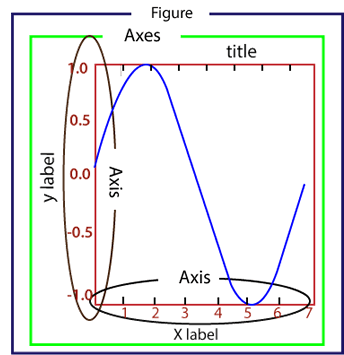
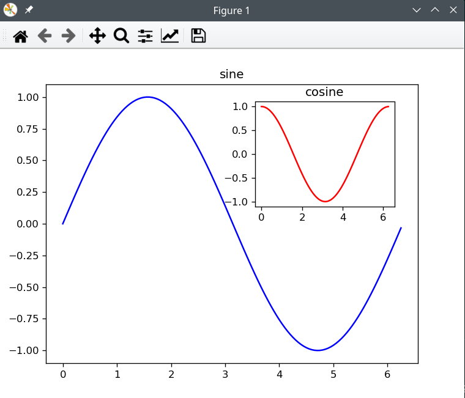
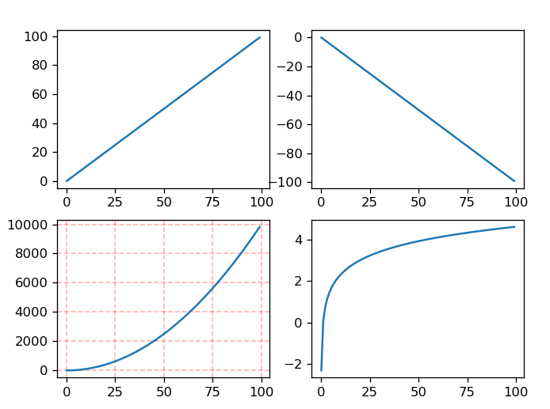
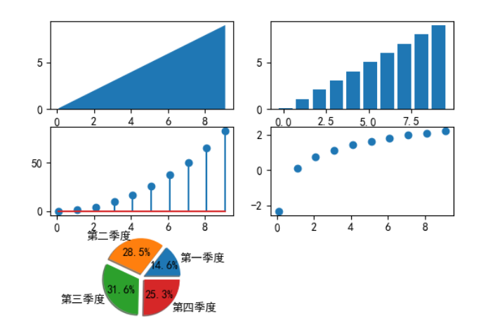
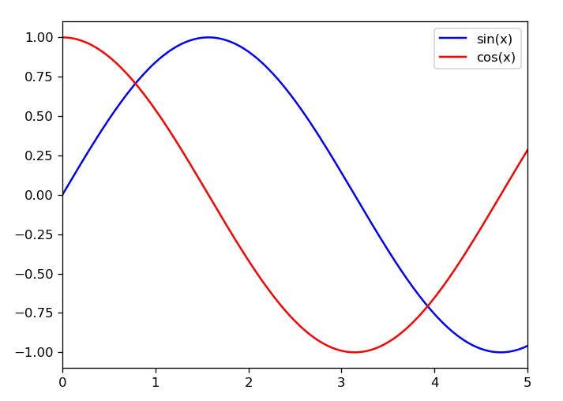

## 一、NumPy

### 1.1 参考资料

这篇文章写得实在是太好了[图解链接](https://zhuanlan.zhihu.com/p/396444973?utm_campaign=shareopn&utm_medium=social&utm_oi=1124048358603636736&utm_psn=1564313588545552384&utm_source=wechat_session) 。

### 1.2 Array Matrix

这两种东西是不一样的，`np.array` 也可以有多维，但是它的 `*` 就是点对点乘法，而 `@` 是点乘。但是对于 `np.matrix` 来说，无论是 `*` 还是 `@` 都是**点乘**，`sp.Matrix` 同理。有如下演示

```python
a3 = [[1, 2],
      [3, 4]]
a3 = np.matrix(a3)
a4 = [[5, 6],
      [7, 8]]
a4 = np.matrix(a4)
print("np.matrix")
print(a3 * a4)
print(a3 @ a4)
a3 = [[1, 2],
      [3, 4]]
a3 = np.array(a3)
a4 = [[5, 6],
      [7, 8]]
a4 = np.array(a4)
print("np.array")
print(a3 * a4)
print(a3 @ a4)
i, j = sp.symbols('i, j')
a3 = [[i, i],
      [i, i]]
a3 = sp.Matrix(a3)
a4 = [[j, j],
      [j, j]]
a4 = sp.Matrix(a4)
print("sp.Matrix")
print(a3 * a4)
print(a3 @ a4)
```

输出为

```shell
np.matrix
[[19 22]
 [43 50]]
[[19 22]
 [43 50]]
np.array
[[ 5 12]
 [21 32]]
[[19 22]
 [43 50]]
sp.Matrix
Matrix([[2*i*j, 2*i*j], [2*i*j, 2*i*j]])
Matrix([[2*i*j, 2*i*j], [2*i*j, 2*i*j]])
```

### 1.3 文件操作

`genfromtxt` 可以从文件（或者字符串）中读取数据，并且转化成 `np.Array` 类型，具体用法如下

```python
data=np.genfromtxt("data.txt", delimiter=",", dtype=int, autostrip=True, comments="#")
print(type(data))
print(data)
print(sum(data))
```

`data.txt` 如下

```
1, 2, 3, 4, 5 # this is a comment
```

最终输出为

```shell
<class 'numpy.ndarray'>
[1 2 3 4 5]
15
```

如果文件是多行的，那么就会读出一个二维的 `Array` 来，新的 `data.txt`

```shell
1, 2, 3, 4, 5       # this is a comment.
6, 7, 8, 9, 10      # this is a comment, too.
11, 12, 13, 14, 15  
```

最终的结果是

```
<class 'numpy.ndarray'>
[[ 1  2  3  4  5]
 [ 6  7  8  9 10]
 [11 12 13 14 15]]
```

如果想要控制读取的数据的范围，还可以

```python
data=np.genfromtxt("data.txt", delimiter=",", dtype=int, autostrip=True, comments="#", usecols=range(4), skip_header=1, skip_footer=1)
```

其中的参数

| 参数        | 含义                     |
| ----------- | ------------------------ |
| fname       | 文件名                   |
| delimiter   | 分隔符                   |
| dtype       | 数据的类型               |
| autostrip   | 自动去掉空白符           |
| comments    | 从指定符号后部分视为注释 |
| skip_header | 在开头跳过几行           |
| skip_footer | 在结尾跳过几行           |
| usecols     | 读取的列数               |

### 1.4 SymPy 和 NumPy

这个问题我也没有太好的思考，只能说尽管两者十分相似，比如说都有 `array` 结构，但是二者是并不能显然的混用的，`numpy` 本质上操作的依然是 python 基础的数据类型，但是 SymPy 操作的基本对象，已经变成了它定义的对象了。 

换句话说，`sympy`  的隔离性更好。

----


## 二、SymPy

### 2.1 变量

有两种方法，似乎并没有差别

```python
x, y = sp.symbols('x, y')
k = sp.var('k')
```

最后声明出来的 `x, y, k` 都是符号对象，如下所示

```python
print(type(x))
<class 'sympy.core.symbol.Symbol'>
```

我们可以通过在声明上加**假设条件**，来获得更加精确的结果，比如说

```python
x_normal = sp.symbols('x_normal')
# 是否是符号
print(x.is_Symbol)
x_positive = sp.symbols('x_positive', positive=True)
# 是否是正数
print(x_positive.is_positive)
x_real = sp.symbols('x_real', real=True)
# 是否是实数
print(x_real.is_real)
# 是否是虚数
print(x_real.is_imaginary)
# 是否是复数
print(x_real.is_complex)
x_integer = sp.symbols('x_integer', integer=True)
# 是否是整数
print(x_integer.is_integer)
```

另外对于变量的声明也有一些批量声明的技术

```python
x_array = sp.symbols('x0:5')
print(x_array)
output:
(x0, x1, x2, x3, x4)
```

### 2.2 常量

为了保护常量的“纯洁性”，我们可以用 `sympy.S()` 来声明常量，比如说

```python
print(1 / 13)				# 0.07692307692307693
print(sp.S(1) / sp.S(13))	# 1/13
```

可以看到常量的纯洁性被很好的保护了起来。

我们可以看一下常量的类型

```python
print(type(sp.S(1)))		# <class 'sympy.core.numbers.One'>
print(type(sp.S(13)))		# <class 'sympy.core.numbers.Integer'>
```

可以看到似乎都是在 `core.numbers` 中的

除了可以自己设置常量，`sympy` 还提供了一些默认的常量

```python
print(sp.pi)			# pi
print(type(sp.pi))		# <class 'sympy.core.numbers.Pi'>0
print(sp.I)				# I
print(type(sp.I))		# <class 'sympy.core.numbers.ImaginaryUnit'>
print(type(sp.oo))		# <class 'sympy.core.numbers.Infinity'>
```

### 2.3 表达式

为了表示 `a + b`，可以使用 `sp` 的内置函数

```python
a, b = sp.symbols('a, b')
print(sp.Add(a, b))
```

当然方便的 python 肯定会重载运算符，所以一定有以下的等价写法

```python
print(a + b)
```

与之类似的还有 `Pow, Add, Sin, Cos, Mul` 之类的，能完成重载的，都完成了重载。

```python
e = sp.Add(sp.Mul(a, b, c), sp.Pow(a, b), sp.sin(c))
print(e)
```

最后输出为

```shell
a*b*c + a**b + sin(c)
```

本质是和这个相同的

```python
e_2 = a*b*c + a**b + sp.sin(c)
print(e_2)
```

Add 不是一个方法，而是一个类（所以上面的方法其实是构造器方法），他有两个重要的属性，`func` 属性得到对象的类，而 `args` 得到其参数。使用这两个属性可以观察 `SymPy` 所创建的表达式

```python
t = x - y
print(t.func)
print(t.args)
```

输出为

```python
<class 'sympy.core.add.Add'>
(x, -y)
```

其实本质上说，构建的表达式就和 `TensorFlow` 一样，是构建了一幅表达式树。我们可以写一个函数来显示这个事情

```python
def print_expression(e, level=0):
    spaces = "   " * level
    if level != 0:
        spaces = spaces[:-3]
        spaces += "|__"
    if isinstance(e, (sp.Symbol, sp.Number)):
        print(spaces + str(e))
        return
    if len(e.args) > 0:
        print(spaces + e.func.__name__)
        for arg in e.args:
            print_expression(arg, level + 1)
    else:
        print(spaces + e.func.__name__)

e_2 = a * b * c + a**b + sp.sin(c)
print_expression(e_2)
```

可以看到输出如图

```python
Add
|__Pow
   |__a
   |__b
|__Mul
   |__a
   |__b
   |__c
|__sin
   |__c
```

似乎只要是大写开头的构造器方法，都会生成一个节点，比如说更加复杂的**函数 Function**

```python
e_3 = sp.Eq(sp.Derivative(x**2+y**2, x), 7)
print(e_3)
print_expression(e_3)
```

会输出

```
Equality
|__Derivative
   |__Add
      |__Pow
         |__x
         |__2
      |__Pow
         |__y
         |__2
   |__Tuple
      |__x
      |__1
|__7
```

正如 tensorFlow 一样，只要不执行，这个东西绝对不会运算，但是似乎这里的运算不只有 `run` 这一种形式。回头细说。

### 2.4 自定义函数

我们可以自己定义函数，两种形式是等价的

```python
f = sp.Function("f")
print(type(f))
g = sp.symbols("g", cls=sp.Function)
print(type(g))
```

输出为

```shell
<class 'sympy.core.function.UndefinedFunction'>
<class 'sympy.core.function.UndefinedFunction'>
```

与之形成对比的是

```python
print(type(sp.Derivative(x**2 + y**2, x)))
```

输出为

```shell
<class 'sympy.core.function.Derivative'>
```

请注意 `Function` 虽然是一个类，但是上面的语句所得到的 `f` 并不是 `Function` 类的实例。和预定义的数学函数一样，`f` 是一个类，它从 `Function` 类继承。只有指定了具体的参数（本质是将 `f` 做为一个构造器），才可以实例化出这样的函数，如下所示：

```python
t = f(x, y)
print(type(t))      # f
print(t.func)       # f
print(t.args)       # (x, y)
```

有一个很有意思的事情，就是自定义函数并没有我们常以为的“表示某种特定的符号和运算符的组合”的效果，因为这个定义其实是

```python
sp.Derivative(x**2 + y**2, x)
```

就可以完成的。所以 `f(x, y)` 就真的只是 `f(x, y)` ，我们并不知道里面是啥内容，而且永远不知道，它就真的只是一个函数符号的意思。

所以我们一般用它来实现函数本身的求解（不是求解某个变量）。比如求解数列的通项公式，微分方程的求解。

### 2.5 关系

最近只用到了 `Eq` 来构造方程，里面似乎包括很多种，比如说 `Less` 啥的

```python
print(type(e_3))    # <class 'sympy.core.relational.Equality'>
```

在 `SymPy` 中，表达式可以直接表示值为 0 的方程，这使得后面的各种操作会更加灵活。

### 2.6 矩阵

矩阵的声明方法与 `numpy` 中的类似

```python
A = sp.Matrix([[x, a], [b, y]])
print(A)
print(A.is_Matrix)
print(type(A))
```

输出为

```shell
Matrix([[x, a], [b, y]])
True
<class 'sympy.matrices.dense.MutableDenseMatrix'>
```

并且和 `numpy` 一样，都重载了运算符

```python
print(A * 3)
print(type(A * 3))
print(A @ B)
print(type(A @ B))
print(A.T)
print(A**2)
print(type(A**2))
```

输出为

```shell
Matrix([[3*x, 3*a], [3*b, 3*y]])
<class 'sympy.matrices.dense.MutableDenseMatrix'>
Matrix([[2*a + x], [b + 2*y]])
<class 'sympy.matrices.dense.MutableDenseMatrix'>
Matrix([[x, b], [a, y]])
Matrix([[a*b + x**2, a*x + a*y], [b*x + b*y, a*b + y**2]])
<class 'sympy.matrices.dense.MutableDenseMatrix'>
```

可以看到，不再有表达式树的结构了。希望表达式树，似乎应该求助 `TensorFlow` 。

### 2.7 操作

运算一般都是对于表达式对象或者方程对象进行操作。

#### 2.7.1 变形

化简

```shell
simplify((x+2)**2 - (x+1)**2)
```

展开

```python
expand(log(x*y**2))
```

替换

```python
# 待定系数法
xn = c1 * lams[0]**n + c2 * lams[1]**n
x0 = xn.subs(n, 0)
x1 = xn.subs(n, 1)
```

可以利用 `subs` 将某个表达式换成一个新的表达式（不一定非得是常量）。

级数展开

```python
print((1/cos(x)).series(x, 0, 10))
```

输出

```
1 + x**2/2 + 5*x**4/24 + 61*x**6/720 + 277*x**8/8064 + O(x**10)
```

#### 2.7.2 求解

`solve` 可以求解普通方程

```python
solve(a*x**2+b*x+c, x)
```

也可以求解方程组，后面需要依次写定要求解的变量，比如这里的 `x, y`

```python
solve ((x**2+x*y+1, y ** 2+x*y+2 ), x, y )
```

`dsolve` 用于微分方程的求解

```python
dsolve(Derivative(f(x),x) - f(x), f(x))
```

`rsolve` 用于递归表达式的求解（可以用于解差分方程），相对于需要给出带求解的通项表达式，还需要给出初始值。

```python
# 声明变量
n = sp.var('n')

# 声明递归表达式
x = sp.Function('x')
f = 2 * x(n + 2) - x(n + 1) - 2 * x(n)

# 调库求解
xn = sp.rsolve(f, x(n), {x(0): -2, x(1): 0})
```

#### 2.7.3 微积分

微积分都用两种方式，因为微分和积分都是有固定的 `Function` 去描述的，所以可以直接求值表达式树，如下

```python
t = Derivative(sin(x), x) 	# 创建了一个导函数对象，表达式后面的参数是对谁求导
print(t.doit())				# 类似于 tensorflow 中的 session.run
```

当然也可以直接用 `diff` ，并且更加直观

```python
diff(sin(2*x), x)			# 不太面向对象
sin(2*x).diff(x)			# 比较面向对象
```

对于多个变量求高阶导数，可以有如下形式

```python
print(diff(sin(x * y), x, 2, y, 3))	# 对 x 求二阶导且对 y 求三阶导数
```

利用 `Integral` 进行不定积分

```python
e = Integral(x*sin(x), x)
e.doit()
```

进行定积分

```python
e2 = Integral(sin(x)/x, (x, 0, 1))
e2.doit()
e2.evalf()
```

不过 `SymPy` 本质是符号运算系统，而定积分本质是数值运算，所以很有可能运算不出来。

对于多重定积分，格式如下

```python
integrate(f, (x, a, b), (y, c, d))
```

对应的表达式如下
$$
\int\limits_{c}^{d}\int\limits_{a}^{b} f{\left(x,y \right)}\, dx\, dy
$$

#### 2.7.4 求极限

```python
limit(sin(x)/x, x, 0)
limit(sin(x)/x, x, oo)
```


---

## 三、SciPy

### 3.1 线性规划

首先谈一下对于线性规划的理解
$$
\tt{object:}  z = max\space c\cdot x \\
\tt{constaint:} A\cdot x = b \\ 
\tt{bound(constaint):} x \ge 0 
$$


本质上，最终的求解结果 $z$ ，可以看做是一个涉及 $c, A, b$ 的**隐函数**，再加上边界条件，我们就可以完成求解，而实际也是这样的，`scipy` 中的 `linprog` 就是这样，只需要输入这些东西，就可以获得一个最大值 $z$ 的结果。其函数签名（简化版）如下

```python
linprog(c, A_ub, b_ub, A_eq, b_eq, bounds)
```

多说无益，举个复杂的例子
$$
min \quad z = -2x_1 - 3x_2 + 5x_3\\
st. 
\begin{cases}
x_1 + x_2 + x_3 = 7\\
2x_1 - 5x_2 + x_3 \ge 10\\
x_1 + 3x_2 + x_3 \le 12
x_1, x_2, x_3 \ge 0
\end{cases}
$$
其求解代码如下

```python
import scipy as sp
import numpy as np

c = np.array([2, 3, -5])                        # 目标方程系数矩阵，因为默认 max，所以这里要取相反数
A_eq = np.array([[1, 1, 1]])                    # 等式系数矩阵
b_eq = np.array([7])                            # 等式增广部分
A_ub = np.array([[-2, 5, -1], [1, 3, 1]])       # 上界(upper bound)系数矩阵，所以第 1 行要取反
b_ub = np.array([-10, 12])                      # 上界增广部分
bounds = [(0, 7), (0, 7), (0, 7)]               # 约束条件，每个的范围都是 0 ~ 7
# 求解
result = sp.optimize.linprog(-c, A_ub=A_ub, b_ub=b_ub, A_eq=A_eq, b_eq=b_eq, bounds=bounds)
print('最优解为:', result.x)
print('最优值为:', result.fun)
```

输出如下

```python
最优解为: [6.42857143 0.57142857 0.        ]
最优值为: -14.571428571428573
```

### 3.2 拟合

`scipy` 有内置的拟合函数，大致写法如下

```python
scipy.optimize.curve_fit(f, xdata, ydata, p0, maxfev)
```

其参数有：

- `f` ：拟合函数的形式，是一个函数，其函数参数就是我们拟合的时候需要的东西
- `xdata` ：自变量数据
- `ydata` ：因变量数据
- `p0` ：起始数据（给出的是 `f` 的参数），可以不指定，指定后有可能会使迭代变快，不过更多的用于规范参数的格式（`f` 有可能含有变长参数）
- `maxfev` ：最大拟合次数

其返回值为

```python
# 返回值
popt: 数组，参数的最佳值，以使的平方残差之和最小。f(xdata, *popt) - ydata
pcov: 二维阵列，popt的估计协方差。对角线提供参数估计的方差。
```

可以看出，我们最想要的是 `popt` ，对于 `pcov` 课程不太涉及。

常见例子为

```python
def my_func1(x, w1, a1, b1, w2, a2, b2):
    return w1 * Gauss(x, a1, b1) + w2 * Gauss(x, a2, b2)
    
popt = optimize.curve_fit(my_func1, x_train, y_train, maxfev=500000)[0] # 因为不需要 pcov，所以只要第一个返回值
```


----


## 四、CvxPy 

### 4.1 更加自然

 `cvxpy` 是在学线性规划的时候介绍的，在我的理解中，线性规划问题可以用 `SciPy` 库去求解，`cvxpy` 似乎是为了让线性规划的描述更加自然而开发的包，比如说在 3.1 具的例子，如果用 `cvxpy` 来写的话，可以写成这样
$$
min \quad z = -2x_1 - 3x_2 + 5x_3\\
st. 
\begin{cases}
x_1 + x_2 + x_3 = 7\\
2x_1 - 5x_2 + x_3 \ge 10\\
x_1 + 3x_2 + x_3 \le 12
x_1, x_2, x_3 \ge 0
\end{cases}
$$

```python
x = cp.Variable(3, pos=True)                            # 声明变量
obj = cp.Minimize(-2 * x[0] - 3 * x[1] + 5 * x[2])      # 声明目标函数
cons = [                                                # 声明约束条件
    x[0] + x[1] + x[2] == 7,
    2 * x[0] - 5 * x[1] + x[2] >= 10,
    x[0] + 3 * x[1] + x[2] <= 12,
]

prob=cp.Problem(obj, cons)  
prob.solve()                                            # 求解

print("最优值为:", prob.value)
print("最优解为:", x.value)

print(type(x))
print(type(obj))
print(type(cons))
```

最后输出为

```shell
最优值为: -14.571428570710513
最优解为: [6.42857143 0.57142857 0.        ]
<class 'cvxpy.expressions.variable.Variable'>
<class 'cvxpy.problems.objective.Minimize'>
<class 'list'>
```

### 4.2 凸优化

cvxpy 本质上是一个凸优化库，所以不是凸优化的问题是没有办法用这个库来求解的。

---


## 五、Matplotlib

### 5.1 架构

如图所示




但是似乎学不学的吧，因为这种比较普世和灵活，如果只是为了应付简单的画图任务，完全不需要这种复杂的结构，其比较规范的结构如下所示

```python
import matplotlib.pyplot as plt
import numpy as np

# 绘图数据
x = np.arange(0, np.pi*2, 0.05)
y = np.sin(x)

# 首先创建画布
fig = plt.figure()

# 添加两个轴区域（也就是有坐标轴的区域）
axes1 = fig.add_axes([0.1, 0.1, 0.8, 0.8]) # main axes
axes2 = fig.add_axes([0.55, 0.55, 0.3, 0.3]) # inset axes

# 在两个区域上分别绘图
axes1.plot(x, y, 'b')
axes2.plot(x,np.cos(x),'r')
# 为轴区域设置一些标签
axes1.set_title('sine')
axes2.set_title("cosine")

# 展示
plt.show()
```

其效果如下，可以看到很灵活



另外我们一般只用 `pyplot`，虽然我不知道为啥，但是写成这样就可以了

```python
from matplotlib import pyplot as plt
```

### 5.2 基本操作

首先说，下面的代码似乎并不规整，规整的代码是先创建一个 `figure` 然后再其上创建 `Axes` 然后再干一大堆事情，但是我懒了，所以就选了一些比较简单的方法。可以说，上面的写法是**面向对象的**，而下面的写法是**面向过程的**。

#### 5.2.1 **画一个图**

```python
from matplotlib import pyplot as plt
import numpy as np

# 制造 x, y 数据
x = np.arange(0, np.pi * 2, 0.05)
y = np.sin(x)
# 绘图
plt.plot(x,y)
# 绘制一些标签
plt.xlabel("angle")
plt.ylabel("sine")
plt.title('sine wave')

#使用show展示图像
plt.show()
```

#### 5.2.2 **在一张图上画两个曲线**

```python
from matplotlib import pyplot as plt
import numpy as np

# 制造 x, y 数据
x = np.arange(0, np.pi * 2, 0.05)
y1 = np.sin(x)
y2 = np.cos(x)
# 绘图
plt.plot(x, y1, 'b-')   # 'b-' 指定了颜色是 blue，线条是直线
plt.plot(x, y2, 'r*')   # 'r*' 指定了颜色是 red，线条是 * 号
# 绘制一些标签
plt.xlabel("angle")
plt.ylabel("sine")
plt.title('sine wave')

#使用show展示图像
plt.show()
```

#### 5.2.3 **在一个画布上画多张图**

```python
import numpy as np
import matplotlib.pyplot as plt

x = np.arange(0.1, 100)
# 作图 1，意思是在一个 2 x 2 的格子里，挑选第 1 个位置，也就是 (1, 1) 位置
plt.subplot(2,2,1)  # 等效于 plt.subplot(221)
# 此时的绘图就会绘制在 (1, 1) 里了
plt.plot(x, x)

# 作图 2，此时再次使用，以后的图就会绘制在 (1, 2) 上了
plt.subplot(2, 2, 2)
plt.plot(x, -x)

# 作图 3
plt.subplot(2, 2, 3)
plt.plot(x, x**2)
# 这里给出了一种对于线条样式的规范写法，好吧，是格子的规范写法，alpha 应该是透明度
plt.grid(color='r', linestyle='--', linewidth=1, alpha=0.3)

# 作图 4
plt.subplot(224)    # 这里给出了简写写法
plt.plot(x, np.log(x))

# 展示
plt.show()
```

其效果如下：



#### 5.2.4 **多种不一样的图**

```python
import numpy as np
import matplotlib
import matplotlib.pyplot as plt

matplotlib.rcParams['font.sans-serif'] = ['SimHei']   
matplotlib.rcParams['font.family']='sans-serif'  
#解决负号'-'显示为方块的问题  
matplotlib.rcParams['axes.unicode_minus'] = False   

x = np.arange(0.1, 10)

plt.subplot(3, 2, 1)  # 等效于 plt.subplot(221)
# 此时的绘图就会绘制在 (1, 1) 里了
plt.stackplot(x, x)


plt.subplot(3, 2, 2)
plt.bar(x, x)

# 作图 3
plt.subplot(3, 2, 3)
plt.stem(x, x**2)           # 火柴图

# 作图 4
plt.subplot(324)    
plt.scatter(x, np.log(x))   # 散点图  

# 作图 5
plt.subplot(325)
labels=['第一季度', '第二季度', '第三季度', '第四季度'] # 饼的标签
data=[23, 45, 50, 40]       # 饼的份额
explodes=[0.1,0.1,0.1,0.1]  # 让各角饼之间留有一定的空隙
# 饼状图
plt.pie(x=data,labels=labels,explode=explodes,autopct="%0.1f%%",shadow=True)

plt.savefig("plt.png")
plt.show()
```

效果如下：



#### 5.2.5 **保存图像**

```python
plt.savefig("plt.png")
# savefig 一定要在 plt.show 之前，似乎 plt.show() 会清空画像
plt.show()
```

#### 5.2.6 图例

可以通过在绘图的时候增加 `label` 参数，然后用 `plt.lengend(1)` 来解决

```python
import matplotlib.pyplot as plt
import numpy as np
import math
x1 = np.arange(0,5.1,0.01)
x1 = math.pi*x1
y1 = np.sin(x1)
y2 = np.cos(x1)
#在绘制图像时定义每条函数图像的label值，用于显示在图例上
p1 = plt.plot(x1,y1,label='sin(x)',color='b')
p2 = plt.plot(x1,y2,label='cos(x)',color='r')
plt.xlim(0,5)
#绘制图例，loc表示图例位置，1代表右上方
plt.legend(loc=1)
plt.show()
```

效果



### 5.3 解决乱码问题

按照如下操作即可在 win 下解决问题

```python
import matplotlib
import matplotlib.pyplot as plt

# 解决中文乱码问题
matplotlib.rcParams['font.sans-serif'] = ['SimHei']   
matplotlib.rcParams['font.family']='sans-serif'  
#解决负号'-'显示为方块的问题  
matplotlib.rcParams['axes.unicode_minus'] = False   
```

但是如果是 `manjaro` 需要拷贝字体：

- 将 windwos 中 `fonts` 目录下的 **simhei.ttf** 拷贝到 `/.../lib/python2.7/site-packages/matplotlib/mpl-data/fonts/ttf` (文件路径根据实际情况修改)目录中。
- 删除 `~/.cache/matplotlib` 的缓冲目录
