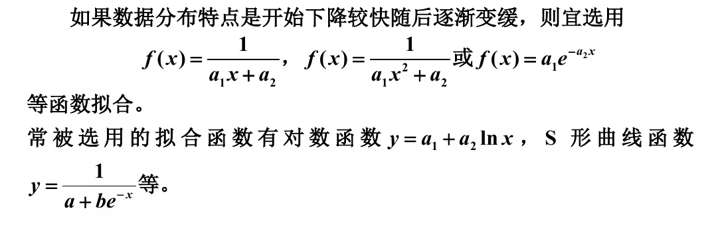

## 一、最小二乘法

### 1.1 总论

最小二乘法的命名来自于对于拟合的评价指标，采用最小二乘法估计的方式，也就是如下所示
$$
E = \sum^n (\hat y_i - y_i)^2
$$
我们希望让 $E$ 达到最小，其中 $\hat y_i$ 是第 $i$ 个预测值，$y_i$ 是第 $i$ 个实际值 。

而之所以“最小二乘法”被提炼成一种方法，是因为 $E$ 的形式恰好可以表示成一种更加“线性代数的形式”，即
$$
E = \Vert \hat Y - Y \Vert
$$
而求解 $\Vert \hat Y - Y \Vert$ 的最小值，可以看做在向量空间中寻找最小距离的过程，这就导致了有了更加大的操作空间。

### 1.2 线性最小二乘

线性最小二乘并不是用于拟合的函数是线性的，而是说，用于拟合的函数（可以看做最终拟合函数的组成成分）之间是**线性无关**的。其正规表述如下

给定一个线性无关的函数系 $\{\varphi_i(x) \vert i = 1, 2, \cdots, n\}$， 如果拟合函数以其线性组合的形式
$$
f(x) = \sum^n k_i \varphi_i(x)
$$
出现，那么就称其为线性最小二乘。此时我们求解的就是参数 $K$，希望找到最优的 $K$ ，使得误差最小。

然后就会出现一个极其优雅的性质，就是我们可以利用给定的 $n$ 个自变量 $x_i$ 和我们的线性无关函数系，构造出一组新的“基”来，这组基具有如下形式
$$
R
=
\left[\begin{matrix}
\varphi_{1}(x_1) & \varphi_{2}(x_1) & ... & \varphi_{n}(x_1)\\
\varphi_{1}(x_2) & \varphi_{2}(x_2) & ... & \varphi_{n}(x_2)\\
...&...&...&...\\
\varphi_{1}(x_1) & \varphi_{2}(x_1) & ... & \varphi_{n}(x_1)
\end{matrix}\right]
$$

然后就会发现，我们获得 $\hat Y$ 的过程，就是在 $R$ 展开出的平面内，选定一个与 $Y$ 距离最近的点。这个点被写作
$$
\hat Y = R \hat K
$$
所以可以很自然的想到，可以利用内积来确定点到一个线的距离，利用的是投影，所有有
$$
proj_R Y = R \hat K
$$
然后利用垂直关系和内积列出投影方程（也叫做**法方程**）
$$
R^T(Y - R\hat K) = 0
$$
将这个方程整理一下
$$
R^T R \hat K = R^T Y
$$
所以 
$$
\hat K = (R^TR)^{-1}R^T Y
$$
这是一种通用的解法。

推导过程中用到的法方程可以说在其他地方也有很多的应用。

### 1.3 拟合函数的选择

---

## 二、拟合评价

### 2.1 MSE

 均方误差（Mean Squared Error，MSE）
$$
MSE = \frac1n\sum^n (\hat y_i - y_i)^2
$$

### 2.2 RMSE

均方根误差（Root Mean Squared Error，RMSE）
$$
RMSE = \sqrt{\frac1n\sum^n (\hat y_i - y_i)^2}
$$
