## 一、线性规划（LP）

### 1.1 标准型

线性规划可以转化成标准型，但是可以发现有两种标准型，分别对应**软件程序**和**数学形式**，如下所示：

**LP 求解器一般接口**

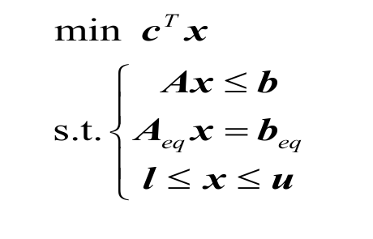

**数学形式**

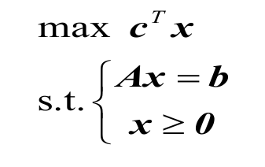

### 1.2 决策变量建模

#### 1.2.1 时间段

对于投资的模型，一般会有“一年收益、两年收益”的问题，然后就会弄不清在 2023 年投资的一年期，到底是在 2023 年收钱，还是在 2024 年收钱。

为了让这个问题弄清，我们可以设在“年初”投资，那么收益就可以用于第二年“年初”的投资。

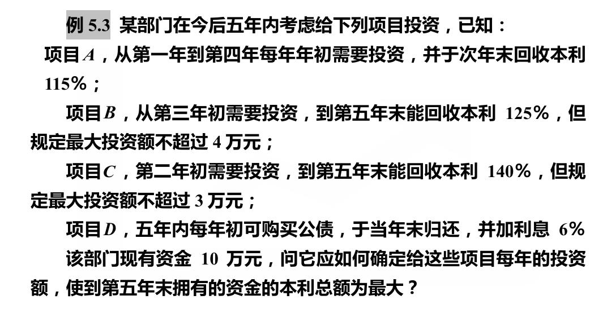

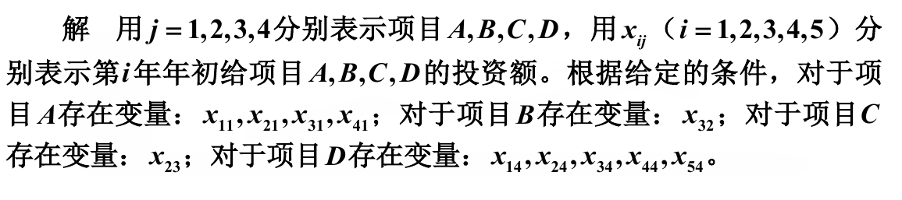

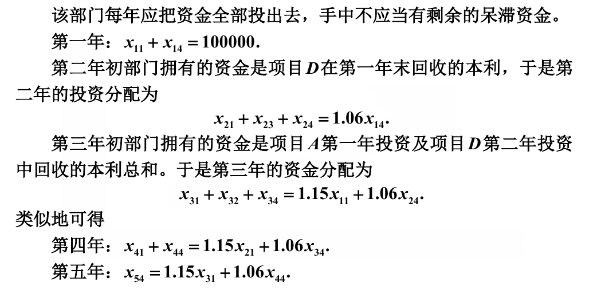

#### 1.2.2 二维决策变量

有一些问题，没法用 $x_0, x_1, \cdots , x_n$ 这种模型去表示决策变量，有的时候很复杂，比如说运输问题

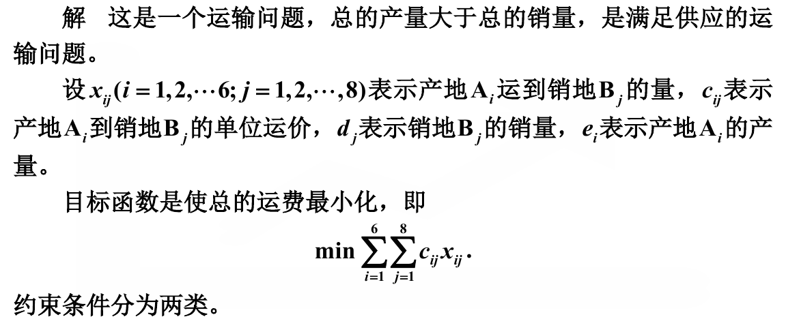

### 1.3 灵敏度分析

灵敏度分析已经复习过无数次了，这里总结一下。

灵敏度分析应该是某个参数（或者说约束条件）对于决策变量（而不是目标函数）的影响，这是因为决策变量对于目标函数的影响显而易见。我们更想看的是，到底约束条件是如何影响决策过程的。

我们可以在求出带着参数的决策变量最优解，比如说如下所示

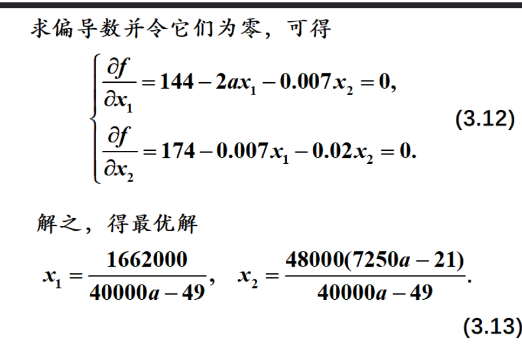

然后会发现现在 $x_1$ 和 $x_2$ 都受到 $a$ 的影响了。

然后其实有一个导数就已经很说明问题了，但是我们依然利用了某种**归一化**的手段让其更加合理
$$
\frac{\frac{dx}{x}}{\frac{da}{a}} = \frac{dx}{da} \times \frac{a}{x}
$$
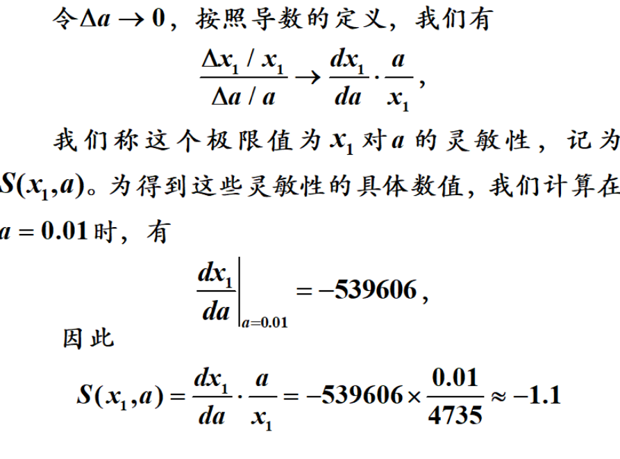

### 1.4 多目标规划

有些时候目标函数并不止有一个，比如说在投资的时候，我们不但希望投资的回报高，而且希望风险低，所以我们一般有两种解决办法，以投资问题为例

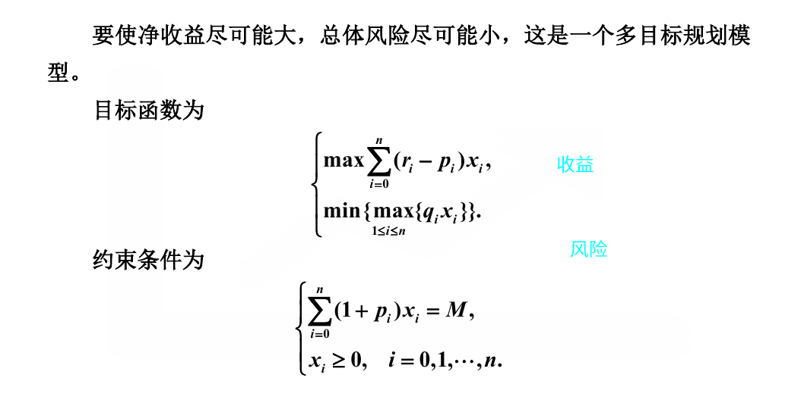

第一种方式是可以给其中一个目标设置一个“**接受限度**”，比如说“风险最高不超过多少”或者“收益最低不低于多少”

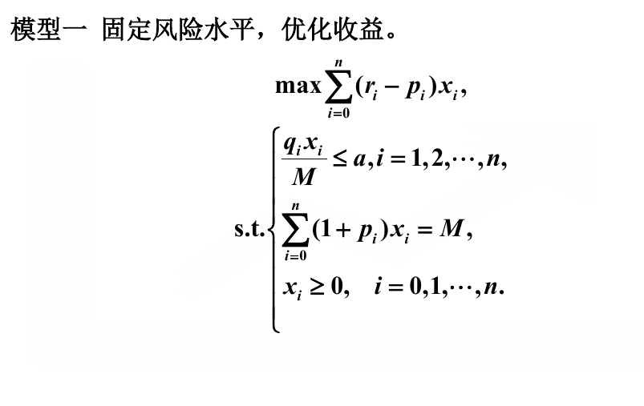

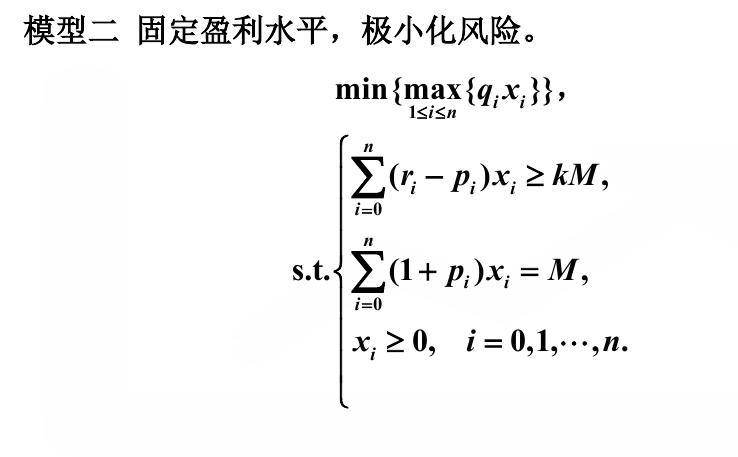

第二种是分配给两个不同的目标不同的权重，然后将其综合成同一个目标，如下所示

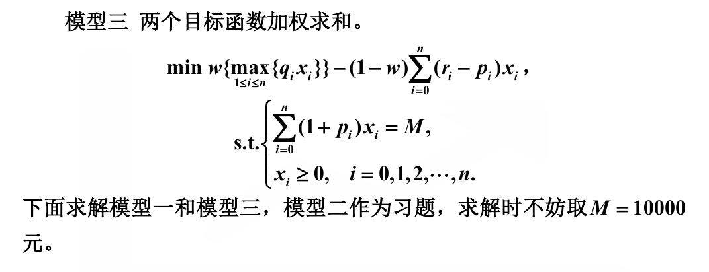

### 1.5 trick

#### 1.5.1 整型规划

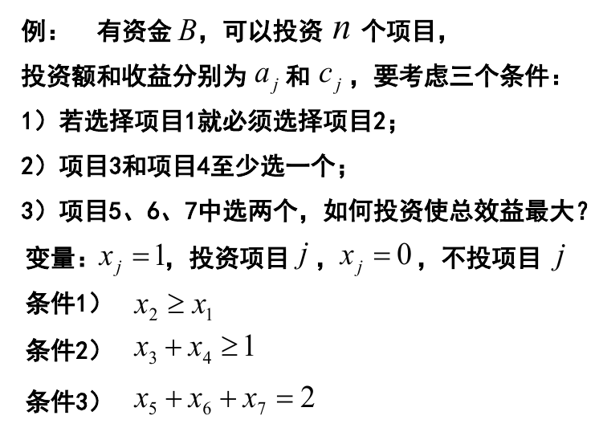

#### 1.5.2 绝对值最小化

绝对值最小化，利用的变量替换，我们用两个正变量去表示原来的变量，如下所示

原方程

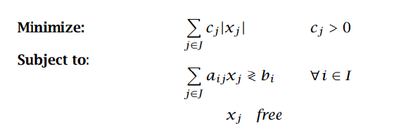

变形后

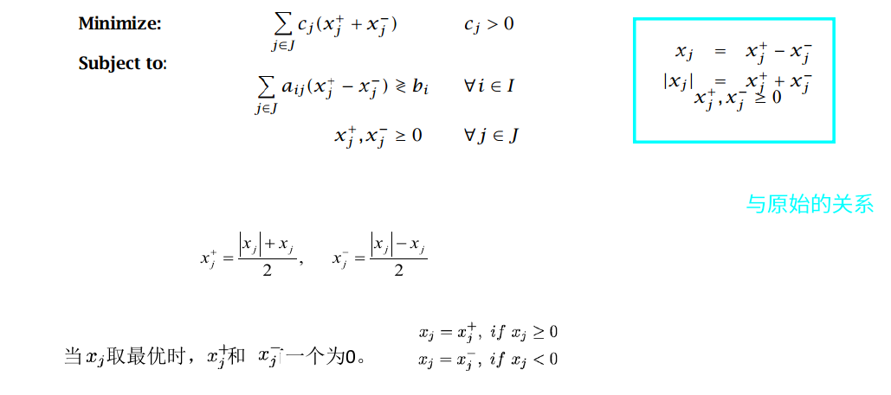

#### 1.5.3 最大最小问题

原本目标方程是希望求解一个最大值的最小值，我们可以对于“最大值”进行翻译，将其表示为“比每一个值都大“，这样的求解就会变得自然，如下所示

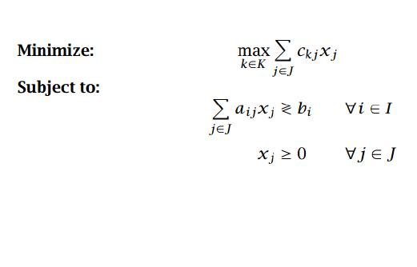

可以变形成

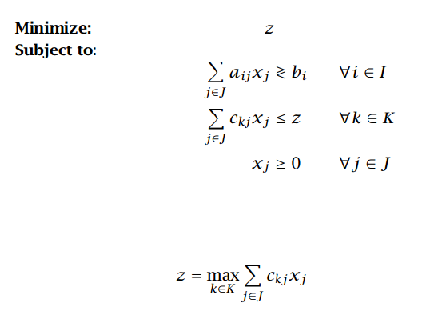

#### 1.5.4 变量取值范围不连续

严格讲并不能很好的解释这个问题，只是实现了在“一定区间“和“零”之间的不连续问题，通过引入一个布尔值来控制范围

#### 1.5.5 或条件

可以采用一个较大的罚值结合一个布尔值完成“或”操作

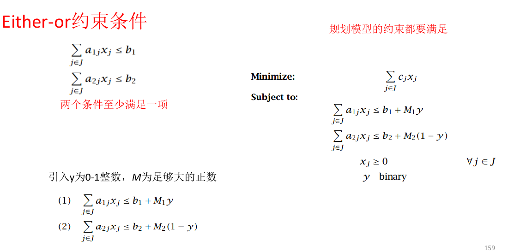

#### 1.5.6 条件约束

其实我们在 1.5.5 已经获得了“或”的表达方式，同时对于一个约束条件的取反，是一个很显然的事情，那么其实我们已经可以用 $\{\or, \neg\}$ 就已经可以表示所有的逻辑运算了，比如说
$$
p \rightarrow q = \neg p \or q
$$
所以才有了下面的操作

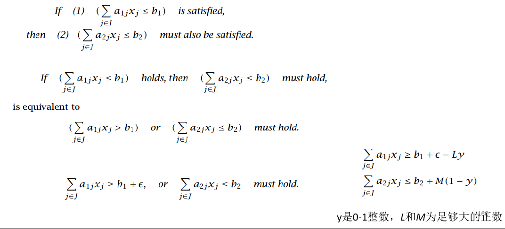

----

## 二、非线性规划

### 2.1 理论

#### 2.1.1 无约束问题

对于目标函数，可以去求它的 Hesse 矩阵，也就是如下所示

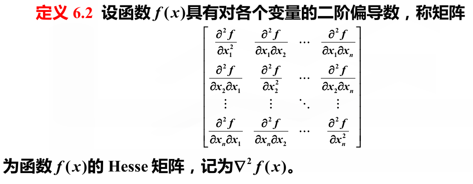

当 Hesse 矩阵在为**正定矩阵**时，同时 $f$ 的导数为 0，那么就达到了局部最小值。这并不奇怪，这是因为**正定阵**揭示了 Hesse 矩阵在进行过相合变换（本质是一个二次型在不同基下发生的变换）后可以规约到一个比较正的矩阵，因为二阶导数暗示了往某个方向走（可以看做发生 $dxdy$ 的偏移），目标函数会发生的变化，如果无论怎么走，都是为正的，那么就说明当前的极值是极小值。

#### 2.1.2 等式约束问题

Hesse 矩阵求解的是无约束问题下的极值，我们现在希望求解有等式约束条件下的目标函数极值，那么就可以采用拉格朗日（Langrange）乘子法，其核心思想是利用利用原有的目标函数和等式约束条件，再加入一些新的变量，构造出一个新的目标函数，我们再按照无约束的方式去求解。

其“行得通”的原因是因为在进行 “让导数等于 0 ” 这个运算，会使得约束条件再次出现（因为约束条件也是等值形式的）。对于如下形式
$$
min \space f(x) \quad \quad st. \space\space h_i(x) = 0 \quad(i = 0, 1, \cdots, n) 
$$
我们构造这样的函数
$$
L(x, \lambda_i) = f(x) + \lambda_1h_1(x) + \lambda_2h_2(x) + \cdots + \lambda_nh_n(x)
$$
我们除了要对 $x$ 求导外，还要对 $\lambda_i$ 求导（也就是让 $x$ 和 $\lambda_i$ 都等价于自变量），那么求导就会有如下结果
$$
\left[\begin{matrix}
	f^\prime(x)\\
	h_1(x)\\
	h_2(x)\\
	\cdots\\
	h_n(x)
\end{matrix}\right]
= 0
$$
恰好对于 $\lambda$ 求导的结果搞好形成了原约束条件。

#### 2.1.3 不等式约束问题

不等式约束没法“借着导数为 0 ”的东风完成构造，不等式不容易进行构造（没准可以先依靠积分，然后再在二阶导 Hesse 矩阵的正定性处发挥作用）。

所以我们采用更加工程化的方法，采用**罚惩法**来避免不等式的不成立，如下所示

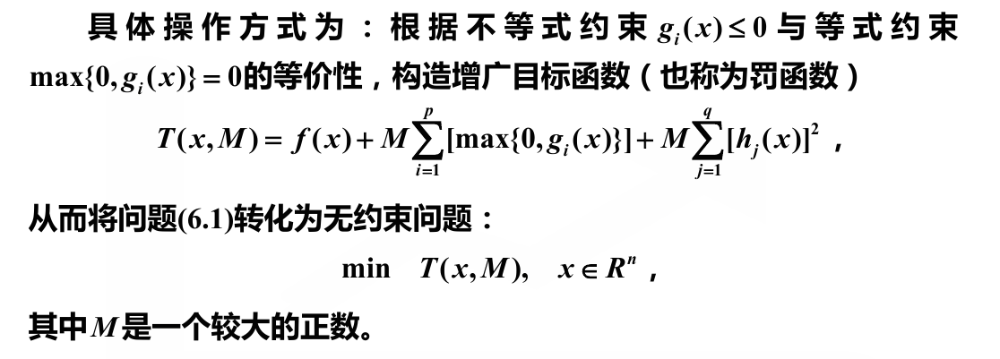

#### 2.1.4 凸优化问题

可以看到无论是有约束的还是没有约束的问题，这种通用的求解方法都会变得极其复杂，所以我们对于非线性优化并没有太大的把握。

凸优化属于是一种特殊的非线性规划，它的性质极好，更加方便我们的求解。其中一个很有用的性质就是“局部最优解一定是全局最优解”。
