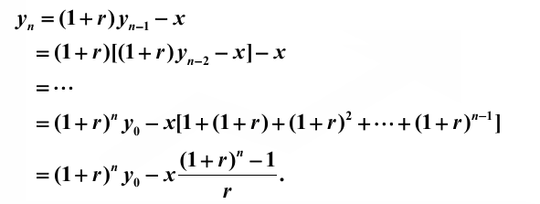

## 一、例子

之后的所有讲解，都是基于这个例子的，所以在头部统一列出

> 假定某消费者购房需要贷款 30 万元，期限为 30 年，已知贷款年利率为 5.1%，问每月应还款多少？ 

符号约定如下

| 符号  | 释义                             |
| ----- | -------------------------------- |
| $Q$   | 贷款总额（本金），此例为 30 万元 |
| $N$   | 还款期限，此例为 30 年           |
| $r$   | 利率                             |
| $y_i$ | 第 $i$ 个月的欠款总额            |
| $x_i$ | 第 $i$ 个月的还款                |

---

## 二、还款周期与利率

利率的计算是很反人类的，他是被“**线性处理**”的，也就是说，对于年利率 5.1%，月利率和日利率分别如下计算
$$
r_{y} = 5.1\%\\
r_{m} = r_{y} \div 12 = 0.425\% \\
r_{d} = r_{y} \div 30 = 0.0142\%
$$
是直接可以除的，但是这样产生的利息却不是线性的，我们以一年为例，如果按照一年为周期，贷款是 1 去计算，那么产生的利息就是
$$
(1 + r) - 1 = r
$$
但是如果是以半年为周期，那么产生的利息就是
$$
(1 + \frac{r}{2})^2 - 1 = r + \frac{r^2}{4}
$$
就是多于按照一年为周期去计算的利息，这是因为在第一个半年产生的利息会**利滚利**式地在第二个半年产生利息。

设在一年中总共“均匀地”还款 $x$ 次，那么对于利息总额，就有
$$
(1 + \frac{r}{x})^x - 1
$$
取极限
$$
e^r - 1
$$
所以直观的理解就是不要无限分割，越分割就会导致利息越多。所以在黑社会借贷中，经常出现“日利息，将一个月还清变成半年还清”的手段，这样会导致利息直线上升。

在实际生活中，我们一般按照一个月为还款周期，所以每月 0.425% 和一年 5.1% 差异还是很大的。

---

## 三、还款方式

### 3.1 等额本金

所谓等额本金，就是在每个月都会偿还等额的本金，同时偿还还未偿还的本金产生的利息，也就是对于第 $i$ 个月，有如下公式
$$
x_i = \frac{Q}{N} + (Q - (i - 1)\frac{Q}{N}) \times r = Q \times (\frac{1 + (N + 1)r}{N} - \frac{r}{N}i)
$$
在此题中，$x_i = 2111.875- 3.54i$	，也就是每个月最多还 $2111.875$元，最少还款 836.875 元 。

可以看出每月的还款金额形成一个等差数列，每个月减少 $\frac{Qr}{N}$ 。最终的还款的总额是
$$
Q \times (1 + \frac{N + 1}{2}r)
$$
也就是利息是
$$
Q \times \frac{N + 1}{2} r
$$
在此例中为 $230137.5$ 元。也就是 23 万元，是本金的 $\frac{2}{3}$ 。

### 3.2 等额本息

等额本息指的是每个月还款的额度是相同的，那么就有如下差分方程
$$
y_{i + 1} = (1 + r) \times y_n - x \\
y_0 = Q
$$
可以直接递推求出

再结合条件 $y_N = 0$ ，可以求出
$$
x = \frac{(1 + r)^NQr}{(1 + r)^N - 1}
$$
带入本题数据可以计算每月需要还款 $1628.85$ 元，最后总利息为 $286386$ 元，也就是 26 万元。

这种方法会相比于等额本金，会导致需要偿还的利息更多，而且基本上越是长期的存款，即 $N$ 越大，这个效果越明显。但是因为其每月还款金额固定，且在一开始的时候每月的还款金额是小于等额本金的，所以对于大型贷款，我们一般选择这种方式。

至于为什么会还的钱更多，是因为我们在一开始，没有偿还更多的钱，导致我们让更多的利息产生了“利滚利”的效应。

### 3.3 先息后本

先息后本名义上是“先还利息，后还本金”，每个月需要归还的利息是
$$
Qr
$$
在换完 $N$ 个周期后，最后再支付 $Q$ 的本金，那么在此题中，总利息就是 $QNr = 459000$  元，也就是 45 万元。这种方式每个月只需要偿还利息，所以是不需要付本金的，所以还款的方式可以更加灵活，资金流转更加畅通。
