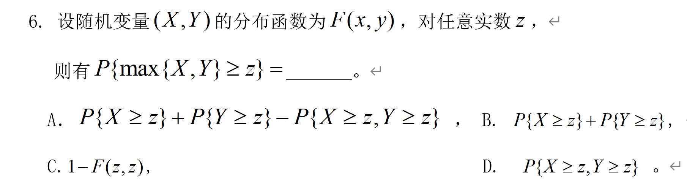
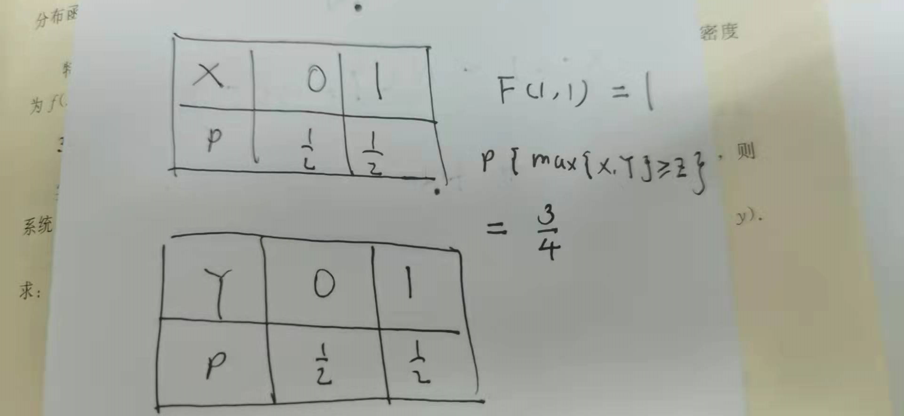

数理统计倒逼了概率论的发展。

分布只是分布，他是更为抽象的东西，他描述的是一种**连续数据的组织形式**，无论这组数据是采集到的**样本**，还是理论推导的**概率**。虽然它们已经是某种客观现象的**抽象**了，但它们依然都是分布的**应用**。

或许不只是分布，比如说期望，方差或者其他矩，都是更高维度的抽象。

<!-- more -->

## 一、随机变量

随机变量其实不是一个变量，而是一个函数，它实现的是将事件映射到一个实数的功能。至于为什么要这么干，据说是为了方便研究，那么为啥会方便研究，其实并不显然。在生活中，我们说“硬币朝上的概率是二分之一”，也不见得不简洁了。哪怕是复杂一点的问题，比如说贝叶斯公式或者高考概率题，我们完全可以不用随机变量进行描述。那么到底是什么因素，导致随机变量的出现。我觉得不在数学的简洁性，而在客观世界。

我们知道，我们讨论的概率论体系，离开了中心极限定理，它并不会土崩瓦解，而是会变成一个与现实客观完全失去联系的东西，但是它依然是自洽的（因为是一个严密的数学公理体系），只是没有办法指导生产了。当我们思考为什么概率论体系中有这么一个不优雅的东西，其实原因就在于客观世界的真实，客观世界我们去做取样，那么反馈上来的必定是一组数据，为了研究这组数据，我们需要观察他的**统计特征**，而观察统计特征，本来就需要更加直观，把事件去做映射就很自然了，不然没法作图啊。所以我们发现有钟型曲线，然后反思为啥会出现钟型曲线，倒推出了正态分布。捎带手，倒逼出了随机变量。

注意：定义在样本空间上的函数，不一定是随机变量，随机变量的本质是**定义在样本空间上的一个可测函数**。

此外，我们还需要熟悉一下随机变量的表示方法
$$
\{X \leq x\} = \{e\in S \mid X(e) \leq x\}
$$
这个东西其实右侧才是比较好理解的形式，它指明了这是一个事件，组成这个事件的要求就是满足最右侧的关系，注意，这里的 $x$ 跟随机变量一毛钱关系也没有，它只是代表一个实数参数，那么为啥要用x这个容易混淆的量，而不用a，b这种参数模样的字母，是因为x在后面的分布函数中会变成变量，所以在这里就先行一步了。而左侧是比较常见的写法，在左侧，就更容易把大小写的x弄混淆了。

---

## 二、连续型随机变量

### 2.1 分布函数

正如上面指出的，上面的式子是一个事件，是事件就会有概率，所以有如下定义
$$
F(x) = P(\{X \leq x\})
$$
那么称 $F(x)$ 为随机变量 $X$ 的**概率分布函数**，简称分布函数。记为 $X \sim F(x)$ 。其实还有一种写法，叫做 $F_X(x)$ 这种写法（依然要注意大小写的区别）在后面的**随机向量**中较为常见。

其实这个函数并不直观，因为它并不能很好的体现各种分布（分布分布，起码也应该分开啊，但是他却是讨论一个集合的概率，还是一个很不负责的集合），我们直观有印象的正态分布曲线，泊松分布律，其实跟这个完全没关系，在实际生活中去取样，也没有见过把低于某一值的东西分为一堆，然后通过调整这个值来作图的奇葩方法。它更像是一种**计算方法**，如果只有离散型的随机变量，那么估计他就不会出现了，但是因为有连续型变量，我们失去了对基本事件的完全控制，所以引入了**概率分布函数和概率密度函数**来补全描述。极端地说，离散型随机变量完全没有要考虑分布函数的意义！

他的计算意义却是还是不错的，有
$$
P(\{a\leq X \leq b\}) = F(a) - F(b)
$$
可以看到，确实十分简洁。

### 2.2 密度函数

$$
F(x) = \int^x_{\infty}f(t)dt
$$

那么称 $f(x)$ 为随机变量 $X$ 的概率密度函数。

概率密度函数才是我们认识的主体。我们每次作图，都是做密度函数的图。

但是需要注意的是，密度函数的图的坐标轴数值没有意义，因为受限于曲线下区域积分必须为1，如果扩大横坐标轴，那么纵轴就会相应减少，而扩大坐标轴不过就是改变了一个随机变量的一个映射方式，并没有客观世界的差别，所以可见其纵轴没有意义，同理，横轴也没有意义。我们研究概率密度函数的**焦点，不在数值，而在形状**。密度函数前面的任何常量，都不需要考虑，因为并不会影响形状，我们对密度函数分类的依据，也不是常数，而是形状。

但是形状也不严谨，因为**形状**只是用来帮助我们区分不同分布的，而对于同一种分布，方差大的正态分布与方差小的正态分布又是有区别的，那么区分它们的就是**参数**。

哦，对于特殊的分布函数，除了要关注名字以外，还要关注他对应的符号。说道这里，符号，比如说均匀分布的 $U$ 或者正态分布的 $\phi$ ，对应的到底是密度函数，还是分布函数。我觉得都不是，名字真正对应的，是分布，而分布函数，密度函数，都是我们观测这种分布的一个角度。

### 2.3 常见分布

#### 2.3.1 均匀分布

$$
f(x) = 
\begin{cases}
\frac {1}{b- a},\quad a\leq x\leq b\\
0,\quad else
\end{cases}
\\
F(x) = 
\begin{cases}
0,\quad x < a\\
\frac{x - a}{b - a},\quad a\leq x < b\\
1, \quad else
\end{cases}
$$

大概只需要记住均匀分布的符号是 $U$ 。

#### 2.3.2 负指数分布

$$
f(x) = 
\begin{cases}
\lambda e^{-\lambda x},\quad x\geq0\\
0,\quad x < 0
\end{cases}
\\
F(x) = 
\begin{cases}
0,\quad x < 0\\
1 - e^{-\lambda x}, \quad x \geq 0
\end{cases}
$$

可以看到指数一定是个负数，因为正数不收敛。说服从指数分布，需要强调是服从参数为 $\lambda$ 的指数分布。

负指数分布在排队论中用的比较多，参数 $\lambda $ 表示事件发生的强度，其倒数可以表示两个事件发生的平均时间间隔。

其期望为 $\frac{1}{\lambda}$ ，其方差为 $\frac{1}{\lambda^2}$ 。也不奇怪，$\lambda $ 越大，强度越大，衰减的越快，那么期望就越小，方差就越小。

#### 2.3.3 正态分布

$$
f(x) = \frac{1}{\sigma \sqrt{2\pi}}e^{-\frac{(x - \mu)^2}{2\sigma^2}}
$$

称 $X$ 服从参数为 $\mu,\sigma$ 的正态分布，记作 $X \sim N(\mu,\sigma^2)$ 。

之所以没有分布函数，是因为正态分布的分布函数，是没有办法用初等函数表示的，所以我们在实际应用的时候，采取标准化以后查表的方法（再次体现分布函数的计算职能）。分布函数大概应该长得和逻辑斯谛方程挺像的。

正态分布式二项分布n趋于无穷大的时候借由斯特林公式推导出来的，有趣的是，泊松分布也是二项分布n趋于无穷大的时候推导出来的，也不知道二者有何联系。

#### 2.3.4 标准正态分布

参数 $\mu = 0, \sigma = 1$ 的正态分布即 $N(0,1)$ ，被称为标准正态分布，其概率密度函数和分布函数分别用 $\phi(x)$ 和 $\Phi(x)$ 表示。

之所以提出标准正态分布的概念，是因为为了方便实践，虽然正态分布函数没法用初等函数表示，但是我们可以通过查表来获得标准正态分布某个区间的概率。只要我们能在正态分布函数和标准正态分布函数中建立某种联系，我们就可以获得所有正态分布的区间概率。

而且确实两者的关系很优雅：
$$
F(x) = \Phi(\frac{x - \mu}{\sigma})
$$
但是光有了这个联系，还是不足以辅助查表，因为在实际的应用中，我们的场景一般是“我要查查沿对称轴分布的区间多宽的时候概率是某个值 $\alpha$” ，所以我们还需要**分位点**（分割位置点）的概念。
$$
\Phi(z_{\alpha}) = \alpha\\z_{\alpha} = \Phi^{-1}(\alpha)
$$

可以看到，还是很直观的。但是我们一般采用的是沿对称轴对称的区间，所以下面这个关系同样不能忽略。
$$
P(\mid X \mid \leq Z_{1 - \frac{\alpha}{2}}) = 1 - \alpha
$$

当然，如果说最本质的话，是对任何关于y轴对称分布的分布，其分位点都有如下性质
$$
z_{1-\alpha} = -z_{\alpha}
$$

---

## 三、离散型随机变量分布律

离散型随机变量的分布律是与连续性随机变量的概率密度函数平等的，如果要求一个非基本事件的概率，用到的也是多个离散事件累加的方法，与区间积分相似。

### 3.1 两点分布

就是0-1分布，称 $X$ 服从参数为p的两点分布，尽管服从两点分布的试验又叫做伯努利试验，但是它的代号不是 $B$ ，$B$ 是二项分布的符号。

### 3.2 泊松分布

$$
P(X = k) = e^{-\lambda}\frac{\lambda^k}{k!}
$$

其中参数 $\lambda$ 大于0，而且不一定小于1，记作 $X \sim \Pi(\lambda)$ 。

#### 3.2.1 理解

虽然这个式子看着挺花哨的，我们逐个分析。

之所以会有 $e^{-\lambda}$ 结构，是因为要求 $\sum^{\infty}_{k=0}\frac{\lambda^k}{k!}$ 级数是$e^{\lambda}$ 。所以需要前面乘个常数来使其为1。所以这项就不用管了。

后面的分式，这个式子当k趋于无穷的时候，一定等于0（阶乘的增长速度要比）。当k小于 $\lambda$ 的时候，$\frac{\lambda^k}{k!}$ 会随着k的增大而增大，当k大于 $\lambda$ 的时候，会随着k的增大而减小，所以峰值出现在k与 $\lambda$ 接近的时候。

尽管泊松分布经过分析以后变得好理解了，但是其求和依然是个问题（只有求和我们才知道概率），这个问题不仅泊松分布有，其他离散分布律只要n一大，也同样会面临这个问题。对于泊松分布，我们可以查表。

#### 3.2.2 性质

泊松分布的**期望**和**方差**均是 $\lambda$ 。

如果 $X\sim\Pi(\lambda_1),\space Y\sim\Pi(\lambda_2)$。则有 $Z = X + Y \sim \Pi(\lambda_1+\lambda_2)$。这个性质的证明利用的是离散形式的卷积，有
$$
P\{X+Y = k\} = \sum^{k}_{i = 0}P\{X = i\}\cdot P\{Y = k - i\} \\=
\sum^{k}_{i = 0} \frac{e^{-\lambda_1}\lambda_1^i}{i!}\cdot\frac{e^{-\lambda_2}\lambda_2^{k-i}}{(k-i)!} 
= \frac{e^{-(\lambda_1+\lambda_2)}}{k!} \sum^{k}_{i = 0}\frac{k!}{i!(k-i)!} \lambda_1^i\lambda_2^{k-i}\\=
\frac{e^{-(\lambda_1+\lambda_2)}}{k!}(\lambda_1+\lambda_2)^k
$$

### 3.3 超几何分布

主要是其与二项分布有区别，采用的是**不放回**的抽样方式
$$
P(x = k)=\frac{C_N^kC^{n-k}_M}{C^n_{M+N}}
$$

### 3.4 二项分布

$$
P(x = k)=C_n^k p^k (1-p)^{n-k}
$$

称 $X$ 服从参数为n，p 的二项分布，记作 $X \sim B(n,p)$

二项分布在n很大（大于10），p很小（小于0.1）的时候，可以近似为泊松分布，其中 $\lambda = np$ 。然后就可以借助泊松分布表进行查询了。跟标准化正态分布的处理有异曲同工之处。

### 3.5 一个离散型变量分布函数的易错点

尽管我们在离散型变量中更关注分布律，但是确实他也是有分布函数的，对于这种分布函数，有一个比较重要的点就是它**不连续**，如果不连续的话，那么有的时候就会造成意想不到的错误（尤其是**我们习惯了连续型以后，对端点问题就考察会疏忽一些**），比如

此题答案是A，没有C，反例如下

