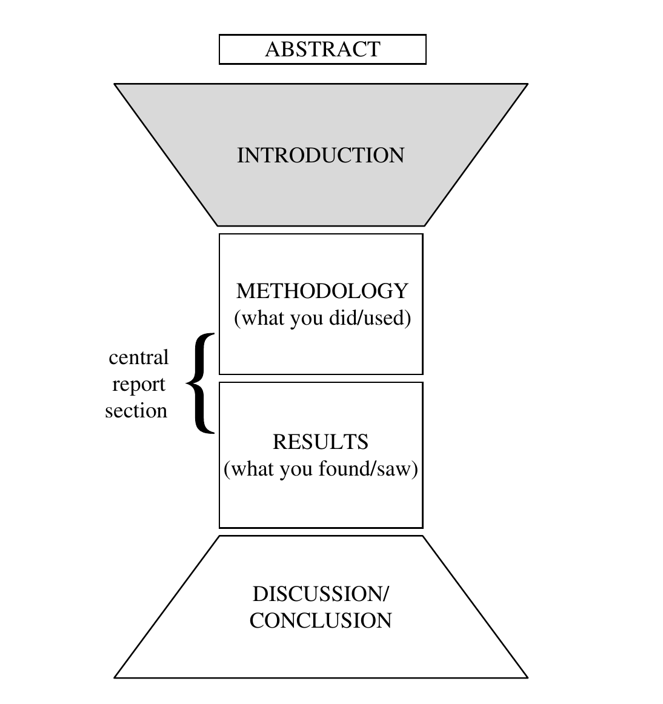

## 总论

这本书是对《Science Research Writing For Non-Native Speakers of English》的总结梳理。这本书分为多个章节，每个章节对应一个论文写作里的部分。在每个章节内部，又有如下几个部分：

1. 介绍一下这个章节在整体文章中的作用
2. 展示一篇例文
3. 介绍一些基础的英语语法和词汇
4. 对例文结构进行分析（分解成小组件），也就是他说的 model
5. 对 model 进行一些心法层面的阐述，也就是他说的 key
6. 按照 model 和 key 介绍一些固定词汇、句式和搭配，也就是他说的 vocabulary
7. 最后让你自己写一个文章

很多东西都是实践性质的，并非专业知识本身。所以如果总结的话，其实可以按照 model 的形式来组织 vocabulary ，其他的东西（比如例文、基础语法、动手实践）都可以省略，结构清晰。

因为时间问题，所以我会逐步更新这篇博文。

## 结构

这篇文章将一片论文分成了 5 个部分：

- Abstract 用于提供一个对文章的总结
- Introduction 初步介绍问题，帮助原本陌生的读者对问题的认识更加具象和熟悉
- Methodology 用于描述自己是如何进行这项研究的
- Results 用于描述研究的现象和结构
- Conclusion/Discussion 用于升华主题，让具象问题变得抽象普适

而对于计算机会议论文来说，在章节方面会有一定程度的细化。Introduction 部分会包括：

- Background: 介绍背景知识
- Motivation: 介绍研究动机

Methodology 部分会包括：

- Insight: 完成设计的核心思想
- Design: 设计本身
- Implementation: 具体的实现

Results 部分会包括：

- 如果一个新技术，那么需要指明技术的应用场景 Use Case ；如果是原有技术改进，那么需要指明 Baseline 
- Evaluation: 对设计的评估

如果有机会，我希望按照更加符合计算机会议的方式重新组织一下这个模板。

## Results
### Revisit the Research Aim / Exisiting Research

不要直接描述自己的实验结果，这样过于唐突了，要想办法把读者和后面的实验联系起来，比较有效的方法就是回顾前文或者已有的其他人的工作，这些都是对实验的一种背景介绍，一种铺垫。

对前文的回顾：

> as discussed previously, ...
> as mentioned earlier/before, ..
> as outlined in the introduction, ...

对实验目的的回顾：

> in order to ..., we examined ...
> it is important to reiterate that ...
> our aim/purpose/intention was to ...
> since/because ..., we investigated ...
> to investigate ..., we needed to ...
> the main purpose of this work was ...
> In this work, we sought to ...

对现有其他实验的回顾：

> as reported, ...
> it is known from the literature that ...
> the aforementioned theory/aim/prediction ...
> in earlier studies ...

对结果的预期：

> we reasoned/predicted that ...
> it was predicted that ...

### General Overview of Results

对实验的总结概括：

> in this section, we compare/evaluate/present ...
> the results are divided into two parts as follows:

对结果的总结概括：

> generally speaking, ...
> in general, ...
> in most/all cases, ...
> in the main, ...
> it is appparent that in all/most/the majority of cases, ...
> it is evident from the results that ...
> on the whole, ...
> the overall response was ...
> using the method described above, we obtained ...

### Invitation to View Results

对结果的被动引用：

> (see Fig)
> according to Fig
> as detailed/evident/illustrated/indicated/listed/shown from/in Fig
> as can be seen/found/identified/observed from/in Fig
> comparing Fig.1 and Fig.4 shows that ...
> displayed in Fig
> evidence for this is in Fig
> inspection of Fig indicates ...
> be given/represented/visible in Fig
> in Fig we compare/present ....
> results are given in Fig

对结果的主动引用

> Fig contains/corresponds/demostrates/displays/gives/illustates/lists/plots/presents/provides/reports/represents/reveals/shows/summaries

在引用结果时，某张图或者某张表的粒度可能过粗，可以更细一些，指向图中的某个具体数据：

> the data in Fig
> the rate in Table
> the results of Fig

### Special/Key Results in Detail

讲究的是客观描述与主观判断的结合。

#### Objective Description

这些词应当加上具体的数据来修饰，这样才能更有说服力和客观。比如说

> 2% increase

增加：

> accelerate
> expand
> increase
> be higher/highest
> peak
> precede
> rise

减少：

> decline
> decrease
> delay
> drop
> fall
> be lower/lowest
> reduce

变化：

> change
> vary
> be different
> produce

不变：

> be constant/unaffected/unchanged
> remain constant/the same
> level off

存在：

> exist
> find
> range from
> be found/seen
> occur

对比：

> be equal/indentical/uniform
> match

#### Subjective Description

数量评价：

> abundant
> adequate
> inadequate
> minimal
> negligible
> imperceptible
> few
> brief
> sufficient
> scarce
> substantial
> immense

程度评价：

> almost
> largely
> likelihood
> more or less
> somewhat
> most
> mild
> virtual
> considerable
> general

图表评价：

> clear
> measurable
> sharp
> smooth
> steep
> sudden

符合预期/不符合预期：

> acceptable
> appreciable
> appropriate
> unexpected
> unusual

非常好/差：

> dramatic
> drastic
> essential
> excellent
> extensive
> important
> marked
> noticeable
> overwhelming
> poor
> remarkable
> satisfactory
> serious
> severe
> significant
> simple
> striking
> strong
> suitable
> surprising
> radical
> rapid
> valuable

比较：

> comparable
> consistent
> distinct
> equivalent
> excessive
> exceptional
> extreme
> fair
> obvious
> only
> resembling
> similar
> dominant

名词：

> tendency
> the majority of
> main

### Comparison with Other Results

和其他已有成果对比是非常必要的，baseline 必须好好选取，才能增加说服力。

印证/推翻：

> as anticipated, ...
> as expected, ...
> as predicted by ...
> as reported by ...
> confirm
> corroborate
> disprove
> inconsistent with
> concur with
> inline with
> be in good agreement
> prove
> refute
> reinforce
> support
> validate
> verify

优劣：

> compare well with
> be better than

相似性：

> consistent with
> contrary to
> match
> be identical
> be similar/dissimilar to
> be parallel to
> be unlike
> correlate

### Problems with Results

似乎这个会被写入 future work 而不是 evaluation 中。

问题：

> immaterial
> incompelte
> infinitesimal
> insignificant
> less than ideal/perfect
> a minor deficit/limitation

转折：

> despite this
> however
> nevertheless

开脱：

> at a preliminary attempt
> neligible
> not always/completely reliable/accurate/ideal/identical/clear/perfect/precise/significant
> of no/little consequence/significance
> only
> reasonable results were obtain
> room for improvement
> slightly
> a slight mismatch/limitation
> somewhat
> technicality
> unimportant

原因：

> may/could/might have been
> beyond the scope of this study
> be not the focus of this paper
> be not within the scope of this paper
> caused by
> difficult to
> due to
> hard to control
> inevitable
> it should be noted that ...
> be not attempted/examined/expored in this study
> possible sources of error
> unavoidable
> unexpected
> unfortunately
> unpredictable
> unworkable
> unavailable

解决办法：

> futher work is planned
> futher work should ...
> future work will
> in future, care should be taken
> in future, it is advised that

### Possible Implications on Results
感觉似乎过于侧重 possible 了，有些让人感到虚弱了，不应该出现在这里。

> apparently
> could be due to / explained by / attributed to / interpreted as / seen as
> could account for
> evidently
> imply that
> indicate that
> in some circumstances
> be owing to / associated with / likely / linked to / related to
> it appears that
> it could be concluded/infered/speculated/assumed that ...
> it is conceivable ...
> it is evident
> it is logical that
> it is thought/believed that
> plausible
> suggesting
> likely
> may/might/perhaps
> possibly/possiblity
> potentially
> presumably
> probably
> provide compelling evidence
> tend to / tendency
