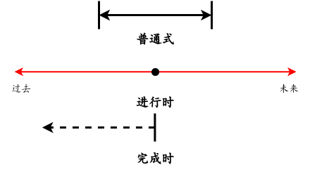

## 一、总论

这篇文章是对于[旋元佑语法俱乐部](https://llwslc.github.io/grammar-club/)的一个注释总结。行文思路基本上和这本电子书的章节保持一致。

语法是对于语言的规律总结，这类似于物理是对于客观世界的规律总结。不过应当注意到，即使掌握了语法，也并不能短时间内提高英语水平，因为在语法的指导下使用语言，同样是一个需要习惯和精进的过程。这就像掌握了物理定律和物理满分之间依然存在很大差距一样。

旋老师的语法和我中学学过的语法并不一样，旋老师倾向于建立一种“大一统”的理论来解释所有的语言现象，而中学语法则更加繁杂和缺少一致性。在加上我这次学习语法已经是大四，在逻辑思维上相比于中学已经有了很大的进步。所以总的来说，语法更加“讲理”了。

但是旋氏语法的缺点我个人感觉有两个，一个是因为过于“统一”，导致需要引入一堆与中学语法似是而非的概念，这些概念类似于物理学上的“波粒二象性”一样，对中学语法是一种挑战；并且因为旋老师是台湾人的缘故，所以在表达习惯和方式上也与大陆存在一定的差异（也就是他写的中文有点难看懂）。另一个是旋老师在建立了“统一”的理论后，并没有充分利用这些规律推导出中学语法甚至是其他中学语法难以推导的其他语言现象。

所以这篇文章会对原本的电子书进行一定的解释和应用。

---

## 二、简单句

### 2.1 基本句型

英语语法的研究单位是句子，而简单句（可以看作比较本源的一种句子）一共有  5 种句型，如下所示：

| 简记          | 解释                              | 动词性质         | 举例                         |
| ------------- | --------------------------------- | ---------------- | ---------------------------- |
| S + V         | 主语 + 动词                       | 不及物动词       | die, smile                   |
| S + V + O     | 主语 + 动词 + 宾语                | 单宾语及物动词   | kill, love, like             |
| S + V + C     | 主语 + 动词 + 主语补语            | 系动词/连缀动词  | be, seem, sound, feel, prove |
| S + V + O + O | 主语 + 动词 + 直接宾语 + 间接宾语 | 双宾语及物动词   | give, call,tell              |
| S + V + O + C | 主语 + 动词 + 宾语 + 宾语补语     | 宾语补语及物动词 | find, consider, find         |

其中简记符号是这样的：

| 符号 | 英文       | 全称 |
| ---- | ---------- | ---- |
| S    | Subject    | 主语 |
| V    | Verb       | 动词 |
| O    | Object     | 宾语 |
| C    | Complement | 补语 |

在这种分类下（其实这只是旋老师自己的分类，有些语法的分类要更加复杂），有许多有趣的特征：

可以看到这种对句子成分的分类法，取消了常见的“谓语，状语，表语”的语法成分。其中谓语的取消，应该是因为谓语的定义过于宏大。谓语的英文是 Predicate，也就是断言，所以我个人理解，断言加上断言的目标，也就是主语，那么就可以构成一个命题了，而命题基本上是句子存在的意义。我们说的每一句话，都是一个命题。如果认为句子中存在谓语，那么基本上其他的语法成分都会被囊括其中，其实是不利于细致探究的。而状语之所以没有，是因为它并不是句子的主干，而是句子的点缀，所以就没有细说。而传统意义上的表语，则大部分被划分到了补语范畴内，旋老师这么做是为了某种“简洁性”。

一个句子对应一个动词。也就是说，如果一个字符串里没有动词，那么就一定不是一个简单句，同理，如果一个字符串中有了两个动词，那么就一定不是一个简单句，而有可能是一个从句，或者简化从句，这是很有意思的一点，比如说例句：

> I hate programming.

其中有 hate 和 program 两个动词，所以它并不是一个简单句，而是一个简化从句：

> I hate that I program.

意识到句子与动词的一一对应关系，可以理解复杂的句子，因为动词很好数出来。

动词的性质决定了不同的句型。上文列出了五种句型，并不是可以随意搭配动词使用的。动词性质决定了句型，比如不及物动词，它的句型只能是“S + V”，不能是“S + V + C”。所以积累动词的性质，可以有助于我们识别句子的结构，当遇到一个不及物动词的时候，就不用去后文找补语或者宾语了。

### 2.2 限定

在介绍其他语法之前我想介绍一下限定（Finite），它指的是词语的一种属性。对于动词而言，简单句里的动词都是限定动词，这样的动词需要受到人称、时态、语态、助词（情态动词等）、语气的限制（Determiner），也就是承担了更多的句子表达更多信息的任务。我们可以从限定动词中获得更多的信息，在使用限定动词的时候，也需要注意更多限制。而非限定动词则不需要考虑那么多，一般只有 Ving，to V，Ven 这几种形式。非限定动词可以看作是从句简化后的结果。

基于“限定”的概念，引申出来“不定式”的概念，它特指“to V”结构。旋老师将不定时描述成了情态动词的退化，将在后面详述。

除了动词以外，名词也有限定词的说法，它指的是复数变化和冠词等内容。

### 2.3 时态

#### 2.3.1 分词

在传统语法中，时态是非常复杂的，有如此多项：

- 时间：过去，现在，未来
- 状态：简单，进行，完成
- 语态：主动，被动

一般都是这三种内容的自由组合，比如说“过去完成时被动语态”。旋老师主张将进行时和被动语态看作一种“形容词”，这样

> I am reading.

就变成了一种“S + V + C”的结构。这样的话，其实就取消了“主被动”的问题，并且减少了“状态”中的进行时。这种简化我觉得并不是很有意义，只是在形式上简化了语法，但是“进行”或者“被动”本身的含义并没有被化简掉。

这种思想其实并不是牵强附会，它可以看作是“分词 Participle”思想的延伸，分词既有动词的特性，也有形容词的特性，所以说它"分享"了两种词类的特点。分词有现在分词（Present Participle）和过去分词（Past Participle）两种，其实就是 Ving 和 Ved 这两种。它们原本是动词，分词化处理后具有了形容词词性，所以可以担任补语的职责。

#### 2.3.2 状态

其中时间和语态的区分是比较容易的，难点还是状态的区分上。我感觉最好还是同时区分“简单、进行、完成”三种语态。其实从语义上来说，三者的区别是很明显的，其中普通式指的是“这句话只是为了说这句话”，也就是这句话就是一个纯粹的**命题**。其他两种状态都有一种“这句话是别的话的铺垫”的感觉，这是我觉得这三种状态最核心的区别，如下所示：

> I read this book. （我读这本书，平平淡淡的陈述句）
>
> I am reading this book （我正在读这本书，强调“正在”要超过“读”，可能表明现在很忙）
>
> I have read this book （我读过这本书了，强调“读过”要超过“读”，可能表明我了解这本书的知识了）

当然在搞明白这点以后，其实并不足够。我个人感觉是因为状态的描述不仅需要依靠现在分词或者 have 这样的助动词来帮助，它们往往和时间概念联系在一起。这并不奇怪，因为当我们在说一个不是纯粹命题的句子（也就是普通式）的时候，我们往往还要说些其他的信息，而将不纯粹命题和其他信息联系在一起的媒介，就是时间。比如说：

> I was reading this book when he knocked my door. （他的敲门打扰了我“正读书”的行为）
>
> I have read this book so that I will pass the exam easily. （因为我“读过”书了，所以通过考试对我轻轻松松） 

这些蕴藏在状态中的时间概念，如下图所示：

对于普通式来说，其时间观念的核心在于一个“**有始有终的准确时间范围**”，这是因为任何命题的成立都需要一个时间范围。比如：

> I read this book last week.

这句话如果去掉了“last week”也不是不行，但是这只是一种“省略”，但是读书一定会发生在过去的一个准确的时间段。这种时间段有两个有趣的特性。一个就是前面提到的省略，确实可以省略，但是意思并不会变，与之形成对比就是其他两种状态，往往更需要显式的时间成分。另一个就是时间段的开始和结束时间可以到无限远，此时命题就变成了真理。

当时间段缩短到一个点的时候，就得到了进行时，这个很好理解。

而完成时更容易和普通式弄混，如前所述，完成时强调的不再是命题本身，而是命题之外的信息。所以命题发生的时间并不重要，命题产生影响的时间更重要。所以它在示意图中是一个单向箭头，箭头的起点是受到命题影响的时间，而不是命题发生的时间。比如：

> I have read this book.

即使这句话使用了“现在”完成时，但是主人公并不是在现在读的书，而是在过去的某个时间节点读的书，只是“现在”要用上这本书的知识了。所以完成时和普通时的一个更加形而下的差别，就是完成时不能确定命题的开始时间和结束时间。

上面细化了状态的时间概念，但是是从一个比较抽象的、感性的层次去描述的，而实际上，抽象的时间概念依然会落实到具体的单词或者句子上，这些具体的单词或者句子，其实都很有标示性，这就像汉语中很难跳过“正在”或者“过”来描述进行时和完成时一样。故总结如下：

| 状态   | 短语                                                    |
| ------ | ------------------------------------------------------- |
| 普通式 | in + 时间点，this/next month                            |
| 进行式 | whole + 时间段，when 从句，then                         |
| 完成式 | for + 时间段，since 从句，before 从句，by the time 从句 |

### 2.4 语气

#### 2.4.1 助动词

在介绍语气前还需要介绍一下助动词（Auxiliary Verb），他们是一种类似于“名词，动词，副词”这样的独立词性。正如前面“限定”所介绍的，限定动词需要承担描述许多信息的职责，当 Ving，Ved 无法满足表达需要的时候，助动词就会出现来辅助限定动词的表达。助动词有如下几类：

- be
- have
- do
- 情态动词（modal）

#### 2.4.2 真假

语气其实也应该合在“时态”章节里介绍，他们都属于某种“限定”，只是我之前一直忽视，就单独拿出来讲了。语气解决的问题是不再让句子称为一个只是布尔值的情况，他让命题的真值更加连续：

> You may be right.

这句话并不能说明”你是对的“，而只能说是可能正确。这种限定句子”真假“的语气，一共有 3 种：

- 推测：表示对于命题的不确定（可能学名不叫这个，但是我觉得这个恰当）
- 虚拟：表示一种不可能的情况，用说反话的方式来表达意思
- 祈使：表示希望能成真，但尚未实现

#### 2.4.3 推测

推测语句表示的是一种”不确定“的语气，它需要加上情态动词（must、should、will/would、can/could、may/might 等）来完成。

> You are right. （你是对的。）
>
> You may be right. （你可能是对的。）

需要注意的是，would，could，might 虽然是 will，can，may 的过去时，但是我们并不能用它们表示”过去推测“，他们只是表示一种相对于现在时更加不确定的语气：

>The doctor thinks it **can be** AIDS. （医生认为可能是艾滋病。）
>
>It **could be** anything—AIDS or a common cold. （还看不出来是什么病——可能是艾滋病，也可能是感冒。）

这种现象导致按照过去的逻辑，推测语气是只有现在时的，没有时态变化的。因为在过去时所需要的 would/could/might 都被当成了一种“更小概率”的语义，而将来时所需要的 will，也被当成了一种“概率”的语义。

但是显然推测语气是需要和时态组合的，它们拓展了原本的规则，总结如下：

| 时态   | 用法                  | 例子                                        |
| ------ | --------------------- | ------------------------------------------- |
| 过去时 | 情态动词 + have + Ved | It **may have rained** a little last night. |
| 现在时 | 情态动词 + V          | It **may rain** any minute now.             |
| 将来时 | 情态动词 + V          | It **may rain** tomorrow.                   |

总的来说就是用完成式表达过去时，而用普通式表达现在和将来。

#### 2.4.4 虚拟

虚拟语气在描述一种“假如”语义，是一种复句语义，即“假如……，那么就……”。首先声明，这里说的“假如”，并不是全部的“条件句”，而是条件句的一类。有些条件句真的是在描述一种命题推导关系，比如说

> If you let go, the apple will fall.

这是一个地球上的客观事实，只要你松手（条件），苹果就会掉落（结果），没有人限制你是否松手。但是还有一种条件句，它是一种“假如”的语气，也就是“假如，我说得是假如啊”，这是一个不可能发生的条件：

>  If I were you, I wouldn't do it. 

显然“我不是你”，所以条件并不成立。这是在说反话。还有一种翻译是“万一”：

> If an asteroid **should hit** the earth, man **could die** out.

将其翻译成“万一小行星撞击地球了，那么人们可能就灭绝了”也是非常得体的。

在介绍具体的虚拟语气语法现象之前，我想先理清一下条件句的结构，其实只有两个部分，一个是条件句，一个是结论句。以此句举例：

>  If I were you, I wouldn't do it. 

其中“如果我是你”这是条件句，而“我不会做这件事”是结论句。那么为了达成这种“虚拟语气”，是条件句需要调整，还是结论句需要调整？答案是基本上都需要调整，或者严谨的说：**无论条件句还是结论句是涉及了“虚拟，假如”的语义，那么就都需要变化，而条件句和结论句的变化方式是不同的**。变化方式总结如下：

| 时态   | 条件句（从句）                   | 结论句（主句）                  |
| ------ | -------------------------------- | ------------------------------- |
| 过去时 | had + Ved                        | would/could /might + have + Ved |
| 现在时 | Ved（其中如果是 be 要变成 were） | would/could /might + V          |
| 将来时 | should/were to + V               | would/could /might + V          |

在传统语法中，会归纳出“时态回退”现象，也就是“过去时变成过去完成时，现在时变成过去时，将来时情态动词变成 should”，可以看到这种规律即使用在条件句上，也会显得牵强，而用在结论句上，则是完全不符合。所以我主张直接记忆这个表格。

需要注意，在实际使用中，存在“时态错综”现象，也就是说，可以存在一个句子，具有过去时的条件句，而具有现在时的结论句，如下所示：

> If I **had studied** harder **in school**（过去）, I **could qualify** for the job **now**（现在）.

此外，甚至“真假”也可以错综，也就是一个真实的条件句搭配一个虚拟语气的结论句，比如说：

> I **could have contributed** to the fund drive then（虚拟，我本来想捐钱但是并没有捐）, only that I **didn't have** any money with me（真实，我真的没有带钱）.

最后补充一下真实条件句的时态变化，其实只有一点，就是真实条件句一般都是“主将从现”的。这是因为如果条件发生在过去，那么结论一般已经发生了，那么就不构成这种“条件推导”关系了（硬币落下后再猜正反没有意义了，坍缩了）。而条件如果发生在将来，那么也没啥意义，因为对将来一无所知，我们能做的是就是根据现在的条件，判断未来发生的事情。

#### 2.4.5 祈使

祈使语气最简单了，就是直接用动词原型，然后省略主语。

还有一种间接祈使句，就是祈使句的命令方并非听着，而是第三者，这样就会呈现这样的例子：

> The court demands that the witness **leave** the courtroom. 
>
> There is a strong expectation among the public that someone **take** responsibility for the disaster.

我很想积累这些固定用法，但是时间有些紧张。按照旋老师的说法，固定用法有很多，最重要的是看重祈使语气所强调的“望能成真，但尚未实现”。

### 3. 冠词

冠词 a(n) 可以视为 one 的弱化（reduction）结果。也就是说，a(n) 就代表 one 的意思，只是语气比较弱。

the 可视为 that 或 those 的弱化形式。而 that 或 those 是指示形容词，有明确的指示功能。所以定冠词 the 也可以用同样的角度来了解：凡是上下文中有明指或暗示时，也就是有“那个”的指示功能时，便要用定冠词 the。

---

## 三、复合句及其化简

TODO
