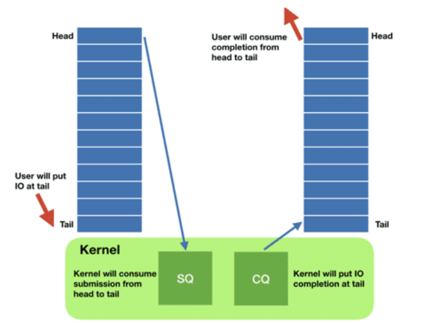
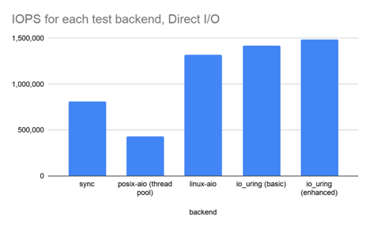

> 本文提出了一种用户态缺页异常处理框架，可以轻松适配不同的处理策略，适用于高并发环境。其亮点在于：
>
> - 框架的易用性：
>   - 基于 Linux 的 Semi-Microkernel 设计
>   - 透明
> - 性能：
>   - 采用了微内核和外核思想中的 upcall 设计
>   - 采用了先进的异步批处理 IO 后端 io_ring

## 一、背景

### 1.1 特化内存管理

从软件层去看，目前内存密集型应用越来越多，如 TB 级的机器学习、大型图计算，内存数据库等。从硬件层去看，硬件新特性有很多，比如分离式内存、分层内存等。这些新的变化都对内存管理策略提出了新的挑战。

通用操作系统的内存管理策略并不适用于内存密集型应用，也不能针对性的利用硬件新特性。有研究表明最大的系统瓶颈是内存管理而不是设备带宽。

特化的内存管理策略（offload，prefetch，swap policy...）可以大大缓解这一现象。但是**特化策略的普适性并不好**。

### 1.2 内核态内存管理

因为 Linux 内存管理模块十分基础、关键和复杂，所以在内核中开发、测试和部署一个新的内存管理策略开销非常大。大约 20 行代码即可描述的算法需要修改 20 个文件；测试开发需要 17 个月（和前面的不是同一个例子）；即使做出了，也很难被内核社区所接纳。

### 1.3 用户内存管理框架

“特化内存管理策略的有效性、不普适性和内核态内存策略的高昂开销”都在呼唤一个用户态的内存管理框架，也就是可以为多种内存管理策略提供支持的基础设施。

Linux 提供了 userfaultfd 机制来作为管理框架，用户基于此来实现用户态内存管理策略。框架的实现可以看作在进程中存在一个 manager thread，当一个 thread 发生 page fault 的时候，会通过基于 fd 的 IPC 方式（类似管道）给 manager thread 发信息报告自己缺失的地址等信息，manager thread 会根据相关信息进行处理。

本文认为这种方式并不适合高并发环境，采用 upcall 的方式和 ExoKernel 的理念去实现框架。

---

## 二、设计

### 2.1 upcall

Upcall 指的是从内核调用用户函数，可以看作是一种反向 syscall，常见于微内核系统，比如 chcore 中的 thread migration 机制。

传统的 userfaultfd 在高并发环境下存在延迟问题，这主要是由两方面原因组成：

一方面，线程的调度和切换开销很大，userfaultfd 下的 fault thread 和 MM thread 之间可能会插入多个其他无关线程（灰色虚线部分）：

而 upcall 可以由内核指定 MM thread 运行，并不需要调度：

另一方面，userfaultfd 的 MM thread 会串行处理 page fault，当多个线程都发生 page fault 的时候，会有排队现象：

但是利用 upcall 可以构造出 self-paging 机制，即 page fault handler 的本质是一个每个进程都有的库函数，发生 page fault 后内核会 upcall 进程自己的 handler 函数，这样多个 page fault handle 就可以并行了：

### 2.2 io_uring

内存管理可以分成前后端：前端负责处理 page fault 请求，分配页面完成映射；后端负责设备 I/O。

ExtMem 对于后端只要求 Direct I/O（也就是绕过 Linux 系统的 page cache），并没有对后端的同步和异步做出限制，ExtMem 自己使用了最为先进的 io_uring 机制。

之所以要强调这一点，是因为在后面的测试中，采用相同策略的 Linux 内核和 ExtMem 相对比，ExtMem 更占优势，它给出的解释是 ExtMem 在 evict 的代码更少，但是我觉得可能 io_uring 也发挥了一定的作用。

总得来说，io_uring 是 Linux 提供的一个先进的，异步的，非常适合批处理的 IO 接口：

Linux 内部的 IO 使用的是中断驱动模式（应该是，不保真），而 io_uring 可以使用轮询模式。在高性能设备上，IO 的开销是小于上下文切换的开销的，所以轮询模式更优。

---

## 三、实现

### 3.1 三层设计

在设计上，该框架分为 3 层：

- core：和内核交互，实现监视虚拟地址，完成映射，IO 等基础功能
- observability：提供对内存“冷热”等属性的信息
- policy：提供实现具体策略所需要的 API。

### 3.2 链接与拦截

为了用户的透明性（只 `mmap()` 等内存管理函数不需要修改），ExtMem 通过改变链接器的 `LD_PRELOAD` 变量实现了对于原有库函数的覆盖，通过使用 Intel libsyscall_intercept 技术实现了对于系统调用的覆盖。

### 3.3 改写 UserFaultFD，SIGBUS

upcall 并不是 Linux 的原生机制，所以需要修改 Linux 内核支持 upcall：

一方面，ExtMem 复用了 Linux 信号机制中的 SIGBUS 信号，因为信号机制可以看作内核调用用户 handler，和 upcall 的语义近似。但是信号对于 handler 可重入性和线程安全的要求较高，为了功能的正常高效运行，ExtMem 削弱了一些原本的约束。

一方面，ExtMem 修改了 userfaultfd，使其不再通过基于 fd  的 IPC 通信，而是通过信号通信。

---

## 四、评估

### 4.1 评估环境

如表所示：

| 条目     | 数据                              |
| -------- | --------------------------------- |
| CPU      | 2.30GHz 的 Intel Xeon 5218 处理器 |
| 核心     | 16 个核心，每个核心 32 个硬件线程 |
| 内存     | 198GB 的 DDR4 内存                |
| 外存     | 读取速率为 2700 MB/s 的 NVMe SSD  |
| 操作系统 | Linux 5.15                        |

### 4.2 单次延迟

处理单个 page fault 的延迟如下：

其中 Upcall 指的是进行过性能优化的 SIGBUS 方法。

可以看到 UFFD 的方式在高并发环境下表现不良。而 ExtMem 则更好。

### 4.3 相同策略吞吐

他们在 ExtMem 上实现了和 Linux 相同的 2Q-LRU 逐出策略并进行测试。

使用 `mmap`  microbenchmark 去测试吞吐量，将 RAM 限制到 8G 来触发 page fault。

它测试了随机访存和顺序访存两种 pattern 下的吞吐

可以看到 ExtMem 都是优于 Linux，它论文中解释原因为 evict 的代码更简洁：

> The EXTMEM implementation evicts pages more quickly than Linux does, because its eviction code path is simpler, thereby explaining its performance advantage

### 4.4 预取

在使用了预取策略后，我们评估 ExtMem 保留工作集的能力：

### 4.5 CSR

压缩稀疏行（Compressed Sparse Row，CSR）是一种广泛用于内存图分析的数据结构。为使用 CSR 的应用开发一种新的内存管理策略：”将关键数据尽可能保存在内存中，并且利用一个滑动窗口的思想来指导数据的读入和逐出“，被称为 ”PR“。

运行 Twitter dataset using GAP benchmark suite 效果对比如下：

---

## 五、总结

本文设计了一个用户态的内存管理策略框架，采用 upcall 机制来优化其在高并发环境下的表现，并且使用了一些工程技术来使得这个框架的易用性很好。
