> Attention Engine 可以被理解成**“Attetion 算子库 + Attention 运行时**”。有以下设计：
>
> - 可拆分的 Attention 算子：提高了 GPU 内存带宽利用率
> - 新的 KV Cache 管理抽象 CBSR：兼具 PagedAttention 和 RadixAttention 的优点，更 general
> - 宏观上动态、微观上静态的调度运行时：动态的同时不损害静态抽象和收益
> - 可定制的 Attention 算子框架、JIT：一些工程特性
>
> FlashInfer 这篇工作在 2023 年就提出了，据作者所言，那个时候只有 FlashAttention1，还没有 FA2&3，FlashDecode 等工作，但是这些工作论文发得更早。

## 一、Background

### FlashAttention

传统的 Attention 运算需要扫描 3 遍 GPU Memory 中的 Attention Logits 矩阵（len, len），计算密度低。

FlashAttention 提出了 1-pass 的 attention 算法，提高了计算密度，缓解了 GPU Memory 到 GPU Cache 的 IO 瓶颈：

### FlashAttention1 不适应 Decode 场景

FlashAttention 是为了训练开发的，Queries 的长度往往很长（也就是 Queries 彩色方块的高度很高），这样可以充分利用 GPU 上的计算资源。

而在 decode 阶段，采用自回归生成，每次的 Queries 的长度就为 1（也就是 Queries 彩色方块高度只有 1），那么计算资源就不会得到充分利用（按照 FlashDecode 的说法，是不到 1%）。

更加形式化地去看，在 FlashAttention 中，设置 $$l_q$$是 Queries 的长度，$$l_k$$是 K 的长度，那么一次 Attention 计算的访存开销是 $$O(l_q + l_k)$$，计算开销是 $$O(l_q l_k )$$，则计算密度是：
$$
O(\frac{l_q l_k}{l_q + l_k}) = O(\frac{1}{\frac{1}{l_q} + \frac{1}{l_k}} )
$$
如果考虑 $$l_{k}$$是一个很大的值（长文本或者推理模型都会导致 $$l_k$$ 很大），那么计算密度约等于 $$O(l_q)$$ 。当 $$l_q = 1$$ 时就会导致计算资源利用不足。

### Attention 的输入是动态变化的

而实际情况会更加复杂，query 的长度是会动态变化的，从应用场景区分，有 3 种：

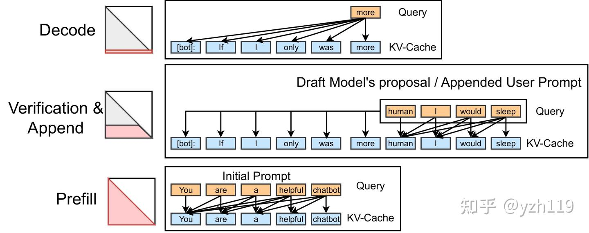

放到 roofline 上来看

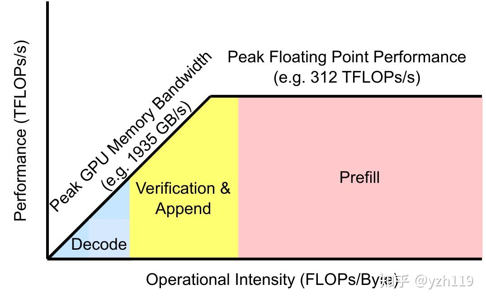

动态变化的 Queries 长度就对 Attention 的动态性提出了一定的要求。

此外优化长文本有一种经典的技术就是 KV Cache 稀疏，也就是 KV Cache 也会存在变化（不止是单调递增），如 NSA 就包含三种稀疏特性：

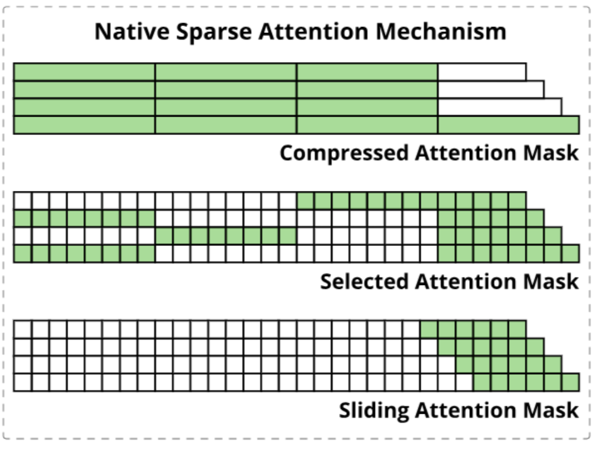

Attention 算子库既要利用特化的优势，又要有足够好的定制性。

---

## 二、Design

### 2.1 Split-K

原版的 FlashAttention 需要利用前缀和不断缩放校正（scale）局部结果，但是“前缀和”就意味着“顺序遍历”，而当 Queries 的长度较小时，就容易导致利用率不高。

通过调整算法，我们可以实现并行计算不同的 KV Cache Chunk：

所以为了达到这种 merge 的效果，我们需要记录每个 block 的一些运算结果，这些结果在文中被称为 Attention State。

每个 block $$\mathcal{I}$$ 需要记录两种 State，分别是 attention scale：

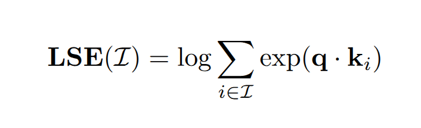

和 attention output：

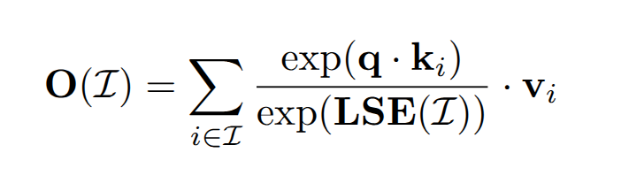

有了这两个东西以后，我们就可以将 block $$\mathcal{I}$$ 和 block $$\mathcal{J}$$ 融合到一起了：

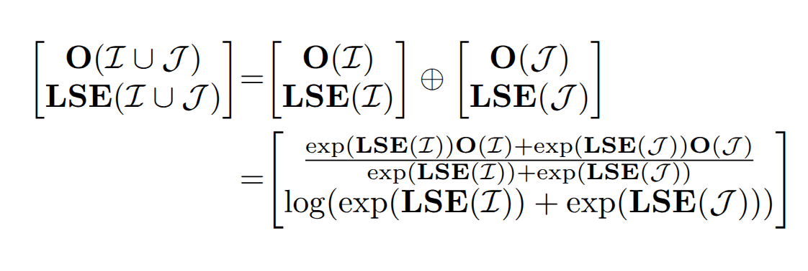

Split-K 算法改善了 FA1 在 Decode 场景下计算资源利用率不足的问题。

Split-K 策略也是 FlashDecode 的核心 Idea，对此 FI 的作者叶子豪解释道：

> 其实主要原因是我们跟 FA2 和 FlashDecoding 的开发几乎都是同期进行的，在 FlashAttention2 发布之前我们已经独立探索过了 FA2 中大部分的优化。而 FlashDecoding 我们在去年 8 月就已经有了较完整的实现和评测，不过我对 LLM 这个领域的内卷程度稍有低估没有及时推广，导致被抢发出来。抛开这些虚名而言，LLM Serving 还有很多工程上的问题需要解决，同志仍需努力。

### 2.2 Composable Attention

在有了 Split-K 算法之后，我们就有一个可拆分、组合的 Attention 算子。也就是说，Attention 算子所需要的 Q，KV 都可以被拆分成 Chunk，然后分步或者并行计算，只要最后规约在一起就好了。这给了设计者极大的灵活性：

比如说我们可以自由组织各个计算步骤，将不同的任务分配给不同的 threadblock：

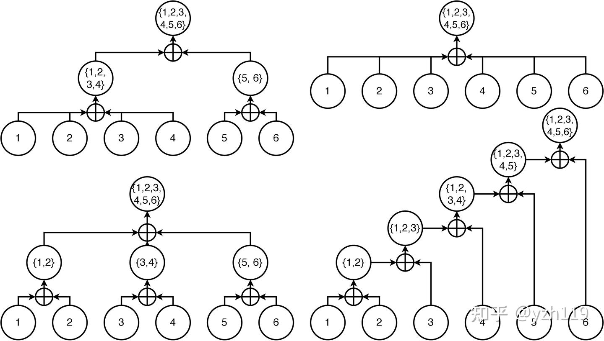

也可以将计算的中间结果保存下来在多个 Request 之间共享。

### 2.3 Block Compressed Sparse Row

BCSR 是 FI 管理 KV Cache 的数据格式，更本质的说，FI 在**用一个****稀疏矩阵****来模拟****页表**对 KV Cache 进行管理。

我们先用 OS 上的物理页面管理举例，我们有 2 个 Proc，2 个 Physical Page。其中 Proc0 只有 Page1，Proc1 有 Page0 和 Page1，那么我们就可以用一个 bool 矩阵表示这种关系：

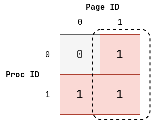

其中虚线的部分组成了一个 block，说明 Page1 是被 Proc0 和 Proc1 共享的。

然后我们迁移到 PI 上，将 Proc 换成 Query Chunk，将 Page 换成 KV Cache Chunk，有：

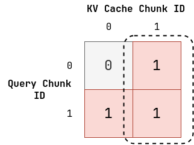

直接用论文中的图来看：

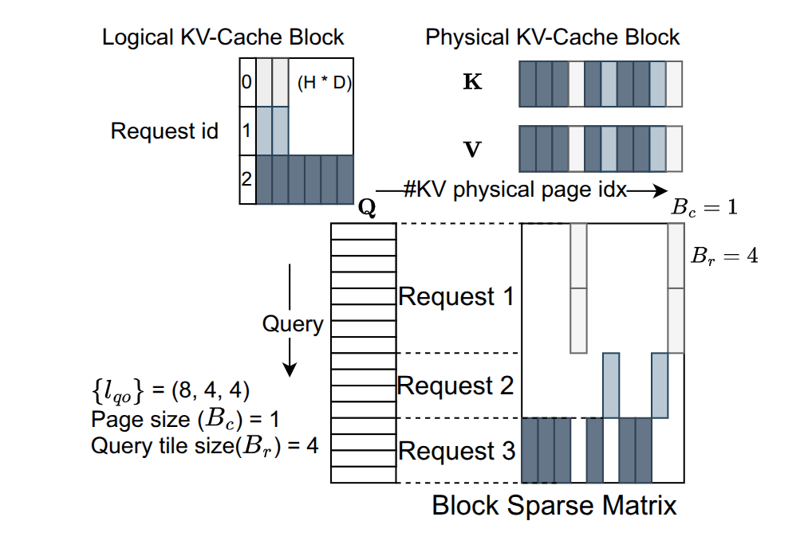

上图有一些省略的是，没必要用 bool 矩阵，而是可以用张量矩阵，矩阵中的每个元素都是一个形状为 `(layer, head, dim)` 的张量。

这种稀疏矩阵的表示方法，可以模拟出“内存分页”和“共享内存”的语义，这分别对应 PageAttention 和 RadixAttention 的设计。

使用稀疏矩阵这种数据结构，可以最大限度的发现里面“成块”的张量：

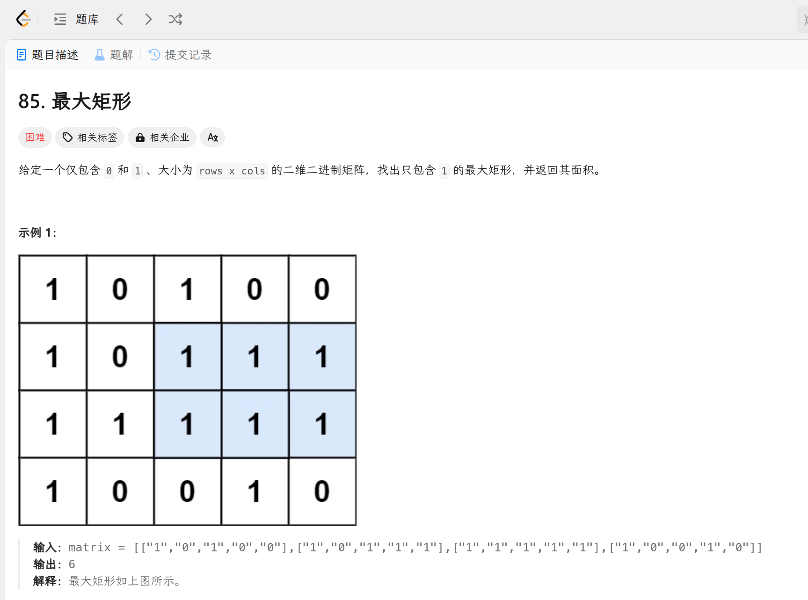

这种 block 的矩阵，说明了其中的 KV Cache Chunk 会被 share，或者 Q Chunk 会被 Share，也就是会被经常使用。那么就应该把这种 KV Cache 或者 Q 放到高层次存储（寄存器或者 cache），而那些不被 share 的，放到低层次存储中。如下所示：

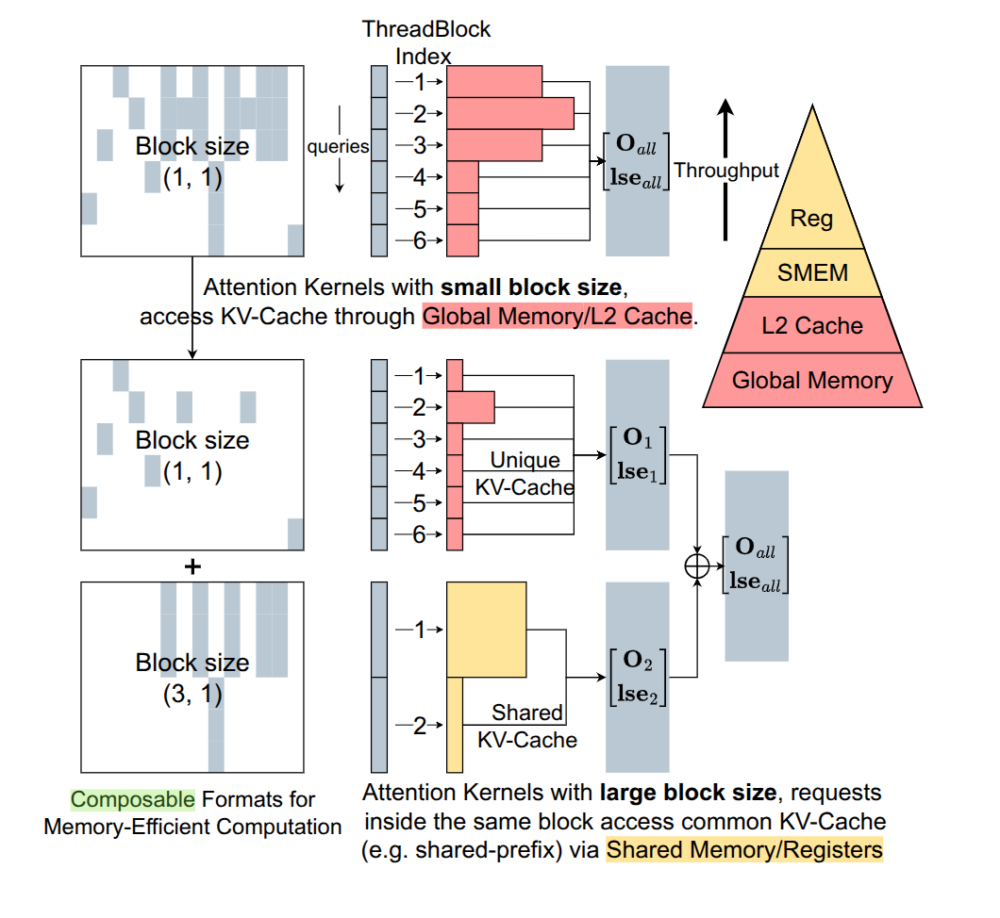

此外稀疏矩阵形式，也可以很简单的描述 KV Cache 稀疏策略（没有比矩阵更加直白的描述方式了）。

### 2.4 Dynamic Schedule

PI 调度的单位是 Attention 的小 block，调度算法的输入是一个 batch 内 QKV 的长度信息和当前硬件的架构信息（比如 TensorCore 的尺寸）。

调度的目标是 SM 的负载均衡，因为 Attention 可被拆分，所以调度算法设计并不难，如下所示：

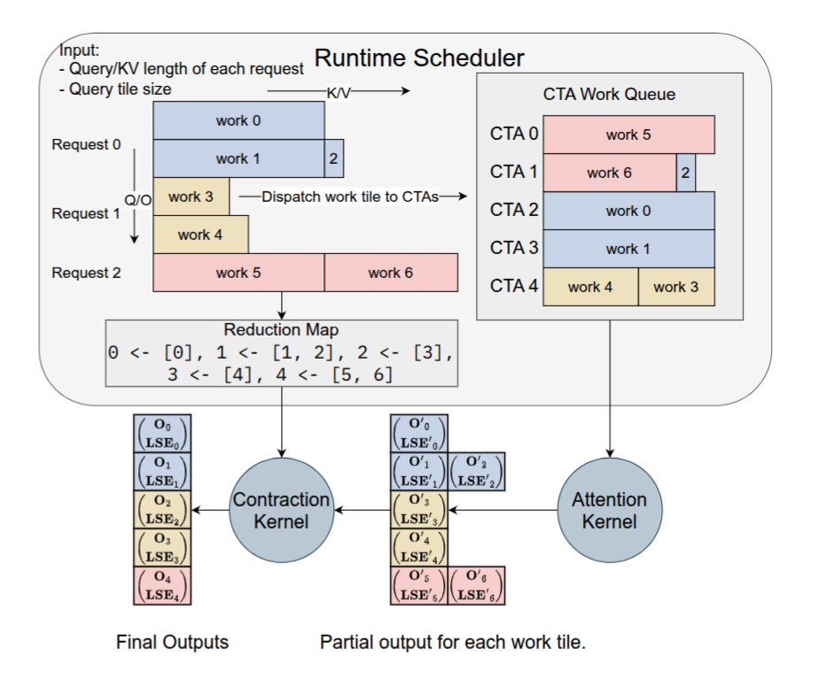

按照论文的说法，PI 采用的是一种“确定性调度”，这更有利于 LLM Serving，而且还可以发挥 CUDA Graph 的优势。

但是似乎这样就和动态调度有些违背，这里的动态调度指的是宏观上可以根据一个 batch 内的不同信息指定静态调度方针。

### 2.5 Other

- JIT：生成 CUDA 代码而不是 Triton 代码，一步到位
- 硬件架构：根据 GPU 架构选择 `LDGSTS` 还是 `TMA` ，使用 TensorCore 还是 CUDACore，Chunk Size
- 一系列 custom api，用于自定义 Attention 机制（FI 更像是一个 Attention 框架）。
- 融合 ROPE

---

## 三、Eval

### 3.1 端到端推理

使用 SGLang(FI) 与 SGLang(Triton) 和 TRTLLM 对比。

相比于 SGLang(Triton)，FI 的 FA 使用、JIT、动态调度使得其有良好的表现。

TRTLLM 作为 NVIDIA 的 Oracle，FI 有近似的表现。

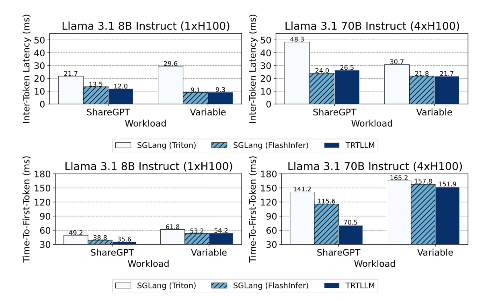

### 3.2 Kernel 测试

与 FA2&3 进行对比，主要测试的是针对 Query 的动态特性，能不能有及时的反应：

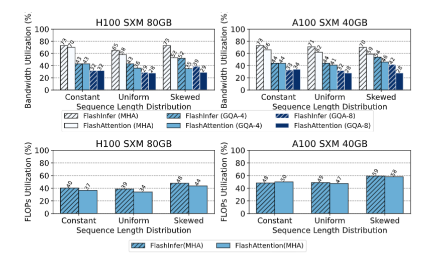

可以看到当 Query 具有动态性的时候，FI 更胜一筹，这说明 FI 的 runtime 更强。
