> 这篇工作比较缝合，它引用了 3 个 idea：
>
> - [Flash Attention](https://arxiv.org/abs/2205.14135) 和 pass 抽象
> - [TeAAL](https://dl.acm.org/doi/10.1145/3613424.3623791) 和它使用的 Einsum 规范
> - [Extended Einsum](https://arxiv.org/abs/2404.11591)
>
> TeAAL 提出用 Einsum 的形式去描述算子，并指导加速器的设计。但是 Einsum 只能描述仅包含加法和乘法的算子，对于 Flash-Attension 这种包含指数运算（softmax）和迭代运算的算子无法描述，于是作者借用了 Extended Einsum 的形式描述了 Flash Attension 算子并实现了 FuseMax 加速器，同时论证了 pass 抽象的合理性。
>
> 而实际上，TeAAL 提出的用 Einsum 指导加速器设计的思路并没有因为使用了 Extended Einsum 而被拓展；FuseMax 所展现的性能优势，大部分来自于 Flash-Attension 算法本身，而不是其硬件实现。

## 一、Background

### 1.1 Flash Attention, Pass

Flash-Attention 是一种 Attention 算子的实现，相比于传统的实现，它可以降低内存带宽的需求，并且使用更少的片上内存，更适合当前加速器存在的 memory bound。为了达到这个目的，我们需要：

- 尽可能少的从内存中读取数据 -> 算法设计的 pass 数要少
- 尽可能少使用片上内存 -> tile 后 reduce

而这两个需求都被 softmax 的传统实现阻止了，softmax 的表达式如下：

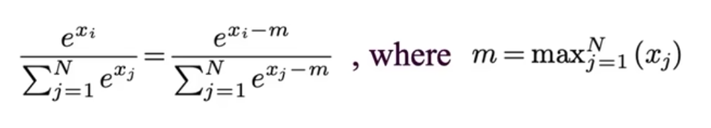

传统的 softmax 实现是一种 3-pass 的实现：

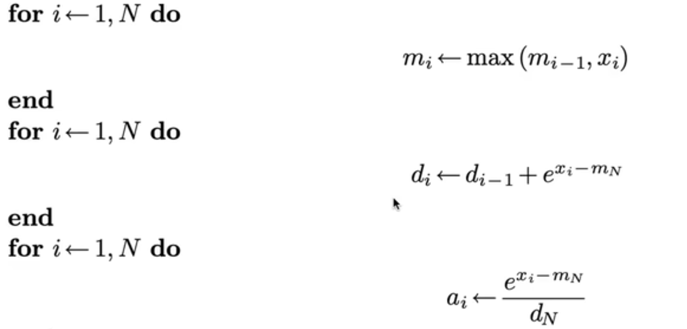

所谓的 pass，就是需要访问输入的次数：

> the number of times a given element of an input must be revisited after visiting every other element of the input. 

因为 softmax 需要先遍历所有元素计算出 max 值，然后根据 max 值遍历所有元素计算分母，再根据分母计算分子。

在 flash-attention 之前，有 2018 online-softmax 工作，将算法优化成了 2-pass 的。他将第 1，2 轮进行了合并：

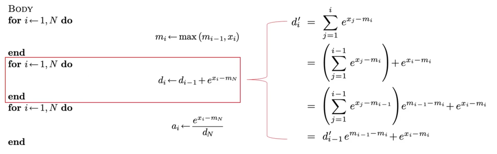

最终结果如图：

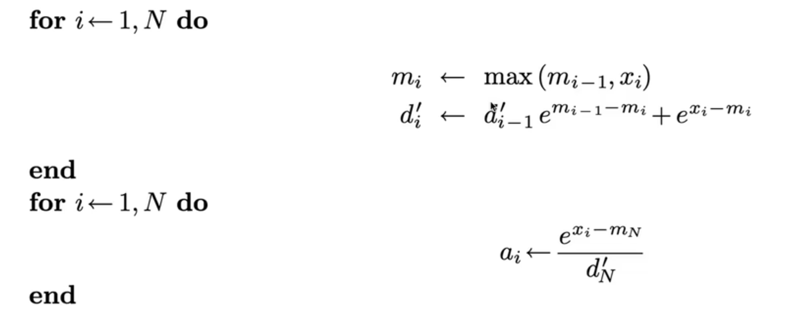

如果仅在 softmax 层，那么 2-pass 就是极限了，不过如果考虑整个 Attention，那么是可以继续优化成 1-pass 的算法，这就是 Flash-Attention，2-pass 的 Attention 表示如下：

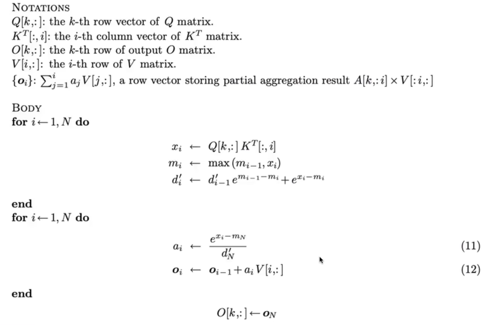

然后我们注意到（直观上说，是利用了 a 这个数组并不是最终结果，而是会被 reduce 的性质）：

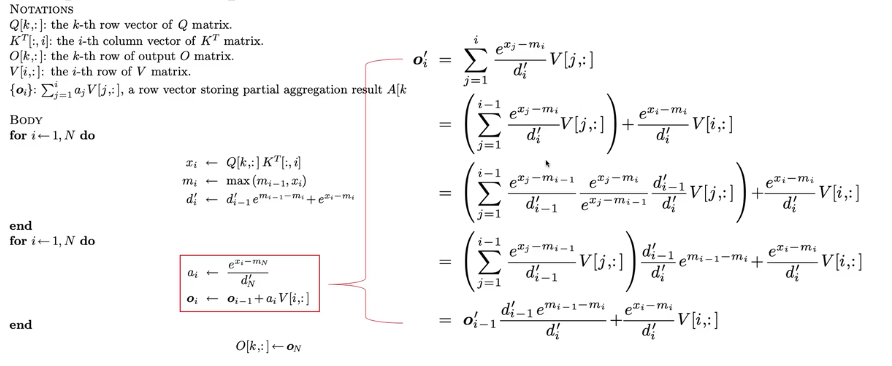

整理后得到：


这就是一个 1-pass 的 Flash-Attention 算法。在此基础上，如果增加了 tile 操作，那么就会获得完全体的 Flash-Attention，但这本文的重点是对于 pass 的优化。

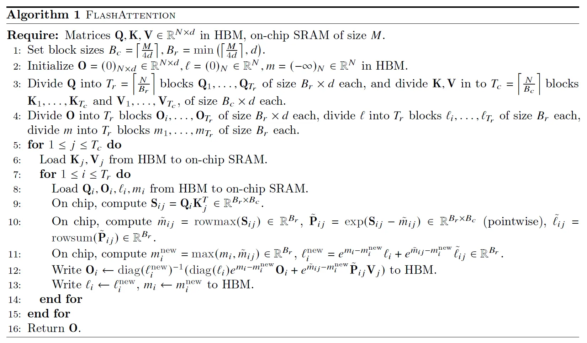

### 1.2 Einsum Notation

爱因斯坦求和标记（Einstein summation notation）是一种标记的约定，用于描述张量运算。比如说二维矩阵乘法就可以被描述为：

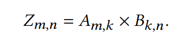

而矩阵与向量的乘法可以被描述为：

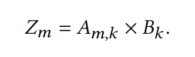

Einsum 的输入包括张量，如$$A, B$$和其对应的坐标，如$$m,k$$和$$k,n$$，还有输出矩阵对应的坐标，如$$m,$$，比如在 numpy 中，$$$$和$$$$的矩阵乘法写作：

```Python
np.einsum('mk,kn->mn', A, B)
```

Einsum 的特点在于，它将 compute 和 reduce 阶段完全区分开了，而不是混在一起，更加清晰了。

具体而言，在 compute 阶段，我们会根据输入坐标，构建一个迭代空间，然后遍历空间中的每一个点进行计算，得到一个相同维度的张量。以矩阵乘法为例，输入坐标是$$m,k$$和$$k,n$$，我们构建的迭代空间是$$[1,M] \times [1,K] \times [1,N]$$。经过计算得到的张量是$$z'_{m,k, n} = [a_{m,k} \times b_{k,n}]$$。

在 reduce 阶段，我们需要将我们得到的张量 $$z_{m,k,n}$$与输出坐标$$m,n$$进行比对，发现多了一个$$$$维度。所以我们会沿着多出的维度进行规约，然后就可以得到 $$z_{m,n}=[\sum^{K}_{k=1}[a_{m,k} \times b_{k,n}]$$。

对比我平时用的矩阵乘法，可以看到 compute 和 reduce 是混合在一起的。

```C
 for (int i = 0; i < M; i++) {
     for (int j = 0; j < N; j++) {
        for (int k = 0; k < K; k++) {
            Z[i][j] += A[i][k] * B[k][j];
         }
    }
}
```

### 1.3 TeAAL

TeAAL 是一个加速器模型 generator，可以根据不同算子生成不同的加速器模型。在它的设计中，算子需要使用 Einsum Cascade 来进行描述，也就是一系列的 Einsum 。

使用 Einsum 好处在于，引入了迭代空间，使得许多**加速器****设计**中的优化和 tradeoff 都非常清晰。TeAAL 提出了 3 个维度的优化：

- **Loop Order**：迭代空间“是$$[1,M] \times [1,K] \times [1,N]$$还是$$[1,K] \times [1,M] \times [1,N]$$”？这会影响数据是 stationary 的，还是 stream 的。
- **Splitting**：运算中我们常常将输入分块计算，也可以视为在对迭代空间分块。
- **Work scheduling**：根据迭代空间计算出的张量，是如何摆放的？包括空间和时间维度。

总之 Einsum 是一个非常适合数学化表述加速器设计的标记。

### 1.4 Extended Einsum

传统的 Einsum 是不能指定运算符的，比如说在 Numpy 中，Compute 阶段只能使用乘法，Reduce 阶段只能是加法：

```Python
np.einsum('mk,kn->mn', A, B)
```

 而 Extended Einsum 则允许自定义 Compute 和 Reduce 阶段的运算符，例如：

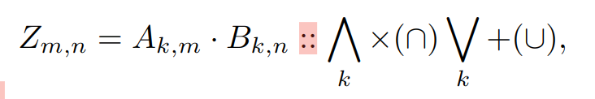

$$\bigwedg$$ 是 Compute 阶段使用的运算符，$$\bigve$$是 Reduce 阶段使用的运算符。

除此之外，Extended Einsum 还可以表达循环，比如说前缀和计算：

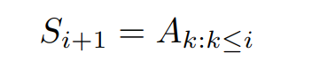

还可以表达递推式，同样是前缀和计算：

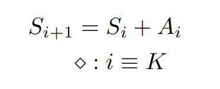

有了 Extended Einsum，我们就可以描述 Flash-Attention 这种包含许多复杂运算和递推式的算法。

---


## 二、Contribution

### 2.1 Einsum 与 Pass

本文认为，如果将算子写成 Einsum 的形式，那么是有助于确定算子的 Pass 数的，比如说这个算子，就是 2-Pass：

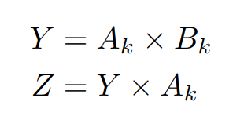

而相同功能的另一个算子，就是 1-Pass：

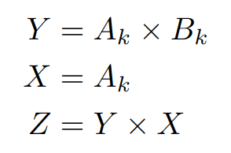

本文认为，迭代空间也可以被表示成一个 fibertree，而根据这些 fibertree 就可以判断 pass。首先，我不知道为什么原本适用于稀疏矩阵表示的 fibertree 要用来表示一个非常稠密的迭代空间（它可能是想说 fibertree 用于表示根据迭代空间生成的那个向量），其次，我不知道为什么表示成了 fibertree，就可以看出来是多少个 Pass。

它原文中对迭代空间的 fibertree 定义如下，非常的简略：

> The is-fibertree is a special tree where each fiber belongs to a rank in the iteration space of the Einsum.

而他介绍的根据 fibertree 识别 Pass 的方法，则依赖于非常主观的“Dependency”，其定义基本上和 Flash-Attention 中的定义一样：

> Now, in a scenario where fibers for a particular rank exist in multiple is-fibertrees; in each, they project to the same tensor; and **there is a dependency such that all of the elements of the earlier is-fibertree's fiber must be read before any element can be read again by the later is-fibertree (for all mappings of the** **cascade****)**, we refer to that read-read sequence as creating an additional pass.

这种冗余和主观定义的方式，指示它无法编写成一个程序来自动优化 Pass 数目：

> We leave a full analysis of the space of pass-reduction approaches to future work.

### 2.2 用 Einsum 表示 Flash-Attention

用 Extended Einsum 表示 Flash-Attention，结果如图：

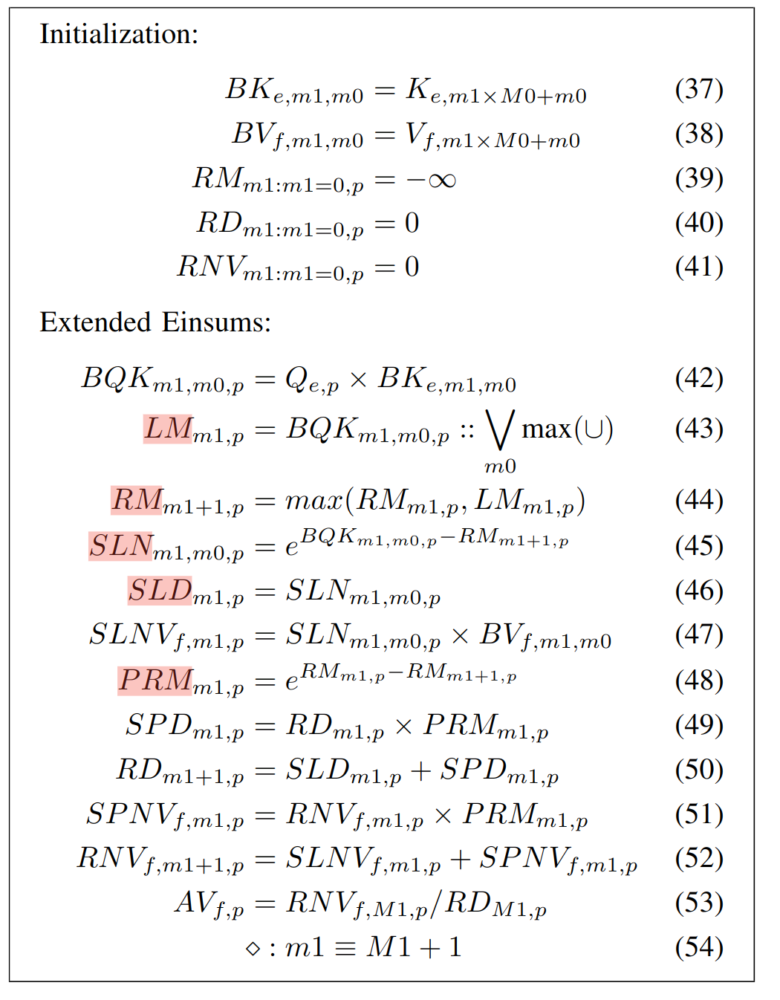

文章只是将 Flash-Attention 换了一种标记形式（从伪代码到 Einsum Cascade），其算法的实质并没有发生改变。

### 2.3 将 Flash-Attention Map 到硬件上

本文将 Flash-Attention 实现到了 Timeloop and Accelergy 模拟的 spatial 架构上：

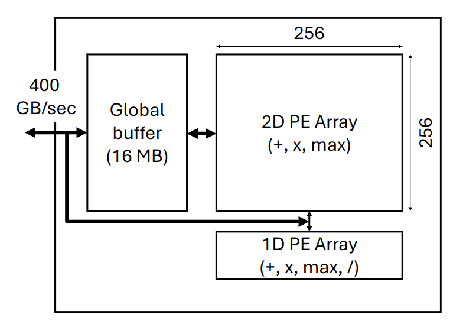

传统的 Attention 加速器，使用 2D Array 来计算矩阵乘法，使用 1D Array 来计算 softmax，这种安排的缺点在于，1D Array 计算 softmax 非常吃力，进而导致 2D Array 需要等待 1D Array 的计算，造成了低计算利用率。

但是 Flash-Attention 算法本身就融合 softmax 到前面的计算中，所以有一部分的 softmax 的计算任务，是可以放到 2D Array 中计算的，这样两个部分的计算任务就更加均衡了。

此外，2D Array 的 fill 和 drain 的开销很大，所以需要使用流水线的方法摊还（amortize）开销。

---


## 三、Evaluation

### 3.1 Setup

实验在 TimeLoop 模拟器上进行（全是 Python 代码），BaseLine 分别是一个未经优化的 Attention 加速器，和 FLAT（经过 Fusion 等优化，但是依然使用普通 Attention 算法的加速器）。

WorkLoad 有 BERT，TrXL，T5，XLM。

### 3.2 Compute Utilization

在真实负载情况下，计算单元利用率的比值：

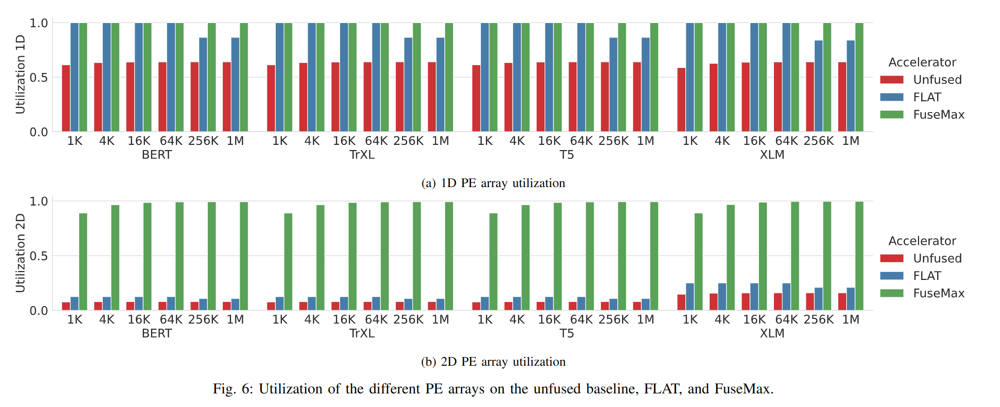

正如前文分析的，Baseline 的 2D Array 受到 1D Array 的拖累，导致利用率极低。

而在序列长度过长时，传统 Attention 算法会导致 global buffer 溢出，进而计算率下降，而 Flash-Attention 则没有这个问题。

### 3.3 SpeedUp

在 attention 时的加速比：

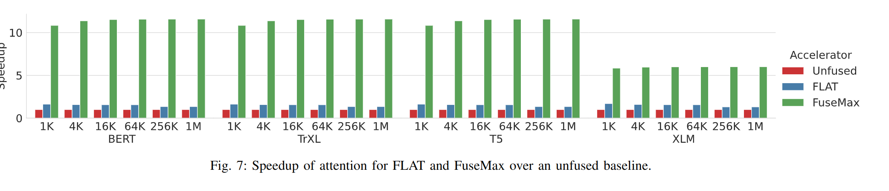

在 inference 时的加速比：


因为计算单元利用率提高，所以加速比也显著提高。

### 3.4 Energy

在 attention 时的能耗：

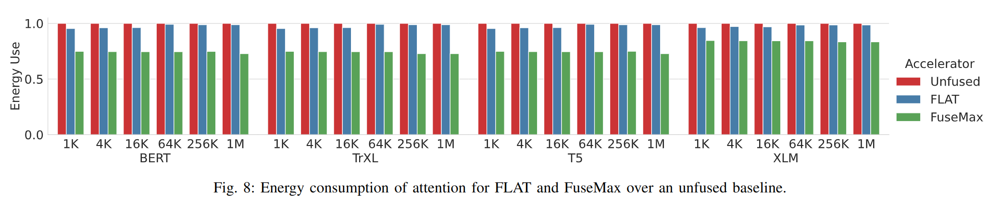

在 inference 时的能耗：


Flash-Attention 节约了 DRAM 的访存开销。

---


## 四、计算密度

这篇工作主要结合了前人的工作，许多成果本质上是算法（Flash-Attention）或者开发框架（TeAAL，Timeloop）的成果，而非这篇工作自己的成果。

随着计算单元数目的增多，Roofline 模型中的硬件的 $$I_{max}$$越来越往右移动，这就导致越来越多的算法成为 memory bound 的：

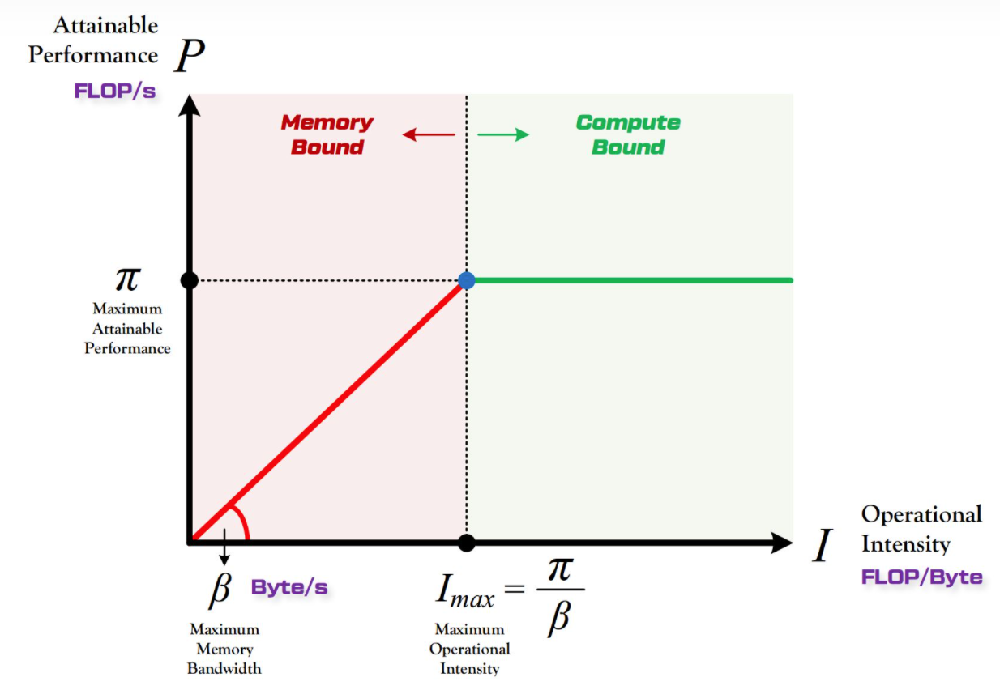

有一种解决问题的方式是减少内存读取的次数，比如说 Kernel Fusion：

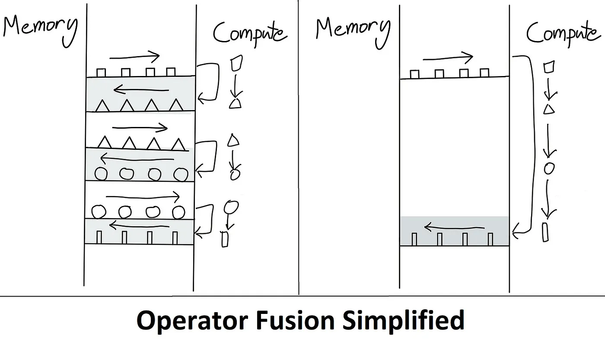

直白的 Fusion 并不会修改算子的实现，它只是将计算的中间结果存在了 On-chip Memory 中，但是 On-chip Memory 空间有限，这就导致一旦存不下来，依然会溢出到 Off-chip Memory 中，最终效果并不好（从上文的 Evaluation 中也可以看出）。

为了解决溢出问题（或者单纯为了减少访存次数），有一种思路是增加 On-chip Memory 的容量，比如说 IPU，相比于 CPU 和 GPU，就增加了更多的片上 SRAM：

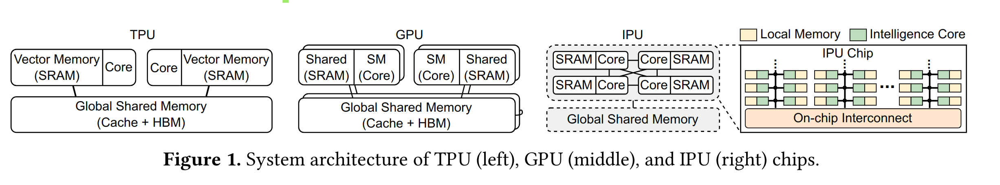

但是这种方式存在问题，就是片上 SRAM 的面积过大，IPU 很少去和 GPU 对比单位芯片面积（iso-area）下的性能。

Flash-Attention 和 FuseMax 我认为是另一种思路的代表，就是“以算代存”，计算的中间结果并存储后供后续使用，而是当需要使用的时候，再次计算一遍，是一种更加“数据流”的方法。通过构造额外的计算，来避免存储（Flash Attention 引入了更多的冗余的计算，但是减少了冗余的存储）：

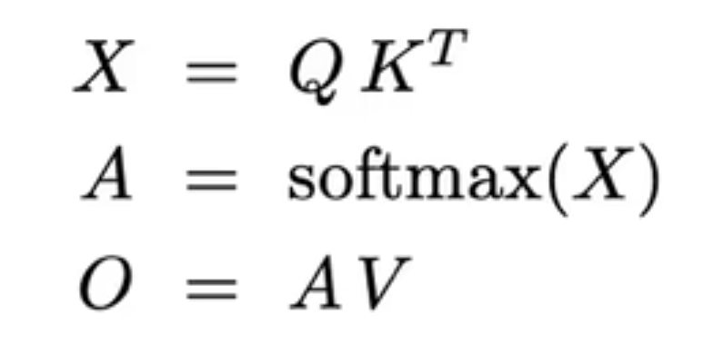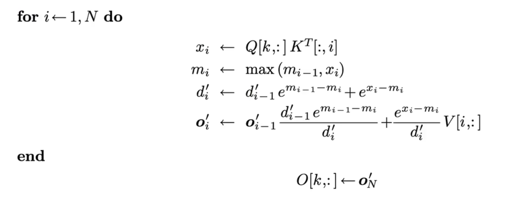

我个人隐隐约约感觉，计算单元和存储单元有某种统一性，如果能把握它并提出一种更好的抽象，或许可以做出一个更本质的 tradeoff。
