# Nephele：拓展虚拟环境为 Unikernel 提供 Clone 能力

## 一、概述

项目开源地址：https://github.com/nephele-vm


本文在 hypervisor 上为 unikernel 提供了 clone 能力。

---


## 二、背景

### 2.1 Unikernel

Unikernel 是一种特殊的虚拟机，将单个应用程序与支持它运行的操作系统服务集成到单个地址空间中。

这种集成的方式使得 Unikernel 的性能得到了提高，同时允许简单地移除未使用的操作系统代码。

与传统操作系统相比，Unikernel 的体积和内存占用都大大减少，从而降低了云计算成本。

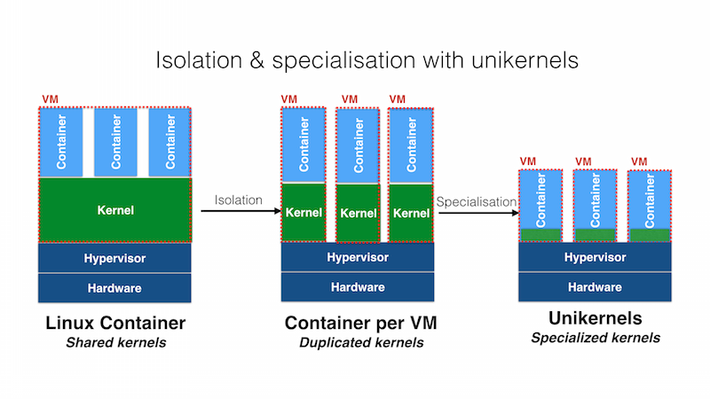

相比于普通的虚拟机，因为 Unikernel 为了节省资源和高效运行，移除了很多抽象，但这也导致了一些语义的缺失，比如说无法进行 Process Fork。

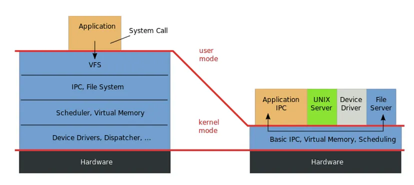

Unikernel 在云计算方面也被誉为“container 2.0”，Unikernel 在资源节约，安全性，平台独立性方面都比 docker 有优势。

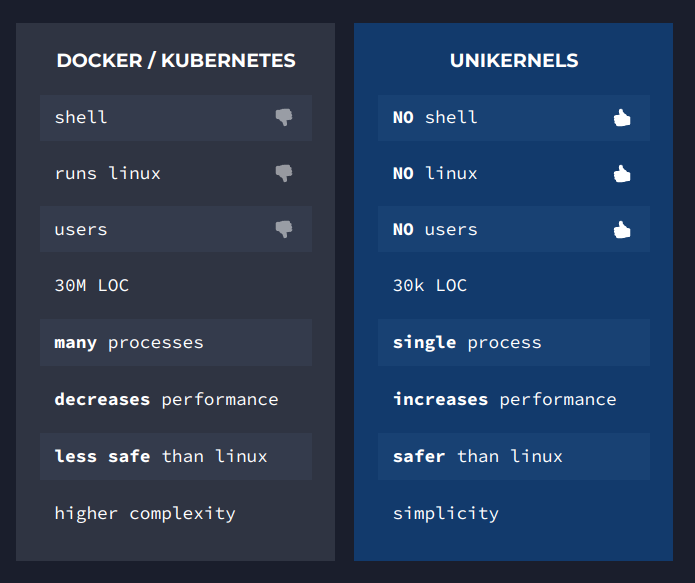

### 2.2 Fork

Unikernel 的重要设计就是通过移除“多地址空间”的抽象，来避免陷入内核和切换进程的开销，而 fork 要求存在多个地址空间。两者在语义上是冲突的。

在云计算方面，fork 的功能又是十分有优势的，比如说 NGINX 利用 fork 来 Clone 出多个进程，实现自动扩容，增大吞吐量；Redis 利用 fork 产生相同的内存副本，方便数据镜像的保存。

如果在云计算方面使用 Unikernel 技术，可以提高节约资源，提升性能，强化安全性。但是因为 fork 语义的缺失，所以许多使用了 fork 的应用都无法使用这项技术。

### 2.3 Xen

Xen 是一款半虚拟化的 hypervisor 框架。

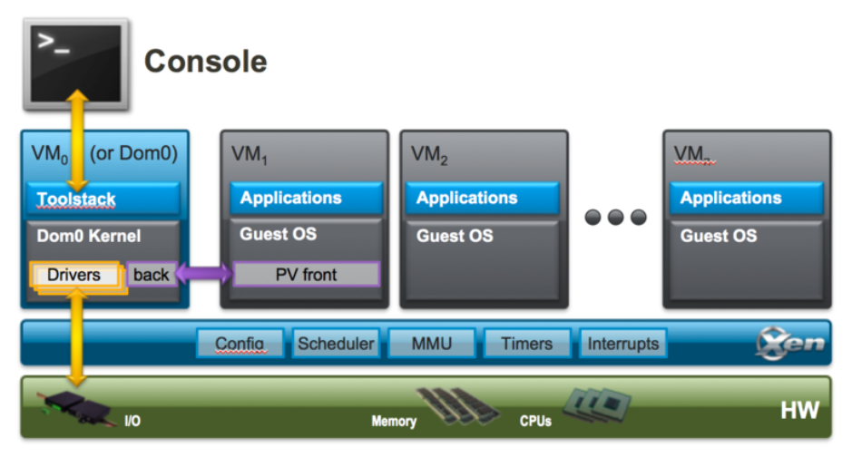

Xen 提供了一个抽象的硬件层，称为域 0 或管理域（Dom0），它运行一个特殊的操作系统（通常是Linux）。Dom0 负责管理其他虚拟机，也被称为控制域。在 Dom0 里运行 toolstack（xl），他会显式创建和管理其他的 VM。

虚拟监控程序（hypervisor）仅管理最小的关键资源集，包括 CPU、内存、定时器和中断，而对其他硬件设备的访问则由 Dom0 控制，Dom0 已经包含了支持这些设备所需的设备驱动程序。

---


## 三、设计

### 3.1 要求

Nephele 通过修改 Xen （Hypervisor 框架）为 unikernel 提供了 clone 的能力，也就是复制整个 Unikernel 的能力。

进而，Nephele 用 clone 模拟了 fork 功能，为 unikernel 提供了完全透明的 fork 支持。

因为 clone 同样也具有内存共享，写时复制（COW），资源复制，VM 间通信的能力，所以也具有和 fork 一样的节约资源（因为只读内存是共享的，资源有些也可以共享）、快速复制和方便控制的优点。

### 3.2 总览

整体实现思路是对 Xen 平台进行拓展，主要分为两个部分：

- 对于 hypervisor 进行拓展（较小改动，安全性考量）：
  - 提供一个 hypercall 来模拟 fork 和进程通信
  - 提醒 Dom0 进行剩余 clone 工作
- 对于 Dom0 进行拓展（较大改动）：
  - Xencloned 守护进程负责 clone 管理
  - 拓展 xenstored （管理 VM 元数据和通信的守护进程）方便进行 clone
    - ```C
      bool xs_clone(struct xs_handle∗ h, xs_transaction_tt, 
          unsigned int parent_domid, unsigned int child_domid, 
          enum xs_clone_op op, const char ∗parent_path, 
          const char∗ child_path);
      ```
  -  clone 资源：
    - 内存
    - 文件系统 9pfs
    - 设备

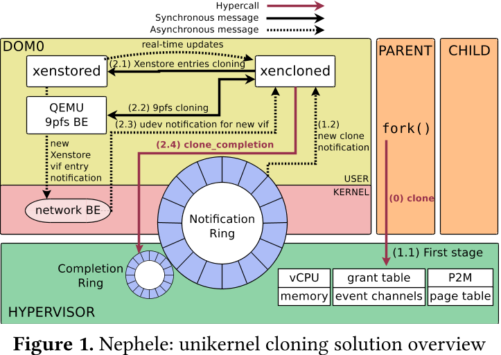

### 3.3 细节

#### 3.3.1 透明 fork

即这种 clone 可以完全模拟 fork，应用并不需要做出代码更改即可运行在 nepele 上，为了达到这一点，需要做出多处修改：

- 有一个寄存器专门专门返回 dom id
- 私有内存需要立刻复制，大部分内存是 COW 的
- 时序逻辑也模拟了 fork，即父 VM 需要当子 VM clone 完成后才能继续运行（hypervisor 通知）

#### 3.3.2 设备复制

设备 clone 是难点，因为有些设备需要共享，有些设备需要 clone；同时各种设备类型之间的行为和状态信息可能差异显著。为实现这一点，需要对分离驱动程序模型的每个组件进行更改。

IO 的本质是复制前后端传递数据用的环，这是因为前端是 guest VM 代码，肯定 COW 了，而后端在 Dom0 中，是实际的驱动，不需要复制，所以复制只用考虑 fork 当时的数据共享结构 ring。

#### 3.3.3 性能优化

Nephele 在 clone 的基础上做出了一些性能优化：

- 并没有复制全部代码，用于启动代码的代码就不会被复制（因为不需要）
- 地址翻译适配了 Xen 原有的融合思路，将 VA -> PA, PA ->MA 两个阶段缩短成 VA -> MA 一个阶段
- 在克隆过程中，设备前后端协商过程被跳过，两端从一开始就被创建为连接状态。
- XenStore 的元数据会被缓存在 Xencloned，可以加速多次 clone 操作

许多优化都是基于“clone 相比于重新启动，可以利用许多现有的状态信息”的优势。

---


## 四、实验

### 4.1 Clone vs Boot

对于 unikernel 需要复制出多个 VM 的情景，对比 clone 策略与 boot 策略：

- 实例化时间更短：clone 需要 20~30ms，boot 需要 160~300ms，速度提高 8 倍。这得益于 fork 的设计和相关优化
- 内存消耗更小：在相同内存情况下，使用 boot，获得 2800 个实例，而使用 clone，获得 8900 个实例，提高 3 倍，得益于 COW 机制

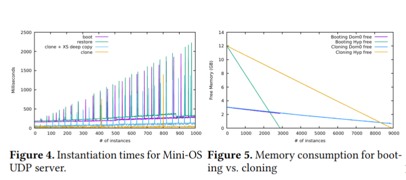

### 4.2 VM Clone vs Process Fork

使用 Nephele 与普通的 Linux fork 进行对比，因为普通 fork 只需要复制用户态代码，而 clone 则需要将整个 VM 复制，所以在理论上应该只能接近，不太可能超越。

- 用户内存空间对于 clone/fork 时长的影响，当内存空间增大的时候，两者的差距会缩小到 21%（最差是 5757%）。这是因为 clone 用的内存页面比 fork 用得更大，所以在大内存时有较好表现，而且因为缓存策略，所以在第二次 clone 的时候，差距会进一步缩小

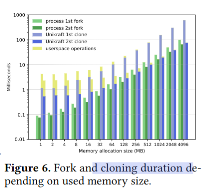

- NGINX 吞吐量对比：clone 策略更优：这是因为 IDC 实现要优于 IPC 实现，Unikernel 不用陷入内核态

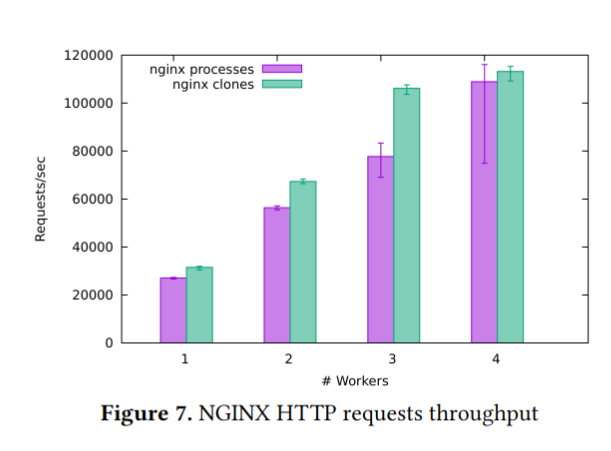

- 在 Redis 场景下，总体来说这种新式 fork 是没有办法和 Linux 原生 fork 相比的，但是随着数据库的扩大，差距会缩小

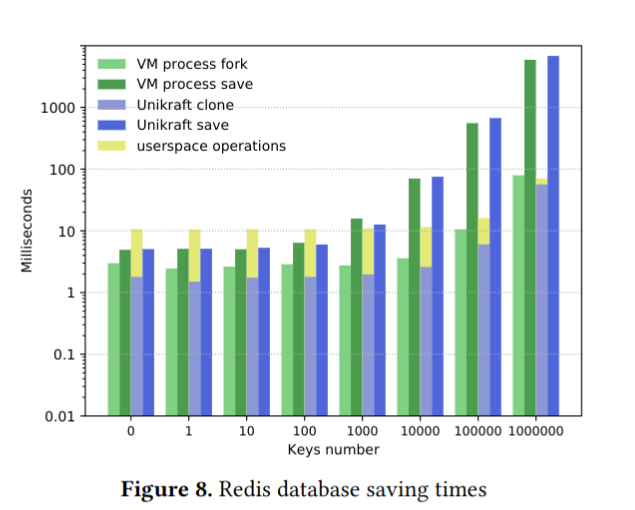

- Fuzz 测试：fuzz 测试会引发 COW。clone 支持将平均吞吐量提高到 470 次/秒，仅比 Linux 进程的平均 590 次/秒低 18.6%。

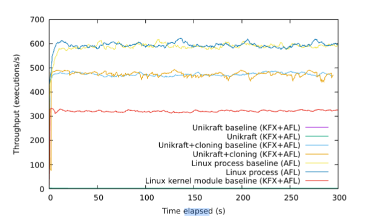

### 4.3 Unikernel vs Container

对比 Nephele 和 Docker 在 Function as a Service （FaaS）场景下的表现：

- Nephele 内存消耗更小，这得益于共享内存机制

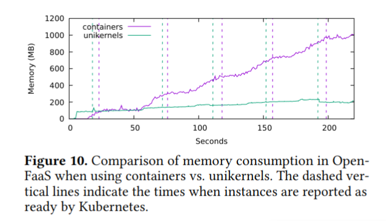

- Nephele 延迟更低，这是因为 Unikernel 移除了许多抽象层，倒不是 VM Clone 的原因

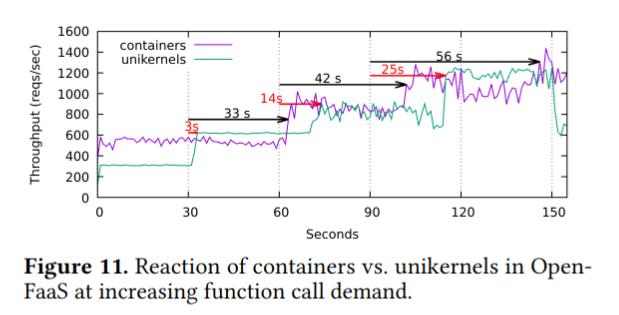

---


## 五、结论

在设计上，Unikernel 选择减少复杂性，来获得更好的性能和安全性，但是牺牲了功能的灵活性和全面性。

本文选择在 Hypervisor 层增加复杂性，来使得 Unikernel 兼具性能和功能。

对于 fork 的复杂性而言，无论是交给哪一方，都会导致复杂性激增。但是换一个角度讲，fork 本身如此复杂（clone，内存共享，状态复制，COW），本身就是非常不简洁的。有没有可能将 fork 的功能分解开，这样将复杂性平摊到不同部分呢？
