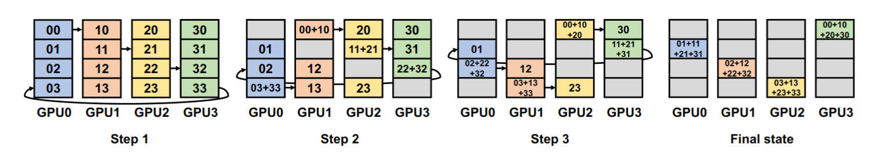
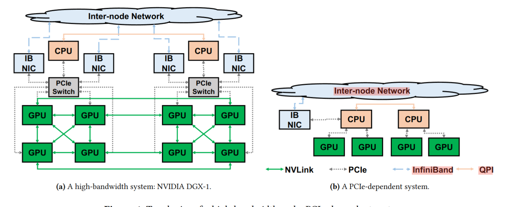
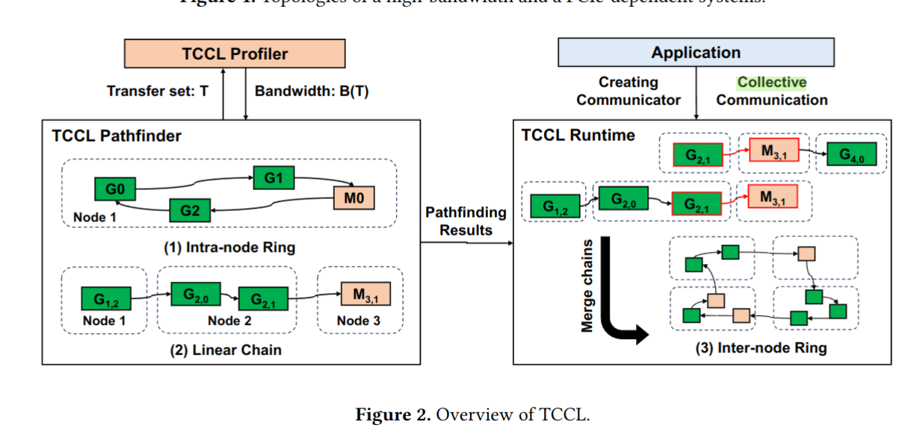
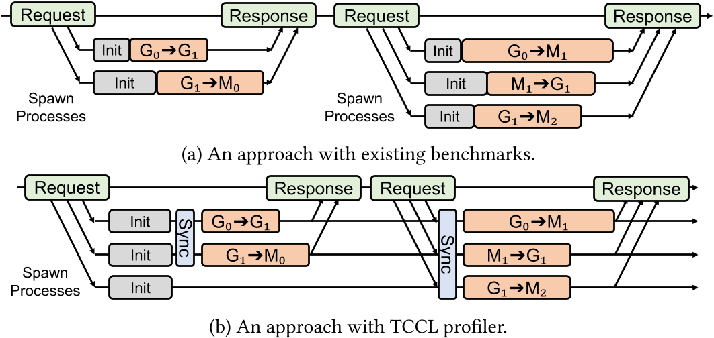
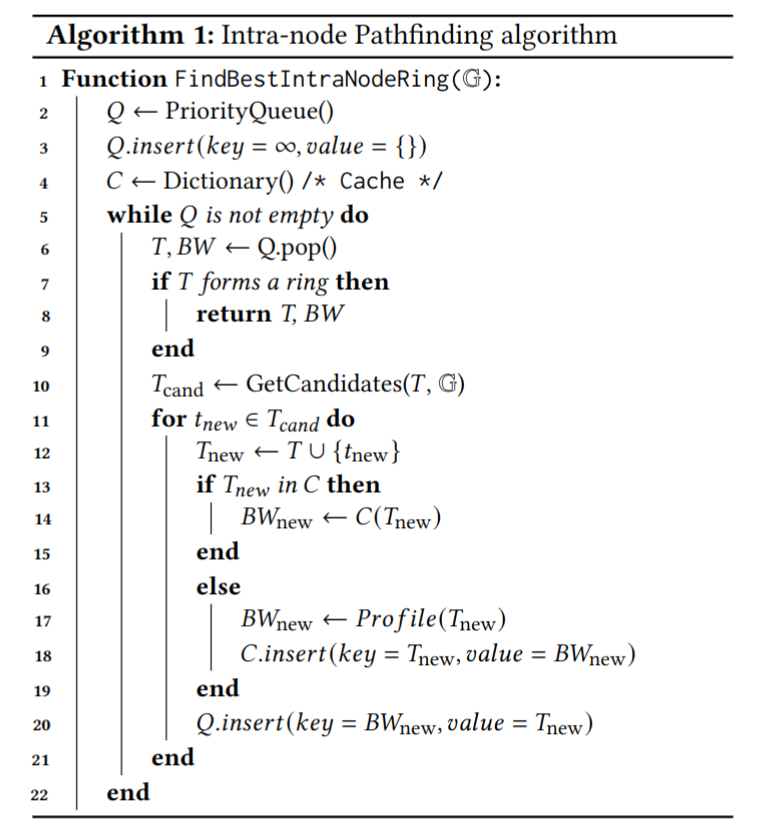
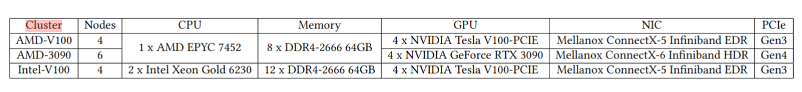
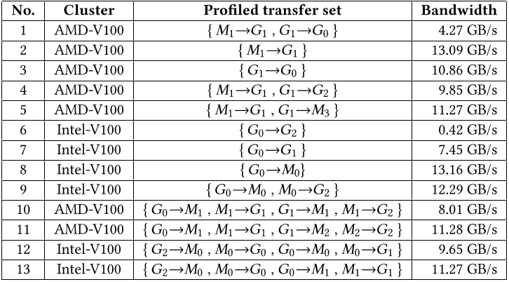
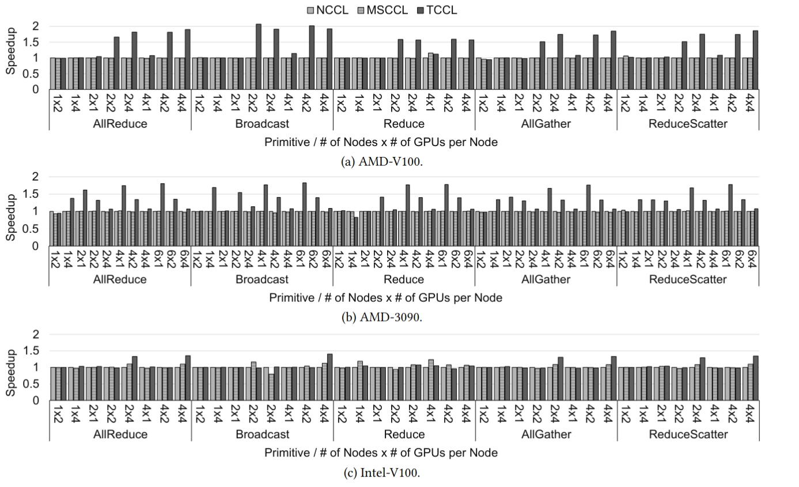
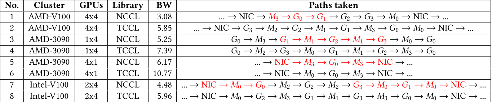
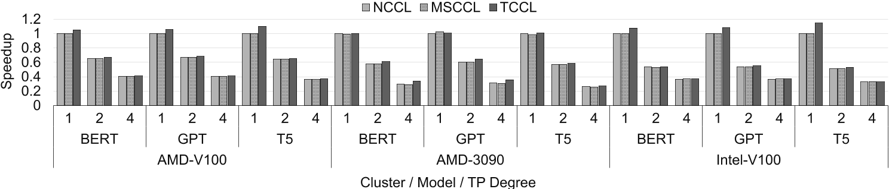

# TCCL: 为 PCIe GPU 集群发现更好的通信路径

论文地址：https://dl.acm.org/doi/10.1145/3620666.3651362

项目地址：https://github.com/mcrl/tccl

## 一、背景

### 1.1 计算集群

随着深度学习模型规模的增大，单一的 GPU 已经无法满足计算的需要了，人们使用计算集群（Computation Cluster），也就是一组相关的 CPU GPU 网卡和连接它们的数据通路组成。这样计算任务就可以被并行了，原本的计算也变成了"计算 + 传输"两个部分。

从并行方式上划分，可以分为数据并行（data parallism）和算法并行（pipeline parallism）。数据并行指的是将一个主任务分成多个相互独立的子任务。而算法并行指的是将主任务划分出不同的阶段，形成流水线，各个阶段依次依赖。数据并行通信的对带宽要求并不高；算法并行通信的主要操作是传递，对带宽较为敏感。似乎这种分类并没有统一标准，有许多类似的概念。

### 1.2 集体通信

集体通信（Collective Communication）是计算集群实现分布式并行计算的一个重要过程。代表操作有 `reduce, scatter, gather` 等。

其中成环算法（Ring algorithm）在集体通信的实现中非常重要：成环算法将 GPU 组成一个环，方便进行数据的分发和采集。如图所示：

成环算法在深度学习中有着广泛的应用，比如说数据并行（data parallelism），张量并行（tensor parallelism），序列并行（sequence parallelism），专家并行（Expert parallelism）中有着广泛应用。

我个人感觉集体通信更服务于数据并行或者类似概念的并行，因为这些操作对数据并行的"将主任务环分为多个子任务，将子任务合并成主任务"的逻辑很像，而与算法并行所需要的传递通信关系并不大。

### 1.3 分类

本文将目前的计算集群分成了两类，高带宽系统（high-bandwidth systems）和依赖 PCIe 的系统（PCIe-dependent systems）。

高带宽系统如 NVIDIA DGX-1 是硬件厂商打造的"旗舰系统"，具有专有的高带宽通路，比如 NVLink ，高带宽的专用交换机，比如说 NVSwitch 和 PCIe Switch ，高效的通信机制，可以全功率无阻塞的传递数据。

而许多研究院、初创公司和云服务厂商并没有足够的资金去购买这种高带宽集群，他们使用的是依赖 PCIe 的系统。这种系统没有高速数据通路，只能将 CPU 的 PCIe host bridge 和 NUMA 架构下的 CPU socket 当作交换通道，常常因为 GPU 间不支持直接传输功能，而需要借助 CPU 内存间接传输。这些特征说明了依赖 PCIe 的系统的本质是低带宽系统，为了方便行文，后续都称之为低带宽系统。

两种系统的示意图如下：

根据阿里巴巴的调查报告，大约 90.4% 的系统是低带宽系统。遗憾的是，现有的集体通信库在低带宽系统上表现远没有理论预估得好，出现了数据通路堵塞的现象，而在高带宽系统上则不存在这个问题。这是因为这些函数库都是针对高带宽系统设计的，忽略了低带宽系统的特殊性。

### 1.4 集群内部架构

#### 1.4.1 集群设备

在计算集群中，除了 CPU 和 GPU 这样的计算设备外，还有内存等设备也为计算任务的完成贡献了力量。

| 设备          | 解释                                                     |
| ------------- | -------------------------------------------------------- |
| CPU           | 初始化数据传输、参与数据搬运，CPU 用 Bounce Buffer 表示  |
| GPU           | 进行计算任务                                             |
| NVSwitch      | 英伟达专用的交换机                                       |
| PCIe Switch   | PCIe 设备交换机                                          |
| IB NIC        | 网卡，用于跨芯片通信                                     |
| Bounce Buffer | CPU 内存中的临时缓冲区，用于在数据传输过程中存储中转数据 |

#### 1.4.2 数据通路

数据通路是连接集群设备的线路，他们有带宽的差别，种类如下（表中数据没有经过详细考证）：

| 通路   | 带宽（GB/s） | 解释                     |
| ------ | ------------ | ------------------------ |
| NVLink | 300 ~ 1800   | 英伟达专用的通路         |
| PCIe   | 30 ~ 120     | PCIe 设备使用的通路      |
| IB     | 2 ~ 30       | IB NIC 使用的通路        |
| QPI    | 8 ~ 20       | NUMA 节点中 CPU 间的通路 |

#### 1.4.3 NUMA

NUMA（Non-Uniform Memory Access）架构在计算集群中指的是集群中的设备（CPU，内存，网卡，GPU）被组成成了多个节点（Node）。当 GPU、网卡和 CPU 主内存属于同一 NUMA 节点时，它们之间的通信速度会更快。相反，如果它们属于不同的 NUMA 节点，则可能会产生较高的访问延迟和较低的带宽。

抽象来看，一个计算集群可以被理解为一个具有多个子图的图，每个子图是一个 NUMA Node 。计算设备是图上的点，而数据通路是图上的边。

成环问题就是在这个图上找到一个带宽最大的环的问题。

---

## 二、设计

### 2.1 Overview

TCCL 基于 NCCL 库（这是英伟达开发的一款集体通信库）构建。分为 Profiler 和 PathFinder, Profiler 用于测试带宽，PathFinder 用于成环路径生成，结构如图所示：

在初始化阶段，Profiler 会测试实际带宽，PathFinder 会根据测试结果生成节点内环和节点内链，在调用阶段，PathFinder 会根据 Communicator 的要求返回节点内环，如果发生跨节点通信，PathFinder 会将节点内链组合起来形成跨节点环。

### 2.2 Profile

为了测试精准性，原有的 benchmark 需要运行多次，而每次的初始化时间不固定，所以最后测试出来的 transfer 开销也是不固定的，而且每次测试前都需要进行初始化，非常耗时。TCCL 改进了原有的测试实际带宽的形式，提供了一个进程池用于测量，只需要 spawn 和 init 一次即可，并且在测试前还需要进行同步，提高测试精读，如下所示：

### 2.3 PathFinder

路径可以分为节点内路径和跨节点路径。因为可能的路径太多了，所以没有办法枚举来获得最优解。所以 TCCL 先用一个类似 Dijkstra 的优先队列最短路径算法来求取节点内的最优路径，然后再用动态规划结合上一问的解来求解跨节点的最优路径。

求解节点内最优路径的伪代码如下：

这个算法从两个数据结构开始：一个是需要访问的 GPU 集合 `G` （相当于点集），另一个是一个最大优先队列 `Q`，其中带宽是 key，transfer set 是 value （相当于边集）。这个队列里会包括所有已经 profiled 过了（也就是知道带宽了）但是还可以进一步加入（append） transfer 的所有 transfer set 。这和 dijkstra 算法很像，这是因为 dijkstra 算法可以用优先队列来选择出下一步要 append 的边（也就是最短的边），而这里用最大优先队列来选择最大带宽的边。带宽和边长有一定的相似性。

和 dijkstra 原理类似，当 `T` 成环的时候，它一定是优先队列中带宽最大的，同时那些没有加入队列的路径，肯定不如 `T` 的带宽大。

而节点间的求解，因为节点过多，所以用 dijkstra 算法复杂度（ $O((V+E)logV)$ ）会提高，先找到节点内的短链（使用 dijkstra 算法），再将这些短链在节点间连成环。

---

## 三、实验

### 3.1 环境设置

实验采用了 3 种低带宽的计算集群，分别是 AMD-V100, AMD-3090, Intel-V100 ，其具体配置如下：

实验与 NCCL 和 MSCCL 进行对比。NCCL 在初始化阶段就确定了路径，所以不需要运行时 profile 。MSCCL（Multiple Schedulers for Collective Communication Library）是建立在 NCCL 之上的运行时系统。它利用 TACCL 产生的通信调度，并结合任务的执行计划，实现高效的集合通信。

### 3.2 拥塞模式

TCCL 记录了当发生拥塞（也就是实际带宽与理想带宽出现严重不符）时的模式（congestion pattern），但是却没有详细分析这些拥塞的成因，也没有利用这些模式优化算法。

TCCL 记录了 3 种模式：

1，2，3 号实验说明，当 GPU 一边写 CPU 内存，一边写其他 NUMA Node GPU 内存时，会出现堵塞。

从第 6 和第 9 组实验中可以看出，这里说得是如果不同 Node 间的 GPU 直接写内存，那么性能会出现不可解释地下降，所以不如改用 bounce buffer 。

从 10 和 11，12 和 13 的对比中可以看出，由于 CPU 内存带宽有限，当太多的传输集中在同一 NUMA 节点的 CPU 内存上时，性能可能会下降。所以要更换为不同的 CPU。

我个人觉得这里的意义只说说明了对于低带宽系统，会出现许多难以预料的拥塞，原本基于理论带宽构建的库并不适合低带宽系统。

### 3.3 集体通信原语

我们测试了 5 种集体通信元语在 3 种库上的对比，结果如图：

可以看到 TCCL 相较于 baseline 具有 1 \~ 2 倍的提速。这是因为 TCCL 在路径规划是避开了带宽较小（因为发生了堵塞）的通路（红色所示）。

### 3.4 深度学习模型

深度学习训练模型结果对比如图：

与 TCCL 在单个原语中实现的加速相比，这种加速相对较小，因为在纯数据并行化配置中，通信仅占总执行时间的约 15%。

DL 模型测试不乐观的原因是这些 DL 模型都是为高带宽集群设计的。如果希望低带宽集群和 TCCL 发挥作用，需要新的 DL 模型设计思路。

----

## 四、总结

TCCL 在集体通信库上针对依赖 PCIe 的系统（低带宽系统）进行了优化。相较于原有的 NCCL 之类的库，有如下优势：

1.  考虑了不存在超高带宽（如 NVLink）的数据通路情况，超高带宽容易让算法开发难度降低。
2.  考虑了 NUMA Node 内部设备较少的情况，也就是考虑了更多跨节点通信的情况。
3.  考虑了包含 Bounce Buffer 或者 NIC 等设备的路径，这是因为低带宽系统中的 Direct Write 较弱。
4.  考虑了实际发生的并行传输时的拥塞现象，不再用理论带宽作为算法依据。

我个人觉得 TCCL 的优化并不是仅针对于低带宽集群的特异性，有些优化是 general 的：

1.  dijkstra 算法配合动态规划降低算法复杂度。
2.  用拓扑双射优化 Cache 提高运行效率。
3.  维护进程池方便准确测量实际带宽

这些举措放到高带宽系统上依然也有优化作用。

此外，对于拥塞导致的带宽下降，本文只是在初始化阶段简单了规避了拥塞发生的通路。而拥塞控制如果是一个运行时动态调整的操作，我觉得可能会更好，实时检测各个数据通路的拥塞情况，并据此改变路径的选择。

---

