VeriSMo 的可信基只包括硬件和它自己（VM），剔除了对于 Hypervisor 的信任。传统的 VM 的安全服务是由 Hypervisor 负责的，如果认为 Hypervisor 是不可信的，那么就不能由它来提供安全服务。AMD 提供了新的安全架构 SEV-SNP，它为在 VM 中独立实现安全服务提供了支持，VeriSMO 就利用了这个硬件特性。

除了利用新的硬件安全特性外，VeriSMo 在开发时完成了形式化验证来确保安全性。VeriSMo 的开发语言是 Rust，已经确保了部分的内存安全性（也就是 Rust Checker 承担了部分形式化验证的任务），距离完全的形式化验证还有两个挑战：

1. 因为 Hypervisor 不可信任，所以 Hypervisor 可以打断 VM 的执行并修改硬件状态，这种并行无法简单验证。
2. 开发 VeriSMo 需要使用 Unsafe Rust，Rust Checker 无法验证这种情况。

为了解决挑战 1，VeriSMo 将验证拆分成了 2 层，上层为机器模型层（Machine Model），用 model verify 专门约束 Hypervisor 的行为，下层为实现层（Implement），用于解决排除了 Hypervisor 干扰后的 VeriSMo 本身的验证问题。

为了解决挑战 2，VeriSMo 引入并拓展了 Verus 来对 Unsafe 的情况进行验证，Verus 是 Rust 的一个库，可以看作它强化了原本的 Checker 功能；

## 一、技术背景

这个项目使用了大量的第三方技术和理论（多到和我用技术背景水字数的毕设差不多比例了）。

### 1.1 理论

reference：

[程序验证技术——霍尔逻辑 - 撸代码 - LuCode.net](https://blog.lucode.net/theory/PV-HoareLogic.html)

#### 1.1.1 验证逻辑

在验证逻辑方面并没有“显式”使用，只需要明确它们都涉及了 Rust Borrower Checker 和 Verus 的基础理论。其中尤其是线性逻辑，是可以支持并行程序内部的验证的，所以 VeriSMo 作为一个并行程序，形式化验证并没有理论上的难度，只是在实现上存在难度。

#### 1.1.2 验证等级

形式化验证有两个等级：模型（Model）级别和实现（Implement）级别。其中实现级别的验证就是直观的对于具体的代码的形式化验证。而模型级别的验证是验证抽象模型，而不是具体的代码实现。这些模型通常通过状态机、流程图或其他形式化描述来表示。

在本项目中，验证分为两层，其中对于机器层的验证，就是模型级的，对于 VeriSMo 本身的验证，是实现级的。

### 1.2 硬件

reference：

[Hardware VM Isolation in the Cloud](https://dl.acm.org/doi/fullHtml/10.1145/3623392)

[【TEE】【AMD SEV内存加密】 白皮书-CSDN博客](https://blog.csdn.net/qq_43543209/article/details/135652011)

硬件特性有很多，其核心在于将原本由 Hypervisor 负责的安全功能全部提供给 VM 。

#### 1.2.1 加密内存

SME（Secure Memory Encrypted）：写入内存时利用硬件生成的 VM-specific key 对数据加密，读取内存是对数据解密。VM 可以通过 PTE 中的 `C-bit` 对物理页进行选择性加密。

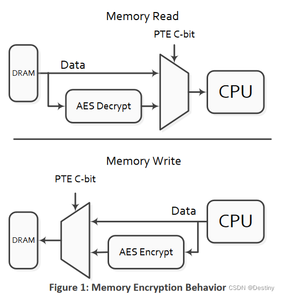

SEV-SNP 引入了反向映射表（RMP，Reverse Map Table）。之所以称之为反向映射表，是因为在传统的 VM 地址翻译中，映射方向是：

> gVA => gPA（guest 物理地址） => sPA（系统物理地址）

而 RMP 中记录的是：

> sPA => {gPA, valid_bit, ASID}

与传统方向相反。

RMP 的设计主要是为了使得物理内存真的分配给了特定的 VM，恶意的 Hypervisor 无法欺骗 VM 。当 Hypervisor 给 VM 分配内存时，需要使用特定的 `rmpupdate` 指令，VM 需要使用 `rmpvalid` 指令确认此次分配符合自己的要求。一旦分配完成后，Hypervisor 就无法再写入该内存页面了。后续 VM 可以使用 `rmpupdate` 来调整权限或者映射关系。

采用反向映射的方式，在地址翻译的时候增添一次映射来核对 GPA （GPA 是否真的对应特定的 SPA）和 ASID （VM 是否真的是特定的 VM）来确保“恶意 Hypervisor 无法尝试将页面映射到 Guest 地址空间中的错误位置”。

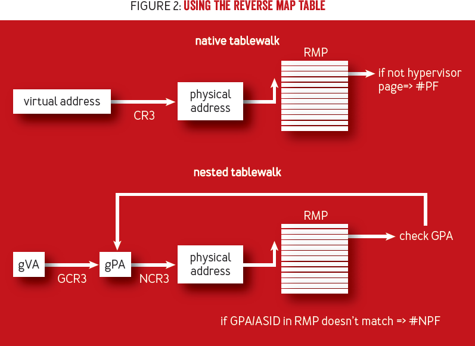

#### 1.2.2 上下文加密

ES（Encrypted state）：在 VM 内陷到 Hypervisor 的时候，CPU 的状态会被加密保存到 VM Saving Area (VMSA) 。

#### 1.2.3 安全中断

当限制中断（restricted）被启用时，Hypervisor 只能注入一种叫作 #HV 的中断，当 #HV 中断到达某个 VMPL 时，该 VMPL 的 VM 代码可以参考 #HV 门铃页来检查中断类型，而不是直接跳转到任意的中断处理程序。

共享门铃页（Shared Doorbell Page）是一个内存页面，被 Hypervisor 和 VM 的不同权限级别共享，用于传递中断和事件通知的信息。当 Hypervisor 发生注入某个特定类型的中断的时候，可以先修改门铃页来记录要触发的中断类型，然后给 VM 注入 #HV 中断，VM 收到 #HV 中断后会查看门铃页里的中断类型，进而做出相应处理。而不是直接被 Hypervisor 改变程序流。

VeriSMo 启用了 restricted-mode，减少了 Hypervisor 中断注入攻击的攻击面。

#### 1.2.4 虚拟机特权等级

在经历了内存加密和寄存器加密后，其实特权等级模型已经发生了变换。传统的特权等级模型下，高特权级可以随意访问低特权级的资源，随意影响低特权级软件的程序流（中断）；但是在 AMD SEV 中，即使是高特权级也无法访问一些低特权级的资源。

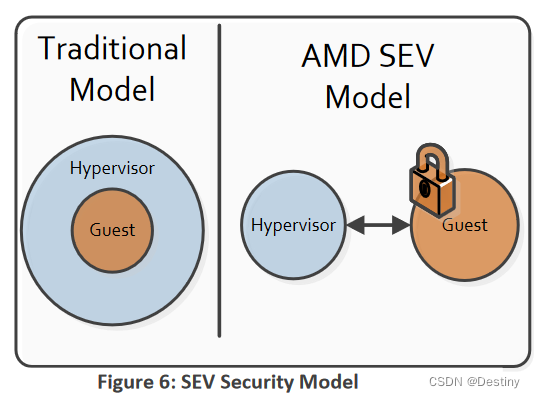

更进一步，SEV-SNP 提供了 VMPL（虚拟机特权级别）的功能。该功能允许进行额外的安全控制，以保护 guest 内部的内存免受同一 guest 中其他代码的影响。每个 guest 最多可以有四个 VMPL，其中 VMPL0 权限最高，VMPL3 权限最低。分配给 guest 的每个内存页面可能具有基于 VMPL 的不同权限。 VMPL0 始终具有对 guest 地址空间中每个页面的完全访问权限，但它可能会将某些页面配置为不可在 VMPL1 上访问，或者可能允许只读访问。

VeriSMo 就是一个运行在 VMPL0 上的软件，而 Guest OS 运行在 VMPL3（只要不是 VMPL0 就行）上，这样可以避免不受信任的 Guest OS 的攻击。VMPL0 除了可以管理

### 1.3 软件

reference：

[Verus Tutorial and Reference](https://verus-lang.github.io/verus/guide/)

#### 1.3.1 Rust Checker

Rust 的所有权系统和类型系统确保了一定的安全性，但是 Unsafe Rust 可能会导致 bug 或者安全性问题。

#### 1.3.2 Verus

Verus 是一个为 Rust 设计的形式化验证工具，它看上去就像一个被拓展了语法的 Rust。

```Rust
verus! {
fn octuple(x1: i8) -> (x8: i8)
    requires
        -16 <= x1 < 16,
    ensures
        x8 == 8 * x1,
{
    let x2 = x1 + x1;
    let x4 = x2 + x2;
    x4 + x4
}

fn main() {
    let n = octuple(10);
    assert(n == 80);
}
} // verus!
```

可以注意到相比于普通的 Rust，多加了 `requires, ensures, invarient` 等关键词，这些是形式化验证的“方法”。本项目不仅实现了一个经过验证的模块，还将验证方法都用 rust 或者说 verus 实现了。

---


## 二、设计

### 2.1 威胁模型

VeriSMo 的可信基只包括硬件和它自己（运行在 VMPL0 上的 VeriSMo），它既不信任 Hypervisor，也不信任运行在 VMPL3 的 Guest OS。

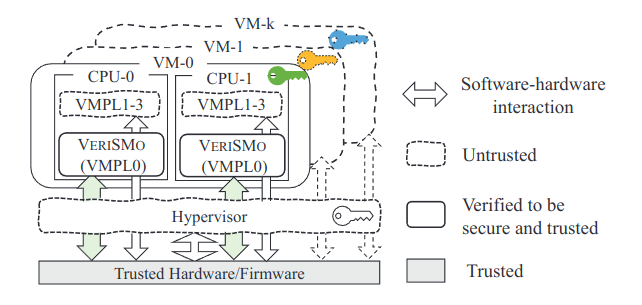

VeriSMo 在这样的模型下，要完成唤醒 CPU，管理 Guest 内存，确保 Guest OS 的完整性，运行时测量等功能。

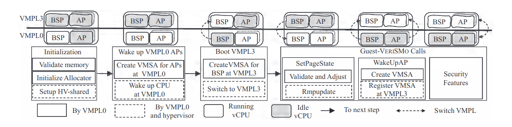

### 2.2 验证目标

我们希望用形式化验证的方式确定 3 个属性：

- 功能正确性：VeriSMo 可以无 bug 地满足安全服务所需要的功能。
- 信息流安全：程序在任何情况下都不应通过内存操作或低安全级别变量的值泄露与高安全级别变量相关的信息。
- VM 的机密性和可信性：Hypervisor 和 VMPL3 都不可以读取 VMPL0 的私有内存。Hypervisor 不可以读取 VM 的私有内存（应该是包括 VMPL0 和 VMPL3 的私有内存）。

总的来说有两个目标，一个是内存安全，一个是信息流安全。文章比较大的篇幅集中于内存安全，而信息流安全的验证则和其他部分比较孤立，最后单独形成一个章节介绍。

### 2.3 验证思路

Hypervisor 会打断 VM 对资源形成并发操作，然而因为不信任 Hypervisor 的原因，我们无法直接验证 Hypervisor ，所以我们将验证分成了两层。第一层是 Machine Model Layer，采用建立一个硬件抽象机的方式进行模型级的验证，确保在给定 Hypervisor 约束后，它不会影响 VM 的机密性和完整性。第二层是 VeriSMo 内部实现的验证。

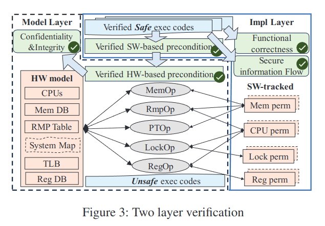

我个人感觉形式化验证是可以验证并发程序的，此项目分成两层进行验证，有可能不是因为 Hypervisor 的并发很难验证，而是因为 Hypervisor 不在信任基内，导致我们没法直接验证，所以我们才采用了建模的方式进行抽象验证。

我个人感觉其实是将验证分为了两步：

- Machine-Model Layer：验证 AMD SEV-SNP 这套硬件机制没有问题
- Implement Layer：验证 VeriSMo 对 AMD SEV-SNP 的使用没有问题

---


## 三、内存安全验证

### 3.1 Machine-Model 层

Machine Model 具有两个目标：

- Hypervisor 和 VMPL3 都不可以读取 VMPL0 的私有内存。
- Hypervisor 不可以读取 VM 的私有内存（应该是包括 VMPL0 和 VMPL3 的私有内存）。

更进一步地说，我们希望验证这个图片所展示的事实，即 HV 和 VM 具有一定的独立性：


VERISMO 并没有一个 guest OS 那么庞大，所以 VERISMO 只对关键的内存和 cache 操作进行建模。

其更加具体地说，它的主线逻辑是这样的，它定义了 4 个对象：

- 系统状态（Ψ）：整个系统
- 实体（e）：可能是 Hypervisor、VeriSMo，Guest OS 
- 操作（op）：关键的内存和 cache 操作，比如更新页表之类的。
- 攻击模型（attack model）：Ψ 按照一定顺序经过多个 e 的多个 op 的一个序列

如果 Ψ 初始化是正确的，所有的 op 都满足各自的前置条件和后置条件，验证 Ψ 经过 op 后依然安全（保证一定的不变式），那么按照类似数学归纳法的思想，经过多次 op 后 Ψ 依然安全。

那么检验的核心就在于 op 的约束条件（前置和后置）能否满足上述要求。这就需要结合硬件特性来推导出一些比较强的引理来。

关于 VM-Private 的内存，我们有：

- Ψ 下 CVM 私有内存 M 包含数据 D，经由 HV 操作后， Ψ' 下 CVM 读取 M 得到数据 D 或读取失败。

这是因为 RMP 规定如果该 M 不是 valid 的，那么 HV 是可以读取的，而如果是 valid 的，那么就不可以读取。

- Ψ 下 CVM 私有内存 M 包含机密 S，经由 HV 操作后， Ψ' 下 HV 读取 M 得到 S 的密文。

如果经过加密，那么读取到的一定是密文。

关于 VMPL0-Private 的内存，我们有：

- Ψ 下 VMPL0 私有内存 M 包含数据 D，经由 hypervisor 或 VMPL3 操作后， Ψ' 下 VMPL0 读取 M 得到数据 D 或读取失败，VMPL3 不能读取 M。

由引理 1，2 可以 HV 不可读取，又因为 RMP 中记录了每个 VMPL 的访问权限，VMPL3 没有访问权限。

关于地址翻译，我们有：

- Ψ 下 VMPL0 访问 gVA 翻译到 sPA，经由 HV 或 VMPL3 操作后，Ψ' 下 VMPL0 访问 gVA 翻译到 sPA 或翻译失败。

只有使用 VMPL0 的特殊指令才能更改页表，任何其他更改页表的行为都会导致报错。

- 任何 Ψ 下，CVM 的 gVA 到 sPA 的映射是双射。

因为 gPA 到 sPA 的映射是双射，只需要证明 gVA 到 gPA 是双射。具体的证明方法类似于“一开始是双射，而且每次操作都必须保证是双射的，所以最后是双射”的数学归纳法。

在有了这五条引理后，就可以交给形式化证明机来完成证明了。

### 3.2 Implement 层

在实现层，验证上主要采用如下技术来实现形式化验证：

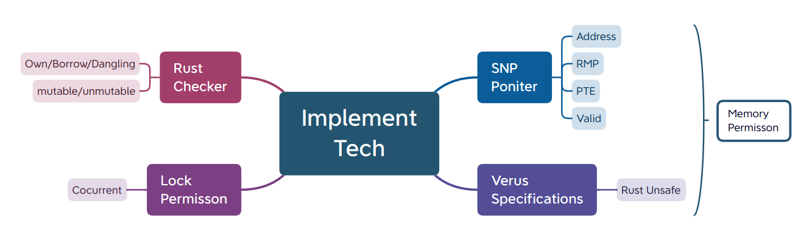

其中 Rust 负责基础的所有权和读写检查，SNP Pointer 是一个用于验证的胖指针，里面对 SEV-SNP 机制进行了建模，胖指针的样子是这样的

```Rust
pub ghost struct SnpMemAttr
{ rmp: RmpEntry, pte: PTAttr, is_pt: bool}

pub ghost struct SnpPointsToData<T> {
    addr: int, value: Option<T>,
    swattr: SnpMemAttr, hwattr: SnpMemAttr,
}

pub tracked struct SnpPointsTo<V>
{ _p: marker::PhantomData<V>, _ncopy: NoCopy }

impl<T> SnpPointsTo<T>
{ pub spec fn view(&self) -> SnpPointsToData<T>; }
```

检验者可以根据胖指针内 `RmpEntry, addr` 等元素进行验证。如下所示：

```Rust
fn access_private(Tracked(mperm): Tracked<&SnpPointsTo< u64>>)
    requires
      mperm@.wf_not_null_at(0x1000),
      mperm@.is_vmpl0_private()
{
    let val1 = *borrow(0x1000, Tracked(mperm));
    let val2 = *borrow(0x1000, Tracked(mperm));
    assert(val2 == val1);
    replace(0x1000, 0x1234, Tracked(mperm)); // Rust : change the unmutable val!
    let _val3 = *borrow(0x2000, Tracked(mperm)); // Verus: borrow wrong addr!
}
```

对于 unsafe rust 操作，我们用 verus 来限制并验证其使用，比如 `rmpadjust` 指令，就有复杂的前置和后置条件（见 [19.2. Memory safety is conditional on verification](https://verus-lang.github.io/verus/guide/memory-safety.html)）：

```Rust
pub fn rmpadjust(
    vaddr: u64,
    psize: u64,
    attr: RmpAttr,
    Tracked(mycore): Tracked<&SnpCore>,
    Tracked(newcore): Tracked<Option<CoreIdPerm>>,
    Tracked(perm): Tracked<&mut SnpPointsToRaw>,
) -> (ret: u64)
    requires
        old(perm)@.snp().requires_rmpadjust(vaddr as int, psize as int, attr@, newcore, old(perm)@),
        mycore.coreid@.vmpl == 0,
        attr.spec_vmpl() > mycore.coreid@.vmpl,
    ensures
        old(perm)@.snp.rmpadjust_ret(perm@.snp, ret, vaddr as int, psize as int, attr@),
        old(perm)@.range() === perm@.range(),
        old(perm)@.snp_bytes === perm@.snp_bytes,
{
    let ret: u64;
    unsafe {
        asm!(".byte 0xf3,0x0f,0x01,0xfe",
                in("rax") vaddr, in("rcx") psize, in("rdx") attr.value,
                lateout("rax") ret,
                options(nostack));
    }
    ret
}
```

> PS: `@` 是 `.view()` 的缩写，见 [4.1. Recursive spec functions, decreases, fuel](https://verus-lang.github.io/verus/guide/reference-at-sign.html)

其中 SNP Pointer 和与之配套的验证约束合称 Memory Permisson，因为这种 Permission 有时是需要共享的（因为内存需要共享），所以又引入了 Lock Permisson 来确保并发程序的正确性。

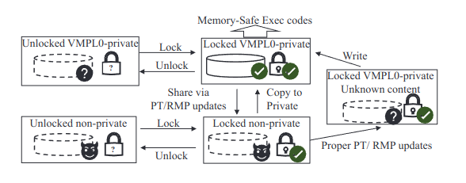

VeriSMo 内存并发安全模型为：

1. 上锁的 VMPL0 私有内存（可信内存）可以任意访问；
2. 如果其他实体（VMPL3 或者 HV）想共享给 VMPL0，要么上锁后拷贝给 VMPL0，要么修改映射关系后重新写入；
3. 如果 VMPL0 需要共享给其他实体，可以上锁后直接修改映射关系。

---


## 四、信息流安全验证

左图中，机密变量 high 被通过数据流泄露到公开变量 low。右图中，机密变量 high 通过控制流侧信道被泄露。

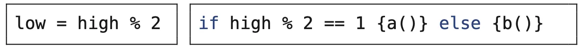

具体的，本工作记录 VeriSMo 中每个变量的猜测空间（guess space, valset），猜测空间为全集的变量为机密变量，猜测空间为单元素集合的变量为公开变量，猜测空间随着计算操作传播。

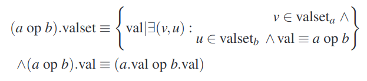

验证器确保：

1. 只有机密变量能用作密钥，
2. 机密变量保存在 VMPL0 私有内存中
3. 机密变量不能用于控制流判断、内存地址等可能导致侧信道泄露的用途。

---


## 五、实现与评估

从实现层面来说，似乎锁设计比较新颖，锁的数目比较少，验证难度也比较低。

从实现性能看，与 Hecate 这种提供安全服务的 HV 相比，性能提高了 40%，因为不需要频繁内陷到 HV 中，这应该是所有的 Secure Module 都具有的性能优势。

而与其他的 Secure Module 相比（用 C 实现的 SMo 或者修改后 Linux 作为一个 SMo），在性能开销方面差别不大（Index 越高性能越好）

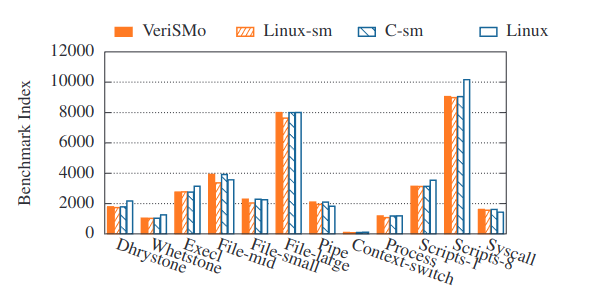

从验证层面看，验证速度很快，大约 6 分钟就可以验证完两层模型。
