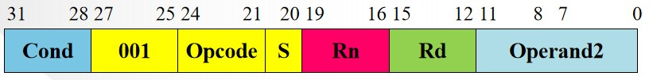

## 一、基础

在 Armv8 的 A32 架构或者 Armv7 及以前的指令集中，每条指令都可以“条件执行”，也就是根据 CPSR 的条件码来确定这条指令是否真的具有执行效果。

比如说如下指令，只有在 CPSR 中 `Z` 位为 1 的时候，`addz` 这条指令才有实际效果，这依赖于前一条指令 `cmp` 对 CPSR 的修改（ARM 同样可以指定是否修改 CPSR，这是通过在指令位中的 `S` 确定的）。

```asm
cmp r4, r5
addz r1, r2, r3
```

MIPS 或者 RISCV 都有条件指令，不过这些条件指令一般是条件指令，这样可以实现编程思想中的分支结构。Arm 的特殊之处在于每条 32 位指令的高 4 位都是条件码，这就会导致每条指令都是条件指令。



条件指令编码如下所示：

| 序号 | 条件码  Cond | 条件助记符 | CPSR 中条件标志位 cpsr_f 的值 | 含义                   |
| :--- | :----------- | :--------- | :---------------------------- | :--------------------- |
| 0    | 0000         | EQ         | Z=1                           | 相等                   |
| 1    | 0001         | NE         | Z=0                           | 不相等                 |
| 2    | 0010         | CS HS      | C=1                           | 无符号数大于或等于     |
| 3    | 0011         | CC LO      | C=0                           | 无符号数小于           |
| 4    | 0100         | MI         | N=1                           | 负数                   |
| 5    | 0101         | PL         | N=0                           | 正数或零               |
| 6    | 0110         | VS         | V=1                           | 溢出                   |
| 7    | 0111         | VC         | V=0                           | 未溢出                 |
| 8    | 1000         | HI         | C=1,Z=0                       | 无符号数大于           |
| 9    | 1001         | LS         | C=0,Z=1                       | 无符号数小于或等于     |
| 10   | 1010         | GE         | N=V                           | 带符号数大于或等于     |
| 11   | 1011         | LT         | N!=V                          | 带符号数小于           |
| 12   | 1100         | GT         | Z=0,N=V                       | 带符号数大于           |
| 13   | 1101         | LE         | Z=1,N!=V                      | 带符号数小于或等于     |
| 14   | 1110         | AL         | 任何                          | 忽略条件，即无条件执行 |
| 15   | 1111         |            | 任何                          | 系统保留               |

ARM 中这种独特的设计之前让我感觉非常奇怪，因为要消耗足足 4 位来进行条件编码，同时“指令有可能执行不成功”的概念非常困扰我，这让我觉得这是一种 CPU 资源的浪费，因为在运行无效指令的时候 CPU 在“空转”。

当所有的指令都是条件指令的时候，那么分支结构的汇编实现就多了一种方法，举个例子，我们常用的 C 语言分支结构为

```c
if (a == b)
{
	// if-statement
}
else
{
	// else-statement
}
```

如果是普通汇编翻译（伪汇编，表意），那么是下面的样子，先利用一个 `cmp` 指令比较 `a, b` ，然后利用 `bne` 这个条件跳转指令来决定分支流向，如果不发生跳转，那么就会执行 `if1, if2, ...` ，而如果发生跳转，则会执行 `else1, else2, ...` 。

```asm
cmp r, a, b
bne r, l1
if1
if2
...
b l2
l1:
else1
else2
...
l2:
```

ARM 可以有另一种翻译方法，如下所示，同样利用 `cmp` 指令完成比较，但是不再有 `bne, b` 这样的跳转指令来构成分支流了，而是 `if1z, if2z, ..., else1nz, else2nz, ...` 这些指令均会被送给 CPU，但是只有一些指令会发挥实际作用，这依赖于 `cmp` 的结果。

```asm
cmp a, b
if1z
if2z
...
else1nz
else2nz
...
```

arm 在提出这种翻译方式时，是希望编译器的开发者可以在一些部分采用第二种模式。

---


## 二、分析

### 2.1 指令条数

乍一看第二种模式并不好，这是因为如果 `if-statement` 和 `else-statement` 都各翻译出 5 条汇编，那么第一种模式总共执行的指令数是 7 或者 8 条，而第二种模式则会翻译出 11 条指令，代价要远远高于第一种。

不过如果 `if-statement` 和 `else-statement` 各翻译出 2 条汇编，那么第一种模式是 4 或 5 条，而第二种是 5 条，差距并没有这么大。也就是说，第二种模式更适用于 C 语言中的 `?` 三目运算符这种类似的**短小的分支结构**。

### 2.2 流水线层数

指令条数的优势并不明显，但是对于流水线来说非常有用，这是因为按照第一种模式，要等到 `r` 被计算出来才可以确定分支的流向，同时 `bne` 指令拿到 `r` 的时间也会后延，跳转指令后的指令如果不采用延迟槽技术，那么许多已经进入流水线的指令都会被注销，也就是说，虽然在简单的顺序模型下，第一种模式下的 CPU 不会执行“冗余”的指令，但是在流水线 CPU 中，依然是有可能执行

而第二种模式，CPSR 的值可以比通用寄存器 `r` 更容易拿到，因为 CPSR 的约束更多，所以转发处理要更加简洁，CPU 可以更早知道比较的结果，那么就不会造成过多指令的浪费。而且减少分支更加方便 CPU 进行调度。

换句话说，深流水水级的设计对于分支指令天然不友好，流线线长度越长，获得分支结果的时间就越长，而在分支结果出来之前，CPU 只能等待。解决这个问题有两种方式，一种是采用更加强大的分支预测单元，这样在 CPU 等待结果的时候先处理猜测的分支上的指令。另一种就是 arm 条件码的设计，将分支结果在靠前的流水线就计算出来，这样避免了过多的等待，而且在形式上消除了分支结构，降低了处理器的设计难度。

### 2.3 发射宽度

不过第二种模式并非非常适合流水线，比如说当 CPU 发射较为宽的时候（多发射乱序），条件码相当于指令会读写 CPSR 这个特殊的寄存器，那么就会导致指令间的依赖关系增加，进而增加串行化程度，也就是会导致第一种模式比第二种要更加占优势。

### 2.4 总结

ARM 的条件码设计更加类似于 CISC 的设计思想，相比于 RISC 要更为复杂，复杂的指令不利于提高并行性，但是复杂的指令可以减少指令数，分支数。虽然这些优点对于多发射 CPU 并没有那么显著的改观，甚至是负优化。但是应当意识到，并不是所有的 CPU 的目的都是为了运算的极致高效，分支预测和多发射都是十分消耗硬件资源和能耗的设计，在 ARM 大展身手的嵌入式领域，条件码可以显著提高效率，并不是没有荒诞的设计。

不过随着硬件水平的提高，条件码似乎也在退出历史舞台，比如说 ARM 自家的 A64 指令集或者 RISCV 这种年轻的指令集都没有采用条件码设计。
