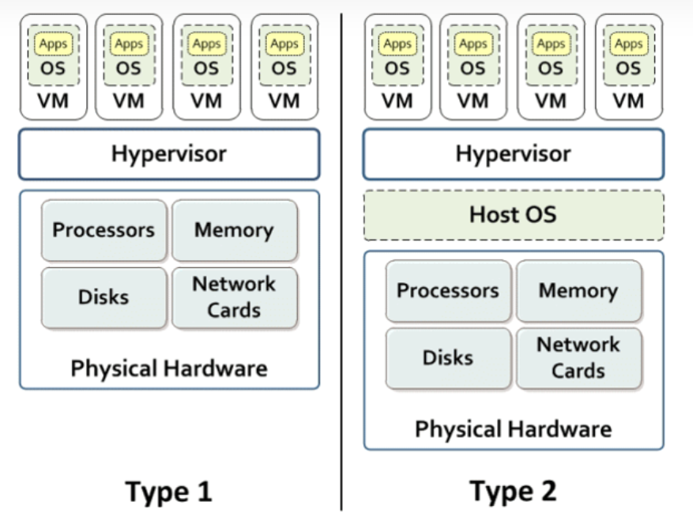
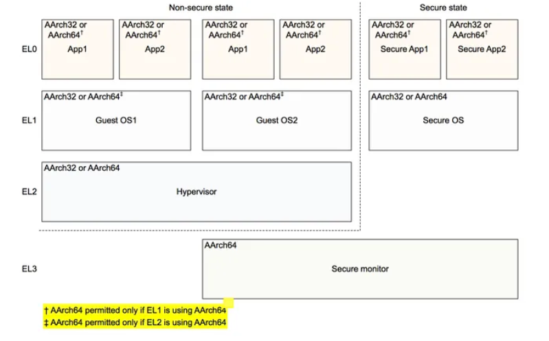
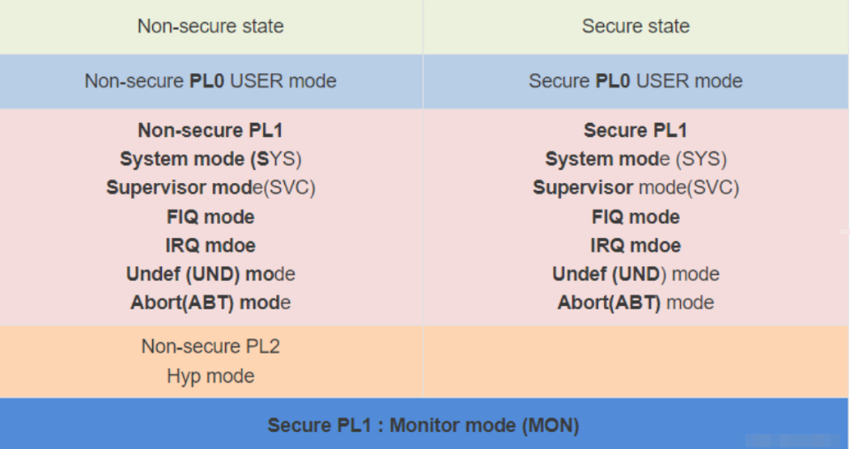
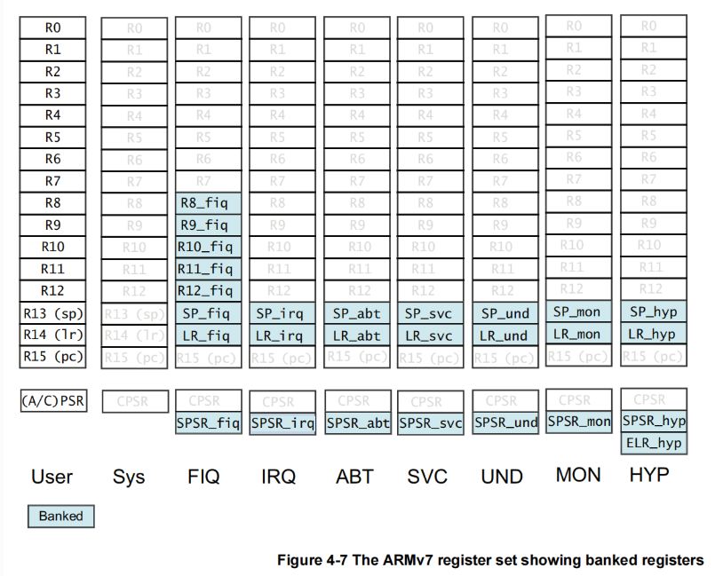

## 一、抽象层次

### 1.1 User Program 与 Operating System

一开始的用户程序 User Program 都是裸机程序，他们直接运行在硬件上。这种方式的缺点在于，任何程序都需要思考与其他程序的“共存方式”，内存空间的是具象的，所以就要思考自己要利用多少的内存，利用哪个部分的内存；CPU 是具象的，所以就要思考自己何时会被调度，以怎样的形式被调度；所有的硬件资源都是具象的，所以要思考的事情数不胜数。

正因如此，操作系统 Operating System 提供了一层抽象，OS 将原本的硬件资源全部进行了抽象表达，具象的硬件资源被操作系统接管，不再提供给用户程序具象的硬件资源，而是提供给用户抽象的“系统调用”，系统调用是操作系统提供的一种硬件资源的封装形式，用户程序使用系统调用来完成使用硬件资源的功能。

抽象的硬件资源相比于具象的硬件资源，其好处在于抽象资源要更加简单，内存空间变成了虚拟内存空间，不再有“有限”或者“非独占”的困扰；外存变成了文件，不再有复杂的驱动或者定位问题；CPU 的调度被简化成了线程的调度，由 OS 进行统一管理，再也不用思考与其他进程共享 CPU 的问题，所有的硬件资源都被抽象的十分简单，使得开发者不再需要考虑与设计本身无关的问题。

上面描述的内容基本上都是在操作系统课程中学到的知识，不过抽象并非只进行了这里的一层，后面还会有更多的抽象。

> 需要强调，这里的操作系统的概念相比严谨的定义要更加宽泛一些，还包括函数库和根文件系统等事项，更加类似于某个操作系统的发行版。

### 1.2 Operating System 与 Hypervisor

OS 其实为 User Program 干了两件事：

- 管理硬件资源
- 将硬件资源封装成更为简单的抽象

所有的 OS 在第二点上会存在比较大的差异，比如说宏内核和微内核的差异，或者相同 Linux 内核不同发行版之间的差异。不同 OS 的区别，如果站在 User Program 的角度去看，就是提供的抽象存在差异（倒并不是说有好坏之分）。正因如此，有些游戏程序只能在 Windows 上运行，却无法在 macOS 上运行，有些软件甚至只能在 ubuntu 特定版本上跑，换一个发行版都不行。

所以用户并不只能感知用户程序的差异，他们同样可以感知操作系统的差异性（突然想到，他们也可以感知硬件的差异）。这就导致他们会选择不同的 OS，OS 并不是一个“上帝”，是世间唯一的存在，让每个人都爱它。人们可能会同时使用两个甚至多个 OS 去全面满足自己的需求。

OS 和硬件的对应关系其实有两种，一个是一种 OS 在多套硬件资源上运行，另一个是一套硬件资源上运行多种 OS。这两种关系其实是取决于到底是硬件资源便宜，还是 OS 的适配代价偏移。而最近这些年，都是硬件资源便宜，各种大型服务器集群屡见不鲜。

在一套硬件资源上运行多个 OS 的想法是行不通的，因为 OS 是裸机程序，如果要运行多个 OS，就会导致 OS 产生了和没有 OS 的 User Program 类似的问题，要考虑共享的问题。为了解决这个问题，我们提出了 Hypervisor 来为 OS 提供新的抽象。Hypervisor 可以以单套物理硬件资源为基础创建多套虚拟物理资源。每套虚拟物理资源上面运行一个 OS。

这样看 Hypervisor 分走了部分 OS 的两项功能的第一项功能，OS 不再管理具象化的硬件资源，而是接受 Hypervisor 提供的抽象硬件资源。不过与 User Program 的抽象硬件资源不同，OS 接触到的抽象硬件资源并不简单，而是跟实际的硬件资源完全一致或者近似一致（也就是完全虚拟化和半虚拟化的区别）。当出现 Hypervisor 后，OS 更像是一种硬件资源的封装服务了。

当出现 Hypervisor 后，看似 OS 并没有做出过多的更改，因为 Hypervisor 是一种非侵入式的或者半侵入式的存在，不过也可以被理解为当硬件资源过剩的时候，原本 OS 并没有办法在很好的管理硬件的同时为 User Program 提供服务了。也就是说，Hypervisor 承担了部分本应由 OS 承担的硬件管理任务。

那么这部分硬件资源管理任务到底是什么？我觉得是“资源最小单位化”，也就是**池化**。当单位资源越小的时候，上层才能越按需使用资源，充分利用资源，提高资源的利用率。这个功能是原本的操作系统涉及不多的。

### 1.3 总结

回顾上面的 OS 和 Hypervisor，可以看到抽象层次是这样的东西：

- 他可以接触到更加具象化的资源
- 他会管理这些资源
- 他会提供更加抽象的资源

抽象资源就是封装，它会屏蔽具体的实现，在某种意义上，可以创造奇迹。我突然想到一个很好玩的类比，如果我们将金子视为一种具象的资源，那么我们有没有办法在不开采更多的金矿的前提下将这个资源变多呢？其实是有的，那就是发行某种货币，并将这种货币与金子挂钩，比如一块钱等于一千克金子，我们只需要多印一些货币，这个世界看起来就多了一些金子。货币就是一种抽象资源。

那么如果有人印无懈可击的假钞呢？那么就会极大的破坏货币使用者的危害，这种危害要远比一个黑心财主（同样也是使用者）造成的破坏要大。换句话说，提供抽象资源的实体的危险性要比使用抽象资源的实体的危险性更大。黑客攻击一个 User Program，并不会造成过多的破坏，因为 OS 限制了它的资源使用，而黑客如果攻击了一个 OS，那么大量的资源都会被黑客接触到，最悲惨的是攻击一个 Hypervisor，所有的 OS 都将受到黑客控制。

之前我们一直在讨论引入 OS 或者 Hypervisor 这样的抽象层在功能性上发挥的作用，没有 OS 硬件资源太难处理了，没有 Hypervisor 硬件资源太难管理了。如果从另一个角度说呢？抽象层在安全性上同样发挥了作用，如果是 User Program 的裸机时代，黑掉一个用户程序，那么整个硬件就会被掌控；而在有了 OS 而没有 Hypervisor 的时代，黑掉 OS 并不意味着胜利，攻击者依然无法解除硬件资源。

不过正如上面的例子举例，如果 Hypervisor 或者 OS 被黑掉，那么对其上层的实体的破坏是极大的。也就是说，最好是 Hypervisor 最难黑，OS 其次。为了达到这个目标，OS 或者 Hypervisor 都不能过分庞大，因为庞大就意味着攻击点多，同时庞大意味着一旦攻击成功，损失就会极大。

这点同样是 Hypervisor 或者 OS 不宜扩张以取代目前二者功能之和的原因，一个可以完全控制服务器集群，同时为所有 User Program 提供各式各样资源封装服务的实体一旦沦陷，后果将十分恶劣。

### 1.4 其他与 Secure Moniter

有 Hypervisor 的情况下，只有最底层的抽象层可以接触到所有的具象化的硬件资源。正如上面所言，如果它被黑掉了，那就再无秘密可言了。

不过这个结论建立最底层抽象层拥有完整的硬件资源，不同抽象层的权限核能力不同可以看做是因为指令集的完整程度差异造成，比如用户程序就没办法设置页表，OS 就没办法虚拟设备。我们默认最底层的抽象层拿到了完整的硬件资源，可以指示硬件执行一切硬件可以完成的任务。

那么就有一种解决办法了，就是隐藏一部分的硬件资源，这部分硬件资源被用于作为独立于 Hypervisor 及其上构建的一切实体的另一个执行环境。因为 Hypervisor 与之并列，那么攻陷 Hypervisor 就不会导致所有资源的暴露。

Hypervisor 所在的环境被称为 **REE**（Rich Execution Environment），其上的系统被称为 Rich OS，其上的应用被称为 CA（Client APP）。而与之对立的是 **TEE**(Trusted Execution Environment)，即可信执行环境，运行其上的的系统和应用分别叫做 **Trusted OS** 和 **TA**（Trusted APP）。

那么就又需要一个抽象层了在 Hypervisor 之下，那就是 Secure Moniter，这层抽象层将“普通资源”提供给 Hypervisor，并提供“安全资源服务”给 Hypervisor 使得安全性得到了进一步保证。

至于为什么 Secure Moniter 不会被攻击，这是因为 Secure Moniter 更小，而且似乎是固件，攻击难度要远高于软件。

---

## 二、虚拟

### 2.1 分类

计算资源的虚拟化分为 3 种：

- 全虚拟化：OS 并不需要做出修改
  - 机器码解释执行：将敏感指令解释执行
  - 硬件辅助：敏感指令会导致硬件 Trap
- 半虚拟化：OS 需要做出对应修改

虚拟化的问题在于，原本的 OS 是会操作具象硬件资源的，那么这些操作（具体表现为一些特权敏感指令）在虚拟化时，应当被特殊处理。

最开始人们的思路很简单，就是用软件模拟硬件，然后在这个模拟硬件上运行 OS。这种思路的本质是将 Hypervisor 视为一个汇编（二进制机器码）的解释器，可以想见，这种方式注定会导致性能过于低下。所以改进版本是并不完全解释执行所有指令，而是被动捕获拦截那些敏感指令，并只解释这些敏感指令，其他指令直接执行。不过无论怎样，这种思路的性能都比较低。

而半虚拟化的解决思路很简单，就是对 OS 进行相应的修改，将敏感指令替换成 Hypervisor Call 来调用 Hypervisor 服务，这样就可以避免直接操作硬件资源。这种方式的优点在于 Hypervisor 的工作量相比于全虚拟化要少（因为部分适配工作交给了 OS 负责），同时性能会比较高。

硬件辅助指的是在“解释执行方案”中的“捕获”交给了硬件来完成，也就是 OS 正常运行在硬件上，只是敏感指令会导致硬件 Trap 进而将控制权交给 Hypervisor，这种方式综合了前两种思路的优点。

总结如下：

| 种类      | 机器码解释执行全虚拟化                         | 半虚拟化       | 硬件辅助全虚拟化                                     |
| --------- | ---------------------------------------------- | -------------- | ---------------------------------------------------- |
| 机制      | **二进制翻译**（BT）和**直接执行**（DE）相结合 | Hyper Call     | 硬件捕获敏感指令                                     |
| OS 兼容性 | 无需修改 OS                                    | 需要修改 OS    | 无需修改 OS                                          |
| 性能      | 差                                             | 好，接近物理机 | 似乎性能不如半虚拟化，因为 trap 会导致上下文切换问题 |
| 代表      | VMare WorkStation，QEMU，Virtual PC            | Xen            | VMare ESXi，Hyper-V，KVM，Xen3.0                     |

从软件框架的角度上，根据虚拟化层是直接位于硬件之上还是在一个宿主操作系统之上，将虚拟化划分为 Typel 和 Type2。

Type1（类型1）Hypervisor 也叫 native 或 bare-metal Hypervisor。这类虚拟化层直接运行在硬件之上，没有所谓的宿主机操作系统。它们直接控制硬件资源以及客户机。典型地如 Xen 和 VMware ESX。

Type2（类型2）Hypervisor 运行在一个宿主机操作系统之上，也就是一个应用程序，如 VMware Workstation；或宿主操作系统里，也就是内核的一部分，如 KVM。

## 三、安全

### 3.1 异常等级

Exception Level 异常等级是 Armv8 新引进的术语，不同 EL 有着不同的硬件资源访问权限，总体概览如下：

可以看到 4 种异常等级刚好对应第一章提出的 3 个抽象层，是非常自然的事情。

此外需要强调，在早期的 Armv8 中安全世界是不支持 EL2 下的 Hypervisor 的，这也是图中没有画出来的原因。不过晚期的 Armv8 或者 Armv9 是有这个功能的。

### 3.2 特权等级

Privilege Level 特权等级是 Armv7 的概念，我查了一些资料，给我感觉看上去和 Armv8 的 EL 是对应的，区分这些等级的目的同样是为了区分不同的权限，如下所示：

这和上一张图是非常类似的，唯一不同的在 PL1 多了很多种模式 mode。这之前非常困扰我，因为似乎一个 PL 只有一个模式就够发挥功能了（毕竟 Armv8 就是这么设计的），而且一个 PL 对应一组特殊的寄存器，那么同一个 PL 下的多个 mode 意味着什么？他们到底靠什么区分？

首先要补充 Banked 的概念，"Banked" 这个术语在计算机体系结构中是一个常见的概念，用来描述一种资源（如寄存器）按组进行切换的机制。在这个机制中，每个组被称为一个 "bank"（分组），bank 之间都是相近或者相同的。

不同 mode 之间其实就是具有独有的 Banked Register，如下所示：

也就是说，在 armv7 架构中有多个 SP 寄存器（基本上每个模式都有一个），多个 LR 寄存器。这种 banked register 的好处在于模式切换的成本开销小，这是因为不同原因造成的模式切换会有不同的 banked register 来处理，如果只有 mode，那么嵌套异常发生时，就会导致之前的异常处理上下文需要保存后再进行新的异常处理，处理结束后还需要恢复，这样开销会增大。可以看做是一种用空间换时间的策略。

此外注意到 FIQ 的 banked register 更多，这也是它被称为 Fast 的原因。
