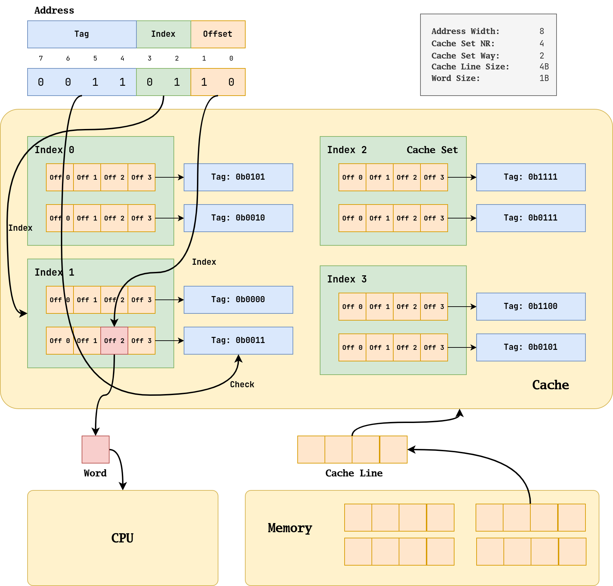
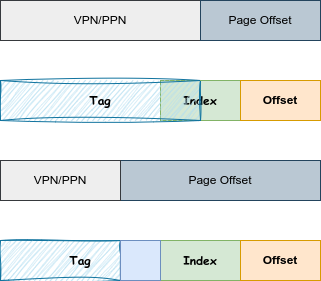

## 一、结构

因为一直分不清 Cache 的结构名字，所以特地画了一个比较满意的图来标注各种结构。



这个示意图的参数在右上角。Cache 中的基本单位是 Cache Line，它又被叫作 Block，它是由多个 Word 组成的。多个 Cache Line 会组成一个 Cache Set，一个 Cache Set 内包含的 Cache Line 数量被成为 Way。比如图中就是 2-Way 的 Cache，那么每个 Cache Set 就有 2 个 Cache Line。相同 Cache Set 中的 Cache Line 的关系被称为 associative（相联），它们不能依靠 set index 进行区分，只能通过 tag 区分。 

根据 Set 个数和 Way 的不同（其本质是 Cache Line 的位置确定），可以对 Cache 进行分类：

- 直接映射（direct-map）：即 Way = 1 的情况
- 组相连（set-associative）：即普通情况
- 全相连（fully-associative）：即只有一个 Set，所有的 Cache Line 都是 associative 的。

他们的功能上的区别在 Cache 的检索和分配上均有体现。会在下面章节进行介绍。

---


## 二、查找

### 2.1 过程

首先补充 Cache 和 CPU 还有内存沟通的数据大小：CPU 每次从 Cache 中取出一个 Word，而 Cache 每次从 Memory 中取出一个 Cache Line。

CPU 会给 Cache 发送一个地址，这个地址有可能是虚拟地址，也可能是物理地址，这取决于具体的架构实现方式。这个地址还有一个特点是**按照 Word 对齐的**。虽然这个示意图中 Word 只有一个字节，没有对齐的必要，但是在常见的 Word 为 4 个字节的 32 位架构中，这个地址的 `[1:0]` 一定是 `0` 。

交给 Cache 的地址会被分成 3 个部分，即上图的 Tag（蓝色），Index（绿色） 和 Offset（橙色）。检索 Word 的过程是一个“Index-Check-Index”的过程。

首先我们根据**绿色部分 index** 找到对应的 Cache Set（这是一个像随机地址访问的过程，称之为 Index），因为 Index 是 1，所以我们找到左下角的 Cache Set 1。然后就会发现里面有一堆的 Cache Line，对于这些 Cache Line，我们没有办法直接确定哪一个是我们要找到的 Cache Line，我们需要用地址上的**蓝色部分 Tag** 和 Cache 中的 Tag 进行比对，只有完全相同才是我们要找的 Cache Line，所以我们在此图中选择了第二个 Cache Line（这个过程需要比对所有的 Tag 的所有位，称之为 Check）。在选定 Cache Line 后，我们需要根据**橙色部分 Offset **选择 Cache Line 中具体的 Word，图中 Offset 是 2，所以我们选择第 2 个 Word 交给 CPU（这个过程和绿色部分一样，也是 Index）。

如果用伪代码描述，是如下过程：

```cpp
using Word = char;
using CacheLine = Word[4];
using CacheSet = std::set<Tag, CacheLine>;
using Cache = CacheSet[4];

Word find(Tag tag, Index index, Offset offset)
{
	CacheSet set = Cache[index];
	for (auto &entry : set)
	{
		CacheLine line = entry.second;
		if (entry.first == tag)
		{
			return line[offset];
		}
	}
	return nullptr;
}
```

上述过程基本上描述了“一个 Word 是怎样从 Cache 中根据地址被检索出来”的过程，省略的部分主要是对于 Cache Line valid 和 dirty 等属性的检验。

对于检索成功的情况，我们称之为 hit（命中），而对于检索失败的情况，我们称之为 miss（缺失）。

### 2.2 矛盾

在上述过程中，Index 具有随机访问的特征，所以会比较快，而 Check 需要对 Set 内的每个 Line 的 Tag 进行比对，所以比较慢。Check 和 Way 直接相关，因为 Way 就是 Set 里 Line 的数量，所以 Way 越大，Check 对硬件性能的要求越高（因为比较电路非常耗片上资源，而且存储 Tag 也需要额外的空间）。但是换一个角度思考，当 Way 变大时，我们命中 Cache 的可能性也会变大，因为此时会存在更多候选的 Line 。所以选择多少 Way 其实是需要权衡的。

当 Cache 的总容量一定（这个比较实际，因为 Cache 总容量跟 Cache 需要消耗的片上资源直接相关）的时候，Way 和 Set 数量是反比关系，所以我们应当考虑好这个矛盾，也就是高命中率（Way 多）和低硬件成本和复杂度（Set 多）。

### 2.3 地址翻译

#### 2.3.1 地址策略

在上面的介绍中，我们并没有强调我们查找 Cache 的时候的地址是物理地址还是虚拟地址，这是因为这是受到具体的硬件架构设计。具体的策略有 3 种：VIVT、PIPT、VIPT，这里的英文是都是缩写，分别对应 Virtual，Physical，Index，Tag 英文。

#### 2.3.2 VIVT

VIVT 指的是完全使用 VA 进行 Cache 查找，这种方式的优势是，在查找前不需要经过 MMU 将 VA 翻译成 PA，命中只需要花费查找的时间，而缺失的时候再经过 MMU 翻译成 PA 进行访存，是非常高效的（因为 MMU 翻译也是很消耗时间的），

但是缺点有两个：歧义 (ambiguity) 和别名 (alias) 。这其实都是虚拟地址空间本身特性导致的问题。

歧义指的是**相同的 VA 对应不同的 PA**，这是由于相同的 VA 来自不同的进程地址空间，这就要求 OS 在进程切换的时候需要刷新 Cache，这就导致了切换后会有一个冷启动过程。

而别名指的是**不同的 VA 对应了相同的 PA**，这是由于虚拟地址可以让不同 VA 映射到相同的 PA 上，别名问题会导致一个 Cache 中可能存在多个物理内存的副本，而当我们更新这些副本的时候，有可能没有更新全部副本，导致操作。解决这个问题的方式就是将这种**共享的 PA** 设置成 nocache 的，即禁止他们使用 Cache。除此之外，似乎还可能用硬件措施解决多副本问题。

#### 2.3.3 PIPT

PIPT 指的是完全使用 PA 进行 Cache 查找。因为物理地址具有唯一性，所以就不会存在 VIVT 所面临的歧义和别名问题，OS 的维护难度会直线下降，这部分的维护开销也会被取消。

但是其缺点就是每次 Cache 查找都需要经过 MMU 翻译，需要承担翻译的开销。但是因为现代的 MMU 有 TLB 加速，所以开销是可以接受的。现代的 Cache 往往采用 PIPT 的形式。

#### 2.3.4 VIPT

当我们讨论使用 VA 的缺点时，本质其实在说用于查找的 Tag 和 Index 到底是 Virtual 的还是 Physical 的，如果是 Virtual 的，那么就会有歧义和别名问题，如果是 Physical 的，那么就不会有。

VIPT 指的是使用 Physical 的 Tag 和 Virtual 的 Index 。这样的好处在于，地址翻译过程和 Cache 查找过程可以并行，在地址翻译还没有结果的时候，我们就可以用 VI 来进行 Cache Set 的确定了。而且这种方式不再有歧义问题了，但是可能有别名问题。

对于歧义问题，此时的 PT 不再是 PA 的 Tag 部分，而变成了 PPN，PPN 具有唯一性，所以不再有歧义问题。

而对于别名问题，则要分类讨论，因为 Index 依然是虚拟的，那么使用 PPN 作为 Tag 能否矫正 VI 的影响呢？这要看 PPN 的宽度（反过来也可以说看 Index 的宽度），如下所示：



如果是第一种情况，VI 和 PI 存在差异，所以就会有别名现象，而第二种情况，VI 和 PI 不存在差异，就不会有别名现象。

总结就是 PPN 和 Index 不能有交集，就不会有问题。

---


## 三、分配与更新

### 3.1 分配的情形

当我们考虑将一个 CacheLine 从 Memory 中填充到 Cache 中时，这个 CacheLine 一定会被确定地放到某个 CacheSet 中，但是具体是哪个 CacheLine Slot，那就不一定了，我们有 Way 种选择。

其实原本的 CacheSet 中的 CacheLine Slot 也有 3 种情况，第一种是这个 slot 是空的，那么 CacheLine 放到这里就好了。第二种是这个 slot 本来就放着 这个待插入的 CacheLine，那么什么都不用干就好了。最后一种是这个 Slot 本来就放着一个不同的 CacheLine，那么就需要把原本的 CacheLine 逐出（evictation）。至于选择 set 中的哪个 line 逐出，基本上我们采用 LRU 策略来决定。

从逐出角度考虑，当 Way 增大的时候，CacheLine 的选择会更加灵活，逐出会更少。

从宏观角度看，逐出的存在是因为 Cache 比 Memory 小。如果 Index 的宽度是地址宽度减去 Offset 宽度，那么就不存在逐出了，很可惜事实并不是这样。相同 Index 的 CacheLine 会被分配到同一个 set 中，而 Way 只是提供了一种逐出的“缓冲”。

### 3.2 Index Position 分析

在示意图上展示的 Index 在低位，而 Tag 在高位。这样做的效果就是，一些地址相近的数据（也就是高位地址相同），会被分散到各个 Set 中，这无疑是好的。因为程序具有局部性，地址相近的数据大概率会被反复用到，如果将它们分配到同一个 Set 中，那么就会导致它们互相挤占（Evictation），导致命中率降低。

### 3.3 分配策略

cache 的分配策略（allocation policy）是指我们什么情况下应该为数据分配 cache line，也就是合适从内存中将数据取出来放到 cache 中。分为**读分配策略和写分配策略**。

读分配策略指的是当 CPU 读数据时，发生 cache 缺失，这种情况下都会分配一个 cache line 缓存从主存读取的数据。默认情况下，cache 都支持读分配。

当 CPU **写数据**发生 cache 缺失时，才会考虑写分配策略。当我们不支持写分配的情况下，写指令只会更新 Memory 数据，然后就结束了。当支持写分配的时候，我们首先从 Memory 中加载数据到 cache line 中（相当于先做个读分配动作），然后会更新 cache line 中的数据。

Cache 对读写的加速副作用是不一样的，Cache 加速写操作，如果采用写分配策略，那么就会有可能导致 Cache 和 Memory 中的数据存在差异（具体取决于更新策略）。

### 3.4 更新策略

更新策略（update policy）指的是，当**写操作（Store）**命中 Cache 时，Cache 应当如何更新其中的数据。有写直通（write through）和写回（write back）两种策略。

写直通指的是当 CPU 执行 store 指令并在 cache 命中时，我们更新 cache 中的数据并且更新 Memory 中的数据。**cache和 Memory 的数据始终保持一致**。

当 CPU 执行 store 指令并在 cache 命中时，我们只更新 cache 中的数据。并且每个 cache line 中会有一个 bit 位记录数据是否被修改过，称之为dirty bit。Memory 中的数据只会在 cache line 被逐出或者显式的 clean 操作时更新。因此，**cache 和 Memory 的数据可能不一致**。

----
