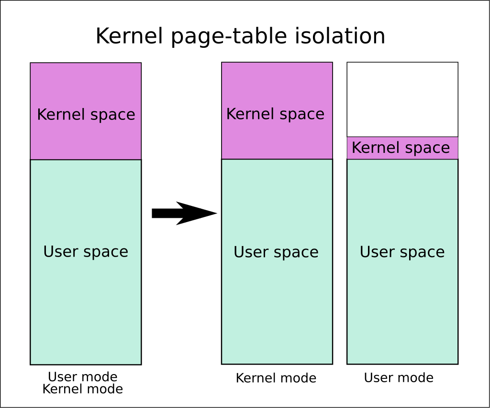

## 一、比喻

Trampoline 指的是“蹦床”，也就是底下这个东西：

他是一种很有趣的比喻，人们不能直接跳到高空中，而是需要先往下跳，然后借助蹦床的弹力跳到高空中。

这个比喻出现在用户态和内核态的相互转变中，转变不能直接发生，而是必须要借助一个“蹦床”机制。

---

## 二、RISCV 蹦床

RISCV 在虚拟地址翻译方面，描述页表基地址只有 `satp` 没有 `uatp` 基地址，也就是说，内核和用户程序都只使用 `satp` 一个寄存器。这点不同于 Armv8 ，所有的用户程序使用 `ttbr0` ，而内核程序使用 `ttbr1` 。

RISCV 的这种节省就导致了一个在内核态转变为的问题：内核态向用户态转变时，需要用软件切换页表，但是“切换页表”这个动作也是由一句代码实现的，这个代码被放在哪里呢？如果只能在用户页表下可以访问，那么从用户页表切换到内核页表之后，这句“切换页表”的代码之后的代码就无法访问了，所以我们必须保证在用户页表和内核页表中都能访问到这句“切换页表”及其前后的代码，并且他们映射到同一个虚拟地址。 `trampoline` 就是上述放置“切换页表”代码的地方。

不过在 Armv8 中就没有这个问题，是因为即使在内核态向用户态转变，使用一条指令切换了页表基地址，这只不过是修改了 `ttbr0` 的内容，内核虚拟地址翻译所依赖的 `ttbr1` 并没有受到影响。

---

## 三、KPTI 蹦床

Kernel Page-Table Isolation 是一项 Linux 内核功能，可缓解 Meltdown 安全漏洞（主要影响 Intel 的x86 CPU），并改进了针对绕过内核地址空间布局随机化 (KASLR) 尝试的内核强化。

具体来说，就是用户态向内核态切换时（比如发生异常），地址空间并不会立刻切换成完全的内核空间，而是先切换到一个只包含最基本 EL0 到 EL1入口和出口代码的向量表等信息映射的地址空间，然后再切换到一个包含全部内核的地址空间。

之所以这种方法可以防止 meltdown，是因为 meltdown 那条“窃取指令”紧紧贴着引发内核态转换的指令，所以那个时候窃取指令实际发挥作用的地址空间就会变成 trampoline 地址空间。
