## 一、主板

虽然在《计算机组成》这么课上，我大部分时间都在和 CPU 搏斗，但是并不是说 CPU 就是硬件世界的唯一或者说 Boss，主板上的其他元器件并不是 nobody。非常遗憾我最近才意识到这点。

一块结构较为完整的主板长成这个样子，可以看到处理 CPU 外，其实上面会有很多个其他的元器件

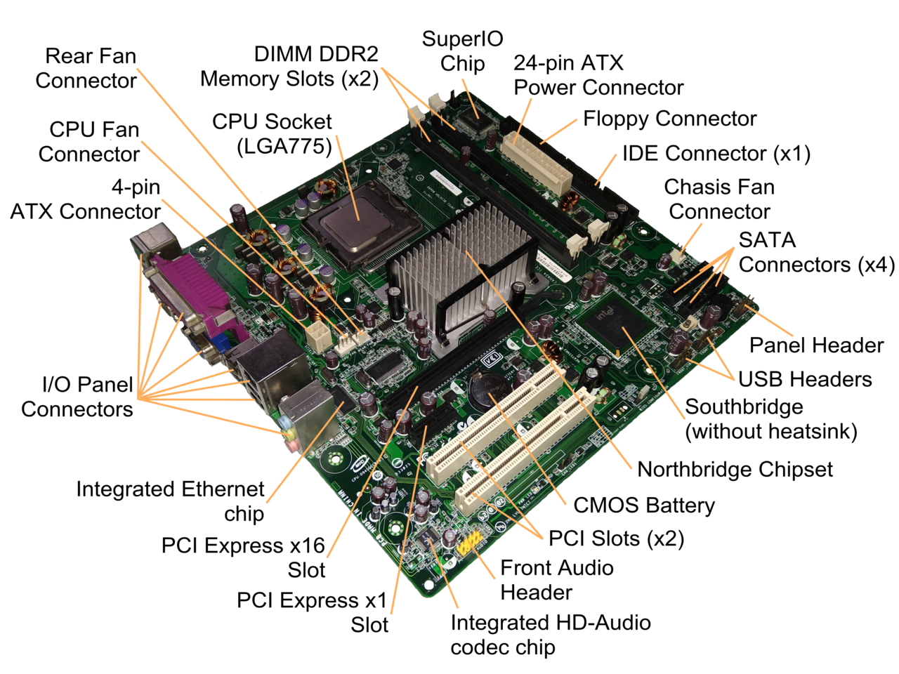

导致结构不完整的一个原因是在 Soc 技术在手机主板上的应用，具有多种功能的元器件，比如说 CPU，内存，各种控制器都会被放到一个芯片里，这样信号不再需要像以前那样通过很多外部的金属线，而是都在芯片里传输，让传输的距离变短。如图所示：

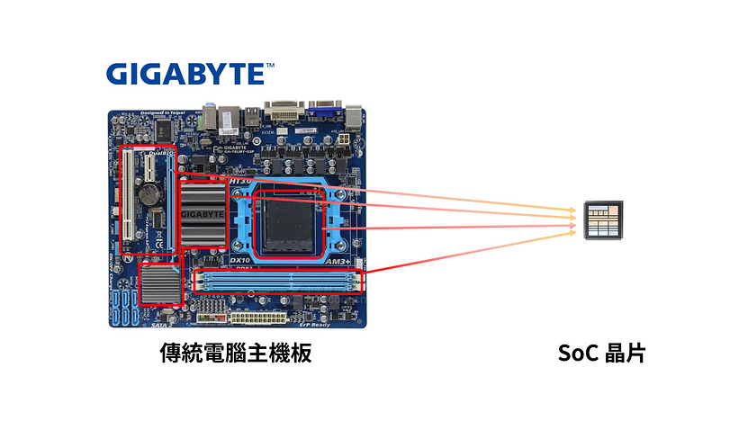

此外因为硬件的发展，许多落后的总线和设备会被淘汰，更加高速的总线和设备会被提出，不过无论如何在主板上的组成成分不会发生变化：

- CPU：计算核心，它是软件开发人员唯一可以控制的东西（但并不意味着它可以控制所有的东西）。
- 内存（memory）：暂时存放 CPU 中的运算数据的元件。
- 外设（device，I/O，peripheral）：发挥特定作用的设备。
- 控制器（controller，adapter）：外设过于复杂，CPU 并不直接控制它们，而是通过控制器间接控制外设
- 总线（bus）：连接各个元件的通路，同时也可以看做一个协议，只有遵守协议的双方才可以被连接（车同轨）。
- 桥（bridge）：将多个总线连在一起的结构，可能有分发或者汇聚的作用。比起“桥”，它更像是一个“十字路口”。

这些组成成分里，只有 CPU，内存，外设在软件开发人员眼中不是透明的，而控制器，总线，桥之类的元件是透明的，有失偏颇的说，软件开发者是不会意识到这些东西的存在的。

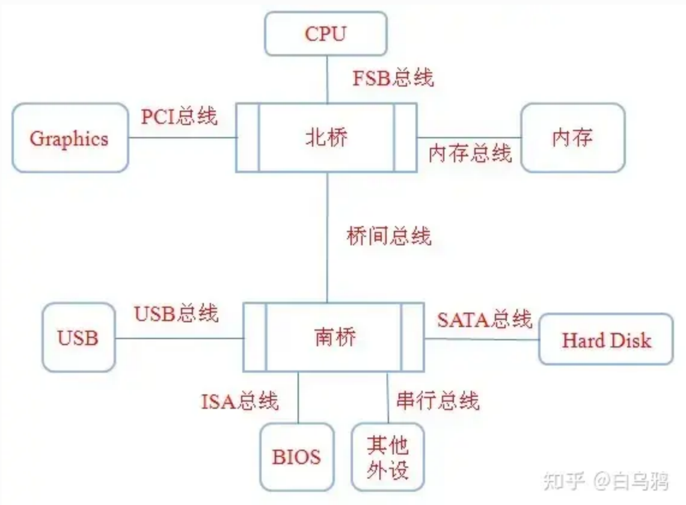

---


## 二、通信抽象

既然主板上有如此多的设备，那么 CPU 是怎么和它们通信的？

对于内存来说，软件开发者有内存空间这个抽象，软件开发者只需要指定要写入或者读出的地址和读取的大小，就可以读写内存了，涉及的指令是 `load, store` 之类的。此外，我们如果需要配置地址空间，需要修改相关的寄存器，比如说页表基址寄存器或者 TLB 配置寄存器之类的。

对于设备来说，比较直观的想法是用特殊的指令和寄存器来控制外设。这种方法的缺陷在于“特化”，如果每一个设备都需要对应的指令和寄存器，那么指令集就会爆炸高，而且会过于死板（总不能指望市面上每增加一种新的设备，指令集就修改一遍）。

所以相比于内存这种有专有指令和寄存器的特例（毕竟只有一种内存，更好的内存都会变成 cache）。CPU 与外设通信的难点在于如何将繁复庞杂的外设都统一出同一个抽象。其实很简单，就是利用“地址空间”这个抽象，“空间”这个概念是“同质”的，“异质”的设备通过占据不同的“空间地址”来表达异质性。我们可以通过写入某个特定的地址来编辑某个特定设备的寄存器的值，也可以通过读出某片空间中的数据来获得某个设备生产出的数据。

根据地址空间的性质，又有两种方案，一种是独立于内存地址空间，设计一个设备地址空间，所有设备贡献一个地址空间，如下所示：

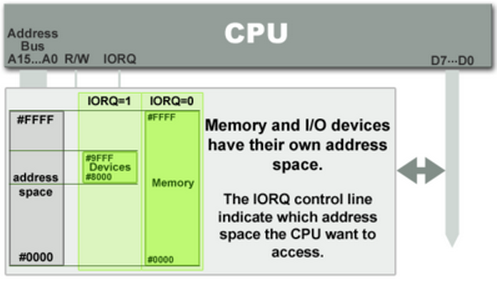

内存和 I/O 设备有各自的地址空间。 端口映射 I/O 通常使用一种特殊的 CPU 指令，专门执行 I/O 操作。在 Intel 的微处理器中，使用的指令是 `IN` 和 `OUT` 。为了实现地址空间的隔离，要么在 CPU 物理接口上增加一个 I/O 引脚，要么增加一条专用的 I/O 总线。由于 I/O 地址空间与内存地址空间是隔离的，所以有时将 PMIO 称为被隔离的 IO(Isolated I/O)。

另一种方案是从内存地址空间中取出一部分作为设备地址空间，也就是内存和外设共享同一个地址空间，如下所示：

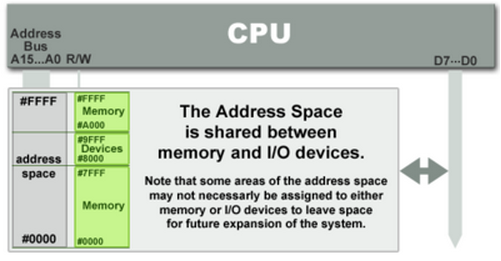

在 MMIO 中，内存和 I/O 设备共享同一个地址空间。 MMIO 是应用得最为广泛的一种 IO 方法，它使用相同的地址总线来处理内存和 I/O 设备，I/O 设备的内存和寄存器被映射到与之相关联的地址。当 CPU 访问某个内存地址时，它可能是物理内存，也可以是某个 I/O 设备的内存。因此，用于访问内存的 CPU 指令也可来访问 I/O 设备。每个 I/O 设备监视 CPU 的地址总线，一旦 CPU 访问分配给它的地址，它就做出响应，将数据总线连接到需要访问的设备硬件寄存器。为了容纳 I/O 设备，CPU 必须预留给 I/O 一个地址区域，该地址区域不能给物理内存使用。

需要强调的是，即使有了 MMIO 和 PMIO 两种手段，有的设备还是需要通过读写 CSR 的方式来进行，比如说 RISCV 和 Arm 对于中断控制器（设备的一种）的配置，这样做的原因可能是会提高读写的速度（不消耗统一的总线带宽）。

有趣的是，用“地址空间”这样的抽象来概括异质性、多样化的实体的策略在其他地方也有类似体现，比如说 Unix “一切皆文件”的设计抽象，“文件”跟“地址空间”具有一定的相似性。

---


## 三、中断控制器

上文介绍的是以 CPU 为主导的通信，如果 CPU 想要知道交给外设的某个任务有没有完成，那么 CPU 就必须轮询外设空间里的某个地址（本质可能是某个寄存器），直到收到任务完成的信号，比如说如下代码的核心就是 `do while` 循环

```c
/**
 * Receive a character
 */
char uart_getc()
{
    char r;
    /* wait until something is in the buffer */
    do
    {
        asm volatile("nop");
    } while (!(*AUX_MU_LSR & 0x01));
    /* read it and return */
    r = (char)(*AUX_MU_IO);
    /* convert carrige return to newline */
    // return r == '\r' ? '\n' : r;
    return r;
}
```

但是这种方式非常消耗 CPU 资源，如果当 CPU 发出请求后，CPU 不再忙等而是去干别的事情，等外设完成自己的工作后，再发通知提醒 CPU，这种以外设为主导的方式节省了 CPU 资源。需要强调的是，即使通信的主导方是外设，但是并不意味着控制逻辑是在外设处实现的。外设只是通知 CPU 一下，CPU 依然要进行数据的读取和搬运工作，外设没办法替 CPU 干这种事情（本来也不是 CPU 的活）。

不过如果以外设为主导，那么依然存在上文讨论的问题，外设众多，如果每个外设的中断都直接给到 CPU，由于外设数量众多，这会导致连接 CPU 引脚数量众多，从而增加 CPU 的体积。如果同时有多个中断发生，CPU 需要维护一个中断等待队列，并且中断还有优先级，维护队列和判定优先级都会占用 CPU 的时间，降低 CPU 的性能。因此中断控制器就应运而生。

中断控制器相当于一个代理，外设产生的中断会先发给中断控制器，中断控制器管理、控制可屏蔽中断，并且对中断的优先级进行判断，再高优先级中断转交给 CPU，这样 CPU 既能专注计算，又能及时响应到中断事件，并执行相应的中断服务程序。示意图如下（PE 是 process element，即 CPU）。

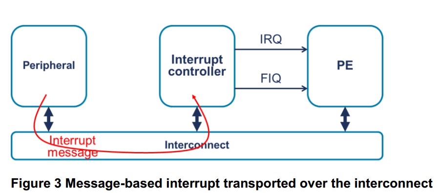

当前主流芯片架构通常采用不同的中断控制器，ARM 使用的 GIC（Generic Interrupt Controller，通用中断控制器）的具体结构如下所示：

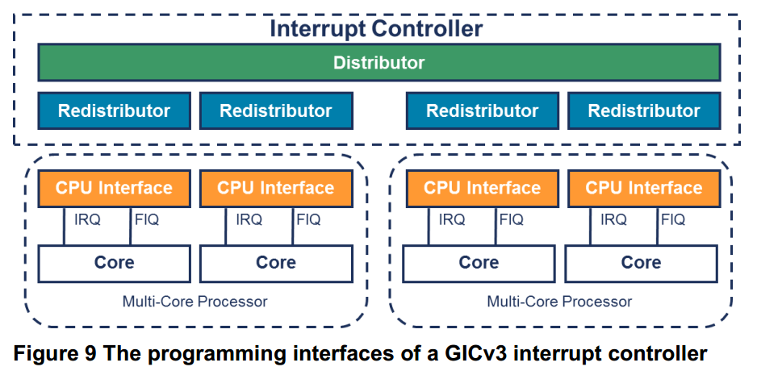

CPU 通过**中断号**来识别不同的外设，中断号是中断控制器对于不同设备的编码（没准就是某个设备连在特定的引脚，它的编号就是那个引脚号）。此外如果设备过多，以至于一个中断控制器


外设发出通知后，还要经过如下过程才可以到达 CPU


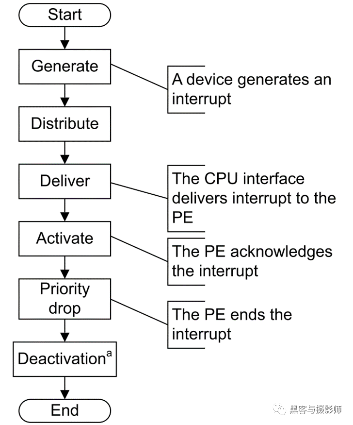

中断控制器只承担了“通知”的功能，而实际的数据搬运，比如说将数据从设备空间搬运到其他地方（这基本上必然发生，因为设备空间的数据很容易被设备的下一次结果覆盖），依然要使用 CPU，这无疑是消耗 CPU 资源的，所以才有了 DMA（**D**irect **M**emory **A**ccess）。如下所示：

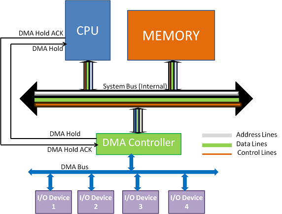

---


## 四、总线与桥

总线是一种在计算机内部组件之间或计算机之间传输数据的通信系统。总线给我的直观感觉像是一个马路一样，各种元件的数据都在这个马路上跑。不过实际上，总线更像是一个协议，如果一个设备想要使用某个总线通信，那么就必须实现这个总线对应的协议。

而桥则是实现了多个总线协议的芯片，它发挥着“中转站”的作用，将不同的数据包分发或者收拢。在历史上有著名的南北桥，这实际是在系统设计上将 I/O 工作层层转包。CPU 把比较慢的 bus 转包给北桥，北桥把更慢的 bus 转包给南桥，南桥把更更慢的 bus 转包给 Super I/O。如下所示：

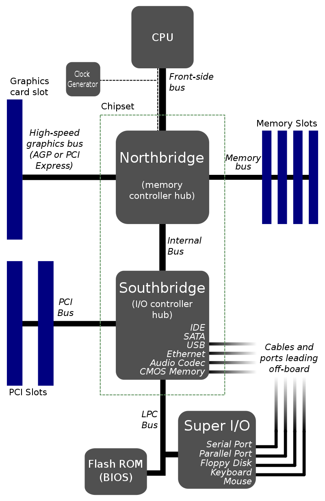

## 五、设备树

### 5.1 意义

设备树提出的背景是在Linux3.x之前的内核源码中，存在大量对板级细节信息描述的代码。这些代码充斥在 `/arch/arm/plat-xxx`和 `/arch/arm/mach-xxx` 目录中。每年新出的 ARM 架构芯片少说都有数十、数百款，每一款芯片又会有很多款基于该芯片的板子，这些板子上的设备又不相同，每一块板子都要有自己的板级信息文件，所以 Linux 内核下板级信息文件将会成指数级增长！关键是这些板级信息文件还都是 `.c`  或 `.h` 文件，它们都会被编译进 Linux 内核中，导致 Linux 内核“虚胖”。

所以将描述主板上外设信息的工作从 Linux Kernel 中去除，采用设备树的方式描述主板信息，内核只需要读取设备树文件并根据文件选择适合自己的驱动就可以了（似乎应用了 kenerl module 的技术）。之所以称之为“设备树”，是因为用采用树形结构描述板级设备，如下所示：

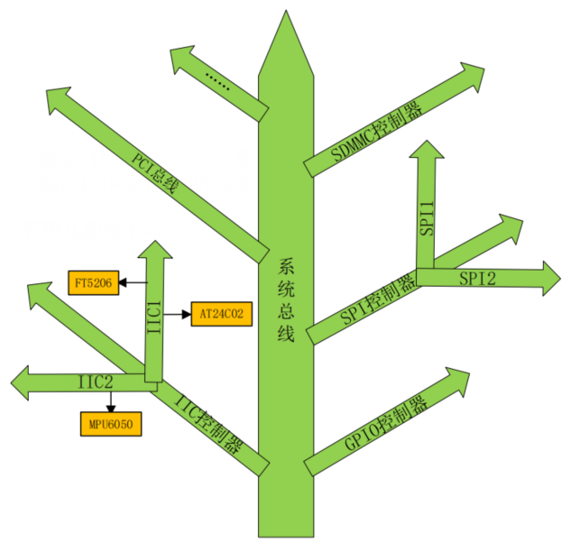

虽然设备树是用于解决驱动的问题，但是我们也可以通过设备树来了解一些主板的信息。

### 5.2 文件

DTB（device tree source）文件是一种 ASCII 文本格式的设备树描述文件，此文件适合人类阅读主要是给用户看的。一个 `.dts` 文件对应一个 ARM 的设备，一般放置在 `arch/xxx/boot/dts/` 中。由于 DTS 中包含了很多公共部分，linux 内核为了简化，将 Soc 公共部分提炼为 `.dtsi` 文件，类似 c 语言中的 `.h` 文件。

DTB（device tree blob） 是将 DTS 编译以后得到的二进制文件。将 DTS 编译为 DTB 需要编译工具 DTC（device tree compiler）。

内核设备树绑定文档（kernel device tree binding documents）在 `Documentation/devicetree/bindings/` 下按照硬件和子系统的分类进行组织。提供的文档以 `.txt` 或 `.yaml` 的格式。所谓的“设备绑定”指的是“硬件和驱动建立联系”的过程，也就是根据主板上的设备选择对应的驱动的过程。

### 5.3 节点格式

device tree node 的格式如下，我们分几个部分进行介绍：

```c
[label:] node-name[@unit-address] {
    [properties definitions]
    [child nodes]
};
```

首先介绍第一行的部分，这个部分主要标识 node 的身份，比如说

```c
intc: interrupt-controller@00a01000
```

其中 `interrupt-controller` 说明这是一个中断控制器设备，而 `@00a01000` 则说明这个设备 MMIO 后的首地址是 `0x00a01000` 。前面的 `intc` 是标签，方便“访问节点”，我也不确定什么是访问节点，不过以上面的举例，我们可以用如下语法来声明某个设备是该中断控制器的子节点（使用 `&intc`）：

```c
interrupt-parent = <&intc>;
```

### 5.4 属性

`properties` 指的是设备的属性，其呈现形式是一个 `key-value` 组。`value` 具有多种数据类型，每种数据类型都具有一定的格式，也可以为空，如下所示：

```c
// string
compatible = "arm,cortex-a7";
compatible = "fsl,imx6ull-gpmi-nand", "fsl, imx6ul-gpmi-nand";

// cell(unsigned int32 array)
reg = <0>;
reg = <0 0x123456 100>;

// bytestring(unsigned char)
local-mac-address = [00 00 12 34 56 78];
local-mac-address = [000012345678];

// null
tlb-split;
```

存在一些比较经典的属性：

**compatible**

compatible 属性也叫做“兼容性”属性，这是非常重要的一个属性！compatible 属性的值是一个字符串列表，compatible 属性用于将设备和驱动绑定起来。字符串列表用于选择设备所要使用的驱动程序，compatible 属性的值格式如下所示：

```c
"manufacturer,model"
```

举个例子

```c
compatible = "fsl,imx6ul-evk-wm8960","fsl,imx-audio-wm8960";
```

`fsl` 表示厂商是飞思卡尔，`imx6ul-evk-wm8960` 和 `imx-audio-wm8960` 表示驱动模块名字。这个设备首先使用第一个兼容值在 Linux 内核里面查找，看看能不能找到与之匹配的驱动文件，如果没有找到的话就使用第二个兼容值查。

**reg**

用于描述设备的地址空间特性，一般呈现这种形式

```c
reg = <address1 length1 address2 length2 address3 length3 …… >
```

这样一片地址空间就可以被一个首地址和一个空间长度所描述。但是遗憾的是，因为数据类型 cell 的本质是 `u32`，所以当遇到 64 位地址的情况，那么就需要两个 cell 去描述同一个地址或者长度，比如说如下所示

```c
reg = <0x0 0xc000000 0x0 0x4000000>;
```

地址是 `0x00000000c000000` 长度是 `0x0000000004000000` 。但是这种方法产生了歧义，比如如果按照 32 位地址空间去解释，那么这个描述的就是两段空间，第一段空间的首地址是 `0x0`，长度是 `0xc000000`，第二段地址空间的首地址是 `0x0`，长度是 `0x4000000`。那么如何区分这两种情况呢，我们又引入了两个属性。

**#address-cells, #size-cells**

`#address-cells` 属性值决定了子节点 `reg` 属性中地址信息所占用的字长，`#size-cells` 属性值决定了子节点 reg 属性中长度信息所占的字长。举个例子

```c
#address-cells = <2>;
#size-cells = <1>;
reg = <0x0 0xc000000 0x4000000>;
```

因为 `#address-cells` 是 `<2>`，所以前两个 cell `0x0 0xc000000` 是地址，而 `#size-cells` 是 `<1>`，所以只需要一个 cell `0x4000000` 描述长度。

**status**

status 属性是和设备状态有关的，status 属性值也是字符串，如下表所示：

| 属性值        | 描述                       |
| ------------- | -------------------------- |
| "okay"        | 表示设备可用且正常工作。   |
| "disabled"    | 表示设备已被禁用或不可用。 |
| "fail"        | 表示设备启动或初始化失败。 |
| "unsupported" | 表示设备不被支持。         |

**model**

model 属性值也是一个字符串，一般 model 属性描述设备模块信息，比如名字什么的，比如：

```c
model = "wm8960-audio";
```

**interrupts**

这是一组属性：

- `interrupt-controller` 一个空属性用来声明这个 node 接收中断信号，即这个 node 是一个中断控制器。
- `#interrupt-cells` 是中断控制器节点的属性，用来标识这个控制器需要几个单位做中断描述符，用来描述子节点中 `interrupts` 属性使用了父节点中的 `interrupts` 属性的具体的哪个值。一般，如果父节点的该属性的值是 `<3>`，则子节点的 `interrupts` 的格式为 `<中断域 中断 触发方式>` ，如果父节点的该属性是 `<2>`，则是 `<中断 触发方式>` 。
- `interrupt-parent` 标识此设备节点属于哪一个中断控制器，如果没有设置这个属性，会自动依附父节点的。
- `interrupts` 一个中断标识符列表，表示每一个中断输出信号的具体信息。

### 5.5 特殊节点

**root**

每一个 dts 文件都有一个 root 根节点，内核通过 `/` 找到设备。

**aliases**

单词 aliases 的意思是“别名”，因此 aliases 节点的主要功能就是定义别名，定义别名的目的就是为了方便访问节点。不过我们一般会在节点命名的时候会加上 label，然后通过 `&label` 来访问节点，这样也很方便。

**chosen**

chosen 并不是一个真实的设备，chosen 节点主要是为了 uboot 向 Linux 内核传递数据，重点是 bootargs 参数。一般 DTS 文件中 chosen 节点通常为空或者内容很少。
