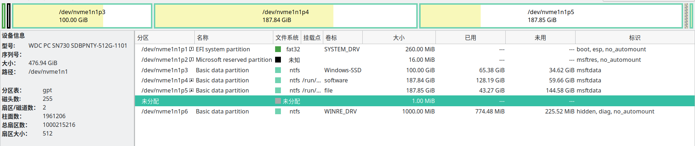
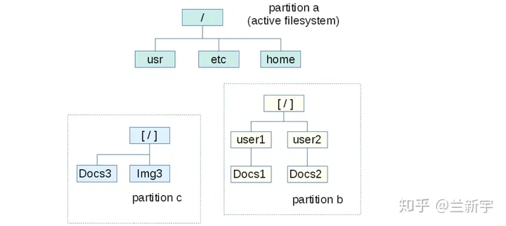
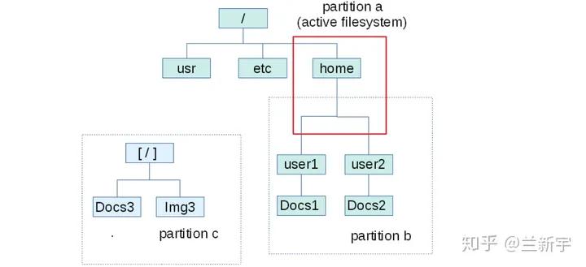

## 一、块设备

外存是一种块设备（block device），是指以固定大小的块（block）为单位进行读写访问的设备。这些设备以块为最小的访问单元，每个块都有一个唯一的地址。我个人理解，可以将一个块设备理解成以 block 为元素的线性数组。

其中 block 大小一般是 512 字节，也被叫作扇区 sector。其实这个大小对于现在的计算机有些太小了，所以往往这些 block 也会聚集成一个更大的单位，这里就会产生一些混乱，比如说这个更大的单位可以被叫作簇 cluster，也可以被叫作块 block。

块设备在 Linux 中显示为 `/dev/` 下的一个文件，他们命名往往是 `xxy` ，其中 `y` 是 `a, b, c, d` 这样的字母，用于表示相同设备的编号。而 `xx` 表示设备的种类：

- `hd`：指的是采用 IDE 磁盘接口的磁盘
- `sd`：原本是 SCSI disk，SCSI 和 IDE 都是旧控制器协议，现在也只 SATA 接口的磁盘
- `vd`：虚拟硬件设备，在一些虚拟化平台（如 KVM、QEMU、Xen）中，虚拟化主机的磁盘设备会被命名为 `vda`、`vdb`、`xvdc` 等类似的形式。
- `nvme`：NVMe 是 non-volatile memory express，它是一个主机控制器接口和存储协议，用于加速企业和客户端系统以及固态驱动器（SSD）之间的数据传输。它通过电脑的高速 PCIe 总线工作。总结就是一个比 SATA 快的固态硬盘设备。

当然我们提供了这些文件，主要是是为了使用他们，我门也不指望可以用 `cat` 查看他们内容了，但是可以用 `dd` 对它们进行复制，用 `fdisk` 对它们进行分区。

另外还有一种叫作**磁盘镜像**的文件，他们就是磁盘内容的完全复制，也就是说，所有能在 `/dev/sda` 上进行的操作，都可以在 `disk.img` 中进行，相当于是把一个磁盘内容作为文件放到了另一个磁盘上。

---


## 二、分区

一般我们并不会在拿到一个块设备后就立刻使用，而是对它们进行分区，分区的效果就是让一块磁盘看上去像多块磁盘。

至于为什么要分区，从历史的角度看，分区可能是因为 OS 并不能很好处理容量较大的磁盘，通过分区可以让磁盘分成多个小磁盘，方便 OS 的处理。而当今来看，分区和文件系统密切联系，一个分区上只能有一个文件系统，一个文件系统只能在一个分区上。所以当我们有使用多文件系统的需求时，也就需要分区了。

而为什么需要多个文件系统，就有很多原因了，比如最为朴素的，希望不同的文件属于不同的文件系统，比如 Windows 就希望所有的软件都在 C 盘中安装。而比较高端的，就是因为不同的文件系统具有不同的性质，比如有些不易失，但是速率较慢，而有些速度块，却很易失，所以就需要用多个文件系统来达到权衡。

分区的实现依赖于分区表，目前有两种格式的分区表，分别是 MBR 分区表和 GPT 分区表，后者可以创建更多的分区，是一种先进的设计。

我们可以用 `fdisk` 或者 `gparted` 对磁盘进行分区，我截了张图，是 Windows 下的分区



这张图基本上直观地反映了这篇博文的所有知识点。这个磁盘有 6 个分区，其中比较重要的 3 个分区分别是 C，D，E 盘。

有趣的是，分区和磁盘一样，同样会在 `/dev/` 文件夹下出现，他们的命名格式就是原本的磁盘名字加上数字编号（或者一些其他类似的后缀），当我们使用 `lsblk` 命令时，会清楚得发现这个关系，如下所示：

```shell
$ lsblk
NAME        MAJ:MIN RM   SIZE RO TYPE MOUNTPOINTS
nvme1n1     259:0    0 476.9G  0 disk 
├─nvme1n1p1 259:1    0   260M  0 part 
├─nvme1n1p2 259:2    0    16M  0 part 
├─nvme1n1p3 259:3    0   100G  0 part 
├─nvme1n1p4 259:4    0 187.8G  0 part /run/media/thysrael/D
├─nvme1n1p5 259:5    0 187.8G  0 part /run/media/thysrael/E
└─nvme1n1p6 259:6    0  1000M  0 part 
nvme0n1     259:7    0 931.5G  0 disk 
├─nvme0n1p1 259:8    0   300M  0 part /boot/efi
└─nvme0n1p2 259:9    0 931.2G  0 part /
```

（另外说一嘴，表头的 `MAJ:MIN` 指的是主设备号和次设备号）。

所有可以对磁盘文件使用的命令都可以对分区文件使用，而且分区文件还可以使用 `mount` 命令。这是因为只有分区因为有文件系统的存在，所以具有“可解释性”。而磁盘并没有这个特性。

---


## 三、文件系统

分区之后依然没法使用，因为我们还需要对分区进行**格式化**，在 Linux 上我们可以使用命令 `mkfs` 来进行格式化。正如这个命令本身所暗示的一样，格式化的本质就是在分区上创建一个“文件系统”。

这里需要区分一下文件系统的概念。事实上，我们会接触到两个文件系统，一个文件系统是我从小就接触到的，它被组织成一棵树型结构，有文件夹，有文件，我可以创建，删除，编辑，在各个路径下导航，这个文件系统是操作系统维护并呈现给我的。还有一个文件系统是我之前很少接触的，他们指的是如何规划分区里面的 block ，在原本线性的 block 数组上，构建一个树形结构，每个节点还存储着一些元数据。此外，还应当考虑这个树形结构的检索、安全、可恢复性、大小等因素。这个文件系统有 FAT, EXT, NTFS 等例子。

我们格式化生成的就是第二种文件系统，而第一种文件系统更像是第二种文件系统的“**前端**”。这种文件系统由以下几个部分组成：

- file data: 即文件中的数据
- meta data: 除了文件本身包含的数据，还有文件的访问权限、大小和创建时间等控制信息。这也被称为 inode
- control data: 用于记录分区 block 的使用情况和归属情况，可以是位图
- superblock: 包含了一个文件系统所有的控制信息，可以理解为文件系统的 meta data

----


## 四、挂载

那么如何让一个外存上的文件系统转变成我们常见的**前端文件系统**呢？是通过挂载 mount 。

挂载指的是在原有的前端文件系统中找到一个目录（也被称为挂载点），然后让 OS 解析外存文件系统，并将其根节点放到挂载点上的过程。之后我们就可以通过访问挂载点下的文件树，来访问实际的文件系统了。

示意图如下：



以 `/home` 为挂载点挂载 partition b，效果如图：


