二元关系真的是很难的一章，非常驳杂，而且其实直观理解都很浅薄，只需要记住其本质依然是集合论的分支，证明或者性质探究依然没有脱离集合论的阴影。

<!-- more-->

## 一、笛卡尔积恒等式

首先需要明确，笛卡尔积的恒等式证明，最常用也是最好用的方法依然回归到元素，分别讨论序偶中第一元和第二元的**属于关系**，然后得出正确结论，一定是最本质而且最简单的方法。

不过还是想在这里记录一下笛卡尔积的一些重要运算性质，它的记忆难度远低于集合的减法或者异或，是因为含有笛卡尔积的式子，其结果变成了序偶，而不再是集合，所以限制了各个运算符的组合形式。

可以说 $\times$ 具有结合律，但是没有交换律，对于分配律，有很好的表现，有
$$
(A\cup B)\times C = (A\times C)\cup (B\times C),\quad C\times (A\cup B) = (C\times A)\cup (C\times B)
$$

$$
(A\cap B)\times C = (A\times C)\cap (B\times C),\quad C\times (A\cap B) = (C\times A)\cap (C\times B)
$$

$$
(A\oplus B)\times C = (A\times C)\oplus (B\times C),\quad C\times (A\oplus B) = (C\times A)\oplus (C\times B)
$$

$$
(A- B)\times C = (A\times C)- (B\times C),\quad C\times (A- B) = (C\times A)- (C\times B)
$$

可以说，如果题目使用这些二级结论依然解不了，那么应该就是用普通方法证明就好了，或者直接举反例。

---

## 二、关系的性质

### 2.1 性质判断

其实关系的性质还是都挺好理解的，但是难点在于有的题目就不干人事，专挑那些特殊情况考察，所以我先梳理一下对诸多性质的直观理解，然后再在题目中补充：

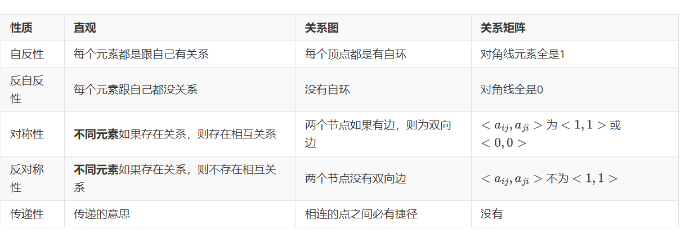

因为这些定义都是以**蕴含式**的形式给出的，所以导致对于**空关系**，它同时具有了自反性，反自反性，对称性，反对称性，传递性全部五种性质。

然后有例题：

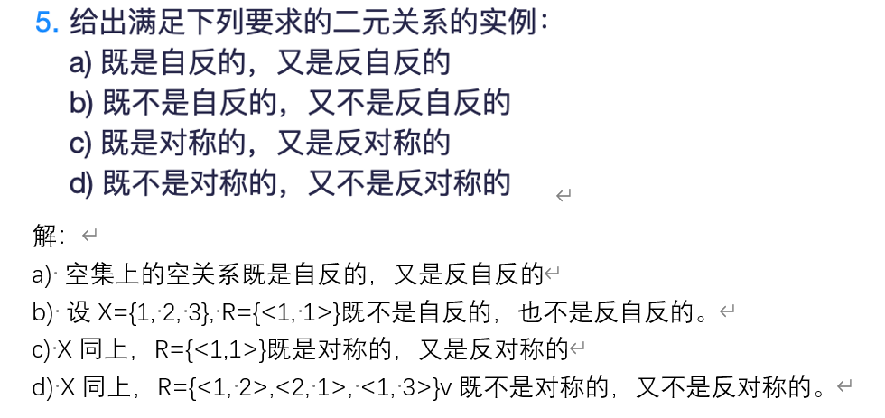

### 2.2 关系计数

计数问题其实从上一章就有，计算**集合的基数**。我觉得抛开这一章的情景不谈，为什么计数问题这么多。我觉得是因为计数问题的求解其实可以理解为我们在构造符合条件的东西，我们计数的过程，其实就是遍历的过程，我们解决了计数问题，其实就是解决了遍历问题。

对于具有不同关系的性质的计数，从**关系矩阵**的角度思考最为方便直观，这可能是因为关系矩阵可以清楚的展示任意两个个点之间的关系（也就是说，采取一种**删的思想**），题目一般长这样：

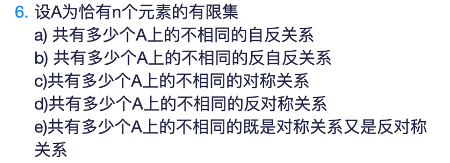

我们思考的时候就是考虑矩阵中每个元素是取1还是取0即可，比如对于b题

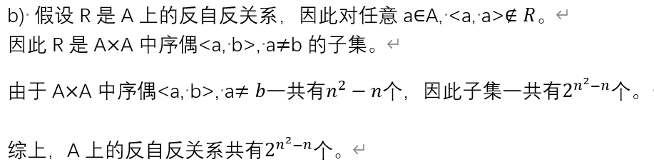

因为反自反关系中对角线元素是确定的，所以只需要考虑非对角先元素即可。a题的答案应该与b题相同。

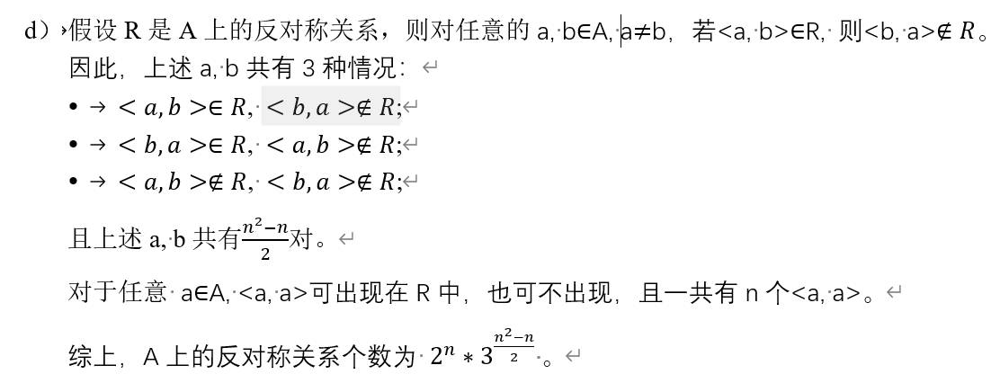

后三道题目的解法都类似，都是考虑 $<a_{ij},a_{ji}>$ 的取值，我已经在表格内探讨过了，颇为自然。

### 2.3 关系判断的另一种表述

这个属于是当我们引入关系的**逆**和关系的**合成**（这是两个新引入的运算）和其他关系运算（本质都是基于集合运算）的概念以后，由此产生的新结论，其实都还好，没有很难的，都是很直观的结论，就不放证明过程了：

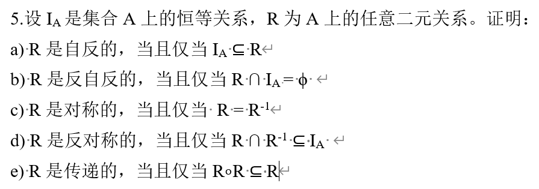

### 2.4 闭包相关

#### 2.4.1 基本概念

闭包有两个要强调的点，一个是其是在**旧有关系**上**添加**形成的，不存在**删改**的情况。另一个是闭包是具有这种性质**最小**的集合，这个性质常常被用于证明题。

对于**自反闭包**，有：
$$
r(R) = R\cup I_x
$$
对于**对称闭包**，有：
$$
s(R) = R \cup R^{-1}
$$
对于**传递闭包**，有：
$$
t(R) = R^+ = \bigcup^{\infty}_{i = 1}R^i
$$

关于传递闭包，其实不需要到无穷，只需要到 n - 1 就好了。

#### 2.4.2 闭包性质

其实有很多很优美的性质，但是好像因为考试不考，所以就不做重点叙述了。

这道题目中的题设是 $R_1\subseteq R_2$：

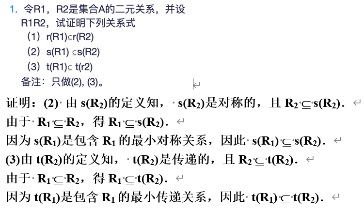

下面这套二级结论阐述了闭包运算与集合运算的交换性：

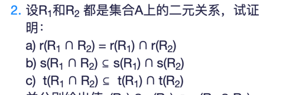

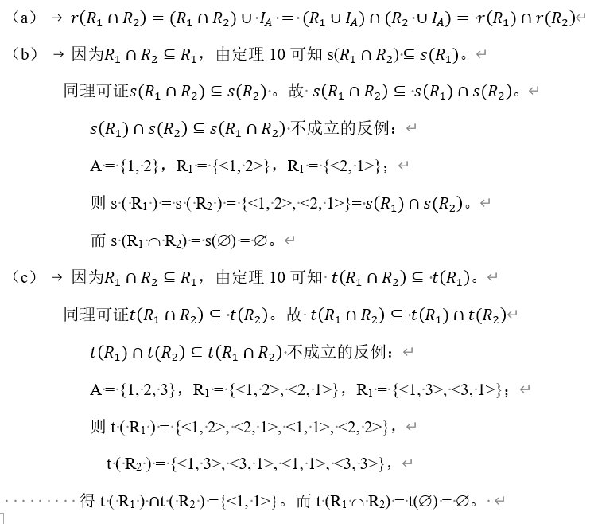

#### 2.4.3 闭包性质的保持	

大结论就是闭包运算的保持性挺好的，除了对称闭包运算可能会破坏传递性，这个运算可能会使原来关系的本来具有的传递性搞没了。这是因为如果一个图本没有路径，那么他是传递的，经过对称操作以后，可能就有路径了，而此时不能保证传递了，比如说：
$$
R = \{<1,2>,<3,2>\}
$$
下面这套二级结论阐述了闭包运算间的交换性（似乎可以背过），可以看到对称性拉跨

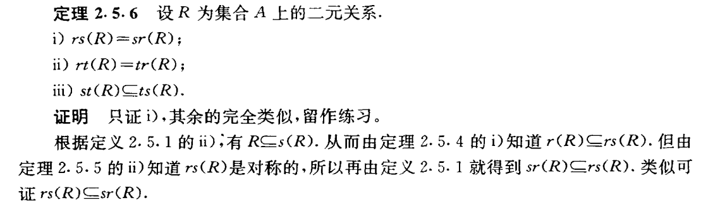

下面这套定理主要论证了经过闭包运算后，其他性质还能不能保持，可以看到，除了**传递性**保持的不太好外，其他两个性质都保存的很好。

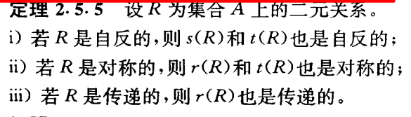

#### 2.4.3 关系的合成性质

主要是为了应付选择题，如果 $R_1,R_2$ 是自反（反自反，对称，反对称，传递）的，那么关系的合成是否还能保持这些性质：

| 性质 | 自反 | 反自反 | 对称   | 反对称 | 传递   |
| ---- | ---- | ------ | ------ | ------ | ------ |
| R1R1 | 是   | 有可能 | 是     | 有可能 | 是     |
| R1R2 | 是   | 有可能 | 有可能 | 有可能 | 有可能 |

考题一把出等价关系或者良序关系的合成是否还是满足等价关系或者良序关系之类的，如果把一个一个性质单独拆开来看，其实有不合理的地方，但是我也想不出什么直观的办法了。

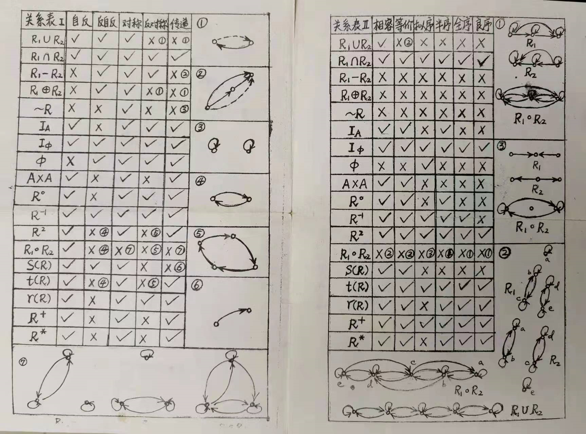

---

## 三、次序关系

### 3.1 序的概念

次序关系中最难学的就是各种名词，因为教材不同，同一个概念，会有很多的名字，而且本身这些概念就容易混淆，所以一并整理。

#### 3.1.1 偏序

又称为**半序**或者**部分序**，其特点是满足**自反性，反对称性，传递性**。如果绘制哈斯图，那么就是这个样子：

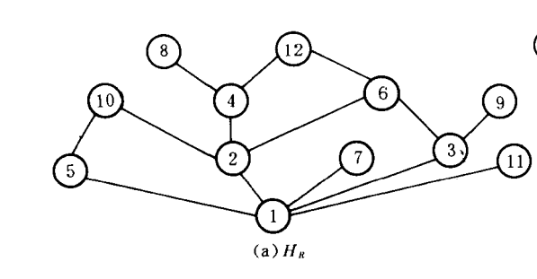

可以看到，其哈斯图是网状的，并不能保证所有的元素都具有关系（也就是说是一条链）。

#### 3.1.2 拟序

又叫做**严格偏序**，要求是具有反自反性和传递性，但是我们知道其特点是**反自反性，反对称性，传递性**，也就是说，其与偏序结构仅在自反性上存在差异，而在对称性和传递性上没有差异，也就是说，其不同仅在于关系矩阵的对角线元素，一个全是0，另一个全是1。其哈斯图为：

 

跟**偏序**一模一样，因为哈斯图并不能反映节点对自身的关系。

#### 3.1.3 全序

又称为**链**或者**线性序**。是一种特殊的**偏序**，在这种偏序中，每两个元素间都有关系，也就是说，不会有 $a_{ij} + a_{ji} = 0$ 情况发生，也可以说，每个元素都是可比的。其哈斯图如下：

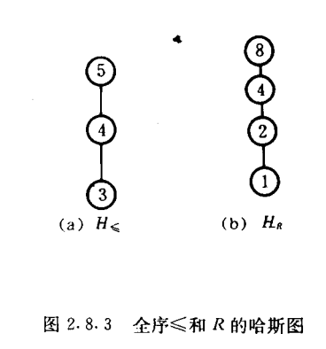

可以看出，其哈斯图是一条直线。

#### 3.1.4 良序

良序是一种特殊的**全序**，它要求全序的每个非空子集上都要具有极小元（其实对于全序而言，极小元就是最小元），也就是说，会筛掉一部分的全序，比如这种

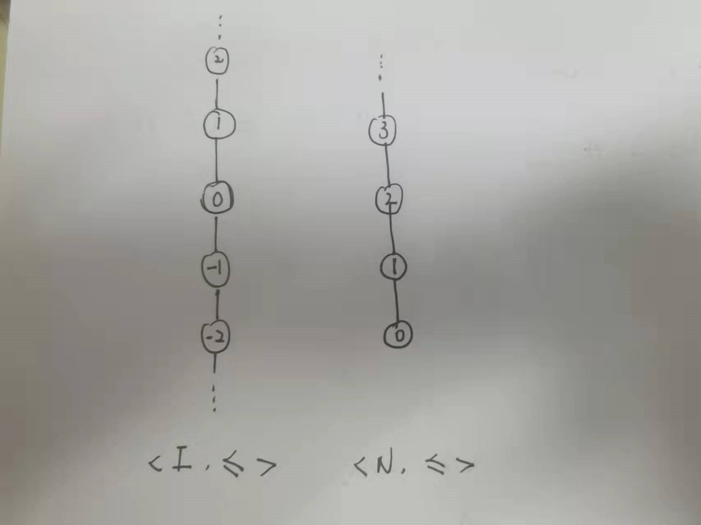

左边的就只是一个全序，而右边的才是一个良序。可以看出，良序是有一个**在底部的端点**的。但是其实这种还不够，比如我错过的

如果子集选为 $\{x\mid x = \frac{1}{2^n}\}$ ，那么同样也没有最小元。真正的充要条件是**不存在** **A** **中元素的无穷递降序列**。

关于上面这个定理，有一个花哨的证明，以致于我不清楚它到底算不算用了反证法（将结论否定作为条件，然后推出原条件的否定）：

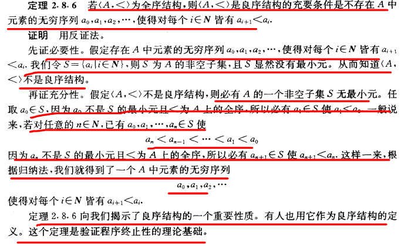

用不严谨的数学总结一下，就是
$$
良序 \subseteq 全序 \subseteq 偏序,\quad  偏序 \cap 拟序 = \emptyset
$$

### 3.2 其他概念

#### 3.2.1 覆盖

我怀疑可能这个概念的提出就是为了画哈斯图，他说的是，如果a是b的覆盖，那么a是b的**紧紧大于**关系，中间是不能在插入一个新的元素的，比如说**实数的大于**就没有覆盖关系，因为实数的**连续性**。

#### 3.2.2 极大元和最大元

关于极大元和最大元区别，其实就是极大元是在所有与他可以相比（有关系）的元素中，是最大的。而最大元则是与所有元都可以比，而且还是最大的。极小元和最小元同理。

### 3.3 一些证明

大概在这个时候，反证法的应用多了起来：

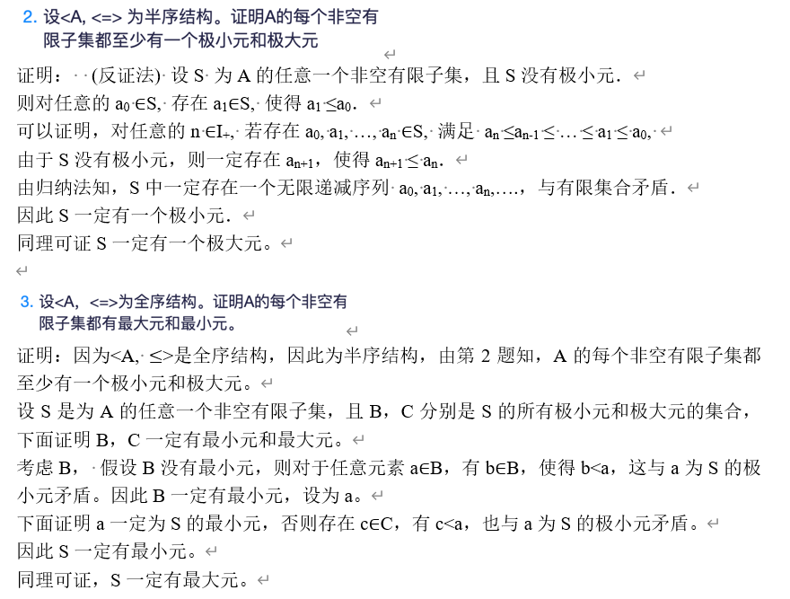

---

## 四、等价关系

### 4.1 相关概念

#### 4.1.1 等价关系

当一个关系具有**自反性，对称性，传递性**的时候，那么他就被称为具有等价关系。如果将其表示为**关系图**，会发现等价关系强调**分支**，不是所有的节点都是连通的，但是在一个分支内的节点的联系都很强，是**完全有向连通分支**。（这是**一个**关系图）

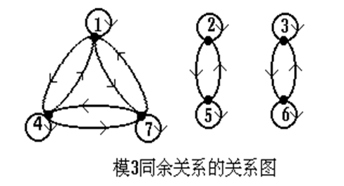

#### 4.1.2 等价类

这个概念，还是数学形式直观，说的是对于 $x\in A$ ，$A$ 中与 $x$ 有等价关系 $R$  的元素的集合称为 $x$ 关于 $R$ 的等价类。所以说，等价类的本质是一个**集合**。这个集合其实就把上面图中同一个连通分支中所有元素放到一个集合。

一个等价关系会导致大于等于一个等价类的产生。

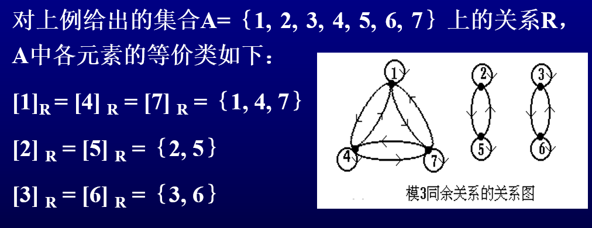

#### 4.1.3 商集

可以看出，商集是一个**集类**。就是把所有的等价类合在一起，形成一个商集。

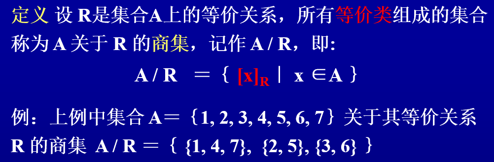

#### 4.1.4 划分

可以看出，划分同样是一个集类，而且可以看出，商集和划分有一个**对应关系**。（或者直接说商集就是划分也没有毛病，只是划分的概念是从集合给出的，没有依赖关系概念）

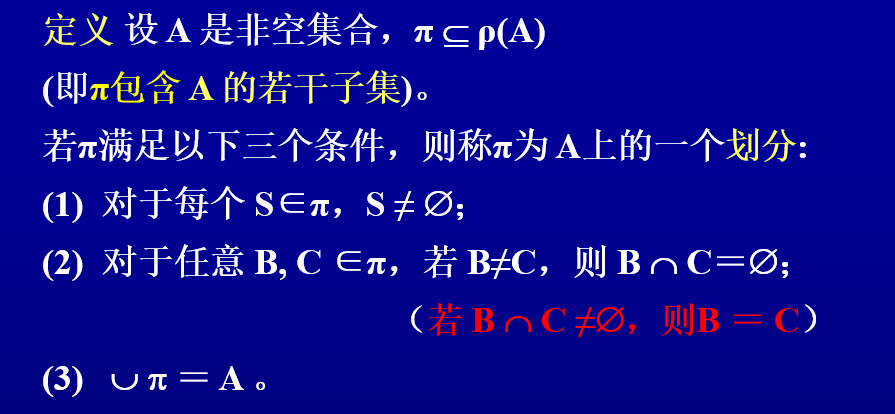

除了这个定义外，划分还衍生出了**划分块**和**秩**的概念。

### 4.2 相关证明

这个主要是因为课件上出现了，所以就放在这里了。可以看到，证明还是落实到了对关系的性质的证明上。

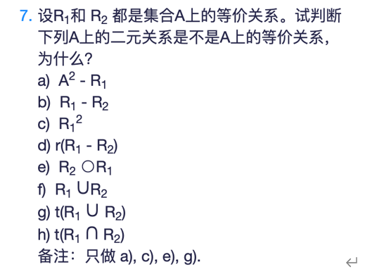

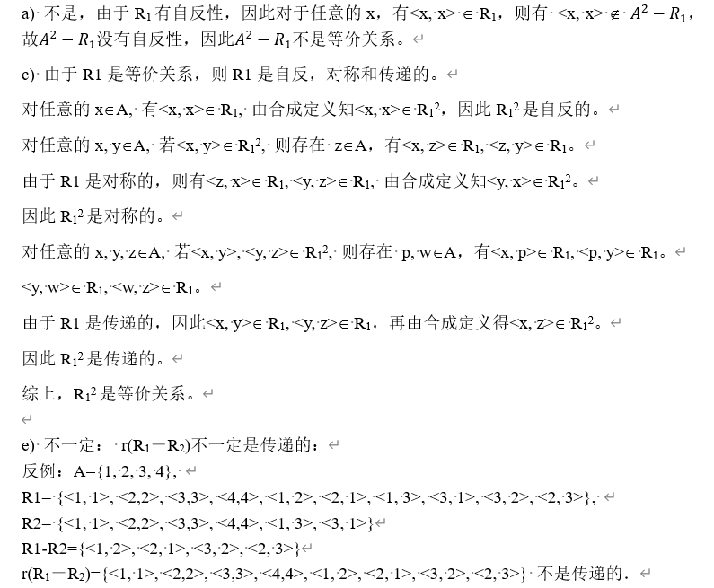

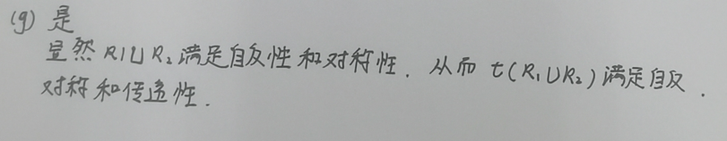

下面这道题超级有意思，引出了**斯特林数**和**广义容斥原理**，具体的内容可以参考我的博文“补充数学-斯特林数”。需要说明，这道题的标答没有写全。

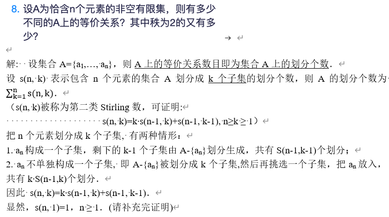
