因为这是在考前最后一天弄的，所以实在是没有时间码字了，就截几张自己觉得可能以后会用到的图，放在这里摆烂就好了。这都不是面向考试了，这都是面向考研复习了。

<!-- more-->

## 一、函数的概念

之前就看过这个标记，然后就没有看懂。

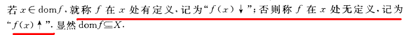

我觉得**部分函数**这个名字起得很好，因为确实如果 $X$ 不能全部作为源像，那么就是只有一部分，很生动。

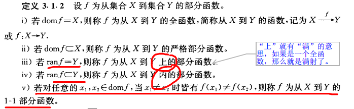

下面这个属于是新知识了，之前的函数只能以**元素**作为输入，现在直接放入了一个集合作为输入。

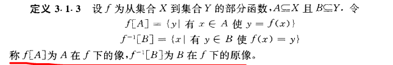

下面这个直观理解还是很容易的，但是证明过程总让人不自然：

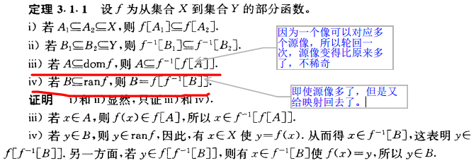

下面这个注意的集合 $A,B$ 的不同描述，也就是说，存在空集到空集的函数，只有一个，就是空集。

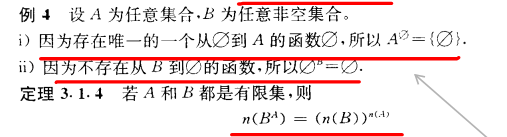

---

## 二、函数的合成

这个定理的作用就是抽丝剥茧，把原来难以解决的复合函数变成两个独立的函数。

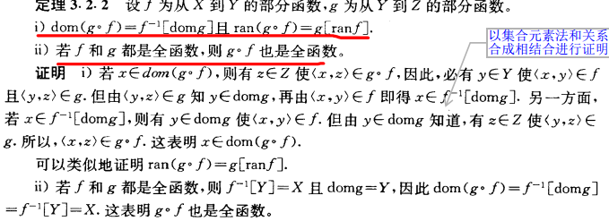

下面这两组定理经常考到：

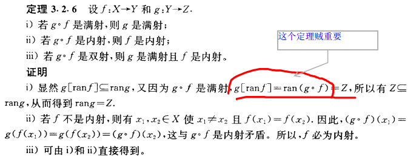

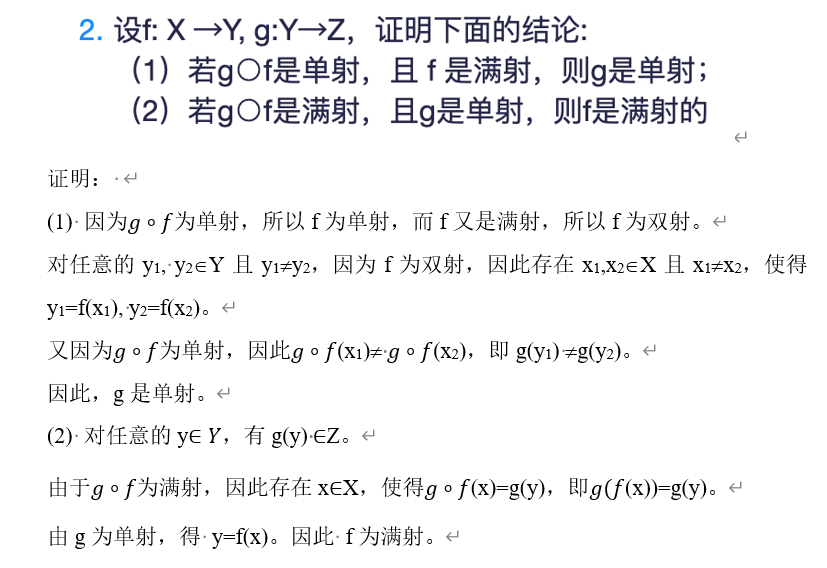

还有类似的

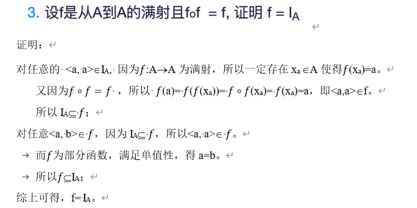

---

## 三、函数的逆

又有很多我很难从证明的角度理解的概念：

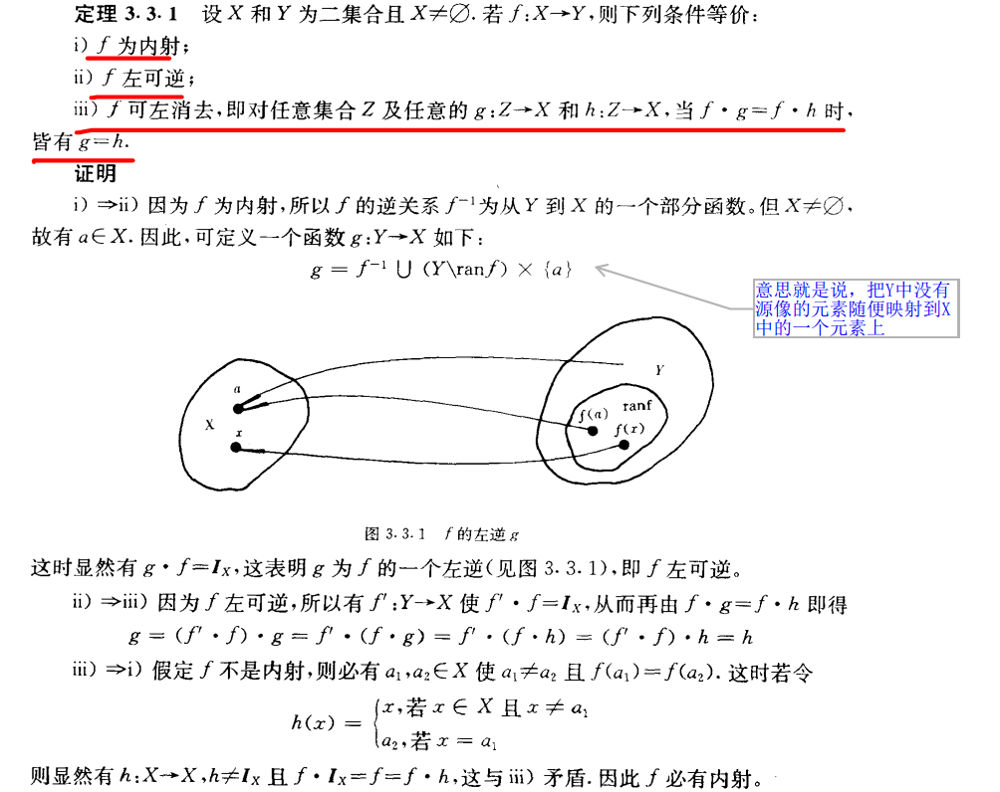

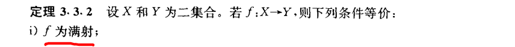

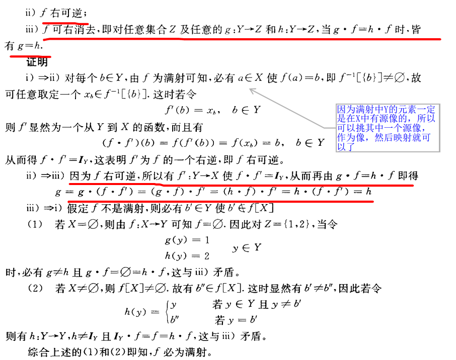
