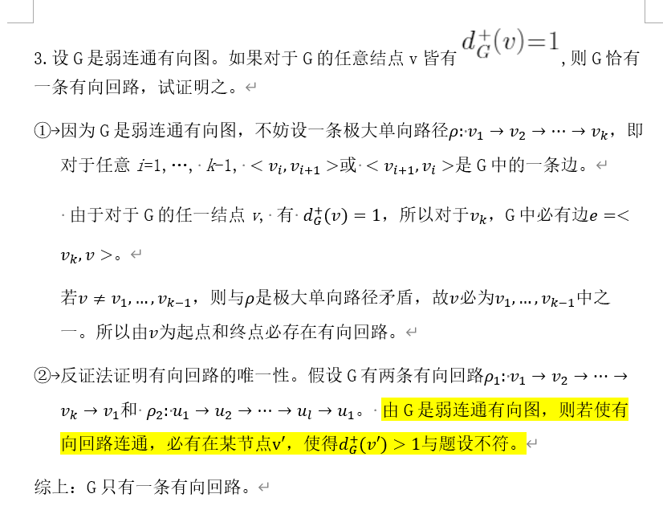

有些东西可能是离散数学这门学科的通病。相比于高数或者线代，有一定在物理上的应用场景，而且其精神，比如说无穷，比如说代数系统，很容易被理解，而且很容易为我所用。离散这门学科没有一个中心，没有一个明确的思想（也可能是我没有发现），没有具体的应用场景（可能在算法里有用吧），学科的体系感也不强（可能是我接触的比较浅的缘故）。正因为如此，图论才如此难学，而且我参考了三本书，有的时候三本书对于同一个定义都具有不同的诠释，这更使我觉得，我**没有搞清楚离散到底在研究什么？**这个核心问题，许多困难与辨析，都是因为诸多“表象”，而通过表象洞彻本质，才能从万变中发现永恒。而这些都是我没有做到的，所以我写下了这篇文章，希望可以边写，边领悟其中的真意。

> **图的最本质内容是一种二元关系**。
>
> 为了直观形象地理解图的结构和性质，总是用图形来表示一个图。

这句话是否说明，“图并不本质”，我们去对一个客观事物建模的时候，不应该先用他是不是一个图来考量，而是应该用他是不是一个二元关系来考量。这或许是一个很好的点。

图作为一个数学概念，其可以用来描述的客观事物一定是不胜枚举的。但是仅仅用图去描述现实中的地图、人际关系网，是不是有点形而下学了。如果用图俩描述流程图，或者解题图，会不会别有一番天地。突然想到，马尔可夫链也可以看做是图的一个应用，每一个随机过程，对应一个路径。

王兵山三元组图一生黑！！！
<!-- more-->
## 一、描述图

### 1.1 图的组成

这里存在两种说法，一种是认为图是一个由节点和边组成的**二元组** $(V,E)$，对于无向图来说，边是一个含有两个顶点的集合，而对于有向图来说，边是一个含有两个节点的序偶。这种说法比较符合我们的直观认知，但是有一个缺陷，就是对于**平行边**，也就是起点和终点相同的边，这种描述就很难区分这种情况。所以有了王兵山**三元组**定义，也就是 $(V,E,\Psi)$ ，包括节点，边，和映射关系，这种映射关系并不要求双射，所以可以把不同的边映射到相同的起点和终点的集合或者序偶中。

### 1.2 关系的描述

**关联**：描述的是顶点和边的关系，顶点是边的终点或者起点，那么这个边和这个点就是关联的。

**邻接**：描述的是顶点和顶点，边和边之间的关系。如果点与点之间通过边连接，那么这两个点就是邻接的。如果边与边通过顶点连接，那么这两个边就是邻接的。

**度**：用来衡量顶点的关系的多少的一个量，在有向图中，又分为出度和入度。为什么要引入这么一个度量呢，是因为这个度量比较弱，我们知道度，但是还不知道这个图具体什么样子，但是同时又比较强，因为图就那么几种，知道了度的信息，就可以发现一些规律了。宽松的说，**各个节点度越高的图，边数越多**。如果反应到图的矩阵表示法，度其实是对矩阵的行或者列的元素的求和。

### 1.3 特殊的节点、边、图

#### 1.3.1 特殊的点

**孤立点**：度为0的节点被称为孤立点。

**端点**：度为1的节点被称为端点。

#### 1.3.2 特殊的边

**自圈**：如果边的起点和终点都相同，那么就称这条边为自圈。

**平行边**：如果两条边的起点相同，而且终点相同，那么就称这两条边为平行边。

#### 1.3.3 特殊的图

**简单图**：如果一个图既无自圈，又无平行边，那么就称这个图为简单图。简单图其实是一个很好的条件，他使得鸽巢原理，反证法等一系列证明方法得以应用。可以说，我们后面大部分的篇幅，都讨论的是**简单图**的性质。这也使得三元组的定义形式，显得那么的冗余。

**零图**：节点都是**孤立点**的图称为零图。零图可以有很多个节点，但是每个节点之间都没有边（即“零边图”）。

**平凡图**：只有一个节点的图被称为平凡图，这个具体应用的时候常以**非平凡图**的形式在题目描述中出现，主要是为了排除这种特殊的情况。

**d 度正则图**：所有节点的度均为 d 的图被称为 d 度正则图。

**完全图**：如果有 n 个节点的图是 n - 1 度的正则图，那么就称这个图为完全图，记为 $K_n$ ，如果是完全有向图，那么就是出度和入度均为 n - 1。

### 1.4 图同构

具有 n 个节点的图称为 n 阶图。

图同构的概念就很好理解，所以就不说了，关键是有一个直观认识，就是其实当 n 较小的时候，同构图的种类挺少的。

此外，如果是同构的图，那么其矩阵表示经过行列变化，是可以化成一个相同的矩阵的。

### 1.5 子图

#### 1.5.1 子图和真子图

我们引入子图的概念乍一看上去是为了研究**局部图**，可是局部图是很有讲究的，因为图里面既包括点，有包括边，那么到底谁是局部，我认为，我们研究的对象其实是**边**，或者说，是**以边为主体**开展研究的。这种感觉很玄妙，我难以说明白。

**真子图**的要求是只限制边的，边必须是母图的真子集。而并没有对点做出任何要求。

#### 1.5.2 生成子图

生成子图要求顶点集必须与母图的顶点集相等，然后其他并无要求。也就是说，我们将母图删去任意条边，或者不删除边，都可以得到生成子图。可以看出，生成子图描述的是去掉一些联系后，之后的个体的状况。生成子图的连通性会变差或者不变。

#### 1.5.3 导出子图

导出子图更像是一种基于原图**构造新图**的方式。一共有两种构造方式，一个是基于点集。我们选择母图的点集的一个子集，所以与这个子集相关联的边都会被放到这个新图中。另一个是基于边集，我们选择边集的一个真子集，然后所有与这个边集相关联的点，都会被放到这个新图中。

我虽然觉得**生成子图**和**导出子图**很有用处，但是实际是，在后面的证明题中，他们并没有发挥任何作用，可能再以后的应用中他们会比较起作用吧。

### 1.6 图的运算

这其实对应另一种构造图的方式。

#### 1.6.1 图的可运算性

这个的定义挺有意思的：
$$
\forall e \in E\cap E^\prime,st\quad \Psi(e) = \Psi^\prime(e)
$$
满足上面这个条件就称为可运算，这个条件看着唬人，如果是二元组，那么所有的图都是具有可运算性的，但是因为三元组每个边都是由标号的，所以必须要保证映射关系的相等才可以。

#### 1.6.2 不相交

如果有 $E\cap E^\prime = V\cap V^\prime = \emptyset$。那么就说这两个图是**不相交**的，但是需要强调的是，即使是不相交的，依然是可以运算的。

如果有 $E\cap E^\prime = \emptyset$。那么就说这两个图是**边不相交**的，从后面的补图的概念我们就可以看出，图和他的补图就是**边不相交的**，而不是**不相交**的。

#### 1.6.3 运算

我觉得重要的只有**环和**和**补图**，具体的可以参照教材上的定义。

### 1.7 图的矩阵表示

#### 1.7.1 邻接矩阵

**邻接**这个词就是说的是点与点的关系，所以如果两个点之间有 n 条边，那么对应的矩阵元素就是 n 。后面还有一个用矩阵的 n 次幂表示路径长度为 n 的路径有几条的公式，都挺好理解的，就不赘述了。

#### 1.7.2 路径矩阵

这个名字就很不直观，他还有另一个名字叫做**可达性矩阵**，其实就是一个bool值矩阵，如果两个节点之间是可达的，那么对应矩阵元素就置 1，否则就置 0。都是很直观的。唯一一个需要留意的，就是我们可以用邻接矩阵来计算路径矩阵，公式如下
$$
P = \sum^{n-1}_{i = 1}X^{i}
$$
这个利用了阶为 n 的图中，基本路径的长度最大为 n - 1的性质。

#### 1.7.3 关联矩阵

**关联**说的就是点与边的关系，关联矩阵的行对应着顶点，列对应着边。当其为有向图的时候，元素可以取1，-1,  0。当其为无向图的时候，元素可以取0,1。

还有一点就是关联矩阵可以包括图的全部信息，而另外两个矩阵并没有这种能力。

---

## 二、连通性

图的最基本性质之一就是它是否连通。

### 2.1 路径

这个部分写的很糟糕，各个教材并没有一个统一的概念名词，导致出现了各种混淆的情况，我学的很不好。

#### 2.1.1 简单路径和基本路径

简单路径是指边不重复的路径，而基本路径是指点不重复的路径，基本路径是更强的条件，可以推导出简单路径。我一直怀疑简单路径这个定义存在的必要，它并没有任何应用。

基本回路是有长度限制的，他的最大值是 n - 1。

#### 2.1.2 回路

如果一条路径的起点和终点相同，那么他就是一条回路，也叫做**闭路径**。让人生气的是，王兵山的书上，对于回路的定义居然是连通的2度正则图，十分的不直观。

#### 2.1.3 完备性

如果一条路径，其中包含了所有的顶点，那么就称它具有**完备性**。需要注意的是，一个**完备的回路**，并不一定是一个欧拉回路，因为它不一定遍历了所有的边，也不一定是一个哈密顿回路，因为他可能遍历了一个点很多遍，比如那种花朵一样的图。但是一个欧拉回路或者是一个哈密顿回路一定是一个完备回路。

#### 2.1.4 半路径

如果在一个边的序列中，每个边和序列中下一个边相邻，但是方向不一定一致，那么就称这样的序列为半路径（严格的定义我不想说了，三元组定义太恶心了）。

### 2.2 无向图分支

分支就是**极大连通子图**。这里的**极大**容易让人产生歧义，尤其是王兵山的书，过分强调了唯一性。但是其实任何一个不连通的图中最少有两个分支。

### 2.3 有向图分支

#### 2.3.1 强连通分支

如果对于每一对顶点 $u,v$ ，都可以由 $u$ 到 $v$ ，并且由 $v$ 到 $u$ 。那么，就称这个图是强连通的。

有向图有一条完备回路，当且仅当它是强联通的。

#### 2.3.2 有向连通分支

如果对于每一对顶点 $u,v$ ，都可以由 $u$ 到 $v$ ，或者由 $v$ 到 $u$ 。那么，就称这个图是有向连通的。

有向图有一条完备通路，当且仅当它是有向连通的。

#### 2.3.3 弱连通分支

当有向图的基础图是连通的，那么这个图就是弱连通的。

有向图有一条完备的半通路，当且仅当它是弱联通的。

结合出度用到了鸽笼原理

---

## 三、穿程问题

连通性不关注是怎样连通的，只关注是否连通，这是其与穿程问题最明显的区别，穿程问题对于过程的要求较高。如果以解题来举例，那么连通性回答的是可不可解的问题，而穿程问题回答的是怎样求解的问题。

### 3.1 欧拉图

如果每个节点都是偶节点，那么这个图就是欧拉图。注意，这里并没有强调连通性的问题，所以有可能一个欧拉图没有欧拉回路。

如果一个连通图图只有两个奇节点，那么这个图存在一个欧拉路径。

设G是非平凡的连通无向图，G是欧拉图当且仅当G是若干个边不相交的回路之并

G是非平凡的弱连通有向图，G是欧拉有向图，当且仅当G是若干个边不相交的有向回路之并。

### 3.2 哈密顿图

#### 3.2.1 充分条件

##### 3.2.1.1 基础图为完全图的有向图

基础图为完全图的有向图必有哈密顿回路

##### 3.2.1.2 欧尔定理

如果 $G$ 是一个有 $n$ 个顶点的简单图，其中 $n\geq3$ ，并且对 $G$ 中每一对不相邻的顶点 $u,v$ 来说，都有 $d(u)+d(v) \geq n$ 。那么 $G$ 有哈密顿回路。

##### 3.2.1.3 狄拉克定理

如果 $G$ 是一个有 $n$ 个顶点的简单图，其中 $n\geq3$ ，并且每个顶点的度都至少为 $n/2$ 。那么 $G$ 有哈密顿回路。狄拉克定理可以用欧尔定理推导。

#### 3.2.2 必要条件

##### 3.2.2.1 黑白点着色法

黑白两种颜色给图中的点着色，使相邻点的色不同。只有当图中黑白点的个数相等或者相差为1的时候，才说明可能存在哈密顿回路。  

##### 3.2.2.2 去边法

考虑哈密顿回路 $C$， 图中每个结点都恰有两条和它关联的边在 $C$ 上。 因此，可以通过对每个结点去掉“多余的边” 得到。如果不能用这种方法得到，说明一定不存在哈密顿回路。  	

#### 3.2.3 旅行商问题

其实就是求解**完全图**中总权值最小的哈密顿回路。而完全图中的哈密顿回路有 $(n-1)!$ 条，所以时间复杂度过高，所以是一个NP问题。

**中国邮递员问题**说的应该是在一个连通图中，寻找一个**权值最小的欧拉回路**，这道题被中国数学家解决了。

---

## 四、树

树之所以重要，是因为它具有非常简单的结构，又具有许多重要的性质。而且大量的图论问题和实际问题最后都可以归结为对树的研究。

### 4.1 生成树

#### 4.1.1 最小生成树

#### 4.1.2 圈

圈的概念是紧密与生成树联系在一起的。

### 4.2 有向树与有序树

#### 4.2.1 有向树

#### 4.2.2 有序树

关于**有序树**和**定位有序树**的区别，这张图片给出了很好的解释

### 4.3 二叉树

#### 4.3.1 n 元有向树

出度最大为n。

#### 4.3.2 完全 n 元有向树

出度要么是n，要么是0。完全 n 元有向树又称**二叉树**。

#### 4.3.3 最优二叉树

Huffman编码。

#### 4.3.4 前缀编码

左0右1.

