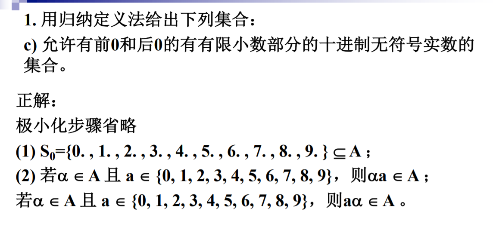
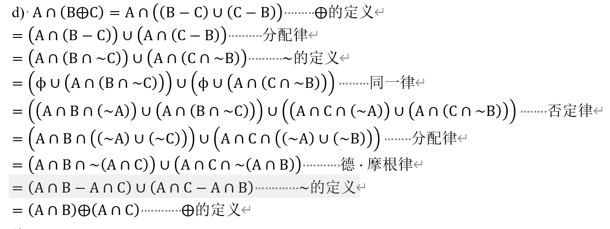
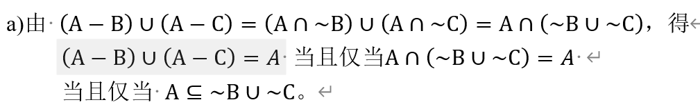

集合论是后面**关系，函数和图论**的基础，可以说充分体现了离散数学“元数学”的特性。

一个给定的元素是否属于某一个集合，这是集合论中的一个基本问题。元素与集合之间这种**属于关系**（成员关系），是集合中的一个基本关系。

这篇博文介绍了一种做题方法，可以说在某些意义上，更加逼近了集合论的本质。我十分满意。

<!-- more-->

## 一、集合的归纳构造

集合构造的很多方法都是高中接触过的，所以只在这里介绍**归纳构造**这一种方法，而且是以**字符串集合**来介绍的。

### 1.1 归纳定义组成

基础语句：规定了集合的生成元，即指明集合中存在的某些客体。它具有两重作用：说明集合是非空的；规定构造集合的原子元素。

归纳语句：规定了集合的生成算法，由一组规则组成，说明由已知元素构成集合中新元素的规则。

极限语句：限定了集合的范围，除非有限次应用基础语句和归纳语句而得到的元素，其他任何客体都不是集合中元素。

### 1.2 字符串集合相关定义

$\Sigma$ （是大写的 $\sigma$）是一个有穷非空集合，其中的元素称为**符号**或者**字母**，$\Sigma$ 被称为**字母表**。

**在 $\Sigma$ 上的字或串（两个名字，说的是一个对象）**是一个有限长的字符串，其中每个字符都是 $\Sigma$ 上的元素。

设 $x$ 是字母表上的串，$x$ 含有的的字符的个数称为 $x$ 的长度。

若一个字符串长度为 0，则称之为**空串**或者**零串**，表示为 $\varepsilon$ 。

在字符串上的基本运算是**连接运算**，以此衍生出**前缀后缀**的概念。

### 1.3 字符串集合的归纳定义

构造字符串集合 $\Sigma^\ast$ ：

基础语句：$\varepsilon \in \Sigma^\ast$

归纳语句：若 $x\in \Sigma^\ast,\space a\in\Sigma$ ，则 $xa\in \Sigma^\ast$ 

 极限语句：集合 $\Sigma^\ast$ 只含有由上两条语句构建出来的元素

这里主要是强调，字符串集合的归纳规则是很**简单**的，在出集合的归纳定义的题目的时候，**原子元素**的选择和生成算法都是很难很难的点。

有了字符串集合的定义，我们有了新的定义**语言**，即：设 $\Sigma$ 是一个有限字母表，一个在 $\Sigma$ 上的语言是 $\Sigma^\ast$ 的一个子集。

### 1.4 其他题目

这里介绍一个题目，这个题目最大的难点就是认识到 “1.” 是合法的，就是 1，解法如下

---

## 二、集合的运算

### 2.1 集合的本质

虽然在这一章中会涉及很多公式，答案也会有很多天外飞仙的构造式证明。但是我认为，切不可被这些表象蒙蔽了双眼，盲目追逐答案的奇技淫巧，甚至背诵公式以至于背诵答案。

那么到底什么是集合的本质呢？一个给定的元素是否属于某一个集合，这是集合论中的一个基本问题。元素与集合之间这种**属于关系**（成员关系），是集合中的一个基本关系。那么这个到底怎么应用呢，我觉得可以落实到集合的**抽象定义法**中
$$
A = \{x\mid P(x)\}
$$
可以看到，判断**属于关系**变成了**判断一个谓词逻辑的真值**了。那么所谓的集合的运算式什么呢？举个例子
$$
A \cap B = \{x\mid P(x)\wedge Q(x)\}
$$
首先我们应该有一个明确的意识，就是“集合的运算”的运算对象不是集合，而是元素，产生的新集合的元素发生了改变，这才是最本质的东西，如果一味的以为集合就是最底层，就会陷入各种复杂的公式中（理论上讲，这些公式是写不完的）。

其次就是，我们发现，集合的运算可以抽象成**属于关系的运算**，进而变成**谓词逻辑的运算**，换句话说，我们可以建立一个映射关系，有
$$
A\cap B \rightarrow P(x)\wedge Q(x)
$$

### 2.2 方法的核心

上面讲的还是很符合数学的严谨性的，但是作为个人发明的方法，就会有一些不严谨的地方，我也不打算严谨化了。

其实这种方法可以看做是一种退化版的**集合特征函数**的应用。

这里讲的方法是将一个集合运算与一个命题逻辑表达式映射（原理应该是元素选取的随机性），比如说
$$
A\cap B \cap C \rightarrow a\wedge b \wedge c,\quad \sim A \cup C \rightarrow \bar{a}\vee c
$$
我们去做恒等式的证明的时候，其实就是做命题逻辑的化为**主析取范式**（因为我比较习惯，主合取范式也行），因为主析取范式是唯一的，所以从恒等式两端开始的化简，最后会化成同一个式子。这种思路会大大简化做题难度，比如说这道题：

**同一律**就是一种构造手段，一般人是想不出来的，但是如果按照我的方法：
$$
A\cap(B\oplus C) \rightarrow a(b\oplus c) = a((b-c)+(c-b)) = ab\bar c +a\bar bc
$$

$$
(A\cap B)\oplus(A \cap C) \rightarrow (ab - ac)+(ac - ab) = ab(\bar a +\bar c) + ac(\bar a + \bar b) = 
ab\bar c +a\bar bc
$$

可以看到，很轻松的就解决了这道题。如果说的在细致一些，某个特定的集合，也可以与一组二进制码（或者真值建立映射），比如说
$$
A\cap(B\oplus C) \rightarrow \{110,101\}
$$
这个方法可以看做是一种**枚举方法**。真正实操的时候，不需要引入命题逻辑符号，只需要用集合论的符号体系即可，即：
$$
A\cap(B\oplus C) = (A\cap B\cap \sim C) \cup (A\cap \sim B\cap C)
$$

### 2.3 方法的完善

在方法核心里，我们只是完成了集合运算的映射，但是对于**集合的包含关系**，并没有翻译全，这里补上，有
$$
A\subseteq B\Longleftrightarrow A -B = \emptyset
$$
对于相等关系，我们也有
$$
A = B \Longleftrightarrow (A-B)\cup(B-A) = A\oplus B = \emptyset
$$
有了这两个，我们就可以处理另一类题目了，就是**补条件使恒等式成立**，如

给出充要条件，使 $(A - B)\cup(A-C) = A$

可以看出，答案给出的方法十分难懂，但是如果把两侧都画出来，就会发现有
$$
(A - B)\cup(A-C) \rightarrow \{100,101,110\},\quad A\rightarrow\{100,101,110,111\}
$$
可以看到，A多了111一项，那么就让这项对应的集合为空集就好了，即
$$
A\cap B\cap C = \emptyset
$$
进行一个变形，有
$$
A\cap B\cap C = A - (\sim B \cup \sim C) = \emptyset \rightarrow A\subseteq (\sim B \cup \sim C)
$$

### 2.4 运算性质

虽然我们用了三个小节的篇幅介绍了“集合的运算要落实到元素上，并以此衍生出了一个好用的方法”。但是我还是希望在面对集合的运算的时候，能够像处理普通算数运算一样更加从容一些。我们普通的算数运算，比较好的性质时**交换律，结合律，分配律**三种。

经过一段时间的演算，我得出结论，$\cap,\cup,\oplus$ 是满足交换律和结合律的，而 $-$ 是不满足交换律和结合律的。

对于分配律，因为涉及到两个运算符，所以就不在这里讨论了。可以说，很多时候都是不满足的，最后会构造出一些似是似非的二级结论，这些二级结论的正确性肯定没有问题，但是普适性就会差很多，所以不在此一一记录了。

---

## 三、集类

### 3.1 总论

所谓集类，又被称为集合的聚合，就是**以集合为元素**的一类特殊集合，我们之所以要提出这个概念，是因为其具有广泛的应用，比如说在**概率论**中，事件就是用集合表示的，而基本事件组成了一个集合，事件相当于**这个集合的子集**，也可以看做**这个集合幂集的元素**。我们当然更青睐以后一种看法，是因为我们集合论研究的不是集合与集合的关系，而是集合与元素的关系。

集类举例如下：
$$
A = \{\{1,2\},\{1,2,3\},\{1,4,5\}\} = \{A_1,A_2,A_3\}
$$

### 3.2 幂集

幂集是我们构造集类的一种方法，可以看做一种由普通集合到集类的映射。就挺简单的，就不多说了。

### 3.3 广义交并

广义交并是**定义在集类上的一元运算**。可以看做一种由集类到普通集合的映射。有如下例（用3.1举到的例子）：
$$
\bigcup A = A_1\cup A_2 \cup A_3 = \{1,2,3,4,5\}
$$

$$
\bigcap A = A_1\cap A_2 \cap A_3 = \{1\} 
$$

此外，还有一点需要注意，即公式
$$
\bigcup\emptyset = \bigcup\{\emptyset\} = \bigcap\{\emptyset\} = \emptyset
$$
这里面没有 $\bigcap \emptyset = \emptyset$ 是因为广义并不能运算空集，在定义的时候，运算空集会获得全集，显然是我们不期望的。

---

## 四、基数

### 4.1 概念

如果 $A$ 是一个集合，$n(A)$ 表示集合 $A$ 中元素的个数。

- 若 $n(A) = 0$ 那么称 $A$ 为空集
- 若 $n(A)$ 为自然数，则称 $A$ 为**有限集**
- 若 $n(A)$ 为无穷大，那么称 $A$ 为**无限集**

### 4.2 无限集的分类

我们对无限集还是可以进一步描述的，对于和自然数集 $N$ 等势的集合，我们叫做**可列集**。这样的集合有 $N,N\times N, N\times N \times \cdots,Q$。这样的基数被称为 $n(N)$ 为**阿列夫零**（我实在找不到那个像龙符咒一样的符号）。

还有一种与实数集等势的无限集，他们的基数被称为阿列夫，这个基数要比阿列夫零有大（直观理解上）。这样的集合有 $\wp(N) , R, R\times R,R\times R \cdots$ 。

### 4.3 无限集的判定

有以下三个条件等价：

- $A$ 为无限集。
- $A$ 有**可列子集**。
- $A$ 有与它自身等势的真子集。
