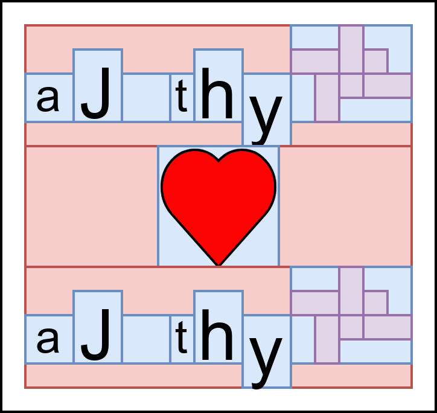
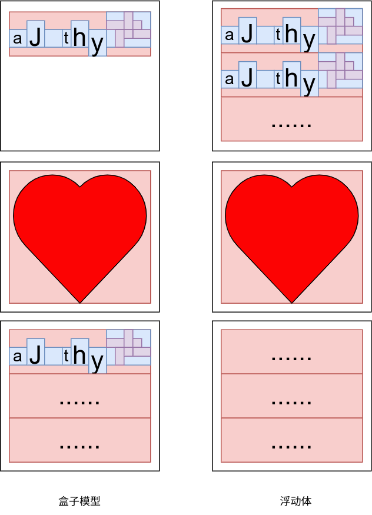

## 一、起始概念
### 1.1 排版

应当明确，排版问题并不会因为 LaTex “内容和格式分离”的设计宗旨而消失，实际上，LaTex 就是在解决“排版问题”，它就是一个排版工具，只不过在解决思路上采用了“内容和格式分离”的思想，让用户尽可能不被繁琐的排版细节所困扰。  

而当我们抛开 LaTex 的拐杖去直面排版问题时，会发现它比我们想象得都要复杂、繁琐和无聊。  

比如说常见的“断字与断行”问题，在不考虑断字的情况下，一个占据近一行宽度的字很容易造成这之前的一行较为稀疏，比如下面的这种情况，左侧为较为失败的断行算法，而右侧为较为成功的：  

      The quick brown fox jumps over          The  quick  brown  fox   jumps
    the lazy dog. The words here are        over  the  lazy  dog.  The words
    quite  short.  Aren't they?  But        here  are  quite  short.  Aren't
    long     ones      such       as        they?  But  long  ones  such  as
    perhydrocyclopentanophenanthrene        perhydrocyclopentanophenanthrene
    may appear.                             may appear.

而断字则要考虑能否将单词按照音节拆分，比如将 `computer` 拆分成 `com-puter` 就比拆成 `c-omputer` 要更为合理。

从这个角度看，排版是一个极其复杂的算法问题，具有很强的数学特性。

### 1.2 引擎
引擎指的是解决上面提到的排版问题的工具。

以上面提到的“断行问题”举例，有一种基于“不美观度（badness）”的衡量标准，空格伸缩量越大 badness 越大。每一种断行的方式都有一个总体的衡量标准，包括 badness 、断行、以及行与行之间的疏密差异等。算法可以枚举 $2^n$ 种情况来获得最小的 badness 值（在实际生产中用的是 $O(n^2)$ 的最短路径算法）。完成这整个算法的工具就被称为 **排版引擎** （当然排版引擎不止完成这一个事情）。

TeX 就是这样的一种工具（也就是引擎），它可以解决许多诸如“断行和断字问题”的排版问题。

### 1.3 实现
这里需要再次拓展 TeX 的概念，TeX 在上文中被描述成了一种“引擎：解决排版问题的工具”，而实际上，TeX 的抽象层次要比引擎更高一些，它也可以被理解为一种 DSL （似乎也可以是通用语言，我听过用 TeX 搭建 OS 的传闻），TeX 这种语言描述了排版的目的，而引擎则是实现这些目的的工具。如果用 C 语言做类比，TeX 可以理解为“C 语言 + 编译器”的复合体。

那么就会引出一个自然的现象，也就是同一种语言可以有 **不同** 的编译器，就像 C 语言可以有 gcc, clang, msvc 等多种编译器，同样的，TeX 作为一门语言，也可以有多种引擎实现。

TeX 的发明人高纳德在实现 TeX 的时候，采用了一种它自己发明的语言——WEB ，这是一种文学编程语言，可以导出 Pascal 代码，也就说，最初版的 TeX 语言是用 Pascal 语言实现的。

后来正统的 TeX 又通过 WEB2C 这个工具将原本的 WEB 语言实现翻译成了 C 语言实现。但是似乎大家并不会用这个版本的 TeX ，这是因为高爷爷坚持只有自己可以修改 TeX ，所以有些用户需求无法满足，所有后来又来了两个大牛重写了 TeX ，这种 TeX 被称为 eTeX 后续著名的 pdfTeX 或者 XeTeX 都是基于 eTeX 完成的开发。它们同样是遵循 TeX 语言规范实现的排版引擎。

pdfTeX 的最大特点是会直接生成 PDF 文件，而传统的 TeX 则是会 DVI 文件（一种原生的，适合排版的文件格式），所以 pdfTeX 在 PDF 生成方面会更加有优势。

XeTeX 是一种使用 Unicode 的 TeX 排版引擎，同时并支持一些现代字体技术，例如 OpenType、Graphite 和 Apple Advanced Typography（AAT）。也就说，对于中文的支持会好很多。

LuaTeX 是作为带有 Lua 脚本引擎嵌入的 pdfTeX 版本发起的基于 TeX 的电脑排版系统。经过一段时间的开发后被pdfTeX 小组采纳作为 pdfTeX 的继任者。我看评论说似乎这个工具较为“新”，所以算是有利有弊。


### 1.4 宏

TeX 这门语言有一个被叫做“控制序列（control sequence)”的组成部分，可以看成由 2 个部分组成：元语（primitive）和宏（macro），元语负责排版引擎工作，宏则负责组织元语。关于这门语言，我并没有深入的研究，我浅浅看上去像是一种 **函数式** 编程语言。  

TeX 的宏定义如下所示：  

```latex
\def <control sequence> <parameter text>{<balanced text>}
```

定义宏的例子：  

```latex
\def\hello#1#2{Hello, #1, #2}
```

调用宏的例子：  

```latex
\hello{bar}{foo} % output:Hello, bar, foo
```

可以看到使用 `\def` 可以定义新的宏，拓展 TeX 。我觉得这个功能依然是局限在文本替换的层面。  

关于宏的形参，它用 `#n` 描述第 n 个参数，它可以看作是一个像 C 语言中 `scanf` 中的格式字符串类似的感觉，它并不是一个普通的 `#1#2#3..` 这样的序列，它还可以更加复杂，比如说 `#1.#2` ，它就可以接受一个形如 `45.2` 的参数，也就是说形参中间的那个小数点 `.` 发挥了匹配的作用。  

而宏的实参在传递的时候，可以如上面举例一样，对于 `#1.#2` 传递 `45.2` 并让 `#1` 对应 `45` ， `#2` 对应 `2` ，但是如果面对 `4.52` 这样的数，它则会让 `#1` 对应 `4` 而 `#2` 对应 `5` ，也就是采用一种非贪心的参数匹配策略，所以如果希望 `4.52` 被正确传入，应当增加 `{}` 来表示区分，比如说 `4.{52}` 或者 `{4}.{52}` 。  

`balance text` 类似于 C 语言中 `printf` 的格式化字符串，可以使用形参中的 `#n` 拼接字符串，上面的例子比较清楚了，需要注意需要用 `{}` 包裹 `balance text` 。

### 1.5 格式

在宏这一节谈到，利用宏可以拓展 TeX 的控制序列，其本质是扩展了 TeX 这门语言。而 LaTeX 利用 TeX 的控制序列，定义了许多新的控制序列并封装成一个可执行文件。这个可执行文件会去解释 LaTeX 新定义的命令成为 TeX 的控制序列，并最终交由 TeX 引擎进行排版。

这种通过预定义一系列宏，来实现一种 TeX 编写模式和规范的成果被称为 **格式（format）** 。格式的出现并非偶然，因为 TeX 需要控制排版引擎，“友好程度”注定不会很高，而 LaTeX 即使用户没有排版和程序设计的知识也可以充分发挥由 TeX 所提供的强大功能，不必一一亲自去设计或校对，是更加用户友好的产品。从这个角度看，TeX 更像是“汇编语言”，而 LaTeX 更像是“高级语言”。

LaTeX 这种“高级语言”更加流行的原因是因为它屏蔽了几乎全部的的排版细节，使得只需要拿到预制的 LaTeX 文档类和宏包，输入内容并编译就可以获得一个排版好的 PDF 文件，如果这么看的话，其实是没有必要了解 LaTeX 知识的，因为反正最后都是做 PPT 一样，只是套模板。  

格式不止有 LaTeX 一种：高老爷子自己用的 plainTeX ；还有一种 ConTeXt 与 LaTeX 对应，LaTeX 屏蔽了 TeX 的印刷细节，而 ConTeXt 则采用了一种补充的方法，提供了处理印刷细节的友好接口。

### 1.6 宏包和驱动
除了格式这种“改天换地”的东西外，还存在其他用宏制作的控制序列集合，他们被称为宏包，他们同样可以增强 TeX 或者 LaTex 的功能，类似于“函数库”。  

在LaTeX编译成文档时，还可能会用到一些必要的驱动软件，如将 dvi 文件转化为 pdf 文件的软件。如 dvipdf，dvipdfm，dvipdfmx ，xdvipdfmx 等。  

### 1.7 发行版
所谓的发行版指的就是将上面的引擎，格式，宏包，宏包管理器，驱动甚至编辑器打包到一起，整理出的一个“软件集合体”，比如说著名的 TeXLive 。  

我之前经常担心引用的宏包没有安装，而实际上 TeXLive 安装了大部分常用的宏包，对于没有安装的宏包，TeXLive 也提供了宏包管理器方便安装和其他管理手段，如下所示：  

```bash
tlmgr install <package-name>
tlmgr remove <package-name>
tlmgr info <package-name>
tlmgr update --all --self
```

---


## 二、语法元素

### 2.1 综述

正如 TeX 的命令分为元语和宏， LaTeX 也有自己的功能组件，分别是 **命令和环境** 。之所以比 TeX 单一的控制序列要多一种，这可能是因为这样 LaTeX 内容和格式分离的特征会更加明显。此外代码也会呈现方便的组织形式，比如说 **宏包和文档类** 。  

正如 TeX 依靠宏来拓展功能， LaTeX 也有自己的拓展功能，即自定义和重定义命令和环境。  

### 2.2 命令

#### 2.2.1 格式

LaTeX 中的命令类似于 TeX 中的控制序列，其格式要求为：  

-   以反斜线 `\` 开头，并跟随一串 **大小写敏感** 的字母（不包括数字、标点和空格）
-   以反斜线 `\` 开头，并跟随单个的非字母字符，比如说 `\\, \$`

LaTex 命令后会忽略其后的所有连续空格，如果需要认为引入空格，需要在命令后面加入 `{}` 来阻止其忽略空格。比如说 `\LaTex{} user` 中的 `latex` 和 `user` 之间的空格会被保留。  

此外这些命令后面可能会跟随一些参数，关于参数的具体格式在下一节介绍。  

#### 2.2.2 参数

LaTeX 的命令后可以跟随参数，一共有 3 种形式：  

-   `{}`: 表示一个必选（mandatory）参数，也就是只要使用某个命令，就必须填写它的必选参数
-   `[]`: 表示一个可选（optional）参数，也就是使用某个命令，可以填写或者不填写这个参数
-   `*`: 表示一个布尔可选参数，也就是说，使用一个 `*` 的本质等价于传入一个具有布尔值的可选参数。

有如下示例：  

```latex
\section[<short title>]{<title>}
\section*{<title>}
```

对于第 1 条命令， `<short title>` 是一个可选参数，而 `<title>` 是一个必须参数。对于第 2 条命令， `*` 是一个特殊的布尔可选参数， `\section` 在接受这个参数后，会生成不带标号的标题，相当于通过这个 `*` 参数调整了原本 `\section` 的行为。  

#### 2.2.3 自定义

LaTex 提供了自定义命令的命令，即 `\newcommand` ，其形式如下  

```latex
\newcommand<name>[<num>][<first parameter default value>]{<defination>}
```

具体的例子如下：  

```latex
\newcommand{\hello}[2][LaTex]{Hello, #1 and #2!}
\hello[AJ]{world} % Hello, AJ and world!
\hello{world}     % Hello, LaTeX and world!
```

当我们定义 `\hello` 命令时，指定它有 `2` 个参数，同时首个参数的默认值是 `LaTeX` ，在后面的定义中用 `#1, #2` 指代了传入的参数。  

在第 1 次调用的时候，我传入了 `AJ` 这个可选参数，这个参数覆盖了原来的首参默认值 `LaTeX` ，同时传入了 `world` 这个必选参数。而在第 2 次调用的时候，并没有传入可选参数，所以就使用了默认参数 `LaTeX` 。  

默认值这里强调必须是 **第一个参数** 。这点很有趣，其他参数不能具有默认值，似乎会造成语义的缺失，但是实际上如果将参数想象成一个链表，首参默认值就是对于当前节点的处理，如果希望处理后续节点，那么可以使用递归思想，也就是新定义一个命令。只不过这种形式依然受限。  

如果只有首参有默认值，那么命令调用的时候可选参数一定在首位（因为参数传递要按照顺序），但是实际上依然会有 `{}[]` 这样调用的存在，这是因为存在 `xparse` 宏包，它可以定义带有多个可选参数、或者带星号的命令。  

#### 2.2.4 重定义

LaTeX 不允许使用 `\newcommand` 定义一个与现有命令重名的命令。如果需要修改命令定义的话,使用 `\renewcommand` 命令。它使用与命令 `\newcommand` 相同的语法。  

在某些情况之下，使用 `\providecommand` 命令是一种比较理想的方案，在命令未定义时,它相当于 `\newcommand` ；在命令已定义时，沿用已有的定义。  

### 2.3 环境

#### 2.3.1 格式

环境常常用于令一些效果在局部生效,或是生成特殊的文档元素。其结构如下：  

```latex
\begin{<environment name>}[<optional arguments>]{<mandatory arguments>}
  % ...
\end{<environment name>}
```

#### 2.3.2 自定义

新定义一个环境的命令如下所示：  

```latex
\newenvironment{king}
{\rule{1ex}{1ex}\hspace{\stretch{1}}}
{\hspace{\stretch{1}}\rule{1ex}{1ex}}
```

### 2.4 宏包

在使用 LaTeX 时，时常需要依赖一些扩展来增强或补充 LaTeX 的功能，比如排版复杂的表格、插入图片、增加颜色甚至超链接等等。这些扩展称为宏包。调用宏包的命令如下：  

```latex
\usepackage[<options>]{<package-name>}  
```

如果希望查阅某个宏包的文档，可以使用  

```latex
\usepackage[<options>]{<package-name>}
```

宏包文件以 `.sty` 结尾，宏包名就是宏包文件名。  

### 2.5 文档类

文档类规定了 LaTeX 源代码所要生成的文档的性质——普通文章、书籍、演示文稿、个人简历等等。LaTeX 源代码的开头须用 `\documentclass` 指定文档类:  

```latex
\documentclass[<options>]{<class-name>}
```

其中 `<class-name>` 为文档类的名称，如 LaTeX 提供的 article、report、book ，在其基础上派生的一些文档类,如支持中文排版的 ctexart、ctexrep、ctexbook ，或者有其它功能的一些文档类,如 moderncv、beamer 等。  

<table border="2" cellspacing="0" cellpadding="6" rules="groups" frame="hsides">
    <colgroup>
<col  class="org-left" />
        <col  class="org-left" />
</colgroup>
<thead>
<tr>
<th scope="col" class="org-left">名称</th>
<th scope="col" class="org-left">作用</th>
</tr>
</thead>
    <tbody>
<tr>
<td class="org-left">article</td>
<td class="org-left">文章格式的文档类，广泛用于科技论文、报告、说明文档等。</td>
</tr>
        <tr>
<td class="org-left">report</td>
<td class="org-left">长篇报告格式的文档类，具有章节结构，用于综述、长篇论文、简单的书籍等。</td>
</tr>
        <tr>
<td class="org-left">book</td>
<td class="org-left">书籍文档类,包含章节结构和前言、正文、后记等结构。</td>
</tr>
        <tr>
<td class="org-left">proc</td>
<td class="org-left">基于 article 文档类的一个简单的学术文档模板。</td>
</tr>
        <tr>
<td class="org-left">slides</td>
<td class="org-left">幻灯格式的文档类,使用无衬线字体。</td>
</tr>
        <tr>
<td class="org-left">minimal</td>
<td class="org-left">一个极其精简的文档类,只设定了纸张大小和基本字号。</td>
</tr>
        </tbody>
</table>

可选参数 `<options>` 为文档类指定选项，以全局地规定一些排版的参数，如字号，纸张大小，单双面等等。比如调用 article 文档类排版文章，指定纸张为 A4 大小，基本字号为 11pt ，双面：  

```latex
\documentclass[11pt,twoside,a4paper]{article}
```

---


## 三、排版算法

### 3.1 综述

这里会介绍一些 TeX 底层的排版算法逻辑，但是应该不会介绍具体的算法流程，其主旨是通过了解底层排版逻辑，来更好的对已有的排版结果进行细微的调整或者释然。  

### 3.2 空白符

因为 LaTeX 是一款排版软件，所以它并不能像 C 这样的编程语言忽视空白符。  

对于 LaTeX 而言，一到多个空白符都会在最后的结果中被编译成一个空白符，也就是如下所示：  

```latex
hello world\\
hello            world
```

这二者的效果是一样的。  

### 3.3 盒子模型

这里似乎介绍的是一种排版算法，当我们去将内容元素安放到固定的页面时，总是需要遵循一定的逻辑。“盒子模型”就是这样的一种逻辑。  

盒子能和最基础的书写逻辑相容，是一种非常普遍的逻辑。所以它不仅出现在 LaTeX 中，同样出现在 CSS 的布局设计中。  

按照我的理解，盒子逻辑是这样的，它将每个页面元素都视为一个“盒子”，每个盒子都有可能称为一个“母盒子”，每个“母盒子”里考虑 **行和列** 两个维度，“子盒子们”先按照行从左到右排列，排列成一行行的“盒子行”，然后这些盒子行在从上到下排列，组成一个比较“四四方方”的内容填充物。如图所示：  



也就是说，我们会按照 LaTeX 源码的书写顺序一个个摆放“盒子”。对于进行行排列，行的宽度就是所有在同一行的元素的宽度的加和，行的高度就是同一行的元素的最高高度（其实是最大高度和深度）。对于进行列排列，“母盒子”的高度就是母盒子内所有行的高度的加和，母盒子的宽度就是所有行的最大宽度。  

需要注意，盒子是可以嵌套的，比如说上图中右上角就嵌套了一个里面有紫色小盒子的蓝色母盒子。  

盒子模型的优点就是十分易于理解而且好控制，简直就像“串行模型”一样，其他排版算法只能作为盒子模型的补充。但是盒子模型有一些缺点，比如说他们没有“等分”或者“居中”的概念（虽然上面那个示意图的心型居中了），这是因为盒子模型的方向性过于明显，更不要说其他的复杂布局了（CSS 大部分的概念都是为了弥补此处的缺失）。此外，对于过大的图像或者表格，盒子模型也会非常乏力，比如说如果上面的心形过大，就会导致纸张排不下前两行，心形独占一张纸，同时在第一张纸留下大量空白。如下所示：  



这个问题可以用下面介绍的“浮动体”来解决。  

### 3.4 浮动体

#### 3.4.1 格式

正如前所述，表格和图片有可能所生成的“盒子”过大（与之形成鲜明对比的是一个个字母，基本上都是差不多大小），所以会导致不合理的分页或者大块的空白。 LaTeX 解决这个问题的方案是提出“浮动体”。  

LaTeX 预定义了两类浮动体环境 `figure` 和 `table` 。习惯上 `figure` 里放图片， `table` 里放表格,但并没有严格限制,可以在任何一个浮动体里放置文字、公式、表格、图片等等任意内容。  

以 `table` 环境的用法举例， `figure` 同理:  

```latex
\begin{table<*>}[<placement>]
  % ...
\end{table}
```

`<placement>` 参数提供了一些符号用来表示浮动体允许排版的位置（也就是浮动体会出现在一个页面的哪些位置），如下表所示（默认是 `tbp` ，也就是一个浮动体可以出现在页面的顶部，底部和单独成页）：  

| 位置参数   | 含义                                                       |
| ---------- | ---------------------------------------------------------- |
| h(here)    | 当前位置(代码所处的上下文)                                 |
| t(top)     | 顶部                                                       |
| b(bottom)  | 底部                                                       |
| p(page=13) | 单独成页                                                   |
| !          | 辅助参数，表示考虑位置的时候不需要考虑浮动体算法的诸多限制 |

`*` 的作用是在多栏排版中的，这种特殊浮动体是 **跨栏位** 的,而且它们的 `h` 选项会失效,也就是不会出现在当前页。  

```latex
\begin{figure*}[tbp]
  % ...
\end{figure*}
\begin{table*}[tbp]
  % ...
\end{table*}
```

需要注意，浮动体相对于传统的盒子模型，我们没有办法简单判断出浮动体的位置（不过我们可以加一些位置限制），所以在文中引述它们时，我们无法用“上图”、“下表”之类的相对位置（因为他们不一定在哪里）来引述他们。于是，我们需要对它们进行编号，方便在文中引用。  

我们用 `\caption` 完成这个功能，它需要在源码中图片或者表格的定义之后，如下所示：  

```latex
\begin{table}
  \centering
  \begin{tabular}{|c|c|}
    \hline
    列 1 & 列 2 \\
    \hline
    内容 1 & 内容 2 \\
    \hline
  \end{tabular}    
  \caption{这是一个表格的标题}
\end{table}
```

在文本中可以用 `\label{tab:这是一个表格的标题}` 来进行引用。  

#### 3.4.2 算法

本节的大部分内容都参考自[这篇博客](https://ask.latexstudio.net/ask/article/644.html) 。  

浮动算法的本质是相比于盒子模型，用户让渡一些权力给排版引擎（用户没法用盒子模型控制图片的位置了），让排版引擎排版出更加美观的页面。所以作为一种机器算法，它要模拟人的审美来进行排版决策，方法就是增加一些上文提到的 **限制** 。  

限制包括浮动体个数(除单独成页外，默认每页不超过 3 个浮动体，其中顶部不超过 2 个，底部不超过 1 个)以及浮动体空间占页面的百分比(默认顶部不超过 70% ，底部不超过 30%) 。除了限制外，我们在创建浮动环境时利用 **位置参数** 给浮动体提了进一步的要求。  

可以想见这是一个“全局优化算法”，但是实际上如果考虑全局的观感，那么计算量过大，所以在实践上， LaTeX 采用了一种“贪心免回溯算法”，大致如下：  

-   如果遇到浮动对象，LaTeX 会根据位置参数和限制尝试立即将其放置。
-   如果放置成功，则浮动对象就会被放置，并且该决策永远不会改变。
-   如果放置不成功，则 LaTeX 会将浮动对象放入一个暂存队列中，在下一个页面开始时重新考虑。
-   页面完成后，LaTeX 将检查此暂存队列并尽可能清空它。为此，它将首先尝试生成尽可能多的浮动页。一旦浮动页指标耗尽（一页上面全是图和表不好看），它将尝试将其余的浮动对象放置在顶部和底部区域。如果放置不成功，则将失败的对象重新插入暂存队列。
-   在此之后，它开始按照盒子模型处理文档的其他元素。在处理过程中，它可能会遇到进一步的浮动对象。
-   如果到达文档的结尾或者遇到 `\clearpage` 命令，LaTeX 就会开始新的一页，并放松所有限制性浮动体的条件，将所有在等待队列中的浮动体输出到浮动页上。

这种算法会导致如下效果（并不一定能由上文的简化版算法推导）：  

-   一个浮动体不可能在文档中比它在源代码中的位置更早地出现。
-   双栏浮动体总是被首先延迟处理（维持了两个队列，有优先问题）。
-   双栏浮动环境没有底部浮动区域。
-   “Here” 的意思是“在这里放置，如果合适的话”（希望强制可以使用 `H` 参数）。
-   所有的浮动体参数（通常）限制了浮动体可以放置的位置。
-   浮动位置参数并不定义偏好顺序（也就是 `tb` 等价于 `bt` 没法通过更改顺序选择位置偏好）。
