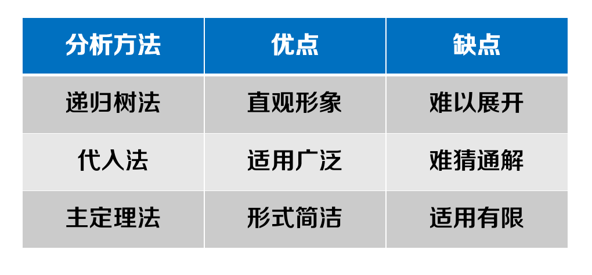
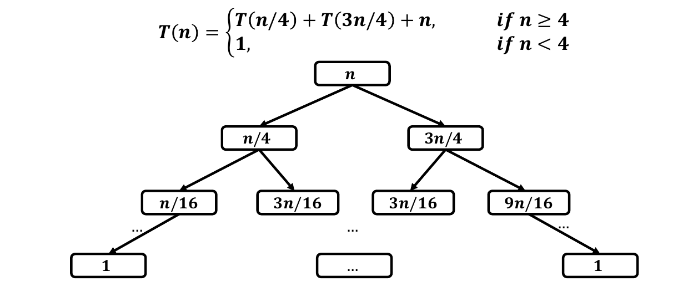
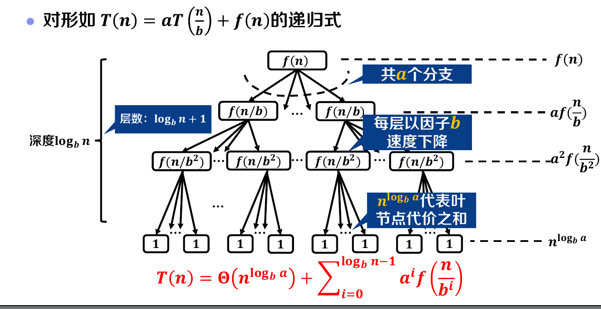
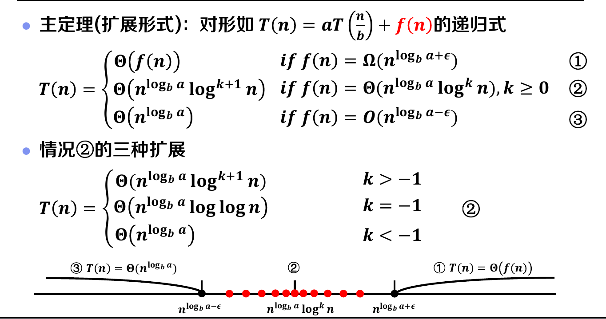
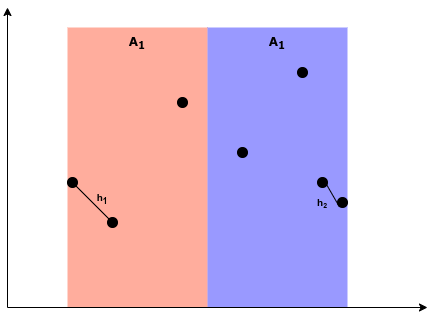
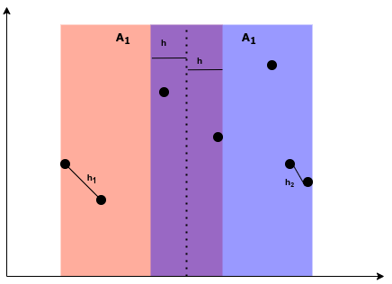
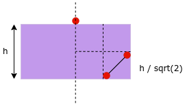

## 一、时间复杂度的估计

### 1.1 三种方法

估算分治问题的时间复杂度一共有三种普遍的方法：

### 1.2 代入法

代入法需要结合**第二数学归纳法**使用，使用起来还是很简单的（难点在于猜测），比如估算
$$
T(n) = T(\frac{n}{4}) + T(\frac{3n}{4}) + n \qquad (n > 4) \\
T(n) = 1	\qquad (n \leq 4)
$$
可以猜测其上界为 $ O(n\log n) $ 。那么需要检验一下基准情况，对于常数 $c$ ，有
$$
1 < cn\log n
$$
然后进行归纳假设，设当 $k < n$ 时，有 $T(k) < c k \log k$ 。对于 $n$ 有
$$
T(n) = T(\frac{n}{4}) + T(\frac{3n}{4}) + n  \leq c \frac{n}{4} \log\frac{n}{4} + c \frac{3n}{4} \log\frac{3n}{4} + n = n \log n - (1 - \frac{c}{4} log\frac{64}{27}) n
$$
可以看到，只要稍微控制一下 $c$ ，就可以使得 $T(n) \leq n \log n$ 。归纳成立。

### 1.3 树方法和主定理

这两者本质是一种方法，其实都是通过计算一个树形结构来获得复杂度，这是因为分治问题本身就是一个树问题。这棵树大致如下

其中非叶子节点记录的是合并的代价（也就是非递归部分的复杂度），而前面的分治则决定了树的结构（一般我们需要的信息是树的高度）。叶子节点记录了基准情况。我们计算的复杂度就是把这棵树所有节点加起来。

主定理是这样的一棵树，它的子树是相同的，不会像上面一样出现不同高度的子树（同一层子树）。这无疑限制了求解的范围。但是给出了统一的数学思路，也就是

可以看到复杂度由两部分构成，第一部分是叶子节点的代价，第二部分是非叶子节点的代价。问题的难点是对于第二部分的处理。

其实第二部分中，如果 $f(n)$ 是一个幂函数，那么求和就是一个等比数列的求和，是很容易计算的，困难的是非幂函数的情况，我们和树方法一样，都需要面临一个不确定能不能的求和问题。

我们将比较容易求和的部分总结了一下，形成了主定理：

---

## 二、平面最近点对

### 2.1 题目描述

在第一象限有 $n$ 个点对（其实利用平移坐标轴，这个很容易扩展到四象限），求其中距离最近的两个点对。

### 2.2 分治算法

这道题如果暴力求解，是 $O(n^2)$ 的复杂度，所以如果有巧妙办法（必然有，不然我就不写了），那么应该是更小的时间复杂度。所以我们考虑用分治算法。

从需求出发，我们按照 $x$ 坐标将点分为两组，一半的 $x$ 比较大，另一半比较小。假设我们已经获得了这两个部分的结果，也就是我们知道 $A_1, A_2$ 的解是 $h_1, h_2$ ，那么考虑如何依靠他们来获得最终的答案（即归并过程）。

我们说，最终的结果只可能为 $h_1, h_2$ ，或者是 $A_1, A_2$ 交界处分居两个子区域的点，现在考虑交界处的点。应当意识到，交界处不会太大，这是因为当其宽度超过 $2h$ 的时候（其中有 $h = min(h_1, h_2)$）。多出来的点必然不会是距离最小的点，因为平行线间垂线段最短。所以我们就将分界曲的范围现在在了宽度为 $2h$ 即如图所示

那么这样的分界区需要考虑的点是多少，由主定理可知 $T(n) = 2T(\frac{n}{2}) + f(n)$ 。如果 $f(n)$ 为 $\Omega(n^2)$，那么优化就失败了。而第一反应其实就是 $\Omega(n^2)$。因为我们要枚举分界区的点，分界区的点的个数是 $O(n)$ 。两两枚举就会导致 $\Omega(n^2)$。

但是我们证明这种情况不会发生，如图所示:

我们知道对于中上方的点，需要考虑的点就在下方的紫色区域（我们每次只考虑下方的点），会发现两个点不能在一个小格子里，这是因为如果真的存在，那么这两个点的距离小于 $\frac{h}{\sqrt2}$ ，显然也小于 $h$ 。然后就会发现了错误，这是因为图中的点属于 $A_2$ 区，所以他们的距离一定大于等于 $h$ 。也就是说，每个格子最多一个点，所以八个格子，最多 $8 - 1 = 7$ 个点（要去掉这个点）。

所以此时合并的复杂度就变成了 $O(n)$ 级别，所以根据主定理就可以快乐得出 $O(n\log n)$。
