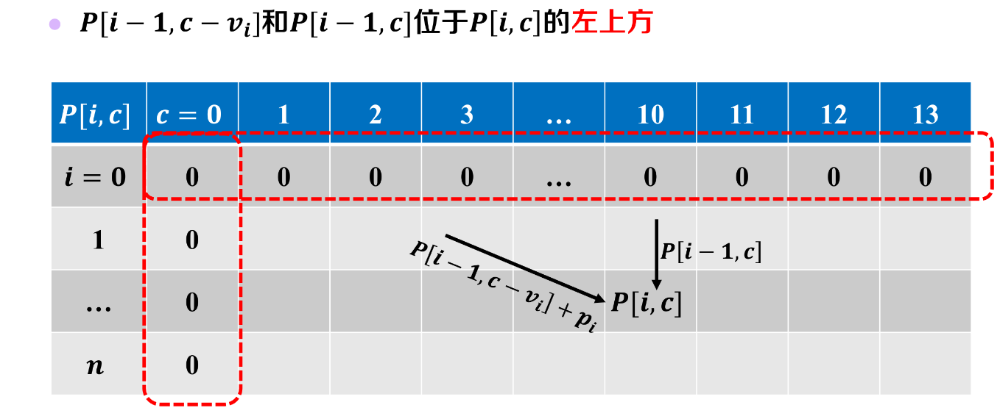
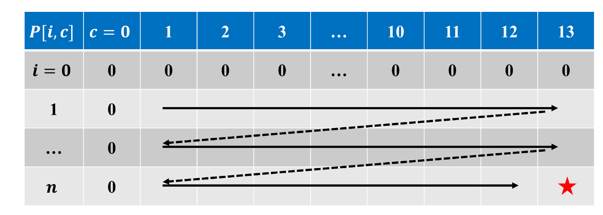
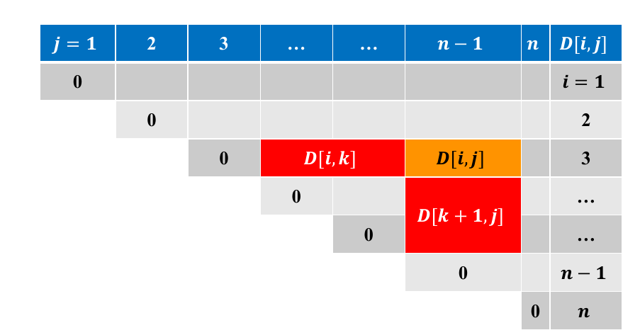
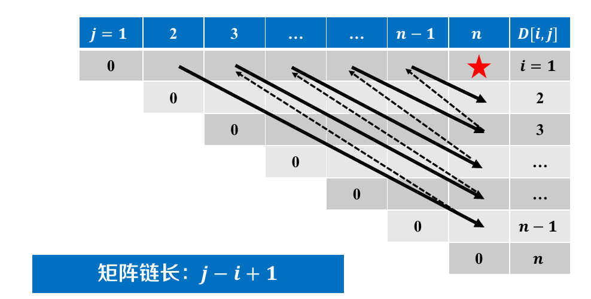
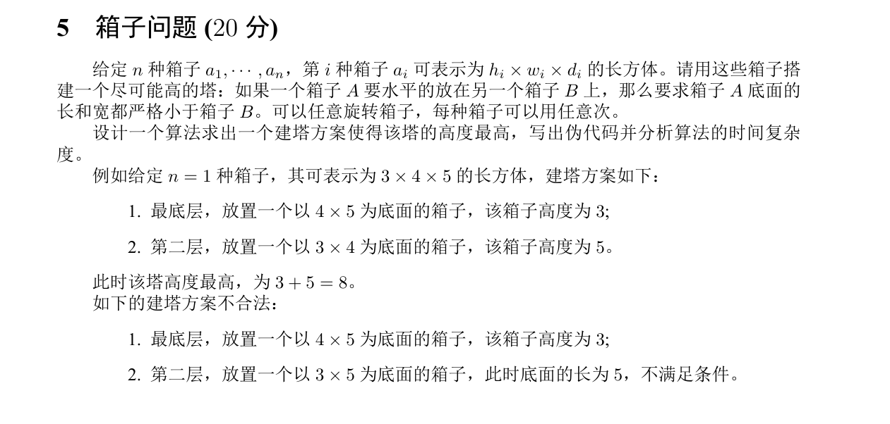
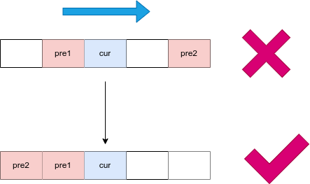

## 一、从分治到动态规划

### 1.1 动态规划的性质

动态规划具有以下三个明显特性：

- **无后效性**：如果给定某一阶段的状态，则在这一阶段以后过程的发展不受这阶段以前各段状态的影响。如果说的直白一些，就是当我们求出 $dp_i$ 的时候，我们是怎样求出来的，就不用管了，我们只需要利用 $dp_i$ 就可以了。类似于“只要上了北航，没人管你到底是从河北考上的的，还是从月球考上的，大家只认为你是一个北航学生。”
- **最优子结构**：规模大的最优化问题包含规模小的最优化问题，大问题的**最优解**可以由小问题的**最优解**推出。
- **重叠子问题**：子问题的解不止会被利用一次。

虽然这三个特性都被称为“动态规划”的特性，但是“无后效性”和“最优子结构”并非是动态规划的专利。对于“无后效性”，应该是所有的分治算法都具有这个特性，如果我们必须掌握子问题的求解过程，那么显然我们就没必要将大问题分治为小问题。对于“最优子结构”，虽然“最优”二字将问题划定成了“最优化算法”的范畴，但是如果扩充最优化的定义，会发现依然几乎所有分治算法都满足具有最优子结构的定义。

所以从本质上来说，只有**重叠子问题**是动态规划的独有特性。并不是所有的分治算法都具有重叠子问题，比如说对于二叉树的遍历可以看做一个分治算法，但是对于每个子树的遍历，都没法用于其他的子树的遍历（勉强意思一下）。在《算法导论》中，有些问题是“树形”的，有些问题是“图形”的，动态规划适用的范围就是那种图形的最优化问题。

### 1.2 问题的难点

自底向上的动态规划的难点大概有两个：

- 确定具有无后效性的最优子结构。
- 分析重叠子问题的计算路径。

在 1.1 中已经阐述过了，第一个难点本质不是动态规划的难点，即使用分治算法，依然具有这个难点。而这个难点无疑是最难的，比如说我到现在依然不清楚，在背包问题中，明明是“平权”的物体，却要考虑“一个”和“前面多个”的关系，而不是“一个”和“其他的所有”的关系。现在看上去，“前面多个”就是一种最优子结构，而这却在我这里却并不自然。

关于如何确立最优子结构，只能说这是天才的领域，多亏了香子，才让我在对于这个问题的思考上更近了一步，但是依然没有办法将其转换成一个很容易的问题。

关于重叠子问题的计算路径，我们需要确定一个路径，去保证当一个最优化问题求解的时候，他求解依赖的最优化子问题已经被求解了。如果是“带备忘录的递归动态规划”，这个问题是不用考虑的，因为递归是自顶向下的过程中，是先“确立需求”，然后“实现需求”的过程，所以根本不需要在意计算顺序，它的计算路径是在递归的过程中自然确立的。但是对于纯正的“自底向下的迭代动态规划”，需要自行确定计算路径。这个部分我之前没有意识到，现在意识到了不同的子问题分割方式，会导致不同的计算路径，所以特意总结了一章。

这个部分是比较机械化的，大概只有几种类型。不过有意思的是，其实只要限制住了这个部分，其实最优子结构的形式也受到了一定的固化。所以只能有两个可能的推论：

- 确定最优子结构是可以更加机械化的。
- 机械化的计算路径就是一个笑话。

### 1.3 香子无后效性

虽然香子不承认，但是我确实是在与香子的交谈中获得了这部分的启发。以小跳蛙为例，在题目中出现的变量有“跳跃步数”和“所在石块”，这个问题的最优结构是 $dp[所在块数]$ ，与跳跃步数无关。我们做状态转移的时候，考虑的是**所在块数**这个变量，而不考虑跳跃步数。所以感觉这两个变量必然存在一定的区别。区别他们就是确定“最优子问题结构”的一个步骤。

如果一个变量会对状态转移造成影响（效用），那么它就不具有“香子无后效性”。对于没有“香子无后效性”的变量，那么就应当将其作为状态变量。（这一章都是显然的废话）。

----


## 二、计算路径

### 2.1 行列遍历

这是最为普通的方法，出现在 **0-1 背包问题， 编辑距离**等景点问题中，对于这种情况，其状态转移方程往往呈现
$$
dp_j \rightarrow dp_i \quad (j \leq i) \\
dp_{x, y} \rightarrow dp_{i, j} \quad (x \leq i, y \leq j)
$$
的特征，如果是二维状态，那么就是当前单元格只依赖与其左上角区域的单元格，如图所示：



那么其计算路径就是：



### 2.2 斜向遍历

经典例题就是**矩阵链乘法**，在题目中出现的**括号匹配问题**。其状态转移方程呈现
$$
(dp_{left, middle}, dp_{middle + 1, right}) \rightarrow dp_{left, right} \quad (left \leq middle < right)
$$
其填表的结构更加典型，只有上三角，而且基准情况出现在对角线。



其顺序是斜向填写，即



而在实际实现的时候，需要先对与长度进行遍历（比较显然，就是只有先确定了长度比较小的子问题，然后才可以确定长度比较大的子问题），也就是**长度即规模**的思想。

代码如下（括号匹配）

```cpp
#include <bits/stdc++.h>

using namespace std;

const int N = 100;

// ([(])])
// ([(])]))
string s;
int d[N][N];

int main()
{
    cin >> s;
    int n = s.length();
    cout << "str len = " << n << endl;

    // 初始化基准情况
    for (int i = 0; i < n; i++)
    {
        d[i][i] = 0;
    }

    // 从小到达遍历长度
    for (int len = 2; len <= n; len++)
    {
        cout << "len = " << len << endl;

        // 遍历左侧端点
        for (int left = 0; left < n - len + 1; left++)
        {
            // 根据左侧端点和长度确定右侧端点
            int right = left + len - 1;
            cout << "left = " << left << ", right = " << right << endl;

            if ((s[left] == '(' && s[right] == ')') || (s[left] == '[' && s[right] == ']'))
            {
                d[left][right] = d[left + 1][right - 1] + 2;
                cout << '\t' << "[" << left << ", " << right << "] : " << d[left][right] << endl;
            }
            // 用 middle 遍历 [left, right)，本质是遍历已经求解的子问题
            for (int middle = left; middle < right; middle++)
            {
                d[left][right] = max(d[left][right], d[left][middle] + d[middle + 1][right]);
                cout << '\t' << "[" << left << ", " << middle << "] : " << d[left][middle];
                cout << "\t[" << middle + 1 << ", " << right << "] : " << d[middle][right] << endl;
            }
            cout << "[" << left << ", " << right << "] : ";
            cout << d[left][right] << endl;
        }
    }

    cout << d[0][n - 1] << endl;
    return 0;
}
```

### 2.3 排序遍历

这个是一个很有意思的东西，例题是**箱子问题**



在获得箱子数组后，需要对于这个数组进行一个排序，让标号小的箱子不可能堆叠在标号大的箱子上（即标号大的箱子可能可以堆叠在标号小的箱子上）。我本来以为这是一个神来之笔。但是实际上这是确立计算路径的一种方式。

如果从自顶向下的角度来看，这个排序是没有必要的，用递归来解的话，大概是这样的

```cpp
// 备忘录
int memo[3 * N];
int topHeight(int topCur)
{
    if (memo[topCur])
    {
        return memo[topCur];
    }
    else 
    {
        // 直接放在地上
        int maxHeight = boxes[topCur].height;
        // 放在某个箱子上
        for (int i = 0; i < n; i++)
        {
            // 如果可以放置
            if (boxes[topCur].isSmaller(boxes[i]))
            {
                maxHeight = max(maxHeight, boxes[topCur].height + topHeight(i));
            }      
        }
        cout << boxes[topCur] << " top height : " << maxHeight << endl;
        // 记忆化
        memo[topCur] = maxHeight; 
        return maxHeight;
    }
}
```

但是在自底向下的时候，排序就变成必要的了，因为在不排序的时候，依赖是可能出现在当前状态之后的（即标号比当前状态大）



但是排序后，依赖状态一定先于当前状态求解，这十分美妙。

最后给出这道题两种解法的实现代码：

```cpp
#include<bits/stdc++.h>

using namespace std;

/*
2
1 5 7
3 4 5

1
3 4 5

1
5 5 5
*/
const int N = 100;

struct Box 
{
    int length;
    int width;
    int height;

    Box()
    {
        this->length = 0;
        this->width = 0;
        this->height = 0;
    }

    Box(int length, int width, int height)
    {
        this->length = max(length, width);
        this->width = min(length, width);
        this->height = height;
    }

    bool operator <(const Box& other) const
    {
        return length >= other.length;
    }

    bool isSmaller(const Box& other) const 
    {
        return this->length < other.length && this->width < other.width;
    }

    friend ostream& operator<<(ostream& os, const Box& box)
    {
        os << "[" << box.length << ", " << box.width << ", " << box.height << "]";

        return os;
    }
};

bool cmp(Box a, Box b)
{
    return a.length >= b.length;
}

Box boxes[3 * N];
int dp[3 * N];
int rec[3 * N];
// boxes 数组大小
int n;

// 备忘录
int memo[3 * N];
int topHeight(int topCur)
{
    if (memo[topCur])
    {
        return memo[topCur];
    }
    else 
    {
        // 直接放在地上
        int maxHeight = boxes[topCur].height;
        // 放在某个箱子上
        for (int i = 0; i < n; i++)
        {
            // 如果可以放置
            if (boxes[topCur].isSmaller(boxes[i]))
            {
                maxHeight = max(maxHeight, boxes[topCur].height + topHeight(i));
            }      
        }
        cout << boxes[topCur] << " top height : " << maxHeight << endl;
        // 记忆化
        memo[topCur] = maxHeight; 
        return maxHeight;
    }
}

int main()
{
    cin >> n;
    
    for (int i = 0, boxCur = 0; i < n; i++)
    {
        int length, width, height;
        cin >> length >> width >> height;
        boxes[boxCur++] = Box(length, width, height);
        boxes[boxCur++] = Box(height, width, length);
        boxes[boxCur++] = Box(length, height, width);
    }
    n *= 3;

    cout << endl << "Begin memo recursive..." << endl;
    // Recursive 递归解法
    int rmax = 0;
    for (int i = 0; i < n; i++)
    {
        rmax = max(rmax, topHeight(i));
    }
    cout << "recursive ans : " << rmax << endl << endl;

    // dp 动态规划解法
    // 排序是为了确保子问题的计算顺序，保证当前状态依赖的之前状态都已经被计算了
    // sort(boxes, boxes + n);
    sort(boxes, boxes + n, cmp);
    cout << "Boxes sorted." << endl;
    for (int i = 0; i < n; i++)
    {
        cout << boxes[i] << endl;
    }
    cout << endl;

    cout << "Begin dp..." << endl;

    for (int i = 0; i < n; i++)
    {
        // 直接放这个箱子
        dp[i] = boxes[i].height;
        rec[i] = -1; // 表示这就是最底层的箱子

        cout << boxes[i] << endl;
        // 考虑把这个箱子放到其他箱子上
        for (int j = 0; j < i; j++)
        {
            // 依然是需要检验是否可以发生状态转移的
            if (boxes[i].isSmaller(boxes[j]))
            {
                if (dp[i] < dp[j] + boxes[i].height)
                {
                    cout << '\t' << boxes[j] << " yes" << endl;
                    dp[i] = dp[j] + boxes[i].height;
                    rec[i] = j;
                }
                else 
                {
                    cout << '\t' << boxes[j] << " no" << endl;
                }
            }
        }
    }
    cout << endl;

    // 确定最优解
    int max = -1;
    int maxCur = -1;
    for (int i = 0; i < n; i++)
    {
        if (max < dp[i])
        {
            max = dp[i];
            maxCur = i;
        }
    }
    // 利用栈输出
    stack<Box> ans;
    do 
    {
        ans.push(boxes[maxCur]);
        maxCur = rec[maxCur];
    }while(rec[maxCur]);

    int cur = 1;
    while (!ans.empty())
    {
        cout << cur++ << " floor : " << ans.top() << endl;
        ans.pop();
    }
}
```


---


## 三、CPP 语法

### 3.1 string

可以直接用字符串字面量赋值

```cpp
string s = "([(])]))"
```

可以获得长度，是不考虑结尾的 `'/0'` 的。

```cpp
s.length();
```

可以用中括号访问元素（与字符数组一模一样）

```cpp
(s[left] == '(' && s[right] == ')') || (s[left] == '[' && s[right] == ']')
```

可以使用 `cin`

```cpp
cin >> s;
```

### 3.2 结构体初始化

结构体似乎默认全是 `public`

```cpp
struct Box 
{
    int length;
    int width;
    int height;

    Box()
    {
        this->length = 0;
        this->width = 0;
        this->height = 0;
    }

    Box(int length, int width, int height)
    {
        this->length = max(length, width);
        this->width = min(length, width);
        this->height = height;
    }
};
```

如果想要初始化一个结构体

```cpp
Box boxes[3 * N];
boxes[boxCur++] = Box(length, width, height);
```

两种方式都可以，另外字面量也可以，即

```cpp
Box box = {1, 2, 3};
```

或者先声明，后修改

```cpp
Box box;
box.height = 1;
box.width = 2;
box.length = 3;
```

### 3.3 结构体排序

利用 `sort` 函数可以完成排序，有两种形式

```cpp
sort(begin_iter, end_iter);
sort(begin_iter, end_iter, comparator);
```

对于第一个，会调用默认的 `<` 进行比较，如果需要重新定义比较方式，那么就需要重载 `<` 符号。如下所示：

```cpp
Box boxes[3 * N];

struct Box 
{
    int length;
    int width;
    int height;

    bool operator <(const Box& other) const
    {
        return length >= other.length;
    }
};

sort(boxes, boxes + n);
```

对于第二个，需要写一个比较函数

```cpp
bool cmp(Box a, Box b)
{
    return a.length >= b.length;
}

sort(boxes, boxes + n, cmp);
```

### 3.4 结构体输出

这个就标准写法了，之所以是友元函数，主要是方便访问内部属性。

```cpp
friend ostream& operator<<(ostream& os, const Box& box)
{
    os << "[" << box.length << ", " << box.width << ", " << box.height << "]";

    return os;
}
```

### 3.5 stack

挺容易的，`pop(), top(), push(), empty(), size()` 都和 `Java` 比较类似。此题用栈实现了一个逆序输出

```cpp
// 利用栈输出
stack<Box> ans;
do 
{
    ans.push(boxes[maxCur]);
    maxCur = rec[maxCur];
}while(rec[maxCur]);

int cur = 1;
while (!ans.empty())
{
    cout << cur++ << " floor : " << ans.top() << endl;
    ans.pop();
}
```

