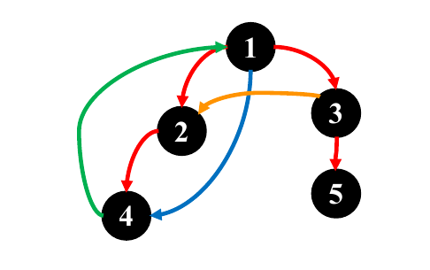

## DFS 中边的分类

在无向图中，有两种边：

- 树边：指出现在深度优先树中的边。
- 后向边：两顶点有祖先后代关系的非树边。这个后向边的定义其实叫做非横向边更好，因为“有祖先后代关系”的意思就是这个边的端点不可能在深度优先树上是兄弟关系。

也就是说，只要是非树边，就一定是后向边，这个我粗略思考，感觉可以用括号化定理证明。

在有向图中，有四种边：

| 种类   | 颜色 | 性质                   | 判定         |
| ------ | ---- | ---------------------- | ------------ |
| 树边   | 红色 | 在深度优先树中的边     |              |
| 后向边 | 绿色 | 从后代指向祖先的非树边 | 灰色 -> 灰色 |
| 前向边 | 蓝色 | 从祖先指向后代的非树边 |              |
| 横向边 | 橙色 | 从兄弟指向兄弟的非树边 |              |

