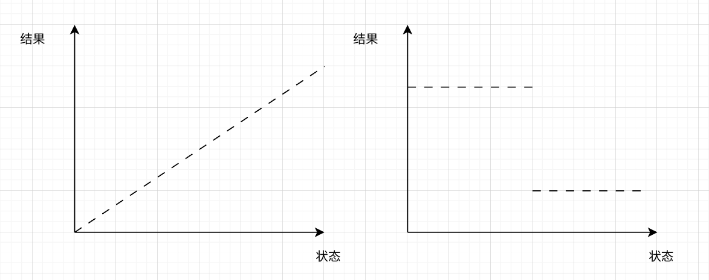
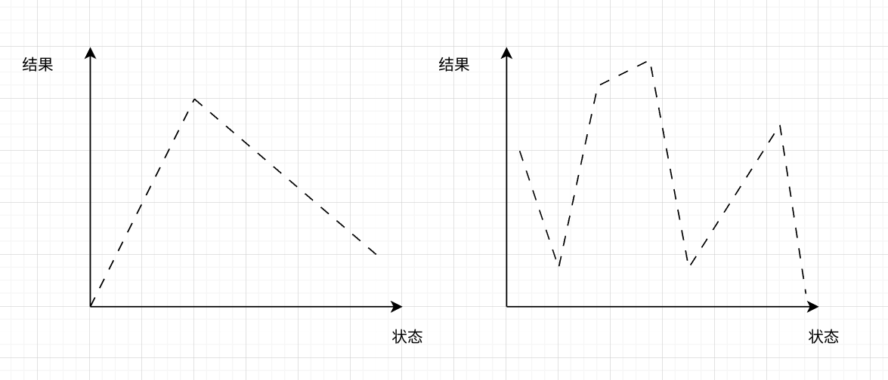
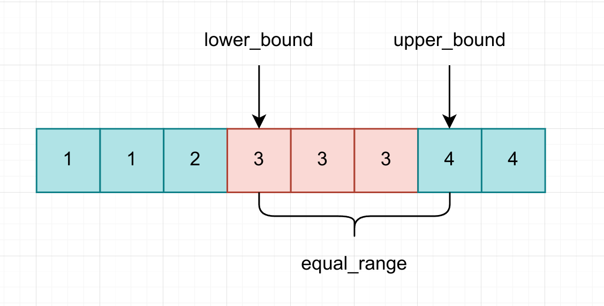

## 一、有序和单调

二分本质上是一种更加智能的搜索状态空间的方式，他需要状态空间的状态呈现一种“有序的一维数组”的形式，然后再进行搜索。所以一开始的排序是无法避免的。

因为二分的写法问题，所以应当怎样排序也是有一定讲究的，所以排序的时候就可以定义一定的比较方式。

如果更加细致的讨论的话，其实有序只是一个“小条件”，比如说很多枚举、搜索类的题目的状态空间也是有序的，但是我们却没有用二分法，这是因为其核心是，适用于二分法的题目，它的状态和解之间的关系是**单调**的，如下所示



如左图所示，如果我们对于 `mid` 有了一个讨论，我们就可以根据需求去选择往左或者往右，右图也是同理，我们知道只要小一点就可以将结果置高，那么最终的结果就会变成“到底小多少”，就是一个很容易解决的问题了。

但是如果状态和结果之间的关系并不单调，那么就无法使用二分法了，如下所示



左图还可以使用“三分法”，但是对于右侧，完全没有办法使用“分法”了，但是不可否认，右图的状态空间也是有序的，没准可以用动态规划求解。

---


## 二、二分模板

二分一共有两个模板，这是因为二分的本质不是通过二分找到“唯一适合“的点，二分一般呈现一种“最优化”的特点，它要找到是“符合条件”的最大的或者最小的。我们下面的讨论，都默认状态空间是增序排列的。

这就导致当 `mid` 符合条件的时候，我们需要判定该往哪一边走了，通常情况下，我们希望找到约束条件下的最大值，那么就应当向 `mid` 右侧去寻找，而当我们希望找到约束条件下的最小值，那么就应当向 `mid` 的左侧去寻找。

在寻找更小的区间的时候，有两个原则需要遵守，一个是缩小后的区间一定是包括 `mid` 的，是不可以跳过 `mid` 的，这是因为 `mid` 可能是唯一的“最优值”，所以是不能跳过的；另一个是一定要在 `mid` 的基础上进行移动，比如说 `mid + 1, mid - 1` 这样的移动，这是因为在整数中，如果 `right - left = 1` 而不进行移动，也就是 `left = mid, right = mid` ，这就会导致死循环的出现。综上所述，我们一般在 `mid` 符合约束条件的时候，利用的是 `left = mid, right = mid` 来确保对于 `mid` 的保留，而当 `mid` 不符合条件的时候，进行 `left = mid + 1, right = mid - 1` 的操作来避免死循环。

同时，需要注意二分法的边界条件，这个其实有多种写法，我选择了 `left < right` 作为循环的条件，那么退出的时候就有 `left == mid == right`，可以选择任何一个索引作为最终结果。

最后，还需要注意当搜索不到的情况，最后会返回什么，这取决于区间缩小时的移动条件，如果是 `left = mid + 1`，那么就会导致在 `right` 暂停，相反，则在 `left` 暂停。

所以模板如下，对于选择“最小值”，其中 `check(int)` 函数用于检测是否满足条件：

```c
// 求符合约束的最小值
while (left < right)
{
    // 向下取整
    int mid = (left + right) >> 1;

    // mid 是满足条件的，那么向左侧搜索，包括 mid
    if (check(mid))
    {
        right = mid;
    }
    // mid 不满足条件，向右侧搜索，那么最可能满足条件的是 mid + 1
    else 
    {
        left = mid + 1;
    }
}
```

对于选择“最大值”

```c
// 求符合约束的最大值
while (left < right)
{
    // 向上取整
    int mid = (left + right + 1) >> 1;

    // 如果 mid 满足条件，那么向右侧搜索，包括 mid
    if (check(mid))
    {
        left = mid;
    }
    // mid 不满足条件，向左侧搜索，最有可能满足条件的是 mid - 1
    else
    {
        right = mid - 1;
    }
}
```

对比如下

| 条目             | 模板 1                | 模板 2                 |
| ---------------- | --------------------- | ---------------------- |
| 目标             | 求出满足约束的最小值  | 求出满足约束的最大值   |
| `mid` 取整方式   | 向 `left` 取整        | 向 `right` 取整        |
| 搜索为空的返回值 | 状态空间 `right`      | 状态空间 `left`        |
| 跳过方向         | 向右 `left = mid + 1` | 向左 `right = mid - 1` |

---


## 三、STL 算法

与上面提出的模板类似的 stl 算法是 `lower_bound()` ，它可以返回第一个大于等于某个值的迭代器，也就是这个值的下界位置

```cpp
// 在 [first, last) 区域内查找不小于 val 的元素
ForwardIterator lower_bound (ForwardIterator first, ForwardIterator last,
                             const T& val);
// 在 [first, last) 区域内查找第一个不符合 comp 规则的元素
ForwardIterator lower_bound (ForwardIterator first, ForwardIterator last,
                             const T& val, Compare comp);
```

还有一个类似的函数是 `upper_bound()` ，它可以返回第一个大于某个值的迭代器，也就是这个值的上界位置

```c
// 查找[first, last)区域中第一个大于 val 的元素。
ForwardIterator upper_bound (ForwardIterator first, ForwardIterator last,
                             const T& val);
// 查找[first, last)区域中第一个不符合 comp 规则的元素
ForwardIterator upper_bound (ForwardIterator first, ForwardIterator last,
                             const T& val, Compare comp);
```

然后还有一个 `equal_range()` ，返回的是两个迭代器的 `pair`，指明了范围

```c
// 找到 [first, last) 范围中所有等于 val 的元素
pair<ForwardIterator,ForwardIterator> equal_range (ForwardIterator first, ForwardIterator last, 
													const T& val);
// 找到 [first, last) 范围内所有等于 val 的元素
pair<ForwardIterator,ForwardIterator> equal_range (ForwardIterator first, ForwardIterator last, 
													const T& val, Compare comp);
```

最后还有一个 `bin_search()` ，返回一个布尔值来确定在有序状态空间中是否有特定值

```cpp
//查找 [first, last) 区域内是否包含 val
bool binary_search (ForwardIterator first, ForwardIterator last,
                      const T& val);
//根据 comp 指定的规则，查找 [first, last) 区域内是否包含 val
bool binary_search (ForwardIterator first, ForwardIterator last,
                      const T& val, Compare comp);
```

示意图如下



对于 `lower_bound()` ，其实本质是模板 1 的设计模式，找到的是符合条件的最小值，其代码如下

```cpp
template <class ForwardIterator, class T> // ForwardIterator 前向迭代器
ForwardIterator lower_bound(ForwardIterator first, ForwardIterator last, const T &val)
{
    // it 对应 mid
    ForwardIterator it;
    // traits 是萃取机的意思，也就是萃取 iterator 里的信息，并给到算法
    // count 是搜索区间步长，step 是下一步的步长
    iterator_traits<ForwardIterator>::difference_type count, step;
    // count 的初始值就是 first 和 last 的距离（first 对应 left，last 对应 right）
    count = distance(first, last);
    // 步长大于 0，与 left < right 相同
    while (count > 0)
    {
        it = first;
        // 二分
        step = count / 2;
        // 等价于 mid = left + (right - left) / 2
        advance(it, step);
        // 判断 mid 是否满足条件
        // mid 此时不满足条件
        if (*it < val) // 或者 if (comp(*it,val))，对应第 2 种语法格式
        {
            // first = mid + 1
            first = ++it;
            // count 约缩小一半
            count -= step + 1;
        }
        // mid 满足条件，缩小步长（与使用 last 类似）
        else
        {
            count = step;
        }
    }

    return first;
}
```

因为与模式 1 相似，所以当不存在相似的值的时候，返回的迭代器等于 `last` 。

`upper_bound()` 的本质依然是模板 1，因为它寻找的是满足大于搜索值的最小值，所以代码结构与 `lower_bound()` 相同。

```cpp
template <class ForwardIterator, class T>
ForwardIterator upper_bound(ForwardIterator first, ForwardIterator last, const T &val)
{
    ForwardIterator it;
    iterator_traits<ForwardIterator>::difference_type count, step;
    count = std::distance(first, last);
    while (count > 0)
    {
        it = first;
        step = count / 2;
        std::advance(it, step);
        // 与 lower_bound() 只有这里不同，此时表示 mid 不满足大于的条件
        if (!(val < *it)) // 或者 if (!comp(val,*it)), 对应第二种语法格式
        {
            first = ++it;
            count -= step + 1;
        }
        else
        {
            count = step;
        }
    }
    return first;
}
```

同样的，当不存在相似的值的时候，返回的迭代器等于 `last` 。

`equal_range()` 本质就是调用了 `lower_bound()` 和 `upper_bound()` ，如下所示

```cpp
template <class ForwardIterator, class T>
pair<ForwardIterator, ForwardIterator> equal_range(ForwardIterator first, ForwardIterator last, const T &val)
{
    ForwardIterator it = std::lower_bound(first, last, val);
    return std::make_pair(it, std::upper_bound(it, last, val));
}
```

`binary_search()` 调用了 `lower_bound()` ，将返回值与 `last` 比较，并且确定搜索值比最小值（first）小（这是搜索不到的情况）

```cpp
template <class ForwardIterator, class T>
bool binary_search(ForwardIterator first, ForwardIterator last, const T &val)
{
    first = std::lower_bound(first, last, val);
    return (first != last && !(val < *first));
}
```

---


## 四、二分验证法

这是一类固定的题型，一般呈现“最小最大值”这样的特点（并不绝对），其本质是其答案的状态空间呈现很好的线性有序性（说不定就是个 $[0, max)$ 的区间），我们可以通过二分答案的方法，获得 `mid` 值，然后利用这个 `mid` 值去进行模拟验证，如果可以的话，那么就二分继续搜索。

比如说下面的这题

># [NOIP2015 提高组] 跳石头
>
>## 题目描述
>
>这项比赛将在一条笔直的河道中进行，河道中分布着一些巨大岩石。组委会已经选择好了两块岩石作为比赛起点和终点。在起点和终点之间，有 $N$ 块岩石（不含起点和终点的岩石）。在比赛过程中，选手们将从起点出发，每一步跳向相邻的岩石，直至到达终点。
>
>为了提高比赛难度，组委会计划移走一些岩石，使得选手们在比赛过程中的最短跳跃距离尽可能长。由于预算限制，组委会至多从起点和终点之间移走 $M$ 块岩石（不能移走起点和终点的岩石）。
>
>## 输入格式
>
>第一行包含三个整数 $L,N,M$，分别表示起点到终点的距离，起点和终点之间的岩石数，以及组委会至多移走的岩石数。保证 $L \geq 1$ 且 $N \geq M \geq 0$。
>
>接下来 $N$ 行，每行一个整数，第 $i$ 行的整数 $D_i( 0 < D_i < L)$， 表示第 $i$ 块岩石与起点的距离。这些岩石按与起点距离从小到大的顺序给出，且不会有两个岩石出现在同一个位置。
>
>## 输出格式
>
>一个整数，即最短跳跃距离的最大值。
>
>## 样例 #1
>
>### 样例输入 #1
>
>```
>25 5 2 
>2
>11
>14
>17 
>21
>```
>
>### 样例输出 #1
>
>```
>4
>```
>
>## 提示
>
>### 输入输出样例 1 说明
>
>将与起点距离为 $2$和 $14$ 的两个岩石移走后,最短的跳跃距离为 $4$(从与起点距离 $17$ 的岩石跳到距离 $21$ 的岩石,或者从距离 $21$ 的岩石跳到终点)。
>
>### 数据规模与约定
>
>对于 $20\%$的数据，$0 \le M \le N \le 10$。    
>对于 $50\%$ 的数据，$0 \le M \le N \le 100$。  
>对于 $100\%$的数据，$0 \le M \le N \le 50000,1 \le L 
> \le 10^9$。

可以看到这个题目的答案空间是在 $[0, L)$ 之间的，虽然题目看着很复杂，但是如果考虑用二分的方法去做，对于每一个 `mid` 值的检验，是很容易进行模拟的，如下所示

```cpp
#include <bits/stdc++.h>

using namespace std;

int l, m, n;
int d[50005];

// 对于传入的 mid，进行模拟检验
bool check(int step)
{
    int cnt = 0;
    int pre = 0;
    for (int i = 0; i <= n; i++)
    {
        // 如果距离小于 step，说明需要将这个石头移除
        if (d[i] - pre < step)
        {
            cnt++;
        }
        // 否则就更新前一个木桩
        else
        {
            pre = d[i];
        }
    }

    // 最终的结果是移除的石头不能多余 m
    return cnt <= m;
}

int main()
{
    cin >> l >> n >> m;
    for (int i = 0; i < n; i++)
    {
        cin >> d[i];
    }
    d[n] = l;

    int left = 0, right = l + 1;
    // 因为是求解最大值，所以采用的是模板 2
    while (left < right)
    {
        int mid = (left + right + 1) >> 1;

        if (check(mid))
        {
            left = mid;
        }
        else
        {
            right = mid - 1;
        }
    }

    cout << left;
    return 0;
}
```

需要注意的是，在 `check()` 中，因为采用的是模拟方法，所以可能会导致复杂度比较高，所以当模拟到失败的时候，需要进行减枝优化。比如说洛谷上的这道题目 https://www.luogu.com.cn/problem/P3853 ，它的格式基本上与前面的题目相同，但是在 `check()` 上进行减枝

```cpp
bool check(int step)
{
    int cnt = 0, pre = 0;

    for (int i = 0; i < n;)
    {
        if (d[i] - pre > step)
        {
            cnt++;
            pre += step;
        }
        else
        {
            pre = d[i];
            i++;
        }
        // 减枝
        if (cnt > m)
        {
            return false;
        }
    }

    return true;
}
```

---


## 五、实数二分

实数二分的模板要更加容易记忆，唯一需要注意的就是精度问题，因为控制不好精度，很容易导致死循环（似乎到了 `1e-7` 左右就容易 tle，这可能是由于双精度浮点数的精度相比较大导致的，所以一般采用 `1e-6`），一定要注意题目中的描述，模板如下

```cpp
double left = 0, right = 1e10;
while (left + 1e-6 < right)
{
    double mid = (left + right) / 2;
    if (check(mid))
    {
        left = mid;
    }
    else
    {
        right = mid;
    }
}
```

