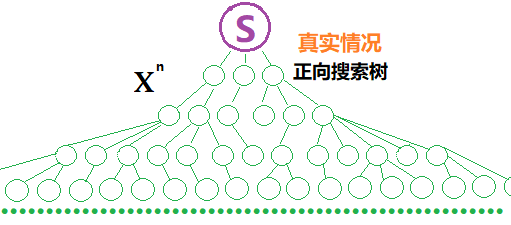
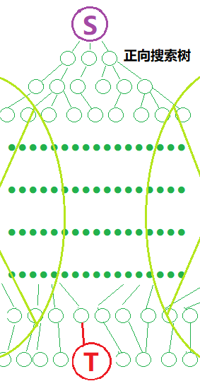

## 一、BFS 模板

如下所示

```cpp
set<Node> visited;

bool check(Node son);

int bfs(Node start)
{
    // init
    queue<Node> q;
    q.push(start);
    visited.insert(start);
    
    while (!q.empty())
    {
        Node front = q.front();
     	q.pop();
        
        for (son : q.neigbour)
        {
            // prune
            if (check(son))
            {
             	q.push(son);
                visited.insert(son);
                // son is the correct answer
                if (ac(son))
                {
                    return son.info();
                }
            }
        }
    }
    
    return -1;
}

int main()
{
    //...
    int ans = bfs();
    //...
    return 0;
}
```

其中有几部分需要一一强调，第一个是 `check()` 函数用于进行减枝，只有经过 `check` 的子节点会被加入队列。

```
bool check(Node son);
```

`check` 的基础内容就是有没有被 `visited` 过，其写法如下

```cpp
visited.count(son) == 0 
visited.find(son) == visited.end()
```

这两种写法都表明 `visited` 中没有 `son` 。

另外就是有的时候 BFS 的遍历会伴随着诸多与 `Node` 对应的数据的记录，比如说每个 `Node` 对应的 `level` 这样的信息，建议使用一个（或者多个）全局的 `map` 去这样存储

```cpp
map<Node, Info> levels;
```

而一旦存在这样的 `map`，那么就可以省略 `visited` 了，因为没有必要了。判断是否存在，可以用

```cpp
levels.count(son) == 0;
levels.find(son) == visited.end();
```

同时当我们使用 BFS 的时候，我们一般是希望获得最优解（对应最小的 level），所以我们一般就遍历到合适的 `Node` ，就需要返回了，所以我们应当将 BFS 写成一个函数，然后方便 `return` 跑路。但是这就要求 BFS 需要的变量尽量是全局变量，方便访问。

---


## 二、双向 BFS

其思想是，如果 BFS 的起点和终点是可以确定的，那么就分别从起点和终点进行 BFS，最终的判断条件是两棵树是否相交（本质是两个 `visited` 相交），这样做的好处是可以去掉大量的无用的遍历，同时保有了 BFS 的特性

单向搜索：



双向搜索：



其在实现上基本上就是普通 BFS 复制一遍，唯一需要注意的就是利用 `visit` 相交的判断，板子题如下

> # [NOIP2002 提高组] 字串变换
>
> ## 题目描述
>
> 已知有两个字串 $A,B$ 及一组字串变换的规则（至多 $6$ 个规则），形如：
>
> - $A_1\to B_1$。
> - $A_2\to B_2$。
>
> 规则的含义为：在 $A$ 中的子串 $A_1$ 可以变换为 $ B_1$，$A_2$ 可以变换为 $B_2\cdots$。
>
> 例如：$A=\texttt{abcd}$，$B＝\texttt{xyz}$，
>
> 变换规则为：
>
> - $\texttt{abc}\rightarrow\texttt{xu}$，$\texttt{ud}\rightarrow\texttt{y}$，$\texttt{y}\rightarrow\texttt{yz}$。
>
> 则此时，$A$ 可以经过一系列的变换变为 $B$，其变换的过程为：
>
> - $\texttt{abcd}\rightarrow\texttt{xud}\rightarrow\texttt{xy}\rightarrow\texttt{xyz}$。
>
> 共进行了 $3$ 次变换，使得 $A$ 变换为 $B$。
>
> ## 输入格式
>
> 第一行有两个字符串 $A,B$。
>
> 接下来若干行，每行有两个字符串 $A_i,B_i$，表示一条变换规则。
>
> ## 输出格式
>
> 若在 $10$ 步（包含 $10$ 步）以内能将 $A$ 变换为 $B$，则输出最少的变换步数；否则输出 `NO ANSWER!`。
>
> ## 样例 #1
>
> ### 样例输入 #1
>
> ```
> abcd xyz
> abc xu
> ud y
> y yz
> ```
>
> ### 样例输出 #1
>
> ```
> 3
> ```
>
> ## 提示
>
> 对于 $100\%$ 数据，保证所有字符串长度的上限为 $20$。
>
> **【题目来源】**
>
> NOIP 2002 提高组第二题

此时的题解如下

```cpp
#include <bits/stdc++.h>

using namespace std;

string a[10], b[10];

int main()
{
    string origin, target;
    cin >> origin >> target;
    // 不定长输入
    int n = 0;
    while (cin >> a[n] >> b[n])
    {
        n++;
    }

    // 分别代表两个队列，分别从 up 和 down 两个方向搜索
    queue<string> up, down;
    // 记录字符串和步数的关系，同时兼具 visit 的功能
    map<string, int> upStep, downStep;
    // 入队起始节点，并登记
    up.push(origin);
    upStep[origin] = 0;
    down.push(target);
    downStep[target] = 0;
    // 搜索的次数最多是 10 次，所以双向 5 次
    for (int step = 1; step <= 5; step++)
    {
        // 先进行 up 向下搜索
        // 限制当前处理的都是 step - 1 层
        while (upStep[up.front()] == step - 1)
        {
            string front = up.front();
            up.pop();

            // 遍历所有的转换规则
            for (int i = 0; i < n; i++)
            {
                // 寻找所有位置的 a[i] 进行替换，pos 是可替换字符串子串出现的位置
                for (int pos = front.find(a[i]); pos != -1; pos = front.find(a[i], pos + 1))
                {
                    // tmp 是利用 a[i] -> b[i] 规则的字符串
                    string tmp = front;
                    // replace(pos, len, str) 从 pos 开始替换 len 长度的 str
                    tmp.replace(pos, a[i].length(), b[i]);
                    // 当 find 找不到的时候，会返回 end() 迭代器，此时说明没有 visitUp
                    if (upStep.find(tmp) == upStep.end())
                    {
                        // 入队
                        up.push(tmp);
                        // 登记
                        upStep[tmp] = step;
                    }
                    // 在对面找到了，所以一共花了 step * 2 - 1 步
                    if (downStep.find(tmp) != downStep.end())
                    {
                        // 搜出答案就可以结束了，从这里可以看，最好把 bfs 写成一个单独的函数，否则会非常丑陋
                        cout << step * 2 - 1;
                        return 0;
                    }
                }
            }
        }

        // down 向上搜索
        while (downStep[down.front()] == step - 1)
        {
            string front = down.front();
            down.pop();

            // 遍历所有的转换规则
            for (int i = 0; i < n; i++)
            {
                // 寻找所有位置的 b[i] 进行替换，pos 是可替换字符串子串出现的位置
                for (int pos = front.find(b[i]); pos != -1; pos = front.find(b[i], pos + 1))
                {
                    // tmp 是利用 b[i] -> a[i] 规则的字符串
                    string tmp = front;
                    // b[i] -> a[i]
                    tmp.replace(pos, b[i].length(), a[i]);
                    // 当 find 找不到的时候，会返回 end() 迭代器，此时说明没有 visitUp
                    if (downStep.find(tmp) == downStep.end())
                    {
                        down.push(tmp);
                        downStep[tmp] = step;
                    }
                    if (upStep.find(tmp) != upStep.end())
                    {
                        cout << step * 2;
                        return 0;
                    }
                }
            }
        }
    }

    cout << "NO ANSWER!";

    return 0;
}
```

需要注意的是，这里用了固定迭代次数来进一步减枝，但是这并不是 BFS 的必要特征。
