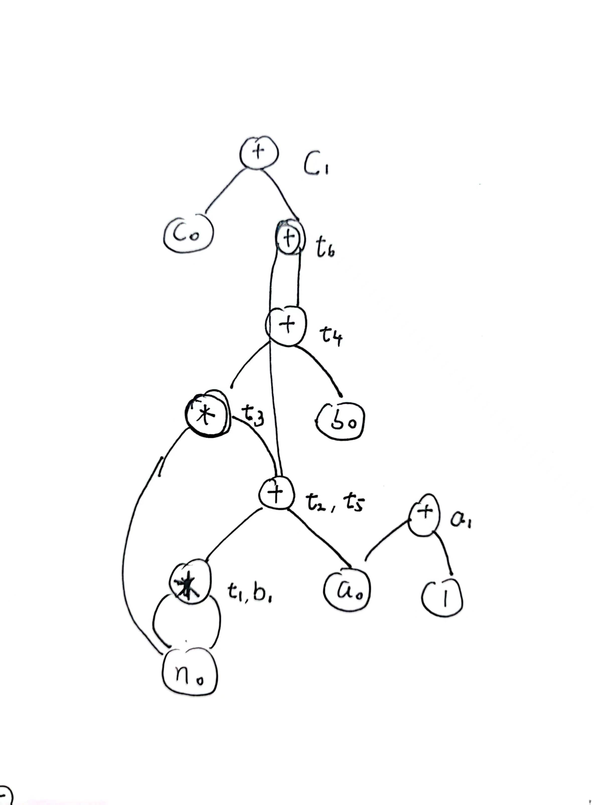
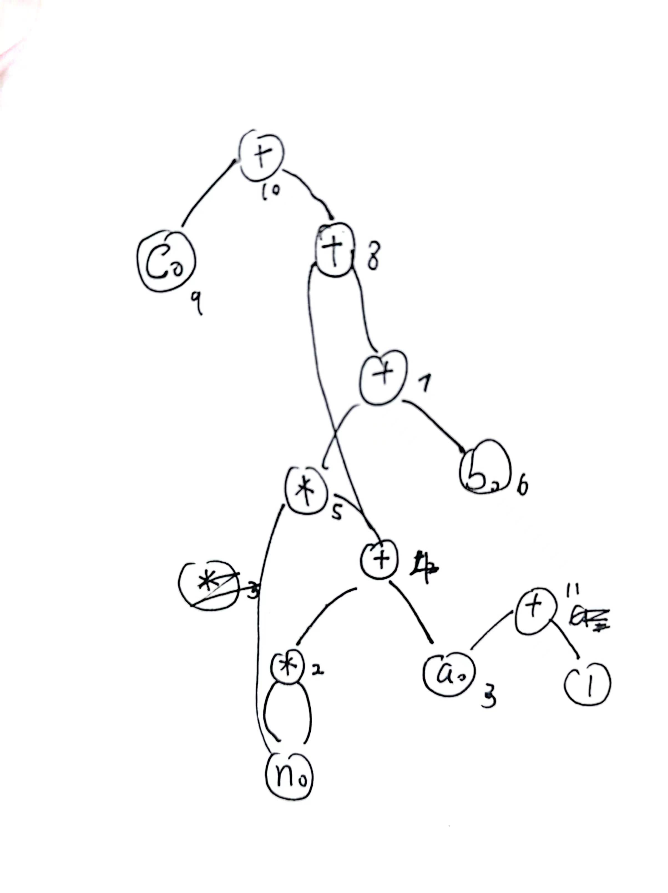
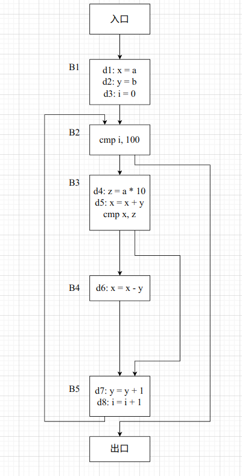
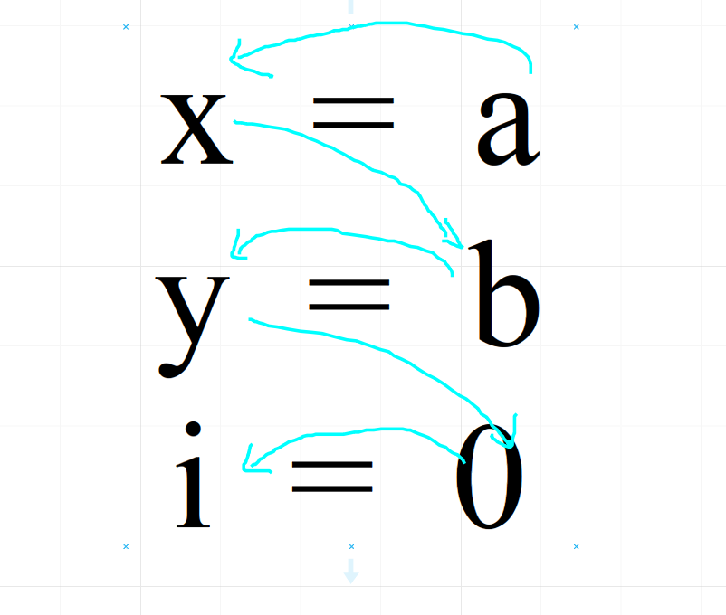
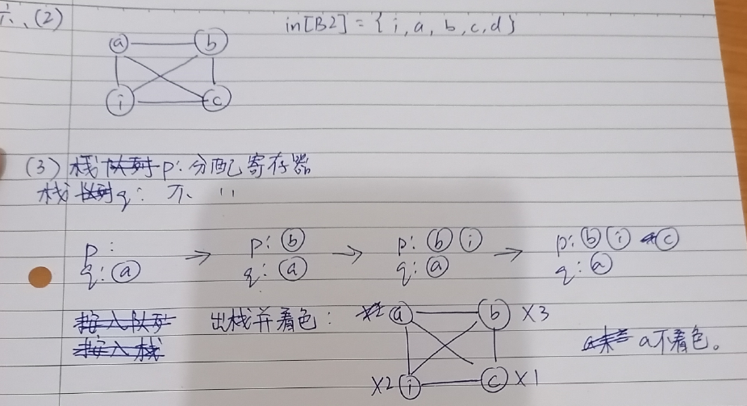

## 一、构造控制流图（CFG）

> 关于优化，真的是一个令人生畏的事情，大致来说，一个优化分为两个部分：
>
> - 分析
> - 改写
>
> 但是在课程中大多只交第一个部分，而不讲第二个部分，这就导致一种“无意义性”，如果分析不能用于改造程序，那么就没有什么学习的动力。所以如果想要学好理论，那么必须要有一个宏观的角度去看发生的一切事情。
>
> 按照 《Engineering a Complier》的观点，按照优化的范围去给优化分类，大致可以分为以下四类
>
> | 类型                   | 范围                     | 举例                                             |
> | ---------------------- | ------------------------ | ------------------------------------------------ |
> | 局部优化               | 限制在某个基本块中       | 公共子表达式提取，局部值编号，树高平衡，窥孔优化 |
> | 区域性优化             | 某几个有联系的基本块     | 循环展开                                         |
> | 全局优化（过程内优化） | 组成一个完整过程的基本块 | 图着色寄存器分配                                 |
> | 过程间优化             | 多个过程                 | 函数内联，过程间常数传递                         |
>
> 至于为什么有这么多分类，是因为优化是一个很严谨而且需求具有多样性的事情，不同的范围对应的条件和限制是不一样的，那么可以进行优化的力度和策略也就是不一样的。
>
> 对于局部优化，因为它在一个基本块内，所以有两个极好的性质可以应用
>
> - 语句是顺序执行的。
> - 如果一条语句被执行，那么整个基本块的语句都会被执行。
>
> 从某种意义上讲，基本块让人们不再直面指令，而是变成面对一个数据流图。
>
> 而其他三种方法，都需要建立在对于 CFG 图上，也就是说，首先就是分析 CFG 图。另外还有一段话很有意思：
>
> 在进行区域性优化的时候，我们可以考虑通过某种图论性质定义的 CFG 子集，比如说支配图或者强联通分量。

通过一道题来介绍一下分法，不过介绍之前，还是说一下，此时的代码一定是 ir 了，但是对于课设用到的是那种 ir 呢？应该是某种神秘的四元式（这里插一嘴，llvm 也可以被认为成一种神秘四元式，即只有一小部分指令有大于 2 个的操作数）。

有三条规则：

- 程序入口第一条语句
- 任何可以被当做跳转目标的语句
- 跳转语句后面的一条语句

当然不是人话，其实就两点，就是扫描的时候关注两个东西：

- 标签前面：因为描述跳转目标必须需要标签。
- 跳转后面，因为要在后面断掉。

至此，开始实践：

```assembly
a = 0
b = 10
c = 100
-------------------------
label_begin_loop:
cmp a, n
bge label_end_loop 
--------------------------
t1 = n * n
t2 = t1 + a
t3 = n * t2
t4 = t3 + b
b = n * n
t5 = b + a
t6 = t5 + t4
c = c + t6
a = a + 1
br label_begin_loop 
--------------------------
label_end_loop:
return c
```

轻松容易。


## 二、消除公共子表达式（DAG 图应用）

> 在实践之前，还是强调，这一步是在四元式 ir 的基础上进行的，所以里面的表达式也带有一定的某种 ir 的性质，可以看到，在 ir 中会产生一些临时变量，用于存放中间结果，而这些临时变量不会在进入块之前就被定义（临时变量一定被限制在了基本块内），同时这些临时变量也不会被重复定义（如果被重复定义，那么为什么不新作一个临时变量呢？这样看，临时变量满足了 SSA）。
>
> 我们用表达式树来描述一个复杂的计算，但是这棵树上有一些部分是重复的，所以只要发现这些重复的地方，我们就可以只用一个部分即可。
>
> 还是想说，其实这个东西依然是表达式数构建和导出的应用。比如说在构建的时候，要自底向上的构建，因为上层节点需要利用到下层节点的计算结果，而在导出的时候，也是应该先导出底部的。 一切对于有向无环图的理解，其实都是对于表达式树或者语法树的理解。是某种意义上树形 ir 和四元式 ir 的关系。
>
> 这么看就更有意思了，本质上我们的工作是将一个线性的序列，一个在时间上流动的序列，压缩成了一个片一样的树或者图。

以一道题为例：

```c
t1 = n * n;
t2 = t1 + a;
t3 = n * t2;
t4 = t3 + b;
b = n * n;
t5 = b + a;
t6 = t5 + t4;
c = c + t6;
a = a + 1;
```

首先先说明一件事，就是因为这个图是从底向上构建的，所以第一个节点不能写得太靠上，因为要逐渐往上生长，也不能写得太靠侧边，因为表达式树或者 DAG 是有序的，显然 `a - b` 和 `b - a` 是两个东西，所以必然是 `b` 是左孩子，而 `a` 是右孩子。所以最终结论就是，不要期望自己的 DAG 有多好看，因为好看不了。

还有一些简单性质，比如说只有入度的节点（也就是某种意义上的“叶子节点”）一定是 `livein` 的变量，而这些变量在之后可能会被赋值，所以一个变量可以对应多个节点（可以看成每个节点就是一个版本，比如说在课程里明说 $var_{0}$ 就是第一个版本，之后每次定义 `var` 的时候，都可以看做是在当前版本 $var_{n - 1}$  上做迭代（因为此时在表达式树上留存着 $var_{n - 1}$  这个版本），更新了 $var_n$ 这个值）。

所以就可以构建表了，在构建表的时候，因为一个中间节点，只能是一个运算符，所以没法比较直观的对应，所以采用了标号的举措，但是这种标号感觉增加了查表的时间，不如直接将符号写到树节点上去：



这种形式大概要比普通的形式要快很多，主要是不用人为查表了，所有的信息都在点上，而且不用在“画图--登记”之间来回切换。但是依然有标准形式，就是给节点标号，然后用符号对应标号。

画图的时候需要注意不要画错顺序，同时尽量规整。还有一定要**先看操作符，然后再看结果**，也就是 `c = c + 1` 要被翻译成  `c1 = c0 + 1` 。



还需要搭配表

| 符号 | 版本 0 | 版本 1 |
| ---- | ------ | ------ |
| n    | 1      |        |
| t1   | 2      |        |
| a    | 3      | 11     |
| t2   | 4      |        |
| t3   | 5      |        |
| b    | 6      | 2      |
| t4   | 7      |        |
| t5   | 4      |        |
| t6   | 8      |        |
| c    | 9      | 10     |
| a    | 11     |        |

可以看到，速度放慢了很多。

然后就到了导出表达式的步骤，只有 3 点需要强调：

- 教材中说的，利用拓扑排序存入队列，然后逆向输出，其实主要依赖的是表达式树的性质，这个性质其实可以被抽象成“将边反向后拓扑排序输出”，更加本质。
- 对于用一个节点上有多个变量存在的情况，比如说 2 号节点对应了 `t1, b` 那么应当优先导出 `b` ，因为 `a, b, c` 这种是全局变量（这里的“全局”指的是优化中的全局，也就是跨基本块的变量），后面的基本块可能还会用到，所以优先更新全局变量。
- 入队的只能是中间节点，说白了，排序排的是表达式，因为每个中间节点都代表一个表达式。

按照规则入队

| a    | c    | t6   | t4   | t3   | t2   | b    |
| ---- | ---- | ---- | ---- | ---- | ---- | ---- |

所以最后的结果就是

```assembly
b = n * n;
t2 = b + a;
t3 = n * t2;
t4 = t3 + b;
t6 = t2 + t4;
c = c + t6;
a = a + 1;
```

吐槽一句，费了半天劲，就消了俩，乐。


## 三、到达定义分析

> 这是我们学的第一个全局数据流分析，但是只能说教材封装得太好了。
>
> 肯定这些分析是全局数据流分析，但是以基本块为颗粒度是怎么一回事？即使分析出了基本块的 in 或者 out，对于实际的改写程序并没有办法起到指导意义，这是因为改写的颗粒度是指令级的。显然一个粗粒度的分析没办法指导一个细粒度的改写。
>
> 其实实际的分析是分为两步的：
>
> - 进行块级颗粒度的数据流分析，这个部分具有全局性质，会统筹考虑 CFG 的数据流向问题。
> - 在每个块内进行指令级颗粒度的数据流分析，这个部分发生在局部，利用的是块级颗粒度分析的结果，不需要考虑全局信息。
>
> 至于问什么要分步骤进行，这可能是因为涉及到具体的优化的时候，可能对于数据流分析有轻微的调整，这种调整一般只发生在块内，所以解耦可以更好的更改代码。比如说在后端，“全局寄存器分配”和“数据流窥孔优化”都采用了活跃性分析，两者的块级颗粒度分析是相似的，如下所示
>
> ```java
> public static HashMap<ArmBlock, BlockLiveInfo> livenessAnalysis(ArmFunction func)
> ```
>
> 最终是每个 `block` 对应一个活跃性分析 `BlockLiveInof` ，但是这个信息并不会被马上使用。而是需要根据不同的优化进行调整和分析。
>
> 在全局寄存器分配的时候，需要精确到指令级获得冲突图，并且要维持倒序（原汁原味的活跃性分析）：
>
> ```java
> private void build(ArmFunction function)
>     {
>         // 这是要倒序遍历 block,是为了确定 range 的范围
>         for (MyList.MyNode<ArmBlock> blockNode = function.getArmBlocks().getTail();
>              blockNode != null;
>              blockNode = blockNode.getPre())
>         {
>             ArmBlock block = blockNode.getVal();
>             // 这里假设他是出口活跃的,似乎还是不一样，但是似乎也是可以理解的，只要最后可以获得即可
>             // live 是一个很有意思的东西，他看似一个 block 只有一个，但是因为每条指令都更新它，所以它本质是一个指令颗粒度的东西
>             // 我们会根据 live 的内容去构建冲突图
>             HashSet<ArmReg> live = new HashSet<>(liveInfoMap.get(block).getLiveOut());
> 
>             for(MyList.MyNode<ArmInstr> instrNode = block.getInstrs().getTail();
>                 instrNode != null;
>                 instrNode = instrNode.getPre())
>             {
>                 ArmInstr instr = instrNode.getVal();
>                 ArrayList<ArmReg> regDef = instr.getRegDef();
>                 ArrayList<ArmReg> regUse = instr.getRegUse();
> 
> 				// ....  
> 
>                 regDef.stream().filter(ArmReg::needsColor).forEach(live::add);
> 
>                 // 构建冲突边的时候，只是构建了 def 与 live 的冲突，这样似乎不够
>                 // 但是其实，是够得，因为在一个个指令的遍历中，能增加边的，只有 def 导致的活跃
>                 regDef.stream().filter(ArmReg::needsColor).forEach(d -> live.forEach(l -> addEdge(l, d)));
> 
>                	// ....
> 
>                 // 这里的删除是为了给前一个指令一个交代（倒序遍历），说明这个指令不再存活了（因为在这个指令被遍历了）
>                 regDef.stream().filter(ArmReg::needsColor).forEach(live::remove);
>                 // 这里代表着又活了一个指令
>                 regUse.stream().filter(ArmReg::needsColor).forEach(live::add);
>             }
>         }
>     }
> ```
>
> 而在数据流窥孔中，只需要获得某种神秘的 def-use 链，甚至都不需要进行倒序。
>
> ```java
> private MyPair<HashMap<ArmOperand, ArmInstr>, HashMap<ArmInstr, ArmInstr>> getLiveRangeInBlock(ArmBlock armBlock)
>     {
>         // 这个记录的是每个操作数与它最后一次被写的指令之间的映射
>         HashMap<ArmOperand, ArmInstr> lastWriter = new HashMap<>();
>         // 这个记录的是 key = writer，value = reader 的映射
>         // key -> value 记录的是一个写了某个寄存器的指令到其后读了某个寄存器的指令之间的映射
>         // 因为 writerToReader 会持续更新，所以本质是记录着写指令到最后一条相关的读指令之间的映射
>         HashMap<ArmInstr, ArmInstr> writerToReader = new HashMap<>();
> 
>         // 开始遍历每一条指令
>         for (MyList.MyNode<ArmInstr> instrNode : armBlock.getInstrs())
>         {
>             ArmInstr instr = instrNode.getVal();
>             // 不同于 use 和 def，write 和 read 的范围更加大
>             ArrayList<ArmReg> writeRegs = instr.getWriteRegs();
>             ArrayList<ArmReg> readRegs = instr.getReadRegs();
> 
>             // 这里遍历每一个需要用到的寄存器，然后填写 writerToReader
>             for (ArmReg readReg : readRegs)
>             {
>                 if (lastWriter.containsKey(readReg))
>                 {
>                     writerToReader.put(lastWriter.get(readReg), instr);
>                 }
>             }
> 
>             for (ArmReg writeReg : writeRegs)
>             {
>                 lastWriter.put(writeReg, instr);
>             }
> 
>             // ...
> 
>             writerToReader.put(instr, hasSideEffect ? instr : null);
>         }
> 
>         return new MyPair<>(lastWriter, writerToReader);
>     }
> ```
>
> 这里再提一嘴倒序和正序的问题，其实对于典型的块级颗粒度分析，倒序和正序是一样的，反正最后都会达到一个不动点，只不过是迭代次数的问题（实际实践也检验了，在 ayame 中活跃性分析是正序的），但是指令级的分析，必须遵循正序或者倒序，这是因为块内的分析，用的是线性扫描，而非不动点，所以只有一遍，如果顺序错了，那么可能徒劳无功。
>
> 如果再说细一点，其实块级颗粒度只要保证是从入口块或者结尾块开始分析，那么连理论上都具有正确性。
>
> 这里提到的到达定义分析，可以用于常数传播，其实现原理是改写一下 in，out 的性质，让其成为常数定义的集合，而不是所有定义的集合，十分好理解，这也揭示了另一个问题，就是活跃性分析是没法取代到达定义分析的，因为到达定义分析中集合的元素是定义，而活跃性分析集合的元素是操作数，显然没法完成常数传播。
>
> 到达定义分析最终要的是 $in$ 集合，他表示着在这个块开始的时候，有哪些量已经被定义了，这是一个很关键的信息，到达语句力度的时候，就变成了在这个语句之前，有哪些量已经被定义了。

以下题举例，对所有的局部变量和形参做“到达定义分析”。

> 插一嘴，如果设计画 CFG 应该画成这样，因为前驱后继关系很明显，不能提前将多个前驱汇聚。



首先考虑 `gen` 和 `kill` 两个集合，其中 `kill` 集合指的是只要定义了同一个变量，那么就是互相 kill 的，所以为了完成快速查表，可以考虑建立一个语句和变量的映射关系，如下所示

| 变量 | 语句       |
| ---- | ---------- |
| x    | d1, d5, d6 |
| y    | d2, d7     |
| i    | d3, d8     |
| z    | d4         |

对于块语句去分析的时候，kill 就是多个块内语句的并集，但是对于 gen，因为一个块内可能对某个变量定义多次，所以只需要最后一次的定义语句。为了达到这种效果，应当从下往上遍历基本块内的指令。填表的时候，应当先填 gen，然后填 kill，移动速度更快。

| 基本块 | gen[B]     | kill[B]        |
| ------ | ---------- | -------------- |
| B1     | d1, d2, d3 | d5, d6, d7, d8 |
| B2     |            |                |
| B3     | d4, d5     | d1, d6         |
| B4     | d6         | d1, d5         |
| B5     | d7, d8     | d2, d3         |

然后开始分析 in，out，应当按照如此顺序填写，同时需要维护前驱块来提高速度

有方程（如果记不住谁需要被减，可以想象 `in` 是别人的，所以需要被减）。
$$
out[B] = gen[B] \cup (in[B] - kill[B])
$$

| 基本块 | 前驱块 | in[B]                          | out[B]                         |
| ------ | ------ | ------------------------------ | ------------------------------ |
| B1     |        |                                | d1, d2, d3                     |
| B2     | B1, B5 | d1, d2, d3, d4, d5, d6, d7, d8 | d1, d2, d3, d4, d5, d6, d7, d8 |
| B3     | B2     | d1, d2, d3, d4, d5, d6, d7, d8 | d2, d3, d4, d5, d7, d8         |
| B4     | B3     | d2, d3, d4, d5, d7, d8         | d2, d3, d4, d6, d7, d8         |
| B5     | B3, B4 | d2, d3, d4, d5, d6, d7, d8     | d4, d5, d6, d7, d8             |

在填写的时候会发现，只要过了第一轮，那么 `gen[B]` 是没有用处的，这是因为在第一轮的时候已经被加进去了。所以在之后迭代的时候，可以值考虑 `in[B]` 和 `kill[B]` 的作用就可以了。不过无论如何，都是一个极其复杂的查表过程。


## 四、活跃变量分析

> 与到达定义不同的是，它是需要倒序分析的，因为对于一个基本块而言，或者说一个语句而言，没有办法断定当前操作数是否在未来还“存活”，除非它在未来出现了（而且是以“使用”的方式出现了）。所以要采用倒序分析。
>
> 所以方程变成了这样的两个，out 变成了决定 in 的变量
> $$
> in[B] = use[B] \cup (out[B] - def[B]) \\
> out[B] = \bigcup_{B 的后继基本块P} in[P]
> $$
> 从上面这个式子也可以看出，真正的 live 是 use。


计算 use 和 def，按照定义来说，就是“def 中的变量被定义先于他们的使用，use 中的变量被使用先于他们的定义”。在实际使用的时候，应该按照如下顺序遍历并且检查是否重复



先 use 后 def（依然是上面的题）

| 基本块 | use[B]  | def[B]  |
| ------ | ------- | ------- |
| B1     | a, b    | x, y, i |
| B2     | i       |         |
| B3     | a, x, y | z       |
| B4     | x, y    |         |
| B5     | y, i    |         |

然后按照上面的公式开始构造

| 基本块 | 后继   | out        | in         |
| ------ | ------ | ---------- | ---------- |
| B1     | B2     | a, x, y, i | a, b       |
| B2     | B3     | a, x, y, i | a, x, y, i |
| B3     | B4, B5 | a, x, y, i | a, x, y, i |
| B4     | B5     | a, x, y, i | a, x, y, i |
| B5     | B2     | a, x, y, i | a, x, y, i |

其实这里依然是没有办法被使用的，这个分析太粗粒度，但是如果强行构造冲突图，也不是不行。


## 五、图着色寄存器分配

> 教材中的冲突图的定义仅先于“全局变量”，就是那些可以跨越基本块存活的变量才可以得到全局寄存器，也就是获得进入冲突图的资格。而且在教材用一共有两处介绍冲突图的构建，但是介绍的都不甚了了。
>
> 第一种比较简单，是用两个变量只要都在某个入口块活着，那么就冲突了，所以只要比较 livein 就可以获得答案。
>
> 第二种比较模糊，“如果一个变量在其定义处其他变量还存活，那么就冲突”，我不知道跟最本质的那个“生命周期存在重叠区间”是否等价，但是就需要变成一个指令级的活跃性分析了，这无疑是很困难的。

不写了，似乎很容易，就是当出现出度大于等于 K 的情况，那么就不着色了，发生溢出，否则入栈，最后弹栈着色。

3 着色




## 六、定义-使用链

> 这个东西还有活跃性分析似乎和图着色寄存器分配绑定在一起了，而且对于“到底怎样判定冲突”一直众说纷纭。不过在我看来，只有 14.3.3 这节讲的东西，才是真正比较逻辑自洽的。
>
> 首先说比较原始的东西是什么“在同一基本块入口处均活跃的变量”。这个很好理解，因为块级的活跃性分析就到这个程度。
>
> 然后比较模棱两可的是“在程序任一执行点上同时活跃的变量之间存在冲突边”。那么其实已经到了指令级了。
>
> 最后是“一个变量在另一个变量的定义点处活跃”，是最正确的。

所谓的定义使用链，就是构造一个网，这个网的起点是定义点，而其他点是使用点，说白了，就是构造了一个直观分析的活跃性的数据流，然后用两个网去看是否冲突，就是看一张网的定义点，看另一张网的使用点是否重合。

由链成网的过程，其实是将两个小的活跃周期合并成一个大的活跃周期。这其实是一个很自然的现象。

---


## 七、遍 (pass)

- 遍是指对源程序或源程序的中间形式从头到尾扫描一遍：所以其实词法分析也看成一遍，语法分析也可以看成一遍
- 一遍扫描编译程序以**语法分析程序**为核心。
- 分遍的优点：
  - **主要好处**：减少编译程序对于内存容量的要求
  - 编译程序结构清晰，功能独立，联系简单
  - 将优化工作做得更多，更充分，更高指令
- 缺点：
  - 增加了不少重复性的工作，降低编译的效率
