## 一、理论

- 前端：分析部分，包括词法和语法分析，符号表建立，语义分析，中间代码生成，错误处理
- 后端：综合部分，包括与机器有关的代码优化，目标代码生成，符号表操作，错误处理
- 编译有 5 个阶段，分别是：**词法分析，语法分析，语义分析和中间代码生成，代码优化，生成目标程序**。有两个事件贯穿其中，即**符号表管理和错误处理**。也就组成了 7 个逻辑部分。
- 字母表和符号串
  - 符号：可以理解为一个个的字母，比如说 $a, b, c, \phi$
  - 字母表：是符号的集合，比如说 $\sum = \{a,b,\phi\}$
  - 符号串：是符号的序列：比如说 $abababa$
  - 空符号串：无任何符号的符号串，即 $\epsilon$
  - 符号串集合：由符号串构成的集合
  - 语言：一种特殊的符号串集合
- 文法就是语法，规定了语言的结构。
- 左递归文法只是无法采用自顶向下的分析方法，并不是一无是处
- 运行时存储组织与管理要回答的问题是
  -  数据结构在内存里是如何表示的
  -  函数在内存中是如何表示的
     - 需要记住调用前的状态,以便在调用结束后返回。
     - 需要提供一种办法,在调用函数和被调函数之间传递参数,返回值
     - 满足 Scope 的要求,能够找到所有的数据结构

  -  他们在内存中如何放置,如何管理（这里面有个专题是**垃圾回收机制**）
  -  感觉这里很有意思，操作系统将内存封装成了一个数组，编译器决定了这个数组的使用方式。
- 存储管理主要有两个方面：
  - 静态存储管理，对应的就是实验中对于 `.data` 的处理
  - 动态存储管理，这部分在编译实验中被拆成了两个部分，一个部分在 llvm 翻译的时候完成，比如说栈式符号表之类的东西就出现在此处，一部分在 mips 翻译的时候完成，比如说函数运行栈的结构。这就导致似乎没法建立一个统一的体系，只能说和理论在表面上看有些出入。
- 非分程序的结构语言：每个可独立进行编译的程序单元时一个不包含有子模块的单一模块。如 FORTRAN 语言。另外常说的 Module 这个概念，也可能是来自这个语言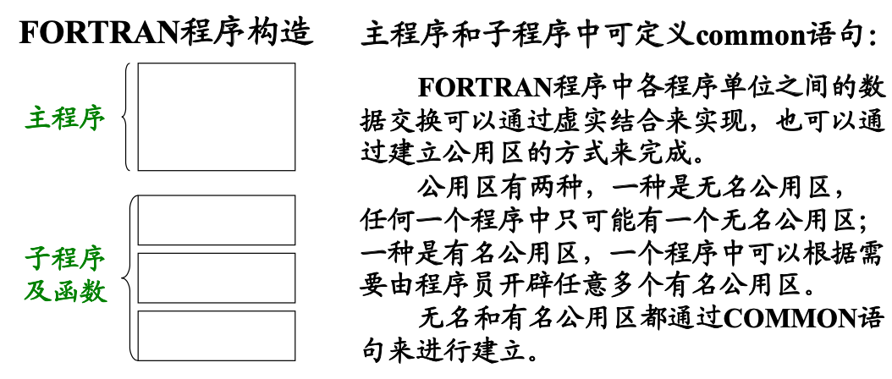
- IR(Intermediate representation)：不同层次的 IR 代表了不同层次的抽象(类型、操作)通过分层抽象,实现最大限度的重用。
- 错误分类：
  - 语法错误：不符合词法和语法规则的错误。
  - 语义错误：
    - 程序不合语义规则。比如说未定义，就使用。
    - 超越具体计算机系统的限制，比如说栈溢出，类型溢出等。

## 二、压缩文法

需要压缩文法包括两种：

- 有害规则，就是 $U::=U$ 这种，这种十分显然，所以就不说了。
- 多余规则，针对语法规则的左部（左部是一个符号），又分为
  - 不可达符号：就是这个左部没法由识别符号推出，那么就是不可达的。这种非常好识别，只需要进行一个符号的 BFS 即可。
  - 不活动符号，就是形如 $A ::= Aa $ 这样的规则，会导致一直循环，没完没了。

所谓的压缩文法，就是把这些规则都去掉的文法。在去除的过程中，有两点需要注意：

- 不活动符号的判定不仅与某条规则优化，而是与所有左部都是这个符号的规则有关，比如说如果只有 $A::=Aa$ 那么就是错误的，但是如果有 $A::=Aa | c$ 就是正确的。说穿了，“不活动”判定的是“符号”而不是规则。
- 任何规则被删除后，都需要重新考虑一遍是否有有害规则和多余规则，因为有的时候删除一些符号，会导致一些符号的性质发生转变。

$$
S ::= ABC | CD \\
A ::= Aa | a \\
B ::= Bb \\
C ::= Cc | c \\
D ::= Dd | d \\
E ::= e
$$

显然 $E$ 是一个不可达符号，同时 $B$ 是一个不活动符号。虽然也存在 $A::=Aa$ 这种规则，但是因为有 $A::=a$ 这种规则的存在，所以 $A,C,D$ 都不是，所以先删除 $B,E$
$$
S ::= ABC | CD \\
A ::= Aa | a \\
C ::= Cc | c \\
D ::= Dd | d
$$
这样如果结束了就错了，因为此时已经没有 $B$ 了，但是还存在 $S::=ABC$ 所以把这条规则删除
$$
S ::=  CD \\
A ::= Aa | a \\
C ::= Cc | c \\
D ::= Dd | d
$$
但是这时就会发现 $A$ 成了不可达符号，所以继续删除
$$
S ::=  CD \\
C ::= Cc | c \\
D ::= Dd | d
$$

## 三、逆波兰

> 后缀表达式被称为逆波兰表达式，同时也被称为波兰表达式

对于中缀表达式转换成后缀表达式，本来应该用栈结构和优先级进行一个操作，但是如此就太繁琐了，所以可以考虑画树，然后对树进行后序遍历，得到的遍历序列就是后缀表达式，举个例子
$$
A - (C + B) \times (D - C)
$$
有树

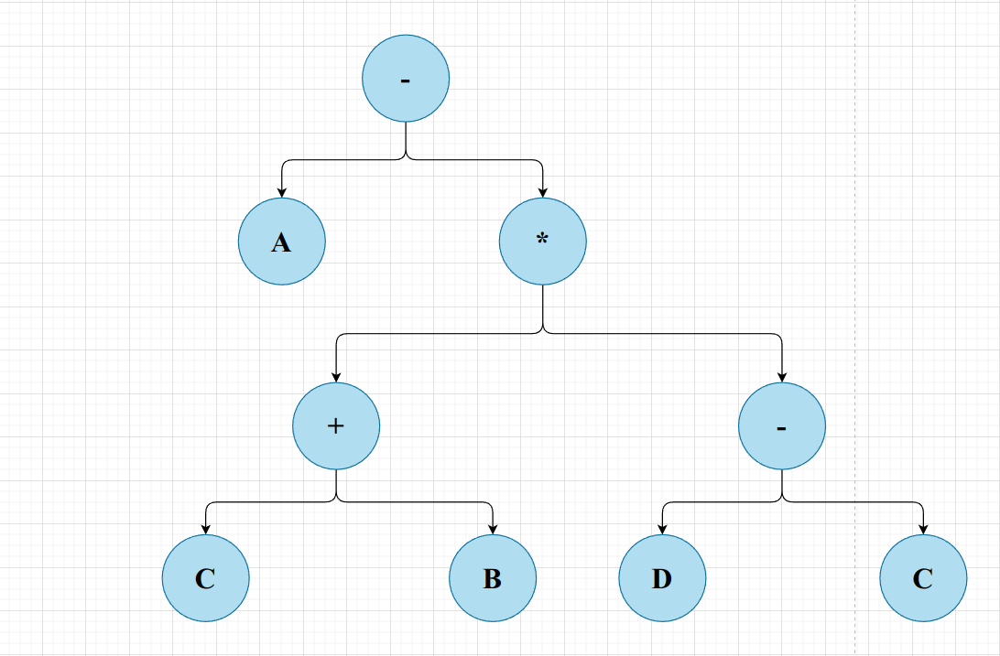

很容易就可以得到后序遍历序列：
$$
ACB+DC-*-
$$

## 四、动态存储分配

当进入一个程序模块（module）的时候，就需要在运行栈上压栈。说白了运行栈是程序的运行栈，而非某个模块的运行栈。

压栈的这个东西属于模块，是模块专用的数据区，被称为**活动记录（Activation Record，AR）**。

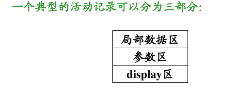

对于数据区，其功能十分显然：

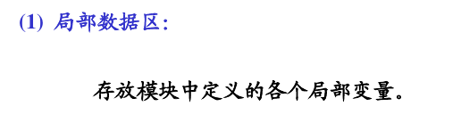

对于参数区，其分区为

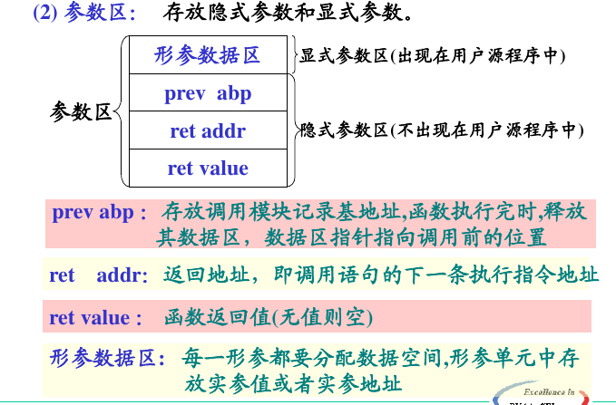

主要是对于 prevabp 的理解：**Previous Active Record Base Pointer 前一个活动记录的基地址**。说白了就是，在 mips 中，我们每次调用函数的时候，有一个栈增长操作，使用 `sub sp` 实现的，在结束调用后，又一个 `add sp` 的栈消减操作，这里不用对栈指针进行如此操作了，而是将栈指针直接填充成 prevabp 的值，完成弹栈操作。

关于 display 区，有

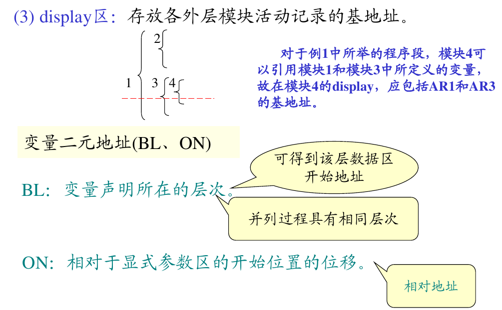

在讨论 display 的算法之前，还是先讨论一下 display 的作用，其作用是让内层模块方便的访问外层模块。那么为什么这么难理解呢？是因为 C 语言没有 display 区，而且 llvm 进一步弱化了“让内层模块方便的访问外层模块”这个需求。

对于 C 语言，没有在函数里定义函数的操作，所以函数是一个只会收到形参影响，并且只会通过返回值对外界造成影响的模块，不需要 display，对于 block 里面定义变量的情况，确实会有内外变量之分，但是在翻译 llvm 的时候，已经通过栈式符号表将内外变量重命名成两个变量了，同时消除了内外之分，所以在翻译成 mips 的时候并不需要 display。

关于 display 区的生成算法，一共有两条规则，都是极其直观好理解的，与栈结构类似：

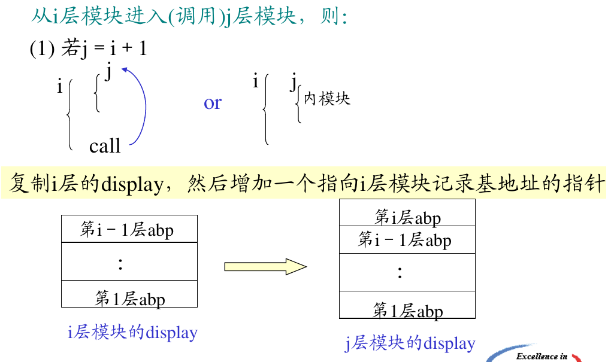

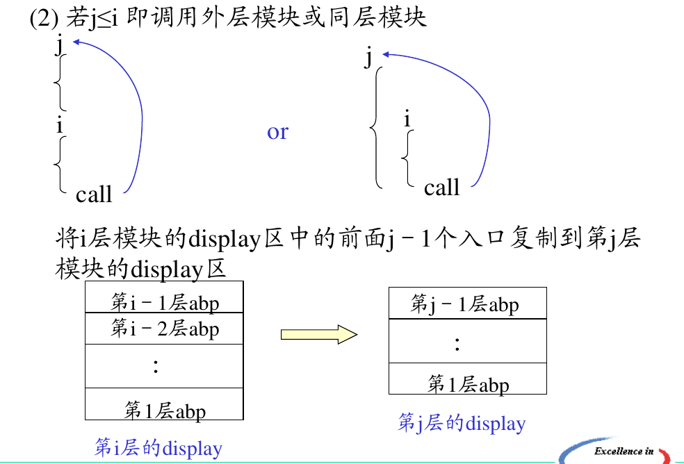

此外因为 display 区主要用于 pascal 程序，所以有必要掌握一些小语法，实例如下

```pascal
{程序名}
program calFactorialAndFubnacii;   
 {声明属于 program 的变量}
 var m: integer;
 {阶乘计算}
 function factorial(n: integer): integer;
 begin
     {这是一整条 if-else 语句，所以只有结尾有分号}
     if n < 2 then
         {函数名就是返回值}
         factorial := n
     else
         factorial := n * factorial(n - 1);
 end;
begin
 write('please input the value you want to calculate: ');
 { read 用于读入}
 read(m);
 {* 
 'string' 表示字符串
 write 可以连续输出
 writeln 用于换行，没法支持 \n 
 *}
 writeln('factorial of ', m, ' is ', factorial(m));
 {begin end. 是主程序}
end.
```

以一道题为例：

```pascal
program
    const ten = 10;
  	var i, j, k: integer;
        matrix: array[1..ten] of integer; 
    procedure add(m1, m2: integer; var rlt: integer);
        var tmp: integer;
		function mul(x, y: integer): integer;
        begin 
        	// 程序运行到了这里
        	mul := x * y
        end;
	begin 
  		tmp := mul(m1, m2);
		rlt := m1 + m2 + tmp;
    end;
begin 
	i := 1;
	j := 2;
	add(i, j, k);
	write(k);
end.
```

绘制运行栈。

> 因为涉及指针指向内容，很容易就画乱了，但是小测答案提供了一种比较简洁的方法，就是用文字说明，不手画指针了。

首先运行的代码如下

```pascal
program
    const ten = 10;
  	var i, j, k: integer;
        matrix: array[1..ten] of integer; 
begin 
	i := 1;
	j := 2;
	// 即将运行
	add(i, j, k);
	write(k);
end.
```

可以看到声明了 `i, j, k, matrix` 这几个局部变量（`ten` 是常量，并不放在动态区，而是有一个常数表，直接在编译期完成了替换，所以也不会出现在符号表中）。对于整型量，就直接声明即可，对于数组，需要记录一个数组模板（很显然的），然后再记录。

因为是主函数，所以不存在参数区和 display 区。

所以最终栈结构如下所示

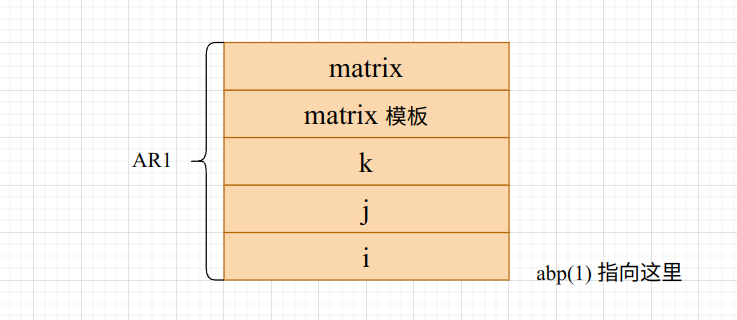

然后运行 `add(i, j, k)`

```pascal
procedure add(m1, m2: integer; var rlt: integer);
	var tmp: integer;
	function mul(x, y: integer): integer;
	begin 
		mul := x * y
	end;
	begin 
		// 即将运行这里
		tmp := mul(m1, m2);
		rlt := m1 + m2 + tmp;
end;
```

可以看到 `add` 这个模块声明了 3 个形参 `m1, m2, rlt` ，一个局部变量 `tmp`。所以需要在栈上体现。

同时 `add` 是一个过程，所以没有返回值。最终栈结构如下（图里的 `retadd(1) 指向这里` 错了，返回值具体没法在栈上定位，他指向代码段 ）

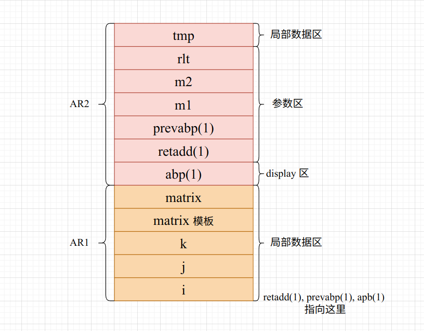

然后运行这里

```pascal
function mul(x, y: integer): integer;
begin 
	// 程序运行到了这里
	mul := x * y
end;
```

这里声明了 `x, y` 两个形参，还有一个返回值。

display 区的生成需要先拷贝，再加一条

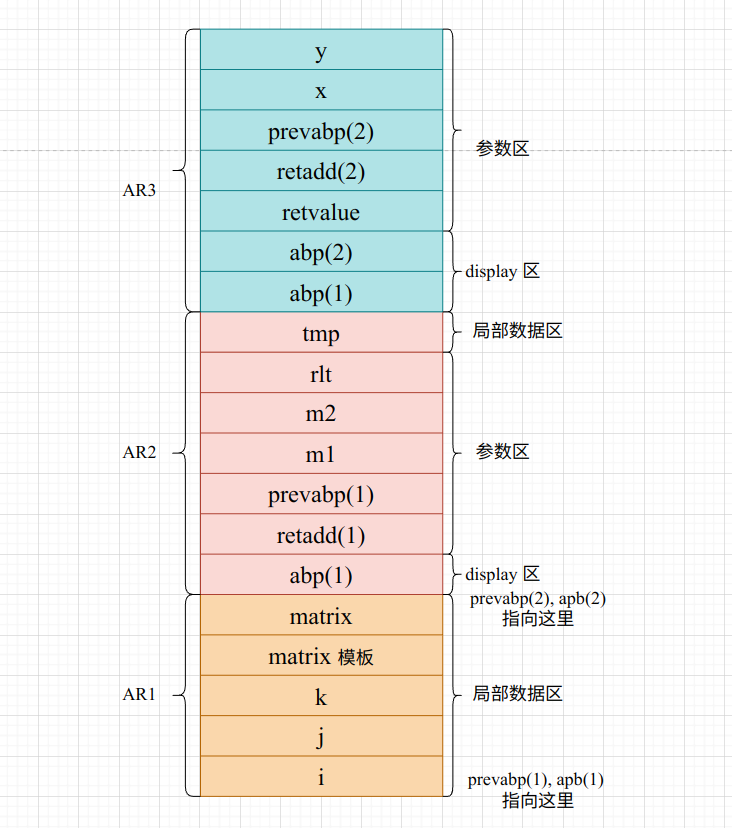

## 五、栈式符号表

> 这个东西很显然，基本上就用在 llvm 的生成过程中，是一个很显然的过程。唯一需要注意的就是表头问题。
>
> 类型就是是什么数据类型的，而种类则包含一定的语义信息，比如说是参数还是变量之类的。

对上面那个 `pascal` 代码建立符号表

| 序号 | 名字   | 种类  | 类型  | 层次 |
| ---- | ------ | ----- | ----- | ---- |
| 1    | ten    | const | int   | 1    |
| 2    | i      | var   | int   | 1    |
| 3    | j      | var   | int   | 1    |
| 4    | k      | var   | int   | 1    |
| 5    | matrix | var   | array | 1    |
| 6    | add    | proc  |       | 1    |
| 7    | m1     | para  | int   | 2    |
| 8    | m2     | para  | int   | 2    |
| 9    | rlt    | para  | int   | 2    |
| 10   | tmp    | var   | int   | 2    |
| 11   | mul    | func  | int   | 2    |
| 12   | x      | para  | int   | 3    |
| 13   | y      | para  | int   | 3    |

