## 一、文法的种类

### 1.1 分类定义

Chomsky 文法定义：

- $G = (V, V_t, P, Z)$
- $V$：符号集合
- $V_t$：终结符号集合
- $P$ ：有穷规则集合
- $Z$：是被符号，不能是终结符

关于不同文法的区别

| 类型     | 定义                                | 接受               | 重点                                                         |
| -------- | ----------------------------------- | ------------------ | ------------------------------------------------------------ |
| 0 型文法 | $\alpha::=\beta$                    | 图灵机             | 由字符串推导出另一个字符串，对于左部和右部都没有限制         |
| 1 型文法 | $\alpha U \beta ::= \alpha u \beta$ | 线性界限的图灵机   | 要求左部必须有一个非终结符，而且一次只能改变一个非终结符，同时具有上下文敏感的特性 |
| 2 型文法 | $U::= \alpha$                       | 不确定的下推自动机 | 左部只能有一个非终结符（也就是上下文不敏感的），但是对于右部没有限制 |
| 3 型文法 | $U::=Va, U:: = a$                   | 有穷自动机         | 右部一定会推出终结符，而且右部很规则                         |

在判断文法的时候，因为不同文法呈现包含关系，所以应当按照 $3 -> 2 -> 1 -> 0$ 的顺序去判断。

当一个文法的右部呈现正则形式的时候，那么为 3 型文法，否则判断左部，如果左部都是一个非终结符，那么就是 2 型。然后判断是否每条规则只改变一个非终结符，不是则为 0 型。

### 1.2 三型文法直观感受

因为只有两种推导形式，所以其语法树会长得很“偏瘫”，比如说对于左线性文法，就是长成这个样子的：

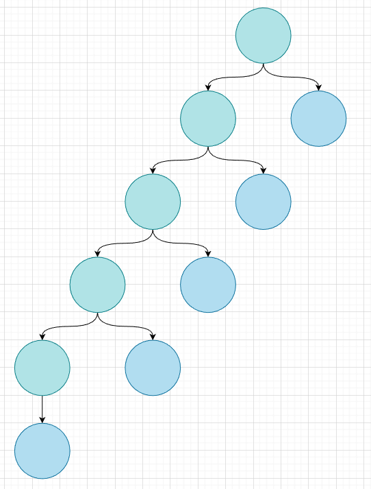

正是因为这种“偏瘫”的性质，才使得有限状态机成为接受三型文法的工具，可以一个个字符的读入，而且没有“回溯”过程。其推导的过程就好像我们平时书写一样，成一个**线性**的趋势。

### 1.3 上下文无关特性

我们说大部分高级程序设计语言都是二型文法，具有上下文无关的特性，但是其实对于复杂特性的语言，比如说 CPP（对，又是它），他是具有上下文敏感的特性的，比如说

```cpp
a<b<c>> d
```

可以被理解成一个

```cpp
vector<vector<int>> matrix;
```

也可以被理解成位运算

```cpp
int x = 4 < 3 < 2 >> 1
```

所以在“不引入符号表”（可以看做符号表就是记录上下文信息的工具）的前提下，是没有办法进行语法分析的，所以 CPP 会进行一种“试错式”的语法分析，就好像我们的错误处理一样。

递归下降法更适合分析二型文法（也不是完全都可以分析出来），而不适合分析一型文法，所以在实验课中，一旦引入错误处理（也就是相当于引入了一些一型文法）就会导致语法分析没有办法是朴素的递归下降，而是必须进行尝试性回溯，这是递归下降的局限性。

有一个观点很有意思，就是词法分析，语法分析，语义分析其实完成的是同一个任务的不同部分，所以我们在设计的时候，可以考虑将总任务分给这三个部分，当一个部分被设计的简单的时候，另一个部分就会被设计的复杂，比如说 python 如果按照普通理解，其实是一型文法，因为缩进的原因，语法变得上下文敏感了，但是实际上是二型文法，这是因为缩进在词法分析的时候被处理成了“缩进增”和“缩进减”，这与“左大括号”和“右大括号”是等价的。另一个例子，肯定程序本身是上下文相关的（又不是计算器），那么相当于符号表这类语义分析中上下文敏感的实现，代替了复杂的语法分析，使得语法分析可以很简单。

另外文法不仅和表达能力相关，它同时也与计算能力相关，所以只有 0 型文法具有图灵机的全部能力，严格讲高级语言并不能够发挥出其全部实力。据说 lisp 是基于 0 型文法的。

### 1.4 文法的等价性

文法的等价性指的是如果两个文法描述的语言是相等的，那么就称这个两个文法是等价的，也就是说，这并不涉及文法的本身性质，一个三型文法可以与一个一型文法等价，并无大碍。

---


## 二、正则转换

### 2.1 等价转换框架

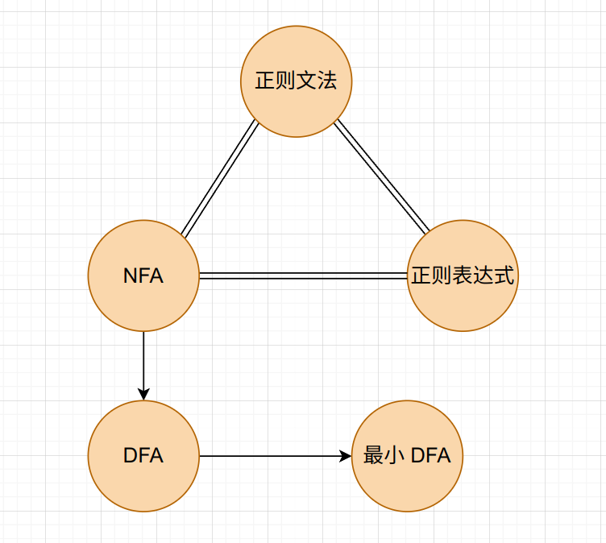

如图所示，图上的这五种东西是等价的，并且是可以相互转化的（虽然有一些是没有意义的），下面将分别介绍。

### 2.2 正则文法与 DFA 转换

> 正则文法又称为 3 型文法。正则文法有两种，左线性和右线性，分别长这样
>
> - 左线性：A ::= Bt
> - 右线性：A ::= tB
>
> 之前觉得正则文法就已经可以描述很多东西了（我以为 SysY 是可以用正则文法表示的），但是其实正则文法连基本的表达式都没有办法表达。所以正则一般都用于词法分析，语法分析其就不适用了。

首先讨论正则文法转换为 DFA

对于左线性文法，有如下方法

- 对于 $A ::= Bt$ ，有 $\delta(B, t) = A$
- 对于 $A ::= t$，有 $\delta(S, t) = A$ ，其中 $S$ 为状态机的起始状态
- 状态机只有一个终止状态 $Z$ ，同时 $Z$ 是正则文法的起始符号（识别符号）。

举个例子

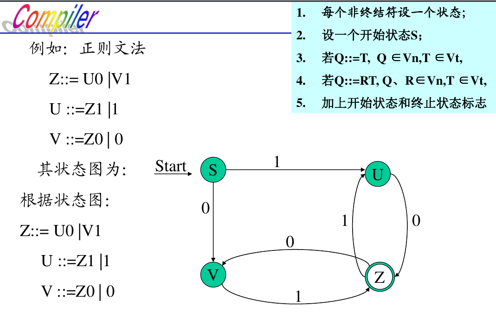

不可否认，左线性有些不自然，因为明明是 $A \rightarrow B$ 这种规则，但是最后的边却是 $B \rightarrow A$ ，恰恰反过来，但是并非毫无道理，相反，当前状态代表着已经规约的非终结符，是一种自底向下的过程，进行最左规约，如下所示

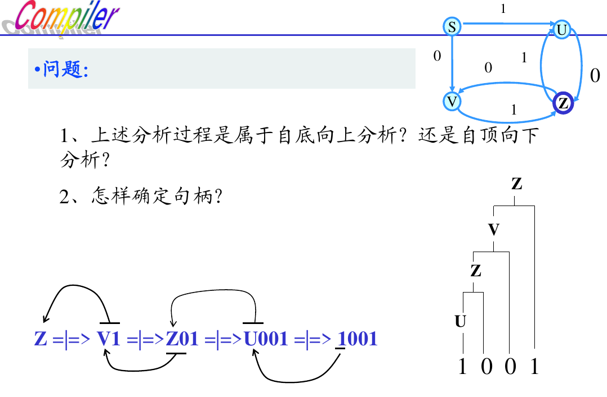

对于右线性文法：

- 对于 $A ::= tB$ ，有 $\delta(A, t) = B$
- 对于 $A ::= t$，有 $\delta(A, t) = Z$ ，其中 $Z$ 为状态机的终止状态
- 状态机只有一个起始状态 $S$ ，同时 $S$ 是正则文法的起始符号（识别符号）。

这就很好理解，这是一个自顶向下的过程，当前状态是要解析的非终结符。这么看，正则文法真的有很多很好的性质，他们的 $FIRST$ 和 $FOLLOW$ 都是直白的，这就导致其对于语法规则的选择很简单。

对于 DFA 转换成正则文法，一般转换为左线性文法，并不可以直接看成逆过程，有如下规则

- 对转换函数 $\delta(A, t) = B$ ，可写成一个产生式：$A ::= tB$
- 对于终止状态，可写成一个产生式：$Z::=\varepsilon$ 
- DFA 的初态对应于文法的开始符号（识别符号）。

如下示例：

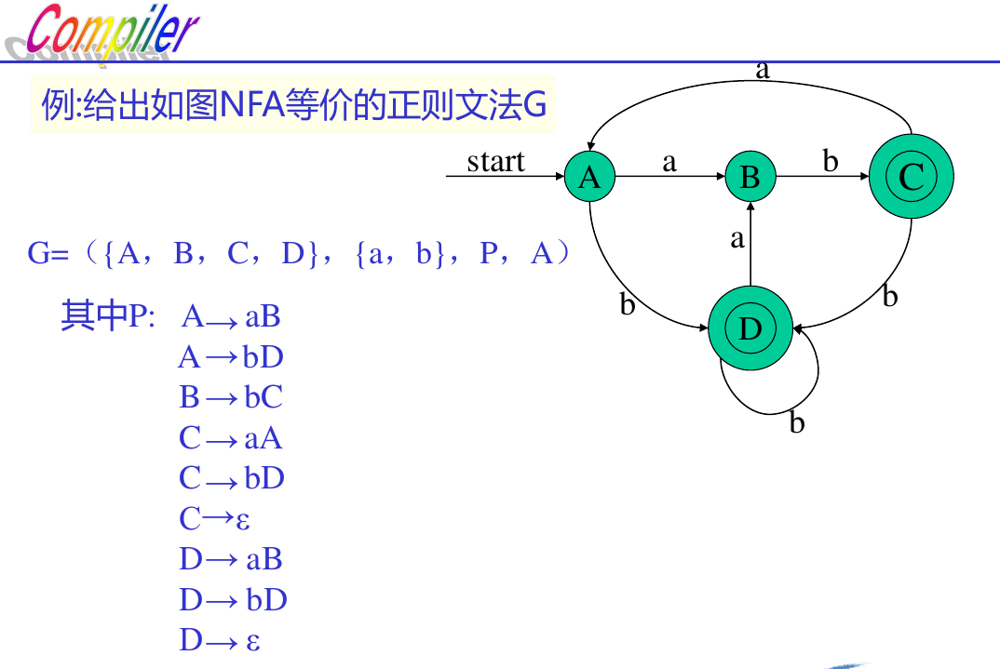


### 2.3 正则文法与正则表达式

比较简单，需要注意的是，当正则文法向正则表达式转换的时候，应用的不只是转换法则，还有正则表达式的运算。

由正则文法转正则表达式：

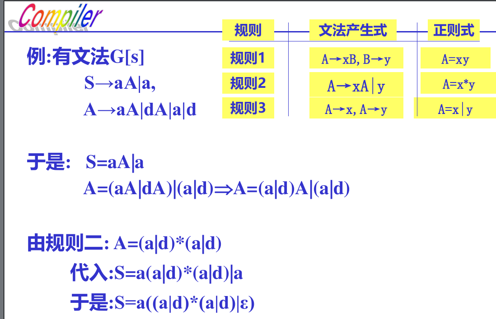

由正则表达式转正则文法：

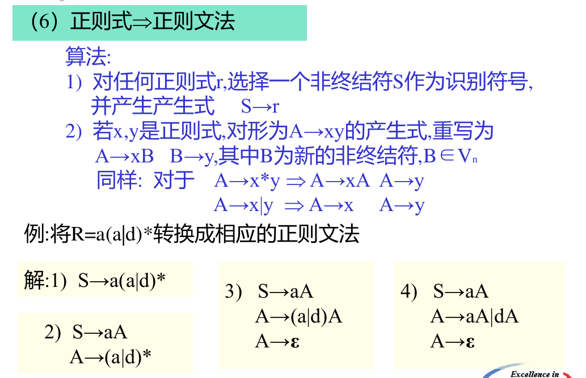


### 2.4 正则表达式与 NFA

第一条规则描述的是很“显然”的事情，他说的是，对于一个正则表达式，它天然拥有“开始”和“终止”两个状态，他们中间会有一条边或者一堆状态和一堆边。

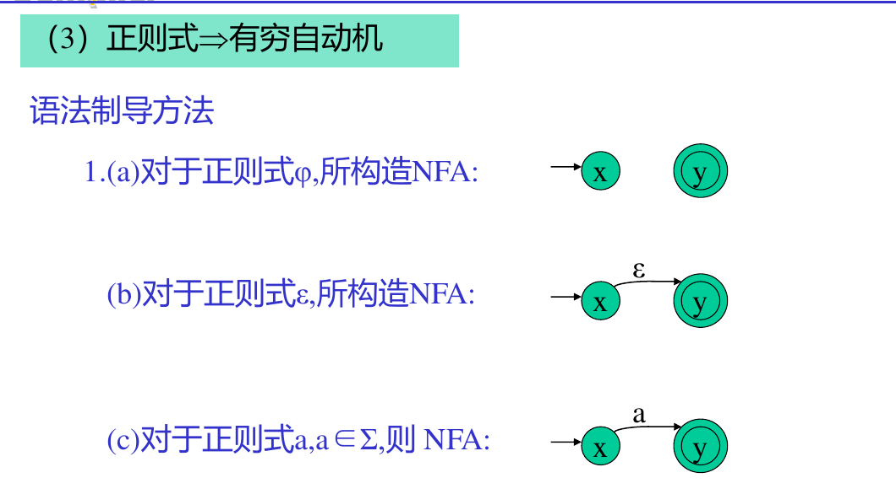

在这里其实可以反思一个事情，就是在 DFA 或者在 NFA 中，绝对不会有从一个状态中出现两条相同的边，也就是

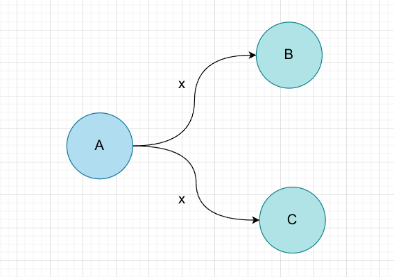

这是显然的，因为这样在 $A$ 状态输入 $x$ ，就并不知道是应当转移到 $B$ 还是应当转移到 $C$ 。但是对于 $\epsilon$  却没有这个约束，如下所示

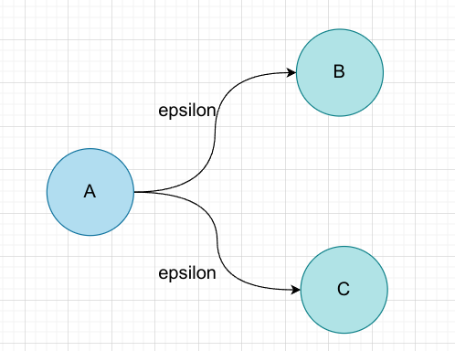

下面的规则都是这种现象的体现，他们会给 NFA 引入大量的 $\epsilon$ 。这显然是不利于 NFA 到 DFA 的化简的（后面的例题也有说明），为了规避这种现象，我们考虑将一些的 $\epsilon$ 化简掉。在化简中，这样形式的正则表达式可以十分有用
$$
X = aYb
$$
  其中 $Y$ 可以是任何正则表达式，$a, b$ 是终止符，这个表达式意味着，$X$ 一定是由 $a$ 开头，由 $b$ 结尾，这个是一个很好的性质，我们可以将开头的 $\epsilon$ 和结尾的 $\epsilon$ 可以分别被替换成 $a, b$ 。这种替换只要不会导致 NFA 的定义被违反（也就是上面提到的情况），那么就是可行的。


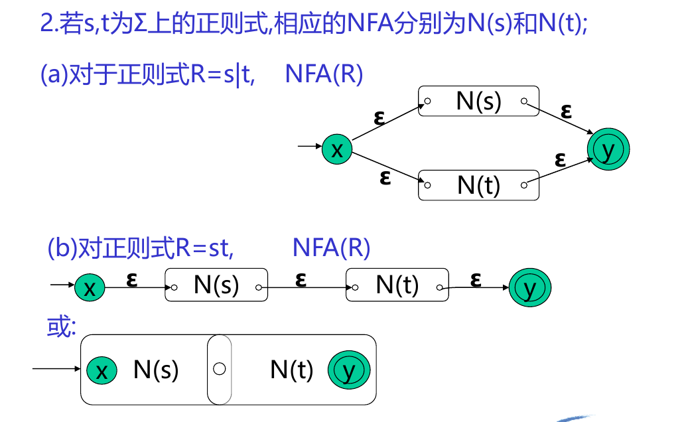

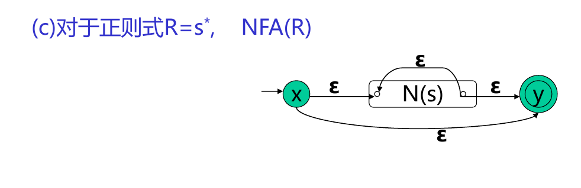

反之：

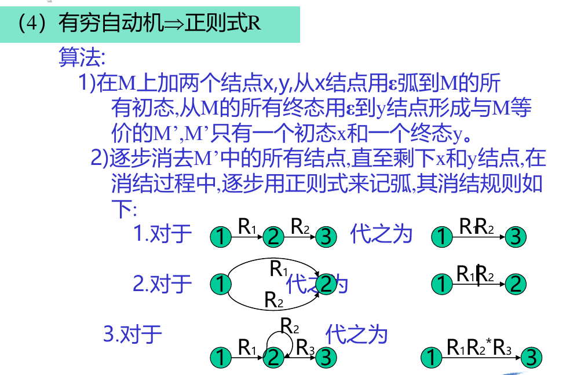


### 2.5 NFA 转 DFA

首先是确定 $I(S)$ 这是一种 $I-\varepsilon$ 闭包，说的是开始状态和可以通过 $\varepsilon$ 到达的状态组成的集合。

然后需要通过边访问，比如说 $I_a(S)$ ，表示的是通过 $a$ 这条边， $I(S)$ 可以到达的状态的集合，而且这个集合中还有通过 $\varepsilon$ 到达的状态，换句话说，也是闭包。

然后就这么周而复始的运动即可。

实际操作的时候是真的难，首先是这种题一般是给出正则表达式，然后求最小 DFA。那么如果不幸构造出一个极其复杂的 NFA，那就真的完蛋了，比如说下面的例子，如果按照规则构造的话，是这样的
$$
\tt{a((a|b)*|ab*a)*b }
$$
正常构造是 7 个状态

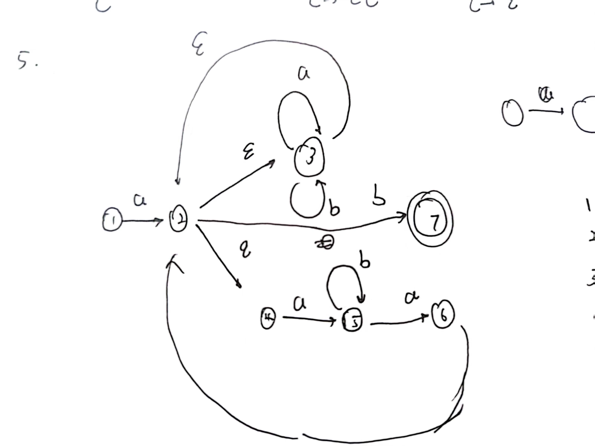

然后就会陷入无限的求解闭包的过程（甚至 DFA 的状态比 NFA 还多）中，所以应当用前面介绍的方法，先手动化简成这样

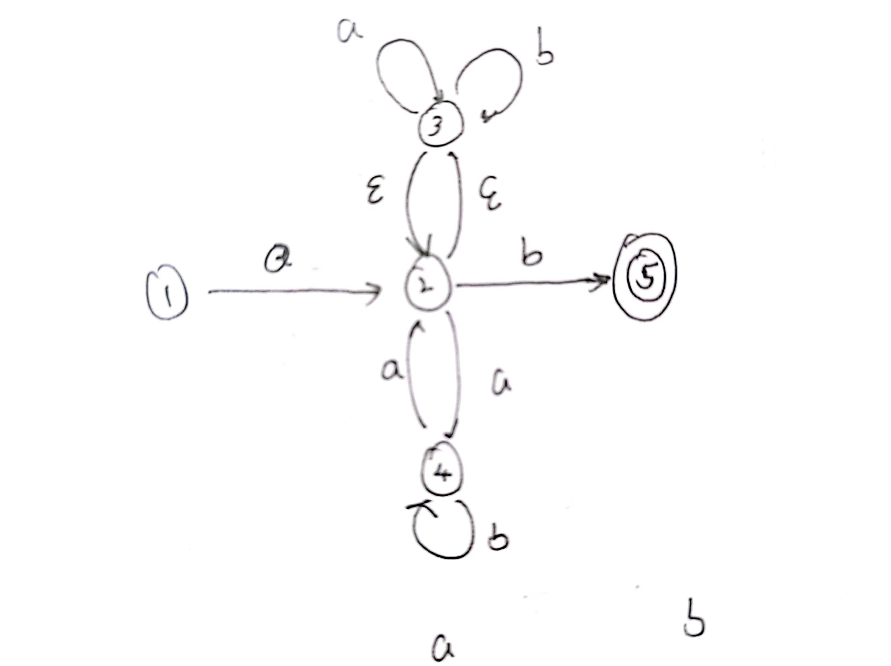

具体的过程是这样的，考虑题目
$$
\tt{a((a|b)*|ab*a)*b }
$$
可以知道，大概会翻译成这样

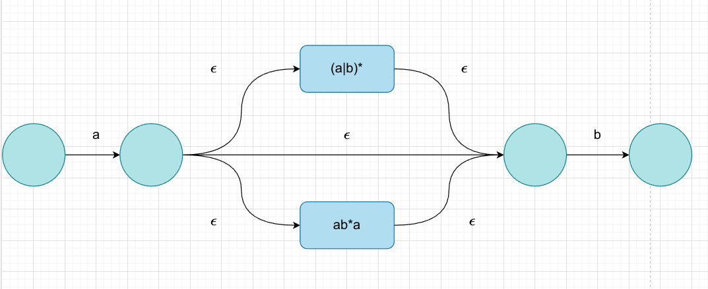

然后进行一个显然的化简

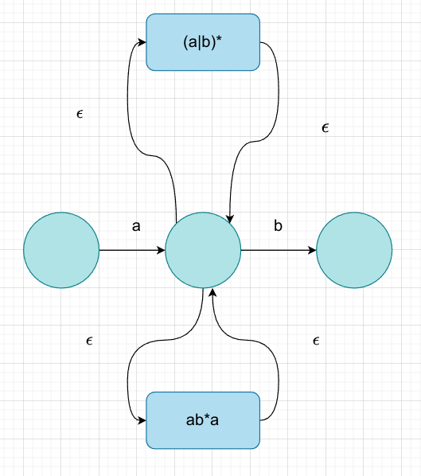

然后观察子正则表达式，发现 $\tt{ab*a}$ 发现他是以 $a$ 开头结尾的，所以可以进行化简

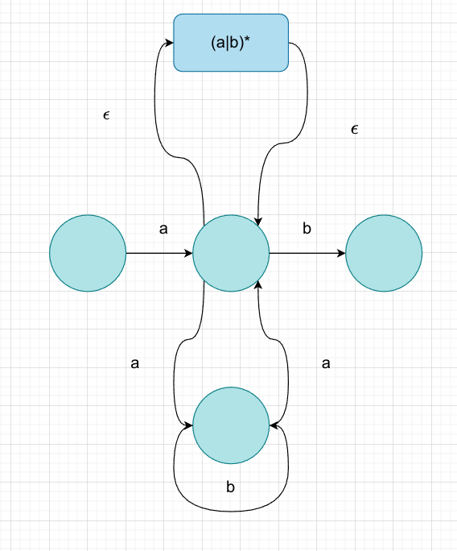

其核心在于不能让一个状态有两个同为 $\varepsilon$ 的出边或者入边，显然是可以化简的，而且这种太难搞了。

然后进行化简的时候，可以考虑先对于每个状态求一遍闭包，这样对于多个状态的合并，就不需要多次重复计算了，如下所示

| 状态 | a       | b       |
| ---- | ------- | ------- |
| 1    | 2, 3    |         |
| 2    | 3, 4    | 2, 3, 5 |
| 3    | 2, 3, 4 | 3, 5    |
| 4    | 2, 3    | 4       |
| 5    |         |         |

这里一定要小心谨慎，因为一不小心就错了。

然后就可以进行查表求解过程了，因为 DFA 的状态也需要标识，所以建议用英文字母与原来 NFA 的阿拉伯数字区分

| DFA  | NFA        | a       | b          |
| ---- | ---------- | ------- | ---------- |
| A    | 1          | 2, 3    |            |
| B    | 2, 3       | 2, 3, 4 | 2, 3, 5    |
| C    | 2, 3, 4    | 2, 3, 4 | 2, 3, 4, 5 |
| D    | 2, 3, 5    | 2, 3, 4 | 2, 3, 5    |
| E    | 2, 3, 4, 5 | 2, 3, 4 | 2, 3, 4, 5 |

### 2.6 最小化 DFA

> 采用分割法进行计算，不过必须要承认，这个方法实际上的如果按照严谨的计算，那么运算量是极其复杂的，是没有办法很容易的得出答案，在得出答案的过程中，还需要不断的依靠直觉，而且似乎具有某些不动点算法的性质。
>
> 最小化 DFA 干的事情就是将 DFA 中“等价”的状态合并到一起，主要考虑两个条件：
>
> - 一致性条件：状态 $s$ 和状态 $t$ 必须同时为接受状态或者非接受状态。这个很显然，也很好判断。
> - 蔓延性条件：对于所有的输入符号，状态 $s$ 和状态 $t$ 必须转换到等价状态里。这个就是很符合直观认知的，但是很难应用，因为等价状态是一个变化的东西。
>
> 在教材上，只是用例子演示了一下，并没有完整的算法。我凑活写了一个：
>
> - 首先利用一致性条件，将状态划分为两个集合。
> - “认为“此时每个集合里的每个状态都是等价的。
> - 基于第二点，遍历集合中的每个状态，利用蔓延性条件检验是否真的与该状态所在集合的其他状态等价，当出现不等价情况，分割集合，回到第二点。如果所有状态均检查完毕，则算法结束。

以一道题举例：这是状态转移表

|      | a    | b    |
| ---- | ---- | ---- |
| 1    | 6    | 3    |
| 2    | 7    | 3    |
| 3    | 1    | 5    |
| 4    | 4    | 6    |
| 5    | 7    | 3    |
| 6    | 4    | 1    |
| 7    | 4    | 2    |

其中接受状态是 $\{5, 6, 7\}$ 。

原题在求解的时候，在这张表的右侧拓展了一列，用于分区，但是这是不严谨的，因为我们并不保证等价状态一定在表上挨在一起。所以考虑手写集合。

首先根据一致性条件划分出两个集合

$\{1, 2, 3, 4\}, \{5, 6, 7\}$

然后遍历 1，发现 2 和 1 等价，但是和 3 不等价，所以分割出 1，2

$\{1, 2\}, \{3, 4\}, \{5, 6, 7\}$

此时遍历 1，2 没有问题，遍历 3，发现和 4 不等价，所以分割数 3

$\{1, 2\}, \{3\}, \{4\}, \{5, 6, 7\}$

遍历 1，2，3，4 没有问题，遍历 5，发现与 6 不等价，所以分割 5

$\{1, 2\}, \{3\}, \{4\}, \{5\}, \{6, 7\}$

检查完毕，算法结束。

