## 一、直观理解

### 1.1 语法分析的目的

语法分析是在进行完词法分析后进行的步骤，词法分析会将一个个的字母拆解成不同的符号，这些符号会被组成一个线性的数组交给语法分析部分，语法分析不会会将这个线性的数组重新组织成一个语法树，交给后面的语义分析部分。

至于为什么要组织成一个**树形结构**？其实也并不是一个必选项，其实本质是这个线性数组可以被语法规则完全的接受。只不过是因为特定的语法规则刚好可以被组织成一个语法树的形式（语法树可以看做是语法分析的“历史记录”），而且语法树的结构又被后面的语义分析部分所需要，所以我们才恰好需要这棵语法树。

### 1.2 编译中的矛盾

#### 1.2.1 推导和规约

推导（**derivation**）和规约（**reducation**）是针对语法规则进行的两个相反方向的过程，如下图所示

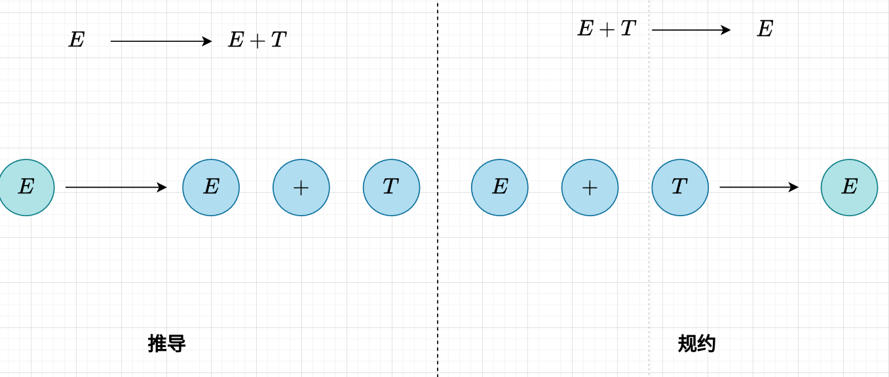

如果结合语法树来看，推导是有一种让语法树“向下遍历”的趋势的（越来越具体），规约是有一种让语法树“向上遍历”的趋势的（越来越抽象）。两者的本质都是依赖于语法规则。

那么到底我们平时是用哪一种呢？这其实对应了 LL 和 LR 两种语法设计思路，在 LL 中采用的是推导的方式，而在 LR 中采用的是规约的方式。具体的对比需要之后说，这里只是一个铺垫。

#### 1.2.2 规范规约

不可否认，无论是规约还是推导，都可以有多种思路的，先推左边的，后推右边的，想怎么推怎么推，想怎么规约就怎么规约。

在众多的方式中，有一种推导被我们称为了**规范推导**，也就是这样这样的
$$
xUy \rightarrow xuy, y \in V_t^*
$$
在这个推导中，我们进行了这样的 $U \rightarrow u$，这个的最关键的地方是，$y \in V_t^*$ 这个条件，这说明 $U$ 后面的东西都推导完了，才可以推导 $U$ 。更加直观的说，按照这个方法推导，一个句子的最右侧会最先诞生（也就是终结符会从最右侧诞生），然后直到整个句子全部变成终结符。

这是一个相当反直觉的事情，因为正常人都是从左往右去看一个字符串的，当你尝试推导的时候，一定是从左侧开始尝试，比如说 $FIRST$ 集就是一个看左侧是啥字符来判断推导哪个语法规则的辅助工具，没有人会从后面开始推。所以应该这样理解，这个东西本身就是不自然的，那么为什么一个不自然的东西会被称为“规范”呢？那是因为它是“规范规约”的**逆过程**，而**规范规约**才是真正自然的事情。

规范规约描述的是这样的过程，当我们进行规约的时候，优先规约当前规约的句柄，也就是**优先规约最左简单短语**。这就是一个很自然的事情，因为我们依然是从左向右读取字符串，所以读一点就规约一点，就是一个十分自然的事情。

再说得武断一些，“规范”概念的提出，就是为了服务“自底向上”的语法分析方法，也就是建立在**规约**基础上的分析方法。

#### 1.2.3 句柄

可以首先解释一下对于“柄（handler）”的概念，这个东西如果直译是“把手”的意思，我对其的理解是，一个复杂的物体，我们没办法直面它，所以只能先用一个它的简单的“把柄”来操控它。这个理解相对于网上常见的“柄是一个东西的代表”增加了“复杂和简单”的概念，同时模糊了“柄和它所指代的物品之间的同质性”，是我比较满意的地方。

比如说在 C 语言中，有 `File Handler` 的东西，这是因为实际上我们并没有办法直接操作文件，所以我们只能借由一个文件句柄来操作它。又或者方向盘也可以看做是车的 `handler`，我们没有办法直接操控车的轮子和引擎，但是我们可以操纵车的方向盘，但是我们并不可以说方向盘是车的代表。

之所以要强调这个，是因为在语法分析中，句柄相对于句型或者句子（这取决于这个句型是否全是终结符），大致与上面探讨的关系类似，句柄可以“暗示”句型的语法树的部分特征，“指导”部分的规约的进行。

之所以有这个效果，是因为句柄的定义是“最左简单短语”，“简单”的深层次理解是这样的，它代表了一种“一个语法规则”的应用，因为显然一个语法规则对应着一个高度为 2 的语法子树，这和简单短语的定义有着一定的相似性，换句话说，简单短语限制了规约“必须是一步一步的进行”的这个特点，而“最左”则限制了规约发生的位置。

#### 1.2.4 LL 和 LR

教材中这个部分的内容十分的分散，我将其整合起来，希望得到一定好的对比

| entry    | LL                                | LR                                 |
| -------- | --------------------------------- | ---------------------------------- |
| 基础     | 推导（derivation）                | 规约（reducation）                 |
| 产物     | 最左推导                          | 最左规约（而不是所谓的“规范推导”） |
| 方向     | 自顶向下                          | 自底向上                           |
| 树遍历   | 前序遍历                          | 后序遍历                           |
| 动作     | 前瞻（Prediction）、匹配（Match） | 移进（Shift）、规约（Reducation）  |
| 前瞻目的 | 确定推导的方向                    | 确定动作是移进还是规约             |
| 典型     | 递归下降法、LL(1)                 | 算符优先法，SLR，LR(1)，LALR       |
| 使用范围 | 小                                | 大                                 |

关于为啥 LR 的使用范围比同级（也就是前瞻相同的符号个数）的 LL 要强，可能在于他们前瞻的目的是不同的，LL 依赖与前瞻去决定推导方向，这是重中之重，但是 LR 仅仅是用于解决动作的冲突。这可能是由于 LR 的前期预处理工作做得更好，对于语法的分析更加细致导致的。

### 1.3 多种概念的直观理解

**每个句型对应一个语法树**

**短语的全称：**

- 属于某个**句型**
- 相对于**某个非终结符**

当我们找短语的时候，首先先根据句型画出语法树，然后遍历语法树的子树（这个子树包括语法树本身，其实就是遍历非叶子节点）（不遍历叶子节点的原因是叶子节点没有推导过程，而定义中要求最少经过一步推导，所以叶子节点一定不是），非叶子节点的叶子子孙（也就是不必须是子代节点）组成了短语，这个非叶子节点就是“相对于**某个非终结符**”的那个“非终结符”。如果叶子节点都是这个节点的子代，那么就被称为简单短语。

不过我们一般不强调“相对于**某个非终结符**”这个属性，所以说到短语，直说他是某个句型的短语。

$E$

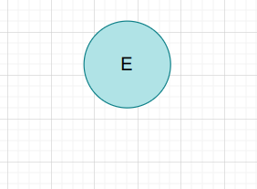

它没有非叶子节点，所以就没有短语，所以啥都没有

$T$

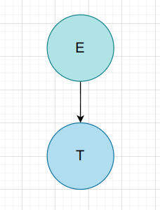

| 非叶子节点 | 短语 | 简单短语 | 句柄 | 素短语 |
| ---------- | ---- | -------- | ---- | ------ |
| E          | T    | T        | T    |        |

$i$

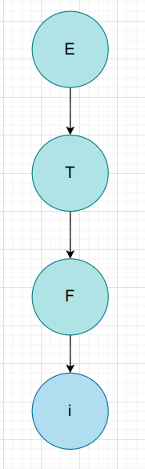

| 非叶子节点 | 短语 | 简单短语 | 句柄 | 素短语 |
| ---------- | ---- | -------- | ---- | ------ |
| E          | i    |          |      | i      |
| T          | i    |          |      | i      |
| F          | i    | i        | i    | i      |

$T * F$

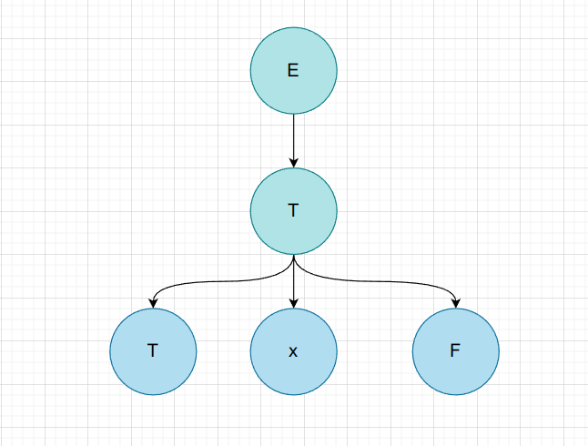

| 非叶子节点 | 短语  | 简单短语 | 句柄  | 素短语 |
| ---------- | ----- | -------- | ----- | ------ |
| E          | T * F |          |       | T * F  |
| T          | T * F | T * F    | T * F | T * F  |

$F * F$

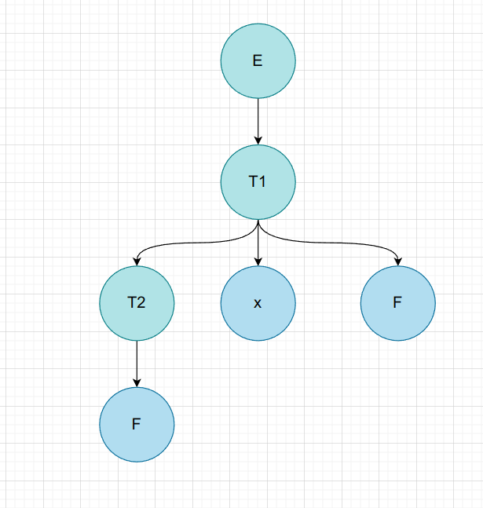

| 非叶子节点 | 短语  | 简单短语 | 句柄 | 素短语 |
| ---------- | ----- | -------- | ---- | ------ |
| E          | F * F |          |      | F * F  |
| T1         | F * F |          |      | F * F  |
| T2         | F     | F        | F    |        |

$i * F$

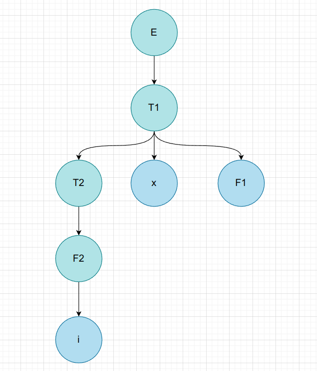

| 非叶子节点 | 短语  | 简单短语 | 句柄 | 素短语 |
| ---------- | ----- | -------- | ---- | ------ |
| E          | i * F |          |      |        |
| T1         | i * F |          |      |        |
| T2         | i     |          |      | i      |
| F2         | i     | i        | i    | i      |

$F * i$

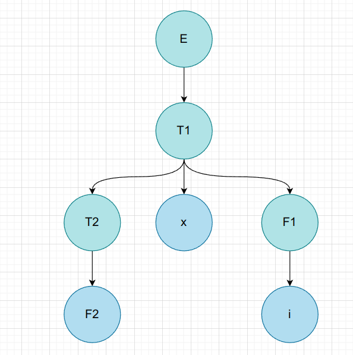

| 非叶子节点 | 短语  | 简单短语 | 句柄 | 素短语 |
| ---------- | ----- | -------- | ---- | ------ |
| E          | F * i |          |      |        |
| T1         | F * i |          |      |        |
| T2         | F     | F        | F    |        |
| F1         | i     | i        |      | i      |

$F + F + F$

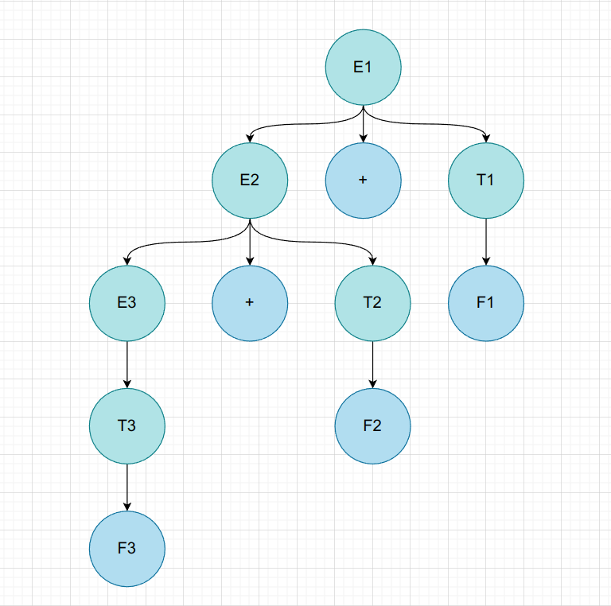

| 非叶子节点 | 短语      | 简单短语 | 句柄 | 素短语 |
| ---------- | --------- | -------- | ---- | ------ |
| E1         | F + F + F |          |      |        |
| E2         | F + F     |          |      | F + F  |
| T1         | F         | F        |      |        |
| E3         | F         |          |      |        |
| T2         | F         | F        |      |        |
| T3         | F         | F        | F    |        |

> 不得不说，这种列表法是有一定问题的，对于短语和简单短语，确实是可以每个非叶子节点都立即得出的，而对于句柄，其实是在得到所有的简单短语后，挑选最左面的简单短语获得的；而对于素短语，则是得到所有的短语后，从中挑出含有非终结符的最短短语。

### 1.4 语法范围

如图所示

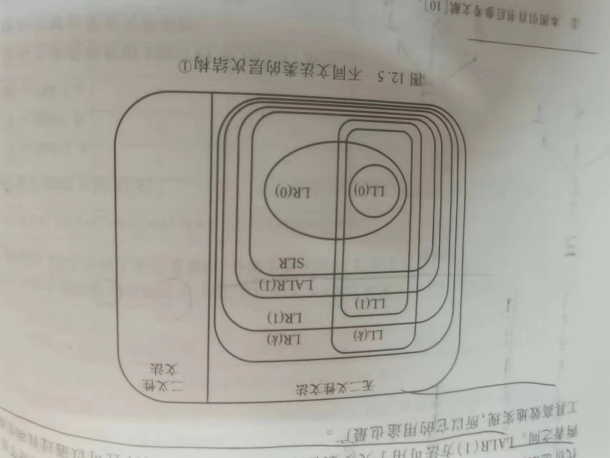

有如下规律：

- LR 一定包括同级的 LL
- LR(1) 的功能最强，适应范围最广，但是实现的代价最大
- LALR(1) 可用于大多数程序设计语言，用途最广
- SLR 最容易实现，但是功能最弱

---

## 二、自顶向下方法

### 2.1 递归下降法

#### 2.1.1 直观理解

递归下降法当然很好理解了，但是递归的简洁性掩盖了递归下降法和 LL(1) 的相似性，其实它俩基本上就是一个方法，递归下降法也可以用栈来实现，栈里的内容刚好是 LL(1) 中栈的内容，越靠近栈底，层次越高。

当然递归下降法还是和 LL(1) 有所区别的，因为 LL(1) 相当于仅仅是利用 $FIRST$ 集合，如果是 LL(2) 则是利用了 $FIRST, SECOND$ 集合，而递归下降在使用的时候则没有那么多的讲究，是一个相当工程化的方法。

斗胆猜测，LL 方法正式递归下降法的形式化表述。

#### 2.1.2 消除左递归

首先是对于直接左递归的消除，核心在于这条规则，如果有左递归式呈现这种样式
$$
A ::= a \space|\space b \space|\space c \space|\space d \space|\space ... \space|\space Au
$$
那么消除左递归后为
$$
A ::= (a \space|\space b \space|\space c \space|\space d \space|\space ...)\{u\}
$$
这个转换分为两个部分 $(a \space|\space b \space|\space c \space|\space d \space|\space ...)$ 和 $Au$ 。第一个只重复一遍，后面的重复 0 到多次。这个在教材中被称为“规则2”，那么规则 1 是什么？是为了应付这种情况
$$
A ::= a \space|\space b \space|\space c \space|\space d \space|\space ... \space|\space Au \space|\space Av
$$
规则 1 为提取公因式，说的是这种现象
$$
Au \space|\space Av = A(u \space | \space v)
$$
只要利用这个规则，就可以将上面的式子整理成了
$$
A ::= a \space|\space b \space|\space c \space|\space d \space|\space ... \space|\space A(u \space|\space v)
$$
然后利用规则 2，消除左递归
$$
A ::= (a \space|\space b \space|\space c \space|\space d \space|\space ...)\{u \space | \space v\}
$$
对于间接左递归，需要先对语法规则进行排序，然后依次进行消除左递归和带入。

排序的规则是**后面规则的右部中包含前面规则左部的非终结符**。其本质是让通过带入法，让间接左递归转变成直接左递归。这个规则的本质是一种“有序”的“一遍带入”。

以题为例：
$$
S ::= Qc \space|\space c \\
Q ::= Rb \space|\space b \\
R ::= Sa \space|\space a
$$
需要注意，排序的时候只需要保证紧挨着的俩有上面的性质即可。所以非常容易，排序后
$$
S ::= Qc \space|\space c \\
R ::= Sa \space|\space a \\
Q ::= Rb \space|\space b \\
$$
对于 $S ::= Qc \space | \space c$ 没有直接左递归，所以带入下一个式子，得到 $R : Qca \space|\space ca \space|\space a$ 

依然没有直接左递归，所以带入下一个式子，得到 $Q ::= Qcab \space|\space cab \space|\space ab \space | \space b$，消除左递归后得到 $Q ::= (cab \space|\space ab \space | \space b)\{cab\}$ 。

此外，如果是考虑压缩文法，其实把 $S$ 放在最下面比较好，因为 $S$ 是起始符号。之所以这样操作，是因为为了说明这种排序规则的结果并不具有唯一性，多种结果都满足这种排序规则，就好像在二元一次方程组中，用 $x$ 可以表示 $y$ ，也可以用 $y$ 表示 $x$。

### 2.2 LL(1) 分析法

#### 2.2.1 FIRST 和 FOLLOW

正如前所述，LL 分析法需要利用前瞻（Prediction）去判断到底要匹配哪一条推导规则。这正是 $FIRST$ 和 $FOLLOW$ 的由来。$FIRST$ 很好理解，对于一个
$$
A \rightarrow \alpha 
$$
我们确定使用这个规则去推导，是因为我们前瞻的结果刚好属于 $FIRST(\alpha)$ ，不然我们就不用这条规则去推导了，但是有一条规则是例外的，就是当
$$
\alpha = \varepsilon
$$
的时候，那么回到 $FIRST(\alpha)$ 为空，但是有的时候确实需要应用这条规则，其情况就是当遇到 $FOLLOW(\alpha)$ 中元素的时候，就需要应用这条 $A \rightarrow \varepsilon$ 的规则。

#### 2.2.2 FIRST 的求解

$FIRST$ 的求解有如下规则：

- 当 $A \rightarrow t\beta$ 其中 $t$ 是终结符的时候，可以推断出 $t \in FIRST(A)$ 。这个就是 $FIRST$ 最符合常理的定义，即第一个终结符。
- 当 $A \rightarrow \varepsilon$ 时，可以推断出 $\varepsilon \in FIRST(A)$，这个其实并不会在填写 LL 表的时候用到，但是一但出现 $\varepsilon \in FIRST(A)$ ，这就会导致一些特殊的性质（在第三条）
- 当 $A \rightarrow B_1B_2\dots B_n$，令 $i = 1$，进行如下循环：
  - 当 $\varepsilon \notin FIRST(B_i)$ 时，将 $FIRST(B_i)$ 加入 $FIRST(A)$ 中，终止循环。
  - 当 $\varepsilon \in FIRST(B_i)$ 时，将 $FIRST(B_i)$ 加入 $FIRST(A)$ 中，让 $i++$ 。

第三条规则演示了右部有非终结符的时候的做法，其实很容易理解，就是一个个的去看，如果存在 $\varepsilon$ 那么就需要再往后看一个非终结符（严谨的说是字符串）。

因为第三条规则的存在，导致一个非终结符的 $FIRST$ 是可能依赖于其他非终结符（要看具体的语法规则），而语法规则会导致一种图结构，没有办法只进行一遍遍历就完成所有的 $FIRST$ 的求解（起码是非常困难的），所以这是一个**不动点算法**。

有文法 $G[S]$
$$
S \rightarrow aABbcd | \varepsilon \\
A \rightarrow ASd | \varepsilon \\
B \rightarrow Sah | eC | \varepsilon \\
C \rightarrow Sf | Cg | \varepsilon
$$
最后的求解是

| 非终结符 | $FIRST$             |
| -------- | ------------------- |
| $S$      | $a, \epsilon$       |
| $A$      | $\epsilon, a, d$    |
| $B$      | $a, \epsilon, e$    |
| $C$      | $a, \epsilon, g, f$ |

这里有两个在做题中容易出现的错误，一个是在
$$
A \rightarrow ASd | \varepsilon
$$
中，$\varepsilon \in FIRST(A)$ ，所以将 $FIRST(S)$ 加入 $FIRST(A)$ 中，但是却忘记考虑 $\varepsilon \in FIRST(S)$  这件事情，导致没有将 $d$ 加入 $FIRST(A)$ 中，这是由于对于规则 3 的把握不熟练造成的。

另一个是对于这种
$$
A \rightarrow ASd
$$

左递归形式，其实就是如果被递归的 $FIRST$ 集中没有 $\varepsilon$ ，那么就不用考虑了，如果有的话，那么就考虑下面的，没有什么过于稀奇的（依然是有一些稀奇的）。

#### 2.2.3 FOLLOW 的求解

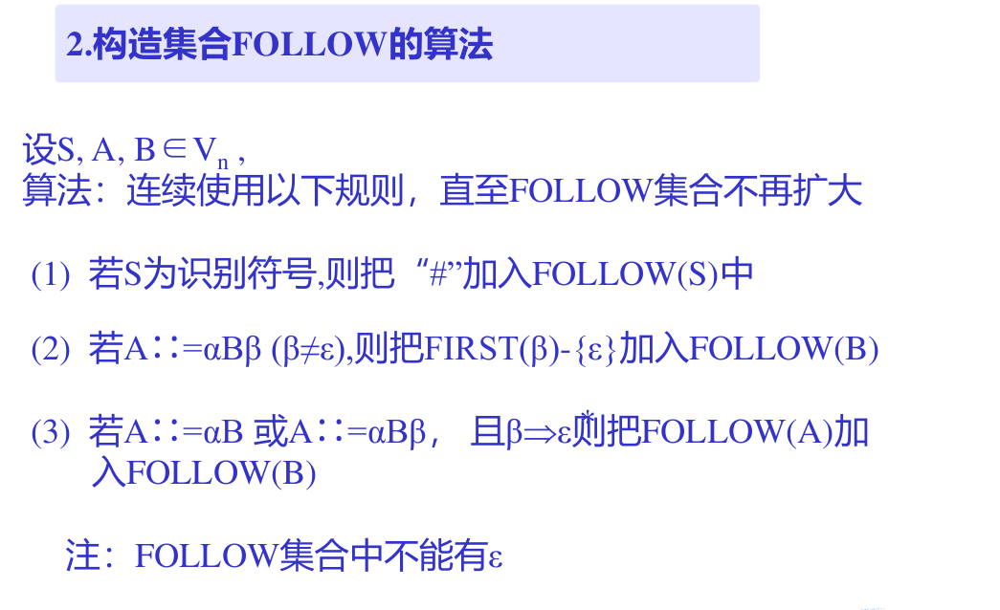

| 非终结符 | $FIRST$             | $FOLLOW$      |
| -------- | ------------------- | ------------- |
| $S$      | $a, \epsilon$       | $d, a, f, \#$ |
| $A$      | $a, d, \epsilon$    | $a, e, b, d$  |
| $B$      | $a, e, \epsilon$    | $b$           |
| $C$      | $a, \epsilon, g, f$ | $g, b$        |

#### 2.2.4 LL(1) 表的构建

LL(1)  表是一个二维表，这个表的每一列的列首都是一个终结符或者是 # ，每一行的行首都是一个非终结符，我们的目的是利用 first 和 follow 填写这个二维表。填写的方式如下：

遍历每一条语法规则 $A \rightarrow \alpha$，如果有：

- 对 $FIRST(\alpha)$ 中的每一个终结符 $t$，置 $(A, t)$ 为 $A \rightarrow \alpha$ 。
- 对 $\varepsilon \in FIRST(\alpha)$ ，则对 $FOLLOW(\alpha)$ 中的每个终结符 $t$ ，置 $(A, t)$ 为 $A \rightarrow \varepsilon$ 。

---

## 三、自底向上方法

### 3.1 算符优先分析法

#### 3.1.1 基础知识

这里细致讨论一下算法优先算法的意义，还是以这个简单的表达式文法举例

$$
E::= E + T \space\space|\space\space T \\
 E::= T * F \space\space|\space\space F \\
 F::= (E) \space\space|\space\space i
$$

对于 i + i * i 这种东西，我们希望先算 i * i （也就是先规约它），然后再规约 i * T 之类的。

那么最直观的办法就是加括号，只要将其变成 $((i) + ((i)*(i)))$ ，规约顺序就一目了然了。

所以为了构造这种括号，我们发明了算法优先分析法，通过终结符的优先级，构造出这种括号，就像这样

$<<i> + <<i>*<i>>$ 其中的 $<, >$ 符号就是根据终结符的优先级表生成的。

为了构造这种优先级顺序，我们需要考察规约的优先级，而规约的优先级，本质上是语法导出的，而语法中优先级的判断，其实是判断语法产生式的某种“深度”，比如说 * 法优先级高于 + 法，是因为先推出 +，后推出 *。

EqExp -> RelExp -> AddExp -> MulExp -> UnaryExp -> PrimaryExp

这就导致 `==, !=` 的优先级最低，而 `!, -` 的优先级最高。

然后介绍一下各种定义：

- 算符文法（Operator Grammer，OG）：文法中没有 $U::=...VW...$ 的规则，就被称为算符文法，这个的意思是说，非终结符间一定由终结符连接，就好像 $A + B * C$ 一样
- 算符优先关系（Operator Priority）：
  - `a == b` 当且仅当有 $U::=\dots ab \dots$ 或者 $U::= \dots aVb \dots$ 。这个很好理解，比如说 $A + B - C$ ，那么加减法就是相等的，$((A + B) * C)$ 两个 $($ 的优先级就是相等的。
  - `a < b` 当且仅当有 $U::= \dots aW \dots$ 且 $W \Rightarrow b \dots, W \Rightarrow Vb\dots $  。这个同样好理解，说白了就是 $+A*B$ 或者 $+-A$ ，显然 $+$ 的优先级要低于乘法和负号。
  - `a > b` 当且仅当有 $U::=\dots Wb \dots$ 且 $W \Rightarrow \dots a, W \Rightarrow \dots aV$ 。和上面相同理解 
  - 此外，最重要的一点，这里的比较关系并没有可逆性，也就是说，即使有 `a < b` 也不一定有 `b > a` 所以 ab 的关系需要考量两次。
- 算符优先文法（Operator Priority Grammer，OPG），任意两个终结符之间，在 $=, <, >$ 间只有至多一种关系成立，则成为算法优先文法。说白了就是和表达式很像的文法，各个子部件的优先级是稳定的。

我们有了算符优先关系，就可以进行算符优先分析了。至于怎么构造，其实是一个很浅显的方法，首先构造两个集合：

- FIRSTVT
- LASTVT

定义繁多，就不敲了，这两个集合都是相对于某个非终结符而言的，说白了，都是这个非终结符中的运算符，比如说 Exp 中就有 $\{+, -, \times, \div, !\}$ ，而 item 里只有 $\{\times, \div, !\}$ 。有了这些，如果某个终结符和非终结符平级，那么就说明它的优先级是比里面的元素低的。

如果再说的详细一些，FIRSTVT 指的是当前非终结符可以推出的第一个终结符，比如说对于 AddExp，可以由 i + i 推出 +，也可以由 i * i + 1 推出 *，还可以由 (i + i) 推出 (，而LASTVT 则是指由当前非终结符可以推出的最后一个非终结符，比如说由 i + i - i 推出 -，由  i - i / i 推出 /，这一类的操作。

至于算法，又是一个不动点问题，虽然用栈包装了一下，但是依然很难。可以考虑先把同级的写出来，然后在拓展（注意是逆向拓展），比如说对于

$AddExp -> MulExp -> PrimaryExp$ 

可以有

|            | 第一次 | 第二次        |
| ---------- | ------ | ------------- |
| AddExp     | +, -   | +, -, *, /, ! |
| MulExp     | *, /   | *, /, !       |
| PrimaryExp | !      | !             |

最后总结一下

- 首先求 FIRSTTK 和 LASTTK，求解的方法可以列表，因为要迭代，不要列表的话，可能不方便，注意这里要把所有的 FISRT 写在一起，LAST 写在一起
- 然后根据语法规则开始填表（这个表是一个行首为终结符，列首也为终结符的二维表）：
  - 首先扫描同级的，把 = 写好，注意，对于 $(Exp)$ 这种东西，只有 $( = )$ ，没有 $) = ($
  - 然后扫描发现这样 $+ E$ 这种结构，然后让 $+ < FIRSTTK(E)$，此时应该是在 + **这一行**填写
  - 然后扫描发现这样 $E+$ 这种结构，然后让 $LASTRK(E) > +$ ，此时应该在 + **这一列**填写
  - 对于 # 符号，可以将其视为最大的大括号，让 # < $FIRST(S)$ 和 $LAST(S)$ > # 即可。

#### 3.1.2 例题

用算法优先分析法做题本身很简单，但是如果想要快速的做题，大概可以从两点优化：

- 改变填写表格的顺序
- 对于比较典型的表达式，不用查表即可给出优先关系

对于第一点，表头应当是“步骤，符号栈，输入字符串，优先关系，动作”。因为只有符号栈和输入字符串确定了，优先关系比较的是符号栈的栈顶和输入字符串的头部元素，当优先关系确定后，才可以确定具体要进行的动作，而当动作确定后，才可以确定下一行的符号栈和输入字符串。

对于第二点，其实只要牢记，当 > 出现的时候，就需要规约了，然后用意识辅助判断即可

以 $i * i + i$ 为例

| 步骤 | 符号栈  | 输入串      | 优先关系 | 动作 |
| ---- | ------- | ----------- | -------- | ---- |
| 1    | #       | i * i + i # | # < i    | 移进 |
| 2    | # i     | * i + i #   | i > *    | 规约 |
| 3    | # E     | * i + i #   | # < *    | 移进 |
| 4    | # E *   | i + i #     | * < i    | 移进 |
| 5    | # E * i | + i #       | i > +    | 规约 |
| 6    | # E * E | + i #       | * > +    | 规约 |
| 7    | # E     | + i #       | # < +    | 移进 |
| 8    | # E +   | i #         | + < i    | 移进 |
| 9    | # E + i | #           | i > #    | 规约 |
| 10   | # E + E | #           | + > #    | 规约 |
| 11   | # E     | #           |          | 接受 |

#### 3.1.3 素短语与规约

首先声明，素短语的概念和实际的解题并没有关系，素短语的提出是为了在理论上更好的解释算符优先分析法。

我们是这样描述的，在算符优先分析法中，每次规约的都是**最左素短语**。

**素短语**和**简单短语**有一定的相似性，比如说**素短语**强调了一定的**最小性**，素短语内部是不可以嵌套素短语的，这就使得素短语是一个“较小”的短语，同时素短语也要求必须含有至少一个终结符，这是其特性。

在与 LR 的对比中，可以发现，因为素短语并不一定是简单短语，所以规约是**有可能是利用了多个语法规则的**，比如说下面的语法树，按照算符优先分析，应当如此递归

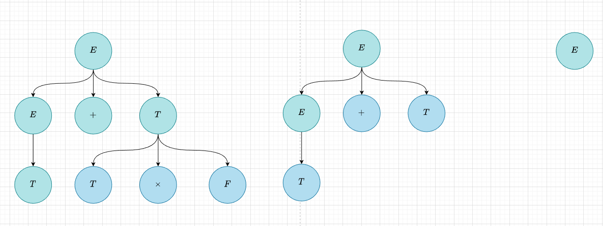

会发现在第二次递归的时候直接递归了两步，这是一个十分神奇而且我觉得其实是不严谨的地方。在某种意义上说，这意味着我们并没有按照语法规则去递归建树，我们将语法规则翻译成算符优先表之后，就彻底抛弃了原来的语法规则。

### 3.2 SLR

#### 3.2.1 活前缀和下推自动机

活前缀指的是在一个句型中，不包括“句柄之后的符号”的其他部分组成的前缀。

那么活前缀代表着什么？LR 有两个基本动作“移进”和“规约”，如果一个活前缀不包括句柄，那么它就可以通过不断的移进操作增加它的长度，直到包括了句柄为止，而当一个活前缀包括句柄时，就可以通过规约操作改变活前缀，然后继续重复“移进-规约”的循环。这个过程似乎是可以用一个 DFA 来描述的，因为 DFA 会有一种记录自己状态的感觉，当前状态到起始状态的连线就是当前的活前缀。

然后我们来考虑一下正则语法是怎样和 DFA 联系在一起的呢，对于左线性正则来说，每一步都是规约，所以只需要一直规约到起始符即可，而对于右线性正则来说，每一步都是推导，所以只要一直移入到终止符即可。但是对于更加常见的二型文法来说，“移进-规约”是一个循环，也就是说，在发生移进的时候，可以进行类似于“一步一步走”的操作，但是在发生规约的时候，会导致之前的活前缀发生大量变化（不只是减少，还有改变），这就导致在状态图上可能需要后退，甚至跳转到某一个不太相关的状态。也就是说，DFA 那种“**只记录当前状态**“ 的思路是没有办法支持二型文法的。

为了解决这个问题，我们提出了**下推自动机**，相比于 DFA 只记录当前状态的特性，下推自动机拥有一个栈结构，在进行状态转移的同时，也会进行压栈或者弹栈操作，同时，栈顶的元素也会参与状态转移的决策。相比于 DFA，下推自动机拥有了记忆功能，所以功能更为强大。在 LR 分析中，栈中会有状态和符号，但是仔细观察就可以得知，符号是并不参与 LR 分析流程的，他们的存在只是为了让语法分析的结果更加的漂亮（将符号移到一个新开的栈中也是可以的），所以栈里最本质的东西就是状态，换句话说，LR 的下推自动机唯一强于 DFA 就是他用栈结构存储了状态，方便他进行“历史状态的撤销和修改”。

那么如果用下推自动机的角度考虑算符优先分析法，可以发现基本上一个算符就代表了一种状态，但是如果要具体解释，就显得有些牵强，所以并不在此胡诌了。

#### 3.2.2 不同的 LR

> ​	那时，我在想，为什么会发明这么多的分析算法？ 我为什么不递归下降一把梭解决所有问题呢？ 而当我学习了LR后，才发现这些算法其实是一脉相承，每一个都是针对上一个的痛点作出改进而诞生:
>
> - SLR 使用 **follow 集**来减少LR(0)的规约/移入冲突问题
> - LR 通过**展望符（搜索符）**预测来解决 Follow 集预测不准确的问题
> - 而 LR 又存在将状态划分得过细，导致状态数过多的问题，因此又诞生了 LALR，该算法剪除了 LR 中相同性质的状态，缩减了状态数,但是又带来了延迟报错的问题.……

现在我们尝试用一个例子来解释一下 LR 面对的问题（其本质是规约和规约的冲突，规约和移入的冲突）

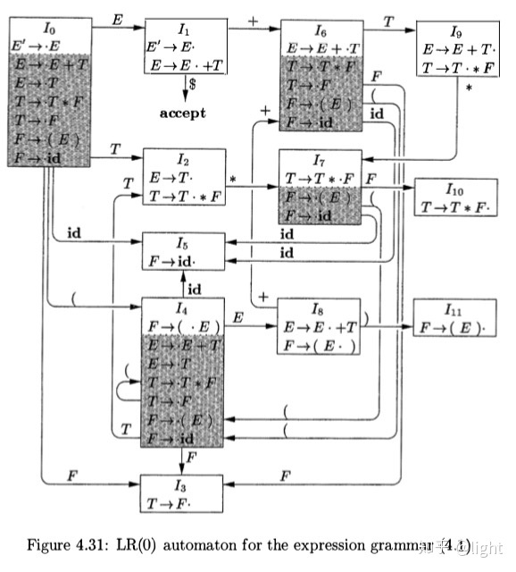

构建这个图很简单，就是不断的移动那个点就好了，然后求出一个闭包即可。

我们来看一下一个移进过程具体是怎样的，对于 $id * id$ 这个输入来说，首先看到的是 $id$，那么移进就是在当前状态和输入考虑状态转移，所以我们考虑转移到 $I_5$ ，然后发现 $I_5$ 里的项目有一个特征
$$
F \rightarrow id.
$$
它的 `.` 是在最后的，这是要发生规约的标志，所以我们考虑发生规约，发生规约后我们可以利用栈结构重新回到 $I_0$，然后根据 $I_0$ 和规约出的 $F$，判断出要转到 $I_3$ ，$I_3$ 中也是发生规约，所以又转到 $I_2$，然后就发生了有趣的事情
$$
E \rightarrow T.\\
T \rightarrow T.*F
$$
这个里面有两个项目，那么我们是要按照第一个进行规约呢？还是要按照后一个进行移进呢？这就是一个冲突，SLR 第一次尝试回应这个冲突。

我们规定当前字符是是 $c$ ，然后考虑是否可以规约，比如说对于
$$
E \rightarrow T.
$$
一旦规约了，那么就意味着出现了 $Ec$ 这种结构，所以也就是说 $c \in FOLLOW(E)$ ，这正是判断能够进行规约的标准，如果 $c \notin FOLLOW(E)$ ，那么就是无法进行规约的。

对于移进，也是同理，如果想要转移，那么当前状态 $I_{cur}$ 必须有一条边通向 $I_{next}$ ，这条边恰好是 $c$ ，所以如果没有这条边的，那么就是不能发生移进的。

但是可以想见，这些要求会指导一定的动作冲突，但是还是有可能导致冲突，这也正式 SLR 无力的地方，在某种意义上，SLR 将“可规约”的情况预测多了，所以我们才有了 LR(1) 来减少这件事情。

#### 3.2.3 例子

**构建 LR(0) 项目集，构建 SLR 表**

本来应该是两个事情，但是考虑到项目集状态图太大了，所以其实可以先用 GOTO 图去记录状态图的边，然后将 GOTO 图改造成 SLR 表，示例如下
$$
r_0: S\rightarrow E \\
r_1: E \rightarrow T \\
r_2: E \rightarrow E + T \\
r_3: T \rightarrow P \\
r_4: T \rightarrow T * P \\
r_5: P \rightarrow F \\
r_6: P \rightarrow F \uparrow P \\
r_7: F \rightarrow i \\
r_8: F \rightarrow (E)
$$
构造出的 SR 分析表如图：

|      | +    | *    | $\uparrow$ | i    | (    | )    | #    | S    | E    | T    | P    | F    |
| ---- | ---- | ---- | ---------- | ---- | ---- | ---- | ---- | ---- | ---- | ---- | ---- | ---- |
| 0    |      |      |            | S5   | S6   |      |      |      | 1    | 2    | 3    | 4    |
| 1    | S7   |      |            |      |      |      | acc  |      |      |      |      |      |
| 2    | r1   | S8   |            |      |      | r1   | r1   |      |      |      |      |      |
| 3    | r3   | r3   |            |      |      | r3   | r3   |      |      |      |      |      |
| 4    | r5   | r5   | S9         |      |      | r5   | r5   |      |      |      |      |      |
| 5    | r7   | r7   | r7         |      |      | r7   | r7   |      |      |      |      |      |
| 6    |      |      |            | S5   | S6   |      |      |      | 10   | 2    | 3    | 4    |
| 7    |      |      |            | S5   | S6   |      |      |      |      | 11   | 3    | 4    |
| 8    |      |      |            | S5   | S6   |      |      |      |      |      | 12   | 4    |
| 9    |      |      |            | S5   | S6   |      |      |      |      |      | 13   | 4    |
| 10   | S7   |      |            |      |      | S14  |      |      |      |      |      |      |
| 11   | r2   | S8   |            |      |      | r2   | r2   |      |      |      |      |      |
| 12   | r4   | r4   |            |      |      | r4   | r4   |      |      |      |      |      |
| 13   | r6   | r6   |            |      |      | r6   | r6   |      |      |      |      |      |
| 14   | r8   | r8   | r8         |      |      | r8   | r8   |      |      |      |      |      |

在构建的时候需要求出 follow 集判定是否可以进行递归，follow 集如下

| 符号 | FOLLOW                  |
| ---- | ----------------------- |
| S    | #                       |
| E    | +, ), #                 |
| T    | *, +, ), #              |
| P    | *, +, ), #              |
| F    | $\uparrow$ , *, +, ), # |

**SLR 使用**

$i + i \uparrow (i * i)$

| 步骤 | 状态栈              | 输入串           | 动作 |
| ---- | ------------------- | ---------------- | ---- |
| 1    | #0                  | i + i ^ (i * i)# | S5   |
| 2    | #0i5                | + i ^  (i * i)#  | r7   |
| 3    | #0F4                | + i ^ (i * i)#   | r5   |
| 4    | #0P3                | + i ^ (i * i)#   | r3   |
| 5    | #0T2                | + i ^ (i * i)#   | r1   |
| 6    | #0E1                | + i ^ (i * i)#   | S7   |
| 7    | #0E1+7              | i ^ (i * i)#     | S5   |
| 8    | #0E1+7i5            | ^ (i * i)#       | r7   |
| 9    | #0E1+7F4            | ^ (i * i)#       | S9   |
| 10   | #0E1+7F4^9          | (i * i)#         | S6   |
| 11   | #0E1+7F4^9(6        | i * i)#          | S5   |
| 12   | #0E1+7F4^9(6i5      | * i)#            | r7   |
| 13   | #0E1+7F4^9(6F4      | * i)#            | r5   |
| 14   | #0E1+7F4^9(6P3      | * i)#            | r3   |
| 15   | #0E1+7F4^9(6T2      | * i)#            | S8   |
| 16   | #0E1+7F4^9(6T2*8    | i)#              | S5   |
| 17   | #0E1+7F4^9(6T2*8i5  | )#               | r7   |
| 18   | #0E1+7F4^9(6T2*8F4  | )#               | r5   |
| 19   | #0E1+7F4^9(6T2*8P12 | )#               | r4   |
| 20   | #0E1+7F4^9(6T2      | )#               | r1   |
| 21   | #0E1+7F4^9(6E10     | )#               | S14  |
| 22   | #0E1+7F4^9(6E10)14  | #                | r8   |
| 23   | #0E1+7F4^9F4        | #                | r5   |
| 24   | #0E1+7F4^9P13       | #                | r6   |
| 25   | #0E1+7P3            | #                | r3   |
| 26   | #0E1+7T11           | #                | r2   |
| 27   | #0E1                | #                | acc  |

$(i * i) \uparrow (i + i)$

| 步骤 | 状态栈           | 输入串             | 动作 |
| ---- | ---------------- | ------------------ | ---- |
|      | #0               | (i * i) ^ (i + i)# | S6   |
|      | #0(6             | i * i) ^ (i + i)#  | S5   |
|      | #0(6i5           | * i) ^ (i + i)#    | r7   |
|      | #0(6F4           | * i) ^ (i + i)#    | r5   |
|      | #0(6P3           | * i) ^ (i + i)#    | r3   |
|      | #0(6T2           | * i) ^ (i + i)#    | S8   |
|      | #0(6T2*8         | i) ^ (i + i)#      | S5   |
|      | #0(6T2*8i5       | ) ^ (i + i)#       | r7   |
|      | #0(6T2*8F4       | ) ^ (i + i)#       | r5   |
|      | #0(6T2*8P12      | ) ^ (i + i)#       | r4   |
|      | #0(6T2           | ) ^ (i + i)#       | r1   |
|      | #0(6E10          | ) ^ (i + i)#       | S14  |
|      | #0(6E10)14       | ^ (i + i)#         | r8   |
|      | #0F4             | ^ (i + i)#         | S9   |
|      | #0F4^9           | (i + i)#           | S6   |
|      | #0F4^9(6         | i + i)#            | S5   |
|      | #0F4^9(6i5       | + i)#              | r7   |
|      | #0F4^9(6F4       | + i)#              | r5   |
|      | #0F4^9(6P3       | + i)#              | r3   |
|      | #0F4^9(6T2       | + i)#              | r1   |
|      | #0F4^9(6E10      | + i)#              | S7   |
|      | #0F4^9(6E10+7    | i)#                | S5   |
|      | #0F4^9(6E10+7i5  | )#                 | r7   |
|      | #0F4^9(6E10+7F4  | )#                 | r5   |
|      | #0F4^9(6E10+7P3  | )#                 | r3   |
|      | #0F4^9(6E10+7T11 | )#                 | r2   |
|      | #0F4^9(6E10      | )#                 | S14  |
|      | #0F4^9(6E10)14   | #                  | r8   |
|      | #0F4^9F4         | #                  | r5   |
|      | #0F4^9P13        | #                  | r6   |
|      | #0P3             | #                  | r3   |
|      | #0T2             | #                  | r1   |
|      | #0E1             | #                  | acc  |

