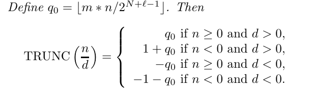
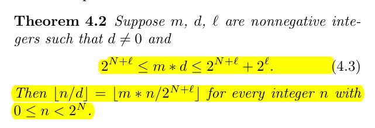

## 一、除常数优化的定义

对于任何处理器，进行除法计算所需要的时间都远远高于乘法和移位运算（当然这两者也不在一个量级上），所以我们有一种想法，就是把除法转换成乘法和移位操作，也就是
$$
\tt{quotient = \frac{dividend}{divisor} = (dividend \times multiplier) >> shift}
$$
这个式子是一个很容易看懂的式子，不幸的是，这个式子是没有办法直接应用到我们的处理器上的。

如果想要应用到我们的处理器上，需要做出很多的妥协和让步，本文其实是一篇论文的注释，对于具体内容，大家可以参考论文：**Division by Invariant Integers using Multiplication**。

----


## 二、第 1 次溢出

在机器上计算与数学计算最大的一个区别就是机器上的位宽是有限的，所以会存在溢出问题，我们可以审视一下在这个问题里哪里会有溢出问题。

一个 32 位的除法是不会溢出的，商一定是一个 32 位以内的数，加减法是会溢出的，但是不是我们考虑的重点。乘法是会溢出的，也就是说 32 位的两个数相乘，积可能大于 32 位，所以我们才会在乘法计算中设置 Hi 和 Lo 两个寄存器，分别保存积的高 32 位结果和低 32 位结果。那么让我们审视变化中有一个结构
$$
\tt{(dividend \times multiplier)}
$$
这个东西有可能是一个大于 32 位的结果，所以我们必须选择挑选到底是 hi 还是 lo 作为上面这个的结果。那么结果十分显然，一定要挑 hi，这是因为 lo 有可能不对，而 hi 就没有这种顾虑。

如果我们使用 Hi，那么就要保证上面的积一定是一个极大的数，一定要到 32 位以上，不然就没有意义了，如果我们不能保证 `dividend` 的大小，但是我们可以保证 `multiplier` 在一个很大的范围，这样就可以让两者的乘积超过 32 位。

在采用了上面的思想后，我们的目标变成了
$$
\tt{\lfloor \frac{dividend}{divisor} \rfloor = \lfloor \frac{dividend \times multiplier}{2 ^ {N + shift}} \rfloor}
$$
其中 $N = 32$ 是机器字的字长。这个式子基本上就是真正的原理式了。

而反映到处理器上，就是以下的指令（指令用大写字母表示）
$$
\tt{SRL(MULUH(dividend, multiplier), shift)}
$$


----


## 三、第 2 次溢出

不幸的是，因为我们希望第 1 次溢出，所以我们会把 `multiplier` 调整的很大（具体的调整方法后面介绍），有的时候就超过了 32 位字长可以表示的程度，那么就会导致没办法用 32 位的寄存器存储，发生了第二次溢出。

那么为了让过大的 `multiplier` 可以被正确的计算，我们需要利用乘法分配律进行计算，有
$$
\tt{dividend \times multiplier = dividend \times (2^{N} + multiplier - 2^{N}) = (dividend << N) + dividend \times (multiplier - 2^{N})}
$$
反应到处理器上，就是以下的指令
$$
\tt{SRL(ADD(dividend, MULUH(dividend - 2^{N}, multiplier)), shift)}
$$
当计算出 `multiplier` 之后，我们需要对其大小进行一个判断，然后选择用哪种式子。

---


## 四、第 3 次溢出

当我们发生了第 2 次溢出后，我们采用了如下措施
$$
\tt{(dividend << N) + dividend \times (multiplier - 2^{N})}
$$
但是我们没有意识到加法同样是可能溢出的，所以我们还需要进一步修正，但是我懒得写咋修正了（依然是利用乘法分配律），因为在最终代码中没有体现（这是应为现在讨论的是无符号数，而有符号数的范围会比较小，所以没有这个问题）。

---


## 五、向零取整

对于有符号数来说，C 语言的特性是这样的，除法是向零取整的，也就是说 `3 / 4 = 0, -3 / 4 = 0`。但是对于位移来说，是向下取整的，也就是说 `3 >> 2 = 0, -3 >> 2 = -1`。因为我们用左移代替了除法，所以我们需要对于这里进行一定的修正。一共有两种修正，一种是对于除数是 2 的幂次的情况，那么我们修改被除数：
$$
\tt{newDividend = oldDividend + divisor - 1}
$$
另一种就是除数不为 2 的幂次，对于有符号除法，有如下公式（证明就不列了）



其中 $\tt{TRUNC}$ 是向零取整的意思。

---


## 六、选择 Multiplier 和 Shift

这就要涉及一些神秘的数学证明了，在证明开始之前，我觉得先说一下咱们需要干啥，现在我们需要根据 `divisor` 来确定 `multiplier` 和 `shift` ，但是显然一个数没法确定两个数，所以我们要挑出 `multiplier` 和 `shift`。但是也不能瞎挑，我们要保证我们挑出的东西是可以满足底下这个效果的
$$
\tt{\lfloor \frac{dividend}{divisor} \rfloor = \lfloor \frac{dividend \times multiplier}{2 ^ {N + shift}} \rfloor}
$$
待会要证明的东西就是一个“挑“ 的指导方针，大致是这个



证明就不写了，因为懒，而且背不过。

---


## 七、精度

待会的源码里还会有精度 `precision` 的说法，但是我对于这个东西的理解很肤浅，所以就不说了，论文中说的也不多，而且在有符号数里没有太多的用到，大致是这样的


----


## 八、源码模拟

我用 CPP 写了一份有`符号数除法`的模拟源码，放在这里以供参考

```cpp
// div.h
#ifndef DIV_DIV_H
#define DIV_DIV_H

// 一个无符号的 word
typedef unsigned int uword;
// 一个有符号的 word
typedef int sword;
// 一个无符号的 double word
typedef unsigned long long udword;
// 一个有符号的 double word
typedef long long sdword;
// machine word width
const int N = 32;

/**
 * 用于进行除常数优化的三个量
 * 之所以有这个结构体，最重要的原因是 CPP 的返回值是单值的，所以没法返回多个东西
 * 所以这个结构体的组织没有太多的逻辑
 * multiplier 是乘元素
 * shift 是移位元素
 * log = ceil(log(divisor)) 即除数的 2 的对数向上取整
 */
struct Multiplier
{
    udword multiplier;
    int shift;
    int log;
};

/**
 * 如果 a 是负数，则返回 -1，否则，返回 0
 * @param a 一个有符号 32 位整数
 * @return 如上
 */
int xsign(int a);

/**
 * 逻辑右移
 * @param a
 * @param shift
 * @return
 */
sword shiftRightLogical(sword a, int shift);

/**
 * 32 位有符号乘法的结果的高 32 位
 * @param a 有符号数
 * @param b 无符号数
 * @return 结果的高 32 位
 */
sword signMulHi(sword a, uword b);

sword clz(uword a);

/**
 * 这个函数是一切的关键，我愿意称他为除数 divisor 的分析转换函数
 * @param divisor 除数
 * @param precision 除数的大小描述，有 divisor < 2^precision
 * 之所以有这个东西，是因为当 precision 小的时候，会让 multiplier 和 shift 变小，可以避免溢出
 * @return 分析结构体
 */
Multiplier chooseMultiplier(uword divisor, int precision);

/**
 * 除法的主函数
 * @param dividend 被除数
 * @param divisor 除数，要求不为 0
 * @return quotient 商
 */
sword divide(sword dividend, sword divisor);

#endif //DIV_DIV_H

// div.cpp
#include <iostream>
#include "div.h"

using namespace std;

sword divide(sword dividend, sword divisor)
{
    // 商，是返回的结果
    int quotient;

    bool isDivisorNegative = divisor < 0;
    uword divisorAbs = isDivisorNegative ? -divisor : divisor;

    Multiplier ret = chooseMultiplier(divisorAbs, N - 1);
    udword multiplier = ret.multiplier;
    int shift = ret.shift;
    int log = ret.log;

    if (divisorAbs == 1)
    {
        quotient = dividend;
    }
    // 如果是 2 的幂次
    else if (divisorAbs == (1 << log))
    {
        quotient = (dividend + shiftRightLogical(dividend >> (log - 1), N - log)) >> log;
    }
    // 下面两个都是不规则除数的处理
    // 针对的是 m 比较小的情况
    else if (multiplier < 0x80000000)
    {
        quotient = (signMulHi(dividend, multiplier) >> shift) - xsign(dividend);
    }
    // m 比较大的情况
    else
    {
        quotient = ((dividend + signMulHi(dividend, (sword) (multiplier - 0x80000000))) >> shift) - xsign(dividend);
    }

    return isDivisorNegative? -quotient : quotient;
}

sword shiftRightLogical(sword a, int shift)
{
    uword a1 = a;
    return (sword) (a1 >> shift);
}

sword xsign(sword a)
{
    return -((a >> 31) & 1);
}

sword signMulHi(sword a, uword b)
{
    // 先将 a, b 转换成双字字长
    sdword a1 = a;
    sdword b1 = b;
    // 取高 32 位
    return (sword) ((a1 * b1) >> 32);
}

sword clz(uword a)
{
    return __builtin_clz(a);
}

Multiplier chooseMultiplier(uword divisor, sword precision)
{
    // log = ceil(log2(divisor))
    int log = N - clz(divisor - 1);
    // shift = log
    int shift = log;
    // low = floor(2^(N + log) / divisor)
    udword low = (udword(1) << (N + shift)) / divisor;
    // high = floor((2^(N + log) + 2^(log + N - precision)) / divisor)
    udword high = ((udword(1) << (N + shift)) + (udword(1) << (shift + N - precision))) / divisor;
    while ((low >> 1) < (high >> 1) && shift > 0)
    {
        low >>= 1;
        high >>= 1;
        shift--;
    }
    return {high, shift, log};
}

// main.cpp 用于测试正确性
#include <iostream>
#include <random>
#include "div.h"

using namespace std;

int main()
{
    random_device rd;
    mt19937 mt(rd());
    // 产生位于[-2147483648, 2147483647]间的随机数
    uniform_int_distribution<int> randint(-2147483648, 2147483647);
    int dividend, divisor, testTimes = 10000;
    for (int i = 0;  i < testTimes; i++)
    {
        dividend = randint(mt);
        divisor = randint(mt);
        int standardAns = dividend / divisor;
        int ans = divide(dividend, divisor);
        if (standardAns != ans)
        {
            cout << "dividend is " << dividend << endl;
            cout << "divisor is " << divisor << endl;
            cout << "standard answer is " << standardAns << endl;
            cout << "answer is " << ans << endl;
            return 0;
        }
        else
        {
            cout << "dividend is " << dividend << endl;
            cout << "divisor is " << divisor << endl;
            cout << "AC" << endl << endl;
        }
    }

//    int i, j;
//    for (i = -2147483648; i < 2147483648; i++)
//    {
//        for (j = -2147483648; j < 2147483648; j++)
//        {
//            if (j != 0)
//            {
//                int standardAns = i / j;
//                int ans = divide(i, j);
//                if (standardAns != ans)
//                {
//                    goto end;
//                }
//                else
//                {
//                    cout << i << "/" << j << " "  << "AC" << endl;
//                }
//            }
//        }
//    }
//    end:
//    cout << i << "  " << j << endl;
//    cout << i / j << "  " << divide(i, j) << endl;
    return 0;
}
```


## 参考文献

- Division by Invariant Integers using Multiplication
- https://zhuanlan.zhihu.com/p/151038723
