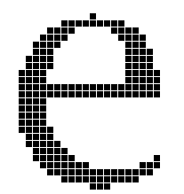

## 一、编码

此章的目的是弄清楚 ASCII, GBK, Unicode, UTF-8 编码的区别，大部分知识都来源于[这里](https://www.ruanyifeng.com/blog/2007/10/ascii_unicode_and_utf-8.html)。所以我只是简单转述一下：

ASCII 是最为古老的编码方式，它指的是用一个字节也就是 8 bit 完成编码，实际上只用了 7 bit ，最高位的值衡为 0 （这也成了其他编码方式兼容 ASCII 的一个重要抓手）。也就是说，ASCII 只能编码 27 = 128 个文字，这对英文这种只有 26 个字母的语言体系是足够的。

但是 ASCII 并不能满足很多类似英语的语言体系，比如说 `é, ג` 这种字符都是原有的 ASCII 所没有的，但是幸运的是，很多语言的字符数本来就不多，比如俄语是 33 个，而法语是基础的 26 个英文字母加音标。所以这些语言同样可以用一个字节进行编码，英语字符占据了 `0 ~ 127` ，它们就占据了 `128 ~ 255` 。这样的缺点就是不同国家的 `128 ~ 255` 表示不同的字母，彼此之间并不兼容。

但是像汉语这样的语言就没有那么轻松了，他们就算占据了 `128 ~ 255` 位，也最多增加 128 个字符，这对于有 10 万个字符的汉语来说是杯水车薪。所以中国就开发了 GB2312 编码系统，后来演变成了 GBK 系统。总的来说，就是采用两个 `128 ~ 255` 的字节来表示一个汉字（应该是差不多），这样的话大约可以表示 2 万多个汉字，但是这样其实有一些生僻一些的字也是无法表示的。

这些各个国家私自拓展 ASCII 编码的行为导致了各种语言的编码系统都不兼容，随着互联网的兴起，一套兼容的编码系统呼之欲出，也就是 Unicode ，它用 32bit 表示一个符号，那么就可以表示 2 亿多个符号，这足够容纳人类的所有语言，可以在[这里](https://symbl.cc/en/unicode-table/)查询。Unicode 编码通常有一个 `U+` 的前缀。但是随着而来的问题是，原本需要用 8bit 表示的英文字母，现在需要用 32bit 了，这显然不是一个好事情。

为了权衡数据大小和兼容性，以 Unicode 为编码基础，人们提出了 UTF-8, UTF-16, UTF-32 等具体的编码方案。以 UTF-8 为例，它使用变长编码，压缩了原本 32bit 的字符。在 UTF-8 中，字符可能长度是 8, 16, 32bit ，这样兼顾了大小和兼容性。UTF-16 和 UTF-32 则都是定长编码，UTF-16 适用于需要处理大量双字节字符（如亚洲文字）的场景。UTF-32 则适用于需要处理所有 Unicode 字符，且对内存空间要求较高的情况。

UTF-8 看似兼顾了优势，但是不定长的特性使得解码效率降低，而且这使得像 C++ 这样的语言，字符数组的概念变得容易混淆，当我说 `s[3]` 时，很难确定它是一个特定的字符，还只是字符的某一部分。

----

## 二、渲染

### 2.1 点阵字体

在最开始的时候，字体是用点阵（bitmap）的方式描述的，也就是这个字体记录了不同大小（字号）的字符的像素的排列方式，非常的朴素和直观。但是这种方式是的缺点在于，不同字号的字都分别需要记录一次像素的排列方式，所以如果恰好这个字号没有记录，就非常尴尬了（不可能每个字号都有），只能用用相邻的有记录的字号进行推算。而且这种方式的也不适合进行一些数学相关的处理（比如加粗、倾斜、缩放和旋转）。

### 2.2 矢量字体

为了解决这个问题，人们提出了矢量字体，这种字体不再记录具体的像素排列方式，而是用数学上的贝塞尔曲线在一个虚拟的网格（类似于坐标系，但是并不连续）描述字体。这种方式解决了点阵字体的缺点，如下所示：

最开始的时候，是 Adobe 公司最先开发了 Type1 矢量字体格式（后缀名为 `pfb`），但是 Adobe 太贵了，所以 MS 和 Apple 联手开发新的矢量字体，但是只有 Apple 开发成功了，它的作品是 TrueType（后缀名为 `ttf`，也就是 true type format）。后来 MS 又和 Adobe 公司开发出了 OpenType（后缀名为 `otf`，也就是 open type format），这种字体也被称为 Type2。除此之外，还有为 web 而生的字体标准 `woff` 和 `woff2`，它们的优势在于压缩率高。我们还常见一种后缀名为 `ttc` 的文件，它的全称是 TrueType Collection，是在一单独文件结构中包含多种字体，以便更有效地共享轮廓数据，当多种字体共享同一笔画时，TTC 技术可有效地减小字体文件的大小。

总的来说，Type1 字体基本上已经不常见了，而 OTF 因为吸取了 TTF 的经验，所以更为先进，但是 TTF 具有先发优势，兼容性更好。不过两者的差别并不明显。

### 2.3 屏幕

这里插叙一段关于屏幕的介绍。我个人的理解，屏幕是一块布满像素点的网格板子，其核心在于**分辨率**，也就是屏幕的实际大小和其上的像素点的关系。我们在字体设置时常常有诸多单位，记录如下：

- pt：译作“磅”，这是一个物理单位，是 1/72 英寸的。直观来看，我个人常用 14pt 左右的字体写代码，这样的我 15 寸的电脑大约能容纳 40 行。这个字体对于写代码来说差不多，但是对于纸质阅读来说，是有一些大的。之所以我们需要用磅，是因为人眼睛直观感受到的是物理尺寸，无论屏幕的像素是多少，一个过小 pt 的字，总是不容易识别的。
- px：译作“像素”，这是一个显示单位，也就是 1px 就指的是一个像素的宽度。当字体物理高度（也就是 pt 固定）固定的时候，像素越多，字体的边缘就会越圆润细腻。
- ppi：pixel per inch，可以被视为“分辨率”，还有一个类似的单位叫作 dpi，dpi 用于衡量打印物上每英寸的点数密度，而 ppi 用于屏幕，含义上没有过大区别。其实严格上说，ppi 是决定屏幕是否细腻的核心。
- em：这个就游离于上述三个概念之外了，它指的是一个字母 `e` 的宽度。

我们有如下公式：
$$
1 px = \frac{72}{ppi} pt
$$
考虑到 pt 是物理实际长度不可变，ppi 是屏幕特性不可变，所以基本上这个公式除了计算像素宽度外，似乎并没有作用。而实际上并不是这样的，因为屏幕上的软件其实是并不知道物理长度的，它们总不能从屏幕里伸出一只手来拿个尺子量一量字体高度是不是真的是 14pt。它们是根据 ppi 来计算字体高度的。也就是说 ppi 作为一个参数传入给了程序。

这种方式就衍生了一种新的调节字体高度的方式，除了传统的修改字体字号，现在还可以修改 ppi，将 ppi 改大，就会导致字体高度也变大。但是需要强调的是，此时的 ppi 已经不再是屏幕的一个物理参数了，而变成了一个程序渲染的参数，可以脱离实际意义。

那么为什么在可以直接调节字号的情况下，还修改 ppi 呢？这是因为屏幕上不只有文字，还有许多其他的 UI 组件，修改 PPI 可以统一将他们一起放大缩小。至于为啥要修改它们，这可能是因为人眼具有“近大远小”的机制，所以离人较远的显示器，是需要通过放大来保证落入眼睛里时是正常大小的。

### 2.3 光栅化

当然矢量字体也并非完全碾压点阵字体，点阵字体展示在屏幕上是非常直观的，基本上像素是怎么被记录的，就怎么显示到屏幕上就可以了（这个过程称之为渲染）。但是矢量字体想要映射到一个屏幕像素网格上，那么就会发生一个“从连续到离散”的过程了，这种渲染过程被称为光栅化，如图所示：

从上图就可以看出，光栅化如果不加优化，直接映射，是非常丑陋的。而点阵字体因为开发时面对的就是网格，反而设计师不会设计出粗糙丑陋的字体。那么光栅化具体有哪些优化呢？

为了解决渲染后的字体有一种机器渲染的粗糙和死板感的问题，比如说下面的 e 这个字符，顶部只有一个像素：

人们发明了**字型微调（hinting）**，它指的是通过稍微调整字形（一般是倾斜）的方式，来达到一种更加“拟人”的渲染方式，当然如果过度使用这种方法，也会导致字形发生严重的扭曲。

**抗锯齿（anti-aliasing）**则是另一种优化手段，他指的是当像素过少的时候，很容易出现像素点之间的方块块，就会形成鳞次栉比的“锯齿”，这个时候就很丑陋，那么我们可以将边缘的像素点改成灰色（原本是黑色或者白色），然后就可以模糊了原本的锯齿。这种方法也称为**灰度渲染（Grayscale rendering）**。经过抗锯齿化的字体的缺点是边缘可能有些“模糊”。

还有一种类似的方法叫作**亚像素渲染（Subpixel rendering）**，它利用了现行的 RGB 显示屏的像素点其实是 3 个分别显示红绿蓝颜色的“亚像素”拼成的，所以可以只显示三分之一个像素或者三分之二个像素，这样分辨率相当于在横向上提高了 3 倍。但是除了边缘模糊的缺点外，这种方法还会造成某种“腻感”，这是因为边缘出现了颜色。

抗锯齿和亚像素渲染的概念如下图所示：

---

## 三、字族

### 3.1 风格

评价一个字体的风格，最为简单的有 3 个标准：

1. 有衬线还是无衬线：Serif or Sans-serif
2. 等宽还是变宽：Monospace or Proportional
3. 印刷体还是手写体：Gothic or Script

在英文中的区别我就不细说了，主要讲这些概念的“中国化”。无衬线的字体一般用于标题等醒目的地方，所以对应汉字的“黑体”，而有衬线的字体更适合阅读，对应汉字的“宋体”。汉字是方块字，所以一般都是等宽的，这里说汉字等宽，往往是指汉字需要和两个英文字母等宽。上面说的黑体和宋体都很正式，是印刷体，而“仿宋”或者“楷体”则更加灵活，对应手写体。

### 3.2 属性

字体有很多属性，常用的有字族（family）、倾斜（slant）、字重（weight）。后两者合一起叫样式（style）。

字族就是字体的名字。

倾斜就是斜不斜，英文叫 Roman，Italic 或者 Oblique ，Italic 是专门的斜体写法（更接近手写样式）， Oblique 是把常规写法倾斜一下完事。

字重就更简单了，就是笔划的粗细。常见的有 Regular、Normal、Medium、Bold、Semibold、Black、Thin、Light、Extralight 等。

### 3.3 汉字

Noto 系列字体是 Google 主导的，名字的含义是**没有豆腐（no tofu）**，因为缺字时显示的方框或者方框被叫作 tofu 。思源系列字体是 Adobe 主导的。其中汉字部分被称为思源黑体和思源宋体，是由这两家公司共同开发的，两个字体系列的汉字部分是一样的。
