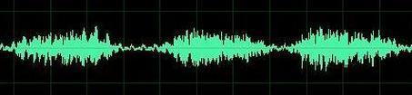
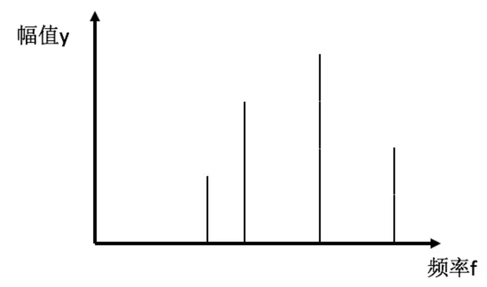
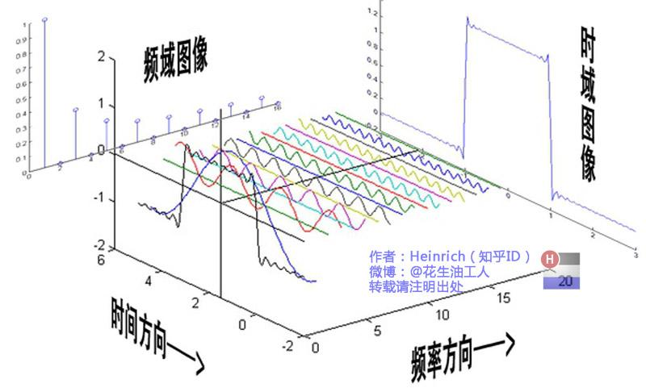
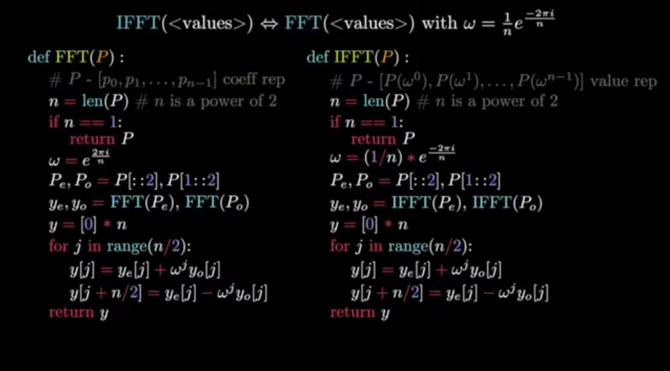

## 一、总论

傅里叶变换是非常著名的一种算法，它完成的是一个由时域函数（也就是以时间 $t$ 为自变量）到频域函数（也就是以频率 $f$ 为自变量）的映射。

如果这么说可能非常难以理解，这是因为我们无法直观认识时域函数和频域函数具体指什么。我们可以将时域函数理解成一个非常“自然”的函数，也就是说，它是一种“原始数据”，典型的时域函数比如说，当人耳听到声音时，我们可以收集一个耳膜振幅随着时间变化的函数，如下图所示：

这种函数就是时域函数，但是这种时域函数非常不能体现事物的本质特征。比如说我现在问你，你能通过上面这幅图来判断这个声音的音调吗？显然是不能的。但是通过傅里叶变换，我们可以将它转换成一个频域函数，如下所示：

这下基本上是个人就可以看出来这个声音由几个音调组成了吧（音调就是频率）。

所以，傅里叶变换其实是一种从“原始数据（时域函数）”提取“特征（频域函数）”的方法。在实际生产中，“时域”并不一定是时间，可以是空间，可以是坐标；“频域”也不一定是频率，可以是任何特征。

---

## 二、傅里叶级数

### 2.1 总论

既然傅里叶变换如此神奇，那么它的原理是什么呢？它的底层原理就是傅里叶级数。

傅里叶级数指的是，对于一个一般的周期函数 $f(x)$ ，它可以被表示成多个正弦函数和余弦函数的和，如下所示：

$$
f(x)\sim\frac{a_0}{2}+\sum_{n=1}^\infty(a_n\cos nx+b_n\sin nx)
$$

其中有：

$$
a_n=\frac{2}{T}\int_{0}^{T}f(x)\cos n\frac{2\pi}{T} xdx
$$

$$
b_n=\frac{2}{T}\int_{0}^{T}f(x)\sin n\frac{2\pi}{T} xdx
$$

### 2.2 函数正交

为了理解傅里叶级数是怎么得出的，我们需要先补充函数正交的概念。

当我们说两个 $N$ 维向量 $A, B$ 是正交的时候，我们说得是他们的向量积为 0，即：
$$
A \cdot B = \sum^{N - 1}_{i = 0} a_i b_i = 0
$$
而当我们说两个函数 $f(x), g(x)$ 是正交的时候，我们说得是如下积分为 0，即：
$$
\int^{+\infty}_{-\infty} f(x) g(x) dx = 0
$$
可以看到两者的形式基本上是一样的。

当函数为三角函数时，我们注意到如下性质，当 $f(x) = \sin mx, g(x) = \sin nx$ ，且 $m \ne n$ 时，两者不正交，更进一步，不止是 $\sin$ 还有 $\cos$ 都具有这个性质。也就是说，频率不相同的正余弦函数都是彼此正交的。

### 2.3 施密特正交化

有了这个性质后，我们就可以用施密特正交化的方式来生成这个级数，也就是按照频率顺序，不断将这个函数中的不正交的分量移除。

最后我们就可以得到 2.1 中的式子。

---

## 三、傅里叶变换

### 3.1 理解

从傅里叶级数这些式子中可以看出，这些正弦函数和余弦函数的频率（也就是 $n$ ）是各不相同的，同时振幅（也就是 $a_n, b_n$）也各不相同，所以我们可以将他们按照“以频率为 x 轴，以振幅为 y 轴”组成函数，也就是所谓的“频域函数”。如下所示：

我们还有一种更加直观的理解，就是将理解为多个旋转运动的叠加。如下所示：

这是因为三角函数本来就对应旋转运动。旋转运动的半径就是振幅，角速度就是频率（起码正相关）。这也是很多科普文章里所说的，可以用“一个圆”来表示的原因。

### 3.2 离散

连续的傅里叶变换的公式如下：
$$
F(\omega) = \int^{+\infty}_{-\infty} f(t) e^{-i\omega t} dt
$$
其中 $\omega$ 是角速度，为 $2\pi f$ 。

这个公式看上去和傅里叶级数不太一样，但是基本上一模一样，只是用到了欧拉定理表达了三角函数：

$$
e^{i\theta} =  \cos \theta + i \sin \theta 
$$
在工程上，我们通常不会使用这个式子，因为时域函数 $f(t)$ 并不是一个连续的函数，而是一组数据点，这组数据点可以被写成一个向量 $A$ ，并有 $a_m = f(t_m)$ 。而时间向量 $T$ 或者说 $t_n$ ，则依赖于我们是如何进行采样的。

对应的，离散傅里叶变换被定义为：
$$
F(\omega_n) = \sum ^{N - 1}_{m = 0} a_m e^{-i\frac{2\pi m}{N}n}
$$
这里计算出来的只是 $F(\omega)$ 的一个分量 $F(\omega_n)$ ，而 $N$ 是样本数目。

这里面有一个很有意思的点，就是函数和向量的关系，你可以发现，他们在实际应用中，基本上是可以完全相互替代的，这也是一个很有趣的直观理解。

对于上面的式子，我们发现它是可以被整理成一个向量与矩阵的乘法形式，有：

输入信号为：
$$
\mathbf{a} = \begin{bmatrix} a_0 \\ a_1 \\ \vdots \\ a_{N-1} \end{bmatrix}
$$
而矩阵为：
$$
\mathbf{E} = \begin{bmatrix}
1 & 1 & 1 & \cdots & 1 \\
1 & e^{-i \frac{2\pi}{N} \cdot 1} & e^{-i \frac{2\pi}{N} \cdot 2} & \cdots & e^{-i \frac{2\pi}{N} \cdot (N-1)} \\
1 & e^{-i \frac{2\pi}{N} \cdot 2} & e^{-i \frac{2\pi}{N} \cdot 4} & \cdots & e^{-i \frac{2\pi}{N} \cdot 2(N-1)} \\
\vdots & \vdots & \vdots & \ddots & \vdots \\
1 & e^{-i \frac{2\pi}{N} \cdot (N-1)} & e^{-i \frac{2\pi}{N} \cdot 2(N-1)} & \cdots & e^{-i \frac{2\pi}{N} \cdot (N-1)^2}
\end{bmatrix}
$$
输出为：
$$
\mathbf{F} = \begin{bmatrix} f_0 \\ f_1 \\ \vdots \\ f_{N-1} \end{bmatrix}
$$
计算过程为：
$$
\mathbf{F_{N}} = \mathbf{E_{N \times N}} \mathbf{a_{N}}
$$

### 3.3 FFT

按理说，离散傅里叶变换一次矩阵与向量运算的时间是 $O(N^2)$ ，但是因为采样数 $N$ 通常很大，所以我们不能接受这个复杂度，FFT 是一种利用了 $E$ 矩阵特性，进而将时间复杂度优化到 $O(N\log N)$ 的优秀算法。

更具体而言，FFT 是一种二分分治算法，利用的是矩阵 $E$ 每一行向量所具有的对称性，也就是前半部分向量的结果和后半部分向量的结果只用计算一个即可，而且这种特性是递归与，也就是前四分之一向量和后四分之一向量也只需要计算一个，这种标准的分治算法，时间复杂度为 $O(N\log N)$ 。

伪代码如下：

### 3.4 应用

计算机领域傅里叶变换有很多应用，比如说 jpeg 图像压缩，利用的就是傅里叶变换，提取出图像特征来。计算机视觉中，也使用傅里叶变换来提取特征。
