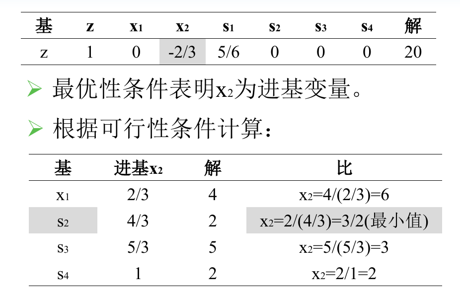

## 一、总论

单纯形法十分神奇，涉及的理论并不困难，但是很复杂。而且不但理论繁琐，而且算法有变得极具有“跳大神色彩”，“单纯性表、检验系数”等一系列玄学名词让人作呕（从我和我妈打交道的经历来看，经济学一定说一些非人话的东西，才可以满意）。更加痛苦的是，它是线性代数知识的应用，我对于线代的理解就是，“挟泰山以超北海”，很多复杂的东西被用线代知识简化成了“魔数”一样的东西，课本并不会详细说为啥是这样的，他们只会说大概可以用线代知识表示成这样。

----

## 二、线代知识复习

对于一个线性方程组，我们可以将其转换成矩阵形式，也就是
$$
Ax = b
$$
的形式，其中我们对于 $A$ 的考察变得很有趣，如果 $A$ 是一个满秩矩阵，那么就很容易，必然存在唯一解 $x$。但是如果 $A$ 不是满秩的，那么它就会导致 $x$ 是多解的，多解就意味着有一个解空间，不幸的是，这个解空间都是可以求的（所以才这么多麻烦事）。

对于 $Ax = b$ 的求解，首先是解出一个特解来。特解需要先利用高斯消元来化简矩阵为阶梯矩阵，然后变成阶梯矩阵之后，就可以很容易将阶梯角的列向量挑出来，他们对应的解的分量是必须的，对于非阶梯的地方，我们就让他们对应的解的分量为 0 ，然后就可以解出特解来了。

然后我们求出 $Ax = 0$ 的解平面，然后就可以“通解 + 特解”了。这个部分我写的很潦草，是因为我本来就不具备把他写好的能力。

之所以复习这里，是因为线性规划设计到的就是一个 $Ax = b$ 形式的方程，而且其中 $A$ 不满秩，这才导致 $x$ 具有多解，而线性规划描述的，正是在这多个解中，调出我们需要的那个最优解 $x_0$ 的事情。

---

## 三、线性规划原理

让我们关注本质，忽略一下如何把不太规范的线性规划转换成规范的线性规划，我们直接看规范的线性规范，描述的是这样的一个东西，有 $Ax = b, x > 0$ 的约束条件（同时有 $A$ 不满秩，满秩就直接解出来 $x$ 了），要求 $z = cx$ 的最大值或者最小值。

然后经过某个神秘的定理，我们获得了一个有用的信息，就是 $x$ 虽然可以取很无数个值，但是有可能是最优解，只会发生在某些特定的情况下，当我们解线性方程组特解的时候，用到了这个方法

> 就可以很容易将阶梯角的列向量挑出来，他们对应的解的分量是必须的，对于非阶梯的地方，我们就让他们对应的解的分量为 0 ，然后就可以解出特解来了

概括一下就是，因为 $A$ 不满秩，所以可以拆成一个满秩的矩阵（基向量组），和一堆非基向量，然后让非基向量对应的变量为 0，就可以求出特解。但是非基向量是被挑出来的，有很多种挑法，这就导致会有很多的特解。我们的定理告诉我们

> 最优解一定在这堆特解中。

如果 $A$ 是 $m\times n$ 维的，那么这堆特解的个数就是 $C^{m}_{n}$ 个。我们只要尝试了这么多次，就可以把这个问题解决了。但是显然这太愚蠢了。所以我们发明了单纯形法，这个方法可以让我们更快的找到最优解。

---

## 四、单纯形法

在开始介绍单纯形法之前，一定要强调，我并没有完全弄懂这个东西，哪怕跳过了证明，但看思路，也是没有完全弄懂，所以我不认为在期末的时候，我可以把他搞懂。

单纯形法就是靠着不断的换入和换出基变量，来最终确定那个最优解的基变量组的。我们首先挑选出“入基变量”，根据的是将 $z$ 表达成只含非基变量的线性表达式完成的，然后通过判断非基变量前系数的正负来判断各种东西。至于为啥可以，虽然书上解释了一大堆，但是我没有看懂，而且我觉得看不懂了。至于这个前面的系数，被称作**检验数 $\sigma$ ** 。

可以再补充一下，这个检验数可以看做是用基变量表示目标函数的时候，基变量前的系数（鬼知道为什么要故弄玄虚），之所以叫做检验数，是因为它可以判断这个算法是否终结（这也很显然，当系数都为负数或者都为正数的时候，就该停止了）。

> 这里插入一段，我跟香老师说了这件事情，香老师帮我解释清楚了。
>
> 我们的 $z$ 长成这样
> $$
> z = a_1x_1 + a_2x_2 + ... a_{m + 1} x_{m + 1}+ a_nx_n + c
> $$
> 我们可以通过 $Ax = b$ 这个关系，用非基变量表示基变量，变成这种东西
> $$
> z = a_{m+1}x_{m + 1} + ... a_nx_n + c^{'}
> $$
> 但是我们又约定了，非基变量只能是 0，所以这次的 $z$ 的取值就是 $c^{'}$ 。我们如果不让某个非基变量为 0，那么 $z$ 可以更大，但是我们让其不为零的方法就是让它称为基变量。也就是“换入”。

其次确定“出基变量”，根据的是一个叫做 **$\theta$** 规则的东西，说白了就是让所有的基变量都为 0，进而求出入基变量的最大值，我们当然希望入基变量越大越好，但是无限制的大会导致其他基变量的取值变成负数，这就不符合题义了。所以我们才让所有的基变量为 0（可以被看做是负数的边界），然后去求 $\theta$，我们会挑出“**非负的，最小的**”（很容易想到为什么是这个条件）的 $\theta$ 对应的基变量，然后让它成为非基变量。 

此外，对于求解最大值和最小值的问题，其实需要修改的只有对于 $\sigma$ 的判断，并不涉及对于 $\theta$ 判断规则的改变，这也是非常显然的事情。

然后经过这么愚蠢的直观理解后，到了记录单纯形法过程的环节。

---

## 五、实现

首先看题面
$$
max \space z = 2x_1 + 3x_2 + 0x_3 + 0x_4 + 0x_5
$$

$$
\begin{cases}
1x_1 + 2x_2 + 1x_3 + 0x_4 + 0x_5 = 8 \\
4x_1 + 0x_2 + 0x_3 + 1x_4 + 0x_5 = 16 \\
0x_1 + 4x_2 + 0x_3 + 0x_4 + 1x_5 = 12  \\
x_1, x_2, x_3, x_4, x_5 \geq 0
\end{cases}
$$

我们根据这个表可以填出下面这张表

其中最上面 c 这一列表示变量的**价值系数**，就是 $max \space z = 2x_1 + 3x_2 + 0x_3 + 0x_4 + 0x_5$ 各个 $x$ 前各个系数，这里写定了就不会变了

底下是一个增广矩阵，之后的入基操作和出基操作本质都是行变换，这个部分就是行变换的部分，就是需要跟着行更新的东西。

然后我们来填写一下基向量部分，在这个表里，下标是 $B$ 的量，都是与基向量有关的。从图可知道，基向量是 $x_3, x_4, x_5$ 。$X_B$ 这一项说明了这个东西

$C_B$ 这一项是 $X_B$ 各个分量对应的**价值系数**，是随着 $X_B$ 变化的。

然后这个表里所有直观的东西就都填完了，现在我们要计算 $\theta_j$ ，$j$ 下标的意思就是每列（也就是每个变量）都会有这样的一个东西。其计算公式是
$$
\theta_j = c_j - z_j
$$
$c_j$ 是价值系数，很显然，$z_j$ 就没有那么直观，它本质是用非基变量代替基变量的过程，发生了系数的改变，其算式是 $z_j = C_B P_j^{T}$ 。也就是这下面两个变量的相乘

按照这个规则将 $\sigma_j$ 填好，有如下示例

然后就必须审视一遍所有的 $\sigma$ ，如果所有的  $\sigma$ 都小于等于 0，事情就结束了。如果没有，那么我们就需要看看所有的非基变量对应的列向量 $P_j$ ，如果存在某个 $P_j \leq 0$ 。那么这个问题是无界的，否则就可以进行下一步了。

我们挑出 $\sigma$ 最大的那个非基变量，他就是**入基变量**了。在这道题中，就是 $x_2$ 

我们需要根据入基变量 $x_2$，确定**出基变量**，确定方法就是利用 $\theta$ ，计算方法是 $\theta = b \div P_2$ 。其中 $\div$ 是对应项相除的意思，有

然后我们需要挑出最小的 $\theta$ ，找到对应的基变量，也就是 $x_5$ 。这就是出基变量

现在我们确定了出基变量 $x_5$ 和入基变量 $x_2$ 。现在需要利用行变换知识将其一个转换为基变量，另一个就顺其自然变成了非基变量。

首先归一化

然后将 $P_2$ 其他分量都搞成 0，即

因为基向量发生了改变，所以建立在其上的 $X_B, C_B, \sigma_j, \theta$ 都需要重新计算，也就是下面这张表

入基变量是 $x_1$ 出基变量是 $x_3$ 。然后继续进行行变换，并且更新 $X_B, C_B, \sigma_j, \theta$ ，有

继续迭代

计算完 $\sigma$ 之后就会发现均为负数，所以就可以停止迭代了，冷知识，现在的 $b$ 值就是我们 $(x_1, x_5, x_2)$ 的值。

---

## 六、课设实现

课设实现相较于原有实现要更加简单，表项更少，但是并没有实际降低算法的难度，所以实际效果是一样的。课设删掉了 $\theta$ 这一列，并且将 $b$ 这一列移到了最右侧，这个是我不支持的，因为只是改变了位置，并没有降低难度，而且甚至更加恶心了。同时它合并了 $c_j, c_j - z_j$ 这两行，这是很好的体现，因为确实计算 $c_j - z_j$ 是一个不直观的东西，现在变得直观了。

这是例题：

首先要将其变成标准形式，也就是下面的状态

一定要让不等式组变成一组等式，所以才有了新的变量的增加，对于 $\leq$ 的式子变成**具有非负右端项的等式**（也就是上面的 4 个式子），引入的变量被称为**“松弛变量”**，如果是 $\geq$ 的式子，则称为**“剩余变量”**。

然后我们来做表，在做表前还是需要指出，因为有 4 个方程，所以有 4 个基变量。刚好我们对于每个方程都引入了一个松弛变量，这 4 个松弛变量刚好可以组成一组基变量（后面就会发现，不是每次都这么容易的）。

可以看到第二行填写的是目标方程的系数的相反数 $z = 5x_1 + 4x_2 + 0s_1 + 0s_2 + 0s_3 + 0s_4$ 。

然后右侧指明了基变量（还是强调，并不是每次都可以这么好运）

其他的系数十分显然。

然后我们需要判断是否可以终止运算（因为单纯形法是一个迭代过程），之前是靠检验数，现在靠目标函数的系数，因为求的是最大值，所以要看系数中有没有负数（也就是实际的正数），如果有，那么说明迭代还没有结束，那么选择最小的负数（其实是选择最大的正数），作为入基变量（系数非零说明对应的变量是非基变量，很显然）。所以这次我们选择 $x_1$

选择离基变量的时候，要保证基变量都是正数，所以做如下运算

然后选择 $s_1$ 作为离基变量，因为我们只考虑**最小的正数**。 

然后选择好，就可以进行无聊的行变换了，需要注意的是，第 2 行和第 8 列也是需要参与运算的，这是相比于原方法高明的地方，让形式更加统一

然后发现依然是可以继续进行的，因为对于 $x_2$ 依然是可以移入的，（**原来判断入基变量的叫做最优性条件，判断离基变量的叫做可行性条件**）：

然后经过行变换，就得到了最终的结果

这是因为现在所有的系数都是正的了，没有办法让 $z$ 更大了。

后面课件里的第 2 列其实是多余的，去掉就好了。

最后关于判断的总结

---

## 七、大 M 法

虽然教材中叫做“改进“，但是实际上是，如果不采用下面这两种方法，就会变得没有办法实现，比如说下面的例子

将其转换为标准形式，如下所示

然后发现，没有初始解（就是没有显然的基变量），那么就需要再次引入变量 $R_1, R_2$，他们被称为**人工变量**。

但是人工变量并不是无条件加入的，我们要保证 $R_1 = 0, R_2 = 0$ 最终在最优解中成立，所以我们需要指定一个规则，其具体体现就是 M 无穷大（在最小化目标中，如果是最大化目标，就是无穷小）：

但是此时会发现这个表依然没有办法使用，因为我们需要的是在第二行，只有非基变量前有非 0 系数，现在 $R_1, R_2$ 都是基变量，但是他们前面有系数，所以利用行变换，让其为 0（利用第3，4 行）。如下所示

然后就可以进行正常的单纯形法。

---

## 八、退化问题

退化问题最重要的是可能陷入**局部最优解**，也就是不是最优解的意思，所以一定要尽力避免退化。

导致退化的原因可以看做是当选择出基变量的时候，多个基变量的 $\theta$ 具有相同的值，那么无论挑选哪一个，在经过行变换后，都会导致基变量的值为 0（以后每次都会选择这个位置（这一行）作为出基变量，因此这个位置计算出的 $\theta$ 恒为 0 ），这就导致无法更新最终的目标值。如下所示

