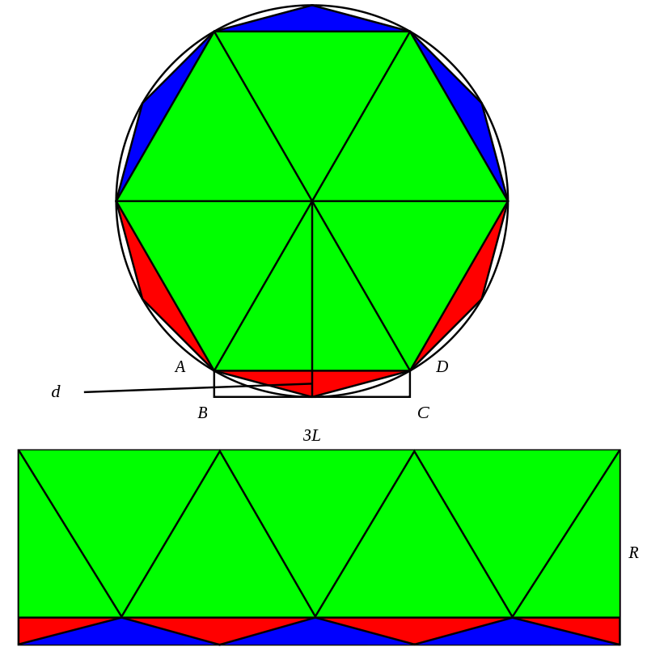
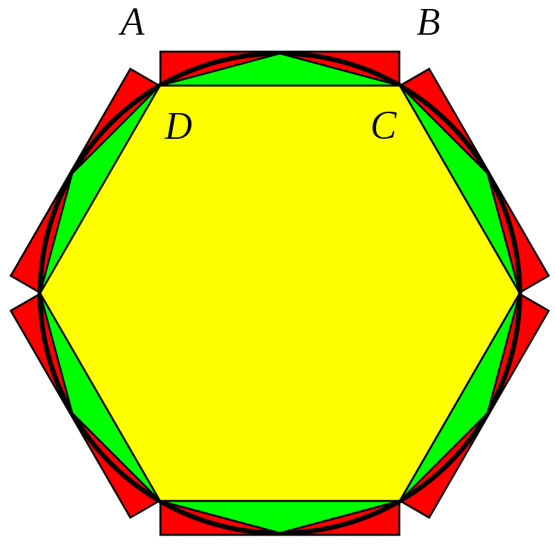

## 一、圆周率计算方法综述

### 1.1 几何

#### 1.1.1 线弧近似法

由古希腊数学家阿基米德提出，它采用多边形周长的方法来近似圆周长，以此求出圆周率。

对于圆的周长计算，有圆周长公式如下

$$
C = 2 \pi r
$$

对于圆的内接或者外接正 $n$ 边形，有

$$
C_{n} = n \times l_n
$$

其中 $l_n$ 是内接正多边形的边长，对于正 $n$ 边形，它的 $l_n$ 可以通过递推关系获得，如下所示：

$$
l_{2n} = \sqrt{(r - \sqrt{r^2 - \frac{l_n^2}{4}})^2 + \frac{l_n^2}{4}}
$$
其中 $r$ 是内接正多边形的中心到其角的距离，也可以直观理解为半径。

有了这两个公式，就可以用夹逼原理来计算 $\pi$ 了，如下所示
$$
C_{内接 n 变形} \lt C_n \lt C_{外接 n 变形} \\
\frac{n}{2r} l_{内接 n 变形} < \pi < \frac{n}{2r} l_{外接 n 变形}
$$
$n$ 的取值越大，那么就可以使 $\pi$ 更加精确。其示意图如下


阿基米德算到了当 $n = 96$ 的情况，但是因为每次迭代都需要进行开根计算，所以基本上迭代 4 次就是极限了（从 $n = 6$ 开始迭代，每次 $n$ 翻倍）。这不只是阿基米德的极限，也是人类手算的极限。

#### 1.1.2 割圆术

由三国时期魏国数学家刘徽发明，他也采用了用内接正多边形去逼近圆的思想，不过采用了面积逼近而不是和阿基米德一样的周长逼近，这是因为面积逼近可以使用他发明的“圆周率捷法”。

在面积计算上，对于正 $2n$ 边形，有如下公式：
$$
S_{2n} = \frac{nl_n}{2} \times r
$$
这个公式的得出依靠刘徽发明的“出入相补术”（也就是图形的裁剪拼接法），将正 $2n$ 边形切成 n 份，然后重新拼接成一个矩形：




有了上面这个公式再结合 $l_{2n}$ 的递推公式，就可以进行类似的递推。

此外刘徽还进步于它只利用了圆的内接正多边形，而没有使用圆的外接正多边形，在计算量上面减少了一半。

刘徽实现这一点，是通过一种新的图形拼接构造，如下所示：



可以看到圆的面积是小于红色、绿色（$S_{2n} - S_n$）和黄色（$S_n$）的和，而红色的面积是等于绿色面积的（拼接可得），所以有
$$
S \lt S_{red} + S_{green} + S_{yellow} = 2S_{2n} - S_n
$$
所以夹逼方式变成了
$$
S_n \lt S \lt 2S_{2n} - S_n
$$
在这种方式下，刘徽计算到了 192 边形（可能是累了），但是刘徽并没有停止，他发现 $S_{2n} - Sn$ 呈现了某种不严谨的等比数列特征，公比的倒数（我们又称其为 $D_n = \frac{S_{2n} - S_{n}}{S_{4n} - S_{2n}}$）约为 3.95 ，所以最终利用这个性质，刘徽计算到了 $n = 1536$ 。这个方法被称为捷法。

#### 1.1.3 辍术

祖冲之进一步发展了割圆术，分别得出来 $\pi$ 的两个分数强近似，即**约率** $\frac{22}{7}$ 和**密率** $\frac{355}{113}$ ，其中密率又被称为祖率，他约等于计算到了正 12288 边形。

至于戳术是如何计算的，非常不幸已经失传了，人们猜测是改进了刘徽的捷法，在捷法中，涉及**松弛因子** $\omega$ ，这个参数和 $D_n$ 有如下联系
$$
\omega = \frac{1}{D_{n} - 1}
$$
 $\omega$ 是加速计算的关键，因为割圆术夹逼的方式可以变形为
$$
S \approx S_{2n} + \omega(S_{2n} - S_n)
$$
所以选择一个好的 $\omega$ （也就是猜测 $D_n$ 的值）就成了计算的关键，如前所述，刘徽觉得 $D_n$ 约为 3.95，但是祖冲之通过继续计算（猜测内容），发现 $D_n$ 更可能约为 4（其实如果用代数法去看，就是 $D_n$ 最终收敛到哪个数的问题，但是因为极限概念没有建立，所以人们只能进行经验猜测），$D_n = 4$ 的计算效果更好，只需要割到 192 边形，就可以获得祖率。

总结一下，捷法其实只有一个能力，就是在夹逼法之外，进一步估算 $\pi$ 的值，这是因为夹逼法只能给出 $\pi$ 的一个上下限，而捷法通过发现 $D_n$ 有收敛的倾向，因此可以进一步估算 $\pi$ ，这种估算会使得精度更进一步。

### 1.2 代数

#### 1.2.1 韦达无穷乘积法

韦达最早提出了计算圆周率的分析表达式，也就是第一次摆脱了图形计算的方式，只是很可惜这是一种无限乘积形式，而不是无穷级数形式。其表达式如下：
$$
\frac{2}{\pi} = \frac{\sqrt{2}}{2} \cdot \frac{\sqrt{2 + \sqrt{2}}}{2} \cdot 
\frac{\sqrt{2 + \sqrt{2 + \sqrt{2}}}}{2} \cdots
$$
韦达发现这个公式是基于这样的思路：
$$
\frac{2}{\pi} = \frac{S_4}{S} = \frac{S_4}{S_8} \cdot \frac{S_8}{S_{16}} \cdot \frac{S_{16}}{S_{32}} \cdots \frac{S_{\infin}}{S_{\infin}}
$$
恰巧又发现了如下规律
$$
\frac{S_4}{S_8} = \frac{\sqrt{2}}{2} \\
\frac{S_8}{S_{16}} = \frac{\sqrt{2 + \sqrt{2}}}{2} \\
\frac{S_{16}}{S_{32}} = \frac{\sqrt{2 + \sqrt{2 + \sqrt{2}}}}{2}
$$
所以就得出了如下方法，因为当 $n$ 增大的时候，后面的比值会逐渐接近 1 ，所以可以只计算前面几项来获得一个近似的 $\pi$ 值。

#### 1.2.2 欧拉公式

欧拉用 Fourier 级数给出了公式
$$
\frac{\pi^2}{6} = \sum^{\infin}_{n = 1} \frac{1}{n^2}
$$

#### 1.2.3 梅钦公式

由 Leibinitz 基于反正切展开给出的圆周率计算式得到 Machin 公式来计算。

根据三角合差公式可知，若 $-\frac{\pi}{2} < \arctan\frac{a_1}{b_1} + \arctan\frac{a_1}{b_1} < \frac{\pi}{2}$ ，那么有
$$
\arctan\frac{a_1}{b_1} + \arctan\frac{a_1}{b_1} = \arctan\frac{a_1b_2 + a_2b_1}{b_1b_2 - a_1a_2}
$$
反复应用这一公式就可以得到 Machin 公式，推导如下：
$$
2\arctan\frac{1}{5} = \arctan\frac{1}{5} + \arctan\frac{1}{5} = \arctan\frac{5}{12} \\
4\arctan\frac{1}{5} = \arctan\frac{5}{12}+ \arctan\frac{5}{12} = \arctan\frac{120}{119} \\
4\arctan\frac{1}{5} -\frac{\pi}{4} = 4\arctan{\frac{1}{5}} + \arctan{\frac{-1}{1}} = \arctan\frac{1}{239}
$$
最终可推得：
$$
\pi = 16\arctan\frac{1}{5} - 4\arctan\frac{1}{239}
$$
结合反正切函数的泰勒展开计算 $\arctan\frac{1}{5}$ 和 $\arctan\frac{1}{239}$
$$
\arctan x = \sum^{+\infin}_{n = 0} \frac{(-1)^n}{2n + 1}x^{2n + 1} = x - \frac{x^3}{3} + \frac{x^5}{5} - \frac{x^7}{7} + \dots
$$
就可以计算圆周率。

#### 1.2.4 拉马努金公式

拉马努金公式如下所示：
$$
\frac{1}{\pi} = \frac{2\sqrt{2}}{9801} \sum^{\infin}_{k = 0} \frac{(4k)!(1103 + 26390k)}{(k!)^4396^{4k}}
$$
只能说这个公式很拉马努金，不过这个公式精确度惊人，收敛的十分快速。

#### 1.2.5 其他

可以采用数值积分的方式计算圆周率。可以用 Simpson 方法。

此外还可以用随机模拟计算方法，也就是蒙特卡洛法。

### 1.3 对比

在几何法上，思路比较单一和直观，都是采用内外接正多边形去近似圆的思路，而代数法上，思路则更加多样化，韦达公式依然可以看出几何法的影子，但是欧拉公式或者积分法都是依赖于微积分这个高等数学的大杀器存在，至于拉马努金公式，我个人觉得更像是数学发展到了更加进步的水平后，数学天才这种环境下，其敏锐的数学直觉可以捕获更加多的灵感。数值积分法和蒙特卡洛法都需要计算机技术的支持，那就是另一种美感了。

从计算准确度上来说，几何法因为依赖于勾股定理或者三角，表达式中出现了大量的根号，而开根计算计算量大，很难进行多次迭代后达到一个很高精度，刘徽和祖冲之的优势不在于计算能力惊人，而是在几何法之后捕捉到了一些计算的代数特征，使得计算精度得到了提升。代数法因为有微积分和无穷级数等数学工具的发展，可以进一步分析 $\pi$ 的代数特征，将计算难度大的开根操作转成操作难度小的加减乘除操作，使得迭代次数提升，进而提高了计算准确度。


## 二、刘徽法与内插法比较

用单位圆计算圆周率所涉及递推数学计算公式如下所示：

 $l_n$ 是内接正多边形的边长，对于正 $n$ 边形，它的 $l_n$ 可以通过递推关系获得，如下所示：

$$
l_{2n} = \sqrt{(r - \sqrt{r^2 - \frac{l_n^2}{4}})^2 + \frac{l_n^2}{4}}
$$
我们可以用 python 中的 lambda 表达式描述这个递推方程

```python
next_l = lambda l : math.sqrt((1.0 - math.sqrt(1.0 - l**2 / 4.0))**2 + l**2 / 4.0)
```

在面积计算上，对于正 $2n$ 边形，有如下公式：
$$
S_{2n} = \frac{nl_n}{2} \times r
$$
依然采用 lambda 进行描述

```python
S_liuhui = lambda n, l : n * l / 2.0
```

对于内插法，需要记录 $S_n$ 和 $S_{2n}$ 进而求得 $S_{2n} + \omega(S_{2n} - S_n)$

```python
def calculate_interpolation(n, omega):
    Sn = calculate_Sn(n / 2, S_liuhui)
    S2n = calculate_Sn(n, S_liuhui)
    return S2n + omega * (S2n - Sn)
```

根据这两个公式，从 $n = 6$ 开始进行递推，即可进行计算。

用 python 实现程序如下：

```python
import math

# ln 的递推方程
next_l = lambda l : math.sqrt((1.0 - math.sqrt(1.0 - l**2 / 4.0))**2 + l**2 / 4.0)
# 刘徽的面积算法
S_liuhui = lambda n, l : n * l / 2.0

def calculate_Sn(n, S):
    """
    用于计算用于拟合圆的 2n 正多边形的面积

    Args:
        n(int): 正多边形的边数，取值为 6 * 2^k
        S(lambda): 正多边形计算公式

    Returns:
        面积
    """
    times = int(math.log(n / 6, 2)) # 计算迭代次数
    ln = 1.0 # 设置初值，有 l6 == 1

    for _ in range(times):
        ln = next_l(ln)

    return S(n, ln)

def calculate_direct(n):
    return calculate_Sn(n, S_liuhui)

def calculate_interpolation(n, omega):
    Sn = calculate_Sn(n / 2, S_liuhui)
    S2n = calculate_Sn(n, S_liuhui)
    return S2n + omega * (S2n - Sn)

pi_error = lambda pi: abs(pi - math.pi) / math.pi

direct = calculate_direct(3072)
print(f"刘徽法直接计算 n == 3072 的结果为：{direct}")
print(f"刘徽法直接计算 n == 3072 的误差为：{pi_error(direct)}")

inter = calculate_interpolation(3072, 1.0 / 3.0)
print(f"刘徽法内插捷法 n == 3072 的结果为：{inter}")
print(f"刘徽法内插捷法 n == 3072 的误差为：{pi_error(inter)}")

```

输出如下

```
刘徽法直接计算 n == 3072 的结果为：3.1415921059992717
刘徽法直接计算 n == 3072 的误差为：1.7430347653306335e-07
刘徽法内插捷法 n == 3072 的结果为：3.141592653589679
刘徽法内插捷法 n == 3072 的误差为：3.63290023616055e-14
```

可以看到在迭代次数相同的情况下，内插法更占优势。

在夹逼法之外，进一步估算 $\pi$ 的值，这是因为夹逼法只能给出 $\pi$ 的一个上下限，而插值法通过发现 $D_n$ 有收敛的倾向，因此可以进一步估算 $\pi$ ，这种估算会使得精度更进一步。


## 三、辛普森数值积分法

现在考虑用抛物线代替直线，由辛普森数值积分可知，此时抛物线的面积为
$$
S_{抛物线} = \frac{2l_n}{3}(r -\sqrt{r^2 - \frac{l_n^2}{4}})
$$
此时计算出来的近似面积用 python lambda 表示为

```python
S_simpson = lambda n, l : n * (l / 3.0 * (2.0 - math.sqrt(1.0 - l**2 / 4.0) / 2.0))
```

因为只是 $S_{2n}$ 的计算公式变换， $l_n$ 递推方程没有受到影响，所以稍微修改上面的程序即可运行，修改后程序如下：

```python
import math

# ln 的递推方程
next_l = lambda l : math.sqrt((1.0 - math.sqrt(1.0 - l**2 / 4.0))**2 + l**2 / 4.0)
# 刘徽的面积算法
S_liuhui = lambda n, l : n * l / 2.0
# 用 simpson 抛物线法计算面积
S_simpson = lambda n, l : n * (l / 3.0 * (2.0 - math.sqrt(1.0 - l**2 / 4.0) / 2.0))

def calculate_Sn(n, S):
    """
    用于计算用于拟合圆的 2n 正多边形的面积

    Args:
        n(int): 正多边形的边数，取值为 6 * 2^k
        S(lambda): 正多边形计算公式

    Returns:
        面积
    """
    times = int(math.log(n / 6, 2)) # 计算迭代次数
    ln = 1.0 # 设置初值，有 l6 == 1

    for _ in range(times):
        ln = next_l(ln)

    return S(n, ln)

def calculate_direct(n):
    return calculate_Sn(n, S_liuhui)

def calculate_interpolation(n, omega):
    Sn = calculate_Sn(n / 2, S_liuhui)
    S2n = calculate_Sn(n, S_liuhui)
    return S2n + omega * (S2n - Sn)

def calculate_simpson(n):
    return calculate_Sn(n, S_simpson)

pi_error = lambda pi: abs(pi - math.pi) / math.pi

direct = calculate_direct(3072)
print(f"刘徽法直接计算 n == 3072 的结果为：{direct}")
print(f"刘徽法直接计算 n == 3072 的误差为：{pi_error(direct)}")

inter = calculate_interpolation(3072, 1.0 / 3.0)
print(f"刘徽法内插捷法 n == 3072 的结果为：{inter}")
print(f"刘徽法内插捷法 n == 3072 的误差为：{pi_error(inter)}")

simpson = calculate_simpson(3072)
print(f"辛普森抛物线法 n == 3072 的结果为：{simpson}")
print(f"辛普森抛物线法 n == 3072 的误差为：{pi_error(simpson)}")

```

程序计算结果如下

```
刘徽法直接计算 n == 3072 的结果为：3.1415921059992717
刘徽法直接计算 n == 3072 的误差为：1.7430347653306335e-07
刘徽法内插捷法 n == 3072 的结果为：3.141592653589679
刘徽法内插捷法 n == 3072 的误差为：3.63290023616055e-14
辛普森抛物线法 n == 3072 的结果为：3.1415926535896794
辛普森抛物线法 n == 3072 的误差为：3.618764437576268e-14
```

可以看到辛普森法比刘徽直接法的收敛精度有很大的提高，但是只比刘徽内插法同数量级高一些。但是辛普森方法的计算量要远大于刘徽内插法，足以见得刘徽的超高智慧。


## 四、梅钦公式

由 Leibinitz 基于反正切展开给出的圆周率计算式得到 Machin 公式来计算。

根据三角合差公式可知，若 $-\frac{\pi}{2} < \arctan\frac{a_1}{b_1} + \arctan\frac{a_1}{b_1} < \frac{\pi}{2}$ ，那么有
$$
\arctan\frac{a_1}{b_1} + \arctan\frac{a_1}{b_1} = \arctan\frac{a_1b_2 + a_2b_1}{b_1b_2 - a_1a_2}
$$
反复应用这一公式就可以得到 Machin 公式，推导如下：
$$
2\arctan\frac{1}{5} = \arctan\frac{1}{5} + \arctan\frac{1}{5} = \arctan\frac{5}{12} \\
4\arctan\frac{1}{5} = \arctan\frac{5}{12}+ \arctan\frac{5}{12} = \arctan\frac{120}{119} \\
4\arctan\frac{1}{5} -\frac{\pi}{4} = 4\arctan{\frac{1}{5}} + \arctan{\frac{-1}{1}} = \arctan\frac{1}{239}
$$
最终可推得：
$$
\pi = 16\arctan\frac{1}{5} - 4\arctan\frac{1}{239}
$$
我们可以将写为 python，如下所示：

```python
near = 16.0 * arctan_taylor(1.0 / 5.0, times) - 4.0 * arctan_taylor(1.0 / 239.0, times)
```

结合反正切函数的泰勒展开计算 $\arctan\frac{1}{5}$ 和 $\arctan\frac{1}{239}$
$$
\arctan x = \sum^{+\infin}_{n = 0} \frac{(-1)^n}{2n + 1}x^{2n + 1} = x - \frac{x^3}{3} + \frac{x^5}{5} - \frac{x^7}{7} + \dots
$$
这个泰勒展开需要指定项数 $n$ 和 $x$ 的值，可以用 python 代码如下编程：

```python
arctan_taylor = lambda x, n: sum(((-1)**i / (2 * i + 1)) * x**(2 * i + 1)
                            for i in range(n))
```

为了使得误差低于七位小数，我们需要一个循环去检测是否当前项数可以使得误差符合要求，如果不符合，那么就增大当前项数，代码如下所示：

```python
while error >= 1e-7:
    near = 16.0 * arctan_taylor(1.0 / 5.0, times) - 4.0 * arctan_taylor(1.0 / 239.0, times)
    error = abs(math.pi - near)
    print(f"当求和项数为 {times} 时，Pi 的估算值为 {near} ，误差为 {error} ")
    times = times + 1
```

项目总代码如下

```python
import math

arctan_taylor = lambda x, n: sum(((-1)**i / (2 * i + 1)) * x**(2 * i + 1)
                            for i in range(n))

error = 1.0
times = 1
while error >= 1e-7:
    near = 16.0 * arctan_taylor(1.0 / 5.0, times) - 4.0 * arctan_taylor(1.0 / 239.0, times)
    error = abs(math.pi - near)
    print(f"当求和项数为 {times} 时，Pi 的估算值为 {near} ，误差为 {error} ")
    times = times + 1
```

输出如下

```
当求和项数为 1 时，Pi 的估算值为 3.18326359832636 ，误差为 0.04167094473656707 
当求和项数为 2 时，Pi 的估算值为 3.1405970293260603 ，误差为 0.0009956242637327861 
当求和项数为 3 时，Pi 的估算值为 3.1416210293250346 ，误差为 2.837573524150372e-05 
当求和项数为 4 时，Pi 的估算值为 3.1415917721821773 ，误差为 8.814076157825923e-07 
当求和项数为 5 时，Pi 的估算值为 3.1415926824043994 ，误差为 2.8814606256588604e-08 
```

可以看到当求和项数为 5 的时候，就可以计算出小数点后七位。

