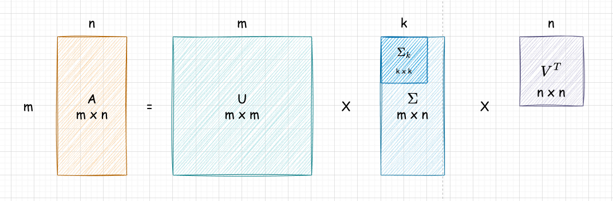
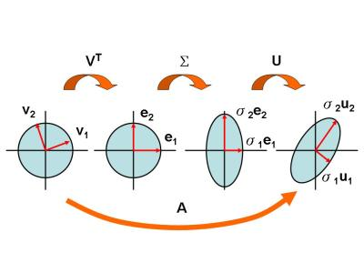
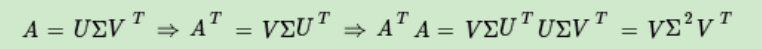
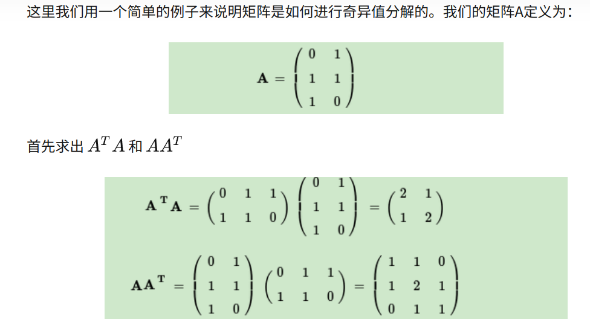
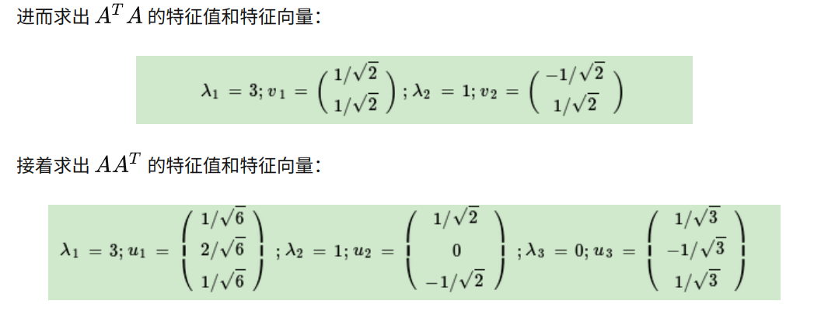
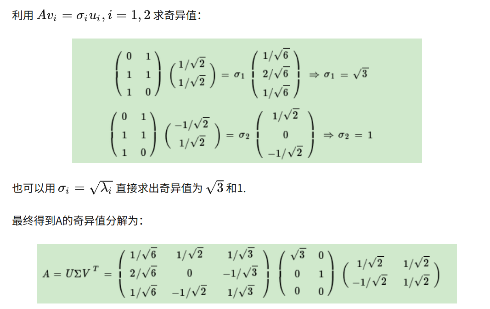
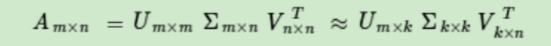

## 一、正交矩阵

正交矩阵的定义如下：

$$
UU^T = I
$$

$UU^T$ 这种写法虽然看似独特，但是并不是很晦涩的，当我们形容向量 $X$ 与其自身做内积的时候，用的就是 $XX^T$，$UU^T$ 无非是利用“矩阵可以看成向量组”的特性，对于多个向量同时进行内积运算，当

$$
UU^T = diag
$$

也就是只要结果是一个对角阵，就说明 $U$ 里面的向量彼此之间是正交的（也就是内积结果为 0），而 $UU^T = I$ 这个条件相比于彼此正交要更加强，他指的是不但正交，而且具有一种**归一化**的性质。

将 $U$ 用于变换，产生的结果被称为“正交变换”，也就是“旋转，轴对称”这种保持图形形状和大小不变的变换。

另外，在实数领域，正交矩阵是等价于“酉矩阵”和“幺矩阵”的，其中“酉矩阵”是因为其英文为“Unitary Matrix”，取其首音形成的，而“幺矩阵”就是“1”的奇怪口音了吧。

之所以介绍这个概念，是因为我们需要正交变换的概念，来辅助我们更直观的理解下面的概念。

---

## 二、定义

奇异值分解（Singular Value Decomposition，SVD），其公式表示如下

$$
A = U \Sigma V^T
$$

其中 $U, V$ 均为酉矩阵，而 $\Sigma$ 矩阵是一个 m x n 的矩阵，除了它的主对角线（满足行号的等于列号）外的元素均为 0，主对角线上元素被称为奇异值，这也是其名字的由来，singular 可以被理解为“单一的”，但是同时也可以被理解为“奇异的”。

如果从向量角度理解的话，是：
$$
A = \begin{bmatrix} \mathbf{u}_1 & \mathbf{u}_2 & \cdots & \mathbf{u}_m \end{bmatrix}
\begin{bmatrix} 
\sigma_1 & & & \\ 
& \sigma_2 & & \\
& & \ddots & \\
& & & \sigma_r \\
& & & \vdots \\
\end{bmatrix}
\begin{bmatrix} 
\mathbf{v}_1^T \\ 
\mathbf{v}_2^T \\ 
\vdots \\ 
\mathbf{v}_n^T 
\end{bmatrix}

\\

= \begin{bmatrix} \sigma_1 \mathbf{u}_1 & \sigma_2 \mathbf{u}_2 & \cdots & \sigma_r \mathbf{u}_r & 0 & \cdots & 0 \end{bmatrix}
\begin{bmatrix} 
\mathbf{v}_1^T \\ 
\mathbf{v}_2^T \\ 
\vdots \\ 
\mathbf{v}_n^T 
\end{bmatrix}

\\

= \sigma_1 \mathbf{u}_1 \mathbf{v}_1^T + \sigma_2 \mathbf{u}_2 \mathbf{v}_2^T + \cdots + \sigma_r \mathbf{u}_r \mathbf{v}_r^T  = 
\\
\sum^r_{i = 0} \sigma_i \mathbf{u}_i \mathbf{v}_i^T
$$
我喜欢这种角度的原因是，此时每个 $\sigma_i \mathbf{u}_i \mathbf{v}_i^T$ 都是一个和 $A$ 形状相同的矩阵，而当 $\sigma_i$ 越大的时候，往往说明 $\sigma_i \mathbf{u}_i \mathbf{v}_i^T$ 对 $A$ 的影响越大。

如果画图就是这样的

可以看到，奇异值分解与特征向量分解具有一定的相似性，比如说都需要两个方阵去辅助分解，中间的部分是“分解的精髓”，它暗示了某种原来矩阵的性质，在特征向量分解中，组成中间矩阵的是特征值，而在在奇异值分解中，组成中间矩阵的是奇异值。两者的区别是奇异值分解可以对于非方阵使用。此外特征值之间“并不平等”，有“主特征值”的概念，只需要几个比较有代表性的特征值（说白了就是值更大），就可以很好的代表未分解的矩阵，奇异值也有这个特性。 

奇异值分解也可以被理解成“旋转 -> 拉伸 -> 再次旋转”的过程：

可以看到 $\Sigma$ 起到是“拉伸”的作用，所以可能比较重要吧，毕竟只有在这一步影响了形状，而其他步骤只是影响了角度。

----

## 三、分解

### 3.1 理论

首先求解 $U$，其满足方程
$$
AA^T u = \lambda u
$$
其本质是对 m x m 的方阵 $AA^T$ **求解特征向量矩阵**，得到的特征向量矩阵就是 $U$，也被称为左奇异向量矩阵。

然后求解 $V$，其满足方程
$$
A^TA v = \lambda v
$$
其本质是对 n x n 的方阵 $A^TA$ **求解特征向量矩阵**，得到的特征向量矩阵就是 $V$，也被称为右奇异向量矩阵。

然后求解奇异值矩阵 $\Sigma$ ，这个矩阵由奇异值组成，因为有 $AV = U\Sigma$ ，每个奇异值都是如下求解的
$$
Av_i = \sigma_i u_i \quad\Rightarrow\quad \sigma_i = Av_i \div u_i
$$
其中 $Av_i$ 和 $u_i$ 的形状相同，所以是数乘的意思。可以看到，从本质上讲，一个奇异值 $\sigma_i$ ，都会对应一个左奇异值 $u_i$ 和一个右奇异值 $v_i$ 。 

但是实际上，我们也不用这个方法，因为有推导

所以我们可以考虑直接求出 $A^TA$ 的特征值，然后对每个特征值开方即可。

### 3.2 示例

---

## 四、意义

对于奇异值,它跟我们特征分解中的特征值类似，在奇异值矩阵中也是按照从大到小排列，而且奇异值的减少特别的快，在很多情况下，前 10% 甚至 1% 的奇异值的和就占了全部的奇异值之和的 99% 以上的比例。

也就是说，我们也可以用最大的 k 个的奇异值和对应的左右奇异向量来近似描述矩阵。

