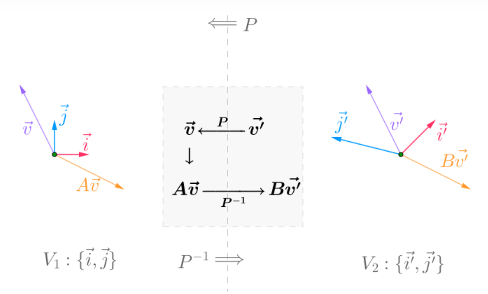
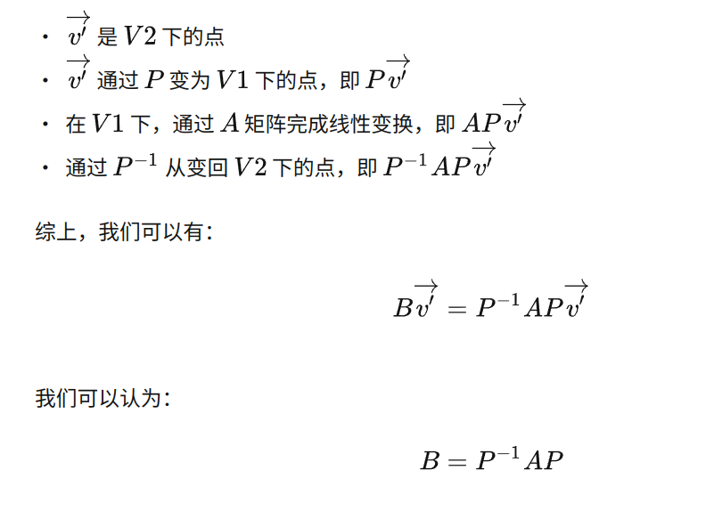

## 一、特征方程的求解

这里首先给出一个方程
$$
Ax = \mu x
$$
这个方程描述的是，一个非零向量 $x$ ，经过特定的矩阵 $A$ 进行线性变换，最终的结果是，将 $x$ 拉伸或者压缩自己的实数倍（也就是值改变了向量的长度，没有改变向量的方向）。

这个方程本质上是为了每个特定的 $A$，去寻找一些符合这个条件的 $x$，而 $\mu$ 只是求解的参数，最后求出的解中应该带 $\mu$，但是为了让满足一些非零的条件，我们可以先将 $\mu$ 求出，进而求解每个 $\mu$ 对应的 $x$。

上面的方程可以变形成方程组的形式
$$
(A - \mu I)x = 0
$$
因为这个方程组（将上面的式子理解成一个线性方程组）一定有零解，所以如果想要非零解，就说明系数矩阵 $A - \mu I$ 一定是不满秩的，那么就可以用行列式描述这种“不满秩”特性，也就是
$$
\big\vert A - \mu I \big\vert = 0
$$
这个行列式对应的多项式被称为**特征多项式**，求出来的值就是**特征值 $\lambda$**。

然后根据求解出来的 $\lambda$ ，带入原特征方程，就可以求解出特征向量了。

---

## 二、特征向量与相似性

### 2.1 相似定义

设 $A, B$ 是 $n$ 阶方阵，如果存在 $n$ 阶可逆方阵 $P$ ，使得
$$
B = P^{-1} A P
$$
则称 $A$ 与 $B$ 相似。

如果想要直观理解，可以这样理解**同一个线性变化，在不同基下的矩阵，称为相似矩阵**。也就是下面的图

发生的都是线性变换都是**将紫色的向量变成黄色的向量**，但是因为基的不同，所以线性变换的内容也由 $A$ 变成 $B$。在推导中，有

其中 $P$ 就是由 $V2$ 到 $V1$ 的过渡矩阵（也可能反过来，我没时间探究了）。

### 2.2 特征向量与对角矩阵相似

我们进行基变换的目的一般都是为了让线性变换的形式更加简单（就好像我们喜欢沿着椭圆的长短轴建系一样），那么线性变换比较简单的一个形式就是**对角矩阵**，因为在这个形式下，变化变得十分显然。

我们举一个例子来联系特征向量和对角矩阵相似推导。
$$
A = \left[\begin{matrix}3 & 2 & 1 \\ 0 & -1 & -2 \\ 0 & 0 & 3\end{matrix}\right]
$$
这个方程的三个特征向量分别是 $X_1 = (1, 0, 0)^T, X_2 = (0, 1, -2)^T, X_3 = (1, -2, 0)^T$ ，分别满足 $AX_1 = 3X_1, AX_2 = 3X_2, AX_3 = -X_3$ ，如果令
$$
P = (X_1, X_2, X_3)
$$
那么由特征方程有
$$
AP = (AX_1, AX_2, AX_3) = (X_1, X_2, X_3) \left[\begin{matrix}3 & 0 & 0 \\ 0 & 3 & 0 \\ 0 & 0 & 1\end{matrix}\right]
$$
如果再令
$$
D = \left[\begin{matrix}3 & 0 & 0 \\ 0 & 3 & 0 \\ 0 & 0 & 1\end{matrix}\right]
$$
这个 $D$ 就是由特征值构成的对角矩阵，那么就有
$$
A = PDP^{-1}
$$

---

## 三、矩阵的运动

到底**特征值和特征向量**怎样用**运动**去理解，我们知道，当一个方阵A满秩时候，就有
$$
A=P\left[\begin{matrix}\lambda_{1}&0&...&0\\0&\lambda_{2}&...&0\\...&...&...&...\\0&0&...&\lambda_{n}\end{matrix}\right]P^{-1}
$$
其中
$$
P=\left[\begin{matrix}\alpha_{1}&\alpha_2&\cdots&\alpha_n\end{matrix}\right]
$$
$\alpha_i$ 是特征值 $\lambda_i$ 对应的特征向量。

我们知道，在**运动的观点**下看，矩阵乘法的意义是把原来的一个向量x通过矩阵A变换成一个新的向量，发生了一次**运动**，原来我理解特征值和特征向量就是，只有特征向量会在A的作用下方向不发生改变，只有大小发生改变，改变的倍数就是对应特征值，但是这样分析好像不够本质，我们用**多次运动**来将其更加直观一些。即A次幂，有
$$
A^kx=\lambda_1^kP\left[\begin{matrix}1&0&...&0\\0&(\frac{\lambda_2}{\lambda_1})^k&...&0\\...&...&...&...\\0&0&...&(\frac{\lambda_n}{\lambda_1})^k\end{matrix}\right]P^{-1}x
$$
其中，$\lambda_1$​​是最大的特征值，当k趋于无穷的时候，中间的矩阵会变成一个左上角为1，其他所有地方都是0的矩阵，然后先运算 $P^{-1}x$​ 将其第一个分量记为c，有
$$
A^kx=c\lambda_1^k\alpha_1
$$
也就是说，无论输入什么向量，在多次运动后，其方向都会趋于最大特征值对应的特征向量的方向，也就是说，这个矩阵有一个很本质的**运动趋势**可以用特征向量来概括，就好像推动帆船的风一样，虽然船的方向不一定与风相同，但是只要吹得久，最终都会相同。