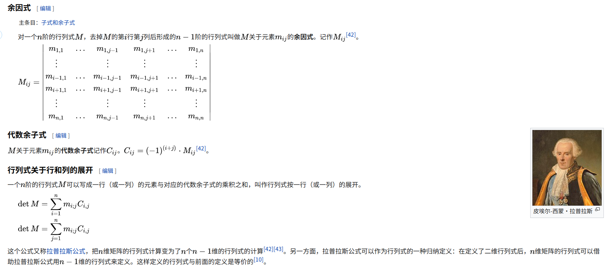
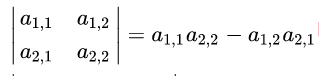
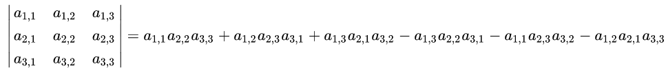
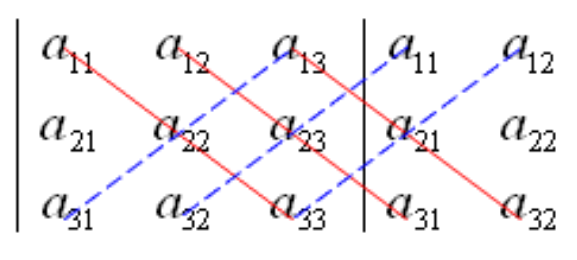
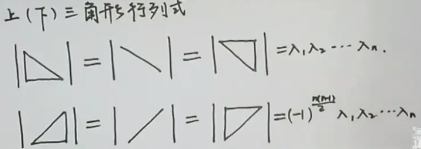

## 一、直观意义

行列式（**determinant**）可以看做在多维空间上的向量组形成“**有向体积**”，这种认识可以辅助我们理解一些性质：

- 可以利用行列式求解四边形面积、六棱锥体积。

- 交换构成行列式的向量，并不会改变行列式的绝对值，而可能会改变行列式的正负。这是因为改变边的顺序不会影响体积。

- 一旦有一行或者一列为 0，或者这个方阵没有满秩，就会导致行列式为 0。某一个向量为 0，肯定会导致体积为 0，当没有满秩，就说明有两条“边”方向重合了，也会导致体积为 0。

- 将一行（列）的 $k$​ 倍加进另一行（列）里，行列式的值不变。类似于固定了底面和高，其实第三条楞只要在平行于底面的边上变化，就不会导致体积的改变
  $$
  {\begin{vmatrix}\vdots &\vdots &\vdots &\vdots \\a_{i1}&a_{i2}&\dots &a_{in}\\a_{j1}&a_{j2}&\dots &a_{jn}\\\vdots &\vdots &\vdots &\vdots \\\end{vmatrix}}={\begin{vmatrix}\vdots &\vdots &\vdots &\vdots \\a_{i1}&a_{i2}&\dots &a_{in}\\a_{j1}{\color {blue}+ka_{i1}}&a_{j2}{\color {blue}+ka_{i2}}&\dots &a_{jn}{\color {blue}+ka_{in}}\\\vdots &\vdots &\vdots &\vdots \\\end{vmatrix}}
  $$

- 在行列式中，某一行（列）有公因子 $k$，则可以提出 $k$。类似于一条边的倍数发生变化的时候，会导致体积的倍数发生相同的变化。
  $$
  {\displaystyle D={\begin{vmatrix}a_{11}&a_{12}&\dots &a_{1n}\\\vdots &\vdots &\ddots &\vdots \\{\color {blue}k}a_{i1}&{\color {blue}k}a_{i2}&\dots &{\color {blue}k}a_{in}\\\vdots &\vdots &\ddots &\vdots \\a_{n1}&a_{n2}&\dots &a_{nn}\end{vmatrix}}={\color {blue}k}{\begin{vmatrix}a_{11}&a_{12}&\dots &a_{1n}\\\vdots &\vdots &\ddots &\vdots \\a_{i1}&a_{i2}&\dots &a_{in}\\\vdots &\vdots &\ddots &\vdots \\a_{n1}&a_{n2}&\dots &a_{nn}\end{vmatrix}}={\color {blue}k}D_{1}}
  $$
  

- 在行列式中，某一行（列）的每个元素是两数之和，则此行列式可拆分为两个相加的行列式。类似于在计算高的时候，将高拆分成两个部分计算。
  $$
  {\displaystyle {\begin{vmatrix}a_{11}&a_{12}&\dots &a_{1n}\\\vdots &\vdots &\ddots &\vdots \\{\color {blue}a_{i1}}+{\color {OliveGreen}b_{i1}}&{\color {blue}a_{i2}}+{\color {OliveGreen}b_{i2}}&\dots &{\color {blue}a_{in}}+{\color {OliveGreen}b_{in}}\\\vdots &\vdots &\ddots &\vdots \\a_{n1}&a_{n2}&\dots &a_{nn}\end{vmatrix}}={\begin{vmatrix}a_{11}&a_{12}&\dots &a_{1n}\\\vdots &\vdots &\ddots &\vdots \\{\color {blue}a_{i1}}&{\color {blue}a_{i2}}&\dots &{\color {blue}a_{in}}\\\vdots &\vdots &\ddots &\vdots \\a_{n1}&a_{n2}&\dots &a_{nn}\end{vmatrix}}+{\begin{vmatrix}a_{11}&a_{12}&\dots &a_{1n}\\\vdots &\vdots &\ddots &\vdots \\{\color {OliveGreen}b_{i1}}&{\color {OliveGreen}b_{i2}}&\dots &{\color {OliveGreen}b_{in}}\\\vdots &\vdots &\ddots &\vdots \\a_{n1}&a_{n2}&\dots &a_{nn}\end{vmatrix}}}
  $$
  

---

## 二、计算

### 2.1 定义计算

$$
\det(A)=\sum _{\sigma \in S_{n}}\operatorname {sgn}(\sigma )\prod _{i=1}^{n}a_{i,\sigma (i)}
$$

我们一般按照行计算，那么我们选择一个“**排列**”，然后按照内容挑选列好，比如说对于一个 $n = 5$ 的排列 $3, 2, 5, 1, 4$ ，我们就选择元素 $\tt{a_{1, 3},a_{2, 2},a_{3, 5},a_{4, 1},a_{5, 4},}$ 然后将他们乘起来，然后还要根据这个排序的逆序数是否为偶数判定符号，最后将所有的排序累加起来。

所以从这里可以看出，此时的复杂度是 $O(n) \times O(n!) = O(n\times n!)$ 的，这是因为每次都需要进行 $n$ 次的乘积。

### 2.2 拉普拉斯计算

这种计算本质上第一种是等价的，而且复杂度同样是 $O(n\times n!)$。

### 2.3 低维计算

对于二维矩阵，有如下公式

对于三维矩阵，有如下公式

有如下方便记忆的形式

---

## 三、性质

### 3.1 行变换相关

主要涉及上面的倒数第二条和倒数第三条，这也是改进行列式计算的一个方法，因为普世的方法的复杂度是 $O(n\times n!)$，我们可以利用这两条性质将其变换成上三角的形式，而当一个矩阵呈现上三角的形式的时候，就会出现如下性质

这个形式是因为大量的排列都会因为半个矩阵的 0 导致没用，最后只有对角线的元素会被计算（其他的排列的元素中都会有 0），这样时间复杂度就会被降到 $O(n^3)$ ，这是因为发生一次行变换需要 $O(n)$，一共需要发生 $O(n^2)$ 次变换。

这个方法也适用于普世的、手写的行列式计算。

### 3.2 运算性质

数乘，因为每一行都提出一个 $\mu$ ，最后就会提出 $n$ 个 $\mu$ 。
$$
\big\lvert\mu A\big\rvert = \mu^n \big\lvert A \big\rvert
$$

矩阵相乘
$$
\big\lvert AB \big\rvert = \big\lvert A \big\rvert \times \big\lvert B \big\rvert
$$
矩阵的逆
$$
\big\lvert A^{-1} \big\rvert = \frac{1}{\big\lvert A \big\rvert}
$$

### 3.3 特征值相关

在求解特征方程的时候，本质在求解
$$
Ax = \lambda x \quad\Rightarrow\quad (A - \lambda I) x = 0 \quad\Rightarrow\quad \big\lvert A - \lambda I \big\rvert = 0
$$
这是因为如果想要让中间的式子有**非零解**，说明一定要让这个线性方程组不满秩（满秩只有唯一解，这个唯一解就是 0），所以前面的系数矩阵的行列式一定是 0 的。

此外有引理，行列式的值就是所有特征值的累乘，这个可以利用相似矩阵结合行列式乘法进行证明。
