## 一、分布式系统

### 1.1 总论

分布式系统指的是利用多个单体计算机系统构建的多体计算机系统。

与并行计算不同，分布式系统更侧重于用多个计算实体完成**非常多个**细碎的任务。而并行计算侧重于利用多个计算实体来更快更高效地完成**一个**计算任务。

分布式系统包括了执行流的分布式和数据的分布式。在北航 OO 课电梯问题中，涉及了多线程，属于是执行流的分布式，这就导致我以为分布式只是执行流的分布式，涉及的问题只是互斥和同步，这是非常片面的。数据的分布式指的是，存在多个数据副本，cache 就是一种数据分布式的实体。

### 1.2 背景

分布式系统虽然出现在各个系统层次，比如说多核的 CPU，多级存储系统，多线程的程序，分布式式的 Web APP。但是大部分的分布式理论都源于 Web APP，这是因为 Web 时代发展的红利导致的。

传统的 Web APP 架构被称为 LAMP，即 Linux + Apache + MySQL + PHP。

LAMP 的拓展性并不符合要求，其核心原因在于 Web APP 的用户拓展性非常好，一个用户生产 1M 的数据（非常小），那么一百万个用户就会生产出 1T 的数据，这就不再是一个磁盘可以简单存放的了，我们就需要一个存储的集群了。及时人们可以制造出一个非常大的磁盘，但是它的速度一定是会受到影响的。

计算也是同理，可能一个用户请求的计算量并不大，但是一百万个用户的计算量就非常大了。而受到摩尔定律和登纳德缩放定律失效的影响，人们是无法制造出一个超级强悍的单体芯片的，这就导致必须使用多个芯片。

这个时候将系统从单机拓展成分布式系统，就非常自然了。

### 1.3 组成

下面会介绍一个分布式的 Web APP （电商平台）由哪几个部分组成，其架构如图所示：

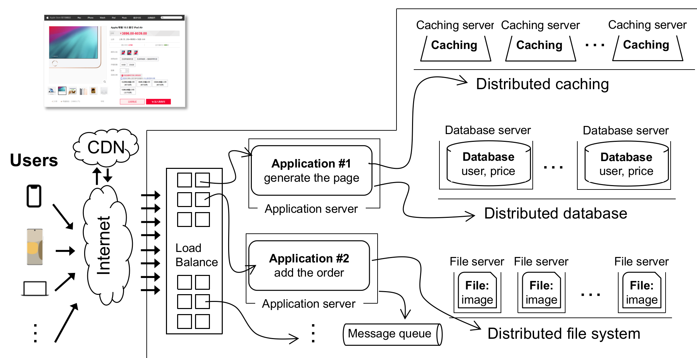

存在如下分布式：

- 外存的分布式：将数据存放在多个外存服务器上，也就是分布式的文件系统和分布式的数据库。
- 内存的分布式：分布式外存无法高效的缓存数据，且 APP 所在的单机的内存不够大，所以将内存也进拓展，也就是 Memcached
- app 的分布式：app 不需要部署在同一个单机上，可以部署在不同单机上，每个单机负责不同的功能。
- Load Balance：仅存在一个 app 依然非常局限，可以在多个单机上启动多个相同的 app，再由 Load Balancer 来决定请求发往哪个更为空闲的单机。这种技术除了依赖负载平衡技术外，还依赖 HTTP 协议的无状态性，使得负载均衡可以做得很轻松，如果是有状态的，那么负载均衡调度的就不再只是请求，就还包括之前的状态信息。
- CDN：将一些多媒体资源，放置在距离用户更近的地方。
- Compute 的分布式：将大量的计算任务放在单独的集群上（这张图上好像没有）。

### 1.4 CAP 理论

#### 1.4.1 介绍

CAP 指的是分布式的三种重要属性，之所以将它们三个单独拎出来，是因为这三个属性构成了一个不可能三角（我也不知道有没有严格数学证明）。

我个人认为理解 CAP 理论的难点在于理解清楚这三个属性的定义，他们的定义如下：

- **C**onsistency（一致性）：多个数据备份中的数据是一模一样的，用户可能会对某个备份中的数据进行修改，然后另一个数据备份中的数据也会跟随变化，保持一致。当系统没有一致性的时候，可能存在不同的数据备份，也就是正确性出现了问题。
- **A**vailable（可用性）：这是非常难理解的一个属性，他指的是用户对于数据的操作（读取或者写入一个数据等）是成功的概率非常高。而当失去可用性的时候，用户的操作经常会收到“操作失败，请重新尝试”的回应。
- **P**artition Tolerance（分区容忍性）：这个也非常难理解，它指的是在多个数据备份失去连接的时候（也就是所谓的“分区”），系统依然保持一致性和可用性的能力。C 和 A 对于一个单机系统而言，是非常自然的属性（要不然就是写出来 bug）了，但是如果是分布式系统，一旦数据备份之间失去同步能力，那么是很难保证 C 和 A 的。

那么为什么这是一个不可能三角呢？我们考虑如下图这样的情况，目前有两个分布式服务器 $S_1$、$S_2$，这两个服务器里都存储着数据 $V$ 的数据备份，客户 $C$ 可以读写 $V$ ，在开始阶段，$S_1$、$S_2$ 中 $V$ 的值都是 $v_0$ 。

然后出现了网络故障，导致 $S_1$、$S_2$ 之间的同步机制失效，出现了分区情况。然后 $C$ 向 $S_1$ 写入 $V$ 的值为 $v_1$ ，因为缺乏同步机制，所以 $S_2$ 中 $V$ 的值依然是 $v_0$ 。

此时如果 $C$ 从 $S_2$ 处读取 $V$ 的值，那么有两种可能，第一种是为了可用性，我们告诉 $C$ ，$V$ 的值是 $v_0$ ，这样就牺牲了一致性原则。第二种是我们为了一致性，告诉 $C$ 目前网络出现问题，读取并不成功，那么这样就牺牲了可用性原则。

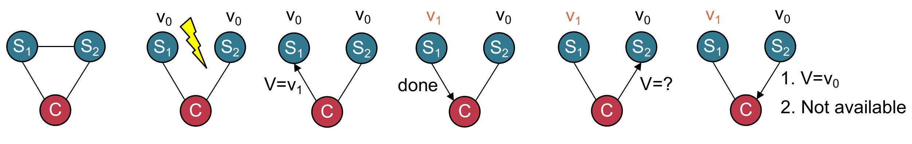

从这个例子就可以看出，CAP 不可兼得。而根据业务场景的不同，我们选择牺牲的属性也不同：

- CA 牺牲 P：牺牲 P 就意味着系统不再是一个真正的分布式系统了，因为分布式系统出现“分区“是非常核心的场景，或者说，在分布式系统中不考虑”同步机制“，就过于理想和不可靠了。所以牺牲 P 的系统往往是一个单机系统（或者是某种无法享受分布式优势的分布式系统）。对于一个单机系统而言，保证 C 和 A 是非常基本的事情。
- CP 牺牲 A：牺牲 A 意味着操作有可能失败，但是只要操作成功了，那么它的一致性（也就是正确性）就得到了保证。对于银行 APP 或者支付宝这种对于正确性比较看重的软件，一般会采用这种策略。毕竟谁也不希望自己的账户里的钱突然没了。
- AP 牺牲 C：牺牲 C 意味着虽然每次操作都会得到响应，但是操作的结果不一定保证一致性。对于微信对这种实时性要求比较高的聊天软件，一般会采用这种策略。这也是我们在使用微信的时候，常常会出现”引用的内容不存在“的原因。

#### 1.4.2 ACID vs BASE

在传统的数据库理论研究中，有 ACID 理论：

- **原子性 (Atomicity)**：原子性保证了事务中的所有操作要么全部成功，要么全部失败，不能只完成部分操作。如同“原子”一样，事务是不可分割的。
- **一致性 (Consistency)**：一致性保证了事务在执行前后，数据库的数据必须是合法的。当事务完成后，所有数据约束条件都必须得到满足。
- **隔离性 (Isolation)**：隔离性确保了并发执行的事务之间不会互相干扰。每个事务的执行都像是独占资源，其他事务不能看到其未提交的结果。
- **持久性 (Durability)**：持久性确保了已提交的事务所做的更改是永久性的，即使系统崩溃或出现故障，这些更改也不会丢失。

可以看出大部分的属性都是在保证 C 和 A，而对于 P 是没有描述的。

而随着 Web 时代的来临，传统的 ACID 就跟不上时代了，所以人们又提出了 BASE 理论：

- **基本可用性 (Basically Available)**：系统在大多数时间内是可用的，即使在部分节点出现故障时也能处理请求。这意味着要牺牲部分一致性来保证系统的可用性。
- **柔性状态 (Soft state)**：在 BASE 理论中，数据的状态不是瞬时的一致性，而是在某个时间点上可能处于“柔性”的状态，允许数据在一定时间内有暂时的不一致性。
- **最终一致性 (Eventual consistency)**：在较长的时间内，系统会最终达到一致状态。这意味着虽然可能存在短期的不一致性，但经过一段时间后，所有副本最终会一致。

从这里可以看出，BASE 的思路是弱化 C 和 A ，来保证 P。理论的变化折射出不同的时代需求。

### 1.5 指标

虽然 CAP 理论提出了一些关于分布式理论的指标，但是我觉得它更像是为了理论服务的，而不是为了实际的生产。

在实际中，我们更看重这些指标：

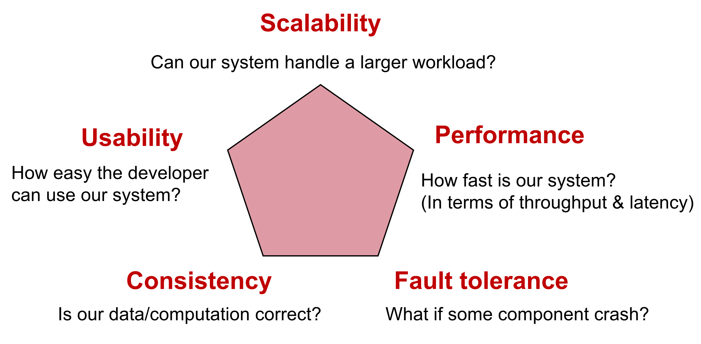

我们为了这些指标发明了很多技术：

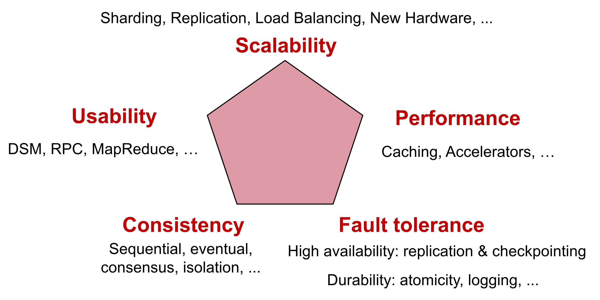

和 CAP 理论一样，这些指标之间也存在一定的权衡，不同的技术满足不同的场景：

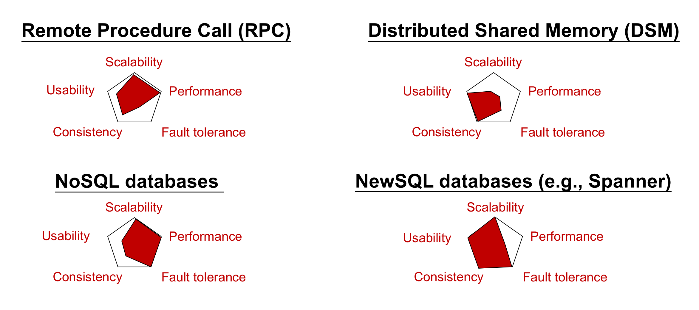

我们下面会详细介绍一些特性的实现。

---


## 二、一致性

### 2.1 总论

在分布式系统中，会存在多个数据备份和多个执行流。这种情况下，很容易出现各个实体间操作和数据不一致的情况。也就是说，不一致是自然的，我们希望通过我们的努力，让这个复杂的模型简单下来。

我们简化模型的方式是这样的：

- 所有数据只有一份拷贝
- 整体并发的操作序列会被等价成一个串行序列

也就是如下图所示：

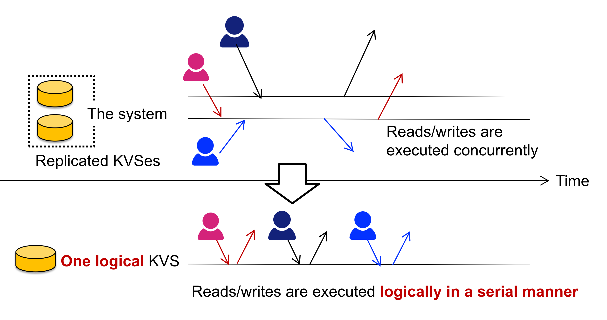

那这是怎么办到的呢？从图上可以看出，确实很多操作就是同时进行的，而不是串行执行的呀？我们改变操作的顺序，本质是在改变操作的起始时间，如果两个操作重叠在一起了，那么我们就让一个操作晚一些启动，也就是**阻塞**一个操作，来将两个操作错开。

也就是说，为了编程的易用性，我们牺牲的是系统的性能，更具体一些，牺牲的是操作的时延（可能还有些别的）。

一致性模型的光谱（Spectrum）如下：

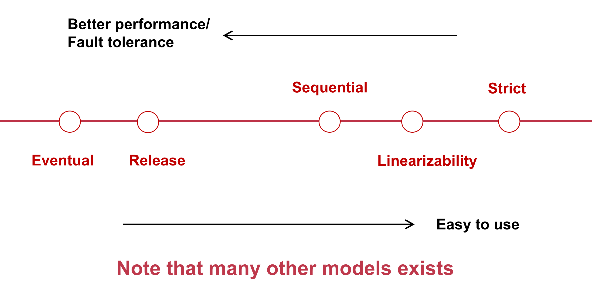

我们还可以从另一个角度去分析为什么性能和易用性可以形成 tradeoff，当我们有一个并发的操作序列的时候，我们可以将他们排列成多种串行的全排列。一致性模型的本质，就是规定一些全排列是符合要求的，而另一些全排列是不符合要求的。越严格的一致性模型，允许的全排列的数目就越少，那么行为就更好被预测，那么易用性就高；而越宽松的模型，允许的全排列的数目就越多，那么底层实现就可以越灵活，性能就可以越好。

此外还需要强调，这里的一致性，并不完全等价于正确性，并不是说，我们只要遵循了某个一致性的模型，那么程序就不会出我们意想不到的 bug 了（不同的一致性模型可能有不同强度的编程约束，在这个约束下可能有一些奇怪的行为，但是都是符合一致性模型的内在逻辑的）。这是因为这里说的一致性里的操作，每个操作只涉及一个数据 object，而涉及多个 object 的操作（比如说银行账户的转账，涉及一个账户金额的减少和另一个账户金额的增加），就不再是一致性的范畴了，而是下文讨论的隔离性的范畴了。这种涉及多个 object 的操作被称作一个事务（Transaction，TX）。

### 2.2 一致性模型

#### 2.2.1 Strict

strict 模型指的是按照每个 operation 的起始时间来对这些 operation 进行排列。那么这种模型基本上就等同于只允许一个全排列（因为每个 operation 的开始时间一般都是不同的），是最严格的模型。

这种模型基本上只是只能存在于理论中，因为在分布式系统中很难建立起一个全局的统一时钟。

#### 2.2.2 Linearizability 

Linearizability 指的是如果 op1 的终止时间在 op2 的起始时间之前，那么在串行排列中，也一定是 op1 在 op2 之前。如下图所示，这种排列就是不被允许的：

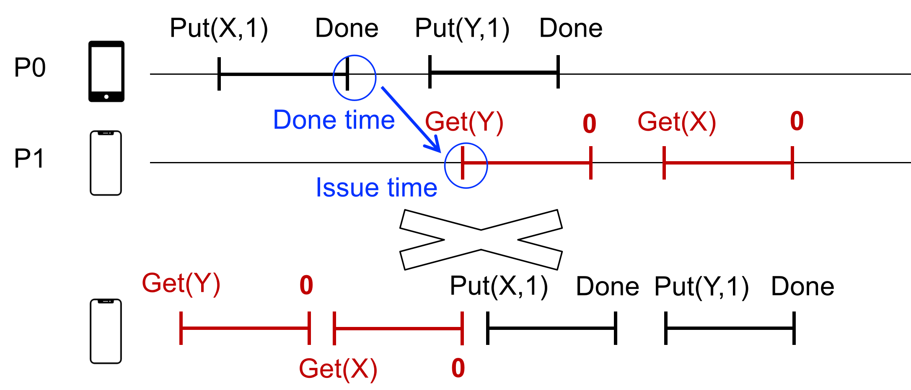

Linearizability 看似也是需要全局时钟的，而实际上并不是，Linearizability 的本质是确定各个操作的相对顺序而不是绝对顺序，所以实现难度会低一些。

#### 2.2.3 Sequential

Sequential 指的是在每个计算实体上维护操作的相对顺序，而 Linearizability 是全局的相对顺序。

也就是说，下面的这个图（就是上面的那个图），虽然不符合 Linearizability ，但是符合 Sequential 。这是因为原本在 Linearizability 中存在的依赖，因为分别属于 P0 和 P1，所以在 Sequential 中并不存在：

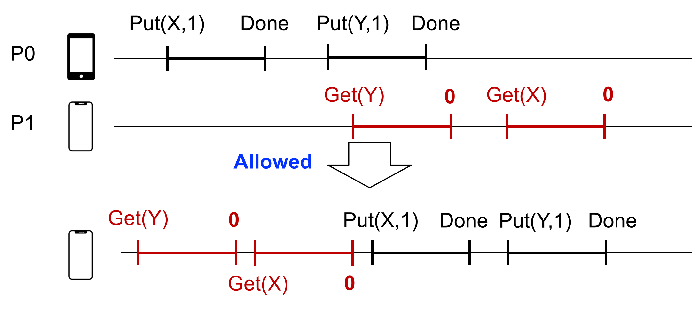

#### 2.2.4 Eventual

Eventual 是一种弱一致性模型，它只能保证最终每个数据副本的状态是一致的，而中途的状态就不一定了。

这种模型似乎就是微信这种实时聊天软件所采用的模型，所以微信的实时性更好，但是经常出现错误。

### 2.3 实现

Linearizability 有一个特性，就是如果每个 object 的 Linearizability  得到了维持，那么整个系统的 Linearizability  就得到了维持。这个特性我其实不是太理解，因为我感觉不同的 object 之间也会存在一些依赖关系。所以就算了，只是记录在这里。

下面我们开始介绍 Linearizability 的实现，其中最简单的一个模型就是 Primary-Backup Model，也就是将某个数据备份设置为 Primary，而其他的数据备份是 Backup。所有的写入操作都需要先对所有的 Backup 写入后，再对 Primary 进行写入。所有的读取操作，也只是对于 Primary 的读取，并不会读 Backup，也就是如下：

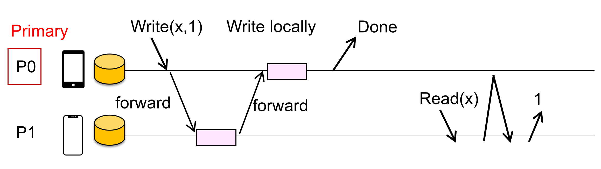

这种方式有两个很有趣的点，一个是要先写 backup，然后写 Primary，这是因为如果先写 Primary，那么就又可能在写操作还没有 Done 的时候，另一个读操作就可以读出来新值了，这就违反了 Linearizability 的定义。换句话说，将 Primary 的写入视为整个写入操作的结束，是一种实现 Linearizability 的一种手段。

另一个就是即使本地有数据，也依然要到 Primary 中去读取，这是因为 Read 操作必须完全在 Write 操作之前或者之后，下图就表示了一种不遵循这种方式造成的问题，Read_1 读出了新值，而 Read_2 明明在 Read_1 之后，读出的却是旧值。

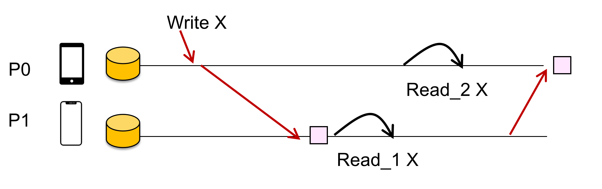

当然这种非常愚蠢的读操作也是有办法缓解的，我们还是能读取本地值的，即使本地值是 backup，也就是我们设计每个 object 有两种模式，一种模式下只可以读取本地值，而另一个模式不允许，必须读取 Primary 的值，当 Primary 要写 object 的时候，就会把模式调整为不允许，而写入完成后，就调整成允许。这种设计非常类似于 Cache Coherency 的设计。

此外 Backup 的 op 的顺序也可能因为网络等问题，导致和 Primary 上的 op 的顺序存在差异，如下所示：

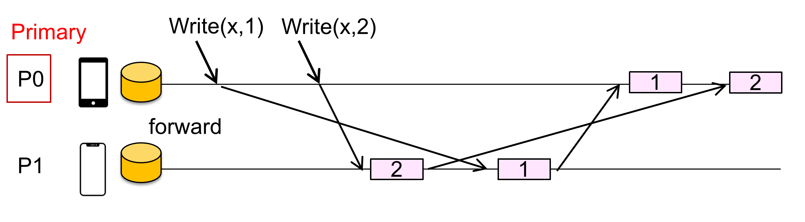

明明在 P0 上是 op1，op2，到了 P1 上就变成了 op2，op1 。我们可以给操作一个 seq number，来解决这个问题：

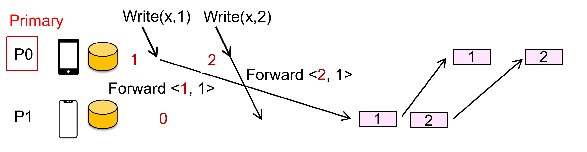

在 Primary-Backup 模型中，Primary 因为承担了过多的通信开销，导致其成为性能瓶颈。我们可以采用分区的方法，也就是不同的 object 的 Primary 并不是同一个，来避免瓶颈问题，下图中 x 的 Primary 是 P0，而 y 的 Primary 是 P1：

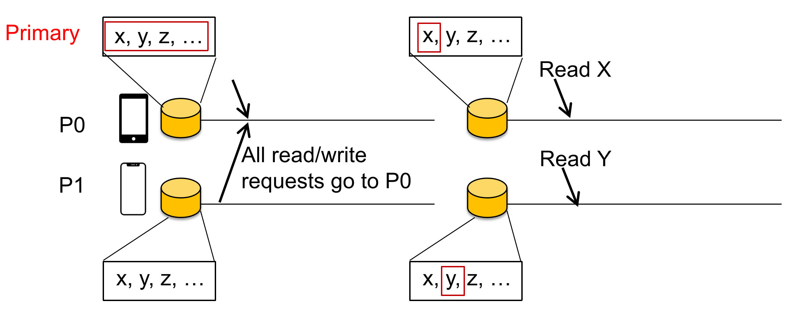

在了解完 Linearizability 的实现后，如果我们每次都只读取 local 的数据，写入的时候也只写入 local 数据，对于其他的备份，采用后台写入的方式，那么我们就得到了 Eventual 模型。

---


## 三、隔离性

### 3.1 总论

在一致性这一章，我们讨论了在分布式系统下，多个并发 op 的一致性模型，但是即使我们让这些 op 满足了某种一致性，也是依然会出现问题的。比如说银行转账问题。出现问题的原因就在于，这些 op 是一个个零散得进行排序的，而在生产中，我们希望一组 op 可以绑定在一起进行排序（起码看上去是绑定在一起的），这样绑定在一起的一组 operation 我们就称之为“事务”（Transaction，TX）。

隔离性（Isolation）就是描述事务的性质，它指的是事务之间看上去是相互隔离的，不会出现“犬牙交错”的情况，也就是不同 TX 里的 op 交替执行。隔离性还有很多其他的名字，比如说 Before-After Atomicity，Serializability 等，都是相同的意思。在下文中我们主要采用 Serializability 这个词。

那么 Serializability 和 Consistency 的关系是什么？我觉得它们是不完全正交的。虽然他们看上去都涉及了某种“视图”，但是其本质是不一样的。Consistency 的视图是一个 op 的串行序列，而 Serializability 的视图是多个 op 的串行序列，也就是常说的 Grid Notion，在 Grid Notion 中有 3 个概念：

Operation ⊂ Transaction ⊂ Schedule

也就是一个调度（Schedule）就是一个“历史记录”，这段历史记录里有所有事务（Transaction）里的所有 Operation 的排列顺序。数据库开发者能做得就是“歪曲” Schedule 来获得性能，而用户需要明确被开发者歪曲过的 Schedule 和一个理想的 Schedule （一般就是原子性事务形成的 Schedule）之间的差距有多大。

如下所示：

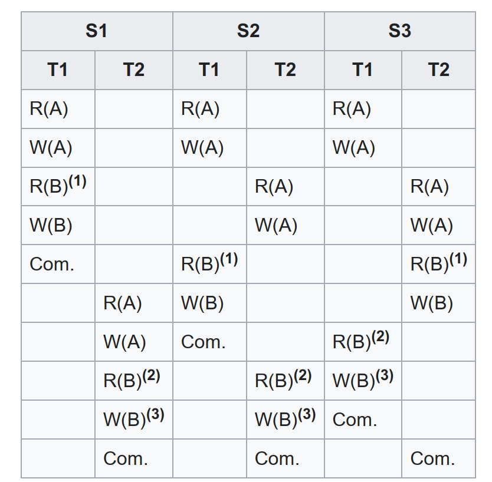

写到这里其实我迷茫了，感觉虽然上面是两个 op 序列，但是实际上依然是一个 op 序列（或者说实际上依然是并行的，只是在视图上变成了串行的）。所以我也说不好。

Serializability 只是要求 TX 看上去保持原子性，其中的 op 是不能被打散的。但是在实际上如果真的这样去做，那么性能就又会受到一定的影响。所以实际上不同 TX 的 op 依然是交错执行，甚至是并行执行的，只是看上去是满足 Serializability 的，这点和 Consistency 类似，也是存在着多种 Serializability 的模型，如下所示：

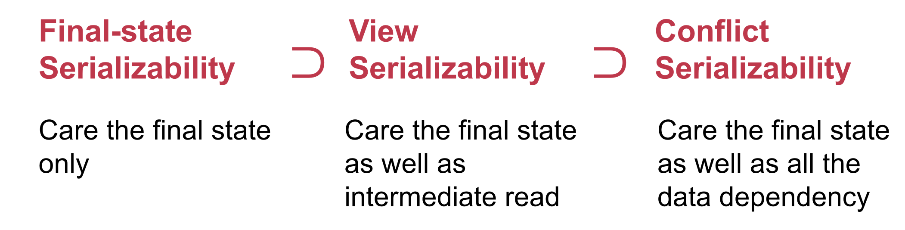

我在网上找到了一个图，因为图上有一些我不懂的概念，所以我不知道是不是可以说明 Serializability 和 Consistency 的不完全正交性。

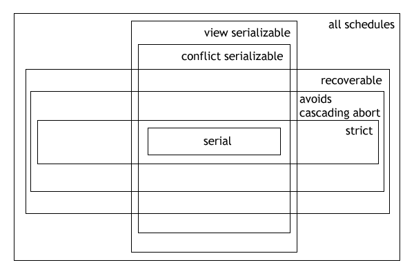

### 3.2 Serializability 模型

#### 3.2.1 Conflict Serializability

Conflict Serializability 是一种约束较强的 Serializability 模型。它首先定义了什么是 operation 之间的 conflict：

- 它们操作同一个 object
- 至少其中一个是写操作
- 它们属于不同的事务

然后如果一个 Schedule 的 conflict order 和某个串行化 Schedule 的 conflict order 是一样的，那么这个 Schedule 就是符合 Conflict Serializability 。

这个定义说得非常的不清楚，其实应该是这样。所谓的“串行化 Schedule”指的是让这些 TX（注意不是 op）串行化的 schedule。我们在现实中希望能交替或者并行执行不同 TX 中的 op，如果两个 op 毫不相干，那么显然是可以交替执行的。而 conflict 定义了一种 op 之间“相干”的关系，存在 conflict 的 op 就不能随便调度了，它必须和一种串行化的调度的 conflict 顺序相同（相当于和理想状态一致）。

而在实践中，我们可以用 Conflict Graph 是否成环来判断一个 schedule 是否满足 Conflict Serializability。conflict graph 是有向图，的节点是 TX（注意不是 op），而如果两个 TX 中有 op 是 conflict，那么就有一条边，从在 schedule 中更靠前的 op 所在的 TX 的节点，指向更靠后的 op 所在的 TX 的节点。当 Conflict Graph 成环的时候，就说明这个 schedule 是不满足 Conflict Serializability 的。

为什么 Conflict Graph 是否成环就可以判断是否是 Conflict Serializability 呢？这是因为对于一个串行的 schedule 而言，它的 Conflict Graph 一定是不成环的，这是非常显然的，反之，当一个 schedule 对应的 Conflict Graph 是成环的，那么它一定没有办法表示成一个串行的 schedule。所以我们就可以用 Conflict Graph 来判断。

#### 3.2.2 View Serializability

Conflict Serializability 的约束还是过强了，类似于 CPU 指令的调度，RAW，WAW，WAR 都会被判定为 conflict，而实际上约束并不需要这么强。比如说下图的 schedule 不符合 Conflict Serializability，但是读出的值、最后的状态（也就是我们在调度中最关心的两点），和串行 schedule “T1 -> T2 -> T3”一样：

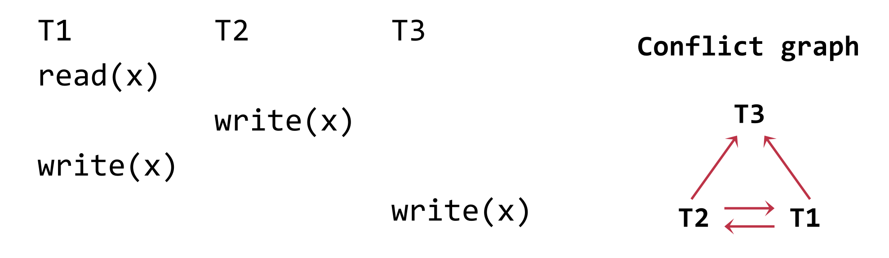

为了允许这种情况，我们发明了 View Serializability。它的定义就是，如果读操作和最终状态都和一个串行 schedule 相同，那么就是符合 View Serializability 的。也就是 View 的含义，即“看上去没啥毛病”。

View Serializability 就是一种较为理想的状态，它一共有 3 点要求（非常数学形式化的要求），其中第二点就是 RAW，而剩下两点是关于 init 和 end 的约束，就比 Conflict Serializability 要更加合理地多。

可惜的是，View Serializability 很难检验是否达成，而且也很难实现；相反的，Conflict Serializability 可以用 Conflict Graph 来检验，而且可以用 2PL 来实现。

### 3.3 实现

#### 3.3.1 2PL

Lock 是一种保证多个 Serializability 的有效手段。而具体而言，需要使用 2PL （2 Phase Lock）的方式。

按理说是一份 object 对应一份锁，但是并非锁的粒度仅仅取决于资源的粒度。比如说我们希望将 A 账户里的钱转账到 B 账户上，在语义上，A 和 B 是一个共同体，所以锁不能仅仅是 A Lock 和 B Lock（这样会导致有一个中间态是 A 账户的钱已经没了，而 B 账户还没有收到钱），而应该是一个 AB Lock 。

在实践上，我们没有必要真的声明一个 AB Lock，这样的话，一个有 N 个账户的银行就需要 $C_{n}^{2}$ 个锁了，这显然是不现实的。我们只需要同时拿住 A Lock 和 B Lock 即可保证粒度是 AB 。

从上面我们说到，锁的粒度不仅取决于资源本身的粒度，还取决于事务（上面的例子是转账）的粒度。如果一个事务需要多种资源，那么它应该同时拿多把锁。问题在于，拿锁这个行为并不能同时发生。两阶段锁（Two Phase Locking, 2PL）这个理论告诉我们，只要按照它说得做，就可以达到跟“同时拿两个锁”一样的效果。

2PL 的两个阶段：

- Expanding phase：只拿锁，不放锁
- Shrinking phase：只放锁，不拿锁

也就是说，以对共享资源进行具体的操作为界，在操作前只拿锁，在操作后只放锁，不会存在放锁后再拿锁的情况。

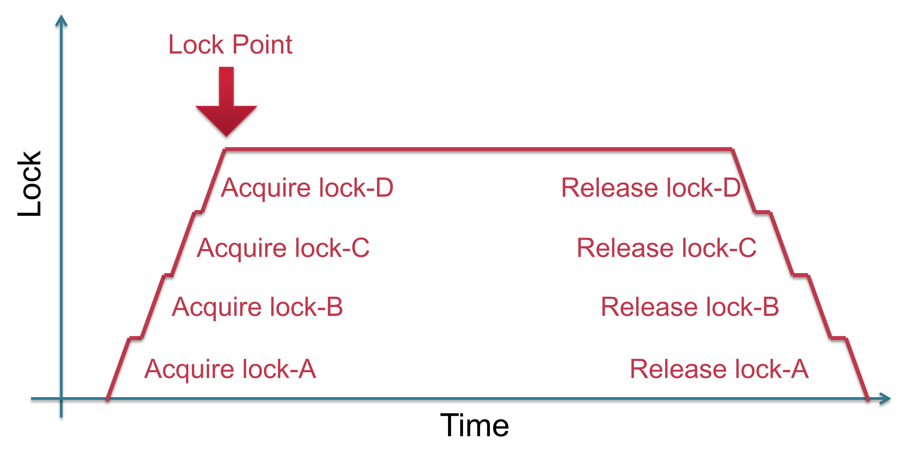

Lock 有一个问题 Deadlock，为了避免死锁，其实 2PL 已经给出了一个方法，就是在拿锁的时候需要按照一定的顺序，而放锁的时候按照相反的顺序，这样就可以避免死锁。

但是这种方法的难点在于，很难给所有的共享的 object 进行一个排序，而且对程序员也是负担。

此外，我们还可以用 Conflict Graph 来判断是否出现死锁，但是这种检验方式成本也太大。所以我们现在一般采用一些启发式方法。

#### 3.3.2 OCC

OCC 即 Optimistic Concurrency Control。

相对应的，Lock 的方式被视为 Pessimistic 。这是因为拿锁的目的是为了保证 object 的独占性，但是这建立于这个 object 真的会被多个 TX 并发访问的假设，这个假设在某些场景下有些过于悲观了。

OCC 的意思是 TX 不再使用锁，而是直接操作，如果出现了竞态，那么再修正。即：

- **阶段 1：并发本地处理**

  - 读取数据到读集。

  - 将写操作缓存在写集中。

- **阶段 2：验证可串行化（在临界区内）**
  - 验证是否保证可串行化：
  - 检查读集中的数据是否被修改过。

- **阶段 3：提交或中止（在临界区内）**

  - **中止**：如果验证失败，则中止事务。

  - **提交**：如果验证成功，则安装写集并提交事务。

Git 就是一种 OCC，每个人都在自己本地进行修改，而如果发生冲突，再手动 merge。

后两个阶段还是需要用锁来保证独占性的，但是因为这两个阶段都很短，所以性能开销并不大。后两个阶段伪代码如下：

```python
def validate_and_commit() # phase 2 & 3 with before-or-after
    for d in sorted(write_set):
        d.lock()
    for d in read_set:
        if d has changed or d has been locked:
           abort()
    for d in write_set:
        write(d)
    # release the locks
    # ...
```

OCC 的问题在于经常会出现假阳性的 abort。所以当并发事务增多的时候，OCC 的性能并不好，其与 2PL 的对比如下：

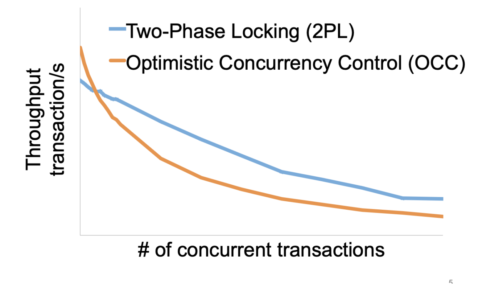

#### 3.3.3 HTM

HTM 即 Hardware Transactional Memory。从本质上讲，HTM 就是 OCC 思想的硬件实现。

Intel 在 Haswell 处理器上首次支持了了 HTM，被称为 Restricted Transactional Memory（RTM）。RTM 引入了 3 条新指令

```assembly
xbegin() ; 标识事务开始 
xend() ; 标识事务开始 
xabort() ; 标识事务中断
```

HTM 在实现上，使用 CPU Cache 来追踪 read/write_set，那如何探测 conflict 呢？是基于 Cache Coherency 实现的。

HTM 的问题在于支持的事务不能特别长，read/write_set 也不能特别大。

#### 3.3.4 MVCC

OCC 在多并发读的性能不好，2PL 也是同样的，那么有没有什么方式可以优化多读少写的场景呢？

MVCC 即 multi-versioning concurrency control ，就是一种适应这种场景的新式版本控制方式。

其设计思路是维护 object 的多个 version，也就是多个 snapshot，用 time 作为版本号，这样可以避免并行读的竞争。

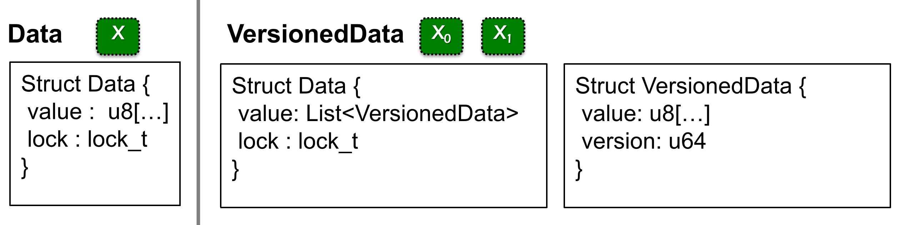

其伪代码形式如下：

```python
def Commit(tx):
   for record in tx.write_set: 
       lock(record)
   let commit_ts = FAA(global_counter)
   for record in tx.write_set:
       record.insert_new_version(commit_ts, ...) 
       unlock(record) 


def Get(tx, record):
   while record.is_locked():
         pass
   for version,value in record.sort_version_in_decreasing():
       if version <= tx.start_time: 
          return value 

```

其中 `commit` 是事务最终提交前的工作（主要是写操作），`get` 是读操作。

---


## 四、容错性

### 4.1 RSM

增加容错最常用的方法，就是增加数据备份。这样即使出现网络错误，或者有什么物理 crash，备份的数据也保存完好。

但是让多个数据备份保持一致性，非常的困难。这里说的一致性，并不是上面的一致性，上面的一致性更侧重于从并发控制流角度的一致性，而这里的一致性更侧重于数据的一致性。

RSM 即 Replicated State Machine。它是人们提出的一种理论模型，这个理论指导了人们如何实现多个具有一致性的数据备份服务器。它将备份服务器视为状态机，只要初始状态一致，操作的顺序一致，那么最终状态就一定是一致的。这个理论将“让备份服务器保持一致”这个问题转换成了“让所有备份服务器的操作顺序一致”。

也就是说，我们需要确定一个唯一的执行序列（如果操作中有随机函数，还需要将执行结果记录下来），这样就能保证多个备份服务器的内容都一致了。

### 4.2 Primary-Backup

很容易想到可以使用 Primary-Backup 机制来实现 RSM，也就是 Primary 负责接受用户请求，确定执行序列，然后发送给 Backup 让它执行。其形式如下：

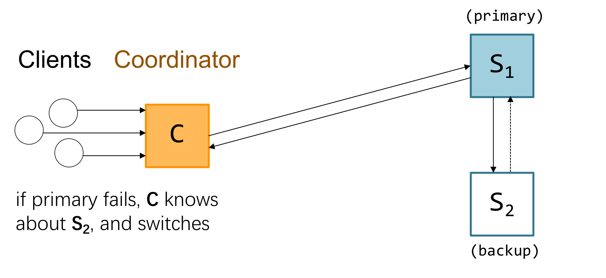

当 S1 挂掉了，那么 S2 就可以担任起备份的重任：

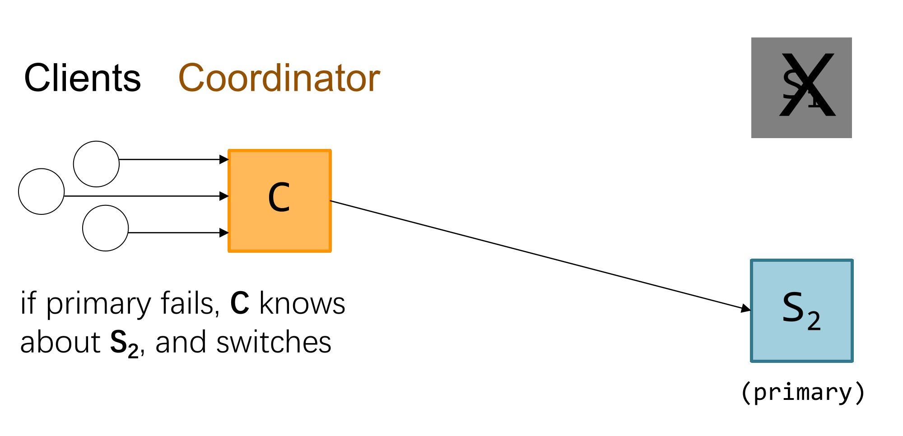

这里图中只画了一个 Coordinator 用于将 clients 的请求转发给 Primary，而在实际的生产中，可能出现多个 Coordinator，这样可以更好地转发多个 client 的请求。此时就有可能出现问题了，就是一旦发生网络分区（Network Partition），如果两个  Coordinator  可能会选出两个 primary，如下所示：

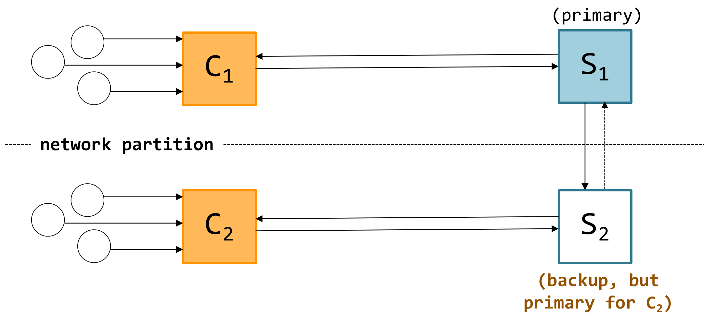

那这样每个 Primary 收到的请求就不一样了，不一致性自然就产生了。

所以我们提出了 View Server，说白了就是将“选出 Primary”这个任务指派给一个全局单例服务器上

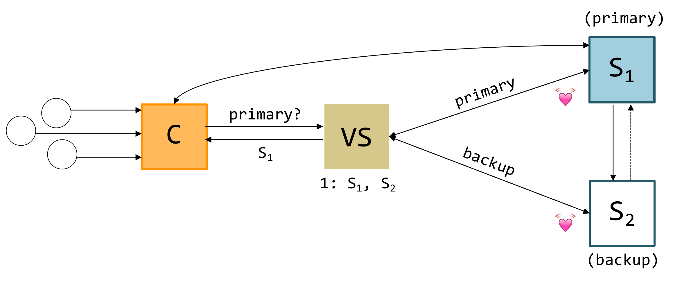

不过这种方法其实治标不治本，如果 VS 挂了怎么办？就没有办法解决了。只是说 VS 挂掉的可能性很小。

这种思路其实代表一种“中心化”的思路，即 Primary 是被某个中心权威（这个例子中是 VS）指定的。而当中心权威出现故障的时候，就无能为力了。

### 4.3 Raft 共识算法

共识算法是一种“分布式选举 Primary”的算法，这就避免了中心权威出现问题，进而导致系统不一致的情况出现。经典的共识算法有 Paxos 和 Raft。

Raft 于 2013 年由 Diego Ongaro 和 John Ousterhout 提出，旨在提供一种易于理解和实现的一致性协议。Raft 似乎是一个非常易懂的方式（比另一种 Paxos “希腊选举”），因为它论文里直接写伪代码了（面向工程师而非数学家）。不过似乎在设计上它比 Paxos 更反直觉。

具体的实现细节就不在这里写了。
