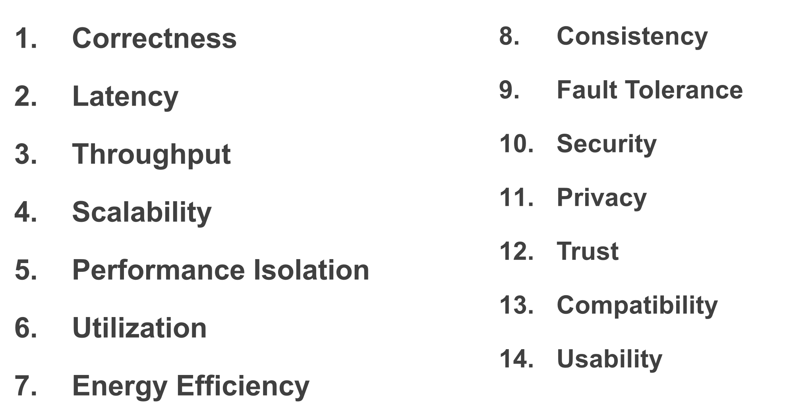

> 那是 2023 年的夏天，楠神走出门，看向焦急等待的杰哥和我，问我们：
>
> “你们知道“系统”和“体系结构”的区别吗？”

## 一、总论

计算机系统这个系列，是我作为一名方向是 system 的研究生的，基于 IPADS 实验室开设的“计算机系统原理”等课程，整理而成的，并不保证正确性，因为 system 实在是浩如烟海，而我又太菜了。

在这篇博文里，我想谈谈我心目中的 system 是什么，这并不是 IPADS 课程的观点。

---

## 二、定义

给 system 下一个定义，是我一直想干的事情。Wiki 百科和 ScienceDirect 都把 Compute System 定义为“一个由硬件、软件、数据组成的系统”。我觉得这个定义并不是很好，因为它是一句正确的废话，这个定义并不能指导科研。

还有一种方式，是将 system 定义为一套方法论和需求的集合。比如说在系统中常采用的方式是权衡、抽象、缓存、备份、并行和隔离等，而需求如下：

这并不是全部的需求，但是好消息是 system researcher 经常在这个表中删除和增加条目。这种方式我觉得虽然和 system research 更加贴合，但是有些过于零散和变化，并没有一个核心的东西。

我想了很久，我现在觉得（也就是可能未来就改了），系统的定义是：

> 在**有限资源**的封闭系统内，通过**权衡（tradeoff）**的方式，来达到我们的目的。

对于这个定义，有如下细节：

- 有限资源：系统并不能修改算法，因为算法可以将 $O(2^{n})$ 的方法优化成 $O(n)$ 的方法，这相当于凭空创造了资源；同样的，系统也不能修改硬件，不能优化 cache 的方式就是扩大 cache 容量，提高吞吐的方式是多买几个 GPU，这都是在系统中增加资源的方式。
- 权衡（tradeoff）：正因为资源是有限的，所以为了增强某项指标，就必须损害另一项指标。更进一步，为了更好的权衡，我们有诸多方法：
  - 牺牲一些我们不在乎的指标，增强一些我们看重的指标：其核心在于，寻找和发现那些我们并不在意的指标。
  - 扩大系统范围：即使在当前系统中无法权衡，也可以通过将系统扩大的方式，包容进更多的资源，来进行权衡。这些资源可以是用户、硬件、算法、时间等（是的，这里违背定义的第一点了）。

在给出系统定义后，我还想在这里记录记录一下“抽象 abstract”，它不是系统的本质定义（封闭系统里的权衡），它只是多样复杂性与简单易用性的一种权衡。但是我正是出于对 abstract 和 complexity 的迷恋，而选择了 system 的方向。这种迷恋在我接触计算机之前就存在了，我小时候，是那种在熄灯后会一骨碌爬起来，恶狠狠地盯着窗帘思考这背后有什么的小屁孩。

我念研究生时，旧的时代已经过去，而新的时代还没有来临，希望它等等我。

---

## 三、意志

虽然很不想承认，但是不得不承认，system 并不是自由发展的，它的发展深刻受到了社会需求和底层硬件的影响，总的来看，还是社会需求。

在最开始的时候，那时候的计算机还非常不人性化，冷冰冰的，人们研究的是操作系统内核和编程语言。

随着互联网时代的到来，人们研究的是并行、分布式、虚拟化、数据库。

而手机的普及，使得人们的研究焦点变成了安全、低功耗和异构计算。

现在 AI 时代来了，系统又会出现什么样的特征呢？这不取决于系统本身，这取决于 AI 。

---

