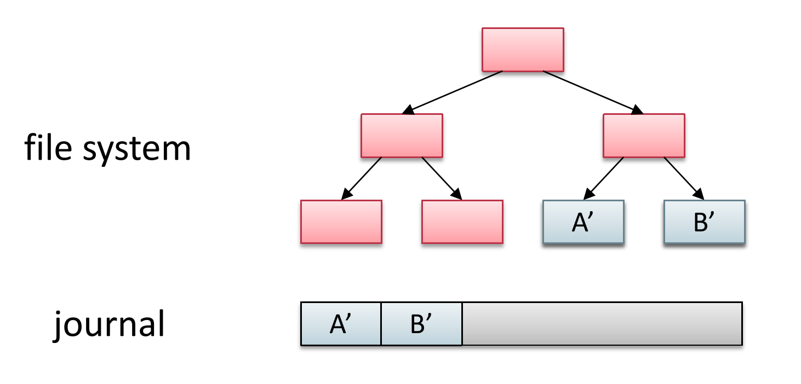

## 一、数据结构

### 1.1 Inode

#### 1.1.1 整体结构

Inode FS 被分为了 5 个区域“

- SuperBlock：存储着后面分区的元数据
- Inode Bitmap：记录着 Inode 区的使用情况
- Data Bitmap：记录着 Data 区的使用情况
- Inodes：所有 Inode 的数组，使用 Inode Number 索引，每个 Inode 记录着 Data 的组织形式
- Data Region：数据区

#### 1.1.2 文件

在 Inode FS 中，每个文件对应一个 Inode。

Inode 是一种与页表非常相像的数据结构，都是利用偏移量来查找对应的数据块位置，所不同的是，Inode 的翻译是不均匀的（偏移量越大，需要的翻译级数越多），而页表的翻译是均匀的（无论偏移量是多少，翻译的次数都相同）。

有一种解释是，页表翻译是硬件过程，不太灵活；而 inode 的翻译是软件过程，所以可以设计的很灵活。我是觉得之所以 inode 设计得不均匀，是因为文件的大小是不固定且偏小的，所以大部分小文件可以直接翻译或者只使用一级翻译来完成。

至于为什么页表翻译要用硬件，是因为内存访问是一个很快的事情，如果用软件实现那就太慢了；相反，因为外存的访存速度过慢，软件翻译 inode 的过程并不构成关键路径。

当外存访存速度提升时（比如说用非易失内存做外存），就会导致软件翻译的速度变慢，原本的方法就不再适用了。

除了记录拥有的数据块以外，Inode 中还记录着文件的属性。

#### 1.1.3 目录

Inode FS 的目录项，是由文件名和文件 Inode Number 组成的。我们检索文件名，就可以得到 Inode Number，然后根据 Inode Number 去 Inode 表中检索出对应的 Inode ，就可以访问对应的数据块了：

`/` 的 Inode Number 为 1。

如果我们希望访问 `/programs/pong.c`，那么访问磁盘 block id 的顺序是 `1(/ inode) -> 14 (/ data) -> 7 -> (program inode) -> 23 (program data) -> 9(pong inode) -> 61 (pong data)`  。

#### 1.1.4 链接

硬链接指的是两个目录项都指向同一个 Inode Number，而软链接则是创建一个文件，里面是指向文件的文件名。可以说，硬链接是文件的指针，而软链接是指针的指针。如下所示：

硬链接的一个重要作用是在不拷贝文件的情况下备份文件，可以避免对于文件的误删除。软链接就不可以，因为软链接与本身的文件并不平权，原文件一旦删除，软链接也就失去作用了。

### 1.2 FAT

#### 1.2.1 整体结构

FAT 即 File Allocation Table。是一种 Free-List 结构。它总共有 3 个区域：

- SuperBlock：对应图上的“保留区域”，也被称为 BPB（BIOS Parameter Block）。
- FAT 表：记录着文件的链表元数据，本质是一个 `next` 数组。一共有 2 个相同的拷贝，互为备份。
- 数据区：FAT 的数据块也被叫作簇，即 Cluster 。

#### 1.2.2 文件

FAT 中每个文件的所有数据块组成一个链表，链表的 `next` 域记录在 FAT 表中。如下图所示：

单独把 `next` 域分离出来组成 FAT 表，是因为这样可以提高访存效率。此外，空闲的簇也会在 FAT 表中组织成一个 free list 。

#### 1.2.3 目录

FAT 目录项记录着文件的起始簇号，根据起始簇号查阅 FAT 表，就可以顺序的读出所有的数据块。

最关键的是，文件的元数据不是存在 FAT 中的，而是存在目录项中。

#### 1.2.4 链接

FAT 系统并不支持硬链接，因为两个目录项就有两份文件的元数据，这样维护一致性就太困难了。

#### 1.2.5 与 Inode 对比

Inode 的设计，采用了类似页表的方式来记录和组织磁盘块，这种方式有利于随机访问；而 FAT 用链表的方式组织磁盘块，有利于顺序访问。

我个人觉得 FAT 更容易损坏，因为链表的特性就是，一旦一个节点损坏，那么后续节点都无法访问了。这可能也是为啥 FAT 表有双备份的原因。

----

## 二、Crash Consistency

### 2.1 背景

有些文件操作需要更新 data 和 metadata 两个部分，而如果在这中间发生了 Crash，可能会导致出现一致性问题，也就是 data 和 metadata 不匹配的情况。为了解决这个问题，人们开发了多种方法，下面我们会介绍一些。

### 2.2 Journaling

#### 2.2.1 介绍

日志（journaling）指的是先将修改写到别的地方（journal），然后将修改进行原子性的提交（commit），最后再按照日志里的内容修改文件系统。

按照这种设计，如果在 journal 阶段发生 crash，那么操作只是失败了，而原本的数据依然在文件系统中完好无损。commit 阶段是原子操作，不会被 crash。而如果在 overwrite 阶段发生 crash，那么文件系统的数据会被破坏，但是我们可以根据 journal 恢复损坏的部分。

Journaling 最大的问题是所有的数据都需要写两次，这样开销是不可接受的。所以我们退而求其次，我们只对 metadata 进行 journal 。也就是先写入 Data，然后再对 MetaData 进行 journaling ，最终效果如图。

#### 2.2.2 Journal Order

而在实际生产中，并不是只有 disk 这一层存在的，我们会在内存中构建一个 disk cache 用于提高访问 disk 的延迟。但是这种方式会导致我们写入 disk 的时候会存在乱序现象，也就是 A 先存入 disk cache，B 后存入 disk cache，但是 B 先从 cache 中写回，而 A 后写回，则在 disk 的角度，看到的是先 B 后 A，与在应用角度看到的先 A 后 B 是矛盾的。

而 Journaling 是依靠顺序的（order），这体现在，Data 和 MetaData Journal 的写入需要在 Journal Commit 之前，而 Journal Commit 需要在 MetaData 真正写入之前。为了确保顺序，我们使用了 flush 操作，最终效果如图：

但是 flush 操作又是极其影响性能的一个操作，所以我们一般不 flush，任由有可能出现的不一致性发生。

OptFS 是一种学界提出的解决 flush 低效的 idea，在上文中，主要有两个地方需要维护时序。OptFS 使用 checksum 技术来保证 Commit 一定在 Data 和 MetaData Journal 的写入之后发生，使用 Delay Write（似乎是一个硬件修改），来保证 MetaData 真正写入发生在前三者之后。

### 2.3 Shadow Paging

还有一种叫作 Shadow Paging 的方式，也叫作 Copy-on-Write，指的是当涉及到写入文件系统的时候，并不直接 in-place write（overwrite）原本的文件，而是拷贝一个新的文件并写入，写入后，让目录项从原来的文件指向这个新的文件。

Journaling 是先将修改写到日志中，然后再从日志中誊抄到真正的文件系统中，而 Shadow Paging 也是不先修改原本的文件，写到另一个地方去，但是并不需要再写一遍，不过它需要复制整个文件，而日志法，可能只需要记录 diff 部分，所以性能孰优孰劣，也并不好说。

Short-Circuit Shadow Paging 是一种学界提出的优化 Shadow Paging 的方法，简单来说就是利用原子变量来进行 in-place 操作，这样就避免了对整个文件的拷贝。

---

## 三、NVMFS

### 3.1 NVM

NVM 即 Non Volatile Memory，非易失性存储。这个概念我觉得应该要囊括磁盘这种传统外存，和现在新型的“非易失性内存”：

在授课中，我们用 NVM 表示“非易失性内存”。NVMFS 就是基于非易失性内存开发的文件系统。

NVM 的优点在于不再需要复杂的软件栈，因为与传统外存相比，我们使用访存指令就可以实现数据的访问；地址索引的方式，也不需要我们设计过于复杂的数据结构。而 NVM 的缺点在于，它的价格比传统外存贵，而性能又比传统内存差，性价比不高。

### 3.2 挑战

NVMFS 的有一个挑战是，现在 cache 不再是由软件负责了（disk cache），而是由硬件 cache 负责，这就导致 NVMFS 很多乱序情况都更难处理（因为不如软件好操控）。

---

