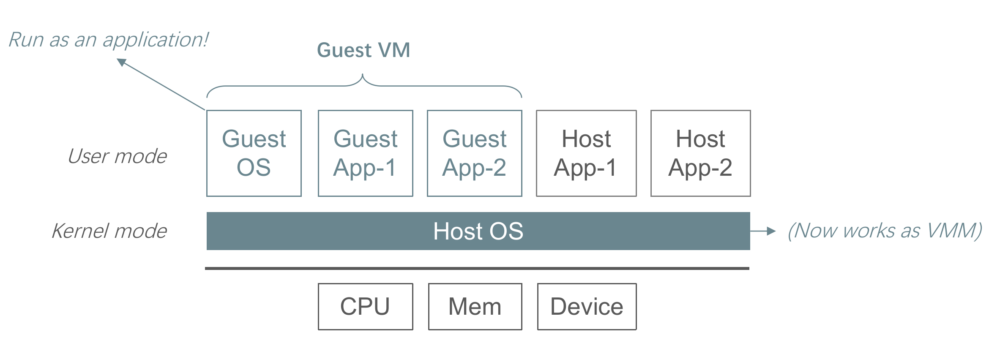
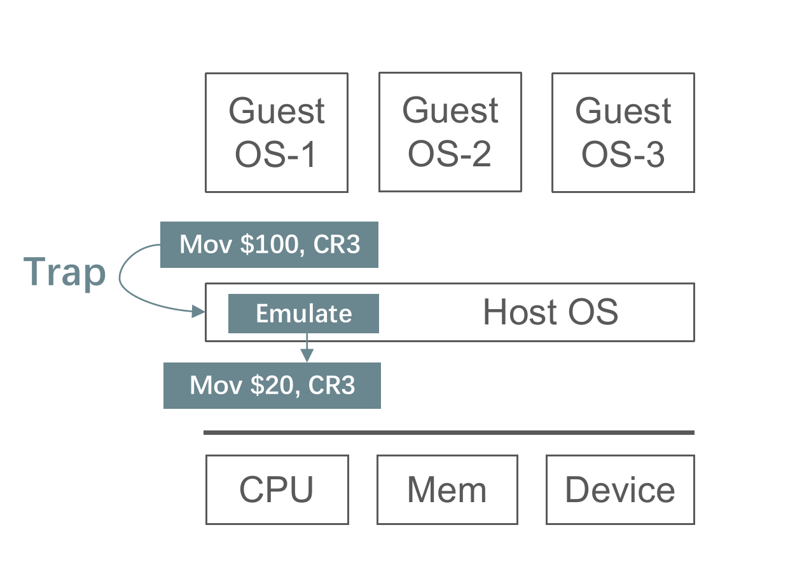
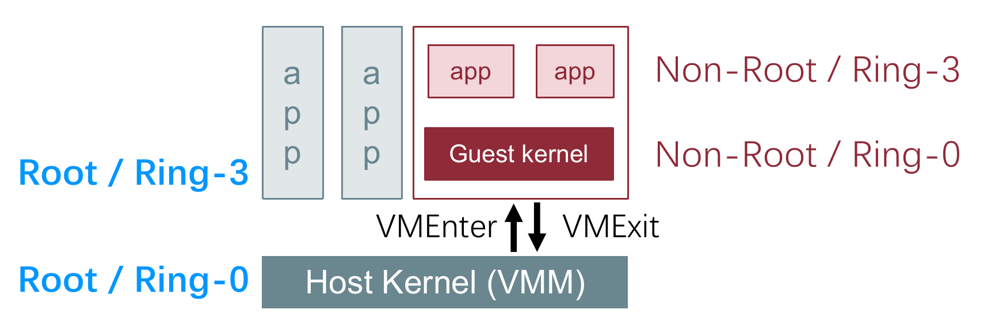
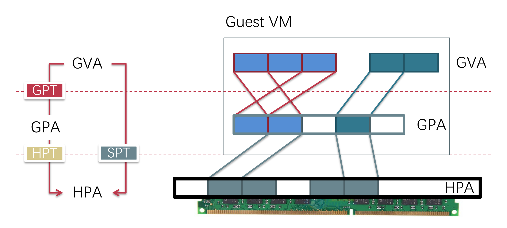
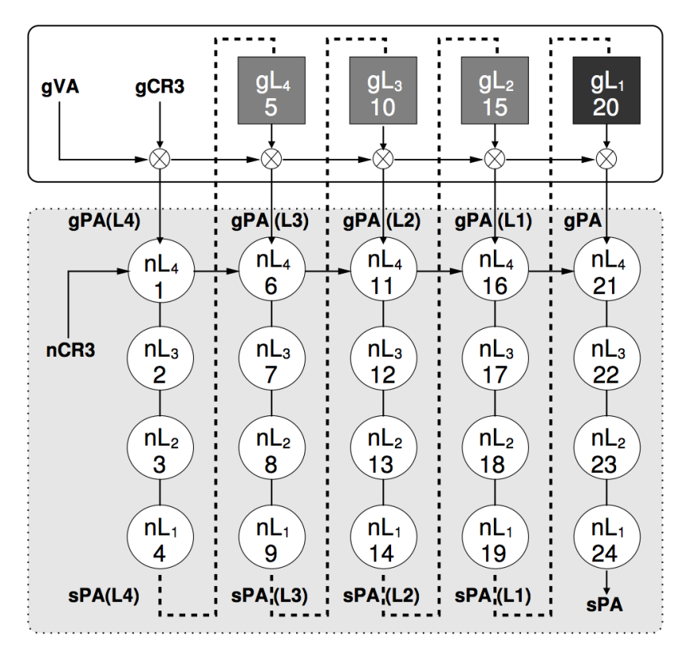
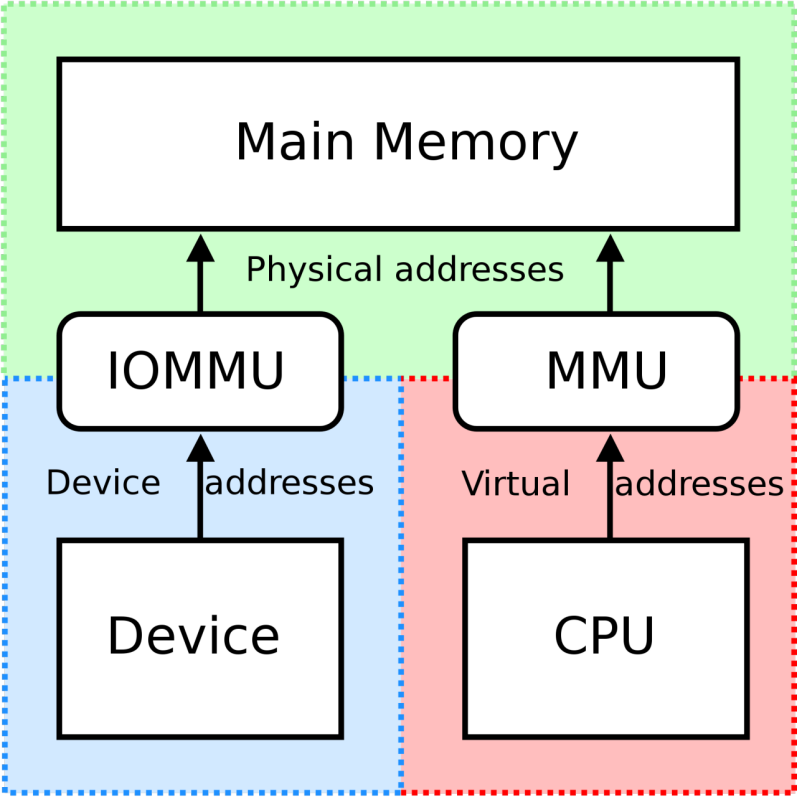
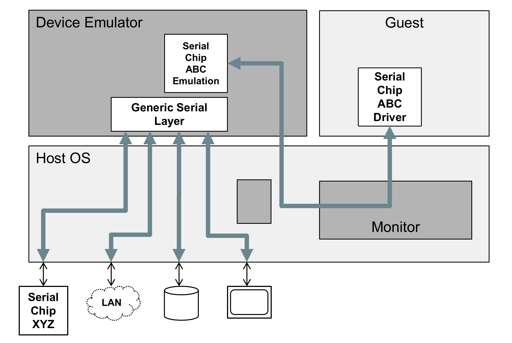
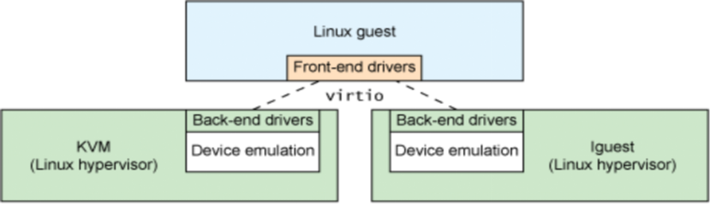
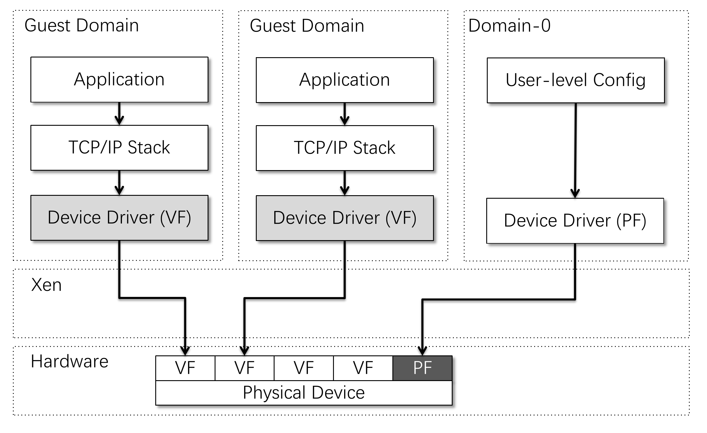
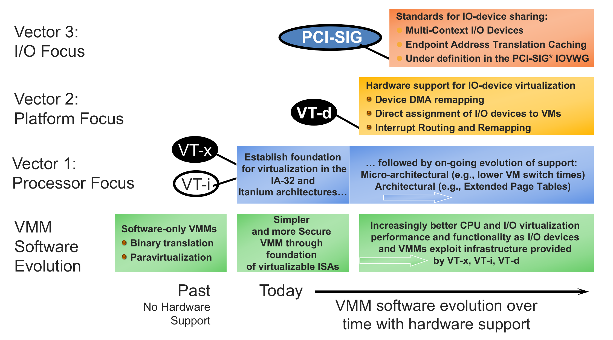

## 一、CPU 虚拟化

### 2.1 背景

CPU 虚拟化范畴还挺多的，但是我们这里应该指的不包括不同 ISA 的虚拟化，而只是 CPU 的虚拟化，也就是虚拟出来的 CPU 和原本的 CPU 具有相同的 ISA 。

### 2.2 Trap & Emulate

为了虚拟化出多个 CPU，我们让虚拟的 OS 跑在用户态，也就是如下结构：



但是这种方式的问题在于，一旦执行到在 User mode 和 Kernel mode 行为不一致的指令的时候，那么就会导致出现 bug。

于是我们提出了 Trap&Emulate 技术，它基于这样的一种观察：行为不一致的指令（被称作敏感指令）大部分都是特权指令或者访问特权寄存器，那么这种指令在 user mode 下指令，本身就会引发 trap，而 trap 到 Host OS 时，我们就用软件模拟执行的效果，也就是 Emulate。示意图如下：



而 Trap&Emulate 技术有两点缺陷：

- 并不是所有敏感指令都是特权指令，那么可能有些指令不会触发 trap，那么就导致这个部分 bug 了。这种行为敏感指令都是特权指令的特性被称为 strictly virtualizable，不幸的是，X86 ISA 就不是一种严格虚拟化的 ISA。
- Trap 的性能开销过大。

为了解决这些缺陷，我们又提出了新的技术。

### 2.3 解决方案

#### 2.3.1 Instruction Interpreter

也就是用软件模拟出一个 CPU 来，这样所有的指令并不是通过硬件执行的，而是通过软件模拟，这样就解决了不严格虚拟化的问题（所有的指令现在都是模拟执行了）。

Boch 就采用了这种思路。

#### 2.3.2 Binary Translator

在执行代码前，需要先经过一个 translate 的过程，也就是将代码进行扫描，并将其中的敏感指令，替换成函数调用，这样就可以避免不一致问题了。

翻译的基本单位是基本块，并且翻译好的基本块会被放入 translation cache 中，下次如果还使用这个基本块的话，那么就直接使用了。至于为什么一基本块为粒度，可能是因为按指令为粒度，会频繁触发翻译拖慢速度；按可执行文件为粒度，很多执行不到的基本块其实是不需要翻译的。

Binary translation 有两个缺点：

- 难以处理中断：在翻译后的代码中，中断只能在基本块边界处发生，而真实机器上中断可以在任何指令处发生。这可能导致精度问题，影响程序的实时性和响应能力。而且为了处理中断，需要在基本块边界保存和恢复CPU状态。这增加了上下文切换的开销和复杂性。
- 难以处理自修改代码（SMC）：为了检测自修改代码，必须监控对翻译后代码的写操作，这会引入额外的性能开销。

如 VMware，Qemu。

#### 2.3.3 Para-virtualization

半虚拟化的设计思路是让 OS 意识到自己是一个虚拟机的 OS，对于敏感指令，就主动调一个 hypercall 自己 trap，这样就避免了被动 trap 不完全的情况。

#### 2.3.4 Hardware Supported

以 Intel 提供的 VT-x （x 是 eXtend 的意思）为例，它引入了 root 和 non-root 两个模式，non-root 模式下，只要遇到敏感指令，都会 trap，这样就避免了使用原本的特权机制来 trap 的缺陷。



此外，VTX 还提供了 VMCS ，用于保存了虚拟机的状态信息和控制信息，使 VMM 能够精确管理和恢复虚拟机的执行状态。

----


## 二、内存虚拟化

### 2.1 背景

首先强调，除了 `load`，`store` 指令会涉及虚拟地址的使用，`call`， `return`， `jump` 这样的指令同样会涉及虚拟地址的使用。

在虚拟化背景下，一共有 3 种地址：

- GVA：Guest Virtual Address
- GPA：Guest Physical Address
- HPA：Host Physical Address

又有 3 种页表：

- GPT：Guest Page Table
- HPT：Host Page Table
- SPT：Shadow Page Table

正因为有 3 种地址的存在，VM 的 GPA 并不是真实的物理地址，所以我们需要将其映射到真实的物理地址 HPA，这就是内存虚拟化要解决的问题。

下图展示了 3 种地址的关系，和两种解决办法：



### 2.2 Shadow Page Table

按理来说，因为需要完成 3 个地址之间的转换，所以需要 2 个页表，但是在早期，我们只有一个页表基地址寄存器，如 `CR3` 。所以我们如果想借助 MMU 的力量完成地址翻译，那么就需要想办法把两个页表融合成一个页表，这个页表直接完成 GVA -> HPA 的地址翻译，这种页表被称作影子页表，shadow paging。

影子页表的构建就是遍历 GPT 和 HPT 的过程，其伪代码如下：

``` python
set_cr3 (guest_page_table):
    for GVA in 0 to 220
        if guest_page_table[GVA] & PTE_P:
            GPA = guest_page_table[GVA] >> 12
            HPA = host_page_table[GPA] >> 12
            shadow_page_table[GVA] = (HPA << 12) | PTE_P
        else
            shadow_page_table = 0
     CR3 = PHYSICAL_ADDR(shadow_page_table)
```

影子页表的维护也比较繁琐，主要有两个问题。一个问题是如果 VM 修改自己的 GPT 怎么办？实际上 GPT 并不存在，那么修改后不会有任何效果，所以我们需要 trap 这种修改行为（通过将 GPT 设置成只读的），并将修改同步到影子页表。

另一个问题是如果 Guest App 访问 Guest OS 的虚拟地址怎么办，因为此时 SPT 本质上是一个用户页表，所以也不存在用户地址空间和内核地址空间的隔离问题。我们可以准备两个 SPT，为 Guest App 提供的 SPT 中不包含 Guest OS 的地址映射，这样就解决了问题。

SPT 的优点在于对落后硬件的兼容性强，并且只需要一次地址翻译流程，访问时延较低。而缺点在于，对于页表的修改需要时时 trap，性能不佳。此外，SPT 的数目会非常膨胀（其实也不是太多），这是因为每个 SPT 对应一个 (GPT, HPT) 对，而每个 Guest App 都有自己的 GPT，这就导致 SPT 的数量和所有 VM 上的所有 App 一致。如果为了避免 Guest OS 地址空间被 Guest App 读写，还需要多一倍的 SPT。

### 2.3 Direct Paging

Direct Paging 是一种半虚拟化方法，也就是 Guest OS 使用 hypercall 来更新页表，并不能直接修改页表。页表记录的是 GVA -> HPA 。

这个的好处是实现简单，而问题在于对于 VM 不透明，而且 VM 会获得更多 Host Memory 的信息，引发安全事故。

### 2.4 Hardware Support

硬件支持的方式就是拓展 MMU 的功能，使其可以完成二级翻译，如 Intel 的 EPT（Extended Page Table），AMD 的 NPT（Nested Page Table）。

而二级翻译最大的缺点是，二级页表的内存访问次数会过多。对于 4 级页表而言，一次地址翻译最多需要访问内存 20 次。



---


## 三、设备虚拟化

### 3.1 背景

我们希望一个真实设备可以供多个虚拟机使用，在此基础上，我们希望有如下功能：

- 无论虚拟机想使用什么设备，我们都能模拟出来，这样便于迁移
- 虚拟机看到的设备应该是独占的

为此我们开发了以下技术：

### 3.2 Direct access

指的是，每个 VM 都独占设备，并不存在设备同时给多个 VM 使用的情况。不过同一个设备可以在不同时间给不同的 VM 使用。

这就引出了一个问题，就是现代 DMA 设备，是可以访问物理内存的，那么一个 VM 就可以利用设备，去接触另一个 VM 的物理内存。为了解决这一点，Intel 引入了 VT-d 拓展，这个拓展提供了 IOMMU，IOMMU 里也有一套页表，用于完成 device addr 到 physical addr 的映射，切换 VM 的时候需要切换 IOMMU 中的页表，这样就限制了设备的访存能力，增强了隔离性：



这种 Direct Acess 的优点在于，性能非常好；而且 VMM 实现简单（基本上没有引入额外的功能）。但是缺点在于，只能提供特定的设备（host 上得有这个设备）；而且不利于拓展，如果有 100 个 VM 同时运行，难道要 100 个网卡吗？此外，也不利于 VMM 监控设备情况，因为 VM 有设备的全部控制权，VMM 不好拦截。

### 3.3 Emulating Devices

我们也可以使用软件去模拟真实硬件（需要注意，有些模拟硬件功能的实现还是要依赖真实硬件，比如网卡收发包）。VM 使用设备时，会 trap 到 VMM，VMM 调用模拟器，如下所示：



这种方式的优势在于，可以模拟出多种硬件，而且允许插桩。但是缺点是性能较差。

### 3.4 Para-Virtualized Devices

这种方式类似于 CPU 的半虚拟化，即 VM 知道自己使用的不是真实设备，而是虚拟设备。这样的好处在于，虚拟设备可以比真实设备更简单，软件栈更薄，比如说 virtio：



### 3.5 Hardware Support

我们也可以让设备自身具有虚拟化的能力（有点类似于虚拟地址空间的感觉）。这种能力被称为 SR-IOV。一个支持 SR-IOV 功能的设备，在 PCI 配置空间中呈现为“多个设备”。其物理功能部分被称为 PF，虚拟功能部分被称为 VF，如下图所示：



### 3.6 总结

虚拟化技术总结如下：


