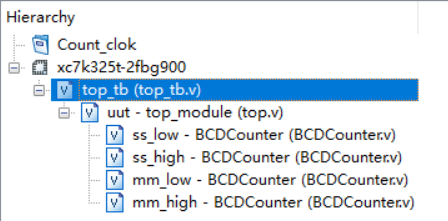
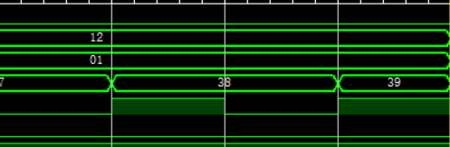
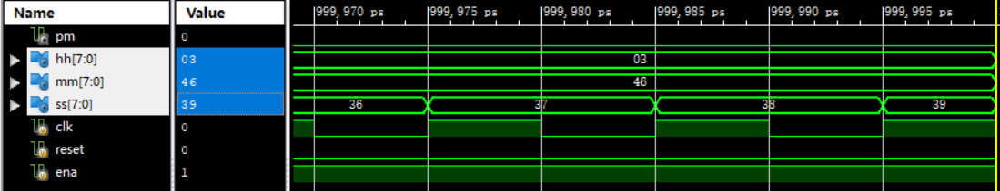
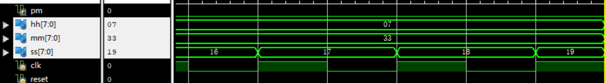

## 一、写在前面的话

这篇博文的本质不是一篇**答案的汇总**，HDLBits的题目组织形式是蕴含思想的（就像五三或者衡中的数学卷子），可以看到，虽然大部分前面的题目都谈不上难，但是如果一道一道的做下来，就会有体会，网站的搭建者是希望通过这组题目，来传递一种**硬件设计思想**。当然，更谦虚的说法是**硬件设计思想基础**。这篇博文的目的就是通过这些题目，来勉力阐述这种思想。

我写到了FSM章节的一半，其他的都写了，短期内应该是肝不动了，所以FSM的后面的答案就没有题解了，实在抱歉。

鸣谢名单在结尾放出。因为是无聊的刷题故事（不是为了写这篇文章，我打死都不会写这组题），所以鸣谢人员中只有很少在解决问题上为我提供帮助，但是倒是有很多人陪伴见证了这个无聊的故事，故一并鸣谢。

这篇文章还算成点的东西：

- 层次命名：2.1
- HDLBits与ISE在编译上的区别：3.1
- 硬件、画画和小姑娘：4.1.3
- 矢量的位选择规则：4.2.2,4.2.3
- 数据流级和行为级的区别：4.2.7
- 生成块语句：4.2.7
- 通用加法器的数学原理：4.3.9
- 两种always块语句与语言子集：4.4.1
- 锁存器除魅：4.4.4
- casex，casez的优先编码特性：4.4.5
- x和z的意义：4.4.5
- 应用整数描述行为，代替寄存器：4.5.4
- 变量初值问题：5.1.1.14
- 溢出判读方法在实现的局限性和数学证明：5.1.3.5
- 寄存器溢出问题：5.1.3.7
- 卡诺图：5.1.4.1
- POS卡诺图：5.1.4.6
- 非阻塞赋值：5.2.1.14
- 检验边沿的各种标准写法：5.2.1.14
- ISim模拟时间控制：5.2.2.8
- 大型for行为描述和位选实例：5.2.4.3
- Testbench的书写：7.1

---


## 二、无关题目


### 2.1 $stop

这个可以写在initial块里面，需要注意的是后面是需要**加上分号**的，要是丢了就会报错，所有的**调用系统任务语句**都需要加分号结尾。但是**预编译处理指令**是不需要加分号结尾的。

### 2.2 层次命名

- 每一个**模块实例**，**信号**，**变量**，**命名块**，**生成块**都使用一个标识符进行定义

- 层次命名允许设计者在整个设计中通过唯一的名字表示每一个标识符

- 层次名由一连串使用 “**.**” 分隔的标识符组成，每个标识符代表一个层次。

  这些知识我也是才接触不久，感觉还是很跟C有很大差别的，只是很难言明这种感觉，只能说很体现**硬件**思想，而并不是**面向过程**的软件语言（有点像面向对象），具体在实践的时候，我觉得有几个小体会

  ```verilog
  .clk1(clk2), 
  ```

  ​	第一、我每次都分不清到底clk1和clk2哪个是端口，哪个是激励端，现在知道，加了" .  "的clk1是端口（因为是层次名），而clk2是激励端。

  ​	第二、对ISE左侧的继承关系更加清晰，

  
  
  ​	可以看出，最上层的是**测试平台**，之后是top模块，之后是top模块实例化的各个小模块，即使测试平台并不是一个传统的模块（没法综合）但是它还是有一个名字。
  
  ​	第三、对命名块和生成块的理解加深
  
  ​	命名块应该是为了服务于内部的局部变量的，生成块应该是服务于在其中生成的硬件的，他们必选要名字，我会在下面的一组例题中阐述。


---


## 三、Getting Started

### 3.1 Getting Started

```verilog
module top_module( output one );
// Insert your code here
    assign one = 1'b1;

endmodule
```

在首道题目中，需要强调的是HDLBit中的编译器特点，这个编译器不像ISE提供的编译器，最明显的差别就是在线编译器对**线网类型和寄存器类型**区分不明显，比如assign的左式也可以是reg，always左式是wire也可以，这些都是能编译通过并通过测评的，但是在ISE中是无法通过语法检测的，需要注意。

### 3.2 Output Zero

```verilog
module top_module(
    output zero
);// Module body starts after semicolon
	assign zero = 1'b0;
endmodule
```

---


## 四、Verilog Language

### 4.1 Basic

#### 4.1.1 Simple Wire

```verilog
module top_module( input in, output out );
    
	assign out = in;
    
endmodule
```

这个题目用一个assign连续赋值语句来将输入和输出连接起来，标题的simple wire暗示了assign其实不是**赋值**，而是**连接**，我更加偏爱这种说法。

#### 4.1.2 Four Wire

最小白的写法是这样的

```verilog
module top_module( 
    input a,b,c,
    output w,x,y,z );
    
    assign w = a;
    assign x = b;
    assign y = b;
    assign z = c;

endmodule
```

可以说还是很好的，是很硬件，一点也不过程的代码。然后看优化版

```verilog
module top_module( 
    input a,
    input b, 
    input c,
    output w,
    output x,
    output y,
    output z );
    
    assign {w, x, y, z} = {a, b, b, c};

endmodule
```

这里做了两点优化，一个是端口的代码风格，改成了**一个一行**的形式，这种的好处是在避免**一行过于长**的情况，类似的方法还在parameter中出现。

另一个是利用拼接运算符简化assign语句的使用，这个在这道题目中有炫技的嫌疑，但是在移位寄存器等应用中，这种方法很体现本质。

#### 4.1.3 Inverter

```verilog
module top_module( input in, output out );

	assign out = ~in;
	
endmodule
```

在这里讲一下**数据流级建模**和**行为级建模**的区别，总的来说，这两种与其他方法的最重大区别就是不在有实例化（最具有硬件特征的代码）。对于两者的区别，**数据流**还是与硬件对应的很好的，他以assign和运算符为特征，只是为了简化一大堆**逻辑门**的实例化过程。**行为级**趋向于**从模块外部**描述模块的行为，以initial和always为标志，里面有**循环**和**分支判断**，这个级别与C语言更加接近（因为是在描述行为），与硬件的对应关系减弱（需要多思考才能意识到这其中的联系）。

我初学的时候，一直在想，verilog到底跟C有什么不同，现在越学越觉得，verilog与C有什么相同？他们两个好比**姐妹种**，只是外形相似，而内在完全不同。

而他们完全不同的原因，就是因为他们干的事情是不同的。对于**面向过程**的C，他描述的一种算法，是加工数据的一个过程，就好像一本小说，最重要的是**在时间上流动的情节**。对于**硬件描述性语言**的verilog，他描述的一块电路板，是元器件间的链接。就好像一幅画。确实一本小说里面可以有环境描写和人物介绍（变量声明），但是这些东西都是为了算法服务的。同样，作画的时候，我们说要画一个在草地上奔跑的姑娘，我们要画一百颗星星，我们要用白色和红色勾兑出粉色（分支判断，生成块），但是最后的成品依然是静态的一幅画。所有的代码都是为了描述一个硬件，这就是宗旨。

所以生成块如果用**面向过程**的角度来看，是不可理解的，**生成代码**对于C而言，就是**生成算法**，C可以接受循环，这代表着在时间上重复干一件事，但是绝对不能接受**生成算法**。但是对于verilog，**循化**才是不能接受的事情，画在纸上的姑娘可以哭，可以笑，但是由哭变笑，再重复100遍，是不可以的。但是我们可以接受纸上同时有100个或笑着或哭着的小姑娘。

我用logisim的时候，觉得这就是**硬件描述软件**，但是为什么在verilog中花了这么长时间才意识到这件事情。我觉得是因为verilog在**简化**描述的过程，在logisim的时候，我想要一个16个与门，我就得自己搭16次，连48次线，但是在verilog中，我可以用循环生成，在logisim我想实现一个有分支判断的电路，就要自己搭MUX，但是在这里，if-else就可以了。尽管画作是静态的，但是**作画的过程**是动态的，正是这里的动态让我产生了疑惑。此外，verilog不仅是为了描述硬件，他还描述**测试平台**，而测试平台显然是**动态**的，所以有些语句是为了测试平台写的，而不是为了描述硬件。

#### 4.1.4 AND gate

```verilog
module top_module( 
    input a, 
    input b, 
    output out );
    
    assign out = a & b;

endmodule
```

在后面这几道题目，都是**数据流**级的建模，做完就可以加深这种理解。

#### 4.1.5 NOR gate

```verilog
module top_module( 
    input a, 
    input b, 
    output out );
    
    assign out = ~(a | b);

endmodule
```

#### 4.1.6 XNOR gate

```verilog
module top_module( 
    input a, 
    input b, 
    output out );
    
    assign out = ~(a ^ b);
    
endmodule
```

#### 4.1.7 Declaring wires

```verilog
`default_nettype none
module top_module(
    input a,
    input b,
    input c,
    input d,
    output out,
    output out_n   ); 
    
    wire e, f;
    
    assign e = a & b;
    assign f = c & d;
    assign out = e | f;
    assign out_n = ~out;

endmodule
```

上面那个`default_nettype是将没有声明就使用的变量规定为不合法，要不然这样的变量在**缺省**的条件下是wire类型。

我们可以看到，尽管wire是“线”的意思，但是并没有起到**连线**的作用，起到连线作用的是**赋值语句**和**模块实例化的端口连接**，wire更像是一个**节点**。

#### 4.1.8 7458 chip

```verilog
module top_module ( 
    input p1a, p1b, p1c, p1d, p1e, p1f,
    output p1y,
    input p2a, p2b, p2c, p2d,
    output p2y );
	
    wire a, b, c, d;
  
    assign a = p1a & p1b & p1c;
    assign b = p1d & p1e & p1f;
    assign c = p2a & p2b;
    assign d = p2c & p2d;
    assign p1y = a | b;
    assign p2y = c | d;

endmodule
```

这个看图连接就可以，可以看到，声明中间变量可以简化assign语句。

### 4.2 Vector

#### 4.2.1 Vectors

```verilog
module top_module ( 
    input wire [2:0] vec,
    output wire [2:0] outv,
    output wire o2,
    output wire o1,
    output wire o0  ); // Module body starts after module declaration
    
    assign outv = vec;
    assign o0 = vec[0];
    assign o1 = vec[1];
    assign o2 = vec[2];

endmodule
```

可以看到**向量**这个词用得很好，它区别于数组的概念，它说的是一个线或者寄存器是**多位宽**的，而不是有一组线或者一组寄存器。

#### 4.2.2 Vectors in more detail

```verilog
`default_nettype none     // Disable implicit nets. Reduces some types of bugs.
module top_module( 
    input wire [15:0] in,
    output wire [7:0] out_hi,
    output wire [7:0] out_lo );
    
    assign out_hi = in[15:8];
    assign out_lo = in[7:0];

endmodule
```

这个题还是有很多语法细节需要强调的。

第一、对于向量来讲，重要的是**高位**和**低位**的概念，这规定了向量的方向，在verilog中，有

```verilog
verctor [msb_base_expr:lsb_base_expr]
```

左侧是最高位，右侧是最低位，高低不是看数字的大小

```verilog
wire [0:7] a;
wire [7:0] b;
```

a的最高位是a[0]，b的最高位是b[7]。

第二、向量声明的时候，写在“ [] ” 里的数字只是编号，而不具有**计数意义**，因为这样的写法都是允许的，比如

```verilog
reg [4:1] x;
reg [3:-2] y;
wire [0:7] z;
```

那么比如说我要调用x，y，z的最低位，不是x[0],y[0],z[0]（即不是最小的自然数0，这样就具有计数意义了）。而是x[1],y[-2],z[7]。这样只是编号。

#### 4.2.3 Vector part select

```verilog
module top_module( 
    input [31:0] in,
    output [31:0] out );//

    assign out[7:0] = in[31:24];
    assign out[15:8] = in[23:16];
    assign out[23:16] = in[15:8];
    assign out[31:24] = in[7:0];

endmodule
```

这种写法可以过，但是介绍一种高端的位选方法，这种写法也可以过。

```verilog
module top_module( 
    input [31:0] in,
    output [31:0] out );//

    assign out[7:0] = in[24+:8];
    assign out[15:8] = in[16+:8];
    assign out[23:16] = in[15-:8];
    assign out[31:24] = in[7-:8];

endmodule
```

关于这种写法，有标准：

```verilog
a[31:24]; 
c[0:8];

big_vect[lsb_base_expr +: width_expr];
big_vect[msb_base_expr -: width_expr];//适用于a这样的向量

little_vect[msb_base_expr +: width_expr];
little_vect[lsb_base_expr -: width_expr];//适用于c这样的向量

//a[0 +: 4] 就是 a[3:0]
//a[7 -: 4] 就是 a[7:4]
//c[0 +: 4] 就是 c[0:3]
//c[7 -: 4] 就是 c[4:7]
```

但是其实这种标注简单来说，就是**忽略了方向**，值关注**编号区间**的做法。

这种高端的位选有什么好处呢？是因为在普通的位选中，高位和低位都必须是常量，也就是说，没办法让类似循环一类的迭代变量参与位选。但是在这种方法中，位选基准位可以是变量，只要宽度是常量就可以了。在后面有题目举例。

#### 4.2.4 Bitwise operators

```verilog
module top_module( 
    input [2:0] a,
    input [2:0] b,
    output [2:0] out_or_bitwise,
    output out_or_logical,
    output [5:0] out_not
);
    assign out_or_bitwise = a | b;
    assign out_or_logical = a || b;
    assign out_not = {~b, ~a};

endmodule
```

这道题主要是区分**位运算**和**逻辑运算**的，向量位运算的结果还是一个向量，逻辑运算的结果，其实是把向量转化成一个整数，在转化成一个bool值（非0为1，0为0），再得出一个bool值的结果。

关于位运算的优先级，除了**移位运算符**，其他运算符的优先级都是要比“ == ”的运算级要低，所以使用位运算，最好**加括号**。

#### 4.2.5 Four-input gates

```verilog
module top_module( 
    input [3:0] in,
    output out_and,
    output out_or,
    output out_xor
);
    assign out_and = &in;
    assign out_or = |in;
    assign out_xor = ^in;

endmodule
```

这个题目其实是**缩减运算符**的应用，作为一个单目运算符，可以将向量的每一位作为运算对象进行运算。

#### 4.2.6 Vector concatenation operator

```verilog
module top_module (
    input [4:0] a, b, c, d, e, f,
    output [7:0] w, x, y, z );//

    assign {w, x, y, z} = {a, b, c, d, e, f, 2'b11};

endmodule
```

这是在引入**位拼接运算符**。	

#### 4.2.7 Vector reversal 1

```verilog
module top_module( 
    input [7:0] in,
    output [7:0] out
);
    assign out = {in[0], in[1], in[2], in[3], in[4], in[5], in[6], in[7]};

endmodule
```

这种方法还是十分笨拙的，但是其实是最好理解的，对于更加复杂的行为，我们可能需要更多的知识才能理解，所以后面还会有后续题目。

但是鉴于理解的连贯性，所以在这里一并书写，如果难以理解，不妨到了后面再看。

有一种用for循环的写法

```verilog
module top_module( 
    input [7:0] in,
    output [7:0] out
);
   	always @(*) begin	
		for (int i=0; i<8; i++)	// int is a SystemVerilog type. Use integer for pure Verilog.
			out[i] = in[8-i-1];
	end

endmodule
```

需要注意，这是一种**行为描述**，而不是一个**过程描述**，这个不是一个**循环赋值的过程**，而是**描述了一种执行循环赋值的功能模块**。这是一个很好的**行为级描述**的例子。

还需要注意的是只有i = i + 1;，没有i++;

还有一种是运用循环生成语句

```verilog
module top_module( 
    input [7:0] in,
    output [7:0] out
);
	generate
		genvar i;
		for (i=0; i<8; i = i+1) begin: my_block_name
			assign out[i] = in[8-i-1];
		end
	endgenerate

endmodule
```

这就是**循环生成**语句，这是一种**数据流级别**的描述，是区别于**行为描述**的（两者的概念区别可以在4.1.3中有介绍）。可以看出，行为描述了**1个**具有这样行为的模块，而循环生成语句其实连接了**8个**模块，这是区别。

为什么循环生成语句中的for一定需要一个**名字**，这是与**层次命名**有关的。如果循环生成语句里面是结构建模，我们为了指定哪个非门，就需要层次的帮助，那么就是块语句需要名字的原因。可以好好体会。

#### 4.2.8 Replication operator

```verilog
module top_module (
    input [7:0] in,
    output [31:0] out );//

    assign out = {{24{in[7]}}, in};

endmodule
```

这个需要强调的是，应用**重复法**的时候，需要在重复单元以后再加一个位拼接运算符，即，这种是错误的

```verilog
{a, 4{b}}
```

而正确的写法是

```
{a, {4{b}}}
```

#### 4.2.9 More replication

```verilog
module top_module (
    input a, b, c, d, e,
    output [24:0] out );

    assign out = ~({{5{a}}, {5{b}}, {5{c}}, {5{d}}, {5{e}}} ^ {{5{a, b, c, d, e}}});

endmodule
```

这是上一道题目的巩固。

### 4.3 Modules：Hierarchy

#### 4.3.1 Modules

```verilog
module top_module ( input a, input b, output out );

    mod_a instance1(a, b, out);
    
endmodule
```

从这一章开始会涉及很多**模块实例化**的内容，个人认为其实这个部分才是电子设计的精髓，不只是把不同功能的东西拼在一起，而是把**功能较为弱，规模较为小**的模块（比如只能计算一位）**聚合成功能强大，规模较为大**的模块。

#### 4.3.2 Connecting ports by position

```verilog
module top_module ( 
    input a, 
    input b, 
    input c,
    input d,
    output out1,
    output out2
);
    mod_a ins(out1, out2, a, b, c, d);
    
endmodule
```

需要注意的是，out1，out2这样连接在模块端口的输出变量，只能是wire类型的，用reg类型会在ISim上会输出x，但是这个问题不会在HDLBits上暴露，因为它格式不严格。

#### 4.3.3 Connecting ports by name

```verilog
module top_module ( 
    input a, 
    input b, 
    input c,
    input d,
    output out1,
    output out2
);
    
    mod_a ins(.out1(out1), .out2(out2), .in1(a), .in2(b), .in3(c), .in4(d));

endmodule
```

还是可以看出**层次命名**的应用，通过**“ . ”**来调用端口名。

#### 4.3.4 Three modules

```verilog
module top_module ( input clk, input d, output q );

	wire q1, q2;
    
    my_dff D1(clk, d, q1);
    my_dff D2(clk, q1, q2);
    my_dff D3(clk, q2, q);
    
endmodule
```

#### 4.3.5 Modules and vectors

```verilog
module top_module ( 
    input clk, 
    input [7:0] d, 
    input [1:0] sel, 
    output [7:0] q 
);
    
    wire [7:0] q1, q2, q3;

    my_dff8 D1(clk, d, q1), D2(clk, q1, q2), D3(clk, q2, q3);
    
    always @(*) begin
        case(sel)
            2'h0:
                q <= d;
            2'h1:
                q <= q1;
            2'h2:
                q <= q2;
            2'h3:
                q <= q3;
        endcase
    end    
    
endmodule
```

#### 4.3.6 Adder1

```verilog
module top_module(
    input [31:0] a,
    input [31:0] b,
    output [31:0] sum
);
	wire carry1, carry2;
    add16 low(a[15:0], b[15:0], 1'b0, sum[15:0], carry1);
    add16 high(a[31:16], b[31:16], carry1, sum[31:16], carry2);
    
endmodule
```

加法器就是很明显的那种功能较弱的模块聚合成功能较强的模块的例子，以后设计的时候也可以从这个角度思考，先解决一个小问题，在通过增设端口来解决大问题，可以说是一种**自底向上**了。

#### 4.3.7 Adder2

```verilog
module top_module (
    input [31:0] a,
    input [31:0] b,
    output [31:0] sum
);//
	wire carry1, carry2;
    add16 low(a[15:0], b[15:0], 1'b0, sum[15:0], carry1);
    add16 high(a[31:16], b[31:16], carry1, sum[31:16], carry2);
    
endmodule

module add1 ( input a, input b, input cin,   output sum, output cout );

    assign {cout, sum} = a + b + cin;

endmodule
```

这道题题面还是很难读懂的，其实add16他写好了一部分，其中用到的add1需要读者自己写。

#### 4.3.8 Carry-select adder

```verilog
module top_module(
    input [31:0] a,
    input [31:0] b,
    output [31:0] sum
);
	wire cout, c1;
    wire [15:0] sum1, sum2;
    
    add16 low(a[15:0], b[15:0], 1'b0, sum[15:0], cout);
    add16 high0(.a(a[31:16]), .b(b[31:16]), .cin(1'b0), .sum(sum1));
    add16 high1(.a(a[31:16]), .b(b[31:16]), .cin(1'b1), .sum(sum2));
    
    always @(*) begin
        if(cout == 0)
            sum[31:16] <= sum1;
        else
            sum[31:16] <= sum2;
    end
    
endmodule
```

这也是一种改进**串行加法器**的方法，只不过实现起来看着不如**超前进位加法器**优雅。

#### 4.3.9 Adder-subtractor

```verilog
module top_module(
    input [31:0] a,
    input [31:0] b,
    input sub,
    output [31:0] sum
);
    wire [32:0] tmp;
    wire cout;
    
    assign tmp = b ^ {32{sub}};
    
    add16 low(a[15:0], tmp[15:0], sub, sum[15:0], cout);
    add16 high(a[31:16], tmp[31:16], cout, sum[31:16]);

endmodule
```

这个设计实在是太漂亮了，利用**补码的补码是原码**，**取反加一是补码**的原理，结合**异或取反**和**进位加一**，实现了加法器和减法器的统一，这个的具体原理在[硬件中的数_living_frontier的博客-CSDN博客](https://blog.csdn.net/living_frontier/article/details/120583473)有，在这里就不讲了。

### 4.4 Procedures

#### 4.4.1 Always blocks（combinational）

```verilog
module top_module(
    input a, 
    input b,
    output wire out_assign,
    output reg out_alwaysblock
);

    assign out_assign = a & b;
    always @(*) out_alwaysblock = a & b;
    
endmodule
```

这章叫做procedure，主要的就是**行为级建模**的诸多例子，其中有**数据流级**有很大差别，语法更加接近C，需要好好体会。

HDLBits在很明确的把always模块分为了两类，一种是**组合逻辑**，一种是**时序逻辑**。这是一种很好的**角度**，要是不刷题，估计意识到这件事情要很久。

#### 4.4.2 Always blocks（clocked）

```verilog
module top_module(
    input clk,
    input a,
    input b,
    output wire out_assign,
    output reg out_always_comb,
    output reg out_always_ff   );
    
    assign out_assign = a ^ b;
    always @(*) out_always_comb = a ^ b;
    always @(posedge clk) out_always_ff = a ^ b;
        
endmodule
```

有一个问题我一直想论证，就是学习一门语言，不需要学习他的全部，而是学习他的**子集**。只要这些**子集**可以**张成全部描述功能**就好了，比如其实Always块的语法还有很多，但是了解了上面这两种，就可以解决大部分问题了。类似的例子还出现在**可综合的语法的模块书写**和**不可综合的testbench**上。

#### 4.4.3 If statement

```verilog
module top_module(
    input a,
    input b,
    input sel_b1,
    input sel_b2,
    output wire out_assign,
    output reg out_always   );
    
    assign out_assign = ({sel_b1, sel_b2} == 3) ? b : a;
    always @(*)
        if({sel_b1, sel_b2} == 3)
            out_always = b;
    	else
            out_always = a;

endmodule
```

#### 4.4.4 If statement latches

```verilog
module top_module (
    input      cpu_overheated,
    output reg shut_off_computer,
    input      arrived,
    input      gas_tank_empty,
    output reg keep_driving  ); //

    always @(*) begin
        if (cpu_overheated)
           shut_off_computer = 1;
    end

    always @(*) begin
        if (~arrived)
           keep_driving = ~gas_tank_empty;
    end

endmodule
```

这里讲一下**锁存器**问题，如果没有else，default，这类东西都会造成**锁存器**。所谓**锁存器**就是**电平敏感**的存储电路。其实在实际的电子设计中还算常见。

但是我初学的时候，似乎**锁存器**是一个令人谈虎色变的东西，但具体询问为什么不好？得出的结论就是**容易造成bug**，但是为什么一个正常的东西，会造成bug，能解释的人就少了。

经过多方的协助，我个人感觉有两点原因：第一个是在综合的时候，受限于FGPA设计，锁存器的实现需要大量的硬件资源，所以不值当的。第二个是真的容易出bug，是因为我们进行电路设计的时候，都是把电路拆分成**组合逻辑**和**寄存器**两个部分，那么锁存器，不是组合逻辑，不是寄存器，但是它伪装的很像**组合逻辑**，这样就很难debug了，也就是说，是因为我们的设计习惯这个**主观因素**导致了锁存器的尴尬。

类比一下，锁存器就像C语言的**go**一样，功能是没有毛病（不是像网上说的会**导致毛刺**之类的，那些原因也会使寄存器毛刺），但是跟我们的设计习惯不符。

#### 4.4.5 Case statement

```verilog
module top_module ( 
    input [2:0] sel, 
    input [3:0] data0,
    input [3:0] data1,
    input [3:0] data2,
    input [3:0] data3,
    input [3:0] data4,
    input [3:0] data5,
    output reg [3:0] out   );//

    always@(*) begin  // This is a combinational circuit
        case(sel)
            0:
                out = data0;
            1:
                out = data1;
            2:
                out = data2;
            3:
                out = data3;
            4:
                out = data4;
            5:
                out = data5;
            default:
                out = 0;
        endcase
    end

endmodule
```

#### 4.4.6 Priority encoder

```verilog
module top_module (
    input [3:0] in,
    output reg [1:0] pos  );
    
    always @(*)
        case(in)
            4'b0000: pos = 0;
            4'b0001: pos = 0;
            4'b0010: pos = 1;
            4'b0011: pos = 0;
            4'b0100: pos = 2;
            4'b0101: pos = 0;
            4'b0110: pos = 1;
            4'b0111: pos = 0;
            4'b1000: pos = 3;
            4'b1001: pos = 0;
            4'b1010: pos = 1;
            4'b1011: pos = 0;
            4'b1100: pos = 2;
            4'b1101: pos = 0;
            4'b1110: pos = 1;
            4'b1111: pos = 0;
        endcase

endmodule
```

这里介绍case的两个重要特性，一个是多种输出相同的情况是可以用“ ，”并列排布的，比如这样也是可以通过的:

```verilog
module top_module (
    input [3:0] in,
    output reg [1:0] pos  );
    
    always @(*)
        case(in)
            4'b0000, 
            4'b0001, 
            4'b0011, 
            4'b0101, 
            4'b0111, 
            4'b1001, 
            4'b1011, 
            4'b1101, 
            4'b1111: 
                pos = 0;
            4'b0010, 
            4'b0110, 
            4'b1010, 
            4'b1110: 
                pos = 1;
            4'b0100, 
            4'b1100: 
                pos = 2;
            4'b1000: 
                pos = 3;
        endcase

endmodule
```

另一个就是，case虽然是分支判断，但是是有优先顺序的（这是这节叫做**优先译码器**的原因），在上面的情况是比在下面的情况优先级高的，在case里面不明显，是因为无论是0,1，x，z都是每个差一点都不行，所以情况和情况之间不会有**重叠**，但是在casez和casex中就会有区别。

#### 4.4.7 Priority encoder with casez

```verilog
module top_module (
    input [7:0] in,
    output reg [2:0] pos  );
    
    always @(*)
        casez(in)
            8'bzzzzzzz1: pos = 0;
            8'bzzzzzz1z: pos = 1;
            8'bzzzzz1zz: pos = 2;
            8'bzzzz1zzz: pos = 3;
            8'bzzz1zzzz: pos = 4;
            8'bzz1zzzzz: pos = 5;
            8'bz1zzzzzz: pos = 6;
            8'b1zzzzzzz: pos = 7;
            default: pos = 0;
        endcase
endmodule
```

首先先介绍一下x和z。x是**不定态**，也就是说，其状态**不可知**，在verilog中，比较运算符“\==”如果比较的位数中含有x或者z，就会输出x，但是如果用" \=== "就不会有这种输出，“===”会逐位比较，包括只有x和z都相等的时候，就会输出1，否则输出0。z是高阻态，在实际电路中，开关断开（没有驱动）就意味着高阻态（断路电阻视为很大）。

但是casex和casez跟上面讲的东西一毛钱关系都没有。casex和casez说的是如果情况中的某一位值是x或z（对应），那么就不比较他们了，就比较其他的不是x或z的位，这样就会造成情况的**重叠**，但是正如前一道题目叙述，**优先译码器**的特性得到了用武之地。

### 4.5 More Verilog Features

#### 4.5.1 Conditional ternary operator

```verilog
module top_module (
    input [7:0] a, b, c, d,
    output [7:0] min);//
	
    wire [7:0] tmp1, tmp2;
    
    assign tmp1 = (a < b) ? a : b;
    assign tmp2 = (c < d) ? c : d;
    assign min = (tmp1 < tmp2) ? tmp1 : tmp2;

endmodule
```

需要强调，无论串连多少个三目运算符，都是一个式子，也就是说，signed这个，会被后面的某个unsigneded同化，所以其实assign三目是种很不好的语言，我看过激进的观点是抛弃assign，完全用Always代替，也不无可取之处。

#### 4.5.2 Reduction operators

```verilog
module top_module (
    input [7:0] in,
    output parity); 
    
    assign parity = ^in;

endmodule
```

#### 4.5.3 Reduction：Even wider gates

```verilog
module top_module( 
    input [99:0] in,
    output out_and,
    output out_or,
    output out_xor 
);

    assign out_and = &in;
    assign out_or = |in;
    assign out_xor = ^in;
    
endmodule
```

#### 4.5.4 Combinational for-loop：Vector reversal2

```verilog
module top_module( 
    input [99:0] in,
    output [99:0] out
);
   generate
       genvar i;
       for(i = 0; i < 100; i++) begin:reverse
           assign out[i] = in[99 - i];
       end
   endgenerate

endmodule
```

**for循环来描述行为**在4.2.7中已经系统介绍过了，这里想说的是，还有一个东西看上去**很过程**（跟for一样），但是也可以用来描述硬件，就是**整数**，后面会有关于FSM的设计，里面如果条件复杂一些，就会用到一些比如**计数寄存器**，而寄存器本质是一种**简单的FSM**，所以写起来bug很多（时序问题），但是如果用**整型**实现计数功能，就不会有这种困扰，应当灵活一些。

#### 4.5.5 Combinational for-loop：255-bit population count

```verilog
module top_module( 
    input [254:0] in,
    output [7:0] out );
    integer i;
    always@(*)begin
        out = 1'b0;
        for(i=0;i< 255;i=i+1)begin
            out = out + in[i]; 
        end  
    end
endmodule
```

这个实现的是logisim中bitadder的功能，可以说，虽然for不太自然，但是面对这样的功能，这个已经很自然了。

而且居然是可以综合的，我能看懂的部分用到了异或门。

#### 4.5.6 Generate for-loop：100-bit binary adder2

```verilog
module top_module( 
    input [99:0] a, b,
    input cin,
    output [99:0] cout,
    output [99:0] sum );
    integer i;
    always@(*)begin
        {cout[0],sum[0]} = a[0]+b[0]+cin; 
        for(i=1;i< 100;i=i+1)begin
            {cout[i],sum[i]} = a[i]+b[i]+cout[i-1];
        end
    end
endmodule
```

这里是没有用生成块的，主要是为了适应这种**过于过程**的for。

#### 4.5.7 Generate for-loop：100-digit BCD adder

```verilog
module top_module( 
    input [399:0] a, b,
    input cin,
    output cout,
    output [399:0] sum );

    wire[99:0]    cout_1;
    generate
        genvar i;
        for(i = 0; i <= 99; i = i + 1)begin:adder
            if(i == 0)begin
                bcd_fadd u_bcd_fadd(
                    .a (a[3:0]),
                    .b (b[3:0]),
                    .cin (cin),
                    .sum (sum[3:0]),
                    .cout (cout_1[0])
                );
            end
            else begin
                bcd_fadd ui_bcd_fadd(
                    .a (a[4 * i + 3: 4 * i]),
                    .b (b[4 * i + 3: 4 * i]),
                    .cin (cout_1[i - 1]),
                    .sum (sum[4 * i + 3: 4 * i]),
                    .cout (cout_1[i])
                );
            end
        end
        assign cout = cout_1[99];
    endgenerate

endmodule
```

像**模块实例化**这种东西，就没办法用**for行为**来代替了，可见生成块是没有办法完全被其他语句替代的，所以还是需要好好学习的。

---


## 五、Circuit

### 5.1 Combinational Logic

#### 5.1.1 Basic Gates

##### 5.1.1.1 Wire

```verilog
module top_module (
    input in,
    output out);

    assign out = in;
    
endmodule
```

在整个第五章，我们会把整个常见的硬件全都用verilog写一遍，才能切实体会**硬件设计**的思想。要清楚语言与实际电路的对应关系。

##### 5.1.1.2 GND

```verilog
module top_module (
    output out);
    
	assign out = 1'b0;
	
endmodule
```

##### 5.1.1.2 NOR

```verilog
module top_module (
    input in1,
    input in2,
    output out);
    
    assign out = ~(in1 | in2);

endmodule
```

##### 5.1.1.3 Another gate

```verilog
module top_module (
    input in1,
    input in2,
    output out);
    
    assign out = in1 & (~in2);

endmodule
```

##### 5.1.1.4 Two gates

```verilog
module top_module (
    input in1,
    input in2,
    input in3,
    output out);

    assign out = in3 ^ (~(in1 ^ in2));
    
endmodule
```

##### 5.1.1.5 More logic gates

```verilog
module top_module( 
    input a, b,
    output out_and,
    output out_or,
    output out_xor,
    output out_nand,
    output out_nor,
    output out_xnor,
    output out_anotb
);
    assign out_and = a & b;
    assign out_or = a | b;
    assign out_xor = a ^ b;
    assign out_nand = ~(a & b);
    assign out_nor = ~(a | b);
    assign out_xnor = ~(a ^ b);
    assign out_anotb = a & ~b;

endmodule
```

##### 5.1.1.6 7420 chip

```verilog
module top_module ( 
    input p1a, p1b, p1c, p1d,
    output p1y,
    input p2a, p2b, p2c, p2d,
    output p2y );
	
    assign p1y = ~(p1a & p1b & p1c & p1d);
    assign p2y = ~(p2a & p2b & p2c & p2d);

endmodule
```

##### 5.1.1.7 Truth tables

```verilog
module top_module( 
    input x3,
    input x2,
    input x1,  // three inputs
    output f   // one output
);
    
    assign f = x2 & ~x3 | x1 & x3;

endmodule
```

这道题是真值表和最小项的应用，我一直觉得这个是组合逻辑最强大的地方，通过简单的逻辑运算，就可以描述复杂的事务，大概就是《三体》里描述的场景吧。

##### 5.1.1.8 Two-bit equality

```verilog
module top_module ( input [1:0] A, input [1:0] B, output z ); 
    
    assign z = (A == B);

endmodule
```

##### 5.1.1.9 Simple circuit A

```verilog
module top_module (input x, input y, output z);

    assign z = (x^y) & x;
    
endmodule
```

##### 5.1.1.10 Simple circuit B

```verilog
module top_module ( input x, input y, output z );

    assign z = ~(x ^ y);
    
endmodule
```

##### 5.1.1.11 Combine circuits A and B

```verilog
module top_module (input x, input y, output z);
	
    wire tmp1, tmp2, tmp3, tmp4;
    A A1(x, y, tmp1);
    B B1(x, y, tmp2);
    A A2(x, y, tmp3);
    B B2(x, y, tmp4);
    
    assign z = (tmp1 | tmp2) ^ (tmp3 & tmp4);
    
endmodule

module A (input x, input y, output z);

    assign z = (x^y) & x;
    
endmodule

module B ( input x, input y, output z );

    assign z = ~(x ^ y);
    
endmodule
```

##### 5.1.1.12 Ring or virbrate

```
module top_module (
    input ring,
    input vibrate_mode,
    output ringer,       // Make sound
    output motor         // Vibrate
);

    assign ringer = ~vibrate_mode & ring;
    assign motor = vibrate_mode & ring;
    
endmodule
```

无聊的应用题。

##### 5.1.1.13 Thermostat

```verilog
module top_module (
    input too_cold,
    input too_hot,
    input mode,
    input fan_on,
    output heater,
    output aircon,
    output fan
); 
    assign heater = mode & too_cold;
    assign aircon = ~mode & too_hot;
    assign fan = (mode & too_cold) | (~mode & too_hot) | fan_on;

endmodule
```

另一道无聊的应用题。

##### 5.1.1.14 3-bit population count

```verilog
module top_module( 
    input [2:0] in,
    output [1:0] out );
    
    always @(*) begin//这里赋初值很重要，忘了就错了
        out = 0;
        for(integer i = 0; i < 3; i = i + 1)
            out = out + in[i];
    end

endmodule
```

这里讲解一下**初始值**问题，当声明变量的时候，如果不赋值，那么wire类型初值是z，整数和寄存器都是x，这很符合实际情况，wire没有驱动的时候是高阻态，而综合后与门电路相关的整数和寄存器，都是与**门电路**相关，而门电路是有驱动的（这里说的是不是输入的驱动），所以应该是不定态x。

另外再次强调，计数用整型真的比寄存器好使。

##### 5.1.1.15 Gates and vectors

```verilog
module top_module( 
    input [3:0] in,
    output [2:0] out_both,
    output [3:1] out_any,
    output [3:0] out_different );
    
    assign out_both = in[2:0] & in[3:1];//这里就不能直接用0了，就必须指明位宽了
    assign out_any = in[3:1] | in[2:0];
    assign out_different = in ^ {in[0], in[3:1]};

endmodule
```

##### 5.1.1.16 even longer Vectors

```verilog
module top_module( 
    input [99:0] in,
    output [98:0] out_both,
    output [99:1] out_any,
    output [99:0] out_different );
    
    assign out_both = in[98:0] & in[99:1];
    assign out_any = in[98:0] | in[99:1];
    assign out_different = in[99:0] ^ {in[0], in[99:1]};

endmodule
```

#### 5.1.2 Multiplexers

##### 5.1.2.1 2-to-1 multiplexer

```verilog
module top_module( 
    input a, b, sel,
    output out ); 
    
    assign out = (sel == 0) ? a : b;

endmodule
```

##### 5.1.2.2 2-to-1 bus multiplexer

```verilog
module top_module( 
    input [99:0] a, b,
    input sel,
    output [99:0] out );

    assign out = (sel == 0) ? a : b;
    
endmodule
```

还是感叹向量和标量在处理上的一致性，刚学高代的时候感觉向量很不自然，现在看还是见识太少了。

##### 5.1.2.3 9-to-1 multiplexer

```verilog
module top_module( 
    input [15:0] a, b, c, d, e, f, g, h, i,
    input [3:0] sel,
    output [15:0] out );
    
    always @(*)
        case(sel)
            0: out = a;
            1: out = b;
            2: out = c;
            3: out = d;
            4: out = e;
            5: out = f;
            6: out = g;
            7: out = h;
            8: out = i;
            default: out = {16{1'b1}};
        endcase

endmodule
```

当输入一多，case就变得有用了，数据流级的建模就不如行为级好了。

##### 5.1.2.4 256-to-1 multiplexer

```verilog
module top_module( 
    input [255:0] in,
    input [7:0] sel,
    output out );

    assign out = in[sel];
    
endmodule
```

这里提供了一个更好的想法，利用数组索引，来进行位访问，在之前的题中也可以应用，可以说这个是最优雅的方法了。

##### 5.1.2.5 256-to-1 4-bit multiplexer

```verilog
module top_module( 
    input [1023:0] in,
    input [7:0] sel,
    output [3:0] out );

    assign out = in[sel * 4 + 3 -: 4];
    //assign out = in[sel*4 +: 4];
    //assign out = {in[sel*4+3], in[sel*4+2], in[sel*4+1], in[sel*4+0]};
endmodule
```

这些写法都是可以的，包括注释里面的。但是下面这种写法是不可以的：

```verilog
module top_module( 
    input [1023:0] in,
    input [7:0] sel,
    output [3:0] out );

    assign out = in[sel * 4 + 3 : sel*4];

endmodule
```

据说是因为sel是这个选择里没有常量。但我觉得只是语法规定。

#### 5.1.3 Arithmetic Circuits

##### 5.1.3.1 half-adder

```verilog
module top_module( 
    input a, b,
    output cout, sum );

    assign {cout, sum} = a + b;
    
endmodule
```

半加器就是不考虑进位的加法器。

##### 5.1.3.2 Full adder

```verilog
module top_module( 
    input a, b, cin,
    output cout, sum );

    assign {cout, sum} = a + b + cin;
    
endmodule
```

全加器是考虑进位的加法器。

##### 5.1.3.3 3-bit binary adder

```verilog
module top_module( 
    input [2:0] a, b,
    input cin,
    output [2:0] cout,
    output [2:0] sum );
    
    fadd add0(a[0], b[0], cin, cout[0], sum[0]);
    fadd add1(a[1], b[1], cout[0], cout[1], sum[1]);
    fadd add2(a[2], b[2], cout[1], cout[2], sum[2]);

endmodule

module fadd( 
    input a, b, cin,
    output cout, sum );
	
    assign {cout, sum} = a + b +cin;
    
endmodule
```

##### 5.1.3.4 Adder

```verilog
module top_module (
    input [3:0] x,
    input [3:0] y, 
    output [4:0] sum);

    assign sum = x + y;
    
endmodule
```

这个例子结合上面的，再次告诉我们数据流级建模的强大。

##### 5.1.3.5 Signed addition overflow

```verilog
module top_module (
    input [7:0] a,
    input [7:0] b,
    output [7:0] s,
    output overflow
); 
    assign s=a + b;
    assign overflow=a[7] & b[7] & ~s[7] | ~a[7] & ~b[7] & s[7];

endmodule
```

这道题目用的是真值表法判断溢出，但是其实课堂介绍的是用的另一种方法：

Cs是符号位的进位，Cp是最高数值位的进位，如果两者相同，就没有溢出，如果不同，就溢出了，具体的证明在我的博客里有[硬件中的数_living_frontier的博客-CSDN博客](https://blog.csdn.net/living_frontier/article/details/120583473)。但是为什么没有用到这个方法呢，是因为我们用的是数据流级的描述，没有办法探查具体每一位的情况的，即使写成这样

```
module top_module (
    input [7:0] a,
    input [7:0] b,
    output [7:0] s,
    output overflow
); 
    wire cs, cp;
    
    assign s=a + b;
    assign cs = a[7] & b[7];
    assign cp = a[6] & b[6];
    assign overflow = cs ^ cp;

endmodule
```

是错误的，是因为这些位的进位是还跟更低位有关，比如cp就不止和a[6]和b[6]有关，还跟第5位的cout有关，那么cout又跟第四位的cout有关，如此是没有办法写清楚的，但是在硬件实现中，这个问题是很好解决的（甚至不用解决，连出两根线就可以了），所以还是要注意非结构描述的代价。

##### 5.1.3.6 100-bit binary adder

```verilog
module top_module( 
    input [99:0] a, b,
    input cin,
    output cout,
    output [99:0] sum );

    assign {cout, sum} = a + b + cin;
    
endmodule
```

##### 5.1.3.7 4-digit BCD adder

```verilog
module top_module( 
    input [15:0] a, b,
    input cin,
    output cout,
    output [15:0] sum );
    
    wire cout1, cout2, cout3;
    adder a1(a[3:0], b[3:0], cin, sum[3:0], cout1);
    adder a2(a[7:4], b[7:4], cout1, sum[7:4], cout2);
    adder a3(a[11:8], b[11:8], cout2, sum[11:8], cout3);
    adder a4(a[15:12], b[15:12], cout3, sum[15:12], cout);

endmodule

module adder(input [3:0] a, input [3:0] b, input cin, output [3:0] sum, output cout);
    assign sum = (a + b + cin >= 'd10)? a + b + cin - 4'd10 : a + b + cin;
    assign cout = (a + b + cin >= 'd10)? 1'd1 : 1'd0;
    //这里需要注意一下assign sum = (a + b + cin >= 4'd10)? a + b + cin - 4'd10 : a + b + cin;是错误的。
    //因为当比较的时候，会按照位宽较小的进行，如果a + b + cin超过16，就会变成 1_0000 > 1010，进而变成0000 > 1010
    //造成错误
endmodule
```

这里应用的思想其实与高精度加法类似。

另外需要注意的点就是溢出问题，还是很难发现的，需要多多留意，在注释里已经把原理讲解的很清楚了。

#### 5.1.4 Karnaugh Map to Circuit

##### 5.1.4.1 3-variable

```verilog
module top_module(
    input a,
    input b,
    input c,
    output out  ); 

    assign out = c | b & ~c | a & ~b;

endmodule
```

关于卡诺图，其原理和威力在这篇博客中我介绍了，所以就不在这里赘述了。[计组中的组合数学_living_frontier的博客-CSDN博客](https://blog.csdn.net/living_frontier/article/details/120720868)

##### 5.1.4.2 4-variable

```verilog
module top_module(
    input a,
    input b,
    input c,
    input d,
    output out  ); 

    assign out = ~b & ~c | ~a & ~d | b & c &d | a & c & d;
    
endmodule
```

##### 5.1.4.3 4-variable

```verilog
module top_module(
    input a,
    input b,
    input c,
    input d,
    output out  ); 

    assign out = a | ~b & c | b & ~c & ~d;
    
endmodule
```

##### 5.1.4.4 4-variable

```verilog
module top_module(
    input a,
    input b,
    input c,
    input d,
    output out  ); 

    assign out = a | ~b & c | b & ~c & ~d;
    
endmodule
```

##### 5.1.4.5 4-variable

```verilog
module top_module(
    input a,
    input b,
    input c,
    input d,
    output out  ); 

    assign out = (~a&b&~c&~d) | (a&~b&~c&~d) | (~a&~b&~c&d) |  (a&b&~c&d) |  (~a&b&c&d) |  (a&~b&c&d) |  (~a&~b&c&~d) |  (a&b&c&~d); //硬刚

endmodule
```

##### 5.1.4.6 Minimum SOP and POS

```verilog
module top_module (
    input a,
    input b,
    input c,
    input d,
    output out_sop,
    output out_pos
); 
    assign out_pos = c & (~a | b | ~c) & (~b | ~c | d);
    
    assign out_sop = c & d | ~a & ~b & c;

endmodule
```

sop：sum of product 积之和

pos：product of sum 和之积

pos也可以用卡诺图处理，处理的对象变成了0，项也要相应取反。具体的证明可以使用反演定律，反演定律的证明在这篇博客里有[计组中的组合数学_living_frontier的博客-CSDN博客](https://blog.csdn.net/living_frontier/article/details/120720868)。

##### 5.1.4.7 Karnaugh map

```verilog
module top_module (
    input [4:1] x, 
    output f );

    assign f = x[1] & x[2] & ~x[3] | ~x[1] & x[3];
    //x[4:1]的下标就是4-1，不是3-0
    
endmodule
```

##### 5.1.4.8 Karnaugh map

```verilog
module top_module (
    input [4:1] x,
    output f
); 

    assign f = ~x[1] & x[3] | ~x[2] & ~x[4] | x[2] & x[3] & x[4];
    
endmodule
```

##### 5.1.4.9 K-map implemented with a multiplexer

```verilog
module top_module (
    input c,
    input d,
    output [3:0] mux_in
); 

    assign mux_in = {(c&d),(~d),1'b0, (c|d)};

endmodule
```

### 5.2 Sequential Logic

#### 5.2.1 Latches and Flip-Flops

##### 5.2.1.1 D Flip-Flop

```verilog
module top_module (
    input clk,    // Clocks are used in sequential circuits
    input d,
    output reg q );//

    always @(posedge clk) begin
        q <= d;
    end

endmodule
```

显然，HDLBits想让我们在always @(posedge clk)和寄存器之间建立一种联系，这是一个很好的想法。

##### 5.2.1.2 D Flip-Flops

```verilog
module top_module (
    input clk,
    input [7:0] d,
    output reg [7:0] q
);
    always @(posedge clk) begin
        q <= d;
    end
    
endmodule
```

简单的标量变向量。

##### 5.2.1.3 DFF with reset

```verilog
module top_module (
    input clk,
    input reset,            // Synchronous reset
    input [7:0] d,
    output reg [7:0] q
);

    always @(posedge clk) begin
        if(reset)
            q <= 8'd0;
        else 
            q <= d;
    end
    
endmodule
```

这个题和5.2.1.5是同步复位和异步复位的标准写法，很规范而且优雅。

##### 5.2.1.3 DFF with reset value

```verilog
module top_module (
    input clk,
    input reset,
    input [7:0] d,
    output reg [7:0] q
);
    
    always @(negedge clk) begin
        if(reset == 1'd1)
            q <= 8'h34;
        else
            q <= d;
    end

endmodule
```

##### 5.2.1.4 DFF with asynchronous reset

```verilog
module top_module (
    input clk,
    input areset,   // active high asynchronous reset
    input [7:0] d,
    output reg [7:0] q
);
    always @(posedge clk, posedge areset) begin//这个需要注意一下
        if(areset)
            q <= 8'd0;
        else
            q <= d;
    end
    
endmodule
```

异步复位的标准写法。

##### 5.2.1.5 DFF with byte enable

```verilog
module top_module (
    input clk,
    input resetn,
    input [1:0] byteena,
    input [15:0] d,
    output reg [15:0] q
);
    always @(posedge clk) begin
        if(~resetn)
            q <= 16'h0;
        else if(byteena[1] | byteena[0]) begin
            if(byteena[1])
                q[15:8] <= d[15:8];
            if(byteena[0])
                q[7:0] <= d[7:0];
        end
    end

endmodule
```

这是具有使能端的寄存器的标准写法。

##### 5.2.1.6 D-latch

```verilog
module top_module (
    input d, 
    input ena,
    output reg q);

    always @(*) begin
        if(ena)
            q = d;
    end
    
endmodule
```

可见一定要破除对锁存器的恐惧，这个代码是没有问题的。有问题的是提出这个问题却不给解答，从而让恐惧蔓延的人。

##### 5.2.1.7 DFF

```verilog
module top_module (
    input clk,
    input d, 
    input ar,   // asynchronous reset
    output reg q);
    
    always @(posedge clk, posedge ar) begin
        if(ar)
            q <= 1'b0;
        else
			q <= d;
    end
endmodule
```

跟上面题目重了。

##### 5.2.1.8 DFF

```verilog
module top_module (
    input clk,
    input d, 
    input r,   // synchronous reset
    output reg q);

    always @(posedge clk) begin
        if(r)
            q <= 1'b0;
        else
            q <= d;
    end
    
endmodule
```

##### 5.2.1.9 DFF+gate

```verilog
module top_module (
    input clk,
    input in, 
    output out);

    always @(posedge clk) begin
        out <= in ^ out;
    end
    
endmodule
```

其实按照状态机的规范写法，应该把 in^out 拆出去写，这其实就是个moore状态机。

##### 5.2.1.10 Mux and DFF

```verilog
module top_module (
	input clk,
	input L,
	input r_in,
	input q_in,
	output reg Q);

    wire tmp;
    assign tmp = (L == 1) ? r_in : q_in;
    always @(posedge clk) begin
        Q <= tmp;
    end
    
endmodule
```

##### 5.2.1.11 Mux and DFF

```verilog
module top_module (
    input clk,
    input w, R, E, L,
    output Q
);

    wire tmp1;
    assign tmp1 = E ? w : Q;
    wire tmp2 = L ? R : tmp1;
    
    always @(posedge clk) begin
        Q <= tmp2;
    end
            
endmodule
```

##### 5.2.1.12 DFF and gates

```verilog
module top_module (
    input clk,
    input x,
    output z
); 

    reg q1 = 0;
    reg q2 = 0;
    reg q3 = 0;

    always @ (posedge clk)
        begin
            q1 <= x ^ q1; 
        end

    always @ (posedge clk)
        begin
            q2 <= x & (~q2);
        end

    always @ (posedge clk)
        begin
            q3 <= x | (~q3);
        end

    assign z = ~(q1 | q2 | q3); 

endmodule
```

##### 5.2.1.13 Create circuit from truth table

```verilog
module top_module (
    input clk,
    input j,
    input k,
    output Q); 
    
    always @(posedge clk) begin
        case ({j, k})
            2'b00: Q <= Q;
            2'b01: Q <= 1'b0;
            2'b10: Q <= 1'b1;
            2'b11: Q <= ~Q;
        endcase
    end

endmodule
```

这道题即使看上去是个jk触发器，其实当j = 1，k = 1的时候，不是翻转，而是反复翻转，所以这个状态时不被允许的。

   ##### 5.2.1.14 Detect an edge

```verilog
module top_module (
    input clk,
    input [7:0] in,
    output [7:0] pedge
);
    reg [7:0] in_r1, in_r2;
    always@(posedge clk) begin
        in_r1 <= in;
        in_r2 <= in_r1;
    end
    assign pedge = ~in_r2 & in_r1;
    //这法子太牛逼了
 
endmodule
```

这个方法我想不出来较为自然的理解办法，只能说太厉害了。

另外这道题声明了两个寄存器，来让in_r2这个寄存器获得延后in一周期的波动，其中涉及了非阻塞赋值（当然如果从寄存器角度理解，就是寄存器串联），其中的原理可以查看这篇博客http://cscore.buaa.edu.cn/#/discussion_area/151/posts

##### 5.2.1.15 Detect both edge

```verilog
module top_module (
    input clk,
    input [7:0] in,
    output [7:0] anyedge
);
    reg [7:0] in_r1, in_r2;
    always@(posedge clk) begin
        in_r1 <= in;
        in_r2 <= in_r1;
    end
    assign anyedge = in_r2 ^ in_r1;
 
endmodule
```

继续跪着看答案。

##### 5.2.1.16 Edge capture regesiter

```verilog
module top_module (
    input clk,
    input reset,
    input [31:0] in,
    output [31:0] out
);
    reg [31:0]	in_reg;
    
    always@(posedge clk)begin
        in_reg <= in;
    end
    
    always@(posedge clk)begin
        if(reset)begin
            out <= 32'd0;
        end
        else begin
            out <= ~in & in_reg | out;
        end
    end
    
endmodule
```

这个题是检测下降沿，检测到后out一直为高，直到reset == 1时，out为0。

方法依然难以揣摩，就记住把。

##### 5.2.1.17 Dual-edge triggered flip-flop

```verilog
module top_module (
    input clk,
    input d,
    output q
);
    reg p, n;
    always @(posedge clk) p <= d;
    always @(negedge clk) n <= d;
    assign q = clk ? p : n;

endmodule
```

这个方法声明了一个上升边沿敏感的寄存器，一个下降边沿敏感的寄存器，然后用clk决定输出哪一个的值。

但是有一个问题，就是现实世界中，因为寄存器延迟，会产生毛刺，就是寄存器还没更新，就执行了assign语句，也就是在clk由0变1的过程，q的值是 旧n，旧q，新q，而我们只想要的是旧n，新q。

所以就有了标答解法（上面那种是可以过测评的）

```verilog
module top_module(
	input clk,
	input d,
	output q);
	
	reg p, n;
	
	// A positive-edge triggered flip-flop
    always @(posedge clk)
        p <= d ^ n;
        
    // A negative-edge triggered flip-flop
    always @(negedge clk)
        n <= d ^ p;
    
    // Why does this work? 
    // After posedge clk, p changes to d^n. Thus q = (p^n) = (d^n^n) = d.
    // After negedge clk, n changes to p^n. Thus q = (p^n) = (p^p^n) = d.
    // At each (positive or negative) clock edge, p and n FFs alternately
    // load a value that will cancel out the other and cause the new value of d to remain.
    assign q = p ^ n;
    
    
	// Can't synthesize this.
	/*always @(posedge clk, negedge clk) begin
		q <= d;
	end*/
    
    
endmodule
```

这样的话，就没有毛刺了。

#### 5.2.2 Counters

##### 5.2.2.1 Four-bit binary counter

```verilog
module top_module (
    input clk,
    input reset,      // Synchronous active-high reset
    output reg [3:0] q);

    initial begin
        q <= 4'd0;
    end
    
    always @(posedge clk) begin
        if(reset)
            q <= 4'd0;
        else
            q <= q + 4'd1;
    end
    
endmodule
```

##### 5.2.2.2 Decade counter

```verilog
module top_module (
    input clk,
    input reset,        // Synchronous active-high reset
    output [3:0] q);

    always @(posedge clk) begin
        if(reset || q >= 9)
            q <= 0;
        else 
            q <= q + 1;
    end
    
endmodule
```

这个通过修改复位信号，来达到模n计数器的方法，也就是所谓的**反馈复位法**。

##### 5.2.2.3 Decade counter again

```verilog
module top_module (
    input clk,
    input reset,
    output [3:0] q);
    
    always @(posedge clk) begin
        if(reset || q >= 4'd10)
            q <= 4'd1;
        else
            q <= q + 4'd1;
    end

endmodule
```

##### 5.2.2.4 Slow decade counter

```verilog
module top_module (
    input clk,
    input slowena,
    input reset,
    output [3:0] q);
    
    reg [3:0] cnt, nextCnt;
    
    always @(posedge clk) begin
        if(reset)
            cnt <= 0;
        else
            cnt <= nextCnt;
    end
    
    always @(*) begin
        if(slowena) begin
            if(cnt == 9)
                nextCnt = 0;
            else
                nextCnt = cnt + 1;
        end
        else
           nextCnt = cnt; 
    end
    
    assign q = cnt;

endmodule
```

带有使能端的计数器的标准写法。

##### 5.2.2.5 Counter 1-12

```verilog
module top_module (
    input clk,
    input reset,
    input enable,
    output [3:0] Q,
    output c_enable,
    output c_load,
    output [3:0] c_d
); //

    count4 the_counter (clk, c_enable, c_load, c_d, Q);
    assign c_enable = enable;
    assign c_load = reset || Q == 4'd12 && enable == 1;
    assign c_d = c_load? 1:0;

endmodule
```

这道题没看懂。

##### 5.2.2.6 Counter 1000

```verilog
module top_module (
    input clk,
    input reset,
    output OneHertz,
    output reg [2:0] c_enable
); //

    reg [3:0] q0, q1, q2;
    
    always @(*) begin
        if(reset)
            c_enable = 3'b001;
        else begin
            if(q1 == 4'd9 && q0 == 4'd9)
                c_enable = 3'b111;
            else if(q0 == 4'd9)
                c_enable = 3'b011;
            else
                c_enable = 3'b001;
        end
    end
    
    assign OneHertz = (q2==4'd9 && q1==4'd9 && q0==4'd9);
    
    bcdcount counter0 (clk, reset, c_enable[0], q0);
    bcdcount counter1 (clk, reset, c_enable[1], q1);
    bcdcount counter2 (clk, reset, c_enable[2], q2);    

endmodule
```

这道题是一个用三个十计数器拼成一个千计数器的例子，还是非常厉害的，用不同的控制信号c_enable，来使三个计数器处于工作或者停止的状态，符合十进制进位。而且还别5.2.2.8简单。

##### 5.2.2.7 4-digit decimal counter

```verilog
module top_module (
    input clk,
    input reset,   // Synchronous active-high reset
    output [3:1] ena,
    output [15:0] q);
	//这里用到了循环生成语句，值得一写，好吧，没法用
    BCDCounter cnt0(clk, reset, 1, q[3:0]);
    BCDCounter cnt1(clk, reset, q[3:0] == 9, q[7:4]);
    BCDCounter cnt2(clk, reset, q[7:4] == 9 && q[3:0] == 9, q[11:8]);
    BCDCounter cnt3(clk, reset, q[11:8] == 9 && q[7:4] == 9 && q[3:0] == 9, q[15:12]);
    
    assign ena = {q[11:8] == 9 && q[7:4] == 9 && q[3:0] == 9, q[7:4] == 9 && q[3:0] == 9, q[3:0] == 9};
    
endmodule

module BCDCounter (
    input clk,
    input reset,        // Synchronous active-high reset
    input ena,
    output [3:0] q);
	
    reg [3:0] nextQ;
    
    always @(*) begin
        if(q == 9)
            nextQ = 0;
        else
            nextQ = q + 1;
    end
    
    always @(posedge clk) begin
        if(reset)
            q <= 0;
        else if(ena) 
            q <= nextQ;
    end
    
endmodule
```

一个BCD的计数器，还是在ena端做文章，只有在达到某些条件的情况下，才能ena。

##### 5.2.2.8 12-hour clock

```verilog
module top_module(
    input clk,
    input reset,
    input ena,
    output pm,
    output [7:0] hh,
    output [7:0] mm,
    output [7:0] ss); 
	//要讲一下严谨的问题，还要讲模块wire输出的问题，还有仿真操作
    wire [3:0] m_ten, m_one, s_ten, s_one;
    assign ss = {s_ten, s_one};
    assign mm = {m_ten, m_one};
    
    BCDCounter ss_low(clk, reset, ena, s_one);
    BCDCounter ss_high(clk, reset || ss == 8'h59, s_one == 4'h9 && ena, s_ten);
    BCDCounter mm_low(clk, reset, ss == 8'h59 && ena, m_one);
    BCDCounter mm_high(clk, reset || mm == 8'h59 && ss == 8'h59, m_one == 4'h9 && ss == 8'h59 && ena, m_ten);
   
    reg [7:0] nextHh;
    
    always @(posedge clk) 
	begin
        if(reset)
            hh <= 8'h12;
        else
            hh <= nextHh;
    end
    
    always @(*)
    begin
        if(ena && mm == 8'h59 && ss == 8'h59)
        begin
            if(hh == 8'h09)
                nextHh = 8'h10;
            else if(hh == 8'h10)
                nextHh = 8'h11;
            else if(hh == 8'h11)
                nextHh = 8'h12;
            else if(hh == 8'h12)
                nextHh = 8'h01;
            else
                nextHh = hh + 1;
        end
        else
            nextHh = hh;      
    end
    
    always @(posedge clk ) 
    begin
        if (reset) 
            pm <= 0;
    	else if(hh ==  8'h11 && mm == 8'h59 && ss == 8'h59)
        	pm = ~pm;
    end
    
endmodule

module BCDCounter (
    input clk,
    input reset,       
    input ena,
    output reg [3:0] q);
	
    reg [3:0] nextQ;
    
    always @(*) begin
        if(q == 9)
            nextQ = 0;
        else
            nextQ = q + 1;
    end
    
    always @(posedge clk) begin
        if(reset)
            q <= 0;
        else if(ena) 
            q <= nextQ;
    end
    
endmodule
```

这道题的思路是用十进制计数器模拟出模6和模10计数器，可以用反馈复位法获得模6计数器，但是模12计数器是没有办法获得的，所以需要另外写一个（其实也可以，但是进位进制和反馈机制过于复杂，而且赋初值的操作除非增设端口，不然也不容易实现）。

这道题还需要模块的输出端口连接的必须是wire类型，如果是reg类型，会出现x值，但是在HDLBits中不容易发现，因为它不会报错，也能通过测评。

这是一个使能端有效时才计数的钟表，不能认为ena信号只需要传入到秒针的个位，而是应该传到每一位，不然在59s时候，就是没有ena，前面的分针和时针依然会计数，这就与设计不符了。

此外，在这道题中为了模拟的好，需要更多周期的模拟，在这里系统介绍一下模拟的时间调整方法：
timescale的格式如下

```
`timescale 1ns / 1ps
```

其中前一个代表**时间单元**是1ns，而后面代表**时间精度**是1ps。需要多一句嘴的是，这里的数值只能是1、10、100，而且时间单元必须大于等于时间精度。我们常用的是前面的**时间单元**，比如我们说#5，指的就是延时五个时间单元，在这个指令下就是延时5ns。

我们可以通过修改时间单位的值来达到增加仿真总周期的目的，比如我写了一个时钟，一个周期走一秒，默认时只能运行1分多钟，如图



但是如果我把时间单位修改为1ps，就会发现运行了三个多小时：



这是因为模拟时间是固定的，单位小的话，周期就多了。但是这个方法不是正途，正确的解决办法是修改这个参数


然后就可以多仿真几个周期了，像这个我扩大了两倍，可以看到运行了七个多小时



#### 5.2.3 Shifter Register

##### 5.2.3.1 4-bit shift register

```verilog
module top_module(
    input clk,
    input areset,  // async active-high reset to zero
    input load,
    input ena,
    input [3:0] data,
    output reg [3:0] q); 
    
    reg [3:0] nextQ;
    
    always @(posedge clk, posedge areset)begin
        if(areset)
            q <= 0;
        else
            q <= nextQ;
    end
    
    always @(*) begin
        if(load)
            nextQ = data;
        else if(ena)
            nextQ = {1'b0, q[3:1]};
        else
            nextQ = q;
    end

endmodule
```

这是一个逻辑右移寄存器。

##### 5.2.3.2 Left/right rotator

```verilog
module top_module(
    input clk,
    input load,
    input [1:0] ena,
    input [99:0] data,
    output reg [99:0] q); 
    
    reg [99:0] nextQ;
    
    always @(posedge clk) begin
        q <= nextQ;
    end
    
    always @(*) begin
        if(load)
            nextQ = data;
        else if(ena == 2'b01)
            nextQ = {q[0], q[99:1]};
        else if(ena == 2'b10)
            nextQ = {q[98:0], q[99]};
        else
            nextQ = q;
    end

endmodule
```

##### 5.2.3.3 Left/right arithmetic shift by 1 or 8

```verilog
module top_module(
    input clk,
    input load,
    input ena,
    input [1:0] amount,
    input [63:0] data,
    output reg [63:0] q); 
    
    reg [63:0] nextQ;
    
    always @(posedge clk) begin
    	q <= nextQ;
    end
    
    always @(*) begin
        if(load)
            nextQ = data;
        else if(ena) begin
            case(amount)
            	2'b00:
                    nextQ = {q[62:0], 1'b0};
                2'b01:
                    nextQ = {q[55:0], 8'h0};
                2'b10:
                    nextQ = {q[63], q[63:1]};
                2'b11:
                    nextQ = {{8{q[63]}}, q[63:8]};
            endcase
        end
        else
            nextQ = q;
    end

endmodule
```

算数右移的实质就是在右端复制符号位，有数学知识如下：

对于算数移位，**算数左移**与**逻辑左移**相同，但是**算数右移**对于左侧空出的位，补得是与**最左位**相同的值，比如 -5 的二进制编码是 1011，那么左移一位完了就是1101, 3的二进制编码是 0011， 那么右移完了就是 0001 ，为什么会这么设置呢？是因为这样是符合**算数**规律的，比如 1101 （补码）的十进制就是 -3，刚好是 -5/2 = -2.5 向下取整的结果，这是为什么呢，我们只证明**右移一位**的情况，然后用**数学归纳法**来证明右移多位的情形，对于一个四位的负数，比如他是 abcd（二进制补码），那么它其实就是
$$
-a\cdot 2^3 +b\cdot 2^2 + c\cdot 2^1 + d\cdot 2^0
$$
当进行完移位以后，就是
$$
-a\cdot 2^3 +a\cdot 2^2 + b\cdot 2^1 + c\cdot 2^0 = -a\cdot 2^2 + b\cdot 2^1 + c\cdot 2^0
$$
当直接在十进制下除以2（整数除法），得到的结果是这样的
$$
(-a\cdot 2^3 +b\cdot 2^2 + c\cdot 2^1 + d\cdot 2^0)/2 = -a\cdot 2^2 + b\cdot 2^1 + c\cdot 2^0
$$
两者刚好相同。

##### 5.2.3.4 5-bitLFSR

```verilog
module top_module(
    input clk,
    input reset,    // Active-high synchronous reset to 5'h1
    output [4:0] q
); 
    reg [4:0] nextQ;
    
    always @(posedge clk) begin
        if(reset)
       		q <= 5'h1;
        else
            q <= nextQ;
    end
    
    always @(*) begin
        nextQ = {q[0] ^ 1'b0, q[4], q[3] ^ q[0], q[2], q[1]};
    end

endmodule
```

电路实现起来是很简单的，但是可以补充一下关于线性反馈移位寄存器（LFSR）的知识。

LFSR常在数字电路中产生伪随机数，寄存器的初始值叫做种子，种子应该是非零的，但是伪随机数是有周期的，不奇怪，因为寄存器的位数是定值。

##### 5.2.3.5 3-bitLFSR

```verilog
module top_module (
	input [2:0] SW,      // R
	input [1:0] KEY,     // L and clk
	output [2:0] LEDR);  // Q

	wire clk, L;
    wire [2:0] R;
    reg [2:0] q, nextQ;
    
    assign clk = KEY[0];
    assign L = KEY[1];
    assign R = SW;
    assign LEDR = q;
    
    always @(posedge clk) begin
    	q <= nextQ;
    end
    
    always @(*) begin
        if(L)
            nextQ = R;
        else
            nextQ = {q[2] ^ q[1], q[0], q[2]};
    end
    
    
endmodule
```

##### 5.2.3.6 32-bitLFSR

```verilog
module top_module(
    input clk,
    input reset,    // Active-high synchronous reset to 32'h1
    output reg [31:0] q
); 
    reg [31:0] nextQ;
    
    always @(posedge clk) begin
        if(reset)
            q <= 32'h1;
        else
            q <= nextQ;
    end
    
    //这种赋值方式可以借鉴
    always @(*) begin
        nextQ = {q[0], q[31:1]};
        nextQ[31] = 1'b0 ^ q[0];
        nextQ[21] = q[22] ^ q[0];
        nextQ[1] = q[2] ^ q[0];
        nextQ[0] = q[1] ^ q[0];
    end

endmodule
```

这种做法还是很值得学习的，有的时候，我们可能一步没法达到目标（或者说达到目标过于繁琐），不如先达到一个差不多的目标，再对细节做调整。

##### 5.2.3.7 shift register

```verilog
module top_module (
    input clk,
    input resetn,   // synchronous reset
    input in,
    output out);
    
    reg [3:0] q, nextQ;
    
    always @(posedge clk) begin
        if(~resetn)
            q <= 4'd0;
        else
            q <= nextQ;
    end
    
    always @(*) begin
        nextQ = {in, q[3:1]};
    end
    
    assign out = q[0];

endmodule
```

移位寄存器的标准写法。

##### 5.2.3.8 shift register

```verilog
module top_module (
    input [3:0] SW,
    input [3:0] KEY,
    output [3:0] LEDR
); //
    reg q1,q2,q3,q4;
    MUXDFF n4(
        .clk(KEY[0]),
        .ain(KEY[3]),
        .bin(LEDR[3]),
        .cin(SW[3]),
        .sel1(KEY[1]),
        .sel2(KEY[2]),
        .dout(q4)
    );
    
    MUXDFF n3(
        .clk(KEY[0]),
        .ain(q4),
        .bin(LEDR[2]),
        .cin(SW[2]),
        .sel1(KEY[1]),
        .sel2(KEY[2]),
        .dout(q3)
    );
    
    MUXDFF n2(
        .clk(KEY[0]),
        .ain(q3),
        .bin(LEDR[1]),
        .cin(SW[1]),
        .sel1(KEY[1]),
        .sel2(KEY[2]),
        .dout(q2)
    );
    
    MUXDFF n1(
        .clk(KEY[0]),
        .ain(q2),
        .bin(LEDR[0]),
        .cin(SW[0]),
        .sel1(KEY[1]),
        .sel2(KEY[2]),
        .dout(q1)
    );
    assign LEDR = {q4,q3,q2,q1};
        
endmodule

module MUXDFF (
    input clk,
	input ain,
	input bin,
	input cin,
	input sel1,
	input sel2,
	output dout);
    always @ (posedge clk)
        begin
             dout <= sel2? cin:
        		sel1? ain:bin;
        end
    
    
endmodule
```

##### 3-input LUT

```verilog
module top_module (
    input clk,
    input enable,
    input S,
    input A, B, C,
    output Z ); 
    
    reg [7:0] q;
    
    always @(*) begin
        case({A, B, C})
            0:
                Z = q[0];
            1:
                Z = q[1];
            2:
                Z = q[2];
            3:
                Z = q[3];
            4:
                Z = q[4];
            5:
                Z = q[5];
            6:
                Z = q[6];
            7:
                Z = q[7];
        endcase
    end
    
    always @(posedge clk) begin
        if(enable)
            q[7:0] <= {q[6:0], S};
    end

endmodule
```

LUT是look-up table的意思，但是这道题显然没有LUT的精髓，不做也罢。

#### 5.2.4 More Circuits

##### 5.2.4.1 Rule 90

```verilog
module top_module(
    input clk,
    input load,
    input [511:0] data,
    output [511:0] q ); 

    
    always @ (posedge clk)
        begin
            if (load)
                q <= data;
            else
                begin
                    q <= {1'b0, q[511:1]} ^ {q[510:0] ,1'b0}; 
                end
        end
endmodule
```

后面的三道题都是元胞自动机，但是其实都是很普通的例子。

##### 5.2.4.2 Rule 110

```verilog
module top_module(
    input clk,
    input load,
    input [511:0] data,
    output [511:0] q
); 
    wire [511:0] q_left, q_right;
    assign q_left = {1'b0,q[511:1]};
    assign q_right = {q[510:0],1'b0};
    
    
    always@(posedge clk) begin
        if(load)
            q <= data;
    else  begin
        q <= (q & ~q_right) | (~q_left & q_right) | (~q & q_right);
    end
        end
endmodule
```

##### 5.2.4.3 Conway‘s Game of Life 16*16

```verilog
module top_module(
    input clk,
    input load,
    input [255:0] data,
    output [255:0] q ); 
    
    reg [323:0] data_padding; //18*18
    wire [255:0] q_next;
    integer i,j,neighbour_cnt;
    //在这道题目中，可以看到整数是可以代替一些寄存器功能的
    
    always @(*)
    begin
       	//补全
    	data_padding[17:0] = {q[240],q[255:240],q[255]};
        data_padding[323:306] = {q[0],q[15:0],q[15]};
        for(i=1;i<17;i=i+1) begin
        	data_padding[i*18 +:18] = {q[(i-1)*16],q[(i-1)*16 +: 16],q[i*16-1]};                
        end
        //count and update
        for(i=0;i<16;i=i+1) begin
        	for(j=0;j<16;j=j+1) begin
            	neighbour_cnt = data_padding[(i+1)*18+j+1-1]+data_padding[(i+1)*18+j+1+1]+data_padding[i*18+j+1-1]+data_padding[i*18+j+1]+data_padding[i*18+j+1+1]+data_padding[(i+2)*18+j+1-1]+data_padding[(i+2)*18+j+1]+data_padding[(i+2)*18+j+1+1];
                if(neighbour_cnt <= 1 | neighbour_cnt >=4)
                	q_next[i*16+j] = 0;
                else if(neighbour_cnt == 3)
                    q_next[i*16+j] = 1;
                else
                    q_next[i*16+j] = q[i*16+j]; //not change
            end             
        end
    end
    
    always @(posedge clk)
    begin
   		if(load)
            q <= data;
        else
            q <= q_next;
    end
    
endmodule
```

这个题目值得很好的研究，里面涉及了运用for和整数描述行为，二维展成一位的操作。

#### 5.2.5 Finite State Machines

待补全，抱歉

### 5.3 Building Larger Circuits

待补全，抱歉

---


## 六、Verification：Reading Simulation

待补全，抱歉

---


## 七、Verification：Writing Testbenches

### 7.1 clock

```verilog
module top_module ( );
	reg clk;
    initial begin
    	clk = 0;
    end
    
    always #5 clk = ~clk;
    
    dut uut(clk);
    
endmodule
```

关于如何书写testbench，之前是写过一篇文章的，但是那篇文章提到的问题依然存在，就是写的不多，没有经过很多的考验，这里附上地址http://cscore.buaa.edu.cn/#/discussion_area/151/posts

### 7.2 Testbench1

```verilog
module top_module ( output reg A, output reg B );//

    // generate input patterns here
    initial begin
        A = 0;
        B = 0;
		#10 A = 1;
        #5 B = 1;
        #5 A = 0;
        #20 B = 0;
    end

endmodule
```

### 7.3 AND gate

```verilog
module top_module();

    wire out;
    reg [1:0] in;
    
    andgate uut(in, out);
    initial begin
        in = 0;
        #10 in = 1;
        #10 in = 2;
        #10 in = 3;
    end
endmodule
```

有关联的输入引脚可以合在一起，一并赋值。

### 7.4 Testbench2

```verilog
module top_module();
	reg clk;
    reg in;
    reg [2:0] s;
    wire out;
    
    q7 uut(clk, in, s, out);
    
    initial begin
        clk = 0;
        in = 0;
        s = 2;
        #10 
        s = 6;
        #10
        in = 1;
        s = 2;
        #10
        in = 0;
        s = 7;
        #10
        in = 1;
        s = 0;
        #30
        in = 0;
    end
    
    always #5 clk = ~clk;
    
endmodule
```

这种写法我不太喜欢，如果让我再写一次的话，我会写两个initial块，分别对in和s进行控制。

### 7.5 T flip-flop

```verilog
module top_module ();
    reg clk;
    reg reset;
    reg t;
    wire q;
    
    tff u1_tff(
        .clk(clk),
        .reset(reset),
        .t(t),
        .q(q)
    );
    
    //clk
    initial begin
        clk = 1'b0;
    end
    
    always begin
        #5
        clk = ~clk;
    end
    
    //reset
    initial begin
        reset = 1'b0;
        #3;
        reset = 1'b1;
        #10;
        reset = 1'b0;   
    end
    
    always@(posedge clk)begin
        if(reset)begin
            t <= 1'b0;
        end
        else begin
            t <= 1'b1;
        end
    end
 
endmodule
```

---


## 八、写在结尾的话

写完以后心里空落落的，大致过了一遍，写的这是啥呀，都想自己抽自己大嘴巴子。反正最后还是发出来了，大家看个乐呵就好了。

在此特别鸣谢：

- 叶哥哥
- 刘哥哥
- ghy

还有我刷题的时候对面的姑娘

- 粉黛
- 娃娃量
- 发带
- 熊猫眼
- 葡萄
- 飞猫
- 小鼻子
