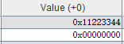

## 一、寄存器与内存

### 1.1 字节与字

关于对**字**（word）的理解，我又有了新的认识，word是一种操作单位，而且是最常见的操作单位（不是最小的），内存的地址是用一个字（32位二进制数）来表示的，一条指令的长度是一个字，寄存器的大小也是一个字，立即数的大小也是一个字，甚至对于那些不足一个字长度的数据，我们都需要给它**补齐**，然后再对它进行操作。所以字最大的特点就是它的**通用性**。

那么什么是**字节**（byte）呢？字节是**指令集**的**最小单位**。这个观点是花了很久才意识到的，因为我知道数据是按二级制表示的，那么如果把**位**（bit）作为最小单位，岂不是理所当然。但其实就是不是的，这可能是因为我们需要**更简洁更优雅**的指令抽象，所以就舍弃了对单独一个位的操作，就好像数字电路舍弃了**异步**和**连续**一样。注意，字节不但是操作的最小单位（可能不准确，我还没想到太明显的操作字节的指令），而且是指令集的最小单位，比如我们说**0x00000000**和**0x00000001**这两个地址差1，那么这个1就是“1个字节”，也就是这两个地址之间差了8个bit。而不是1个bit。再比如说，我们都说int是4字节，char是1字节，我们从来不说int是32位，char是8位，可见更高层次抽象的高级语言，就更不把位当回事请了。

然后我们还需要一些直观的认识，一个字节是8bit，也就是说，他的能表示256个不同的状态，如果写成一个十六进制数，那么他可以表示任何一个**两位**的十六进制数，也就是长成这个样子 **XX**。在MIPS中，一个word是由四个字节组成的，也就是说，我们去写一个十六进制数，它应该长成这个样子 **0x XX_XX_XX_XX** 。一个word的大小是跟一个int一样大的，同时，它跟MIPS中的立即数是一样大的，也就是说，一个word刚好能存一个数字（开数组的时候会用到）。但是可以存4个字符，这是因为字符只占一个字节。

因为字符是四分之一word，所以就造成数据存储的时候可能就会不规整了，就好像原本严丝合缝的砖之间突然了一堆碎石子，就没办法规整了。没有办法规整导致的后果就是我们极可能错误操作，所以一定要把字符串留到最后写（先写数组，这样就相当于先砌墙，后堆沙子），甚至需要多打几个空格。

### 1.2 大端与小端

所谓的**大端模式（Big-endian）**，是指数据的高字节，保存在内存的低地址中，而数据的低字节，保存在内存的高地址中。所谓的**小端模式（Little-endian）**，是指数据的高字节保存在内存的高地址中，而数据的低字节保存在内存的低地址中，这种存储模式将地址的高低和数据位权有效地结合起来，高地址部分权值高，低地址部分权值低，和我们的**逻辑方法一致**。

那么MIPS中是怎样的呢？首先我们需要明白MARS中地址的显示方法。我们运行下面的代码：

```assembly
.data
str: .ascii "12345678"
```

得到的结果是这样的


也就是说，MARS对地址的显示方式，在一个字内是逆序的，在字之间是顺序的，如下图

| 一   | 0x00000003 | 0x00000002 | 0x00000001 | 0x00000000 | 二   | 0x00000007 | 0x00000006 | 0x00000005 | 0x00000004 |
| ---- | ---------- | ---------- | ---------- | ---------- | ---- | ---------- | ---------- | ---------- | ---------- |

然后我们运行下面代码来检测MIPS的大小端问题

```assembly
.data
num: .space 4

.text
li $t1, 0x11223344
sw $t1, num
```

得到的结果如图



也就是说，高位的11，被存在了0x00000003，低位的44被存在了0x00000000。所以MIPS是小端存储。

小端存储对于数字来说是自然的，但是对于字符串，就是逆序的。比如储存 “love”，会得到如下结果：


### 1.3 寄存器为主

**寄存器为主**是一种MIPS指令集给我的直观感受。第一、有很多指令都是以寄存器为**对象**的，比如**lw**，就是将内存的内容加载到**寄存器**中，**sw**就是将**寄存器**中的数据存到内存中，**li**就是将立即数加载到**寄存器**中。第二、对寄存器的**操作最多**，我们可以复制一个寄存器中的值到另一个寄存器，可以给寄存器一个立即数，可以运算寄存器中的值，这些都是内存实现不了的。所以在设计的时候，不仅在速度上，寄存器更加占优势，而且在指令集完备性上，寄存器也远远优于内存。

---


## 二、汇编语言细节

### 2.1 寄存器的数字表示

在MIPS中，寄存器都是用5位二进制数表示的，刚好对应**32个通用寄存器**。还是十分合理的。

### 2.2 首地址

当我们进行load和store操作的时候，操作的都是一个数据段，但是这些语句的操作数都是一个**地址**，那么数据**段**和地址对应的**点**是怎样对应起来的呢？是这样的，以lw为例，他修改的以address到address+4的地址，也就是说，address是数据段的**首地址**。

在lh，lb指令中，加载的数据段是半个或者四分之一个word，那么就会涉及拓宽数据的问题，这些拓宽都是**符号拓展**。

### 2.3 变量的作用范围

汇编的所有变量都是**全局可见**的，从这个角度讲，无论这个变量是存在寄存器，还是内存，都是符合**全局变量**概念的。我在这里不想讨论高级语言的**全局变量**和**局部变量**在MIPS上与内存，栈之类结构的对应关系。我想要讨论的是我们在实现算法的时候，需要的变量的不同特点。我们既需要那种对全局可见的，很稳定的（比如图的顶点个数，数据的组数和大小）变量，算法意义上的 **“全局变量”**。又需要生命周期很短的，随叫随到的，不会对其他值造成影响的变量（比如迭代变量i），算法意义上的 **局部变量**。这些东西，现在感觉还是都放在寄存器中吧。太过于微妙的把握我还不太清楚。

对于“局部变量”，一定要注意每次使用前，初值对不对，就好像要每次使i的时候都要赋初值一样。

---


## 三、汇编流控制

### 3.1 总论

流控制有两个我认为比较重要的特点，一个是**标签**的使用，因为**汇编的流控制**本质上没有循环，分支判断、函数调用，所以**跳转**就是唯一控制流的方法，**跳转**最重要的参数就是地址，进而就是**标签**，我们把常见的高级语言翻译成汇编的时候，一定要注意需要**设置几个标签**，**标签设置的位置**。而不是局限于跳转的指令是哪一个。

另一个是对**高级语言的抽象**。有时候，其实用汇编直接写，要比翻译高级语言要好（在函数调用方面很明显），但是我们还是要翻译，这就是**抽象简洁性原则**。

### 3.2 if 结构

if结构只有一个需要打标签的地方，就是在if语句的结尾，这不难理解，因为跳转的目的是跳过if的内容，实现**满足条件则执行**

```assembly
.text
li $t0 1
li $t1 2

slt $t2, $t0, $t1
beqz $t2 if_end #如果t0 < t1，执行if语句 
nop
#if_statement
li $v0, 1
move $a0, $t0
syscall

if_end:
```

可以看到，只有一个标签，就是if_end，5-7行是if表达式的判断，9-11行是if执行的内容。

### 3.3 if-else 结构

if-else与if不同，它除了分支语句（b打头的指令），还需要跳转指令（j打头的指令），是因为执行完if的内容后，还需要跳过else的内容。下面是一个求绝对值并输出的程序。

```assembly
.text
li $t0 1
li $t1 2

slt $t2, $t0, $t1
beqz $t2 else  #如果t0 < t1，执行if语句 
nop

#if_statement
sub $t3, $t1, $t0
j if_end #这里比单纯的if多了一个跳转

#else_statement
else:
sub $t3, $t0, $t1

if_end:
li $v0, 1
move $a0, $t3
syscall
```

可以看到，一共需要两个标签。else标签用于分支到else语句，if_end标签用于在执行完if_statement以后，跳过else_statement，所以一共是两个标签，不可以忘记一个。

### 3.4 for 循环

关于for循环，还是有很多易错点的，让我们先看一个简单的for循环，用于计算1-10累加求和。

```assembly
.text
#i = 1
li $t0, 1
for_begin:
sle $t1, $t0, 10
beqz $t1, for_end
#for_statement
add $s0, $s0, $t0

#i++
addi $t0, $t0, 1
j for_begin

for_end:
li $v0, 1
move $a0, $s0
syscall
```

我们看到，这里用了for_begin、for_end两个标签，一个分支指令，一个跳转指令。需要注意的是，for_begin的位置要在给迭代变量赋初值之后，不然的话，就会每次都给i赋初值，无法走出循环。

当程序变得复杂的时候，比如计算1-10中偶数累加的时候：

```assembly
.text
li $t0, 1
for_begin:
sle $t1, $t0, 10
beqz $t1, for_end
#for_statement
andi $t2, $t0, 1 #偶数t2就是0，奇数t2就是1
bgtz $t2, if_end #这个bgtz可以用来跟beqz对比，是逻辑判断的对照
nop
#if_statement
add $s0, $s0, $t0

if_end:
#i++
addi $t0, $t0, 1
j for_begin

for_end:
li $v0, 1
move $a0, $s0
syscall
```

这里要思考的就是，if_end应该出现在哪里，是跟for_end重合吗？不是，而是要出现在i++之前。道理很简单，但是我经常记不住。

### 3.5 函数调用

#### 3.5.1 块思想

我们首先来一个简单的sum函数，并且用**最快捷**（不是最规范）的方法实现它。

C语言原型如下：

```c
int sum(int a, int b)
{
	int tmp = a + b;
	return tmp;
}

int main()
{
    int a = 2;
    int b = 3;
    int ans = sum(a, b);
    printf("%d", ans);
    return 0;
}
```

错误的汇编代码如下:

```assembly
.text
#main
li $s0, 2
li $s1, 3

jal sum

li $v0, 1
move $a0, $s2
syscall

sum:
add $s2, $s0, $s1 
jr $ra
```

因为代码是**顺序执行**的，所以如果把sum写在下面的话，在执行完main以后，还会自动执行sum，然后就陷入死循环了。

我们又两种解决办法，一个是把sum提到main之前，但是这种方法不本质，因为造成bug的原因是我们默认程序结束是在最后一行代码，这在编程中是不太方便的，不如我们自己调用命令使程序结束，这样才本质，修改如下：

```assembly
.macro end
li $v0, 10
syscall
.end_macro

.text
li $s0, 2
li $s1, 3
#函数调用过程
jal sum

li $v0, 1
move $a0, $s2
syscall

end

sum:
add $s2, $s0, $s1 
jr $ra
```

这样的18-20行，才是真正的函数体，我们规定了入口和出口，只有按照我们规定的方法才能进入和出去的**程序块**（不会因为顺序执行而进入）。

#### 3.5.2 复用思想

但是写好了**程序块**，是不是就意味着写好了函数的功能了呢？其实没有，因为我们没有办法实现**代码的复用**，比如C程序

```c
#include <stdio.h>

int sum(int a, int b)
{
	int tmp = a + b;
	return tmp;
}

int main()
{
    int a = 2;
    int b = 3;
    int c = 4;
    int d = 5;
    
    int ans1 = sum(a, b);
    printf("%d\n", ans1);
    int ans2 = sum(c, d);
    printf("%d\n", ans2);
    return 0;
}
```

按道理，这个是可以复用sum的代码的，这也是函数最大的功能，但是我们原来的那个函数操作的是s0，s1，s2，显然没有办法操作其他寄存器，所以为了复用代码，就必须引入**传参**的技术，也就是函数能用的数都是形参寄存器（a0-a3）传给他的。

有完整代码：

```assembly
.macro end
li $v0, 10
syscall
.end_macro

.macro printStr(%str)
la $a0, %str
li $v0, 4
syscall
.end_macro

.data
space: .asciiz " "

.text
li $s0, 2
li $s1, 3
li $s2, 4
li $s3, 5

move $a0, $s0 #传参
move $a1, $s1
jal sum
move $s4, $v0 #获得返回值

li $v0, 1
move $a0, $s4
syscall

printStr(space)

move $a0, $s2
move $a1, $s3
jal sum
move $s5, $v0

li $v0, 1
move $a0, $s5
syscall

end

sum:
#传参过程
move $t0, $a0
move $t1, $a1
#函数过程
add $v0 $t0, $t1
jr $ra
```

可以看到，这样就实现了代码的复用，另外，a0-a3只是我们规定的，用其他的寄存器或者内存存，都可以，当超过4个参数的时候，我们就用栈空间内存存，这是因为相比于普通内存，栈是有寿命的，我们希望形参是个有寿命的变量。

#### 3.5.1 恢复思想

那么这样是不是函数功能就完善了呢，我们说不是的，因为函数还有一个重要的功能是不对函数体外的变量造成不必要的影响，比如我们有这样一个C程序

```c
int sum(int a, int b)
{
	int tmp = a + b;
	return tmp;
}

int main()
{
	int a = 2;
	int b = 3;
	int c = 4;
	int sum1 = sum(a, b);
	int sum2 = sum(sum1, c);
	printf("%d", sum2);
	return 0;
}
```

这段代码如果翻译成汇编，有可能会造成错误，以下是错误代码

```assembly
.macro end
li $v0, 10
syscall
.end_macro

.text
li $s0, 2
li $s1, 3
li $t0, 4

move $a0, $s0 #传参
move $a1, $s1
jal sum
move $s4, $v0 #获得返回值

move $a0, $s4
move $a1, $t0
jal sum
move $s5, $v0

li $v0, 1
move $a0, $s5
syscall

end

sum:
#传参过程
move $t0, $a0 #t0被修改了
move $t1, $a1
#函数过程
add $v0 $t0, $t1
jr $ra

```

输出的答案是7，而不是9，这是因为我们储存c的寄存器是t0，而t0在sum函数中被修改了，所以就不行了。所以我们需要保证函数不会对外部造成影响，方法就是应用栈。

**栈的作用是保存和恢复函数使用的寄存器，函数应该计算返回值，但不应该产生其他的负面影响。**

那么其实有两种使用栈的位置，第一种是在调用函数前，这种被称为**调用者保存**（在这里就是在main里面出入栈）：

```assembly
.macro end
li $v0, 10
syscall
.end_macro

.text
li $s0, 2
li $s1, 3
li $t0, 4

move $a0, $s0 #传参
move $a1, $s1
sw $t0, 0($sp) #入栈
addi $sp, $sp, -4
jal sum
addi $sp, $sp, 4 #出栈
lw $t0, 0($sp) 
move $s4, $v0 #获得返回值

move $a0, $s4
move $a1, $t0
sw $t0, 0($sp) #入栈
addi $sp, $sp, -4
jal sum
addi $sp, $sp, 4 #出栈
lw $t0, 0($sp)
move $s5, $v0

li $v0, 1
move $a0, $s5
syscall

end

sum:
#传参过程
move $t0, $a0
move $t1, $a1
#函数过程
add $v0 $t0, $t1
jr $ra
```

另一种是**被调用者保存**（在sum里出入栈）

```assembly
.macro end
li $v0, 10
syscall
.end_macro

.text
li $s0, 2
li $s1, 3
li $t0, 4

move $a0, $s0 #传参
move $a1, $s1
jal sum
move $s4, $v0 #获得返回值

move $a0, $s4
move $a1, $t0
jal sum
move $s5, $v0

li $v0, 1
move $a0, $s5
syscall

end

sum:
#入栈过程
sw $t0, 0($sp)
addi $sp, $sp, -4
#传参过程
move $t0, $a0
move $t1, $a1
#函数过程
add $v0 $t0, $t1
#出栈过程
addi $sp, $sp, 4
lw $t0, 0($sp)
#return
jr $ra
```

关于这两种方法哪一个更好，其实是涉及对寄存器种类的划分的，是更加严谨的编程思想，有的时候是两种方法都需要用的，但是现在作为一个初学者，我觉得被调用者保存更好，因为这样的代码的复用率更高，而且只有在编写**被调用函数**体的时候，才能判断哪些寄存器需要保存和恢复，在写**调用者函数**的时候，是没办法判断哪些寄存器要保存和恢复。

### 3.6 嵌套函数调用

嵌套函数调用最重要的技术就是**用栈保存跳转地址**。我们来看一段C程序

```c
int sum(int a, int b)
{
	return a + b;
}
int cal(int a, int b)
{
	return a - sum(b, a);
}

int main()
{
	int a = 2;
	int b = 3;
	int ans = cal(2, 3);
	printf("%d", and);
}
```

我们按原来的理解将其翻译为汇编，会得到错误代码

```assembly
.macro end
li $v0, 10
syscall
.end_macro

.text
li $s0, 2
li $s1, 3

move $a0, $s0
move $a1, $s1
jal cal
move $s5, $v0

li $v0, 1
move $a0, $s5
syscall

end

sum:
#传参过程
move $t0, $a0
move $t1, $a1
#函数过程
add $v0 $t0, $t1
#return
jr $ra

cal:
#传参过程
move $t0, $a0
move $t1, $a1
#调用sum的过程
move $a0, $t1
move $a1, $t0
jal sum
move $t2, $v0
#运算a-sum(b, a)
sub $v0, $t0, $t2 
#return
jr $ra
```

这段代码会陷入死循环，是因为寄存器ra中存在的值，在调用完sum以后会变为指向第38行，然后第42行跳转的时候，就会跳到38行，然后到了42行又跳回38行，如此循环，所以我们发现，一旦一个函数不是**叶子函数**，就需要保存和恢复ra。所以有正确代码：

```assembly
.macro end
li $v0, 10
syscall
.end_macro

.text
li $s0, 2
li $s1, 3

move $a0, $s0
move $a1, $s1
jal cal
move $s5, $v0

li $v0, 1
move $a0, $s5
syscall

end

sum:
#将t0和t1入栈
sw $t0, 0($sp)
addi $sp, $sp, -4
sw $t1, 0($sp)
addi $sp, $sp, -4
#传参过程
move $t0, $a0
move $t1, $a1
#函数过程
add $v0 $t0, $t1
#将t0和t1出栈
addi $sp, $sp, 4
lw $t1, 0($sp) 
addi $sp, $sp, 4
lw $t0, 0($sp) 
#return
jr $ra

cal:
#将ra入栈
sw $ra, 0($sp)
addi $sp, $sp, -4
#传参过程
move $t0, $a0
move $t1, $a1
#调用sum的过程
move $a0, $t1
move $a1, $t0
jal sum
move $t2, $v0
#运算a-sum(b, a)
sub $v0, $t0, $t2
#将ra出栈
addi $sp, $sp, 4
lw $ra, 0($sp) 
#return
jr $ra
```

### 3.7递归函数调用

之前我用高级语言的时候，自己写栈将递归程序转换为非递归程序的时候，关于什么东西要存入栈，什么不要，我都是想哪些变量是**状态变量**，现在用汇编的角度看，其实只要把发生变化而且跟调用者有关的的寄存器都保存和恢复就好了，是很简单的。

当我们有了整个第三章前面的知识以后，就会发现递归函数是没有什么特别的，没有任何写法是递归函数独有的，只不过是一个**调用自己的嵌套函数**而已。

---


## 四、写在后面的话

学习这个汇编教程花费了我三整天的时间。与之形成对比的，就是我的同学们一般都是在一天或者一天半完成的，慢一点的用两整天。然后我就觉得肯定是我的学习出了问题，毕竟我与计院大部分同学的区别就是我笨。当然其实没对我造成啥影响，我学啥都是这么慢（早就习惯了），但是有的时候想到没准也有一个倒霉蛋，笨吧考得还好，来了计院，肯定会比我还纠结难受焦虑。所以我就花了些时间重新梳理了一下我的思路，尽量把文章写的能让像我一样的笨孩子能看懂，但愿有缘人不要焦虑。	

我个人感觉，学校推出的教程肯定是个天才写的，天才在写东西的时候就很容易跳步，毕竟他当时学的时候属于**先知先觉**，很多点自然而然就会了，更加随心所欲不逾矩，所以不太喜欢讲规范（规范对聪明人是枷锁，可是对我这种笨蛋是拐杖）。窃以为，教程有以下不足，总的来说，就是在讲解**函数**部分的时候有一个很大的**跨度**。当然，人拉不出屎不能怨茅房，我知道我这属于要饭的嫌饭馊。确实多有得罪，抱歉抱歉。

具体的体现有如下几点：

第一、一般的函数调用是在一个复杂的排序函数讲的，这样就不太适合我这种特别笨的学生，容易被排序算法迷惑，而忽略了函数调用的规范。尤其是处理成视频讲解，更是让我这种跟不上别人语速的学生十分焦灼。

第二、而完全没有涉及嵌套函数的讲解，这样就会让我这种特别笨的学生将**嵌套函数的特征**当成**递归函数的特征**，就容易头晕，不容易把握本质（可能也不是本质，总之就是让我挺迷糊的）。

第三、在递归事例中用的斐波那契数列中，有两个不规范的地方（只是相对于我来说），其中一个是关于work标签的命名，容易让人觉得是递归函数的独有特征，其实只是**非基准情况**，也就是说，应该属于if-else结构，那么按照教程的规范，标签应该改为**if_1_else**（不是我这篇的规范，按照我这篇，应该改为**else_1**）。另一个就是教程中使用的是**调用者保存**的方式，我现在感觉是不太对得起**代码复用率**的（当然我感觉可能不准哈，也没有大量写过程序），比较容易理解方式应该是**被调用者保存**，我看论坛里面大佬的帖子大部分都是**被调用者保存**，可能这个点对大佬来说不是啥难点吧，但是我确实是今天为了写文章，才把这两个概念区分清楚的，之前过challenge的时候，就套模板，好多都不知道为啥这么写。

当然，肯定还是要感谢写教程的小哥哥小姐姐，真的写的很棒了，我这属于是鸡蛋里挑骨头了。实在对不起。