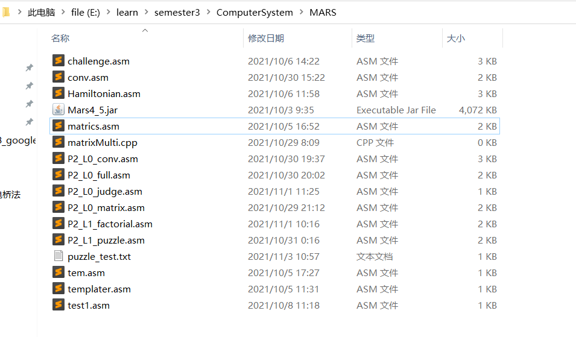
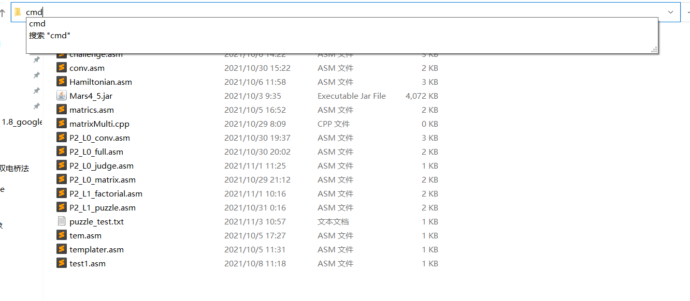
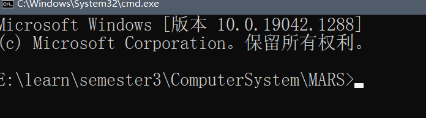
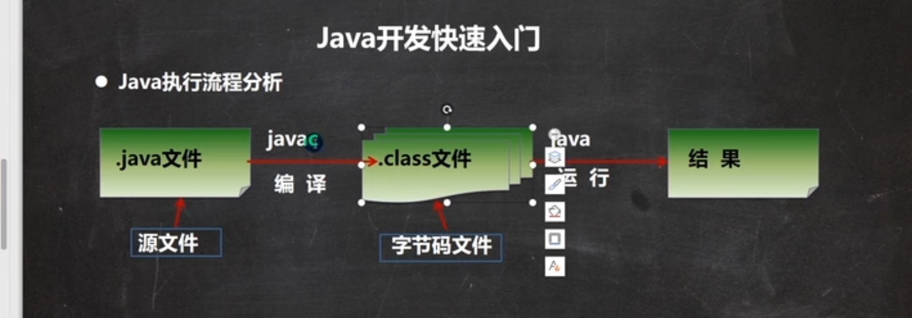
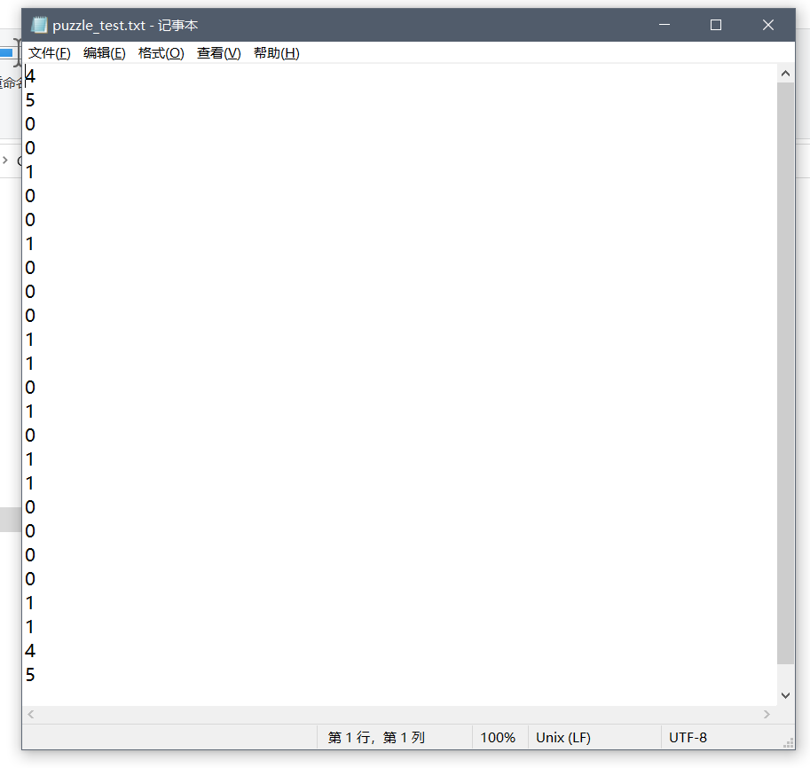
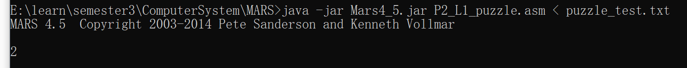
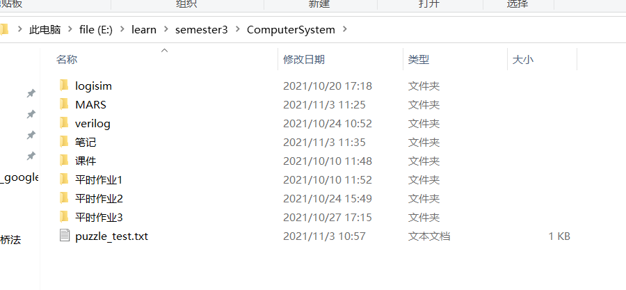
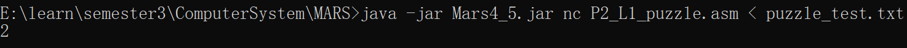
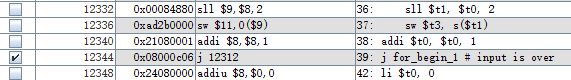

## 一、代码规范

### 1.1 常量

我个人规范是将所有的常量都用伪指令.eqv声明，其格式会在3.2中介绍。关键涉及一个问题，就是.eqv这样定义的是一个立即数，但是不是所有的指令都可以重载了立即数参数模式，所以更加规范的规范是每次使用被.eqv定义的常量之前，都加载立即数到一个寄存器（规定为$t7），然后使用这个寄存器，这就是常量的全部规范。

当然，还有几种方法，一种就是把常量直接保存在寄存器中，每次就是用这个寄存器就好了。但是有两点缺陷，一个是寄存器资源会被占用，以puzzle为例，我们需要一个寄存器存1，来做bool标记，需要一个寄存器存4，来用于控制dir的四个方向，那么就被占用了两个寄存器。另一个是容易bug，因为要时刻留心代码不修改规定寄存器。

还有一种是临到用的时候，在用li指令给某个寄存器一个值，但是这样也是容易造成寄存器混乱，还有一个缺陷是如果要修改常量的值，就会造成大量的修改工作。

还有一种是把常量存在内存中，然后给一个标签，通过lw进行访问，这个方法跟我的规范几乎一模一样，所以只是个人习惯问题。

### 1.2 寄存器的使用

寄存器跟C中的变量还是有区别的，最突出的矛盾，我个人认为就是变量声明是**无限**的，而寄存器的个数是**有限**的，所以在汇编中，就不能为每个变量都指定一个寄存器，所以一定会涉及**寄存器复用**，但是寄存器复用就会带来很多容易出错的问题，为了避免错误，最本质的是关注**变量的寿命**，有的变量，寿命很短，比如迭代变量i，j，k，出了for循环，就没用了。有的很长，比如各种计数问题中的ans，需要在整个程序中一直累加，所以要一直保持寿命。

对于寿命很短的变量，存储他们的寄存器就是复用寄存器的目标，因为他们寿命短，变量死去，寄存器就可以复用了。但是对于寿命很长的变量，最好给他指定一个寄存器，然后就不要动他了。那么什么样的变量寿命短呢？我觉得有两种？一个是迭代变量，另一个是数组访问相关变量，迭代变量出了循环就可以复用了，数组访问相关变量，当数组元素被从存储中取出来的时候，就没有了，所以用特定的寄存器存储他们，就可以达到复用率的提高，我的寄存器分配如下：

| \$t0 | \$t1 | \$t2 | \$t3 | \$t4 | \$t5 | \$t6 | \$t7 | \$t8     | \$t9       |
| ---- | ---- | ---- | ---- | ---- | ---- | ---- | ---- | -------- | ---------- |
| i    | j    | k    | 其他 | 其他 | 其他 | 其他 | 常量 | 数组元素 | 数组偏移量 |

尤其是\$t9和\$t8的应用，真的大大提高了寄存器的复用率。因为这个的寿命只有一条语句。所以怎么复用，都不会造成bug。

| \$s0      | \$s1      | \$s2 | \$s3 | \$s4 | \$s5 | \$s6  | \$​s7  |
| --------- | --------- | ---- | ---- | ---- | ---- | ----- | ----- |
| 输入参数1 | 输入参数2 | 其他 | 其他 | 其他 | 其他 | 输出2 | 输出1 |

另外多一句嘴，其实这种规范并不是MIPS设计者的原意，设计者希望 `$t `类寄存器都是寿命最短的变量（其实严格的讲，是在函数调用的时候不需要被调用者保存的变量）。

但是事实就是，现在的题目，没有那么多的寿命短的变量，而是有很多项迭代变量一样，有一个代码块的寿命，所以`\$s` 来做这种变量的寄存器，显然个数是不够的。所以在我的规范里，\$t的部分用作了长寿的变量寄存器。之所以MIPS设计者这样设计，是因为利用**栈空间**，每个代码块（比如 `main` 的 `\$S1` 和 DFS 的 `\$1` 可以存不同内容）都可以拥有自己的**全部通用寄存器**，而如果舍弃栈空间操作，那么就是整篇代码共用**全部寄存器**，所以寄存器资源会紧张。但是频繁的出入栈同样会容易造成 bug（因为不确定那个变量需要出入栈），所以我选择了牺牲一部分效率和自由度，换取简洁性的规范。

另外需要关注的寄存器还有 `$a` 系列，之前的时候，我很喜欢将传参时保存在 `\$a` 中的变量，移到 `\$t` 系列或者 `\$s` 系列中，但是其实大可不必，函数参数也是跟迭代变量一样，是一个很好控制的中寿命变量，所以直接使用就好了，等不会造成任何问题。

总结一下变量的寿命和寄存器：

| 变量类型 | 寿命         | 寄存器 |
| -------- | ------------ | ------ |
| 全局变量 | 整个程序     | $s     |
| 迭代变量 | 循环代码块   | $t     |
| 数组变量 | 不到一条语句 | $t     |
| 函数参数 | 函数代码块   | $a     |

### 1.3 注释习惯

注释不应该是仅仅用于debug，那样就好像不懂画画的人，认为橡皮的作用只是用来修改画错的线条一样（这句话口气大了，我的MIPS显然没有我画画好）。在画画中，橡皮是另一种形式的笔，同样起着创造而不仅是清除的功能。我们先来看一下注释的作用：

- 解释代码块功能

- 指示变量对应的寄存器

- 分割代码块

- 指示断点

我一开始写代码的时候，主要用的是第一点功能，但是其实现在想想，C的代码不过100行，翻译成汇编，也就一般不到300行，又是自己写的，还可以在编写的时候利用缩进和空行，哪里需要特地写注释来解释代码块功能呢？除非写了一份代码，非要过几天才提交，战线拉的巨长无比，才有这种需求，但是考试的时候，就那么几个小时时间，有什么记不住的呢？我写这种注释，无非是一种**自我满足**罢了，觉得自己把事情干的**有条理**了，其实不过是浪费时间罢了。

第二点是在编写的时候需要写的，这种注释可以减少**寄存器错误复用**的bug，因为变量与寄存器的关系都记录在注释中了，每次使用一个新的寄存器的时候，都先检查一下注释，看看有没有寄存器复用问题，就可以明显减少复用的bug。

第三、四点是在调试过程中用注释进行辅助的习惯。在调试页面，是只保留缩进的，但是空行会被删去，所以空行分割代码块的作用就没有了，所以单步的时候，很容易不知道自己进行到哪个代码块了，有一种方法是多写几个**没有跳转意义**的标签，然后用labels的窗口来看代码，但是我机缘巧合，没有用这种方法（现在想想，应该挺好使的，比注释美观，方便）。用注释也可以达到分割代码块的目的和指示断点的目的（断点应该在哪里设置，后面会讲）。

### 1.4 代码片段规范

#### 1.4.1 总论

之前的博文中介绍过代码的规范，到现在看来大部分还是适用的，但是还是随着实践的深入，有一些更深的理解，一并记录。

所谓深入的理解，我觉得最深的理解就是**忘相**，相是C语言的相，其实C不是最本质的东西，我们写代码，也没必要非得局限于c的控制流语句，而是应该更加灵活，既不局限于C，也不局限于MIPS，我们的算法，应该是用**分支，循环，递归**来描述的，而不是**if，else，case，for，while，return**来描述的，也不是用**beqz，label**啥的来描述的。

建立在这种观点上，后面的文章，其实不是对之前的规范的**补充**，而是对之前规范的**消解**，只有完全忘掉太极剑，才能学会使用太极剑。虽然这句话口气很大，但是这就是我想要表达的意思。一味的强调规范，就是**我执**的表现。

#### 1.4.2 分支判断规范

像这种代码块，是很好翻译成汇编的

```C
if(a > 0)
	ans = 1;
else
	ans = 2;
```

但是当分支条件变得复杂的时候，就没有这么简单了，比如

```c
if(a > 0 && b >0)
	ans = 1;
else 
	ans = 0;
```

这种其实还好，就是两个bltz连用，都跳转到else标签就好了:

```
# s0 = a, s1 = b, s2 = ans
blez $s0, else_1
blez $s1, else_1
li $s2, 1
j if_end_1
else_1:
move $s2, $zero
if_end_1:
```

但是对于或条件判断，就没那么容易了：

```c
if(a > 0 || b > 0)
	ans = 1;
else
	ans = 0;
```

这种就有点难了，尤其是原来的规范中，只有else-statement的标签，但是没有if-statement的标签，所以就很难搞。所以有两种解决办法，一个是添加if-statement标签，然后就按部就班的跳转就可以了，像这样

```
# s0 = a, s1 = b, s2 = ans
bgtz $s0, if_1
bgtz $s1, if_1
j else_1
if_1:
li $s2, 1
j if_end_1
else_1
move $s2, $zero
if_end_1:
```

还有一种方法是利用set类指令，来获得一种更C风格的条件判断，讨论区也有人实践过。这里不列出来的原因是因为我懒（还有我执的原因）。

所以其实如果放松对labe的限制，随心所欲，才可以更好的使用分支判断语句。

#### 1.4.3 循环判断

其实也是同样的道理，for和while只是虚妄之相而已，所以还是用loop做标签比较好，至于怎么控制，其实我们看一下基本的流控制

```
loop_begin:

# loop_statement

j loop_end

# loop_statement

j loop_begin
loop_end:
```

其实模型很简单，就是在loop的尾部，重新跳回loop的头部，然后就可以构造出一个循化，但是为了使循环不变成一个死循环，所以需要在loop内部设置一个跳出条件，用来跳出循环。

所以什么while，就是把跳出循环设置在loop头部的loop，dowhile，就是把跳出循化设置在loop尾部的loop，for，就是显式声明了一个迭代变量的跳出判断设置在loop头部的loop，这就是破相的过程。所以等到具体应用的时候，其实怎样设置标签都可以，而不用局限于某种loop。

#### 1.4.4 函数规范

这里强调的是到底哪些变量需要入栈，我之前给出的规范是**好好思考**，但是经历了多次的编程实践，我个人觉得，还是简单粗暴的把所有调用和被调用的函数中相关的寄存器都入栈吧，虽然粗暴，但是有效。因此，频繁的出入栈，用宏可以进行编程上的简化，有宏：

```
.macro push(%src)
	sw %src, ($sp)
	subi $sp, $sp, 4
.end_macro

.macro pop(%des)
	addi $sp, $sp, 4
	lw %des, ($sp)
.end_macro
```

---


## 二、使用规范

### 2.1 快捷键

- F1：打开help
- F3：汇编
- F5：go
- F7：单步调试
- F8：单步后退
- F9：暂停
- F11：停止
- F12：复位
- Ctrl + K：清空所有断点
- Ctrl + T：在不清空的条件下，使断点生效或者失效
- Ctrl + F：查找（**可以用于检查寄存器是否使用错误**）

### 2.2 调试

#### 2.2.1 命令行

这里用我微薄的知识给大家介绍一下命令行和java（两个我的噩梦，求大家嘲笑我的时候不要笑的露出超过八颗牙齿）后面的话我完全不负责，因为我也不会，我就是瞎说的。

所谓命令行，可能就是比用鼠标点更高级一点运行程序或者管理系统的一种工具吧，通过键入指令，来实现我们的目的。

这里面涉及java，是因为这个MARS是用java编写的，但是java跟c不同的是，他是运行在java虚拟机上的，是不像C那样会生成一个exe的执行文件的（所以MARS没法简单固定到开始屏幕），java编译以后会生成.class文件，然后每次运行程序，都需要把这些.class文件用java这个命令处理一下才可以。然后我们把一大堆.class文件和其他资源会统一放到一个文件夹里面，这样比较好管理，这个文件夹的后缀式.jar。

我们用P2的迷宫题目举例子。然后我们来看一下基本的用命令行解决输入问题的指令

```cmd
E:\learn\semester3\ComputerSystem\MARS>java -jar Mars4_5.jar P2_L1_puzzle.asm < puzzle_test.txt
```

首先介绍打开命令行的方式，这是我的文件夹



然后需要**在这个文件夹内**打开控制台，方法就是点击上面的路径，然后将其改为cmd，然后按回车键。这样



这样就可以打开控制台了，像这样：



然后就只需要输入这个命令就好了，就是这个（严格说，你还需要把程序写好，然后在准备好测试文件才行）

```
java -jar Mars4_5.jar P2_L1_puzzle.asm < puzzle_test.txt
```

然后解释一下这是啥意思：

java就是最基础的命令，在java中，有这个图



jar里面就有好多class文件，所以需要使用java让他执行。

但是jar不是传统的.class文件，所以需要告诉java，让他知道他执行的是个jar文件夹，所以后面的 -jar 就是用来告诉他他处理的是jar，然后后面的Mars4_5.jar是需要处理的jar文件，我们这里就是这个MARS，但是在help里面，他用的是Mars.jar这是因为他给改名了，然后P2_L1_puzzle.asm就是需要运行的MIPS程序，然后puzzle_test.txt就是测试样例所在的文件，需要提前写好，我的就是这样的：



然后就会输出结果，像这样：



可以看到输出了答案2。

这里需要介绍一下路径的概念，比如有的人，他的.txt文件没有跟.asm文件放在一起，那么怎么办，比如我把.txt文件放在这里



那么就需要改成这样的指令

```cmd
java -jar Mars4_5.jar P2_L1_puzzle.asm < E:\learn\semester3\ComputerSystem\puzzle_test.txt
```

这样就可以了，这个叫绝对路径法，还有一个相对路径法，大家自己查吧（因为不适应考试，所以就不介绍了）

然后输出结果也可以不显示在控制台里，而是输出到一个文件里，语法就是这样的

```cmd
java -jar Mars4_5.jar P2_L1_puzzle.asm < puzzle_test.txt > out.txt
```

out就是输出文件。

然后再介绍一下MARS的相关指令，这个可以在help中查到，以一个为例，nc就是不显示版权信息，如果我们加入这个参数，那么就有这种效果：

```
java -jar Mars4_5.jar nc P2_L1_puzzle.asm < puzzle_test.txt
```



与上面对比，发现版权信息没了。

#### 2.2.2 文件操作

#### 2.2.3 普通调试流程

让调试丝滑的办法首先就是**多使用快捷键**，先按F3进行汇编，然后再按F5运行，运行结束以后需要按F12进行复位，然后才能进行再一次的F5运行，当意识到需要逐步调试的时候，可以按F7单步前进和F8单步后退进行调试。

关于广义上的**单步调试**，分为真正按F7的单步调试和结合断点的F5调试。对于前一种，很好理解，很好操作，是MARS调试能达到的最小单位，就不在此介绍了。对于结合断点的F5调试，具体解释，原本按一次F5就可以执行完的程序，可以通过设置n个断点，按n + 1次F5执行完毕，这种调试方法的优势在于极大的提高了狭义单步调试按来按去F7的低效性。

我们以puzzle那道题目举例子，如果是单步调试，前面有一个复杂的数组录入，我的指令大概每个数组元素录入都需要7步，也就是需要按7次F7，要是样例，那么就要按175次无意义操作，只有第一次检查一下数组录入功能正不正常就好了，没必要进行后面的操作，当然可以按F5一下到底，但是递归的过程就没法看到了。我最开始的时候是调节run的速度，然后眼疾手快按F11到递归函数那里暂停，但是因为代码可读性太差，所以经常暂停完就还需要F7和F8的微调，就很不丝滑。

但是只要在所有数据都输入完以后，设置一个断点，就可以按一次F5，仅仅完成数据输入过程，然后对照Memory和寄存器列表检查就好了，设置断点的方法如下



勾上右边那个点就好了，勾上以后按F5，就可以运行到输入截止时停止，此时在I/O口连续输入“5 a b b b c”，就可以直接在Memory监视窗口看到成果（此题是judge那道题），如下：


要是想改数制，可以在下面的底栏中勾选，我个人喜欢十进制的地址。

将这个概念应用到更多的方面，其实程序需要看的只有那么几个关键点，所以**多**设置断点，构建一种颗粒更大的“单步调试”，可以提高调试的效率，这就好像“调试中的函数”一样。

