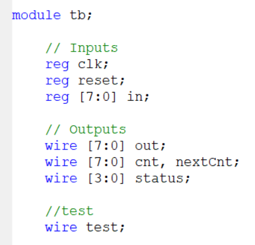
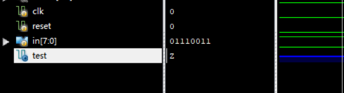
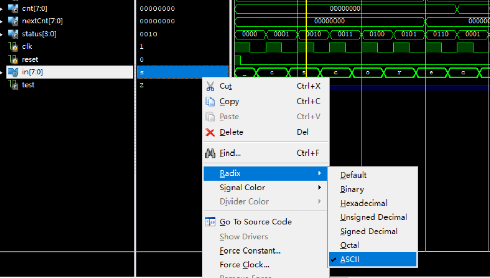
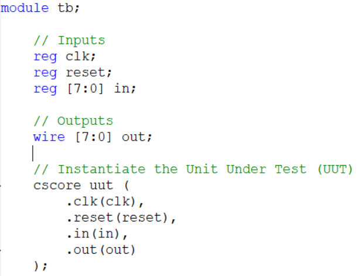
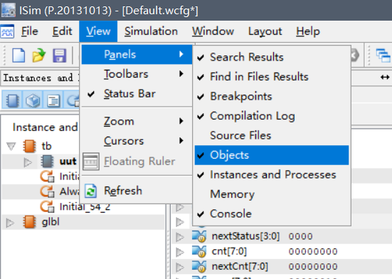
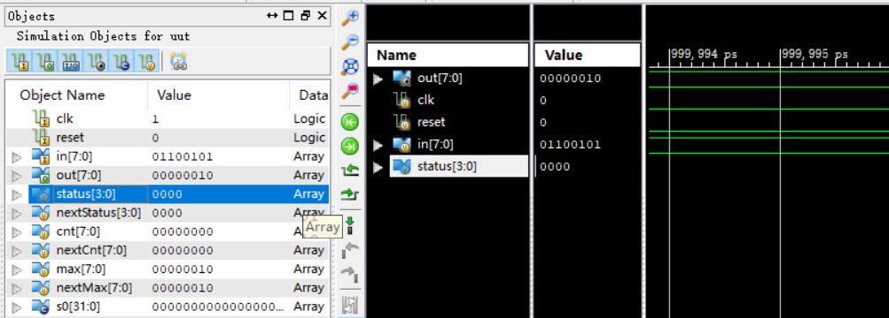
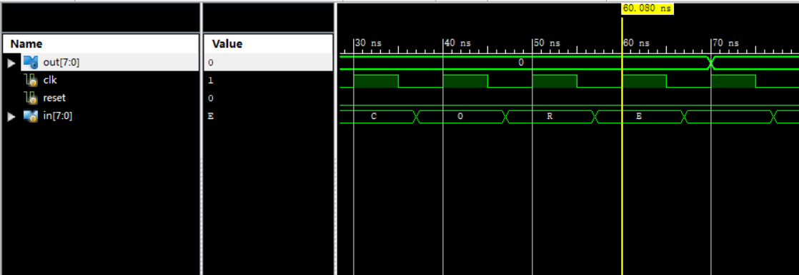
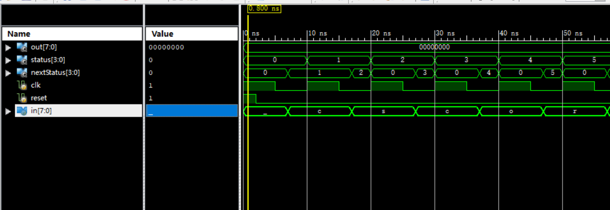

## 一、写在前面的话

首先，这道题目我**并没有过**，一共是应该六个左右的测试点，我最好的一次提交是还剩下**2个测试点没有过**，但是那次提交已经是属于脱离了规范，纯粹为了测试而写的，**不是规范风格的代码**。我在签退以后，虽然在群里面同学的帮助下（结尾有**鸣谢**名单），意识到自己代码存在的问题，但是新写好的代码也是**没有经过评测机检验**的。所以尽管我很想对大家负责，但是确实是客观条件不允许，我的代码要是运行出来bug了，请大家不要打我。

所以这篇文章，大家就看个乐呵就行了，要是真从其中咂吧出啥滋味来，那是**诸位的功德**，要是没有，也只是**我的水平太低**，与诸位无关。

**我在文章里面只贴了一个tb模块的原码，主要是为了让大家看的明白一些，没有cscore的原码，跪求助教大大不要删帖。谢谢助教大大。**

---


## 二、测试模块的写法

### 2.1 总论

这个东西也是我最近才接触，也没有做过大型电路的调试，所以可能现在很多方法和规范，到了大型电路的时候，或者现在，就很显得不那么**优雅**，所以也欢迎同学在评论区，介绍自己喜欢的调试方法，我会选择优雅的方法补充到我的文章中，并在鸣谢名单中加上名字的。

### 2.2 ISim特性介绍

第一、如果想要让一个变量输出在ISim的**观测变量栏**中，只需要把它在tb模块中按照声明变量的方式声明就可以了。比如这样。



尽管test和这道题目没啥关系，但是在模拟的时候，我们依然能看见他。因为没有与电路建立任何关系，所以它的值是高阻态。



换句话说，**所有在tb模块中声明的变量，都会被视为待观测变量**。

第二、对于观测量，是可以调整输出形式的，默认形式是**二进制**，但是这道题的in是串行字符串，所以修改为ASCII格式方便调试。



第三、对于一位二进制，波形图是那种**阶梯图**，但是对于**多位数**，波形图就是**条带图**，就是说光看波形图，不看文字的话，是不知道它的值多少了，只能判断它在某个节点是否发生变化。以上图为例，clk就是阶梯图，但是status就是条带图。

第四、ISim只能同时运行唯一一个窗口，如果两次打开，会报错，所以要把第一个先关掉，再打开第二个。有的时候还是不行，显示 “previous” 的报错信息，这时只需在tb模块任意空白处加一个空格，再次运行即可。

### 2.3 与被测模块建立联系

ISE主动提供这种服务，如果是先写电路模块，然后在生成测试模块，ISE会自动为用户写好这种联系的代码，大概就是这样。



这段代码的意思是，ISE声明了跟你编写的待测试模块同名的变量（输入是**寄存器类型**，输出是**线型**），注意这里的**重名易造成混淆**。最后这段代码是说，把在tb模块上声明的变量连接到我们的待测试端口，这样才有意义（不然就会像之前的那个test变量一样，是高阻态）。

有的时候，我们需要知道模块的中间变量是怎样变化的，经两位助教哥哥的指正，我又学习了更加快捷的方法，只需要如下操作：

首先，需要现在ISim界面勾选Instance and Processes和Obejects两个选项。



然后电机Instance and Process中的tb -> uut （不用点开）。这时在Object中就会显示里面的变量，有I（input），O（output），V（variable），C（constant）四种类型。我们选择variable类型的中间变量，将其拖拽或者Ctrl+W就可以加到右面栏里了。像这样：



这时，有可能你的跟我一样，是会不显示的，所以就需要按这几个按钮：


先按1.00us向左数第三个，再按1.00us向左数第一个。就可以显示了。（这个感觉很神奇，可能是个坑，要是有空一定更新。）

### 2.4 生成测试时序规范

我个人是习惯三个模块，第一个模块负责赋初值，然后完成复位操作（岔一句，因为**initial是没办法综合**，所以为了让写好的模块有初始值，必须要求模块有写复位操作，这样才可以借助tb来完成模块的赋初值操作），代码如下：

```verilog
initial begin
    clk = 1;
    reset = 1;
    in = 0;
    #2
    reset = 0;
end
```

这个模块完成了tb模块的赋初值和复位操作（就是被测试模块的赋初值）。一会一起解释**延时的数值确定**问题。

第二个模块用于产生时钟周期，代码如下：

```verilog
always #5 clk = ~clk;
```

这是一个以10为周期的是时钟。

第三个模块用于生成测试数据，同样间隔也是10。

```verilog
initial begin
    #7
    in = "C";
    #10 in = "S";
    #10 in = "C";
    #10 in = "O";
    #10 in = "R";
    #10 in = "E";
    #10 in = " ";
    #10 in = "c";
    #10 in = "s";
    #10 in = "c";
    #10 in = "s";
    #10 in = "c";
    #10 in = "o";
    #10 in = "r";
    #10 in = "e";
    #10 in = " ";
    #10 in = "c";
    #10 in = "s";
    #10 in = "c";
    #10 in = "o";
    #10 in = "r";
    #10 in = "e";
    #10 in = "A";
    #10 in = "c";
    #10 in = "s";
    #10 in = "c";
    #10 in = "o";
    #10 in = "r";
    #10 in = "e";
end
```

最后解释一下时间问题，第一点就是in的变化周期应当与时钟周期相同，这点是寄存器的要求，只要变化周期小于时钟周期，就会有数据没有被录入（很好理解）。第二点是复位信号，复位信号最好除了复位，不进行任何干扰，所以尽量让他在半个时钟周期内结束，所以延迟时间是1,2,3,4都是可以的。第三点是in的边沿必须与时钟边沿不同，这是为了减少无谓的竞争，与时钟边沿相同的变化会造成很多的不方便（后面会有一个例子）所以第一个时钟延时是7而不是10，是为了避免**边沿重复**。

下面放一个完整tb代码，这个代码应该可以辅助调试，我列举了多种情况，要是过了，**应该**（不负责）评测机也能过。（**我知道讨论区不能放原码，但是这个只是tb的原码，求求助教大大手下留情，不要删帖，后面不会有cscore的完整代码，只会有代码片段**）。

```verilog
module tb;
	// Inputs
	reg clk;
	reg reset;
	reg [7:0] in;

	// Outputs
	wire [7:0] out;
	
	// Instantiate the Unit Under Test (UUT)
	cscore uut (
		.clk(clk), 
		.reset(reset), 
		.in(in), 
		.out(out)
	);

	initial begin
		clk = 1;
		reset = 1;
		in = 0;
		#2
		reset = 0;
	end
	
	always #5 clk = ~clk;
	
	initial begin
		#7
		in = "C";
		#10 in = "S";
		#10 in = "C";
		#10 in = "O";
		#10 in = "R";
		#10 in = "E";
		#10 in = " ";
		#10 in = "c";
		#10 in = "s";
		#10 in = "c";
		#10 in = "s";
		#10 in = "c";
		#10 in = "o";
		#10 in = "r";
		#10 in = "e";
		#10 in = " ";
		#10 in = "c";
		#10 in = "s";
		#10 in = "c";
		#10 in = "o";
		#10 in = "r";
		#10 in = "e";
		#10 in = "A";
		#10 in = "c";
		#10 in = "s";
		#10 in = "c";
		#10 in = "o";
		#10 in = "r";
		#10 in = "e";
	end
endmodule
```

---


## 三、cscore模块相关

### 3.1 题目思路

主要就是cscore中如果状态机进入到了**读取完第二个c的状态**时，如果再读s的时候，需要回到的状态是**读取完s的状态**，而不是不需要考虑，同时还有一个关键点就是，发生这个事情以后，还需要把**当前计数器**（我的代码里是cnt和nextCnt）清零，因为这个算读到异常字符了，需要重新计数，我就是只考虑了第一点，没考虑第二点，等发现的时候，已经来不及了。

此外，需要强调的是，这篇题解的思路是按照一种**工业开发自动机**（好中二的名字）的规范写的，这个风格我会在下面介绍，这种风格在**教材**中也有介绍，所以可能与诸位的方法有所差异，我本人也是上机前才接触，所以用的不是很熟练，导致最后改代码没有改完，其中也是有很多细节需要重新熟悉，我会在下面介绍。

### 3.2 自动机的个数与状态数

现在我们大多的思考方式，还是搭建一个自动机，来表示所有我们需要的状态，但是其实，有的时候会有过于复杂的情况，导致一个自动机不够的情况，但是我们并没有意识到我们不自觉地使用了多个自动机。

以教程中的cpu指令序列检测题为例，我的代码第一次就是大概**60几个状态**，里面有一个状态对应的是**读入了第一个十进制数**，当然还有**读入了第二个十进制数**这个状态等一系列。这样做的好处就是我不再需要**十进制计数器**和**十六进制计数器**了。我们可以说，这样才是纯的**单一状态机**的应用。

但是我们看csdn的代码，会发现他应用了两个寄存器，就把状态减少到了14个，其实这就是**多状态机**的应用，寄存器可以看做一个简单的状态机，以status和char作为输入，保存并输出一个数，应用多状态机，可以有效减少状态的量。

如果是双状态机系统，状态机A表示的状态共n个，状态机B表示的状态共m个。那么系统总共可以表示的状态就有mn个，是很方便的方法。

在我**自己习惯**的代码规范中（前面这几个字说明了这个规范的不靠谱性质），**所有的寄存器都是状态机，所有的状态机都可以用自动机规范（下一章介绍）写法来书写**，所以大家看个乐呵就好了。

### 3.3 自动机规范

首先，这种规范把所有的自动机都完全的拆成了三个部分，**状态转移部分**（属于组合电路）、**状态记忆部分**（属于时序电路）、**输出部分**（属于组合电路）。这三个模块用三个always块来实现，下面的例子是我的**当前计数器自动状态机**，风格如下：

```verilog
always @(*) begin
	if(status == s0)
		nextCnt = 0;
	else if(status == s3 && nextStatus == s2)
		nextCnt = 0;
	else if(status == s6)
		nextCnt = cnt + 1;
	else 
		nextCnt = cnt;
end
```

第一个描述了**状态转移电路**，可以看到，赋值的对象是nextCnt，输入是cnt和status（闭环），是一个类似于组合电路的输出。有两种清零情况，一种是初始状态，一个是从csc返回cs的状态，只有在s6下会加1，不然就保存原值。

```verilog
always @(posedge clk, posedge reset) begin//同步复位写法：always @(posedge clk) begin
	if(reset)
		cnt <= 0;
	else
		cnt <= nextCnt;
end
```

第二个描述了**状态记忆部分**，实现了两个功能，一个是**异步复位**，同步复位只需要改第一行。另一个是**状态更新**，因为是**时序逻辑**，所以是非阻塞赋值。

```verilog
assign tmp1 = cnt;
```

第三个也可以用always-comb实现，但是因为cnt不需要输出，所以就用这个简单代替一下，领会精神。（其实最完整的是放status状态机，但是怕被制裁）。

### 3.4 本题的状态机

我最优雅的一篇代码是用了**3个**状态机，分别是status状态机（用于分析字符串），cnt状态机（用于记录当前数目），max状态机（用于记录最大数目）。

---


## 四、一些细节

### 4.1 输出延后一个时钟周期

最后我的输出语句是：

```verilog
assign out = nextMax;
```

这个看着很奇怪，因为在我的逻辑里，他本来应该是：

```verilog
assign out = max;
```

但是写成第二个以后，会导致输出延后一个时钟周期，像这样：



本来应该在黄线处out发生变化，但是到了黄线以后的一个周期，才发生变化，输出整整拖延了一个周期。

这是为什么呢？我将其称为**非阻塞赋值左式的计算比所有语句都慢**，当然更严谨的是用层次化队列的方式解释，这里提供一篇博客，写的十分详尽：

[Verilog之非阻塞赋值（三）—— 赋值延后一个周期_隔壁old余的博客-CSDN博客](https://blog.csdn.net/huigeyu/article/details/100105428?utm_medium=distribute.pc_relevant.none-task-blog-2~default~CTRLIST~default-1.no_search_link&depth_1-utm_source=distribute.pc_relevant.none-task-blog-2~default~CTRLIST~default-1.no_search_link)

里面有如下解释：

> ​	如果条件判断式中含有非阻塞赋值的reg变量（无论是本模块的还是其他外部模块的），那么在该条件分支下的非阻塞赋值语句会延后一个周期完成（相对条件判断式中的变量的赋值完成，延后一个周期赋值）

在cnt的赋值中，需要nextCnt，nextCnt的值需要非阻塞变量status的判断，所以间接地，非阻塞变量cnt的赋值需要非阻塞变量status的判断，所以cnt就晚了一个周期，相似地，max也因此晚了一个周期。

但是不是啥大事情，因为哪怕是多个状态机串联，最后也是晚一个周期。对于只有一个状态机的情况，我们就输出状态机本身就可以了，输出nextStatus不太好（4.2有写），对于多状态机，只要用next就好了，就可以把输出归为正常。

### 4.2 拆分问题

正如前所言，**工业开发自动机**把状态机拆成了，**状态转移部分**（属于组合电路）、**状态记忆部分**（属于时序电路），所以状态转移部分可能变化会很快（会让人摸不着头脑，比如下面这种情况）。



nextStatus被在一个周期中总是在时钟上升沿跳到0去一段时间，虽然不影响功能吧，但是看着很奇怪。经过**seeeagull**的谆谆教诲，我明白，因为status在上升沿发生改变，而此时in并没有改变，因为nextStatus是组合逻辑的输出，所以会立即改变为s0（一般都是，本质是跳入else了）。

但是正如4.1所述因为是组合逻辑且是连续赋值，所以并不会因为这里的异常造成真正的bug。是**完全安全**的写法。

---


## 五、写在后面的话

我能写出这篇文章，多亏了好友的多多支援，下面进行鸣谢（按真实姓名字典序）：

- 奶凶，解决灵感枯竭问题

- 常浩轩助教哥哥，解决修改帖子问题和ISim中间变量查看

- 郭鸿宇，提出了cscs计数器归零

- seeeagull，解决了拆分问题

- 叶颜函，解释了郭鸿宇的话

- 叶焯仁助教哥哥，解决ISim中间变量查看和波形显示问题

- 不知道叫啥名字，坐我对面眼睛狭长的小姐姐，解决我肝不动的问题

  给大家安利一下我的博客，请大家帮忙看一看，提一提热度，白嫖也没关系。多谢。（毕竟要是没有这个点的话，答辩就只能说我身体很好，立定跳跳两米七，一千米三分十几了）

  [(1条消息) living_frontier的博客_CSDN博客-领域博主](https://blog.csdn.net/living_frontier?spm=1011.2124.3001.5343)

