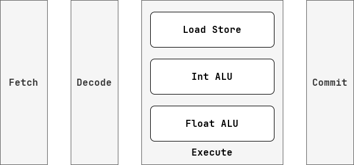
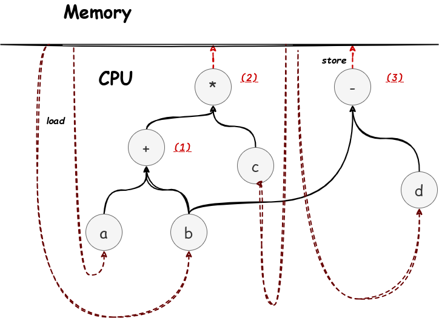

## 一、总论

乱序指的是指令并不按照顺序执行，所以这个概念比较接近软件编程中的“异步”概念（强调对于顺序时序的破坏）。而我之前似乎一直把它和“并行”挂钩（强调对于共享资源的争用）。这种认识倒也不算是错误，目前学了一圈下来，感觉其实和两个概念都有关系。

在顺序模型下，指令是一条条阻塞执行的，必须前一条指令执行完，才能执行后一条指令。那么如果前一条指令非常花时间，那么后一条指令就只能阻塞等待。这个问题是用流水线解决不了的。流水线中的指令也需要顺序执行。而乱序执行就打破了这种顺序执行的阻塞性，使得前序和后序指令可以并行执行。

---


## 二、冒险（hazard）

我们希望 CPU 按照理想情况运行，那么什么是理想情况？对于单个处理器核心，当：
$$
指令执行速度 = 时钟频率 \times 流水线深度 \times 数据通路条目
$$
时就是理想情况了。而在现实生活中，常常因为多种现实因素使得指令的执行速度减慢，这些现实因素被称为“冲突（hazard）”。具体有 3  种：

- 结构冲突（structure）：指的是对于功能单元的竞争情况，比如两个指令都需要 ALU，而只有一个 ALU，那么这两条指令就只能串行。
- 分支冲突（branch）：指的是因为分支而导致的指令流中断，比如突然发现正在执行的指令属于不会被执行的分支，那么这些指令都需要撤销。
- 数据冲突（data）：指令需要的数据还没有被前一条指令计算出来，那么就会导致阻塞。

CPU 种有很多功能单元（也可以看作计算资源），我们希望让他们都运转起来，不要闲置或者做无用功。但是每条指令并不会“同时”使用这些资源，比如对于一条指令的执行，只要取出指令后，就不需要再从 I-Cache 中读值了，当这条指令让 ALU 进行运算的时候，Fetch，Decode，Write Back 这些单元是闲置的。所以我们发明了流水线技术，将功能单元划分到不同的流水级，每个流水级都运行一条指令，这样就可以并行利用不同的资源。但是这样还不够，因为可能一个阶段里还有很多个功能单元，比如说 Execute Stage 里就有整数计算单元，浮点数计算单元，访存单元等，这些单元想要满载运转，就不能再采用流水线技术了，因为这些资源并不是每条指令都会用到，如果我们将 Execute Stage 拆分成 Calculate Stage 和 Memory Stage ，那么 Memory Stage 的资源就会在执行计算指令时被闲置，而 Calculate Stage 的资源则会在执行访存指令时被闲置，所以我们可以采用乱序的方式，让一个流水级中包含多条指令，比如 Execute Stage 就可以同时包含一条计算指令和一条访存指令，这样资源就可以得到更充分的利用。

总得来说，我们可以利用流水线技术和乱序技术对 CPU 内的资源进行不同维度的并行操作：



从这个角度看，流水线深度并不是越深越好，因为被时序分割的资源，并不会在每条指令上得到充分利用，反而是乱序的方式，更能充分利用资源。

总得来说，我们对于明显有依赖关系的资源，会采用流水线的方式来并行，比如说取指单元和译码单元的流水线处理；而对于没有依赖关系的资源，我们会采用乱序的方式并行，比如访存单元和计算单元的乱序。更进一步辩证地看，在同一级流水线中，一定存在没有依赖关系的资源，那么就是可以乱序的；在

----


## 三、算法

我觉得我自己之所以谈到更加高级的 CPU 特性，比如说乱序、分支预测谈虎色变，是因为我在心里认为在硬件上是没有办法实现过于复杂的算法的。但是这种观点是很不精确的，硬件和算法的复杂程度没有必然联系，不过确实在硬件上实现的算法会有一些硬件特征。

首先是在 CPU 中是没有内存的，所以也就没有地址。这里很容易产生一个误导，就是同样没有指针。这是不对的，算法需要的并不是一个具体的指针，它只需要一个“指向某个数据的变量”即可，所以没有指针，也可以用整型索引代替。这有点像算法竞赛在实现链表，树之类的数据结构的时候，都不会使用指针，而是提前开一个大数组，然后用索引来指向其中的元素的思想。

然后是在 CPU 中没有像高级语言的“无限”概念的，任何资源都是有数量限制的。不仅是资源的数量有限制，资源的规模也有限制，比如说一个整数寄存器，就是 32 位，如果希望表达一个更大的数，那么就没有办法了。不过这种限制其实很好解决，只需要阻塞 CPU 直到相关资源富裕就可以了，常见的问题有空闲物理寄存器数目不够，指令编号溢出，队列溢出等。

还有一种解决资源有限的方法，是将资源的状态都保存到内存中，不过这种方法在微体系结构中用得不多（时间开销太大），但是在编译器开发中很常见。

最后是 CPU 上的算法的局部性很强，而且是只有一遍的，我们只能看到 CPU 上运行的这几条指令，或者还有一些 buffer 指令，而且只能看见一次。这就导致很多全局算法我们是没有办法直观实现的，但是我们可以采用一种像“流”或者是“滑动窗口”的思想去从局部推断全局。

总得来说，CPU 的性质使得它在描述算法或者数据结构的时候，会呈现一种朴素的，有限的、狭隘的特征，但是基本上没有算法是用 CPU 无法表示的（复杂的森林和图都是可以的），所以当我们去看 CPU 上的特征时，应当从它笨拙的表达中，看出其背后的精妙算法。

---


## 四、假冒险

这里讨论的真假冒险都是数据冒险的一种，其实就是对于数据依赖关系的讨论。出现数据冒险问题，是优于前序指令（一个装逼的说法，就是在汇编中位置靠前的指令）晚于后序指令提交造成。

所谓的真冒险，就是“写后读”（Read After Write，RAW），吐槽一句，可以发现在中文这个词是先写后读，而在英文中变成了下先 R 后 W，刚好是反过来的，后面我只用英文。至于为什么它是真冒险，是因为只有前序指令写入了这个数据，后序指令才能读入新的值。

```asm
write r0
read r0 # commit first, error
```

与之相对的，有 WAR 和 WAW 两种假冒险。对于 WAR 而言，先序指令读，后序指令写，我们担心的是，后序指令先提交的情况，但是如果后序指令没有提交到原本的寄存器中呢，那么就不存在问题了，换句话说，如果有无限个寄存器（类似于无限个变量），那么谁还为了省一些寄存器，而去覆盖一个可能还会被读的寄存器。

```asm
read r0
write r0 # commit first, error

### good ###

read r0
write r1 # commit first, correct
```

至于如何让寄存器变成无限个，那其实就又很多种办法了，大不了阻塞 CPU 嘛。当然在实际应用中，我们会通过重命名的手段，在内存中维护一个从逻辑寄存器到实际寄存器的映射关系，来使得不会发生依赖现象，这就是寄存器重命名。

而寄存器重命名算法，在原理上和编译器的寄存器分配算法的需求是一样的，唯一的区别在于编译器的逻辑寄存器不够了，那么就会往栈上存，而 CPU 的物理寄存器不够了，就会阻塞 CPU。当然了，像图着色或者线性扫描这种方法是没法用到 CPU 上，CPU 一般就是维护一个空闲寄存器队列就够了。

---


## 五、计分板

> 从任何意义上说，寄存器就是内存的一个过客。

如果我们拨开 ISA 的复杂性的迷雾，就会发现 CPU 的核心在于“读入内存，计算，写入内存”的图灵机模式，其中的计算步骤，其实就是构建一个计算的 DAG 图（有向无环图），其结构如下：



寄存器的作用就是存储这些 DAG 图的中间节点。这里面的 `(1), (2), (3)` 可能就分别对应某个寄存器。

所谓的计分板，就是描述这幅图的数据结构，他的每个条目就是图上的一个点

| ID   | ready | child  |
| ---- | ----- | ------ |
| (1)  | false | a, b   |
| (2)  | false | (1), a |
| (3)  | true  | b, d   |

那么为什么要保留这样的一个结构，因为这个结构非常方便查看是否允许并行并处理相关的数据依赖。

比如在计分板上，我们就知道 `(2)` 这条指令还没有办法进行计算，因为 `(1)` 还没有算完，但是 `(3)` 已经可以算了，也就是 `(1), (3)` 可以并行计算，而 `(2)` 不可以。我们还可以看出 `(1), (3)` 都依赖 `b` 这个节点。而且这里的 ID 可以理解成一种逻辑寄存器，我们可以将其分配给物理寄存器。

总之计分板就是这样的一个全局看板结构，基于 DAG 图的方式来协调乱序并行。
